# Acute cholecystitis

*Categories: Clinical knowledge > Surgery > Abdominal surgery > Pancreas, liver, and bile ducts > Acute cholecystitis*

[Original Article Link](https://coursology-qbank.com/amboss/article/SJ0ytS)

---

## Summary

Acute <u>cholecystitis</u> refers to the <u>acute inflammation</u> of the <u>gallbladder</u>, which is typically due to <u>cystic duct</u> obstruction by a <u>gallstone</u> (<u>acute calculous cholecystitis</u>). <u>Acalculous cholecystitis</u> is less common and seen predominantly in critically ill patients. Right upper qudrant (<u>RUQ</u>) <u>pain</u>, a positive <u>Murphy sign</u>, and <u>fever</u> are the characteristic <u>clinical features of acute cholecystitis</u>. <u>RUQ</u> <u>ultrasound</u> is the preferred initial imaging modality, which typically shows <u>gallbladder</u> distension, <u>edema</u>, and pericholecystic fluid. <u>Empiric antibiotic therapy</u> and <u>laparoscopic cholecystectomy</u> are the mainstays of treatment. <u>Laparoscopic cholecystectomy</u> should be performed as soon as possible, preferably within 72 hours of admission, unless operative and anesthesia risks outweigh the benefits of urgent <u>surgery</u>. In high-risk patients with severe <u>cholecystitis</u>, a temporizing <u>gallbladder drainage</u> procedure (e.g., <u>percutaneous cholecystostomy</u>, endoscopic <u>gallbladder</u> <u>stenting</u>) should be performed and elective <u>interval cholecystectomy</u> scheduled after the resolution of acute symptoms. Complications of acute <u>cholecystitis</u> include <u>gangrenous cholecystitis</u>, <u>emphysematous cholecystitis</u>, <u>gallbladder perforation</u>, <u>biliary-enteric fistula</u>, <u>gallstone ileus</u>, and <u>pyogenic liver abscess</u>. <u>Chronic cholecystitis</u> may result from chronic <u>cholelithiasis</u> or recurrent attacks of acute <u>cholecystitis</u>. <u>Chronic gallbladder inflammation</u> increases the risk of <u>gallbladder carcinoma</u>.

See also “<u>Cholelithiasis</u>,” “<u>Choledocholithiasis</u>,” and “<u>Acute cholangitis</u>.”

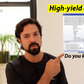

RUQ pain, vomiting, & fever: one question, so much to learn

---

## Epidemiology

* Sex: <u>♀</u> > <u>♂</u>

* <u>Prevalence</u>: most common complication of <u>cholelithiasis</u>

* Peak <u>incidence</u>: > 50 years

Epidemiological data refers to the US, unless otherwise specified.

---

## Etiology

* Acute calculous cholecystitis: most common form [[2]](https://coursology-qbank.com/amboss/article/4zY3G7)

* Cause: obstructing <u>cholelithiasis</u>

* Pathophysiology

* <u>Cholelithiasis</u> → passage of <u>gallstones</u> into the <u>cystic duct</u> → <u>cystic duct</u> obstruction → distention and inflammation of the <u>gallbladder</u>

* Secondary bacterial infection may also be present (<u>E. coli</u>, <u>Klebsiella</u>, <u>Enterobacter</u>, <u>Enterococcus</u> spp. most common) but is not necessary for the development of <u>cholecystitis</u>.

* <u>Acalculous cholecystitis</u>: 5–10% of acute <u>cholecystitis</u> [[3]](https://coursology-qbank.com/amboss/article/rhaf24)
* See ”<u>Acalculous cholecystitis</u>” in “Subtypes and variants” section

> [!TIP]
> Approximately 90% of acute <u>cholecystitis</u> is caused by <u>cholelithiasis</u>. <u>Acalculous cholecystitis</u> accounts for the remaining 10%. [[4]](https://coursology-qbank.com/amboss/article/CBYq17)

---

## Clinical features

* <u>Right upper quadrant</u> <u>pain</u>

* Typically more severe and prolonged (> 6 hours) than in <u>biliary colic</u>

* <u>Postprandial</u>

* Radiation to the right <u>scapula</u> (due to <u>referred pain</u> from <u>phrenic nerve</u> irritation)

* Positive Murphy sign: sudden pausing during inspiration upon deep palpation of the <u>RUQ</u> due to <u>pain</u> 
* <u>Murphy sign</u> may be <u>falsely negative</u> in patients > 60 years. [[5]](https://coursology-qbank.com/amboss/article/zRbrpt)[[6]](https://coursology-qbank.com/amboss/article/ZibZJt)

* Guarding

* <u>Fever</u>, <u>malaise</u>, <u>anorexia</u>

* <u>Nausea and vomiting</u>

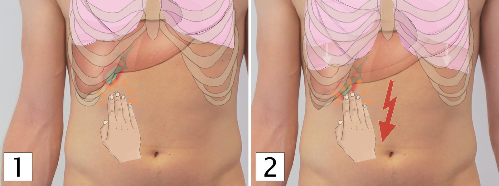

Murphy's sign

Murphy Sign - Clinical Examination

> [!TIP]
> Acute <u>cholecystitis</u> should always be suspected in a patient with a history of <u>gallstones</u> who presents with <u>RUQ</u> <u>pain</u>, <u>fever</u>, and <u>leukocytosis</u>

---

## Subtypes and variants

### Acute acalculous cholecystitis [[3]](https://coursology-qbank.com/amboss/article/rhaf24)[[7]](https://coursology-qbank.com/amboss/article/5Qbi9t)[[8]](https://coursology-qbank.com/amboss/article/4ib37t)[[9]](https://coursology-qbank.com/amboss/article/TQb6vt)

* Description: : an acute life-threatening necroinflammatory disorder of the <u>gallbladder</u>, usually seen in critically ill patients, that is not associated with <u>gallstones</u>

* <u>Incidence</u>

* 5–10% of acute <u>cholecystitis</u> in adults [[3]](https://coursology-qbank.com/amboss/article/rhaf24)

* > 50% of <u>acute cholecystitis in children</u> [[10]](https://coursology-qbank.com/amboss/article/5DdiUH0)

* Etiology: : conditions predisposing to <u>bile</u> stasis and reduced <u>perfusion</u> of the <u>gallbladder</u>

* Risk factors for acalculous cholecystitis [[3]](https://coursology-qbank.com/amboss/article/rhaf24)[[9]](https://coursology-qbank.com/amboss/article/TQb6vt)

* <u>Multiorgan failure</u> (critically ill patients)

* Severe trauma, <u>burns</u>

* <u>Surgery</u>

* Infection (e.g., <u>CMV</u>)

* <u>Sepsis</u>, <u>septic shock</u>

* <u>Total parenteral nutrition</u>

* Prolonged <u>fasting</u>

* <u>Immunodeficiency</u>

* Clinical features: similar to <u>acute calculous cholecystitis</u>

* Diagnostics

* <u>Laboratory studies</u> and findings: similar to <u>acute calculous cholecystitis</u>

* Imaging [[9]](https://coursology-qbank.com/amboss/article/TQb6vt)[[11]](https://coursology-qbank.com/amboss/article/9IYNUq) 

* Abdominal <u>ultrasound</u>: preferred initial imaging modality [[8]](https://coursology-qbank.com/amboss/article/4ib37t)[[11]](https://coursology-qbank.com/amboss/article/9IYNUq)
* Supportive findings

* Signs of <u>gallbladder</u> inflammation: <u>gallbladder</u> wall thickening (> 3–5 mm), pericholecystic fluid

* No evidence of <u>cholelithiasis</u> (sludge may be present)

* <u>HIDA scan</u>: preferred confirmatory imaging modality if <u>ultrasound</u> is inconclusive  [[3]](https://coursology-qbank.com/amboss/article/rhaf24)[[9]](https://coursology-qbank.com/amboss/article/TQb6vt)[[11]](https://coursology-qbank.com/amboss/article/9IYNUq)
* Supportive findings: similar to <u>acute calculous cholecystitis</u> (see <u>HIDA scan</u> in “Diagnostics” section)

* CT abdomen with IV contrast: an alternative to <u>HIDA</u> in patients with inconclusive <u>ultrasound</u> findings
* Supportive findings: similar to those on <u>ultrasound</u>

* Treatment [[7]](https://coursology-qbank.com/amboss/article/5Qbi9t)[[9]](https://coursology-qbank.com/amboss/article/TQb6vt)

* Initial supportive management: <u>NPO</u>, <u>IV fluids</u>, <u>analgesics</u> (see ''Treatment'' in ''<u>Acute calculous cholecystitis</u>” for details)

* IV <u>antibiotics</u>: see “<u>Empiric antibiotic therapy for acute biliary infection</u>”

* Source control

* Low surgical risk: emergency <u>laparoscopic cholecystectomy</u>

* High surgical risk: <u>percutaneous cholecystostomy</u> 
* If patients do not improve within 2–3 days, <u>cholecystectomy</u> should be performed.

> [!TIP]
> Suspect <u>acalculous cholecystitis</u> in any critically ill patient with <u>fever</u> and <u>RUQ</u> tenderness.

### Emphysematous cholecystitis (EC) [[8]](https://coursology-qbank.com/amboss/article/4ib37t)[[12]](https://coursology-qbank.com/amboss/article/tMYXqp)[[13]](https://coursology-qbank.com/amboss/article/VQbGEt)

* Description: : a rare but life-threatening form of acute <u>cholecystitis</u> characterized by air within the <u>gallbladder</u> wall that is caused by gas-forming bacteria (e.g., <u>Clostridium</u> spp., <u>E.coli</u>)

* <u>Epidemiology</u>: : rare; most commonly seen in older men with <u>diabetes</u> (esp. 50–70 years of age) [[13]](https://coursology-qbank.com/amboss/article/VQbGEt)

* Pathophysiology [[8]](https://coursology-qbank.com/amboss/article/4ib37t)[[13]](https://coursology-qbank.com/amboss/article/VQbGEt)

* Primary vascular compromise in the <u>gallbladder</u> (i.e., occlusion of the <u>cystic artery</u>) → <u>ischemia</u> of the <u>gallbladder</u> wall → <u>necrosis</u> → <u>proliferation</u> of gas-forming bacteria within the <u>gallbladder</u> wall or lumen

* Pathogens

* Most common: <u>Clostridium</u> species, <u>Escherichia coli</u>

* Others: <u>Proteus vulgaris</u>, <u>Klebsiella aerogenes</u>, <u>Staphylococcus aureus</u>, <u>Streptococcus</u> species, <u>Klebsiella</u>, <u>Bacteroides fragilis</u>

* <u>Risk factors</u> [[14]](https://coursology-qbank.com/amboss/article/G3bBPt)

* <u>Hyperglycemia</u> (e.g., <u>diabetes mellitus</u>)

* <u>Immunosuppression</u>

* Vascular disease (e.g., <u>atherosclerosis</u>, <u>arterial embolism</u>, <u>vasculitis</u>)

* Abdominal <u>surgery</u>, and trauma

* Clinical features [[13]](https://coursology-qbank.com/amboss/article/VQbGEt)

* Similar to <u>acute calculous cholecystitis</u>: <u>fever</u>, <u>RUQ</u> <u>pain</u>, <u>referred pain</u>

* Symptoms progress rapidly. [[12]](https://coursology-qbank.com/amboss/article/tMYXqp)

* Associated with early <u>gangrene</u> and <u>gallbladder perforation</u>

* Diagnostics

* <u>Laboratory studies</u> and findings: similar to those of <u>acute calculous cholecystitis</u>

* Imaging: The characteristic feature of EC on imaging is air within the <u>gallbladder</u> wall or lumen. [[8]](https://coursology-qbank.com/amboss/article/4ib37t)[[13]](https://coursology-qbank.com/amboss/article/VQbGEt)

* <u>RUQ</u> <u>ultrasound</u> : <u>hyperechoic</u> air shadows within the <u>gallbladder</u> wall, and within <u>bile</u> in the <u>gallbladder</u> lumen  [[12]](https://coursology-qbank.com/amboss/article/tMYXqp)[[13]](https://coursology-qbank.com/amboss/article/VQbGEt)

* Noncontrast CT abdomen : <u>radiolucent</u> shadows within the <u>gallbladder</u> wall, within <u>bile</u>, and within pericholecystic fluid [[12]](https://coursology-qbank.com/amboss/article/tMYXqp)

* <u>MRI</u> abdomen : <u>hypointense</u> (signal void) areas within the <u>gallbladder</u> wall

* <u>Abdominal x-ray</u> : <u>radiolucent</u> rim outlining the <u>gallbladder</u> (pear-shaped <u>radiolucency</u>)

* Treatment [[13]](https://coursology-qbank.com/amboss/article/VQbGEt)[[15]](https://coursology-qbank.com/amboss/article/2QbTvt)

* Initial supportive management: <u>NPO</u>, <u>IV fluids</u>, <u>analgesics</u> (see ''Treatment'' section)

* <u>Broad-spectrum IV antibiotics</u> with anaerobic coverage: See Grade III <u>community-acquired infection</u> in “<u>Empiric antibiotic therapy for acute biliary infection</u>.”

* Emergency source control procedure

* Low surgical risk: emergency <u>laparoscopic cholecystectomy</u>

* High surgical risk: <u>gallbladder drainage</u>

---

## Diagnosis

The <u>diagnosis of acute cholecystitis</u> is based on characteristic clinical features, systemic signs of inflammation (<u>leukocytosis</u>, ↑ <u>CRP</u>),;  and evidence of <u>gallbladder</u> inflammation on imaging.

> [!WARNING]
> <u>Fever</u> and <u>tachycardia</u> are commonly absent in acute <u>cholecystitis</u>; maintain a high index of clinical suspicion! [[16]](https://coursology-qbank.com/amboss/article/35YSPp)

### Approach

* Initial evaluation: <u>laboratory studies</u> and <u>RUQ</u> <u>ultrasound</u> (consider <u>biliary POCUS</u> if available)

* If <u>ultrasound</u> findings are inconclusive, consider abdominal <u>CT scan</u>, abdominal <u>MRI</u>, <u>MRCP</u>, or <u>HIDA scan</u> to confirm the diagnosis.  [[17]](https://coursology-qbank.com/amboss/article/sidtGp0)

* Assess for <u>choledocholithiasis</u> (see “<u>Diagnosis of choledocholithiasis</u>”).

* Once the diagnosis is confirmed, determine the severity (see “<u>Severity grading of acute cholecystitis</u>”).

|  Diagnostic criteria for acute cholecystitis [[12]](https://coursology-qbank.com/amboss/article/tMYXqp)  |  |
| --- | --- |
| Local signs of inflammation |   * <u>Murphy sign</u>  * <u>RUQ</u> <u>pain</u>, tenderness, or mass    |
| Systemic signs of inflammation |   * <u>Fever</u>  * ↑ <u>CRP</u>  * <u>Leukocytosis</u>    |
| Imaging findings |  * Any imaging finding characteristic of acute <u>cholecystitis</u> (see ''Imaging'' section)   |
|  Interpretation   * Suspected diagnosis: ≥ 1 local sign of inflammation PLUS ≥ 1 systemic sign of inflammation  * Definite diagnosis: ≥ 1 local sign of inflammation PLUS ≥ 1 sign of systemic inflammation PLUS any characteristic imaging finding     |  |

### <u>Laboratory studies</u> [[12]](https://coursology-qbank.com/amboss/article/tMYXqp)[[18]](https://coursology-qbank.com/amboss/article/8eYO0o)

* Tests to support the <u>clinical diagnosis</u>

* <u>CBC</u>: <u>Leukocytosis</u> is most common, but <u>WBC count</u> may be normal in up to 40% of patients. [[16]](https://coursology-qbank.com/amboss/article/35YSPp)

* <u>CRP</u>: elevated

* <u>Blood cultures</u>: should be obtained, especially in patients with <u>grade III acute cholecystitis</u> (see “<u>Severity grading of acute cholecystitis</u>”) [[19]](https://coursology-qbank.com/amboss/article/5mYiTp)

* <u>Bile</u> cultures: should be obtained in grade II-III acute <u>cholecystitis</u> in patients undergoing <u>laparoscopic cholecystectomy</u> or <u>gallbladder drainage</u>  [[19]](https://coursology-qbank.com/amboss/article/5mYiTp)[[20]](https://coursology-qbank.com/amboss/article/uodpdI0)

* Tests to assess the severity of disease (see “<u>Severity grading of acute cholecystitis</u>”)

* <u>Blood gas analysis</u>: <u>PaO2/FiO2</u> <u>ratio</u> < 300 in severely ill patients

* <u>BMP</u>: <u>AKI</u>, <u>electrolyte</u> derangements may be present in patients with severe disease

* <u>PT</u>/<u>INR</u>: <u>coagulopathy</u> in patients with severe disease

* Tests to rule out related biliary comorbidities: should be obtained in all patients with suspected <u>cholecystitis</u>

* <u>LFTs</u> [[18]](https://coursology-qbank.com/amboss/article/8eYO0o)[[21]](https://coursology-qbank.com/amboss/article/CgbqxG)

* Mild elevations in <u>AST</u> and <u>ALT</u> are possible in acute <u>cholecystitis</u>.

* Signs of <u>cholestasis</u> (↑ <u>bilirubin</u>, ↑ <u>ALP</u>, ↑ <u>GGT</u>) are uncommon in <u>cholecystitis</u>; if present consider <u>biliary obstruction</u> (see ''<u>Diagnosis of choledocholithiasis</u>'' and ''<u>Cholangitis</u>'')

* <u>Lipase</u>, <u>amylase</u>

* Mild elevation of <u>amylase</u> may be seen in acute <u>cholecystitis</u> [[22]](https://coursology-qbank.com/amboss/article/webhaG)

* Elevation of <u>lipase</u> or <u>amylase</u> ≥ 3 times the normal is suggestive of acute <u>biliary pancreatitis</u>.

* Tests to rule out differential diagnoses: See “<u>Diagnostic workup of acute abdominal pain</u>.”

### Imaging [[11]](https://coursology-qbank.com/amboss/article/9IYNUq)[[12]](https://coursology-qbank.com/amboss/article/tMYXqp)

#### <u>RUQ</u> transabdominal <u>ultrasound</u>

See also “<u>Biliary point-of-care ultrasound</u>.”

* Indications: preferred initial imaging modality in suspected acute <u>cholecystitis</u> [[11]](https://coursology-qbank.com/amboss/article/9IYNUq)[[12]](https://coursology-qbank.com/amboss/article/tMYXqp)

* Characteristic findings [[12]](https://coursology-qbank.com/amboss/article/tMYXqp)

* Sonographic features of gallbladder inflammation

* <u>Gallbladder</u> wall thickening > 3–5 mm [[8]](https://coursology-qbank.com/amboss/article/4ib37t)

* <u>Gallbladder</u> distention (8–10 x 4 cm) [[12]](https://coursology-qbank.com/amboss/article/tMYXqp)[[23]](https://coursology-qbank.com/amboss/article/0ibeJt)

* <u>Gallbladder</u> wall <u>edema</u> (double-wall sign): The innermost and outermost layers appear <u>hyperechoic</u>; <u>edematous</u> tissue appears as a <u>hypoechoic</u> layer in between.

* Sonographic Murphy sign: Tenderness upon compression of the <u>gallbladder</u> with the <u>ultrasound</u> transducer

* Pericholecystic free fluid

* Presence of <u>gallstones</u> and/or <u>biliary sludge</u> (see “<u>Cholelithiasis</u>” for details)

* In <u>emphysematous cholecystitis</u>, mural air appears as <u>hyperechoic</u> shadows within the <u>gallbladder</u> wall. [[8]](https://coursology-qbank.com/amboss/article/4ib37t)

* Important consideration: The <u>CBD</u> should be assessed for <u>choledocholithiasis</u> (see ''<u>Diagnosis of choledocholithiasis</u>” for further details).

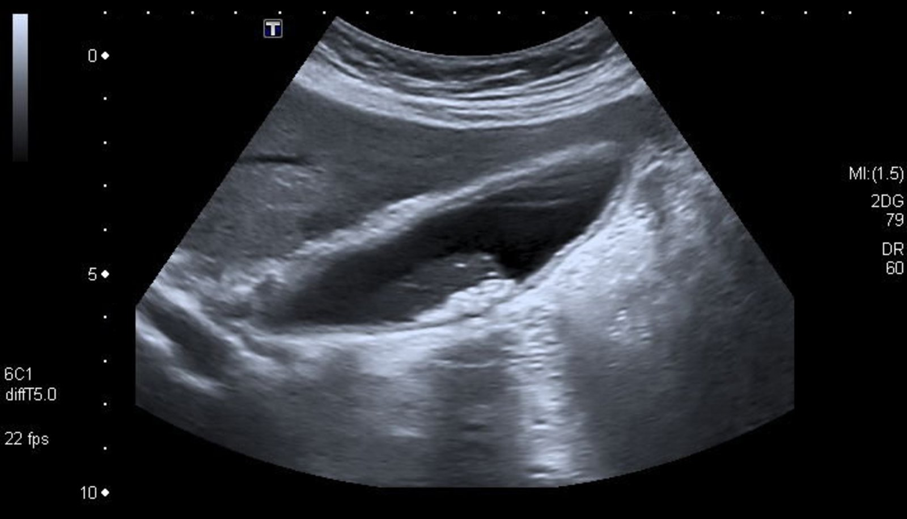

Gallbladder calculi and wall thickening

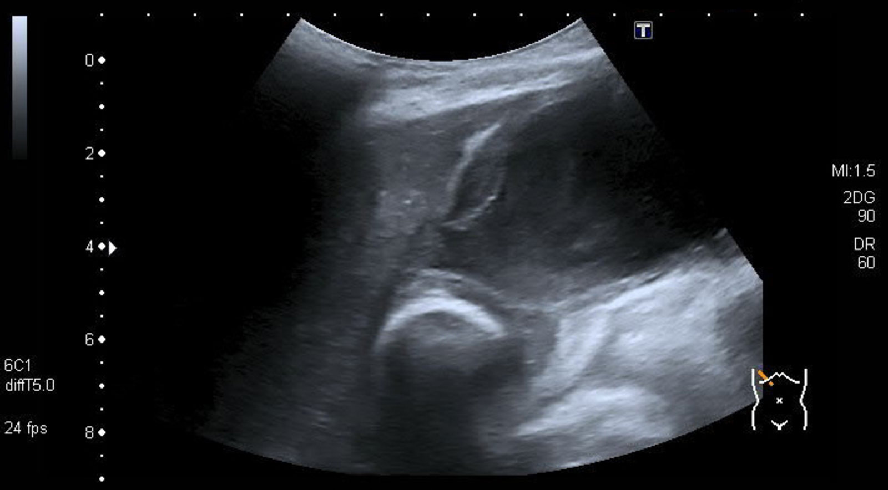

Acute calculous cholecystitis

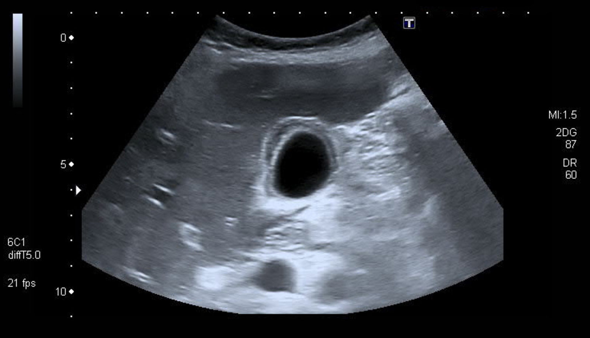

Gallbladder wall thickening

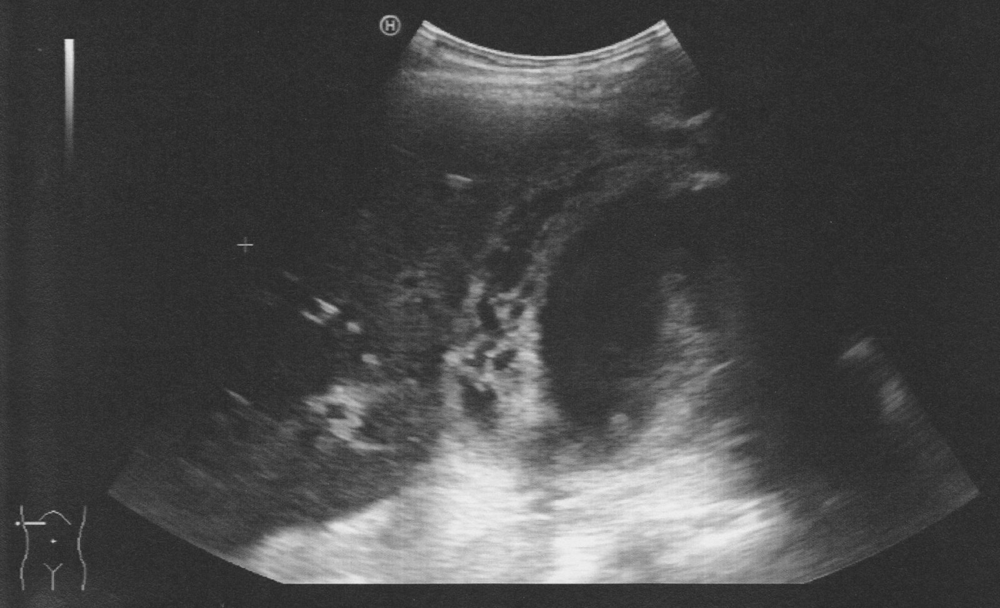

Acute cholecystitis

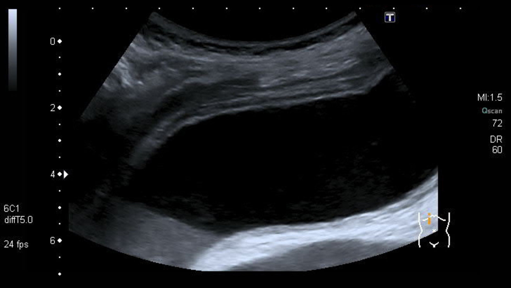

Acute acalculous cholecystitis with sludge

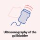

Point of Care Ultrasound of the Gallbladder - AMBOSS Video

#### Cholescintigraphy [[3]](https://coursology-qbank.com/amboss/article/rhaf24)[[11]](https://coursology-qbank.com/amboss/article/9IYNUq)[[24]](https://coursology-qbank.com/amboss/article/jib_rt)

Commonly referred to as <u>hepatobiliary iminodiacetic acid scintigraphy</u> or a <u>HIDA scan</u>.

* Indications: : preferred <u>confirmatory test</u> for suspected uncomplicated acute <u>cholecystitis</u> if <u>ultrasound</u> findings are inconclusive [[11]](https://coursology-qbank.com/amboss/article/9IYNUq)

* Procedure: The radioactive tracer <u>99mTc</u>-hepatic iminodiacetic acid is injected intravenously → selective uptake by <u>hepatocytes</u> → subsequent excretion into <u>bile</u> → <u>bile</u> with radiotracer enters the <u>gallbladder</u> if the <u>cystic duct</u> is patent → visualization of tracer within the <u>gallbladder</u> via a gamma camera [[3]](https://coursology-qbank.com/amboss/article/rhaf24)

* Advantages

* High <u>sensitivity</u> (96%) and <u>specificity</u> (90%); considered the <u>gold standard test</u> to diagnose acute <u>cholecystitis</u> [[24]](https://coursology-qbank.com/amboss/article/jib_rt)[[25]](https://coursology-qbank.com/amboss/article/qibCst)

* Can differentiate between acute and <u>chronic cholecystitis</u>

* Disadvantages

* Time-consuming

* Cannot identify complications of acute <u>cholecystitis</u>, if present

* Cannot be used to evaluate for potential differential diagnoses

* May not be widely available

* Characteristic findings

* Normal: <u>gallbladder</u> visualized within 4 hours of administration of radioactive tracer

* Acute <u>cholecystitis</u>: <u>gallbladder</u> is not visualized within 4 hours  [[3]](https://coursology-qbank.com/amboss/article/rhaf24)

#### <u>MRI</u> abdomen without and with IV contrast  [[11]](https://coursology-qbank.com/amboss/article/9IYNUq)[[23]](https://coursology-qbank.com/amboss/article/0ibeJt)[[26]](https://coursology-qbank.com/amboss/article/PibW7t)

* Indications

* Alternative to CT or <u>HIDA scan</u> in suspected acute <u>cholecystitis</u> with inconclusive <u>ultrasound</u> findings

* Either of the following in patients with <u>contraindications to CT</u>: [[8]](https://coursology-qbank.com/amboss/article/4ib37t)[[21]](https://coursology-qbank.com/amboss/article/CgbqxG)

* Suspected complications of <u>cholecystitis</u>

* Clinical <u>diagnosis of acute cholecystitis</u> unclear

* Suspected <u>choledocholithiasis</u> (<u>MRCP</u>)  [[21]](https://coursology-qbank.com/amboss/article/CgbqxG)

* Characteristic findings: Similar to <u>ultrasound</u> findings

* <u>Hyperintensity</u> (T2) of the <u>gallbladder</u> wall and pericholecystic region, indicating inflammation

* Evidence of <u>choledocholithiasis</u>, if present (see ''<u>Diagnosis of choledocholithiasis</u>” for further details)

* Evidence of complications, such as <u>emphysematous cholecystitis</u>, <u>empyema</u> <u>gallbladder</u>, and <u>gallbladder perforation</u> (see ''Complications'' section)

#### CT abdomen with IV contrast [[3]](https://coursology-qbank.com/amboss/article/rhaf24)[[8]](https://coursology-qbank.com/amboss/article/4ib37t)

* Indications

* An alternative to <u>MRI</u> or <u>HIDA scan</u> in suspected acute <u>cholecystitis</u> with inconclusive <u>ultrasound</u> findings [[11]](https://coursology-qbank.com/amboss/article/9IYNUq)[[26]](https://coursology-qbank.com/amboss/article/PibW7t)

* Suspected <u>emphysematous cholecystitis</u>  [[12]](https://coursology-qbank.com/amboss/article/tMYXqp)

* Suspected complications of acute <u>cholecystitis</u> [[8]](https://coursology-qbank.com/amboss/article/4ib37t)[[12]](https://coursology-qbank.com/amboss/article/tMYXqp)

* Clinical <u>diagnosis of acute cholecystitis</u> unclear [[3]](https://coursology-qbank.com/amboss/article/rhaf24)[[8]](https://coursology-qbank.com/amboss/article/4ib37t)

* Characteristic findings: similar to those on <u>ultrasound</u> and <u>MRI</u>

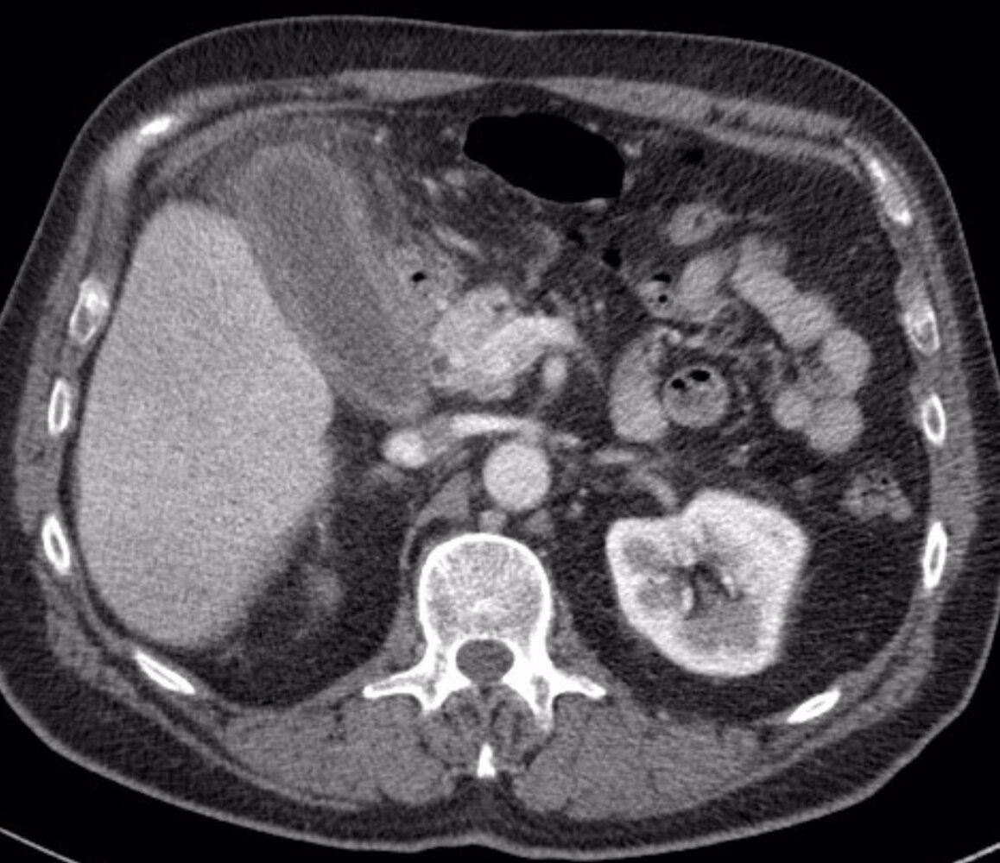

Acute acalculous cholecystitis

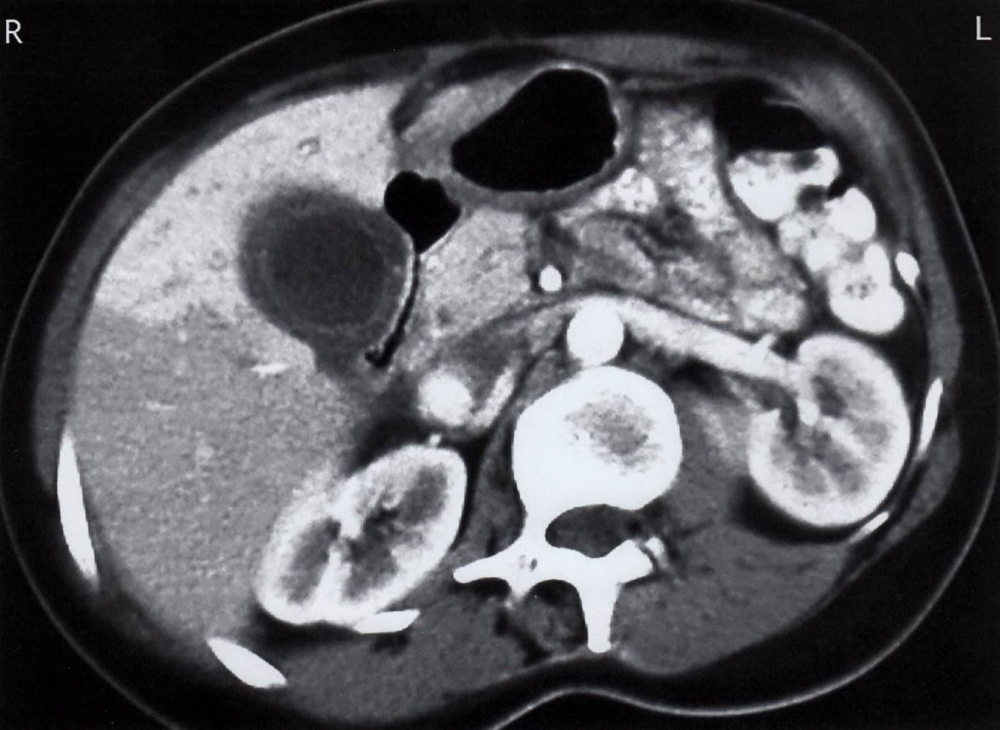

Acute cholecystitis

---

## Treatment

<u>Empiric antibiotic therapy</u> and <u>cholecystectomy</u> are the mainstays of treatment for acute <u>cholecystitis</u> after initial supportive therapy.

### Initial management [[19]](https://coursology-qbank.com/amboss/article/5mYiTp)[[27]](https://coursology-qbank.com/amboss/article/HibKGt)[[28]](https://coursology-qbank.com/amboss/article/-lYDz6)

* Screen patients for <u>signs of sepsis</u> or <u>shock</u>.

* Provide <u>immediate hemodynamic support</u> (e.g., <u>IV fluid resuscitation</u>) and <u>respiratory support</u> (e.g., <u>oxygen therapy</u>) if necessary.

* Start <u>empiric antibiotic therapy for acute biliary infection</u>.

* Provide <u>initial supportive therapy for acute biliary disease</u>: e.g., <u>analgesia</u>, <u>antiemetics</u>, <u>electrolyte repletion</u>, consider <u>NG tube insertion</u>.

* Maintain <u>NPO</u> status.

* Consult general <u>surgery</u> to determine:

* Surgical risk using the <u>ASA-PS</u>  or <u>Charlson comorbidity index</u> (<u>CCI</u>).

* Definitive management and disposition based on <u>severity grading of acute cholecystitis</u> and risk of complications (see “Disposition”).

* Identify and treat concurrent <u>choledocholithiasis</u> (see “<u>Diagnosis of choledocholithiasis</u>”).

* Monitoring and reevaluation 

* Adjust monitoring level to individual patient needs.

* If there is early deterioration, perform <u>ABCDE assessment</u>.

* Consider the development of complications (e.g., <u>gallbladder perforation</u>) or other differential diagnoses (e.g., <u>acute cholangitis</u>).

* Consider <u>ICU</u> consult.

ASA physical status

### Definitive management [[27]](https://coursology-qbank.com/amboss/article/HibKGt)[[28]](https://coursology-qbank.com/amboss/article/-lYDz6)[[29]](https://coursology-qbank.com/amboss/article/FMYgqp)[[30]](https://coursology-qbank.com/amboss/article/8MYOqp)

The initial procedure and duration of <u>antibiotic therapy</u> depend on <u>severity grading of acute cholecystitis</u>, patient's individual surgical risk, and presence of complications.

* <u>Laparoscopic cholecystectomy</u>

* Preferred approach if expertise is available

* Perform as soon as possible, unless operative and anesthesia risks outweigh the benefits of urgent <u>surgery</u>.

* Conversion to <u>open cholecystectomy</u> may be required depending on intraoperative findings [[27]](https://coursology-qbank.com/amboss/article/HibKGt)

* <u>Gallbladder drainage</u> procedures (e.g., <u>percutaneous cholecystostomy</u>) typically performed as a temporizing measure for:

* Unstable or clinically deteriorating patients: e.g., grade II–III acute <u>cholecystitis</u>   [[30]](https://coursology-qbank.com/amboss/article/8MYOqp)[[31]](https://coursology-qbank.com/amboss/article/ZQbZut)

* Frail patients or those at high risk of surgical complications

* Postprocedural <u>antibiotics</u>

* Consider prolonging the duration of therapy (beyond the standard recommendation) in patients with:

* <u>Signs of sepsis</u> (e.g., persistent <u>fever</u>, stable or increasing <u>leukocytosis</u>)

* Evidence of <u>biliary tract obstruction</u>

* Complications (e.g., pericholecystic <u>abscess</u>).

* Tailor agent to <u>bile</u> and/or <u>blood cultures</u> as soon as available.

> [!TIP]
> Perform preoperative or postoperative stone extraction in patients with concurrent <u>choledocholithiasis</u>.

#### <u>Grade I acute cholecystitis</u>

* Low surgical risk

* <u>Early laparoscopic cholecystectomy</u>

* Postoperative <u>antibiotics</u> not required

* High surgical risk 

* Early intervention

* <u>Early laparoscopic cholecystectomy</u>

* Discontinue <u>antibiotics</u> 24 hours after <u>surgery</u>.

* OR conservative approach

* Continue <u>antibiotics</u> until symptomatic improvement  [[27]](https://coursology-qbank.com/amboss/article/HibKGt)[[28]](https://coursology-qbank.com/amboss/article/-lYDz6)

* Arrange <u>interval cholecystectomy</u>

#### <u>Grade II acute cholecystitis</u>

* Improvement with initial management

* Low surgical risk

* <u>Early laparoscopic cholecystectomy</u>

* Discontinue <u>antibiotics</u> 24 hours after <u>surgery</u>.

* High surgical risk :

* Continue <u>antibiotics</u> until symptomatic improvement.

* Arrange <u>interval cholecystectomy</u>

* Deterioration despite initial management

* Urgent <u>gallbladder drainage</u> followed by <u>interval cholecystectomy</u>

* Continue <u>antibiotics</u> for a total of 7 days. [[32]](https://coursology-qbank.com/amboss/article/cmbae8)

#### <u>Grade III acute cholecystitis</u>

* Low surgical risk

* <u>Early laparoscopic cholecystectomy</u> if there is an adequate response to initial <u>supportive care</u>

* Continue <u>antibiotics</u> for 4–7 days after <u>surgery</u>. [[33]](https://coursology-qbank.com/amboss/article/1Qb2Et)

* High surgical risk 

* Urgent <u>gallbladder drainage</u>, followed by:

* <u>Interval cholecystectomy</u>

* OR observation

* Continue <u>antibiotics</u> for a total of 7 days. [[32]](https://coursology-qbank.com/amboss/article/cmbae8)

ASA physical status

### Procedures

#### <u>Laparoscopic cholecystectomy</u>

* Indication: <u>gold standard</u> of treatment for <u>acute calculous cholecystitis</u> [[27]](https://coursology-qbank.com/amboss/article/HibKGt)

* Timing: depends on surgical and anesthesia risks, disease severity, and symptom duration

* Early laparoscopic cholecystectomy: performed within 10 days of symptom onset; preferably within the initial 24–72 hours  [[27]](https://coursology-qbank.com/amboss/article/HibKGt)[[29]](https://coursology-qbank.com/amboss/article/FMYgqp)

* Indication: symptom duration of ≤ 10 days in patients with low surgical and anesthesia risk(s) [[27]](https://coursology-qbank.com/amboss/article/HibKGt)

* Contraindications

* High surgical or anesthesia risks

* Symptom duration > 10 days

* Interval laparoscopic cholecystectomy (delayed lap. chole)

* Performed 45 days after resolution of symptoms  [[27]](https://coursology-qbank.com/amboss/article/HibKGt)

* Indications

* High surgical or anesthesia risk

* Symptom duration > 10 days

#### <u>Gallbladder drainage</u>

* Indication: temporizing, minimally invasive measures in high surgical-risk patients not responding to <u>conservative management</u> [[34]](https://coursology-qbank.com/amboss/article/DyY1h7)

* Contraindication: uncontrolled <u>bleeding diathesis</u>

* Options

* Percutaneous cholecystostomy: image-guided placement of a catheter (<u>cholecystostomy</u> tube) into the <u>gallbladder</u> under <u>local anesthesia</u> through the abdominal wall to provide biliary drainage  [[34]](https://coursology-qbank.com/amboss/article/DyY1h7)[[35]](https://coursology-qbank.com/amboss/article/-ibD8t)

* Endoscopic <u>gallbladder</u> <u>stenting</u>: may be preferred over <u>percutaneous cholecystostomy</u> if endoscopy operator expertise is available as it is less invasive. [[36]](https://coursology-qbank.com/amboss/article/0Qbeut)[[37]](https://coursology-qbank.com/amboss/article/aQbQut)[[38]](https://coursology-qbank.com/amboss/article/YQbnut)

### Disposition [[28]](https://coursology-qbank.com/amboss/article/-lYDz6)

All patients with acute <u>cholecystitis</u> require inpatient management.

* <u>Grade I acute cholecystitis</u>: <u>healthcare facility</u> with the ability to perform <u>laparoscopic cholecystectomy</u>

* <u>Grade II acute cholecystitis</u>: advanced <u>healthcare facility</u> with access to urgent <u>gallbladder drainage</u> and surgical expertise to handle a difficult <u>laparoscopic cholecystectomy</u>.

* <u>Grade III acute cholecystitis</u>: same as for grade II PLUS access to intensive care.

---

## Antibiotic therapy for acute biliary infection

### General principles [[19]](https://coursology-qbank.com/amboss/article/5mYiTp)

* Important considerations

* Obtain <u>blood cultures</u> prior to administering <u>antibiotics</u>, especially in patients with severe biliary infection.

* Obtain <u>bile</u> cultures at the beginning of any drainage procedure.

* Tailor <u>antibiotic therapy</u> to <u>sensitivity</u> reports as early as possible. [[33]](https://coursology-qbank.com/amboss/article/1Qb2Et)

* Switch to oral <u>antibiotics</u>, if feasible, once improvement is evident. [[39]](https://coursology-qbank.com/amboss/article/KjbUYF)

* Required coverage

* Gram-negative coverage: <u>Escherichia coli</u> (most common), <u>Klebsiella</u> spp., <u>Enterobacter</u> spp., <u>Pseudomonas</u> spp.

* Anaerobic coverage  is recommended if biliary-<u>enteric</u> <u>anastomosis</u> is suspected or identified.

* Consider <u>Enterococcus</u> spp. coverage  in grade III community-acquired and <u>healthcare-associated infection</u>.

* Choice of <u>empiric antibiotic</u>: should be determined by the following parameters

* Community-acquired or <u>healthcare-associated infection</u>

* Severity of infection (see “<u>Severity grading of acute cholecystitis</u>” or “<u>Severity grading of acute cholangitis</u>” for details on grading)

* Local resistance patterns (local <u>antibiogram</u>)

* If a biliary-<u>enteric</u> <u>anastomosis</u> is suspected

* Timing of <u>antibiotic</u> administration

* <u>Septic shock</u>: within one hour of presentation

* Other patients: within six hours of presentation

* Duration of therapy

* <u>Grade I acute cholecystitis</u>, <u>grade II acute cholecystitis</u>: up to 24 hours after early lap. chole.

* <u>Grade III acute cholecystitis</u> and all grades of community-acquired <u>acute cholangitis</u>: 4–7 days after early lap. chole or until symptomatic improvement (if patient is <u>managed conservatively</u>).

* For patients who undergo urgent <u>gallbladder drainage</u>: continue <u>antibiotics</u> for a total of 7 days.  [[32]](https://coursology-qbank.com/amboss/article/cmbae8)

* All grades of healthcare-associated <u>cholangitis</u> and <u>cholecystitis</u> with gram-positive <u>bacteremia</u> known to cause <u>infective endocarditis</u> : consider 14 days of treatment.

### Recommended empiric regimen  [[19]](https://coursology-qbank.com/amboss/article/5mYiTp)

| Empiric antibiotic therapy for acute biliary infection |  |  |  |
| --- | --- | --- | --- |
| Class of infection | Severity of infection |  Suggested single-agent empiric regimen   |  Suggested combination empiric regimen   |
| Community-acquired biliary infection | Grade I |   * <u>Cefoxitin</u> DOSAGE  * <u>Moxifloxacin</u> DOSAGE  * <u>Ertapenem</u> DOSAGE  * <u>Ampicillin-sulbactam</u> (only if local resistance rate < 20%) DOSAGE    |   * <u>Metronidazole</u> DOSAGE or <u>clindamycin</u> DOSAGE  * PLUS any one of the following:  * <u>Cefazolin</u> DOSAGE  * <u>Cefuroxime</u> DOSAGE  * <u>Ceftriaxone</u> DOSAGE  * <u>Cefotaxime</u> DOSAGE  * <u>Ciprofloxacin</u> DOSAGE  * <u>Levofloxacin</u> DOSAGE    |
| Grade II |   * <u>Piperacillin-tazobactam</u> DOSAGE  * <u>Moxifloxacin</u> DOSAGE  * <u>Ertapenem</u> DOSAGE    |   * <u>Metronidazole</u> DOSAGE  * PLUS any one of the following:  * <u>Ceftriaxone</u> DOSAGE  * <u>Cefotaxime</u> DOSAGE  * <u>Cefepime</u> DOSAGE  * <u>Ceftazidime</u> DOSAGE    |  |
| Grade III |   * <u>Piperacillin-tazobactam</u> DOSAGE  * <u>Meropenem</u> DOSAGE  * <u>Ertapenem</u> DOSAGE  * <u>Imipenem</u> DOSAGE    |   * <u>Metronidazole</u> DOSAGE  * PLUS any one of the following:  * <u>Cefepime</u> DOSAGE  * <u>Ceftazidime</u> DOSAGE  * <u>Aztreonam</u> DOSAGE    |  |
|  Healthcare-associated biliary infection  (any grade)  |  |  * Same as grade III community-acquired biliary infection  [[39]](https://coursology-qbank.com/amboss/article/KjbUYF)   |  |
| Suspected <u>multi-drug resistant organism</u> infection |  |   * Same as grade III community-acquired biliary infection  * PLUS any one of the following, depending on the suspected infection:  * Suspected <u>VRE</u>   * <u>Linezolid</u> DOSAGE  * OR <u>daptomycin</u> DOSAGE  * Suspected <u>MRSA</u> : <u>Vancomycin</u> DOSAGE    |  |

> [!WARNING]
> Many <u>ESBL-producing</u> gram-negative organisms are resistant to <u>fluoroquinolones</u>.

> [!WARNING]
> Resistance of <u>E. coli</u> to <u>ampicillin-sulbactam</u> is becoming more common, especially in North America. Consider local resistance rates carefully before choosing an <u>empiric antibiotic</u> regimen.

---

## Complications

### Gangrenous cholecystitis [[8]](https://coursology-qbank.com/amboss/article/4ib37t)[[40]](https://coursology-qbank.com/amboss/article/SQbyvt)[[41]](https://coursology-qbank.com/amboss/article/jQb_Dt)

* Definition: <u>ischemic necrosis</u> of the <u>gallbladder</u>

* Etiology: most common complication of acute <u>cholecystitis</u> [[8]](https://coursology-qbank.com/amboss/article/4ib37t)

* Clinical features: difficult to distinguish from uncomplicated acute <u>cholecystitis</u>

* Imaging

* <u>Ultrasound</u>: <u>features of acute cholecystitis</u> plus echogenic membranes floating within the <u>gallbladder</u> lumen

* CT with IV contrast: nonenhancement of the <u>gallbladder</u> wall

* Treatment: emergency <u>laparoscopic cholecystectomy</u> and <u>empiric antibiotic therapy</u> for biliary infection

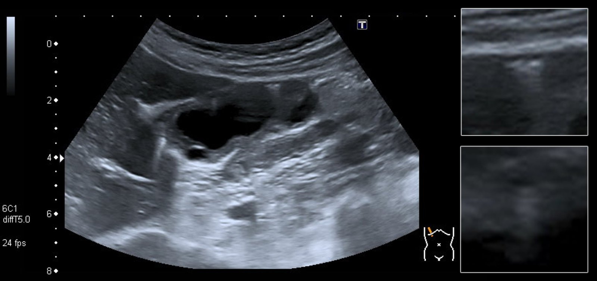

Emphysematous cholecystitis

### Gallbladder perforation [[8]](https://coursology-qbank.com/amboss/article/4ib37t)[[41]](https://coursology-qbank.com/amboss/article/jQb_Dt)[[42]](https://coursology-qbank.com/amboss/article/hQbcDt)

* Definition: break in the continuity of the <u>gallbladder</u> wall, typically as a consequence of <u>ischemic necrosis</u>

* Clinical features: variable; symptoms typically progress rapidly

* May be indistinguishable from uncomplicated acute <u>cholecystitis</u>

* Potentially accompanied by a palpable <u>RUQ</u> mass and/or signs of generalized <u>peritonitis</u>

* Imaging : focal defect in the <u>gallbladder</u> wall; extraluminal stone may be visualized

* Treatment: emergency <u>laparoscopic cholecystectomy</u> and <u>empiric antibiotic therapy</u> for biliary infection

### <u>Cholecystoenteric fistula</u>

* See “<u>Cholecystoenteric fistula</u>” in “<u>Fistula</u>.”

### Gallbladder empyema (<u>suppurative cholecystitis</u>) [[8]](https://coursology-qbank.com/amboss/article/4ib37t)

* Definition: distended <u>pus</u>-filled <u>gallbladder</u>

* Clinical features: similar to uncomplicated acute <u>cholecystitis</u>

* Imaging: <u>gallbladder</u> distention with <u>hyperechoic</u> (on <u>ultrasound</u>) or <u>hyperdense</u> (on CT abdomen with IV contrast) material within its lumen

* Treatment [[43]](https://coursology-qbank.com/amboss/article/kQbmwt)

* <u>Empiric antibiotic therapy</u> for biliary infection

* Emergency source control procedure

* Low surgical risk: <u>laparoscopic cholecystectomy</u>

* High surgical risk: image-guided percutaneous drainage of <u>empyema</u> followed by <u>interval laparoscopic cholecystectomy</u>

### Chronic cholecystitis [[4]](https://coursology-qbank.com/amboss/article/CBYq17)[[8]](https://coursology-qbank.com/amboss/article/4ib37t)[[44]](https://coursology-qbank.com/amboss/article/PQbWwt)

* Definition: <u>chronic inflammation</u> of the <u>gallbladder</u>

* Etiology

* Chronic irritation of <u>gallbladder</u> <u>mucosa</u> by <u>cholelithiasis</u>

* Recurrent attacks of acute <u>cholecystitis</u>

* Clinical features: recurrent symptoms similar to acute <u>cholecystitis</u> but typically less severe and often <u>self-limiting</u>

* Diagnostics

* <u>Laboratory studies</u>: may be normal [[44]](https://coursology-qbank.com/amboss/article/PQbWwt)

* <u>Ultrasound</u> abdomen or CT abdomen with IV contrast:

* Thickened <u>gallbladder</u> wall

* No evidence acute inflammatory changes (e.g., pericholecystic fluid);

* <u>Cholelithiasis</u> commonly present

* <u>HIDA scan</u>: delayed visualization of the <u>gallbladder</u>  [[45]](https://coursology-qbank.com/amboss/article/NQb-wt)

* All patients should also be evaluated for <u>choledocholithiasis</u> before treatment (see ''Imaging'' in “<u>Choledocholithiasis</u>”).

* Treatment: elective <u>laparoscopic cholecystectomy</u> [[8]](https://coursology-qbank.com/amboss/article/4ib37t)[[46]](https://coursology-qbank.com/amboss/article/lQbvwt)

* Complications [[8]](https://coursology-qbank.com/amboss/article/4ib37t)

* Porcelain gallbladder [[8]](https://coursology-qbank.com/amboss/article/4ib37t)[[45]](https://coursology-qbank.com/amboss/article/NQb-wt)[[47]](https://coursology-qbank.com/amboss/article/4Qb3wt)

* Definition: calcification of the <u>gallbladder</u> wall due to <u>chronic inflammation</u>

* Imaging (<u>x-ray</u> or noncontrast CT abdomen): focal or diffuse <u>hyperdensity</u> (<u>radiopaque</u> appearance) of the <u>gallbladder</u> wall

* Clinical significance: a <u>risk factor</u> for <u>gallbladder cancer</u>  [[48]](https://coursology-qbank.com/amboss/article/46d3OI0)

* Treatment: <u>conservative management</u> or <u>laparoscopic cholecystectomy</u> based on symptoms, pattern of <u>gallbladder</u> calcification, and comorbidities [[49]](https://coursology-qbank.com/amboss/article/Eod8dI0)[[50]](https://coursology-qbank.com/amboss/article/vodAdI0)

* <u>Gallbladder cancer</u> [[51]](https://coursology-qbank.com/amboss/article/OQbIwt)

* <u>Cholecystoenteric fistula</u> and <u>gallstone ileus</u>

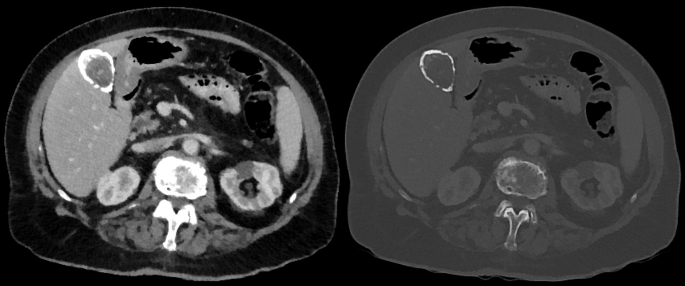

Porcelain gallbladder

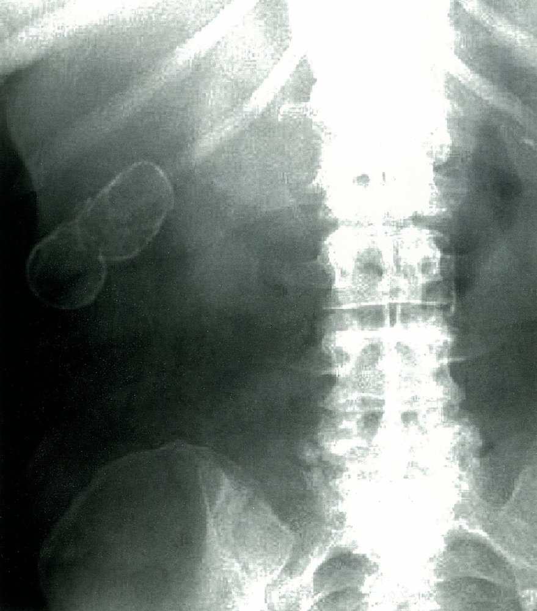

Porcelain gallbladder

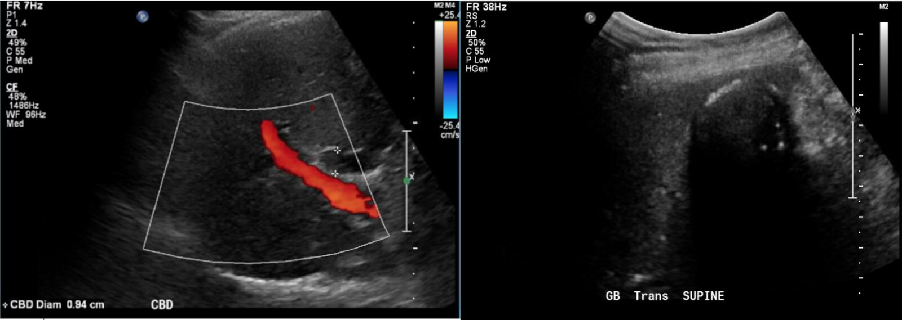

Porcelain gallbladder

> [!TIP]
> <u>Chronic gallbladder inflammation</u> increases the risk of <u>gallbladder carcinoma</u>, especially when <u>porcelain gallbladder</u> is present.

### Other [[8]](https://coursology-qbank.com/amboss/article/4ib37t)

* <u>Gallstone ileus</u>

* Pericholecystic <u>abscess</u>

* <u>Subhepatic abscess</u>

* <u>Pyogenic liver abscess</u>

* Hemorrhagic <u>cholecystitis</u>  [[8]](https://coursology-qbank.com/amboss/article/4ib37t)

* <u>Gallbladder cancer</u>

We list the most important complications. The selection is not exhaustive.

---