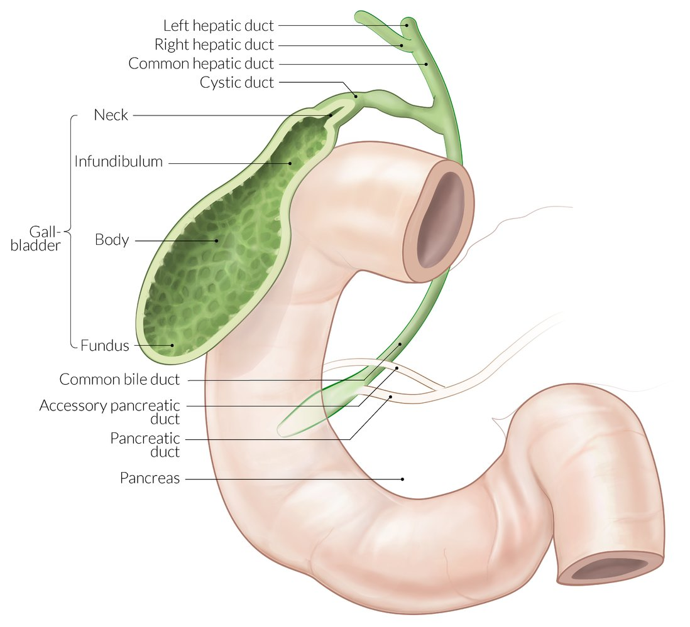
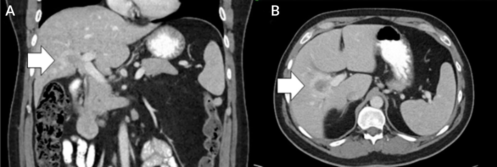
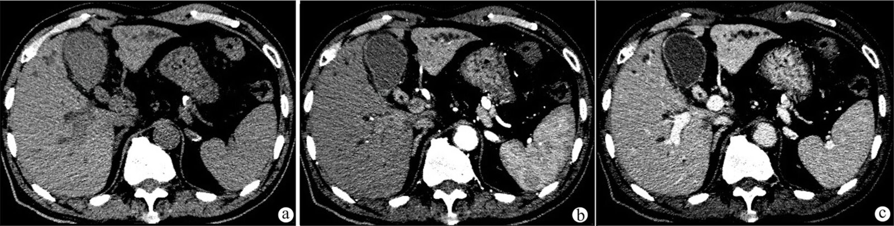
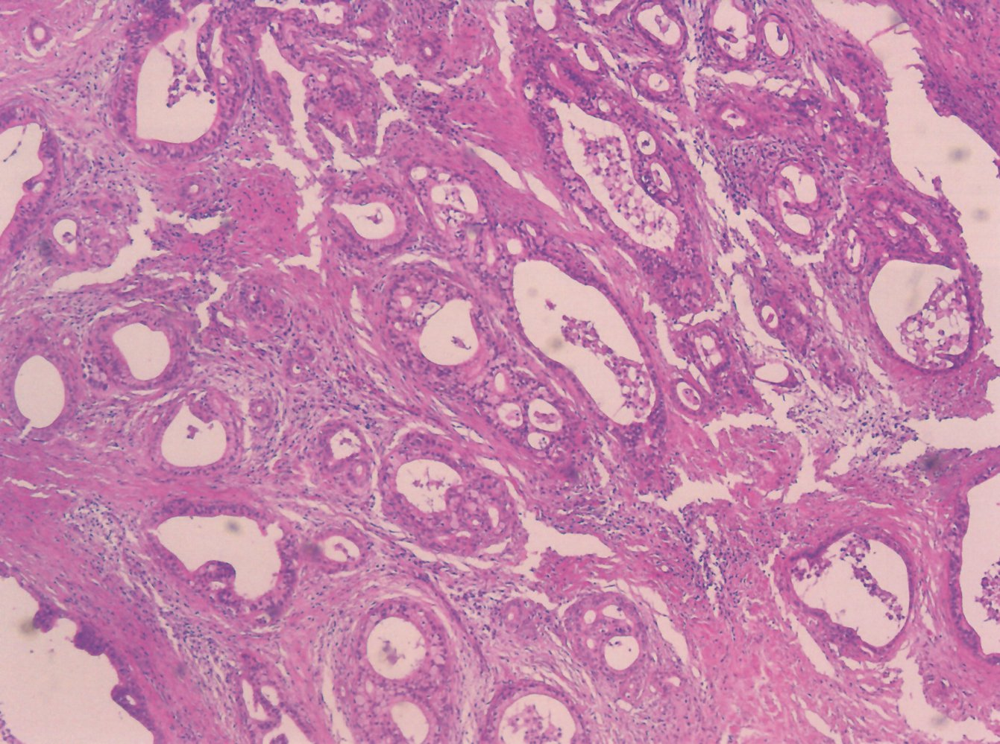
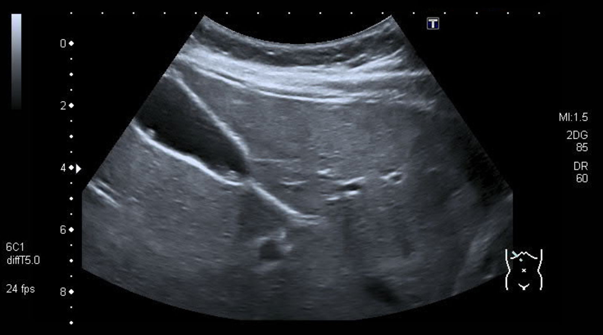
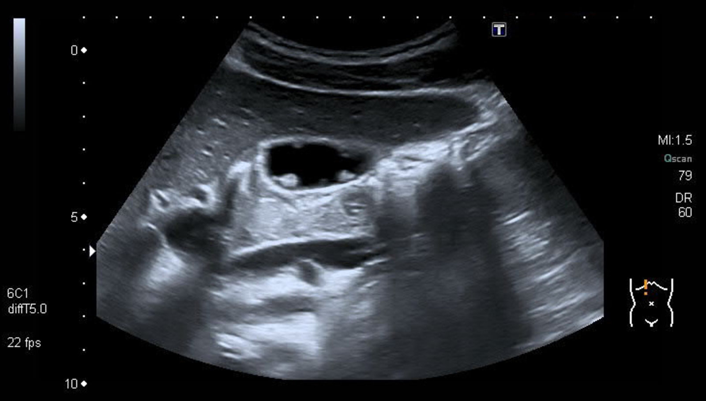
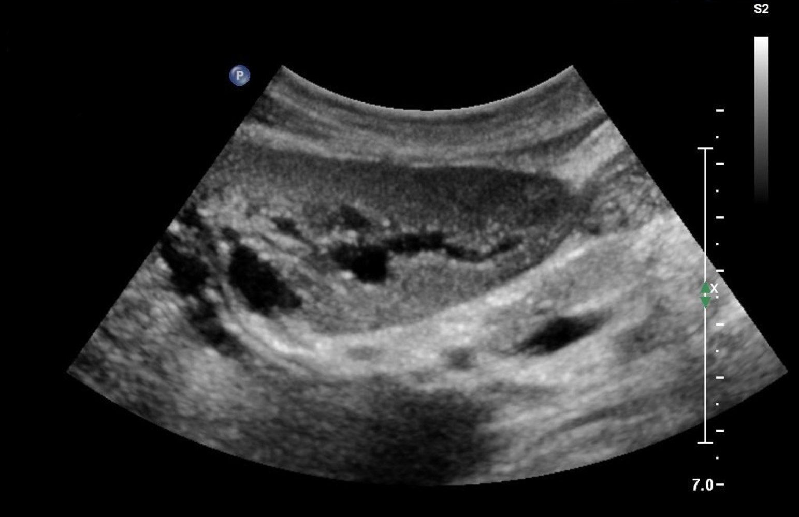

# Biliary cancer

*Categories: Clinical knowledge > Surgery > Abdominal surgery > Pancreas, liver, and bile ducts > Biliary cancer*

[Original Article Link](https://coursology-qbank.com/amboss/article/e30xhf)

---

## Summary

Cancers of the <u>biliary tract</u> are rare and develop in the extrahepatic or intrahepatic <u>bile</u> ducts (<u>cholangiocarcinoma</u>), the <u>gallbladder</u>, or the <u>ampulla of Vater</u> (<u>ampullary cancer</u>). <u>Risk factors</u> include causes of hepatic or <u>biliary tract inflammation</u>, e.g., <u>primary sclerosing cholangitis</u> (<u>PSC</u>), <u>liver</u> <u>flukes</u>, and chronic <u>cholelithiasis</u>. Biliary cancer is typically advanced at diagnosis because symptoms often do not appear until late stages of the disease. Clinical features may be nonspecific and include <u>cholestasis</u>, abdominal <u>pain</u>, <u>gallbladder</u> enlargement, <u>nausea</u>, and weight loss. Initial diagnostic studies include <u>liver chemistries</u> and abdominal <u>ultrasound</u>, followed by <u>cross-sectional imaging</u>, such as <u>MRI</u>/<u>MRCP</u> or <u>multidetector computed tomography</u> (<u>MDCT</u>), and <u>cholangiography</u>. CT chest and abdomen is performed for staging. Tissue sample is obtained via endoscopic or percutaneous <u>biopsy</u> or following surgical resection of the <u>gallbladder</u>. While early-stage disease is treatable with <u>surgery</u> followed by <u>adjuvant chemotherapy</u>, approximately 90% of patients have advanced, unresectable disease at presentation. For these patients, disease progression can be delayed with <u>chemotherapy</u>, targeted treatments, and/or <u>radiotherapy</u>. Patients with <u>biliary obstruction</u> may benefit from biliary decompression and <u>stenting</u>.

Premalignant biliary lesions include cystic <u>gallbladder polyps</u> (common) and <u>biliary cysts</u> (rare). <u>Gallbladder polyps</u> are often detected incidentally and are usually benign. <u>Risk factors</u> for malignant <u>gallbladder polyp</u> include size ≥ 10 mm, patient age ≥ 60 years, and <u>PSC</u>. <u>Biliary cysts</u> are areas of cystic dilatation, typically identified in early childhood. Given the high risk of malignant transformation, surgical excision is advised for <u>biliary cysts</u>.

---

## Cholangiocarcinoma

<u>Cholangiocarcinoma</u> (<u>CCA</u>) is a <u>malignancy</u> of the <u>bile</u> duct.

### <u>Epidemiology</u> [[1]](https://coursology-qbank.com/amboss/article/mmYVTp)

* <u>Incidence</u>: ∼ 1/100,000 per year in the US

* <u>Prevalence</u>: < 1% of all cancers

* Peak <u>incidence</u>: 60–70 years of age

* Sex: <u>♂</u> > <u>♀</u>

### Classification [[1]](https://coursology-qbank.com/amboss/article/mmYVTp)[[2]](https://coursology-qbank.com/amboss/article/Yj0n_f)

* Extrahepatic <u>CCA</u>: 90% of <u>CCA</u> cases 

* Perihilar <u>CCA</u> (Klatskin tumor): junction of the right and left hepatic ducts (50% of cases)

* <u>Distal</u> extrahepatic <u>CCA</u>: <u>common bile duct</u> (40% of cases)

* Intrahepatic <u>CCA</u>: 10% of <u>CCA</u> cases; the second most common intrahepatic <u>malignancy</u> after <u>hepatocellular carcinoma</u> (<u>HCC</u>) [[3]](https://coursology-qbank.com/amboss/article/Da11520)

Extrahepatic biliary tree

### <u>Risk factors</u> [[1]](https://coursology-qbank.com/amboss/article/mmYVTp)[[4]](https://coursology-qbank.com/amboss/article/gk0FMT)[[5]](https://coursology-qbank.com/amboss/article/NmY-fp)

* <u>PSC</u>

* <u>Liver</u> <u>fluke</u> infection, e.g., <u>Clonorchis sinensis</u>, Opisthorchis viverrini

* <u>Cholelithiasis</u>

* <u>Chronic liver disease</u>

* Chronic viral <u>hepatitis</u>, e.g., <u>HBV</u>, <u>HCV</u>

* Environmental toxin exposure, e.g., <u>asbestos</u>, thorium dioxide

* Congenital <u>biliary tract</u> abnormalities, e.g., <u>biliary cysts</u>, congenital <u>hepatic fibrosis</u>

* <u>Fibropolycystic liver disease</u>

### Clinical features [[1]](https://coursology-qbank.com/amboss/article/mmYVTp)

* Extrahepatic <u>CCA</u>

* Signs of <u>cholestasis</u>: <u>jaundice</u>, pale stools, dark urine, <u>pruritus</u>

* Abdominal <u>pain</u> and weight loss is usually a sign of late (unresectable) disease.

* <u>Courvoisier sign</u>

* Intrahepatic <u>CCA</u>

* Usually asymptomatic in early stages

* Nonspecific symptoms (e.g., weight loss, <u>nausea</u>, <u>fever</u>, <u>weakness</u>, fatigue)

* Dull abdominal <u>pain</u> (<u>RUQ</u> or epigastric)

* Signs of <u>cholestasis</u> are rare.

### Diagnostics

#### General principles [[6]](https://coursology-qbank.com/amboss/article/5F1iii0)

* Suspected <u>CCA</u> lesions are often found during imaging surveillance for <u>PSC</u> or <u>cirrhosis</u>.

* Initial workup includes routine <u>liver studies</u> and transabdominal <u>ultrasound</u>.

* Obtain <u>MRCP</u> or <u>ERCP</u> to assess disease extent.

* Confirm the diagnosis with tissue obtained via <u>ERCP</u>, <u>EUS</u>, or percutaneous <u>biopsy</u>. [[6]](https://coursology-qbank.com/amboss/article/5F1iii0)[[7]](https://coursology-qbank.com/amboss/article/sgdt960)[[8]](https://coursology-qbank.com/amboss/article/qgdCw60)

#### <u>Laboratory studies</u>

* Routine <u>liver studies</u>: to assess for <u>obstructive jaundice</u> and hepatocellular injury

* ↑ Total <u>bilirubin</u>, ↑ <u>conjugated bilirubin</u> and ↑ <u>ALP</u> (↑ <u>GGT</u> confirms hepatobiliary cause)  [[9]](https://coursology-qbank.com/amboss/article/KgdUw60)

* <u>AST</u> and <u>ALT</u> may be increased or unchanged. [[9]](https://coursology-qbank.com/amboss/article/KgdUw60)

* <u>Tumor markers</u>

* ↑ <u>CA19-9</u> and/or ↑ <u>CEA</u>: often elevated in patients with <u>PSC</u> [[6]](https://coursology-qbank.com/amboss/article/5F1iii0)[[8]](https://coursology-qbank.com/amboss/article/qgdCw60)

* ↑ <u>AFP</u>: typically elevated in <u>HCC</u>; not recommended for screening or diagnosis of <u>CCA</u>

* Additional studies: to detect underlying hepatobiliary disease

* <u>Hepatitis serology</u> [[8]](https://coursology-qbank.com/amboss/article/qgdCw60)

* IgG4 levels  [[6]](https://coursology-qbank.com/amboss/article/5F1iii0)

#### Imaging

* Transabdominal <u>ultrasound</u>: : first-line in suspected <u>CCA</u>; may show biliary dilatation [[10]](https://coursology-qbank.com/amboss/article/ogd0w60)

* <u>Cross-sectional imaging</u>: if <u>ultrasound</u> findings suggest <u>CCA</u>; to evaluate for a mass, local invasion, and vasculature

* Abdominal <u>MRI</u>/<u>MRCP</u> or <u>MDCT</u> [[6]](https://coursology-qbank.com/amboss/article/5F1iii0)[[8]](https://coursology-qbank.com/amboss/article/qgdCw60)[[10]](https://coursology-qbank.com/amboss/article/ogd0w60)

* Extrahepatic <u>CCA</u>: <u>Bile</u> duct dilatation > 6 mm suggests <u>malignancy</u>; the mass itself may not be visualized. [[6]](https://coursology-qbank.com/amboss/article/5F1iii0)

* Intrahepatic <u>CCA</u>: lobulated irregular mass with <u>rim enhancement</u>   [[6]](https://coursology-qbank.com/amboss/article/5F1iii0)

* CT chest and abdomen with or without whole body <u>PET-CT</u> for staging [[10]](https://coursology-qbank.com/amboss/article/ogd0w60)[[11]](https://coursology-qbank.com/amboss/article/QgduE60)

* <u>ERCP</u>

* Recommended in extrahepatic <u>CCA</u> to visualize the biliary tree  [[6]](https://coursology-qbank.com/amboss/article/5F1iii0)

* Facilitates endoscopic <u>biopsy</u>, decompression, and/or <u>stenting</u>

* <u>EUS</u>: occasionally used for more accurate visualization (e.g., to evaluate <u>distal</u> extrahepatic <u>CCA</u>) [[6]](https://coursology-qbank.com/amboss/article/5F1iii0)

Centrally located right hepatic lobe mass

Extrahepatic bile duct thickening in cholangiocarcinoma

#### Tissue sample

* Extrahepatic <u>CCA</u>: <u>ERCP</u> or <u>EUS</u> with either <u>core biopsy</u> (preferred) or <u>bile</u> duct brushing, including <u>cytology</u> and <u>fluorescence in situ hybridization</u> (<u>FISH</u>)  [[6]](https://coursology-qbank.com/amboss/article/5F1iii0)

* Intrahepatic <u>CCA</u>: Percutaneous transhepatic <u>biopsy</u> before intervention is widely recommended, although some centers omit preoperative <u>biopsy</u> in resectable disease. [[8]](https://coursology-qbank.com/amboss/article/qgdCw60)[[10]](https://coursology-qbank.com/amboss/article/ogd0w60)

### Pathology

* <u>Histopathology</u>: usually well-differentiated <u>adenocarcinoma</u>

* <u>FISH</u> or <u>immunohistochemistry</u>: may help to distinguish <u>CCA</u> from other <u>liver</u> tumors [[6]](https://coursology-qbank.com/amboss/article/5F1iii0)[[7]](https://coursology-qbank.com/amboss/article/sgdt960)

* Molecular analysis [[6]](https://coursology-qbank.com/amboss/article/5F1iii0)[[8]](https://coursology-qbank.com/amboss/article/qgdCw60)[[10]](https://coursology-qbank.com/amboss/article/ogd0w60)

* Indications: advanced disease or disease with a high risk of recurrence

* Use: to identify treatment targets, e.g., IDH1 mutation, <u>HER2</u> expression

Cholangiocarcinoma (bile duct carcinoma)

### Treatment

Consult a multidisciplinary team with expertise in hepatobiliary <u>malignancy</u> to determine the treatment approach based on classification, stage, and comorbidities. [[6]](https://coursology-qbank.com/amboss/article/5F1iii0)

* Surgical resection: Less than 10% of patients are candidates for resection. ;  [[8]](https://coursology-qbank.com/amboss/article/qgdCw60)[[9]](https://coursology-qbank.com/amboss/article/KgdUw60)[[10]](https://coursology-qbank.com/amboss/article/ogd0w60)

* <u>Pancreaticoduodenectomy</u>: for <u>distal</u> extrahepatic <u>CCA</u> [[10]](https://coursology-qbank.com/amboss/article/ogd0w60)

* Radical hepatic resection plus regional <u>lymphadenectomy</u>: for intrahepatic or perihilar <u>CCA</u>  [[6]](https://coursology-qbank.com/amboss/article/5F1iii0)[[8]](https://coursology-qbank.com/amboss/article/qgdCw60)[[9]](https://coursology-qbank.com/amboss/article/KgdUw60)

* <u>Liver transplant</u>: for select patients, e.g., those with unresectable perihilar <u>CCA</u> with a diameter ≤ 3 cm [[6]](https://coursology-qbank.com/amboss/article/5F1iii0)[[9]](https://coursology-qbank.com/amboss/article/KgdUw60)[[11]](https://coursology-qbank.com/amboss/article/QgduE60)

* Biliary decompression: e.g., <u>stenting</u>; often used palliatively in unresectable <u>distal</u> <u>CCA</u> with <u>biliary obstruction</u> [[6]](https://coursology-qbank.com/amboss/article/5F1iii0)[[10]](https://coursology-qbank.com/amboss/article/ogd0w60)

* <u>Chemotherapy</u>

* <u>Adjuvant chemotherapy</u> with a 6-month course of <u>capecitabine</u> after surgical resection [[10]](https://coursology-qbank.com/amboss/article/ogd0w60)[[11]](https://coursology-qbank.com/amboss/article/QgduE60)

* <u>Palliative chemotherapy</u> in unresectable disease

* First-line: regimen, e.g., <u>gemcitabine</u>, <u>cisplatin</u>, and <u>durvalumab</u> [[10]](https://coursology-qbank.com/amboss/article/ogd0w60)[[11]](https://coursology-qbank.com/amboss/article/QgduE60)

* Second-line: <u>FOLFOX</u> or <u>molecularly targeted therapy</u>, e.g., IDH1 inhibitor [[7]](https://coursology-qbank.com/amboss/article/sgdt960)[[9]](https://coursology-qbank.com/amboss/article/KgdUw60)[[10]](https://coursology-qbank.com/amboss/article/ogd0w60)

* <u>Radiotherapy</u>

* Adjuvant: if node-positive or if resection margins are not clear [[11]](https://coursology-qbank.com/amboss/article/QgduE60)

* Palliative: may be offered in advanced disease [[10]](https://coursology-qbank.com/amboss/article/ogd0w60)

> [!TIP]
> Surgical resection with <u>adjuvant chemotherapy</u> is the only curative treatment for <u>CCA</u>.

### Prognosis

* 5-year survival rates following curative resection

* 16–44% for intrahepatic <u>bile</u> duct tumors [[12]](https://coursology-qbank.com/amboss/article/8hcOfX0)

* 20–30% for extrahepatic <u>bile</u> duct tumors [[13]](https://coursology-qbank.com/amboss/article/uhcpfX0)

---

## Gallbladder cancer

<u>Gallbladder</u> cancers originate within the <u>mucosal</u> lining of the <u>gallbladder</u>. [[4]](https://coursology-qbank.com/amboss/article/gk0FMT)

### <u>Epidemiology</u> [[5]](https://coursology-qbank.com/amboss/article/NmY-fp)

* <u>Incidence</u>: ∼ 2/100,000 per year in the US but significantly higher in India, Chile, and Eastern Europe

* Sex: <u>♀</u> > <u>♂</u>

### <u>Risk factors</u> [[4]](https://coursology-qbank.com/amboss/article/gk0FMT)[[5]](https://coursology-qbank.com/amboss/article/NmY-fp)

* <u>Cholelithiasis</u> with <u>chronic inflammation</u> (most common <u>risk factor</u>)

* <u>Porcelain gallbladder</u>

* <u>Liver</u> <u>fluke</u> infection (e.g., <u>C. sinensis</u>)

* <u>Choledocholithiasis</u>

* <u>Chronic cholecystitis</u>

* Chronic <u>cholangitis</u> (e.g., due to <u>salmonellosis</u>)

* <u>Gallbladder polyps</u>

> [!NOTE]
> <u>Chronic gallbladder inflammation</u> increases the risk of <u>gallbladder cancer</u>.

### Clinical features [[5]](https://coursology-qbank.com/amboss/article/NmY-fp)

* Asymptomatic in early stages

* Symptoms of <u>biliary colic</u> or <u>chronic cholecystitis</u>

* Advanced disease

* Nonspecific symptoms (e.g., weight loss, <u>nausea</u>, <u>weakness</u>, fatigue)

* Abdominal mass

* Abdominal <u>pain</u> (<u>RUQ</u> or epigastric)

* <u>Obstructive jaundice</u> (with or without <u>Courvoisier sign</u>) is a rare feature of <u>gallbladder cancer</u>.

### Diagnostics

<u>Gallbladder cancer</u> is most commonly diagnosed incidentally following <u>cholecystectomy</u>. [[11]](https://coursology-qbank.com/amboss/article/QgduE60)[[14]](https://coursology-qbank.com/amboss/article/jgd_E60)[[15]](https://coursology-qbank.com/amboss/article/OgdIv60)

#### Imaging studies

* Transabdominal <u>ultrasound</u>: : commonly performed for biliary symptoms and may show <u>gallbladder</u> mass or wall thickening

* <u>Cross-sectional imaging</u>

* <u>MRI</u>/<u>MRCP</u>: to evaluate local disease (e.g., <u>gallbladder</u> wall thickening, local invasion); <u>multiphase imaging</u> is included to allow for assessment of vasculature. [[8]](https://coursology-qbank.com/amboss/article/qgdCw60)

* <u>MDCT</u> abdomen and <u>pelvis</u>: provides less detailed images than <u>MRI</u>/<u>MRCP</u>

* CT chest with or without whole body <u>PET-CT</u> for staging [[8]](https://coursology-qbank.com/amboss/article/qgdCw60)[[14]](https://coursology-qbank.com/amboss/article/jgd_E60)

* <u>EUS</u> [[8]](https://coursology-qbank.com/amboss/article/qgdCw60)

* Occasionally used to provide more accurate visualization

* Potential to obtain tissue sample during procedure

#### <u>Laboratory studies</u>

* <u>Liver chemistries</u>: typically normal

* <u>Tumor markers</u> [[8]](https://coursology-qbank.com/amboss/article/qgdCw60)

* Increased or normal <u>CA 19-9</u> and/or <u>CEA</u>

* Used to determine baseline level for monitoring (not for diagnosis)

### Pathology

* Preoperative <u>biopsy</u> is usually unnecessary.

* <u>Histopathology</u> of resected surgical specimen [[4]](https://coursology-qbank.com/amboss/article/gk0FMT)

* <u>Adenocarcinoma</u> (most common)

* < 10% of <u>gallbladder</u> cancers are squamous cell tumors. [[4]](https://coursology-qbank.com/amboss/article/gk0FMT)

* Molecular analysis [[8]](https://coursology-qbank.com/amboss/article/qgdCw60)[[10]](https://coursology-qbank.com/amboss/article/ogd0w60)

* Indications: advanced disease or disease with a high risk of recurrence

* Use: to identify treatment targets, e.g., IDH1 mutation, <u>HER2</u> expression

> [!NOTE]
> <u>Gallbladder cancer</u> is most commonly diagnosed incidentally after <u>cholecystectomy</u>.

### Treatment

Given the rarity of <u>gallbladder cancer</u>, treatment protocols for <u>CCA</u> are often used. [[14]](https://coursology-qbank.com/amboss/article/jgd_E60)

* <u>Surgery</u>: The approach depends on the <u>tumor grade</u>.

* Simple <u>cholecystectomy</u> may be sufficient in well-differentiated, minimally invasive cancers (T1a). [[8]](https://coursology-qbank.com/amboss/article/qgdCw60)[[14]](https://coursology-qbank.com/amboss/article/jgd_E60)

* Extended resection including <u>liver</u> tissue and portal <u>lymph nodes</u> is indicated in cancers that invade beyond the <u>lamina propria</u> (≥T1b). [[14]](https://coursology-qbank.com/amboss/article/jgd_E60)

* Preoperative <u>percutaneous transhepatic biliary drainage</u> may be performed in severe <u>jaundice</u>. [[14]](https://coursology-qbank.com/amboss/article/jgd_E60)

* <u>Chemotherapy</u>

* <u>Adjuvant chemotherapy</u> with <u>gemcitabine</u> and <u>cisplatin</u> after surgical resection of T2+ disease [[10]](https://coursology-qbank.com/amboss/article/ogd0w60)[[11]](https://coursology-qbank.com/amboss/article/QgduE60)

* <u>Palliative chemotherapy</u> in unresectable disease [[14]](https://coursology-qbank.com/amboss/article/jgd_E60)

* First-line: e.g., <u>gemcitabine</u> and <u>cisplatin</u>

* Second-line: e.g., <u>FOLFOX</u> or targeted treatment as for <u>CCA</u>

* <u>Radiotherapy</u>: may be used for <u>palliative treatment</u> [[8]](https://coursology-qbank.com/amboss/article/qgdCw60)

> [!TIP]
> Surgical resection with or without <u>adjuvant chemotherapy</u> may be curative for early <u>gallbladder cancer</u>. [[15]](https://coursology-qbank.com/amboss/article/OgdIv60)

### Prognosis

The <u>5-year survival rate</u> is < 5%. [[16]](https://coursology-qbank.com/amboss/article/FhcgfX0)

---

## Ampullary cancer

<u>Ampullary cancer</u> is a rare type of gastrointestinal cancer ; (< 1% of all gastrointestinal malignancies) that forms in the <u>ampulla of Vater</u>, usually causing symptoms of <u>cholestasis</u>. [[17]](https://coursology-qbank.com/amboss/article/vmcAh10)[[18]](https://coursology-qbank.com/amboss/article/Dmc1310)[[19]](https://coursology-qbank.com/amboss/article/V5cGQ10)

### Etiology

* Usually sporadic

* May be associated with <u>genetic cancer syndromes</u>, e.g., <u>familial adenomatous polyposis</u>, <u>Lynch syndrome</u> [[20]](https://coursology-qbank.com/amboss/article/CUdq260)[[21]](https://coursology-qbank.com/amboss/article/xUdE260)

### Clinical features

* Symptoms of <u>cholestasis</u> such as <u>jaundice</u> (most common) and <u>pruritus</u> [[19]](https://coursology-qbank.com/amboss/article/V5cGQ10)

* Nonspecific symptoms (e.g., weight loss, fatigue)

* Abdominal and/or <u>back pain</u>

* <u>Nausea</u>, <u>vomiting</u>, <u>steatorrhea</u>

### Diagnostics

* <u>ERCP</u> for diagnostic confirmation

* <u>EUS</u> with <u>biopsy</u> may be used for diagnosis and staging. [[22]](https://coursology-qbank.com/amboss/article/BUdz260)

### Pathology

* Adenocarcinoma of the ampulla of Vater (<u>AAV</u>): most common type of <u>ampullary cancer</u>

* Originates from intestinal or pancreaticobiliary <u>epithelium</u> [[19]](https://coursology-qbank.com/amboss/article/V5cGQ10)

### Treatment [[19]](https://coursology-qbank.com/amboss/article/V5cGQ10)

* Curative <u>pancreaticoduodenectomy</u>

* <u>Adjuvant chemotherapy</u> and/or <u>radiation therapy</u>

### Prognosis [[17]](https://coursology-qbank.com/amboss/article/vmcAh10)

* 3-year survival rate ∼ 60% [[17]](https://coursology-qbank.com/amboss/article/vmcAh10)

* Pancreatobiliary-type <u>AAV</u> is associated with a poorer prognosis than intestinal-type <u>AAV</u>.

---

## Premalignant lesions

### Gallbladder polyp

* Definition: a lesion of the <u>gallbladder</u> wall with malignant potential

* <u>Epidemiology</u>

* Less than 5% of all <u>gallbladder polyps</u> are premalignant <u>adenomas</u>. [[23]](https://coursology-qbank.com/amboss/article/9lYN_6)

* Up to two-thirds are benign, <u>cholesterol</u>-containing <u>pseudopolyps</u>. [[24]](https://coursology-qbank.com/amboss/article/RgdlE60)

* Up to 50% of polyps > 10 mm are malignant. [[23]](https://coursology-qbank.com/amboss/article/9lYN_6)

* <u>Risk factors</u> for malignant <u>gallbladder polyp</u> [[25]](https://coursology-qbank.com/amboss/article/9UdN260)

* Polyp size ≥ 10 mm

* Patient age > 60 years

* <u>PSC</u>

* Asian ethnicity

* <u>Sessile</u> polypoid lesion

* Polyp growth ≥ 2 mm during 2 years of monitoring

* Clinical features [[24]](https://coursology-qbank.com/amboss/article/RgdlE60)

* Usually asymptomatic

* Abdominal <u>pain</u>, <u>nausea</u>, and <u>vomiting</u> may occur.

* Diagnostics [[25]](https://coursology-qbank.com/amboss/article/9UdN260)

* <u>Ultrasound</u>: transabdominal (first-line); <u>EUS</u> may be useful if there is diagnostic uncertainty. [[25]](https://coursology-qbank.com/amboss/article/9UdN260)

* Echogenic protrusion of the <u>gallbladder</u> wall into <u>gallbladder</u> lumen  [[24]](https://coursology-qbank.com/amboss/article/RgdlE60)

* No signs of other biliary pathology, e.g., <u>rolling stone sign</u>, <u>posterior acoustic shadowing</u> [[25]](https://coursology-qbank.com/amboss/article/9UdN260)

* <u>Laboratory studies</u>: typically normal (e.g., <u>LFTs</u>, <u>tumor markers</u>)

* Tissue sample: only obtained if <u>cholecystectomy</u> is performed

* Management: guided by polyp size and <u>risk factors</u> for malignant <u>gallbladder polyp</u> [[25]](https://coursology-qbank.com/amboss/article/9UdN260)

* Refer for <u>cholecystectomy</u> if any of the following are present:

* Polyp size ≥ 10 mm [[25]](https://coursology-qbank.com/amboss/article/9UdN260)

* Polyp size 6–9 mm with ≥ 1 <u>risk factor</u> [[25]](https://coursology-qbank.com/amboss/article/9UdN260)

* Polyp growth ≥ 2 mm within 2 years [[25]](https://coursology-qbank.com/amboss/article/9UdN260)

* Symptoms attributable to the <u>gallbladder</u> that cannot otherwise be explained, e.g., <u>RUQ</u> <u>pain</u>

* Monitor with abdominal <u>ultrasound</u> for growth over 2 years if either : [[25]](https://coursology-qbank.com/amboss/article/9UdN260)

* 6–9 mm with no <u>risk factors</u> [[25]](https://coursology-qbank.com/amboss/article/9UdN260)

* ≤ 5 mm with ≥ 1 <u>risk factor</u> [[25]](https://coursology-qbank.com/amboss/article/9UdN260)

> [!NOTE]
> <u>Sonographic</u> monitoring is not recommended for asymptomatic patients with polyps measuring ≤ 5 mm and no <u>risk factors</u> for malignant <u>gallbladder polyp</u>. [[25]](https://coursology-qbank.com/amboss/article/9UdN260)

Gallbladder polyps

Gallbladder polyps

### Biliary cyst [[26]](https://coursology-qbank.com/amboss/article/uz0pui)[[27]](https://coursology-qbank.com/amboss/article/4Gc3zd0)

* Definition: : a rare, premalignant condition characterized by extrahepatic and/or intrahepatic cystic dilatation of the biliary tree

* <u>Epidemiology</u>

* More common in individuals of Asian, in particular Japanese, descent

* Sex: <u>♀</u> > <u>♂</u> (3:1)

* Most commonly diagnosed during childhood (although 25–50% are diagnosed in adulthood)

* Etiology: The exact cause is still unknown but pancreaticobiliary maljunction is thought to play a role in the majority of cases.

* Pathophysiology: pancreaticobiliary maljunction → formation of a long common channel → reflux and activation of <u>pancreatic</u> secretions in the <u>common bile duct</u>  → inflammation and elevation of intraductal pressure → cystic degeneration [[28]](https://coursology-qbank.com/amboss/article/kGcmzd0)

* Chronic reflux and ductal inflammation → <u>dysplasia</u> → <u>malignancy</u>

* Dilated cysts → <u>bile</u> stasis → sludge and stone formation → obstruction → <u>ascending cholangitis</u> → ductal strictures caused by <u>chronic inflammation</u> → further obstruction → <u>secondary biliary cirrhosis</u>

* Clinical features: symptoms typically develop before the age of 10

* The classic triad of abdominal <u>pain</u>, palpable abdominal mass, and <u>jaundice</u> is present in < 30% of affected individuals.

* Clinical presentation varies with age:

* Children ≤ 12 months: <u>obstructive jaundice</u> and abdominal mass

* Children > 12 months and adults: <u>right upper quadrant</u> <u>pain</u> (most common), <u>fever</u>, and <u>nausea</u>

* The first manifestation can be that of one of the complications listed below.

* Diagnostics

* <u>Laboratory studies</u>

* <u>CBC</u>: <u>Leukocytosis</u> is seen in <u>cholangitis</u> or <u>pancreatitis</u>.

* <u>LFTs</u>: evidence of <u>cholestasis</u>, i.e., ↑ <u>ALP</u>, ↑ <u>GGT</u>, ↑ total and ↑ direct <u>bilirubin</u>; <u>ALT</u> and <u>AST</u> may also be elevated in the context of secondary hepatic injury.

* <u>Amylase</u> and <u>lipase</u>: elevated in <u>pancreatitis</u>

* Imaging

* <u>Ultrasound</u> 

* Initial imaging modality of choice

* Findings: <u>choledochal cysts</u> and/or dilatation of the <u>common bile duct</u>

* CT of the abdomen: higher <u>sensitivity</u> than <u>ultrasound</u>; better for visualization of the intrahepatic ducts, the <u>distal</u> <u>common bile duct</u>, and the <u>pancreatic</u> head

* <u>Cholangiography</u>: essential for diagnosis confirmation, identification of associated ductal pathology (e.g., <u>choledocholithiasis</u>, <u>CCA</u>), and mapping of the biliary tree for surgical planning

* <u>MRCP</u>: usually the method of choice for preoperative imaging of the biliary tree

* <u>ERCP</u>: allows better visualization of the pancreaticobiliary junction and the <u>distal</u> biliary tree

* <u>Percutaneous transhepatic cholangiography</u>: allows for better visualization of cysts localized in the <u>proximal</u> biliary tree

* Treatment: complete excision of the <u>common bile duct</u>, <u>cholecystectomy</u>, and <u>Roux-en-Y</u> hepaticojejunostomy is required for the majority of cysts

* Complications 

* <u>Cholangitis</u>

* <u>Pancreatitis</u>

* <u>Secondary biliary cirrhosis</u>

* Cyst rupture and <u>bile</u> <u>peritonitis</u>

* <u>Malignancy</u>: The entire biliary tree, not just those parts that appear dilated, are at risk of malignant transformation.

* Risk of <u>CCA</u> is 20–30× higher than in the general population [[29]](https://coursology-qbank.com/amboss/article/PGcWzd0)

* The risk of <u>malignancy</u> does not disappear after surgical excision; individuals with <u>biliary cysts</u> require postoperative long-term surveillance.

> [!TIP]
> Individuals with <u>biliary cysts</u> have an increased risk of <u>CCA</u>; therefore, all patients should undergo <u>surgery</u>, even if asymptomatic. [[30]](https://coursology-qbank.com/amboss/article/iJcJFW0)

Bile duct cysts

### Intraductal papillary neoplasm of the bile duct [[31]](https://coursology-qbank.com/amboss/article/j1V_gt0)

* Definition: a premalignant <u>papillary</u> or villous <u>neoplasm</u> arising from the <u>bile</u> duct <u>epithelium</u>

* <u>Epidemiology</u>

* Most common in East Asia

* Peak <u>incidence</u>: 60–66 years

* <u>♂</u> > <u>♀</u> (approx. 2:1)

* Etiology: associated with chronic biliary inflammation (e.g., <u>hepatolithiasis</u>, <u>Clonorchis sinensis infection</u>, <u>primary sclerosing cholangitis</u>)

* Pathophysiology: Tumors may secrete <u>mucin</u>, leading to <u>biliary obstruction</u> and <u>bile</u> duct dilatation.

* Clinical features

* <u>Recurrent abdominal pain</u>

* <u>Jaundice</u>

* <u>Acute cholangitis</u>

* Diagnostics

* <u>Contrast-enhanced CT</u> or <u>MRI</u>: intraductal mass with <u>proximal</u> and/or <u>distal</u> <u>bile</u> duct dilatation

* <u>MRCP</u>: may show filling defects or <u>mucin</u> strands (mucus thread sign)

* <u>ERCP</u>: direct visualization of <u>papillary</u> masses; allows for <u>biopsy</u>

* Treatment: Surgical resection (e.g., partial hepatectomy) is recommended due to the high risk of <u>biliary obstruction</u> and <u>malignancy</u>

* Prognosis: high potential for malignant transformation to <u>cholangiocarcinoma</u>

---