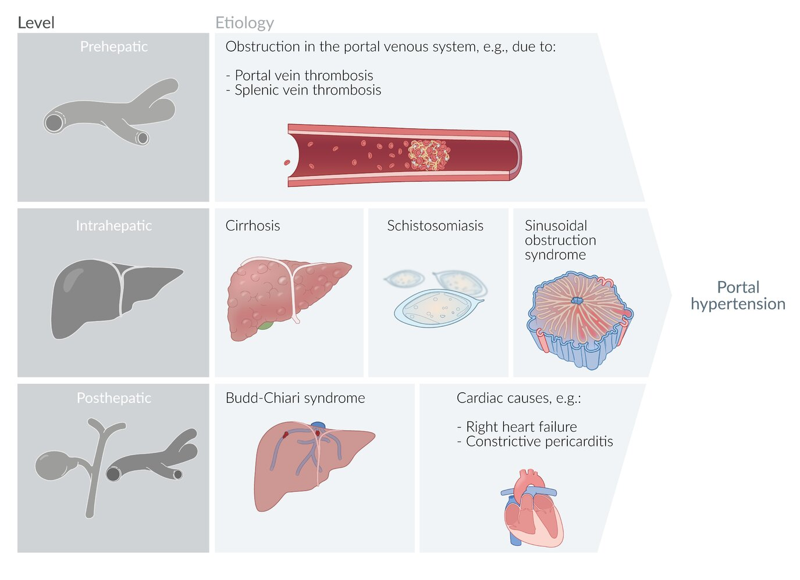
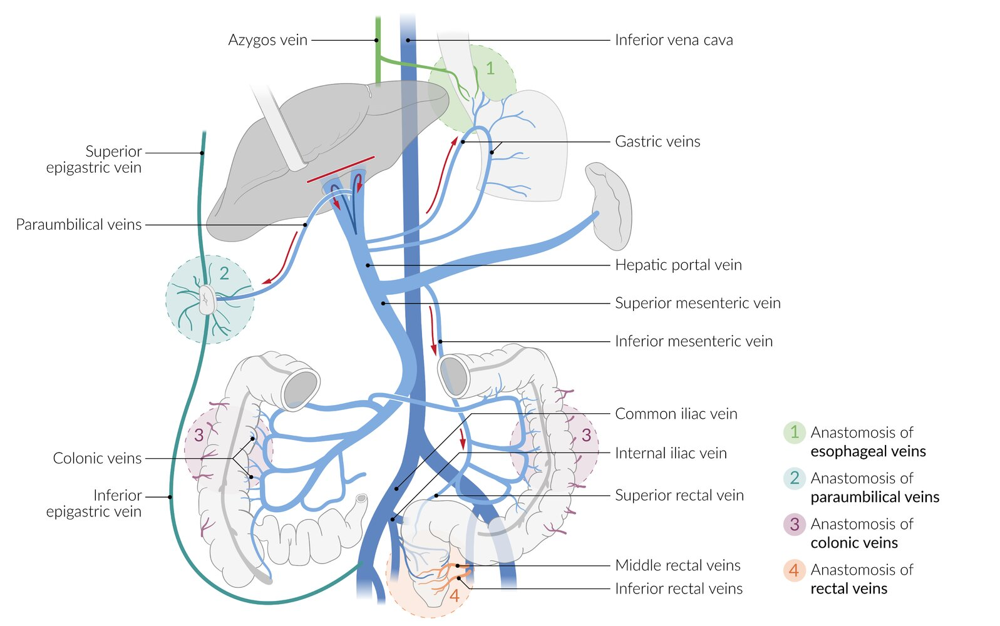
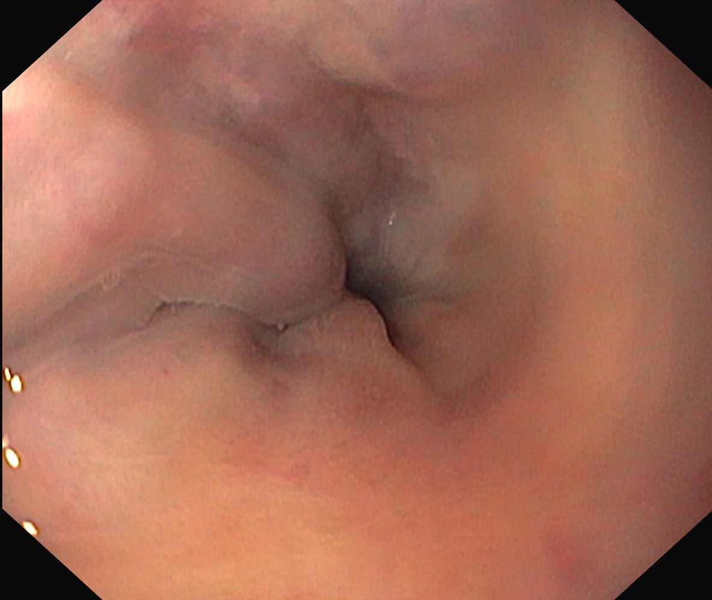
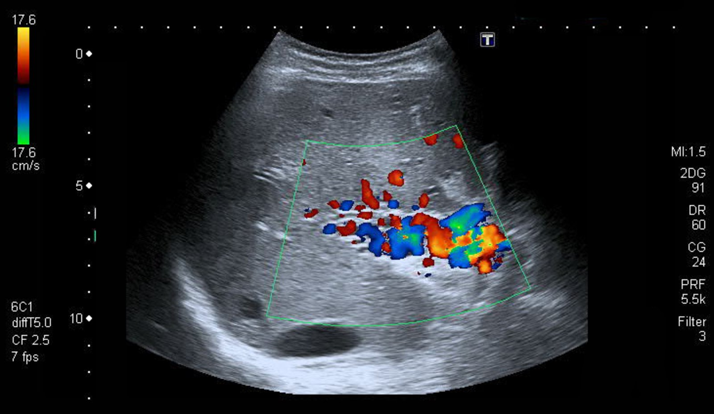
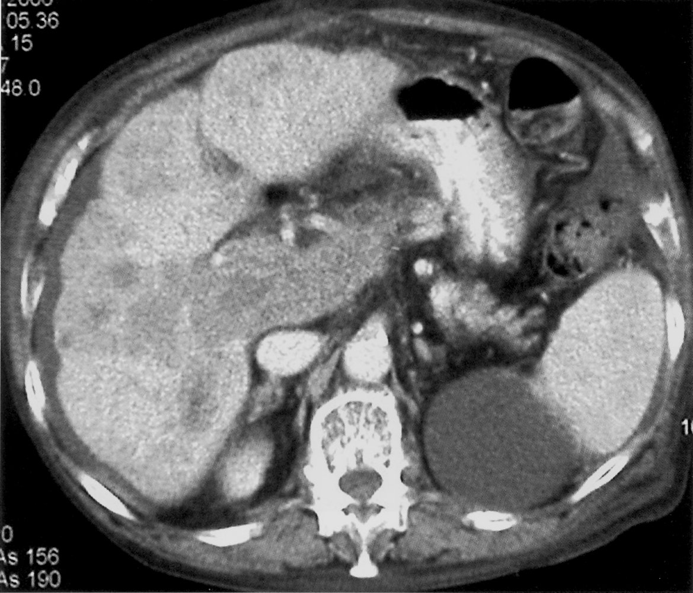
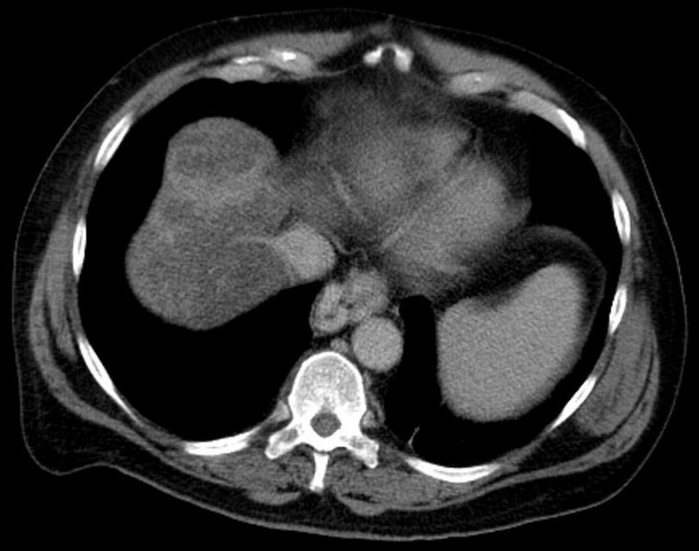
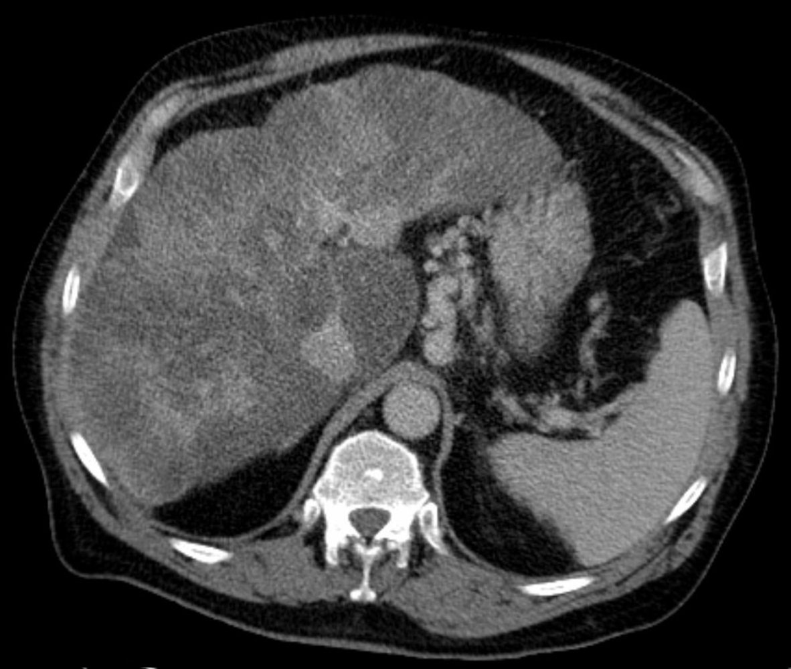
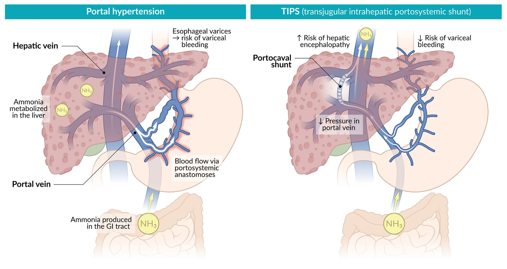
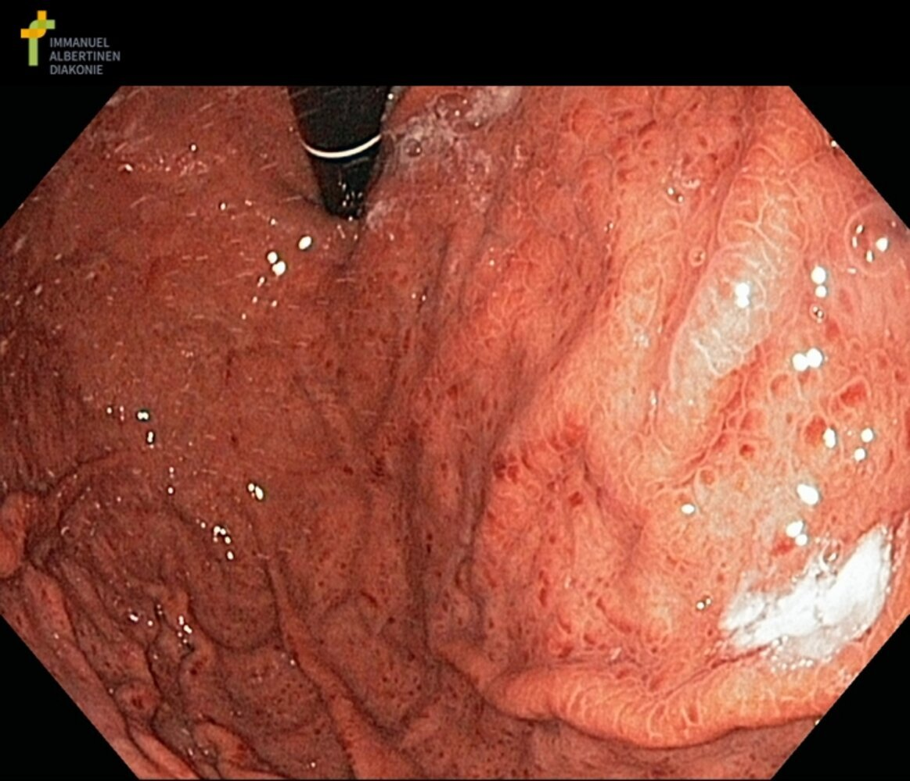

# Portal hypertension

*Categories: Clinical knowledge > Surgery > Abdominal surgery > Pancreas, liver, and bile ducts > Portal hypertension*

[Original Article Link](https://coursology-qbank.com/amboss/article/LS0wZf)

---

## Summary

Portal <u>hypertension</u> is the pathological elevation of <u>portal venous</u> pressure resulting from obstructions in portal blood flow, which can be prehepatic (e.g., <u>portal vein thrombosis</u>), hepatic (e.g., <u>liver cirrhosis</u>), or posthepatic (e.g., <u>right-sided heart failure</u>). The subsequent backflow of blood may lead to <u>portosystemic anastomoses</u>, <u>splenomegaly</u>, and/or <u>ascites</u>. A <u>diagnosis of portal hypertension</u> can be made based on clinical signs and knowledge of an underlying cause. In suspected cases, medical imaging and laboratory tests are used to support the diagnosis. Management involves treating the underlying condition and reducing portal pressure with <u>nonselective beta blockers</u> (<u>NSBBs</u>) and <u>portosystemic shunts</u>. Acute hemorrhage of <u>esophageal varices</u> is a potentially life-threatening complication of portal <u>hypertension</u> and is caused by increased blood flow via <u>portosystemic anastomoses</u>.

---

## Etiology

<u>Causes of portal hypertension</u> are described based on the anatomical location of the lesion.

Etiology of portal hypertension

### Prehepatic [[1]](https://coursology-qbank.com/amboss/article/igWJEk0)

* <u>Portal vein thrombosis</u>

* <u>Splenic vein thrombosis</u>

* <u>Mesenteric vein thrombosis</u> [[2]](https://coursology-qbank.com/amboss/article/6tWjeM0)

* Congenital abnormalities of the <u>portal vein</u> system (e.g., <u>portal vein</u> <u>agenesis</u>)

* Compression of portal or <u>splenic veins</u> [[3]](https://coursology-qbank.com/amboss/article/MjWMal0)

* <u>Arteriovenous fistula</u>

### Hepatic [[1]](https://coursology-qbank.com/amboss/article/igWJEk0)[[4]](https://coursology-qbank.com/amboss/article/5jWial0)

Hepatic etiologies of portal <u>hypertension</u> are described anatomically in relation to the <u>hepatic sinusoids</u>.

* Presinusoidal

* <u>Hepatosplenic schistosomiasis</u> (most common cause of noncirrhotic portal <u>hypertension</u> worldwide)  [[5]](https://coursology-qbank.com/amboss/article/mjWVal0)

* <u>Granulomatous diseases</u> (e.g., <u>sarcoidosis</u>, <u>tuberculosis</u>) [[3]](https://coursology-qbank.com/amboss/article/MjWMal0)

* <u>Malignancy</u> (e.g., <u>lymphoma</u>) causing <u>portal vein</u> occlusion

* Biliary diseases (e.g., <u>primary biliary cholangitis</u>, <u>primary sclerosing cholangitis</u>)

* Developmental or genetic abnormalities (e.g., <u>polycystic kidney disease</u>, <u>arteriovenous fistula</u>)

* Sinusoidal

* <u>Cirrhosis</u> (most common <u>cause of portal hypertension</u> in the US)

* Massive hepatic <u>metastases</u>

* <u>Steatohepatitis</u>

* Congenital <u>hepatic fibrosis</u>

* <u>Amyloidosis</u>

* <u>Drug-induced liver injury</u> (e.g., <u>methotrexate</u>-induced) or toxin-related <u>liver</u> injury (e.g., <u>copper</u>)

* <u>Alcohol-associated liver disease</u>

* Infiltrative diseases (e.g., <u>Gaucher disease</u>)

* Inflammatory and infectious conditions (e.g., viral <u>hepatitis</u>, <u>chronic Q fever</u>)

* <u>Portosinusoidal vascular disorder</u>

* Postsinusoidal

* <u>Sinusoidal obstruction syndrome</u>

* Vascular <u>malignancy</u> (e.g., <u>angiosarcoma</u>)

* Granulomatous changes (due to, e.g., <u>sarcoidosis</u> or <u>Mycobacterium avium</u>)

* <u>Sclerosis</u> of the <u>hepatic vein</u> (due to, e.g., <u>alcohol</u> or <u>hypervitaminosis A</u>)

### Posthepatic [[1]](https://coursology-qbank.com/amboss/article/igWJEk0)[[3]](https://coursology-qbank.com/amboss/article/MjWMal0)

* <u>Budd-Chiari syndrome</u>

* <u>Right-sided heart failure</u> [[6]](https://coursology-qbank.com/amboss/article/BjWzcl0)

* <u>Constrictive pericarditis</u>

* Obstruction of <u>IVC</u> (e.g., <u>IVC thrombosis</u>)

---

## Pathophysiology

### Prehepatic [[1]](https://coursology-qbank.com/amboss/article/igWJEk0)[[7]](https://coursology-qbank.com/amboss/article/ZtWZXM0)

Obstruction of <u>portal vein</u> or <u>splenic vein</u> → ↑ hydrostatic pressure in the tributaries of the obstructed <u>vein</u>

### Hepatic [[1]](https://coursology-qbank.com/amboss/article/igWJEk0)[[7]](https://coursology-qbank.com/amboss/article/ZtWZXM0)

* Presinusoidal: obstruction of outflow in <u>portal vein</u> at the <u>porta hepatis</u> or in the portal <u>venules</u> within <u>liver</u> → ↑ hydrostatic pressure in the <u>portal vein</u> and its tributaries

* Sinusoidal: ↑ resistance to blood flow in the <u>hepatic sinusoids</u> (e.g., due to <u>hepatic fibrosis</u> and ↓ intrahepatic <u>nitric oxide</u> production in <u>cirrhosis</u>) → ↑ hydrostatic pressure in the <u>hepatic sinusoids</u> → ↑ hydrostatic pressure in the <u>portal vein</u> and its tributaries

* Postsinusoidal: obstruction of outflow in the <u>central vein</u> and/or hepatic <u>venules</u> → ↑ hydrostatic pressure in the <u>hepatic sinusoids</u> → ↑ hydrostatic pressure in the <u>portal vein</u> and its tributaries

### Posthepatic [[1]](https://coursology-qbank.com/amboss/article/igWJEk0)[[7]](https://coursology-qbank.com/amboss/article/ZtWZXM0)

<u>Hepatic vein</u> congestion or obstruction of <u>hepatic vein</u> outflow → ↑ hydrostatic pressure in the <u>hepatic sinusoids</u> → ↑ hydrostatic pressure in the <u>portal vein</u> and its tributaries

---

## Clinical features

The etiology determines whether portal <u>hypertension</u> manifests as acute or chronic.

* Signs and symptoms of underlying disease, e.g.:

* <u>Clinical features of cirrhosis</u>

* <u>Clinical features of right-sided heart failure</u>

* Signs and symptoms of complications: features of increased blood flow via <u>portosystemic anastomoses</u> 

* <u>Gastrointestinal bleeding</u> [[9]](https://coursology-qbank.com/amboss/article/jOW_Hl0)

* <u>Hematemesis</u> and/or <u>melena</u> (e.g., due to <u>esophageal varices</u> or <u>gastric varices</u>)

* <u>Hematochezia</u> (e.g., due to hemorrhoidal or <u>anorectal varices</u>)

* <u>Caput medusae</u>

* Signs of <u>hypersplenism</u> due to congestive <u>splenomegaly</u> (e.g., <u>thrombocytopenia</u>)

* Abdominal distention due to <u>ascites</u>

* <u>Hepatic encephalopathy</u>

> [!TIP]
> Patients usually present with signs of their underlying disease and/or symptoms related to the <u>complications of portal hypertension</u>.

Portocaval anastomoses

Esophageal varices

Caput medusae and ascites

---

## Diagnosis

### General principles [[10]](https://coursology-qbank.com/amboss/article/0tWeXM0)[[11]](https://coursology-qbank.com/amboss/article/ad1Qof0)

* <u>CSPH</u> is confirmed in patients with either: [[10]](https://coursology-qbank.com/amboss/article/0tWeXM0)

* <u>HVPG measurement</u> ≥ 10 mm Hg

* <u>Surrogate</u> markers of <u>CSPH</u>:

* <u>Complications of portal hypertension</u>: e.g., <u>esophageal varices</u> on <u>EGD</u>, portosystemic collaterals on abdominal imaging

* Abnormal noninvasive tests: <u>transient elastography</u> with <u>PLT</u> count [[12]](https://coursology-qbank.com/amboss/article/14d2RJ0)

* Once confirmed, identify the underlying <u>causes of portal hypertension</u>.

* Obtain a diagnostic workup for the most likely cause (e.g., <u>diagnostics for cirrhosis</u>).

* Consult hepatology if the diagnosis remains unclear.

> [!TIP]
> The combination of elevated <u>liver</u> stiffness and <u>thrombocytopenia</u> provides the most reliable estimation of <u>CSPH</u> using noninvasive tests. [[10]](https://coursology-qbank.com/amboss/article/0tWeXM0)

### <u>Laboratory studies</u> [[6]](https://coursology-qbank.com/amboss/article/BjWzcl0)[[10]](https://coursology-qbank.com/amboss/article/0tWeXM0)

Findings are nonspecific but may further support the diagnosis and help to identify the underlying cause.

* <u>CBC</u>

* <u>Thrombocytopenia</u> (most common laboratory finding in portal <u>hypertension</u>)

* <u>Anemia</u> related to an underlying condition

* <u>Liver chemistries</u>: <u>transaminitis</u> and/or <u>hyperbilirubinemia</u> suggest <u>liver</u> disease.

* <u>Coagulation panel</u>: <u>coagulopathy</u> is a sign of advanced <u>liver</u> disease

* <u>Ascitic fluid analysis</u>: <u>high SAAG</u> ≥ 1.1 g/dL [[6]](https://coursology-qbank.com/amboss/article/BjWzcl0)

### Imaging studies [[10]](https://coursology-qbank.com/amboss/article/0tWeXM0)[[13]](https://coursology-qbank.com/amboss/article/dPWodl0)

#### <u>Transient elastography</u> [[10]](https://coursology-qbank.com/amboss/article/0tWeXM0)[[12]](https://coursology-qbank.com/amboss/article/14d2RJ0)

* Indications: Obtain for all patients with nonconfirmed disease.

* Findings: Correlate with <u>PLT</u> levels to increase diagnostic yield. 

* <u>CSPH</u> is confirmed with the following findings : [[10]](https://coursology-qbank.com/amboss/article/0tWeXM0)

* <u>Liver</u> stiffness  > 25 kPa (regardless of <u>PLT</u> level)

* <u>Liver</u> stiffness 20–25 kPa (if <u>PLT</u> < 150,000/mm³)

* <u>Liver</u> stiffness 15–20 kPa (if <u>PLT</u> ≤ 110,000/mm³)

* <u>CSPH</u> is ruled out if <u>liver</u> stiffness < 15 kPa and <u>platelets</u> ≥ 150,000/mm³. [[10]](https://coursology-qbank.com/amboss/article/0tWeXM0)

> [!TIP]
> <u>Transient elastography</u> is the recommended noninvasive test for diagnostic confirmation in patients with suspected portal <u>hypertension</u>. [[10]](https://coursology-qbank.com/amboss/article/0tWeXM0)

#### Abdominal imaging [[10]](https://coursology-qbank.com/amboss/article/0tWeXM0)

Findings may help establish the diagnosis and identify the underlying cause.

* Modalities

* <u>MR elastography</u>

* For diagnostic uncertainty after <u>transient elastography</u>  [[12]](https://coursology-qbank.com/amboss/article/14d2RJ0)

* <u>Liver</u> stiffness ≥ 5.1 kPa on <u>MR elastography</u> suggests <u>CSPH</u>.  [[12]](https://coursology-qbank.com/amboss/article/14d2RJ0)

* <u>Doppler ultrasound</u> abdomen: Obtain to assess portal circulation.

* CT or <u>MRI</u> abdomen are usually reserved for:

* Concerns for extrahepatic obstruction

* Preprocedural planning

* Specific findings of <u>CSPH</u>: sufficient to establish a <u>diagnosis of portal hypertension</u>  [[10]](https://coursology-qbank.com/amboss/article/0tWeXM0)[[14]](https://coursology-qbank.com/amboss/article/kCcmHe0)

* Portosystemic collateral circulation

* Blood flow reversal in the portal system

* Nonspecific findings

* Portal and/or <u>splenic vein</u> dilation > 10 mm

* Decreased <u>portal vein</u> <u>velocity</u> on <u>Doppler ultrasound</u>

* <u>Splenomegaly</u>, <u>ascites</u>, and/or <u>varices</u>

* Findings that suggest the underlying cause, e.g.:

* <u>Cirrhosis</u> (e.g., nodular <u>liver</u>)

* <u>Liver</u> masses

* <u>Portal vein thrombosis</u>

Cavernous transformation of the portal vein

Recanalized paraumbilical vein

Hepatocellular carcinoma in cirrhotic liver

Esophageal varices

Varices in hepatic cirrhosis

### Hepatic venous pressure gradient (<u>HVPG</u>) measurement [[10]](https://coursology-qbank.com/amboss/article/0tWeXM0)[[11]](https://coursology-qbank.com/amboss/article/ad1Qof0)[[15]](https://coursology-qbank.com/amboss/article/AjWR1l0)

* Indication: reserved for diagnostic confirmation in cases of uncertainty (<u>gold standard test</u>)  [[10]](https://coursology-qbank.com/amboss/article/0tWeXM0)

* Method: Free and wedge occlusion pressures of the <u>hepatic vein</u> are measured via catheterization, using <u>ultrasound</u> or <u>fluoroscopy</u>. [[11]](https://coursology-qbank.com/amboss/article/ad1Qof0)

* Interpretation of <u>HVPG</u> levels [[10]](https://coursology-qbank.com/amboss/article/0tWeXM0)

* > 5 mm Hg: mild portal <u>hypertension</u>

* ≥ 10 mm Hg: clinically significant portal hypertension (<u>CSPH</u>)  [[6]](https://coursology-qbank.com/amboss/article/BjWzcl0)

* > 12 mm Hg: associated with complications (e.g., <u>variceal bleeding</u>) [[6]](https://coursology-qbank.com/amboss/article/BjWzcl0)

### <u>Esophagogastroduodenoscopy</u> (<u>EGD</u>) [[10]](https://coursology-qbank.com/amboss/article/0tWeXM0)[[11]](https://coursology-qbank.com/amboss/article/ad1Qof0)

* Indications (all of the following)

* <u>Diagnosis of cirrhosis</u> or compensated <u>advanced chronic liver disease</u>

* Non-invasive methods to diagnose <u>CSPH</u> (e.g., <u>transient elastography</u>) are unavailable

* Interpretation: The presence of <u>esophageal varices</u> of any size confirms the diagnosis of <u>CSPH</u>.    [[10]](https://coursology-qbank.com/amboss/article/0tWeXM0)

Esophageal varices

Esophageal varices

Fundal variceal hemorrhage

---

## Treatment

### General principles [[10]](https://coursology-qbank.com/amboss/article/0tWeXM0)[[11]](https://coursology-qbank.com/amboss/article/ad1Qof0)[[13]](https://coursology-qbank.com/amboss/article/dPWodl0)

Consult hepatology for specialist-guided management that includes:

* Management of the underlying <u>causes of portal hypertension</u> (mainstay of treatment)

* Pharmacotherapy with <u>NSBBs</u>

* <u>Portosystemic shunts</u> for refractory disease

* Management of <u>complications of portal hypertension</u>, e.g., <u>treatment of ascites</u>, <u>treatment of hepatic encephalopathy</u>, treatment of <u>esophageal varices</u>

### Pharmacotherapy (<u>off-label</u>) [[10]](https://coursology-qbank.com/amboss/article/0tWeXM0)[[11]](https://coursology-qbank.com/amboss/article/ad1Qof0)

* <u>NSBBs</u>: used to prevent hepatic decompensation (e.g., <u>variceal bleeding</u>) 

* Indicated in patients with <u>CSPH</u> and <u>cirrhosis</u> (unless there are <u>contraindications for beta blockers</u>) [[10]](https://coursology-qbank.com/amboss/article/0tWeXM0)

* Preferred agent: <u>carvedilol</u> DOSAGE  [[10]](https://coursology-qbank.com/amboss/article/0tWeXM0)[[11]](https://coursology-qbank.com/amboss/article/ad1Qof0)

* Alternative agents: <u>propranolol</u>, <u>nadolol</u>

* Reduce dose or discontinue in patients with complications of advanced <u>liver</u> disease.

### Transjugular intrahepatic portosystemic shunt (<u>TIPS</u> or <u>TIPSS</u>)  [[16]](https://coursology-qbank.com/amboss/article/ePWxdl0)[[17]](https://coursology-qbank.com/amboss/article/NGW-z50)

* Definition: implantation of a <u>stent</u> between the <u>hepatic vein</u> and <u>portal vein</u>

* Goals

* Ensure blood drainage from the portal to the systemic system bypasses the <u>liver</u>, thus lowering portal pressure

* Reduce the risk of <u>variceal bleeding</u> and reduce the formation of <u>ascites</u>

* Indications

* Persistent, recurring, or treatment-resistant <u>upper gastrointestinal bleeding</u> resulting from portal <u>hypertension</u>, e.g., from <u>esophageal varices</u>

* Other <u>complications of portal hypertension</u> refractory to medical therapy, e.g.: [[16]](https://coursology-qbank.com/amboss/article/ePWxdl0)

* <u>Ascites</u>

* <u>Hepatic hydrothorax</u>

* <u>Budd-Chiari syndrome</u>

* Chronic complete <u>portal vein thrombosis</u>

* Contraindications [[16]](https://coursology-qbank.com/amboss/article/ePWxdl0)[[17]](https://coursology-qbank.com/amboss/article/NGW-z50)

* Refractory <u>overt hepatic encephalopathy</u>

* Severe circulatory diseases, i.e.:

* <u>Heart failure</u>

* Severe <u>pulmonary hypertension</u> (<u>mPAP</u> > 45 mm Hg)

* Severe untreated <u>valvular heart disease</u>, e.g., <u>tricuspid regurgitation</u>

* Ongoing infection or <u>sepsis</u>

* Severe, uncorrectable <u>coagulopathy</u> (<u>relative contraindication</u>) [[17]](https://coursology-qbank.com/amboss/article/NGW-z50)

* Anatomical barriers (<u>relative contraindication</u>)  [[17]](https://coursology-qbank.com/amboss/article/NGW-z50)

* Procedure  [[10]](https://coursology-qbank.com/amboss/article/0tWeXM0)[[18]](https://coursology-qbank.com/amboss/article/fPWkVl0)

* Access site: <u>internal jugular vein</u>

* The <u>hepatic vein</u> is catheterized and an expandable <u>stent</u> is placed between the hepatic and <u>portal veins</u>.

* Complications [[17]](https://coursology-qbank.com/amboss/article/NGW-z50)[[19]](https://coursology-qbank.com/amboss/article/wCXh8Z0)

* Procedure-related, e.g., inadvertent carotid <u>artery</u> puncture, <u>stent</u> migration, <u>stent</u> occlusion

* <u>Portosystemic shunt</u>-related, e.g., <u>hepatic encephalopathy</u>, <u>TIPS</u>-induced <u>hemolysis</u>

* Prevention of complications: Periprocedural <u>rifaximin</u> may be used to reduce the risk of <u>hepatic encephalopathy</u>. [[17]](https://coursology-qbank.com/amboss/article/NGW-z50)

> [!TIP]
> Shunt implementation results in reduced hepatic elimination of <u>ammonia</u> and may lead to worsening of <u>encephalopathy</u>.

Transjugular intrahepatic portosystemic shunt (TIPS)

### Surgical portosystemic shunts [[20]](https://coursology-qbank.com/amboss/article/TPW6Vl0)[[21]](https://coursology-qbank.com/amboss/article/gPWFVl0)

* Indications  [[20]](https://coursology-qbank.com/amboss/article/TPW6Vl0)[[22]](https://coursology-qbank.com/amboss/article/UPWbVl0)

* Recurrent <u>variceal bleeding</u> after <u>TIPS</u>

* Contraindications to <u>TIPS</u>

* Techniques

* Total (nonselective) <u>portosystemic shunts</u>: The <u>portal vein</u> is completely shunted to the vena cava, reducing portal pressure.  [[21]](https://coursology-qbank.com/amboss/article/gPWFVl0)

* Selective <u>portosystemic shunts</u>

* The <u>portal vein</u> is partially shunted to the vena cava, reducing portal pressure.

* The partial shunt prevents <u>variceal bleeding</u> while continuing to allow portal <u>perfusion</u>.  [[21]](https://coursology-qbank.com/amboss/article/gPWFVl0)

---

## Complications

* Life-threatening <u>esophageal variceal bleeding</u>

* <u>Portal hypertensive gastropathy</u>

* <u>Ascites</u>

* <u>Spontaneous bacterial peritonitis</u>

* <u>Hepatorenal syndrome</u>

* Impaired <u>liver function</u> (see “<u>Cirrhosis</u>”)

* <u>Hepatic encephalopathy</u>

* <u>Pulmonary complications of portal hypertension</u> (e.g., <u>hepatopulmonary syndrome</u>, <u>portopulmonary hypertension</u>)

* <u>Cirrhotic cardiomyopathy</u>

* <u>Gastric antral vascular ectasia</u>

We list the most important complications. The selection is not exhaustive.

---

## Portal hypertensive gastropathy

* Definition: gastric venous and <u>capillary</u> ectasia resulting from <u>CSPH</u> [[10]](https://coursology-qbank.com/amboss/article/0tWeXM0)

* <u>Epidemiology</u>

* <u>Prevalence</u> among patients with <u>compensated cirrhosis</u>: approx. 50–80% [[10]](https://coursology-qbank.com/amboss/article/0tWeXM0)

* More common in patients with medium or <u>large gastroesophageal varices</u> than in those with no or <u>small gastroesophageal varices</u>

* Clinical features

* Often asymptomatic

* <u>Symptoms of iron-deficiency anemia</u> from <u>chronic blood loss</u>

* <u>Features of overt GI bleeding</u> (rare) [[10]](https://coursology-qbank.com/amboss/article/0tWeXM0)

* Diagnostics

* <u>EGD</u> (first-line)   [[10]](https://coursology-qbank.com/amboss/article/0tWeXM0)

* <u>Proximal</u> lesions [[23]](https://coursology-qbank.com/amboss/article/V4dGRJ0)

* <u>Mosaic</u> pattern (“snakeskin” <u>mucosa</u>)

* Intramucosal hemorrhage (red or black-brown markings)

* Portal <u>hypertension</u> (<u>PH</u>) related polyps may be visible.  [[10]](https://coursology-qbank.com/amboss/article/0tWeXM0)

* Other modalities: CT, <u>MRI</u>, <u>capsule endoscopy</u> [[23]](https://coursology-qbank.com/amboss/article/V4dGRJ0)

* Management [[10]](https://coursology-qbank.com/amboss/article/0tWeXM0)

* Acute <u>GI bleeding</u> from severe <u>PHG</u>

* Vasoactive therapy (e.g., <u>octreotide</u>) at doses used for <u>variceal bleeding</u> for 2–5 days

* See “<u>Management of esophageal variceal hemorrhage</u>.”

* Chronic management

* <u>NSBBs</u> to prevent decompensation or rebleeding

* Management of <u>chronic blood loss</u> [[23]](https://coursology-qbank.com/amboss/article/V4dGRJ0)

* <u>Iron</u> supplementation

* <u>Blood transfusions</u>

* <u>TIPS</u> for patients who are <u>transfusion</u>-dependent despite <u>NSBB</u> therapy

* Argon plasma coagulation

> [!TIP]
> Rule out <u>H. pylori infection</u> (a common differential diagnosis) before initiating prophylactic therapy with <u>NSBBs</u>. [[10]](https://coursology-qbank.com/amboss/article/0tWeXM0)

Portal hypertensive gastropathy

---

## Gastric antral vascular ectasia (GAVE)

* Definition: dilation of small <u>mucosal</u> and <u>submucosal</u> <u>blood vessels</u> in the <u>gastric antrum</u>

* Associated conditions [[23]](https://coursology-qbank.com/amboss/article/V4dGRJ0)

* Portal <u>hypertension</u>, <u>cirrhosis</u>

* <u>Chronic kidney disease</u>

* <u>Connective tissue disorders</u> (e.g., <u>systemic sclerosis</u>)

* Cardiovascular disease

* <u>Bone marrow transplantation</u>

* Clinical features [[24]](https://coursology-qbank.com/amboss/article/e4dxRJ0)

* Often asymptomatic

* <u>Symptoms of iron-deficiency anemia</u> from <u>chronic blood loss</u>

* <u>Features of overt GI bleeding</u> (rare)

* Diagnostics: <u>EGD</u>  [[23]](https://coursology-qbank.com/amboss/article/V4dGRJ0)

* <u>Distal</u> linear <u>erythematous</u> streaks

* Classically described as “<u>watermelon stomach</u>”

* <u>Biopsy</u> in selected cases for diagnostic confirmation (e.g., when the diagnosis is uncertain)  [[23]](https://coursology-qbank.com/amboss/article/V4dGRJ0)

* Management

* Endoscopic therapy, e.g., argon plasma coagulation, <u>radiofrequency ablation</u>, <u>band ligation</u> [[24]](https://coursology-qbank.com/amboss/article/e4dxRJ0)[[25]](https://coursology-qbank.com/amboss/article/U4dbiJ0)

* Management of <u>chronic blood loss</u>, e.g., <u>iron</u> supplementation, <u>transfusions</u>

* <u>Initial management of overt GI bleeding</u>

> [!TIP]
> While <u>GAVE</u> is associated with portal <u>hypertension</u>, it is not thought to be caused by portal <u>hypertension</u>, and medication to reduce <u>CSPH</u> is ineffective in the management of <u>GAVE</u>. [[23]](https://coursology-qbank.com/amboss/article/V4dGRJ0)

Gastric antral vascular ectasia

---