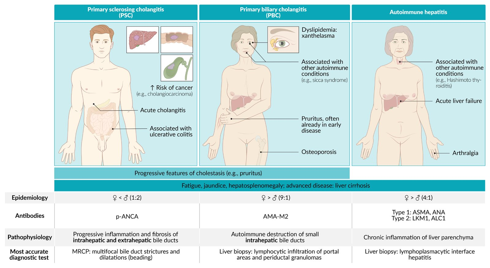

# Primary biliary cholangitis

*Categories: Clinical knowledge > Surgery > Abdominal surgery > Pancreas, liver, and bile ducts > Primary biliary cholangitis*

[Original Article Link](https://coursology-qbank.com/amboss/article/MS0MZf)

---

## Summary

Primary biliary <u>cholangitis</u> (PBC; also known as primary biliary <u>cirrhosis</u>) is a chronic progressive <u>liver</u> disease of autoimmune origin that is characterized by destruction of the intralobular <u>bile</u> ducts. The pathogenesis of PBC is unclear. PBC is frequently associated with other autoimmune conditions and primarily affects middle-aged women. In the early stages, PBC is typically asymptomatic. Fatigue is the most common initial symptom. In advanced disease, increased <u>fibrotic</u> changes lead to typical signs of <u>cholestasis</u> (e.g., <u>jaundice</u>), <u>portal hypertension</u> (e.g., <u>ascites</u>, <u>gastrointestinal bleeding</u>), and severe <u>hypercholesterolemia</u> (e.g., <u>xanthomas</u>, <u>xanthelasmas</u>). Elevated <u>alkaline phosphatase</u> (<u>ALP</u>) levels, <u>antimitochondrial antibodies</u> (<u>AMA</u>), and <u>liver biopsy</u> findings can establish the diagnosis. Management involves <u>supportive care</u>, e.g., <u>management of cholestasis-associated pruritus</u>, and slowing disease progression with <u>ursodeoxycholic acid</u>. <u>Liver transplantation</u> is the only definitive treatment.

Overview of PSC, PBC, and autoimmune hepatitis

---

## Epidemiology

* Sex: : <u>♀</u> > <u>♂</u> (∼ 9:1) [[1]](https://coursology-qbank.com/amboss/article/kbXmF9)

* Age range: : 30–65 years [[2]](https://coursology-qbank.com/amboss/article/VP0GdT)

Epidemiological data refers to the US, unless otherwise specified.

---

## Etiology

* PBC is considered an autoimmune disease and is thought to be triggered by environmental factors in individuals with a genetic predisposition.  [[3]](https://coursology-qbank.com/amboss/article/lbXvF9)[[4]](https://coursology-qbank.com/amboss/article/vbXAv9)

* Positive <u>family history</u> is a predisposing factor.

* Often associated with other autoimmune conditions, e.g.: [[3]](https://coursology-qbank.com/amboss/article/lbXvF9)[[5]](https://coursology-qbank.com/amboss/article/4bX3F9)

* <u>CREST syndrome</u>

* <u>Systemic sclerosis</u>

* <u>Sjogren syndrome</u>

* <u>Sicca syndrome</u>

* <u>Autoimmune thyroid disease</u>, especially <u>Hashimoto thyroiditis</u>

* <u>Celiac disease</u>  [[3]](https://coursology-qbank.com/amboss/article/lbXvF9)[[6]](https://coursology-qbank.com/amboss/article/XRW9lO0)[[7]](https://coursology-qbank.com/amboss/article/cRWaNO0)

* <u>Rheumatoid arthritis</u>  [[8]](https://coursology-qbank.com/amboss/article/URWbmO0)[[9]](https://coursology-qbank.com/amboss/article/VRWGNO0)

---

## Pathophysiology

* Inflammation and progressive destruction (likely due to an autoimmune reaction) of the small and medium-sized intrahepatic <u>bile</u> ducts (progressive ductopenia) → defective <u>bile</u> duct <u>regeneration</u> → chronic <u>cholestasis</u> → secondary <u>hepatocyte</u> damage due to increased concentration of toxins that typically get excreted via <u>bile</u> → gradual portal and periportal <u>fibrotic</u> changes → <u>liver</u> failure → <u>liver cirrhosis</u> and <u>portal hypertension</u> (in advanced stage) [[10]](https://coursology-qbank.com/amboss/article/EbX8v9)

---

## Clinical features

Patients with PBC are usually initially asymptomatic. [[3]](https://coursology-qbank.com/amboss/article/lbXvF9)[[4]](https://coursology-qbank.com/amboss/article/vbXAv9)

* Fatigue: most common and often the first symptom

* Marked <u>pruritus</u>: generalized or localized, typically worse at night  [[3]](https://coursology-qbank.com/amboss/article/lbXvF9)

* Symptoms of <u>cholestasis</u>

* <u>Jaundice</u>

* Pale stool, dark urine

* <u>Maldigestion</u> (more common in advanced disease) [[5]](https://coursology-qbank.com/amboss/article/4bX3F9)

* <u>Signs of cirrhosis</u> and <u>portal hypertension</u>

* <u>Hepatomegaly</u> with dull lower margin, <u>RUQ</u> discomfort

* <u>Splenomegaly</u>

* <u>Hyperpigmentation</u>  [[3]](https://coursology-qbank.com/amboss/article/lbXvF9)

* <u>Xanthomas</u> and <u>xanthelasma</u>   [[11]](https://coursology-qbank.com/amboss/article/2RWTmO0)

* May be accompanied by clinical features of any associated autoimmune diseases (e.g., <u>sclerodactyly</u> in <u>scleroderma</u>, <u>xerophthalmia</u> in <u>sicca syndrome</u>)

---

## Diagnosis

### Approach [[3]](https://coursology-qbank.com/amboss/article/lbXvF9)

* Suspect PBC in patients with chronic <u>cholestasis</u>.

* Obtain <u>laboratory studies</u> for all patients.

* Consider <u>liver biopsy</u> if the diagnosis remains unclear.

* Diagnosis is confirmed if ≥ 2 of the following are present: [[3]](https://coursology-qbank.com/amboss/article/lbXvF9)

* Elevated <u>ALP</u>

* Characteristic <u>autoantibodies</u>, e.g., <u>AMA</u>

* Typical findings on <u>liver biopsy</u>

* Imaging can help exclude alternative diagnoses.

### <u>Laboratory studies</u> [[3]](https://coursology-qbank.com/amboss/article/lbXvF9)

* <u>Liver chemistries</u>: <u>cholestatic pattern of injury</u>

* ↑ <u>ALP</u>, ↑ <u>GGT</u>, ↑ <u>direct bilirubin</u>

* <u>Mild transaminitis</u> (or normal <u>AST</u> and <u>ALT</u>)  [[3]](https://coursology-qbank.com/amboss/article/lbXvF9)

* <u>Liver synthetic function tests</u>: ↓ <u>albumin</u>, ↑ <u>INR</u> in patients with advanced disease

* <u>CBC</u>: <u>thrombocytopenia</u>, e.g., in patients with <u>hypersplenism</u> due to <u>portal hypertension</u> or concomitant <u>ITP</u> [[12]](https://coursology-qbank.com/amboss/article/hkWcnl0)[[13]](https://coursology-qbank.com/amboss/article/ikWJnl0)

* <u>Lipid panel</u>: <u>hypercholesterolemia</u>

* PBC-specific <u>autoantibodies</u>

* <u>Antimitochondrial antibodies</u> (<u>AMA</u>) (present in > 95% of patients) [[3]](https://coursology-qbank.com/amboss/article/lbXvF9)

* If <u>AMA</u> negative: PBC-specific <u>ANA</u>, e.g., anti-sp100 or anti-gp210  [[4]](https://coursology-qbank.com/amboss/article/vbXAv9)

* <u>Immunoglobulins</u> (nonspecific)

* ↑ <u>IgM</u>

* ↑ <u>IgG</u> (less common)  [[3]](https://coursology-qbank.com/amboss/article/lbXvF9)

> [!TIP]
> The combination of <u>hyperbilirubinemia</u> with <u>hypoalbuminemia</u>, <u>thrombocytopenia</u>, and increased <u>INR</u> suggests <u>decompensated cirrhosis</u>, which indicates a poor prognosis. [[4]](https://coursology-qbank.com/amboss/article/vbXAv9)

### <u>Liver biopsy</u> [[3]](https://coursology-qbank.com/amboss/article/lbXvF9)

* Most patients do not require a <u>liver biopsy</u> to confirm PBC.

* Obtain in certain patients to either:

* Confirm PBC diagnosis in patients without characteristic <u>autoantibodies</u>

* Evaluate for alternative diagnoses or concomitant <u>liver</u> disease  [[3]](https://coursology-qbank.com/amboss/article/lbXvF9)

* Supportive findings

* Nonsuppurative <u>cholangitis</u> and destruction of small and medium <u>bile</u> ducts [[4]](https://coursology-qbank.com/amboss/article/vbXAv9)

* See “Pathology” below for findings according to the histopathological stage of disease.

### Imaging

Imaging is not routinely indicated but may be used to exclude alternative diagnoses and/or evaluate for complications. See also “Diagnostics” in “<u>Jaundice and cholestasis</u>.”

* Abdominal <u>ultrasound</u>: to exclude mechanical <u>bile</u> obstruction

* <u>MRCP</u>: to evaluate for <u>PSC</u>

* <u>Transient elastography</u>: to evaluate for <u>fibrosis</u>

---

## Pathology

### Histopathological stages

* Stage I: <u>lymphocytic</u> infiltration of <u>portal areas</u> and periductal <u>granulomas</u>

* Stage II: <u>bile</u> duct ductopenia, progressive <u>fibrosis</u>

* Stage III: <u>bridging fibrosis</u>

* Stage IV: <u>liver cirrhosis</u>

---

## Differential diagnoses

* <u>Autoimmune hepatitis</u>

* <u>Primary sclerosing cholangitis</u> (See “<u>Differential diagnoses of cholestatic biliary disease</u>” for details.)

* <u>Biliary obstruction</u> (malignant or benign)

* Drug-induced <u>liver</u> disease

* <u>Sarcoidosis</u>

* See also “<u>Common cholestatic causes of conjugated hyperbilirubinemia</u>.”

The differential diagnoses listed here are not exhaustive.

---

## Treatment

### General principles

* Start pharmacotherapy with <u>ursodeoxycholic acid</u> for all patients.

* Offer <u>supportive care</u>, including <u>management of cholestasis-associated pruritus</u>.

* Screen for complications and comorbidities.

* Patients with <u>PBC-AIH overlap</u> should receive simultaneous <u>treatment of AIH</u> (i.e., <u>immunosuppression</u>). [[4]](https://coursology-qbank.com/amboss/article/vbXAv9)

* <u>Liver transplantation</u> is necessary if <u>liver cirrhosis</u> is advanced.

> [!TIP]
> <u>Liver transplantation</u> is the only definitive treatment, although most cases of PBC can be managed effectively with pharmacotherapy.

### Pharmacotherapy [[3]](https://coursology-qbank.com/amboss/article/lbXvF9)[[4]](https://coursology-qbank.com/amboss/article/vbXAv9)

* First-line: ursodeoxycholic acid (<u>UDCA</u>, <u>ursodiol</u>) DOSAGE: a <u>hydrophilic</u>, nontoxic <u>bile acid</u> with immunomodulatory, anti-inflammatory, <u>choleretic</u>, and cytoprotective effects   ; [[14]](https://coursology-qbank.com/amboss/article/vfWALk0)[[15]](https://coursology-qbank.com/amboss/article/K3WUjO0)

* Slows disease progression and development of complications (e.g., <u>esophageal varices</u>)

* Prolongs transplant-free and overall survival

* Also used in <u>primary sclerosing cholangitis</u>, <u>cholestasis of pregnancy</u>, and small <u>cholesterol stones</u> (<u>off-label</u>)

* Second-line options

* Obeticholic acid (<u>OCA</u>): an <u>agonist</u> of the farnesoid X <u>receptor</u>, which is a <u>nuclear receptor</u> that inhibits <u>bile acid</u> synthesis and intake

* Consider in addition to <u>UDCA</u> if there is an inadequate response after 1 year of treatment. [[3]](https://coursology-qbank.com/amboss/article/lbXvF9)

* Consider as monotherapy in patients with <u>sensitivity</u> or intolerance to <u>UDCA</u>.

* Contraindicated in patients with advanced <u>cirrhosis</u>, i.e., a history of decompensation or signs of <u>decompensated cirrhosis</u> or <u>portal hypertension</u>. [[16]](https://coursology-qbank.com/amboss/article/XfW9kk0)

* <u>Fibrates</u>, e.g., <u>fenofibrate</u> (<u>off-label</u>): may be considered for patients without <u>decompensated cirrhosis</u> and inadequate response to <u>UDCA</u> [[16]](https://coursology-qbank.com/amboss/article/XfW9kk0)

> [!TIP]
> Because <u>bile acid sequestrants</u> can interfere with <u>UDCA</u> absorption, these medications should not be taken at the same time. [[3]](https://coursology-qbank.com/amboss/article/lbXvF9)

### <u>Supportive care</u> [[3]](https://coursology-qbank.com/amboss/article/lbXvF9)[[4]](https://coursology-qbank.com/amboss/article/vbXAv9)

* Symptom relief

* <u>Management of cholestasis-associated pruritus</u>

* Treatment of <u>sicca syndrome</u> in patients with <u>secondary Sjogren syndrome</u>

* Prevention of complications

* Provide <u>treatment for hypertension</u>.

* Encourage <u>lifestyle modifications for ASCVD prevention</u>.

* Consider lipid-lowering therapy based on <u>ASCVD risk assessment</u>.  [[3]](https://coursology-qbank.com/amboss/article/lbXvF9)

* <u>Optimize bone health</u>, e.g., consider supplementing <u>calcium</u> and <u>vitamin D</u> if needed.

### Monitoring and screening [[3]](https://coursology-qbank.com/amboss/article/lbXvF9)[[4]](https://coursology-qbank.com/amboss/article/vbXAv9)

* Monitoring for disease progression
* Obtain <u>liver</u> and <u>cholestatic enzymes</u> every 3–6 months to assess for:

* Disease progression

* Therapy adherence

* Development of <u>PBC-AIH overlap</u>

* Screening for complications of <u>cholestasis</u>

* <u>Osteoporosis</u>

* <u>Bone mineral density assessment</u> at diagnosis, then every 2 years

* Annual <u>vitamin D</u> levels in patients with advanced <u>liver</u> disease

* Screen for <u>fat-soluble vitamin deficiency</u> in patients with <u>jaundice</u> and/or <u>bilirubin</u> > 2.0 mg/dL.

* Screening for <u>complications of cirrhosis</u>

* <u>HCC screening</u>: <u>ultrasound</u> every 6 months

* Screening for <u>esophageal varices</u>: <u>esophagogastroduodenoscopy</u> at the time of diagnosis, then every 1–3 years

* Comorbidities

* Measure <u>TSH</u> annually.

* Regularly assess for signs and symptoms of commonly associated autoimmune diseases (see “Etiology”). [[4]](https://coursology-qbank.com/amboss/article/vbXAv9)

---

## Complications

* <u>Malabsorption</u>

* <u>Liver cirrhosis</u> and <u>portal hypertension</u>

* <u>Osteoporosis</u>

We list the most important complications. The selection is not exhaustive.

---