# Bowel obstruction

*Categories: Clinical knowledge > Surgery > Abdominal surgery > Small and large intestine > Bowel obstruction*

[Original Article Link](https://coursology-qbank.com/amboss/article/230T3f)

---

## Summary

Bowel obstruction refers to the interruption of the normal passage of bowel contents through the bowel, either due to a functional or mechanical obstruction. <u>Functional bowel obstruction</u>, or <u>paralytic ileus</u>, is a temporary disturbance of <u>peristalsis</u> in the absence of mechanical obstruction (see “<u>Paralytic ileus</u>”). <u>Mechanical bowel obstruction</u> is the interruption of normal passage through the bowel due to a structural barrier. <u>Mechanical bowel obstruction</u> can be classified as either a <u>small bowel obstruction</u> (<u>SBO</u>) or <u>large bowel obstruction</u> (<u>LBO</u>) according to its location, and, depending on the extent of the obstruction, as either partial or complete. Postoperative <u>bowel adhesion</u> is the most common cause of <u>SBO</u> and <u>malignancy</u> is the most common cause of <u>LBO</u>. Regardless of the cause, bowel obstruction typically manifests with <u>nausea</u>, <u>vomiting</u>, abdominal <u>pain</u>, abdominal distention, and <u>constipation</u> or <u>obstipation</u>. <u>Bowel sounds</u> are increased and high-pitched in the early phases of bowel obstruction and decreased or absent in the later stages. Bowel distention leads to <u>third-space volume loss</u>, resulting in <u>dehydration</u> and <u>electrolyte</u> abnormalities. The <u>symptoms of bowel obstruction</u> are typically less severe in <u>partial bowel obstruction</u> than in total bowel obstruction. A <u>diagnosis of bowel obstruction</u> should be confirmed on imaging (e.g., CT abdomen and <u>pelvis</u>). Typical findings include dilated bowel loops <u>proximal</u> to the obstruction, collapse of bowel loops <u>distal</u> to the obstruction, and multiple <u>air-fluid levels</u>. Laboratory tests are needed to assess severity (e.g., <u>metabolic acidosis</u> and elevated serum <u>lactate</u> suggest <u>bowel ischemia</u>) and identify acid-base and <u>electrolyte</u> imbalances. A trial of nonoperative management (NOM), which includes bowel rest and <u>supportive care</u> (such as <u>IV fluids</u>, <u>analgesics</u>, <u>antiemetics</u>, and, if needed, <u>antibiotics</u>) can be considered in patients with <u>simple bowel obstruction</u> with no evidence of complications. <u>Surgery</u> is indicated for <u>complicated bowel obstruction</u>, <u>closed-loop bowel obstruction</u>, or if there is no clinical improvement following NOM for <u>simple bowel obstruction</u>. The underlying cause of bowel obstruction should be sought for and managed appropriately.

---

## Definitions

* Bowel obstruction: the interruption of normal passage through the bowel

* Mechanical bowel obstruction: the interruption of normal passage through the bowel due to a structural barrier (e.g., a <u>tumor</u>, adhesions)

* <u>Paralytic ileus</u> (<u>functional bowel obstruction</u>): temporary functional impairment of <u>peristalsis</u> in the absence of a mechanical obstruction (see “<u>Mechanical bowel obstruction vs. paralytic ileus</u>”)

* According to the site of obstruction, <u>mechanical bowel obstruction</u> can be classified as:

* Large bowel obstruction (<u>LBO</u>): obstruction at the level of the <u>cecum</u>, <u>colon</u>, or <u>rectum</u>

* Small bowel obstruction (<u>SBO</u>): obstruction at the level of the <u>duodenum</u>, <u>jejunum</u>, or <u>ileum</u>

* <u>Gastric outlet obstruction</u> (GOO): obstruction at the level of the <u>pyloric</u> channel or <u>duodenum</u>

Reference:[[1]](https://coursology-qbank.com/amboss/article/PLYWBp)

---

## Etiology

### Etiologic classification [[2]](https://coursology-qbank.com/amboss/article/C_Yqq7)

<u>Mechanical bowel obstruction</u> can be classified into the following etiologic categories.

|  | Extrinsic bowel obstruction | Intrinsic bowel obstruction |  |
| --- | --- | --- | --- |
| Intramural bowel obstruction | Intraluminal bowel obstruction |  |  |
| Etiology |  * External compression of the bowel   * <u>Bowel adhesions</u>  * <u>Volvulus</u>  * <u>Incarcerated hernia</u> (e.g., <u>inguinal hernia</u>, <u>umbilical hernia</u>, <u>femoral hernia</u>)  * Intraabdominal mass (e.g., <u>metastatic</u> <u>lymphadenopathy</u>, large <u>intraabdominal abscess</u> or cyst)   |  * The underlying etiology arises from the intestinal wall.  * Strictures (e.g., <u>IBD</u>, <u>tuberculosis</u>)  * Intestinal tumors (e.g., <u>colorectal carcinoma</u>, <u>lymphoma</u>)  * <u>Diverticulitis</u>  * <u>Intussusception</u>   |  * The obstructing agent lies within the gastrointestinal lumen.  * <u>Gallstone ileus</u>  * <u>Foreign body ingestion</u>  * <u>Bezoars</u> (e.g., <u>phytobezoars</u>)  * <u>Fecal impaction</u>  * <u>Helminthic infection</u>   |

### Common etiologies

The <u>causes of bowel obstruction</u> vary according to the site of the obstruction and the age of the patient. For children, also see "<u>Causes associated with pediatric gastric outlet obstruction or bowel obstruction</u>" and "<u>Differential diagnoses of neonatal intestinal obstruction</u>."

|  <u>Etiology of bowel obstruction</u> [[1]](https://coursology-qbank.com/amboss/article/PLYWBp)[[3]](https://coursology-qbank.com/amboss/article/v_YAJ7)[[4]](https://coursology-qbank.com/amboss/article/whahT4)  |  |  |
| --- | --- | --- |
|  | <u>SBO</u> | <u>LBO</u> |
| Most common causes |   * Bowel adhesions: fibrous <u>intraperitoneal</u> strands of connective (<u>scar</u>) tissue between organs and tissues that are not usually physiologically connected  * Most common cause of <u>SBO</u>  * Etiology: history of abdominal <u>surgery</u>, abdominal <u>tuberculosis</u>  * <u>Abdominal x-ray</u> shows dilation of several <u>small bowel</u> loops  * <u>Incarcerated hernias</u>: second most common cause of <u>SBO</u>    |   * <u>Malignant tumors</u> (e.g., <u>colorectal carcinoma</u>): most common cause of <u>LBO</u>  * <u>Diverticulitis</u>  * <u>Volvulus</u>  [[4]](https://coursology-qbank.com/amboss/article/whahT4)    |
| Other causes |   * <u>Meckel diverticulum</u>  * Strictures (e.g., <u>Crohn disease</u>)  * Malignant tumors or <u>metastases</u>  * <u>Gallstone ileus</u>  * <u>Superior mesenteric artery syndrome</u>   * Bowel obstruction due to compression of the third portion of the <u>duodenum</u>, between the aorta and the <u>superior mesenteric artery</u>  * May be congenital or acquired as a result of sudden, extreme weight loss  * Foreign body impaction  * <u>Ascariasis</u> (most commonly at the level of the <u>ileocecal valve</u>)  * <u>Internal hernia</u>    |   * Adhesions (e.g., caused by prior abdominal <u>surgery</u>)  * Strictures (e.g., <u>inflammatory bowel disease</u>, congenital strictures)  * <u>Fecal impaction</u>  * Foreign body impaction    |
| Specific to <u>infants</u> and children |   * Congenital <u>intestinal atresia</u> (e.g., <u>duodenal atresia</u>, <u>jejunal atresia</u>)  * <u>Intussusception</u> (e.g., secondary to <u>Meckel diverticulum</u>)  * Congenital strictures and bands (e.g., <u>Ladd bands</u> in <u>intestinal malrotation</u>)    |   * <u>Hirschsprung disease</u>  * Congenital strictures and bands (e.g., <u>Ladd bands</u> in <u>intestinal malrotation</u>)  * <u>Meconium ileus</u>  * Rectal <u>atresia</u>    |

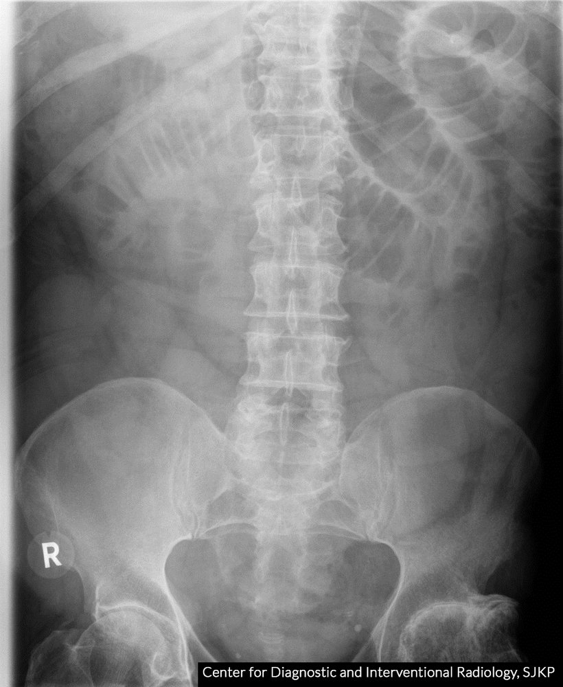

Small bowel dilatation

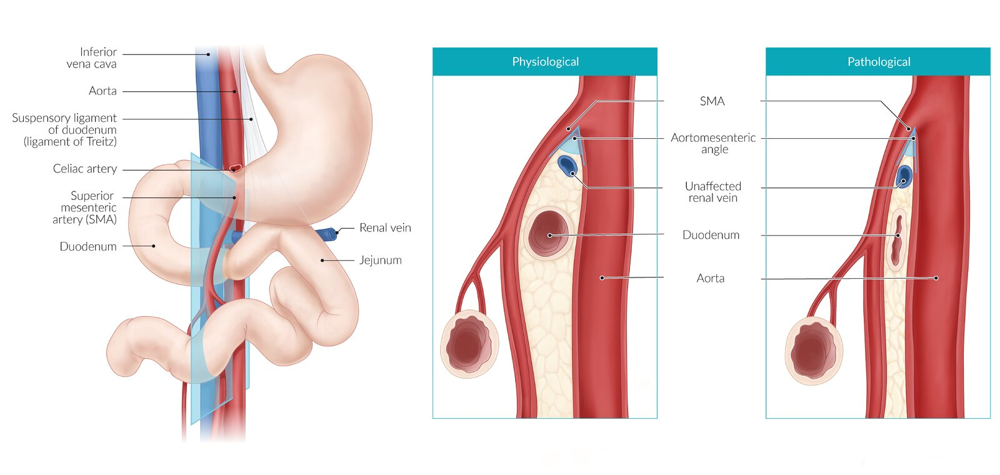

Superior mesenteric artery syndrome (SMAS)

---

## Pathophysiology

* Bowel obstruction → stasis of luminal contents and gas <u>proximal</u> to the obstruction → ↑ intraluminal pressure, which leads to the following: [[1]](https://coursology-qbank.com/amboss/article/PLYWBp)[[3]](https://coursology-qbank.com/amboss/article/v_YAJ7)

* Gaseous abdominal distention → sequestration of fluids within the distended bowel loops (<u>third spacing</u>) → <u>dehydration and hypovolemia</u>

* <u>Vomiting</u> → loss of fluid and Na+, <u>K+</u>, H+, and <u>Cl-</u> → <u>hypokalemia</u>, <u>metabolic alkalosis</u>, and <u>hypovolemia</u>

* Compression of intestinal <u>veins</u> and <u>lymphatics</u> → bowel wall <u>edema</u> → compression of intestinal <u>arterioles</u> and <u>capillaries</u> → <u>bowel ischemia</u>, which leads to:

* ↑ Bowel wall permeability → translocation of intestinal microbes to the <u>peritoneal cavity</u> → <u>sepsis</u>

* <u>Necrosis</u> and perforation of the bowel wall → <u>peritonitis</u>

* <u>Anaerobic metabolism</u> and lysis of <u>ischemic</u> cells → accumulation of <u>lactic acid</u> and release of intracellular <u>K+</u> → <u>metabolic acidosis</u> and <u>hyperkalemia</u>

---

## Clinical features

### Cardinal signs

The cardinal signs of <u>mechanical bowel obstruction</u> are abdominal <u>pain</u>, <u>vomiting</u>, <u>constipation</u>, abdominal distention, and decreased <u>bowel sounds</u>, regardless of the underlying etiology. The severity and progression of clinical features differ according to the site and severity of the obstruction.

* Complete bowel obstruction [[5]](https://coursology-qbank.com/amboss/article/E_Y8J7)

* Total obstruction of the intestinal lumen, preventing the passage of air and fluid

* Rapid progression of clinical features

* Can be associated with obstipation (complete inability to pass stool or gas)

* Partial bowel obstruction [[6]](https://coursology-qbank.com/amboss/article/B_Yzq7)

* Partial obstruction of the intestinal lumen, allowing a small amount of air and fluid to pass through

* Clinical features may be less severe than in <u>complete bowel obstruction</u>

* Can be associated with the intermittent passage of flatus and <u>overflow diarrhea</u>

> [!NOTE]
> <u>Partial bowel obstruction</u> causes gradually progressive symptoms that are typically milder than those caused by complete obstruction. <u>Obstipation</u> is only present in <u>complete bowel obstruction</u>.

|  Clinical features associated with the site of bowel obstruction [[1]](https://coursology-qbank.com/amboss/article/PLYWBp)[[3]](https://coursology-qbank.com/amboss/article/v_YAJ7)  |  |  |
| --- | --- | --- |
| Clinical feature | <u>SBO</u> | <u>LBO</u> |
| Abdominal <u>pain</u> |  * Colicky, periumbilical   |  * Colicky or constant   |
|  <u>Vomiting</u> and/or <u>nausea</u>  |   * Early onset  * Larger volume of vomitus than in <u>LBO</u>  * <u>Bilious</u>    |   * Late onset  * Initially <u>bilious</u>  * Progresses to fecal vomiting (presence of feces in vomitus)    |
|  <u>Constipation</u> or <u>obstipation</u>  |  * Late onset in <u>proximal</u> <u>SBO</u>   |  * Early onset in <u>distal</u> <u>LBO</u>   |
| Abdominal distention |  * Typically less severe than in <u>LBO</u>   |  * Early and significant abdominal distention   |
| Examination findings |   * <u>Dehydration</u> and possible <u>hypovolemia</u> (<u>hypotension</u>, dry <u>mucous membranes</u>)  * Diffuse abdominal tenderness  * <u>Tympanic percussion</u>  * Increased high-pitched <u>bowel sounds</u> (early) or the absence of any <u>bowel sounds</u> (late)  * Collapsed, empty <u>rectum</u> on <u>digital rectal examination</u> (<u>complete bowel obstruction</u>); or <u>impacted feces</u>    |  |

### Progression

Depending on the onset and progression of clinical features, <u>mechanical bowel obstruction</u> can be classified as simple or complicated and acute or subacute. [[6]](https://coursology-qbank.com/amboss/article/B_Yzq7)[[7]](https://coursology-qbank.com/amboss/article/tKYXRJ)

* Simple bowel obstruction: bowel obstruction with no evidence of complications (i.e., no features of <u>bowel ischemia</u>, <u>bowel perforation</u>, or <u>red flags for complicated bowel obstruction</u>) [[1]](https://coursology-qbank.com/amboss/article/PLYWBp)[[2]](https://coursology-qbank.com/amboss/article/C_Yqq7)

* Complicated bowel obstruction: bowel obstruction associated with strangulation, <u>ischemic necrosis</u>, or perforation [[1]](https://coursology-qbank.com/amboss/article/PLYWBp)[[2]](https://coursology-qbank.com/amboss/article/C_Yqq7)

* Red flags for complicated bowel obstruction [[1]](https://coursology-qbank.com/amboss/article/PLYWBp)[[2]](https://coursology-qbank.com/amboss/article/C_Yqq7)

* <u>Pain out of proportion</u>

* <u>Peritoneal signs</u>

* Signs of systemic toxicity, e.g., <u>SIRS</u>

* <u>Hemodynamic instability</u>

* Laboratory abnormalities: e.g., significant <u>leukocytosis</u>, <u>metabolic acidosis</u>, ↑ <u>lactate</u>

| Clinical course of acute and <u>subacute bowel obstruction</u> |  |  |
| --- | --- | --- |
|  | Acute bowel obstruction | Subacute bowel obstruction |
| Clinical course |   * Abrupt onset of typical symptoms  * Fulminant course  * Signs of systemic toxicity or <u>hemodynamic instability</u> may be present.  * Can progress to <u>complicated bowel obstruction</u>    |   * Clinical features are typically mild and progress slowly.  * Signs of systemic toxicity or <u>hemodynamic instability</u> are rare.  * Typically uncomplicated (<u>simple bowel obstruction</u>)    |
| Typical causes |   * <u>Complete bowel obstruction</u>  * High-grade bowel obstruction  * <u>Closed-loop bowel obstruction</u>    |   * <u>Partial bowel obstruction</u>  * Low-grade bowel obstruction  * Open-ended obstruction    |

---

## Management

Bowel obstruction is an emergency and should be detected and managed early to minimize the risk of <u>bowel perforation</u> and strangulation, and the subsequent development of <u>sepsis</u>. The <u>initial management of bowel obstruction</u> is similar to that of undifferentiated <u>acute abdomen</u>.

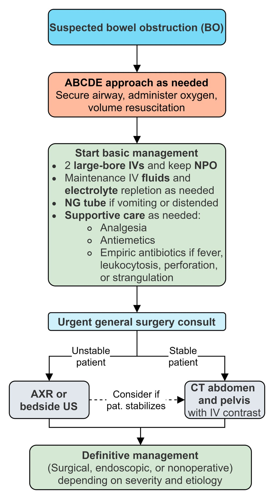

Initial management of bowel obstruction

* <u>ABCDE approach</u>: Evaluate <u>vital signs</u>, <u>volume status</u>, and the need for invasive monitoring.

* Urgent consults: general <u>surgery</u>, gastroenterology (also contact an intensivist as needed)

* Initial management

* <u>NPO</u> status

* <u>Obtain IV access</u> with two large-bore <u>peripheral IVs</u>; simultaneously draw blood for urgent <u>laboratory studies</u>.

* <u>IV fluid resuscitation</u>

* <u>Electrolyte repletion</u> as needed

* Insert a <u>nasogastric tube</u> in patients with recurrent <u>vomiting</u> and/or significant abdominal distention.

* <u>Supplemental oxygen</u> as needed

* Administer <u>supportive care</u> as needed.

* <u>Parenteral analgesics</u>

* Parenteral <u>antiemetics</u>

* <u>Empiric antibiotics for intraabdominal infections</u> (not routinely recommended for <u>simple bowel obstruction</u>)  [[8]](https://coursology-qbank.com/amboss/article/t_YXJ7)[[9]](https://coursology-qbank.com/amboss/article/F_YgJ7)

* If <u>fever</u> and/or <u>leukocytosis</u> are present [[3]](https://coursology-qbank.com/amboss/article/v_YAJ7)

* For strangulated or perforated bowel obstruction

* As prophylaxis for operative malignant bowel obstruction  [[8]](https://coursology-qbank.com/amboss/article/t_YXJ7)

* Obtain imaging: See “Diagnostics.”

* Disposition: Admit to the surgical service or transfer to the operating room (based on <u>surgery</u> consult).  [[3]](https://coursology-qbank.com/amboss/article/v_YAJ7)[[6]](https://coursology-qbank.com/amboss/article/B_Yzq7)[[10]](https://coursology-qbank.com/amboss/article/XzY9r7)

* Definitive management: See “Treatment.”

> [!TIP]
> Admit patients with a bowel obstruction to a surgical service, even if <u>conservative treatment</u> is planned. Patients managed on a surgical service have better overall outcomes and lower health care expenditures than those managed on a medical service. [[3]](https://coursology-qbank.com/amboss/article/v_YAJ7)[[6]](https://coursology-qbank.com/amboss/article/B_Yzq7)[[10]](https://coursology-qbank.com/amboss/article/XzY9r7)

References [[1]](https://coursology-qbank.com/amboss/article/PLYWBp)[[3]](https://coursology-qbank.com/amboss/article/v_YAJ7)[[11]](https://coursology-qbank.com/amboss/article/t9YX6r)[[12]](https://coursology-qbank.com/amboss/article/x_YEq7)

---

## Diagnosis

### General principles

* Imaging is required to:

* Confirm <u>mechanical bowel obstruction</u>

* Identify the site and assess the severity of the obstruction

* Identify complications and the underlying etiology of the obstruction

* Guide treatment planning

* <u>Laboratory studies</u> provide supportive evidence to help assess the severity of the obstruction.

> [!WARNING]
> Do not wait for imaging before initiating definitive management if there is an emergent critical finding (e.g., <u>peritonitis</u>). [[8]](https://coursology-qbank.com/amboss/article/t_YXJ7)

> [!TIP]
> Bowel obstruction requires a swift diagnostic workup to establish if emergency <u>surgery</u> is required.

### Imaging [[3]](https://coursology-qbank.com/amboss/article/v_YAJ7)[[5]](https://coursology-qbank.com/amboss/article/E_Y8J7)[[13]](https://coursology-qbank.com/amboss/article/s_Ytp7)[[14]](https://coursology-qbank.com/amboss/article/p8XLn-)

Initial management of bowel obstruction

* Initial imaging modality: depends on the type of bowel obstruction and hemodynamic stability of the patient

* <u>Acute bowel obstruction</u> [[3]](https://coursology-qbank.com/amboss/article/v_YAJ7)[[14]](https://coursology-qbank.com/amboss/article/p8XLn-)

* Stable patients: CT abdomen and <u>pelvis</u> with IV contrast

* Unstable patients: Consider <u>abdominal series x-ray</u> or abdominal <u>ultrasound</u> first, along with urgent surgical consultation.

* <u>Subacute bowel obstruction</u>

* Preferred: CT abdomen and <u>pelvis</u> with IV contrast

* Alternatives: <u>MRI</u> with and/or without IV contrast, <u>water-soluble contrast challenge</u>, and specialized dynamic contrast studies

* Findings: Radiological signs common to all imaging modalities are detailed in the table.

|  Radiological signs of mechanical bowel obstruction common to all imaging modalities [[2]](https://coursology-qbank.com/amboss/article/C_Yqq7)[[14]](https://coursology-qbank.com/amboss/article/p8XLn-)[[15]](https://coursology-qbank.com/amboss/article/9_YNq7)  |  |
| --- | --- |
| Pathology | Findings |
|  Dilatation of bowel loops <u>proximal</u> to the obstruction    |   * 3-6-9 rule [[15]](https://coursology-qbank.com/amboss/article/9_YNq7)  * To help guide the identification of bowel dilatation on imaging  * Transverse diameter greater than the following indicates dilation:  * <u>Small bowel</u> > 3 cm  * Large bowel > 6 cm  * <u>Cecum</u> > 9 cm  * <u>SBO</u>: Dilated loops are predominantly central.  * <u>LBO</u> : Dilated loops are predominantly peripheral.    |
|  <u>Air-fluid level</u>   |   * Visible on upright or <u>decubitus</u> views  * Common criteria for diagnosing <u>SBO</u> [[2]](https://coursology-qbank.com/amboss/article/C_Yqq7)[[15]](https://coursology-qbank.com/amboss/article/9_YNq7)  * > 2 <u>air-fluid levels</u>  * <u>Air-fluid level</u> diameter > 2.5 cm  * <u>Air-fluid levels</u> of different heights visible within the same bowel loop    |
|  Intraluminal air  beyond the site of obstruction  |   * <u>Complete bowel obstruction</u>: minimal or no air <u>distal</u> to the obstruction  * <u>Partial bowel obstruction</u>: Some air (and/or oral contrast, if used) is often visible beyond the site of obstruction.    |
| Evidence of complications |   * <u>Bowel perforation</u>: <u>pneumoperitoneum</u>  * <u>Bowel ischemia</u> [[5]](https://coursology-qbank.com/amboss/article/E_Y8J7) [[16]](https://coursology-qbank.com/amboss/article/ytXdT-)  * Decreased or abnormal contrast-<u>enhancement</u> of the bowel wall on contrast imaging  * Bowel wall thickness increased to > 3 mm on CT, US, or <u>MRI</u> [[10]](https://coursology-qbank.com/amboss/article/XzY9r7)  * <u>Pneumatosis intestinalis</u>: gas in <u>mesenteric</u> <u>veins</u>  * Free fluid between dilated loops  * Nonspecific: focal <u>mesenteric</u> <u>edema</u> and <u>fat stranding</u>    |
|  Evidence of the underlying etiology  |   * <u>Whirl sign</u> in <u>volvulus</u>  * <u>Target sign</u> in <u>intussusception</u>  * Intraabdominal <u>malignancy</u>  * Diverticuli  * See “Etiology” for further examples.    |

#### <u>Abdominal series x-ray</u>

* Indication: most appropriate initial test in <u>hemodynamically unstable</u> patients or in resource-poor centers  [[3]](https://coursology-qbank.com/amboss/article/v_YAJ7)[[15]](https://coursology-qbank.com/amboss/article/9_YNq7)

* Findings

* <u>Proximal</u> bowel dilatation

* Minimal or no intraluminal air <u>distal</u> to the obstruction

* Stepladder sign (best seen on an upright view): multiple <u>air-fluid levels</u> and stacked dilated loops of <u>small bowel</u>

* <u>Chest x-ray</u> : Air under the <u>diaphragm</u> is an indicator of <u>bowel perforation</u>.

* See also “<u>Radiological signs of mechanical bowel obstruction</u>.”

* Important considerations : <u>X-rays</u> have a number of limitations. [[14]](https://coursology-qbank.com/amboss/article/p8XLn-)

* Variable <u>sensitivity</u> (50–65%)  [[7]](https://coursology-qbank.com/amboss/article/tKYXRJ)[[8]](https://coursology-qbank.com/amboss/article/t_YXJ7)[[15]](https://coursology-qbank.com/amboss/article/9_YNq7)

* Cannot reliably identify the site of obstruction, underlying etiology, or extent of complications

* Do not influence the management of <u>acute bowel obstruction</u> to the same extent as CT abdomen

Small bowel dilatation

Pneumoperitoneum and Pneumoretroperitoneum

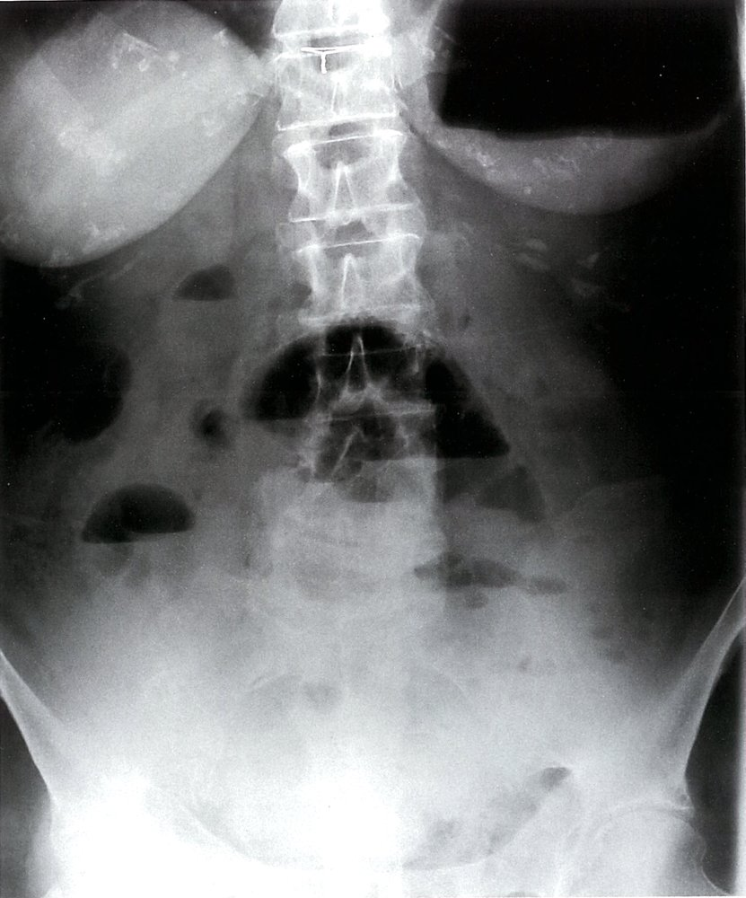

Mechanical small bowel obstruction

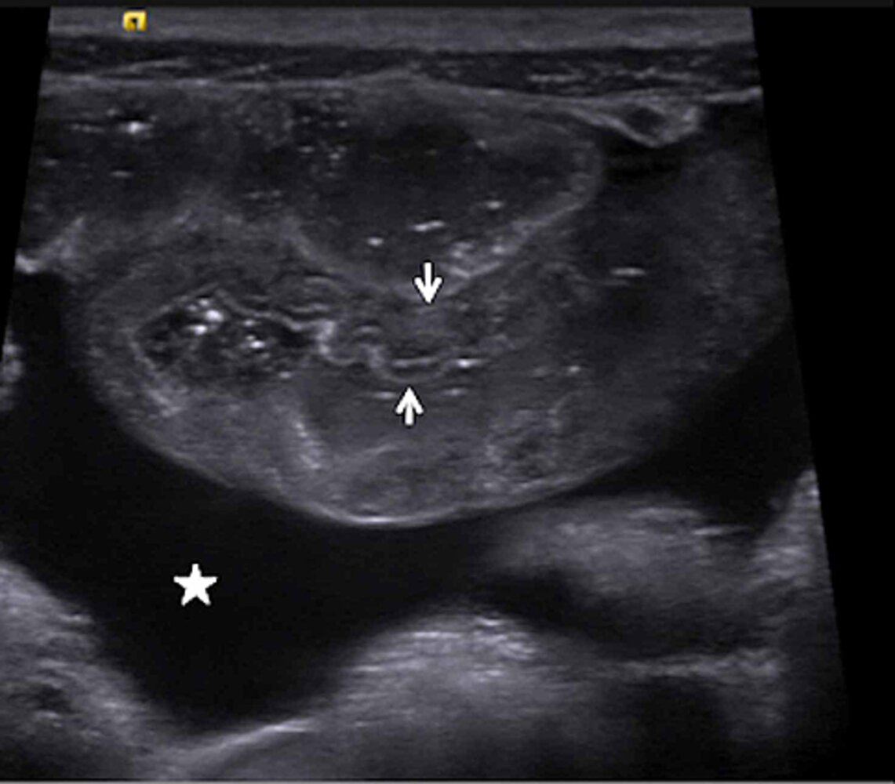

Bowel wall thickening

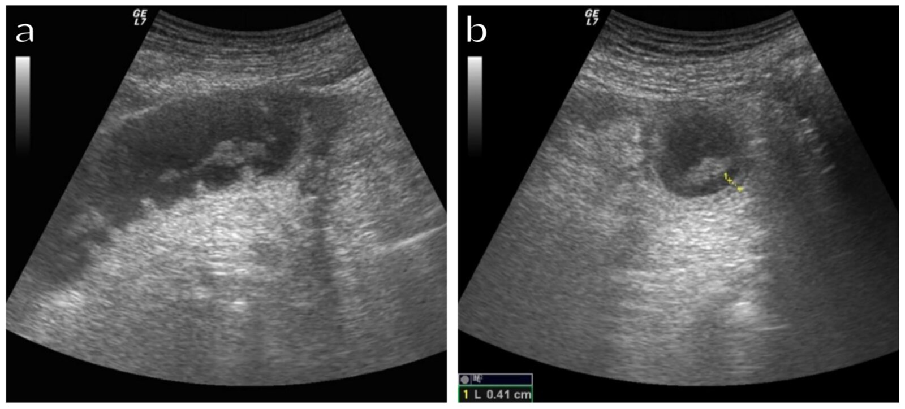

Bowel obstruction with free fluid

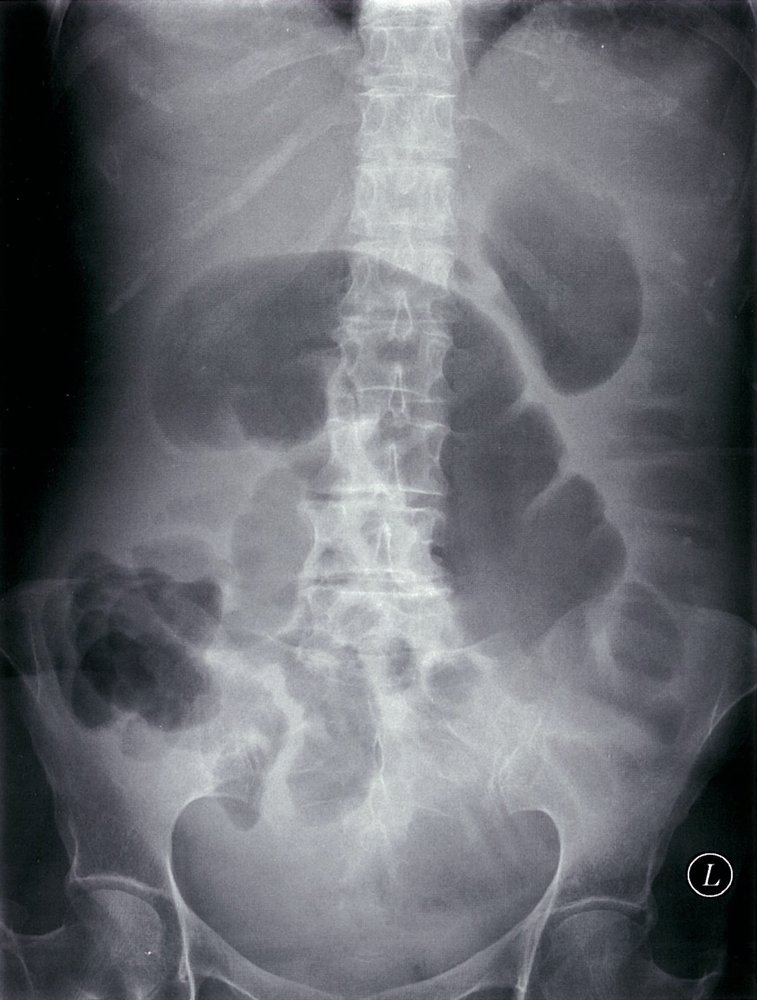

Dilated colon

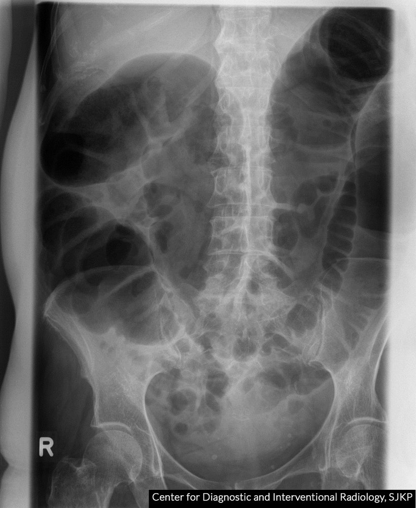

Distal large bowel obstruction (1/2)

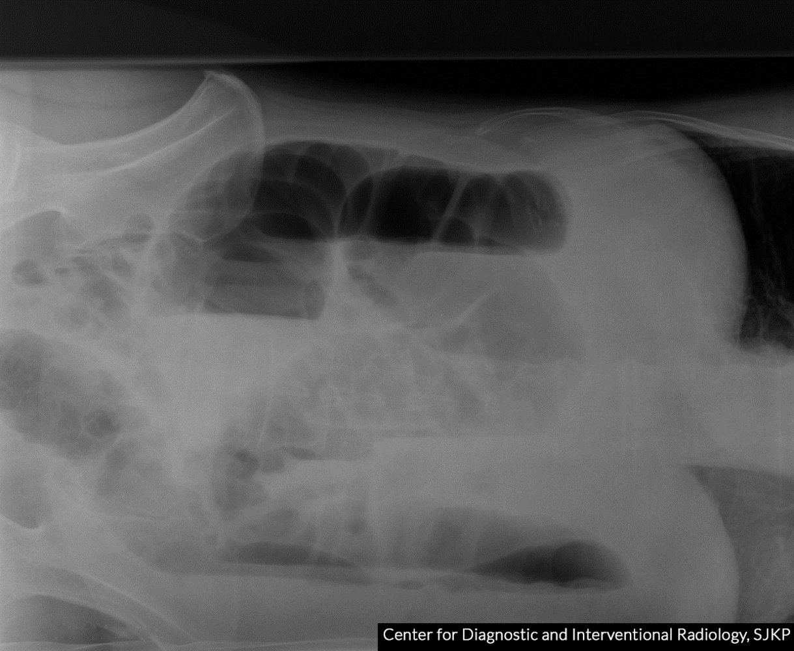

Distal large bowel obstruction (2/2)

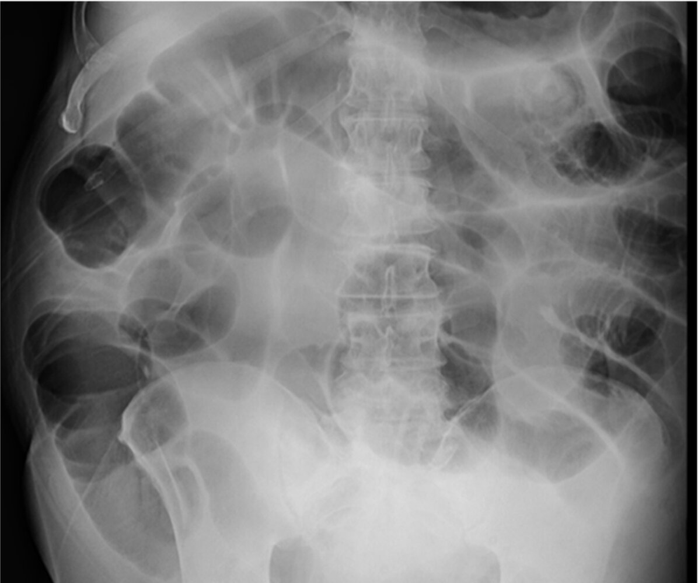

Paralytic ileus

Pneumoperitoneum

> [!TIP]
> To detect <u>pneumoperitoneum</u> on a <u>chest x-ray</u>, patients must be sitting upright for at least 10 minutes to allow free air to move upward and collect under the <u>diaphragm</u>. Patients with severe abdominal <u>pain</u> often require preemptive <u>analgesia</u> to tolerate the procedure! [[17]](https://coursology-qbank.com/amboss/article/0VceGY0)

#### CT abdomen and <u>pelvis</u> (<u>gold standard</u>)  [[6]](https://coursology-qbank.com/amboss/article/B_Yzq7)[[8]](https://coursology-qbank.com/amboss/article/t_YXJ7)[[9]](https://coursology-qbank.com/amboss/article/F_YgJ7)[[12]](https://coursology-qbank.com/amboss/article/x_YEq7)[[18]](https://coursology-qbank.com/amboss/article/D_Y1q7)

* Indications

* With IV contrast: most appropriate initial test in hemodynamically stable patients with <u>acute bowel obstruction</u>  [[7]](https://coursology-qbank.com/amboss/article/tKYXRJ)[[19]](https://coursology-qbank.com/amboss/article/doYoaJ)

* With water-soluble oral contrast: Consider in patients with <u>subacute bowel obstruction</u> and no evidence of complications. [[14]](https://coursology-qbank.com/amboss/article/p8XLn-)

* Without contrast: for patients with a contrast <u>allergy</u>

* Findings

* Similar to those seen on <u>abdominal x-ray</u>; see “<u>Radiological signs of mechanical bowel obstruction</u>.”

* Transition point: sudden narrowing of the bowel lumen at the site of obstruction

* Closed-loop bowel obstruction: a type of <u>mechanical bowel obstruction</u> in which the <u>proximal</u> and <u>distal</u> ends of the obstructed loop are closed

* Single site of obstruction: e.g., in <u>volvulus</u> or <u>incarcerated hernia</u>

* Multiple sites of obstruction: e.g., obstructing <u>colorectal cancer</u> with a competent <u>ileocecal valve</u>

* Progresses rapidly and is associated with an increased risk of strangulation

* Important consideration: In <u>acute bowel obstruction</u>, a <u>CT scan</u> is more accurate than an <u>x-ray</u> in the identification of the site of obstruction, complications, and underlying etiology, and, therefore, influences patient management to a greater extent. [[14]](https://coursology-qbank.com/amboss/article/p8XLn-)

> [!WARNING]
> <u>Closed-loop bowel obstructions</u> are associated with an increased risk of bowel strangulation and perforation.

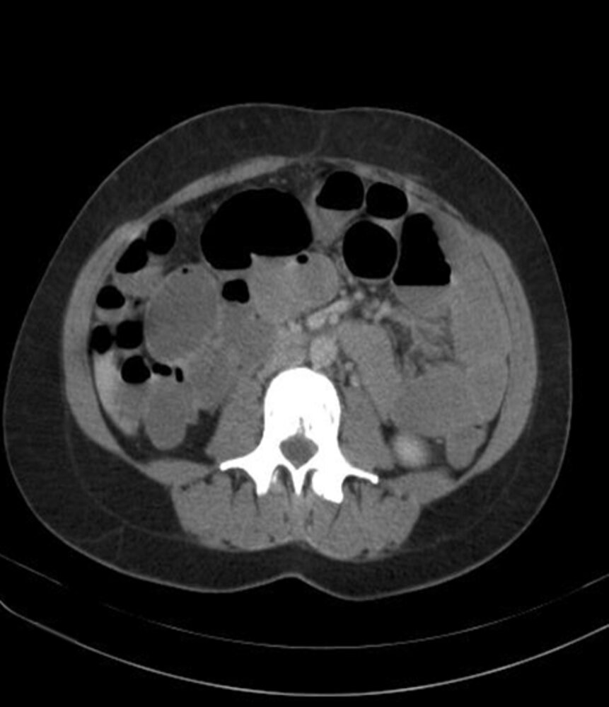

Dilated small bowel

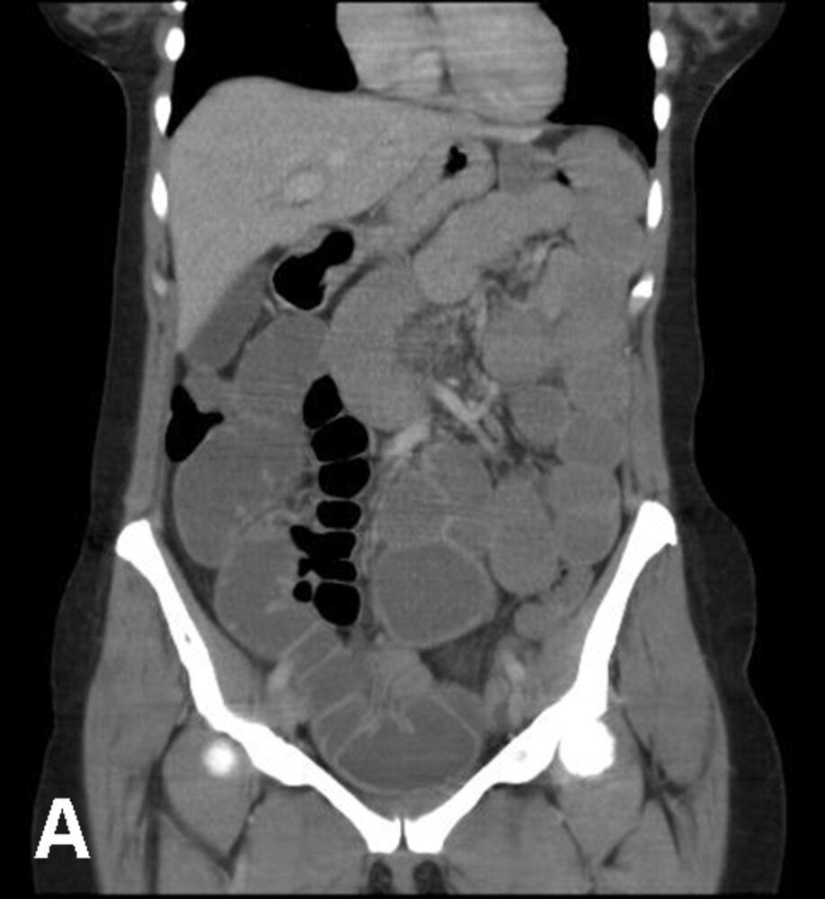

Small bowel obstruction

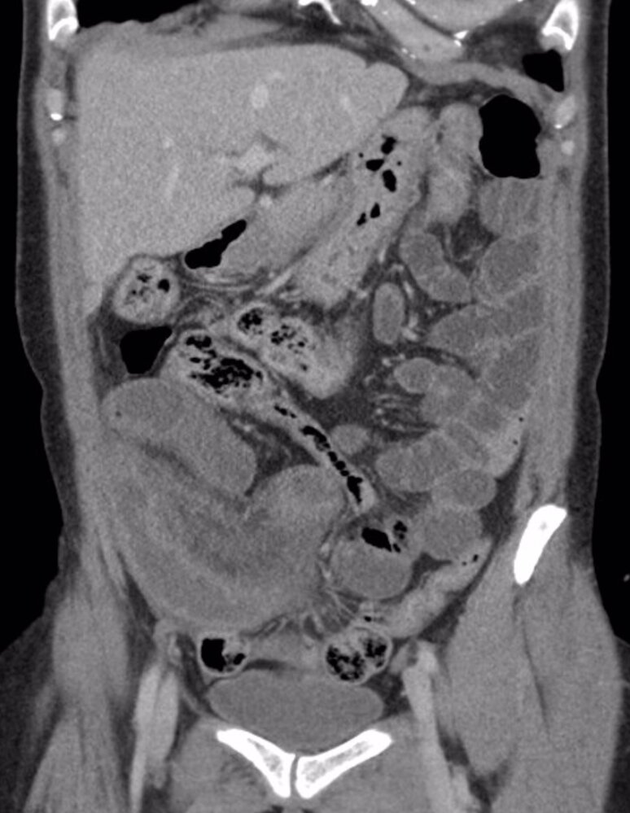

Small bowel obstruction

#### Abdominal <u>ultrasound</u> [[8]](https://coursology-qbank.com/amboss/article/t_YXJ7)[[10]](https://coursology-qbank.com/amboss/article/XzY9r7)[[20]](https://coursology-qbank.com/amboss/article/8zYOu7)[[21]](https://coursology-qbank.com/amboss/article/uzYpu7)

<u>POCUS</u> or <u>formal ultrasound</u> can be performed.

* Indication: <u>Hemodynamically unstable</u> patients (may be preferred over <u>abdominal x-ray</u>)  [[20]](https://coursology-qbank.com/amboss/article/8zYOu7)[[22]](https://coursology-qbank.com/amboss/article/6Tcj7b0)[[23]](https://coursology-qbank.com/amboss/article/pTcL7b0)

* Findings  [[20]](https://coursology-qbank.com/amboss/article/8zYOu7)[[24]](https://coursology-qbank.com/amboss/article/rzYf87)[[25]](https://coursology-qbank.com/amboss/article/FTcgsb0)

* Multiple fluid-filled dilated bowel loops > 2.5 cm in diameter adjacent to collapsed bowel loops (most specific finding)   [[23]](https://coursology-qbank.com/amboss/article/pTcL7b0)

* Thickened bowel wall

* Prominent <u>plicae circulares</u> of dilated <u>small bowel</u> loops (sometimes referred to as the <u>keyboard sign</u>)   [[24]](https://coursology-qbank.com/amboss/article/rzYf87)

* Altered <u>peristalsis</u>

* Increased (early finding) or decreased/absent (late finding)

* Pendular peristalsis: dysfunctional so-called “to-and-fro” <u>peristalsis</u>

* <u>Intraperitoneal</u> fluid accumulation may be present.

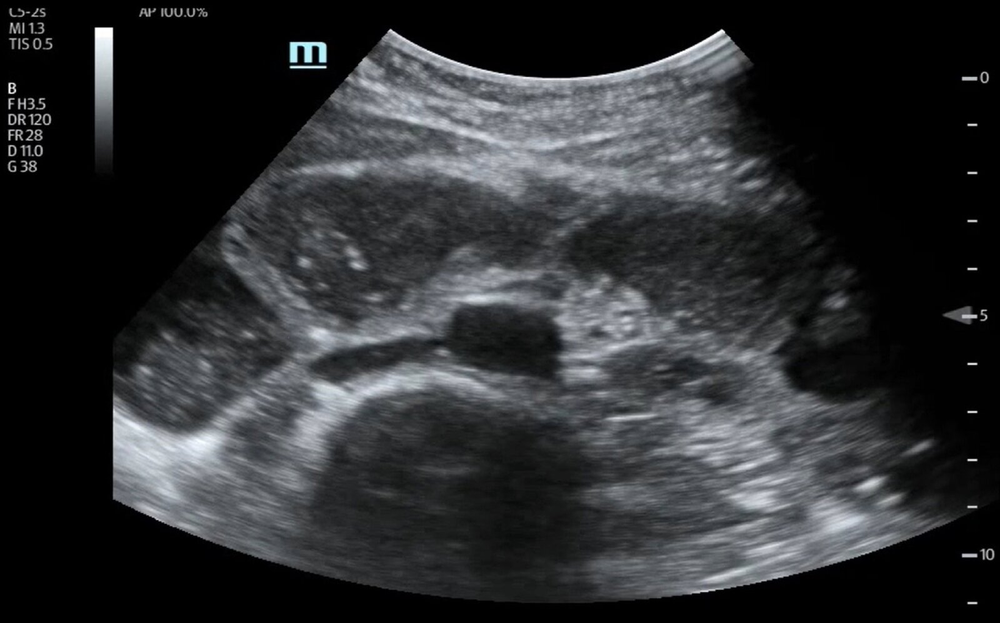

Dilated small bowel

Bowel obstruction with free fluid

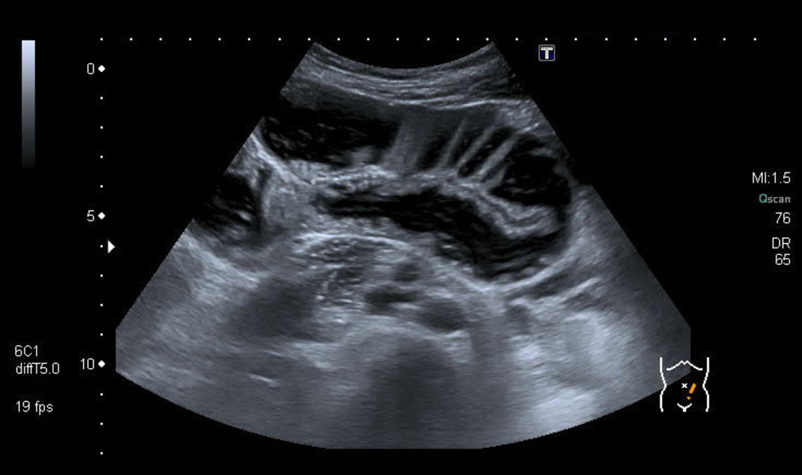

Dilated small bowel

Bowel wall thickening

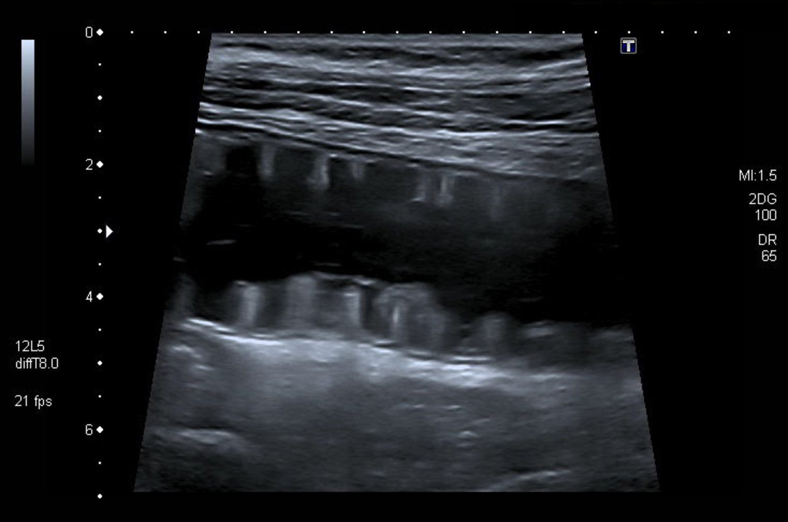

Piano key sign in dilated small bowel

#### <u>MRI</u> abdomen and <u>pelvis</u> (with and/or without IV contrast) [[14]](https://coursology-qbank.com/amboss/article/p8XLn-)

* Indication: hemodynamically stable patients with contraindications to radiation exposure

* Findings: similar to those identified with a <u>CT scan</u>; see “<u>Radiological signs of mechanical bowel obstruction</u>” for details.

#### <u>Barium enema</u> or water-soluble contrast enema [[8]](https://coursology-qbank.com/amboss/article/t_YXJ7)[[15]](https://coursology-qbank.com/amboss/article/9_YNq7)[[26]](https://coursology-qbank.com/amboss/article/vzYAu7)

* Indication: suspected <u>distal</u> <u>LBO</u> if CT is unavailable [[8]](https://coursology-qbank.com/amboss/article/t_YXJ7)

* Findings [[15]](https://coursology-qbank.com/amboss/article/9_YNq7)

* Tapering of the bowel lumen at the site of obstruction

* <u>Complete bowel obstruction</u>: contrast not visible beyond the obstruction

* <u>Partial bowel obstruction</u>: small amount of contrast visible beyond the obstruction

* <u>Bird beak sign</u>: in <u>volvulus</u>

* <u>Apple core sign</u>: in <u>colonic</u> <u>malignancy</u> [[26]](https://coursology-qbank.com/amboss/article/vzYAu7)

> [!NOTE]
> <u>Contrast enema</u> helps differentiate <u>complete bowel obstruction</u> from <u>partial bowel obstruction</u>.

> [!WARNING]
> <u>Barium enema</u> is contraindicated if <u>bowel perforation</u> is suspected (water-soluble <u>contrast enema</u> can be used instead).

Bird beak sign in cecal volvulus

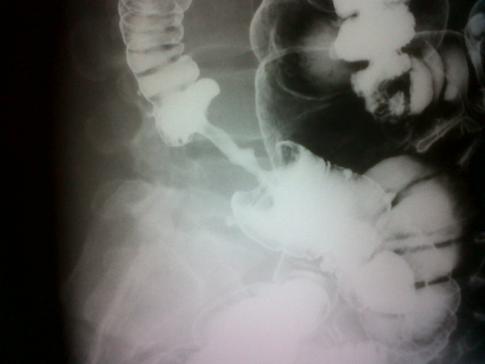

Apple core sign

#### Water-soluble contrast challenge (<u>WSCc</u>) [[8]](https://coursology-qbank.com/amboss/article/t_YXJ7)[[12]](https://coursology-qbank.com/amboss/article/x_YEq7)

* Indication: <u>SBO</u>, to differentiate partial <u>SBO</u> from complete <u>SBO</u> [[7]](https://coursology-qbank.com/amboss/article/tKYXRJ)[[14]](https://coursology-qbank.com/amboss/article/p8XLn-)

* Procedure: A water-soluble contrast medium is administered orally or via an <u>enteric tube</u>, followed by <u>abdominal x-ray</u> 8 and 24 hours after ingestion. [[7]](https://coursology-qbank.com/amboss/article/tKYXRJ)[[12]](https://coursology-qbank.com/amboss/article/x_YEq7)

* Findings [[14]](https://coursology-qbank.com/amboss/article/p8XLn-)

* Normal <u>WSCc</u>: contrast reaches the <u>colon</u> within 24 hours of administration

* Indicates <u>partial bowel obstruction</u>

* The patient may be a candidate for nonoperative management.

* Intraluminal and intramural <u>causes of bowel obstruction</u> may be identified (see “Etiology”). [[9]](https://coursology-qbank.com/amboss/article/F_YgJ7)

* Additional considerations

* <u>WSCc</u> is also used to evaluate response to nonoperative management.

* See “<u>Nonoperative management of mechanical bowel obstruction</u>.” [[9]](https://coursology-qbank.com/amboss/article/F_YgJ7)

### <u>Laboratory studies</u> [[6]](https://coursology-qbank.com/amboss/article/B_Yzq7)[[12]](https://coursology-qbank.com/amboss/article/x_YEq7)[[13]](https://coursology-qbank.com/amboss/article/s_Ytp7)[[27]](https://coursology-qbank.com/amboss/article/35YSPp)

* Routine studies: <u>CBC</u>, <u>BMP</u>, serum <u>lactate</u>, and <u>CRP</u>

* Additional studies: See “<u>Approach to acute abdomen</u>.”

* Supportive findings

* In patients who are <u>dehydrated</u> 

* ↑ <u>BUN</u> and <u>creatinine</u> (<u>prerenal acute kidney injury</u>)

* ↑ <u>Hematocrit</u> (due to <u>hemoconcentration</u>)

* In patients with recurrent <u>vomiting</u>

* <u>Hypochloremic</u> <u>hypokalemic</u> <u>metabolic alkalosis</u>

* <u>Hyponatremia</u>

* Suggestive of <u>complicated bowel obstruction</u> ;  [[6]](https://coursology-qbank.com/amboss/article/B_Yzq7)[[13]](https://coursology-qbank.com/amboss/article/s_Ytp7)[[27]](https://coursology-qbank.com/amboss/article/35YSPp)

* <u>Hyperkalemia</u> , elevated serum <u>lactate</u>, and <u>metabolic acidosis</u>: suggestive of <u>bowel ischemia</u>  [[5]](https://coursology-qbank.com/amboss/article/E_Y8J7)[[7]](https://coursology-qbank.com/amboss/article/tKYXRJ)

* <u>Leukocytosis</u> (> 16,000/mm³) [[12]](https://coursology-qbank.com/amboss/article/x_YEq7)

* Elevated nonspecific <u>inflammatory markers</u> (↑ <u>CRP</u> and serum <u>creatine kinase</u>) [[6]](https://coursology-qbank.com/amboss/article/B_Yzq7)

* ↑ <u>Amylase</u>  [[1]](https://coursology-qbank.com/amboss/article/PLYWBp)[[5]](https://coursology-qbank.com/amboss/article/E_Y8J7)[[7]](https://coursology-qbank.com/amboss/article/tKYXRJ)

* Altered <u>coagulation panel</u> (e.g., elevated <u>INR</u> in <u>sepsis</u>)

> [!NOTE]
> <u>Leukocytosis</u>, <u>metabolic acidosis</u>, and elevated serum <u>lactate</u> in a patient with suspected bowel obstruction are suggestive of <u>bowel ischemia</u>.

---

## Differential diagnoses

* Differential diagnoses of <u>mechanical bowel obstruction</u>

* <u>Paralytic ileus</u> (see “<u>Mechanical bowel obstruction vs. paralytic ileus</u>”)

* <u>Bowel perforation</u> (<u>secondary peritonitis</u>)

* <u>Mesenteric</u> <u>ischemia</u>

* <u>Inflammatory bowel disease</u>

* <u>Ovarian torsion</u>

* Differential diagnoses of <u>SBO</u>

* <u>Acute appendicitis</u>

* <u>Acute pancreatitis</u>

* <u>Pelvic inflammatory disease</u>

* Differential diagnoses of <u>LBO</u>

* <u>Diverticulitis</u>

* <u>Toxic megacolon</u>

* <u>Chronic megacolon</u>

* <u>Acute colonic pseudo-obstruction</u> (<u>Ogilvie syndrome</u>)

* See also:  “<u>Differential diagnoses of acute abdomen</u>.”

| Mechanical bowel obstruction vs. paralytic ileus |  |  |  |
| --- | --- | --- | --- |
|  |  <u>Mechanical bowel obstruction</u> [[1]](https://coursology-qbank.com/amboss/article/PLYWBp)[[3]](https://coursology-qbank.com/amboss/article/v_YAJ7)[[28]](https://coursology-qbank.com/amboss/article/Z0aZeQ)[[29]](https://coursology-qbank.com/amboss/article/qLYCAp)  |  | <u>Paralytic ileus</u> |
| Definition |  * Interruption in the normal passage due to a structural barrier   |  |  * Temporary impairment of <u>peristalsis</u> in the absence of a mechanical obstruction   |
| Etiology |   * <u>Small bowel obstruction</u>  * <u>Bowel adhesions</u>: most common cause of <u>SBO</u>  * <u>Incarcerated hernias</u>: second most common cause of <u>SBO</u>  * <u>Large bowel obstruction</u>  * <u>Malignant tumors</u> (e.g., <u>colorectal carcinoma</u>)  * <u>Volvulus</u>    |  |   * Recent abdominal <u>surgery</u>  * Atherosclerotic disease  * Abdominal infections or inflammatory conditions  * Certain medications (<u>opioids</u>, <u>anticholinergics</u>, antiparkinsonian agents)    |
| Clinical features |   * Colicky abdominal <u>pain</u>  * <u>Vomiting</u>  * <u>Bilious</u> <u>vomiting</u> is an early symptom of <u>SBO</u>.  * <u>Feculent vomiting</u> is a late symptom of <u>LBO</u>.  * <u>Obstipation</u>  or <u>constipation</u>  * Abdominal distention  * High-pitched, tinkling <u>bowel sounds</u> (early)  * Absent <u>bowel sounds</u> (late)    |  |   * Diffuse, continuous abdominal <u>pain</u>  * <u>Vomiting</u>  * <u>Obstipation</u> or <u>constipation</u>  * Marked abdominal distention  * Tympany on percussion  * Absent <u>bowel sounds</u>    |
| Findings on imaging |   * Dilated bowel loops <u>proximal</u> to obstruction  * Collapsed bowel loops <u>distal</u> to obstruction  * No air within <u>rectum</u>  * Multiple air-fluid levels  * Cause of obstruction (e.g., <u>tumor</u>)  * <u>Pendular peristalsis</u> on <u>ultrasound</u> (can also be absent in late <u>mechanical bowel obstruction</u>)    |  |   * Diffusely dilated small and large bowel loops (i.e., uniform distribution of gas in the <u>small bowel</u>, <u>colon</u>, and <u>rectum</u>)  * Air within <u>rectum</u>  * No evidence of mechanical obstruction  * Absent <u>peristalsis</u>    |

References:[[3]](https://coursology-qbank.com/amboss/article/v_YAJ7)[[28]](https://coursology-qbank.com/amboss/article/Z0aZeQ)[[29]](https://coursology-qbank.com/amboss/article/qLYCAp)[[30]](https://coursology-qbank.com/amboss/article/Dh01Tf)

The differential diagnoses listed here are not exhaustive.

---

## Treatment

* See “<u>Initial management of bowel obstruction</u>” for first steps and <u>supportive care</u>.

* Definitive management: depends on the severity and etiology of the obstruction and clinical presentation of the patient

* Interventional management

* <u>Surgery</u>: Transfer the patient to the operating room or admit to a surgical ward depending on the urgency of surgical intervention.

* Endoscopic intervention: e.g., for the removal or fragmentation of foreign objects that are within reach of an endoscope

* Stool evacuation

* Nonoperative management: <u>simple bowel obstruction</u> with no evidence of complications (e.g., <u>partial bowel obstruction</u> or <u>postoperative ileus</u>)

* Identify and treat the underlying cause (see “Etiology”).

---

## Interventional management

### <u>Surgery</u> [[3]](https://coursology-qbank.com/amboss/article/v_YAJ7)[[5]](https://coursology-qbank.com/amboss/article/E_Y8J7)[[9]](https://coursology-qbank.com/amboss/article/F_YgJ7)[[13]](https://coursology-qbank.com/amboss/article/s_Ytp7)[[31]](https://coursology-qbank.com/amboss/article/G_YBp7)

* Indications

* <u>Complicated bowel obstruction</u> (i.e., signs of <u>ischemia</u>, perforation, or clinical deterioration)

* <u>Closed-loop bowel obstruction</u>

* Suspected bowel obstruction in patients presenting with <u>hemodynamic instability</u> refractory to initial <u>fluid resuscitation</u>

* Failure of nonoperative management (i.e., no improvement after 3 days of NOM; clinical deterioration/development of complications during NOM) [[9]](https://coursology-qbank.com/amboss/article/F_YgJ7)[[13]](https://coursology-qbank.com/amboss/article/s_Ytp7)[[32]](https://coursology-qbank.com/amboss/article/UacbPa0)

* Underlying etiology necessitates surgical intervention (e.g., <u>surgery for inguinal hernia</u>; <u>enterolithotomy</u> for <u>gallstone ileus</u>)

* Procedure: <u>exploratory laparotomy</u> 

* Management of the obstruction (e.g., adhesiolysis, <u>hernia</u> reduction, <u>cecopexy</u>, <u>tumor</u> resection)

* Resection of gangrenous bowel with restoration of intestinal transit or creation of a <u>stoma</u>

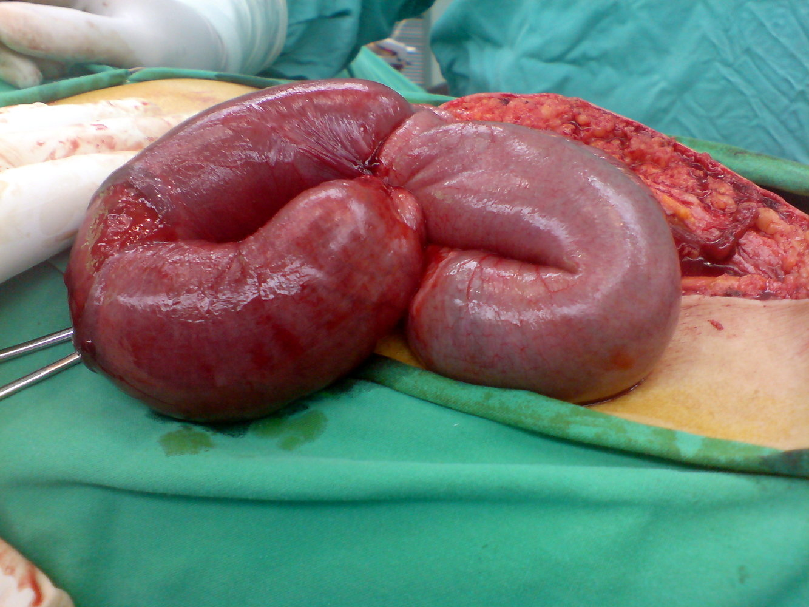

Strangulated bowel

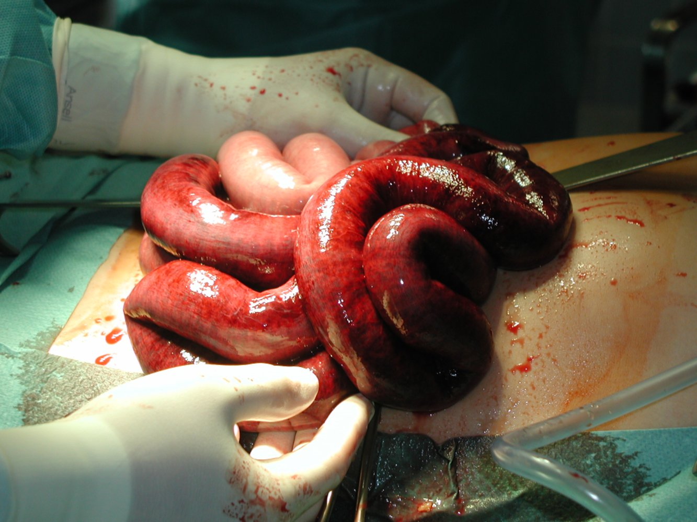

Small bowel ischemia

### Endoscopic intervention [[6]](https://coursology-qbank.com/amboss/article/B_Yzq7)[[33]](https://coursology-qbank.com/amboss/article/A_YRI7)[[34]](https://coursology-qbank.com/amboss/article/mzYVt7)

Endoscopic interventions can be considered for bowel obstruction with no <u>signs of strangulation</u> or perforation. Rigid or <u>flexible sigmoidoscopy</u>, <u>upper GI endoscopy</u>, or <u>colonoscopy</u> under <u>procedural sedation</u> can be used for endoscopic investigation for the following indications.

* <u>Sigmoid volvulus</u>: Attempt <u>endoscopic decompression, detorsion, and reduction</u>.

* <u>Intraluminal bowel obstruction</u>  that is within reach of an endoscope: fragmentation or removal

* Inoperable malignant bowel obstruction: Consider placement of <u>stents</u> and decompression tubes.

### Stool evacuation [[35]](https://coursology-qbank.com/amboss/article/O9XInZ0)

* Indication: <u>simple bowel obstruction</u> caused by <u>fecal impaction</u>

* Procedures

* The specific procedure is chosen based on the site of <u>fecal impaction</u>, only after <u>bowel perforation</u> has been definitively ruled out.

* <u>Manual disimpaction</u>

* <u>Distal</u> softening or washout with enemas or suppositories

* <u>Proximal</u> softening or washout with oral solutions such as <u>polyethylene glycol</u> or <u>sodium</u> <u>phosphate</u>

* See “<u>Treatment of fecal impaction</u>” for details and dosages.

* Important consideration: Identify and manage the underlying cause of <u>constipation</u> that led to <u>fecal impaction</u>.

---

## Nonoperative management

### Indications [[5]](https://coursology-qbank.com/amboss/article/E_Y8J7)[[6]](https://coursology-qbank.com/amboss/article/B_Yzq7)[[9]](https://coursology-qbank.com/amboss/article/F_YgJ7)[[13]](https://coursology-qbank.com/amboss/article/s_Ytp7)

* Early postoperative bowel obstruction (i.e., within 6 weeks of abdominal <u>surgery</u>)  [[12]](https://coursology-qbank.com/amboss/article/x_YEq7)

* <u>Partial bowel obstruction</u> with no evidence of complications

* Consider in patients with complete <u>SBO</u> and no evidence of complications.  [[5]](https://coursology-qbank.com/amboss/article/E_Y8J7)[[9]](https://coursology-qbank.com/amboss/article/F_YgJ7)[[13]](https://coursology-qbank.com/amboss/article/s_Ytp7)

### Contraindications [[5]](https://coursology-qbank.com/amboss/article/E_Y8J7)

* <u>Complicated bowel obstruction</u> (e.g, <u>peritoneal signs</u>, <u>signs of strangulation</u>)

* Refractory <u>metabolic acidosis</u>

* Significant <u>leukocytosis</u> (> 18,000/mm³)

* Significant cecal dilation

### Initial measures

* Bowel rest (<u>NPO</u>)

* <u>Supportive care</u>

* <u>IV fluid therapy</u> (initial <u>fluid resuscitation</u> followed by <u>maintenance fluid therapy</u>)

* <u>Electrolyte repletion</u>

* <u>Parenteral analgesics</u> (<u>nonopioid analgesics</u> are preferred)  [[36]](https://coursology-qbank.com/amboss/article/ypYdHJ)[[37]](https://coursology-qbank.com/amboss/article/QzYus7)

* Parenteral <u>antiemetics</u> as needed

> [!WARNING]
> <u>Peristalsis</u>-inducing medications (i.e., <u>prokinetic agents</u> such as <u>metoclopramide</u>) are contraindicated in complete <u>mechanical bowel obstruction</u>.

> [!TIP]
> <u>Prophylactic antibiotic therapy</u> is not routinely indicated for <u>simple bowel obstruction</u> that is being managed nonoperatively.  [[38]](https://coursology-qbank.com/amboss/article/3acS4a0)

#### <u>Nasogastric tube</u> insertion (bowel decompression)

* Indications: not routinely required but should be considered in the following situations  [[39]](https://coursology-qbank.com/amboss/article/y_YdI7)[[40]](https://coursology-qbank.com/amboss/article/macVOa0)

* Persistent <u>vomiting</u>

* Significant upper GI distention

* <u>Complete bowel obstruction</u>

* <u>Volvulus</u>

* Procedure: See “<u>Nasogastric tube placement</u>.”

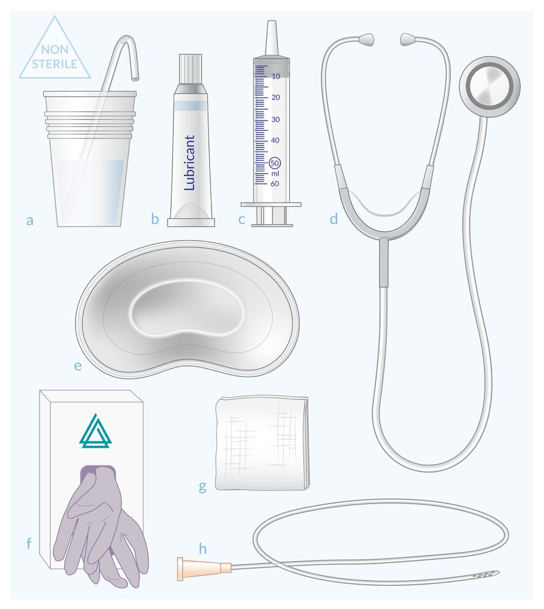

Nasogastric tube insertion equipment

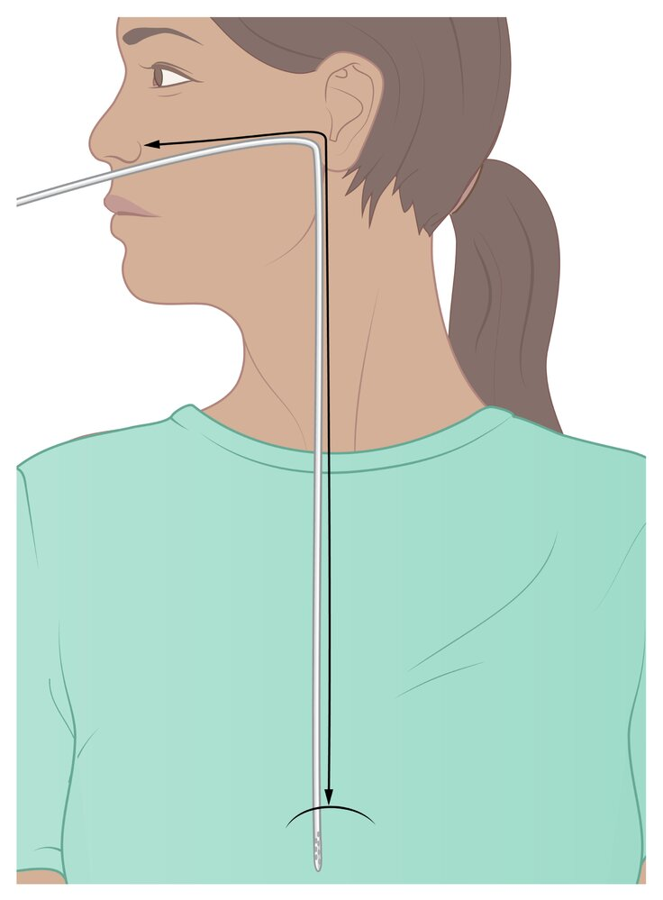

Insertion depth for nasogastric tube placement

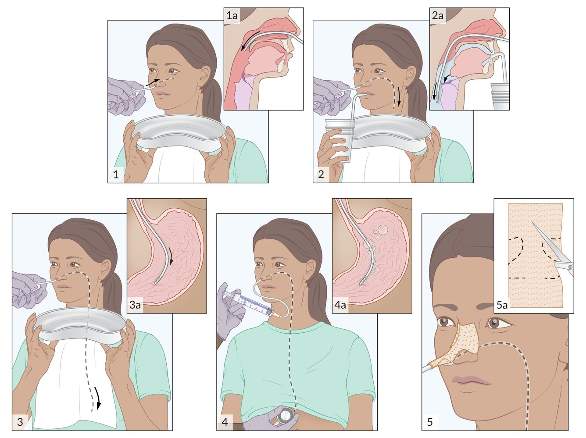

Nasogastric tube placement

### Serial monitoring

* Symptom severity

* Bowel movements

* <u>Serial abdominal examination</u> every 4–8 hours [[12]](https://coursology-qbank.com/amboss/article/x_YEq7)[[13]](https://coursology-qbank.com/amboss/article/s_Ytp7)

* <u>Fluid balance</u> (<u>input and output</u> chart) including <u>nasogastric tube</u> output  [[3]](https://coursology-qbank.com/amboss/article/v_YAJ7)

### Duration of nonoperative management trial [[5]](https://coursology-qbank.com/amboss/article/E_Y8J7)[[13]](https://coursology-qbank.com/amboss/article/s_Ytp7)[[32]](https://coursology-qbank.com/amboss/article/UacbPa0)[[41]](https://coursology-qbank.com/amboss/article/hacc4a0)

* No longer than 72 hours

* Some authors suggest trialing NOM for a maximum of 5 days.

* Continuing nonoperative management for > 72 hours does not decrease the need for <u>surgery</u> but does increase surgical <u>morbidity</u>. [[3]](https://coursology-qbank.com/amboss/article/v_YAJ7)

### Assessment of response and further management

| Assessment of response to NOM and further management |  |  |  |
| --- | --- | --- | --- |
| Response | Clinical features | Supportive evidence | Further management |
| Clinical improvement |   * Symptomatic improvement  * Passage of flatus and feces  * No <u>fever</u>  * Soft abdomen, return of <u>bowel sounds</u>    |   * Normal <u>WBC count</u>  * Decreasing <u>nasogastric tube</u> drainage  * Ability to tolerate <u>NG tube</u> clamping  [[42]](https://coursology-qbank.com/amboss/article/cvXa_-)    |  * Initiate dietary advancement gradually (i.e., start with clear fluids and advance as tolerated).   |
|  Deterioration [[13]](https://coursology-qbank.com/amboss/article/s_Ytp7)  |  * Evidence of complications (e.g., <u>peritoneal signs</u> on <u>physical examination</u>)   |   * Failed <u>WSCc</u> (most accurate) [[12]](https://coursology-qbank.com/amboss/article/x_YEq7)  * CT findings [[5]](https://coursology-qbank.com/amboss/article/E_Y8J7)[[13]](https://coursology-qbank.com/amboss/article/s_Ytp7)  * Absence of <u>colonic</u> stool  * <u>Mesenteric</u> <u>edema</u>  * <u>Peritoneal</u> fluid > 500 mL  * Signs of vascular compromise or <u>ischemia</u>  * <u>Nasogastric tube</u> drainage > 500 mL/day on day 3 after <u>nasogastric tube placement</u>  * <u>WBC count</u> > 10,000/mm³  * <u>CRP</u> > 75 mg/L    |  * Exploratory <u>surgery</u> [[13]](https://coursology-qbank.com/amboss/article/s_Ytp7)   |
|  Lack of improvement (no evidence of complications) |  * Status quo 48–72 hours after initiating nonoperative management   |  |  * Consider therapeutic <u>WSCc</u> (especially in patients < 65 years of age without a previous abdominal <u>surgery</u>).  [[5]](https://coursology-qbank.com/amboss/article/E_Y8J7)[[9]](https://coursology-qbank.com/amboss/article/F_YgJ7)   |

---

## Complications

* <u>Bowel ischemia</u>

* <u>Bowel perforation</u>

* <u>Peritonitis</u>

> [!NOTE]
> A change in the character of <u>pain</u> (colicky <u>pain</u> becoming continuous), <u>rebound tenderness</u> on examination, and/or <u>signs of sepsis</u> in a patient with bowel obstruction indicate the onset of complications and necessitate emergency surgical intervention.

We list the most important complications. The selection is not exhaustive.

---