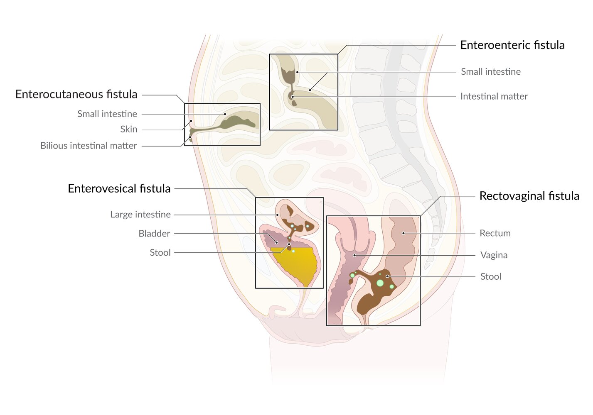
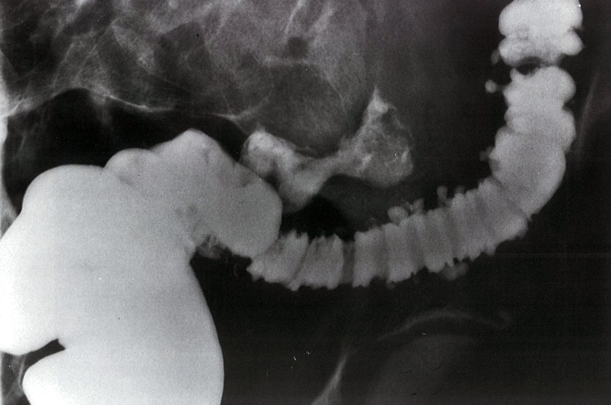
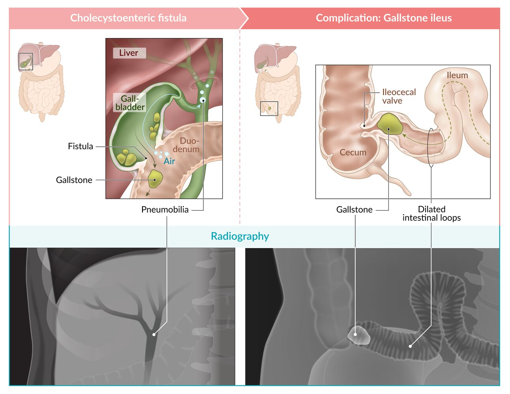
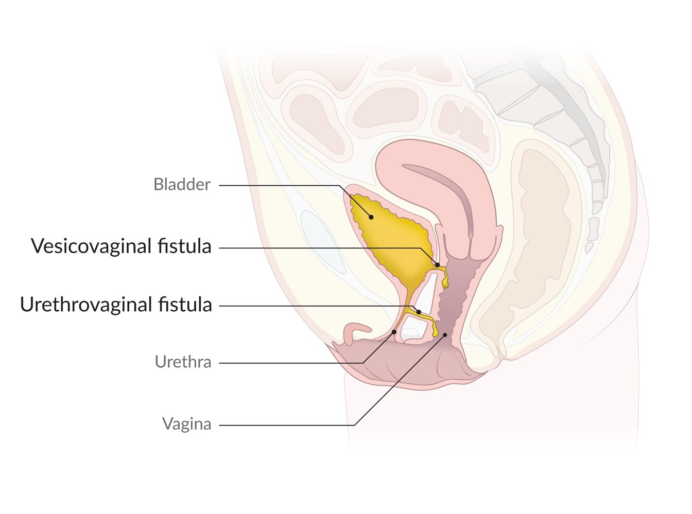

# Fistulas

*Categories: Clinical knowledge > Surgery > Abdominal surgery > Small and large intestine > Fistulas*

[Original Article Link](https://coursology-qbank.com/amboss/article/vH0AHh)

---

## Summary

A fistula is an abnormal connection between two <u>epithelium</u>-lined surfaces. The most common fistulas are <u>enteroenteric fistula</u>, <u>enterovesical fistula</u>, <u>rectovaginal fistula</u>, <u>cholecystoenteric fistula</u>, <u>pancreatic fistula</u>, and <u>urogenital fistula</u>. Fistulas are most commonly caused by local inflammation (e.g., <u>diverticulitis</u>, <u>Crohn disease</u>, <u>pancreatitis</u>), <u>malignancy</u> (e.g., <u>colon cancer</u>, <u>rectal cancer</u>), or <u>iatrogenic</u> injury (e.g., resulting from <u>prolonged labor</u>, abdominal or <u>pelvic</u> <u>surgery</u>, radiation). Clinical features depend on the location of the fistula, e.g., enteroenteric, enterovesical, and <u>pancreatic</u> fistulas cause abdominal <u>pain</u> and <u>diarrhea</u>. Some fistulas (e.g., enterovesical, vesicovaginal, rectovaginal, and <u>enterocutaneous fistulas</u>) cause leakage of fluid from the connected organ. Diagnosis for most fistulas is made via abdominal or <u>pelvic</u> CT. Treatment most commonly consists of fistula resection, although <u>conservative management</u> may be indicated for certain fistulas (e.g., choledochoduodenal and <u>pancreatic</u> fistulas).

For more information on vascular fistulas, see “<u>Arteriovenous fistulas</u>;” for more information on <u>tracheoesophageal fistula</u>, see “<u>Esophageal atresia</u>;” and for more information on <u>anal fistulas</u>, see “<u>Anal abscess and fistula</u>."

---

## Intestinal fistulas

Intestinal fistulas

### Enteroenteric fistula

* Definition: an abnormal connection between two parts of the bowel

* Etiology

* <u>Iatrogenic</u>

* A complication of open abdominal <u>surgery</u>: usually caused by procedures during which bowel is frequently manipulated or by disruption of bowel <u>anastomosis</u>, inadvertent <u>enterotomy</u>, or <u>small bowel</u> injury

* <u>Irradiation</u>

* <u>Inflammatory bowel disease</u> (<u>IBD</u>): <u>Crohn disease</u>, <u>ulcerative colitis</u>

* GI disorders: e.g., <u>complicated diverticulitis</u>, <u>acute appendicitis</u>, <u>gastrointestinal tuberculosis</u>, <u>peptic ulcer disease</u>

* <u>Malignancy</u>: e.g., <u>colorectal cancer</u>, <u>gastric cancer</u>

* <u>Foreign body ingestion</u>

* Trauma

* Pathophysiology: deficient <u>anastomoses</u>/sutures, improper healing following intervention (e.g., radiation), or trauma → leakage of intestinal contents → local infection → <u>abscess</u> formation and/or <u>erosion</u> → intestinal <u>epithelial</u> defect → <u>epithelial</u> cells penetrating into deeper layers of the <u>mucosa</u> → formation of a tube-like structure → tube connecting to other organs or the body surface (fistula formation) [[1]](https://coursology-qbank.com/amboss/article/B8bzKv)

* Types

* Coloenteric fistula: an abnormal connection between the <u>colon</u> and the <u>small bowel</u> (most commonly located at the <u>terminal ileum</u>)

* Gastrocolic fistula: an abnormal connection between the <u>stomach</u> and the <u>colon</u>

* Clinical features

* <u>Coloenteric fistula</u> [[2]](https://coursology-qbank.com/amboss/article/iucJIV0)

* Sudden and severe <u>watery diarrhea</u>

* Abdominal <u>pain</u>

* Weight loss

* <u>Physical examination</u> might show a palpable abdominal mass.

* <u>Gastrocolic fistula</u> [[3]](https://coursology-qbank.com/amboss/article/juc_IV0)

* Abdominal <u>pain</u>

* <u>Vomiting</u> (may be feculent), foul‑smelling belching

* <u>Diarrhea</u>

* Weight loss

* Diagnostics [[4]](https://coursology-qbank.com/amboss/article/QucuIV0)

* CT abdomen and <u>pelvis</u>: to diagnose suspected <u>coloenteric fistula</u>

* <u>Colonoscopy</u>: to rule out <u>malignancy</u> as the cause of fistula (malignant fistula)

* <u>Barium enema</u>: preferred test for diagnosing <u>gastrocolic fistula</u>  [[3]](https://coursology-qbank.com/amboss/article/juc_IV0)

* Treatment: resection of fistula and reanastamosis of healthy bowel

* Complications

* Infection, <u>sepsis</u>

* Fluid and <u>electrolyte</u> abnormalities

* <u>Malnutrition</u>

* Prognosis: recurrence may occur (∼ 36% of cases) [[5]](https://coursology-qbank.com/amboss/article/4uc3rV0)

Fistula following a ruptured diverticulum

### Enterocutaneous fistula

* Definition: an abnormal connection between the small or large bowel and the <u>skin</u>

* Etiology

* <u>Iatrogenic</u>: e.g., abdominal <u>surgery</u>, percutaneous drainage, radiation

* Inflammation: e.g., <u>Crohn disease</u>, <u>gastrointestinal tuberculosis</u>

* <u>Malignancy</u>: e.g., <u>colorectal cancer</u>

* <u>Foreign body ingestion</u>

* Trauma

* Subtype

* Enteroatmospheric fistula

* An abnormal communication between the lumen of the <u>GI tract</u> and the external atmosphere (e.g., via an open abdominal wound)

* Most commonly occurs as a complication of abdominal <u>surgery</u> (e.g., <u>laparotomy</u> during which the abdomen is left open to prevent <u>abdominal compartment syndrome</u>)

* See also “<u>Fistulizing Crohn disease</u>.”

* Clinical features [[1]](https://coursology-qbank.com/amboss/article/B8bzKv)

* Abdominal <u>pain</u>

* <u>Nausea</u>, <u>vomiting</u>

* <u>Obstipation</u>

* Induration of the abdominal wall, drainage of intestinal content through the <u>skin</u>

* Possibly <u>fever</u>

* Management [[6]](https://coursology-qbank.com/amboss/article/wy1hhj0)[[7]](https://coursology-qbank.com/amboss/article/rhaf24)

* Stabilization (24–48 hours)

* Fluid/<u>electrolyte replacement</u>

* Fluid correction with <u>normal saline</u> or <u>ringer lactate</u>

* <u>Electrolyte</u> and <u>acid-base disturbances</u> correction (e.g., <u>hypokalemia</u>, <u>hypomagnesemia</u>, <u>metabolic acidosis</u>)

* Identification and control of infection;  (e.g, <u>sepsis</u>, <u>peritonitis</u>, <u>surgical site infection</u>)

* <u>Antibiotic therapy</u>

* If applicable, source control via percutaneous drainage or surgical exploration for <u>intraabdominal abscess</u>, fluid collection, or <u>peritonitis</u>

* <u>Complete bowel rest</u> and nutritional management (based on fistula output and length of functional bowel) [[6]](https://coursology-qbank.com/amboss/article/wy1hhj0)

* Low- and medium-output fistulas < 0.5 L/24 hours: oral nutrition or <u>enteral nutrition</u>

* High-output fistulas > 0.5 L/24 hours: <u>parenteral nutrition</u>; substitute with <u>enteral nutrition</u> if the patient tolerates it

* <u>Wound management</u>

* <u>Ostomy pouch</u> or <u>negative pressure wound therapy</u>

* Local skincare (e.g., <u>barrier creams</u>, ostomy appliances)

* Agents to reduce fistula output (e.g., <u>antidiarrheal agents</u>, <u>somatostatin</u>)

* Fistula and bowel anatomy assessment (after 7–10 days)

* <u>CT scan</u>, fistulogram, and/or <u>enteroscopy</u>: shows anatomy of the fistula and detects possible <u>intraabdominal abscess</u>, fluid collections, and/or intestinal obstructions

* Biochemical analysis of <u>ECF</u> fluid (e.g., ↑ <u>bilirubin</u>)

* Surgical planning (after 7–10 days to 4–6 weeks)

* Assess the likelihood of nonoperative closure (spontaneous closure occurs in at least 30% of patients)  [[8]](https://coursology-qbank.com/amboss/article/MSXMZB)

* Plan therapeutic course and operative approach

* Operative treatment (> 4–6 weeks)

* Endoscopic or surgical repair

* Indicated if fistula does not close sufficiently (e.g., complex fistulas, high-output fistulas) after approx. 3 months of <u>conservative treatment</u>

> [!TIP]
> Optimized <u>nutritional support</u> is associated with higher fistula closure rates and lower mortality. [[6]](https://coursology-qbank.com/amboss/article/wy1hhj0)

### Enterovesical fistula

* Definition: an abnormal connection between the <u>bladder</u> and bowel (e.g., <u>colon</u>, <u>rectum</u>)

* Etiology

* Congenital: e.g., failure of the <u>urorectal septum</u> to develop

* Acquired

* Inflammation: e.g., <u>diverticulitis</u>, <u>Crohn disease</u>

* Cancer: e.g., <u>colon cancer</u>

* Radiation

* Trauma

* Pathophysiology: fistula between <u>bladder</u> and bowel → direct spread of intestinal bacteria to the <u>bladder</u> → <u>recurrent UTIs</u>

* Subtype: colovesical fistula (a fistula between the <u>colon</u> and <u>bladder</u>)

* Clinical features

* Pneumaturia: passing of air in the urine

* Fecaluria: passing of stool in the urine

* <u>Recurrent UTIs</u> and <u>urosepsis</u>: suprapubic <u>pain</u>, <u>dysuria</u>, urgency, frequency, possibly <u>hematuria</u>

* Diagnostics

* CT abdomen with oral contrast [[9]](https://coursology-qbank.com/amboss/article/UEcbEV0)

* Localized thickening of the <u>colon</u> and <u>bladder</u>

* Air or collection of radiocontrast in the <u>bladder</u>

* <u>Urinalysis</u>

* <u>Pyuria</u> and <u>bacteriuria</u>

* Signs of <u>fecaluria</u> (e.g., undigested muscle fibers) [[10]](https://coursology-qbank.com/amboss/article/eEcxuV0)

* Management

* Resection and <u>primary anastomosis</u>

* <u>Antibiotics</u> if <u>surgery</u> is not possible

### Rectovaginal fistula

* Definition: an abnormal connection between the <u>rectum</u> and the <u>vagina</u>

* Etiology

* Most commonly obstetric complications

* <u>Prolonged labor</u>

* <u>Episiotomy</u>

* Failed repair of a <u>perineal laceration</u>

* Injury during vaginal delivery

* Less common

* <u>Crohn disease</u>, <u>diverticulitis</u>

* Radiation

* <u>Colon cancer</u>

* <u>Fecal impaction</u>

* Clinical features

* Very small <u>rectovaginal fistulas</u> are often asymptomatic.

* Uncontrollable passage of gas and/or feces from the <u>vagina</u>

* Malodorous <u>vaginal discharge</u>

* Diagnostics

* Vaginal examination (with speculum or even <u>colposcopy</u>)

* <u>Methylene blue</u> dye can help to identify the fistula tract.

* <u>Endoanal ultrasound</u>: to rule out concomitant anal sphincter defects

* Differential diagnosis

* <u>Anal fistula</u>

* <u>Perianal abscess</u>

* Anal incontinence

* Vaginal infection (e.g., <u>chlamydia</u>)

* Treatment

* Transvaginal, transanal, transsphincteric, or transverse transperineal fistulectomy (with or without graft or tissue interposition)

* In patients with concomitant sphincter injury: sphincter repair and reconstruction of the <u>perineal body</u> and rectovaginal septum

---

## Biliary-enteric fistulas

### Cholecystoenteric fistula  [[11]](https://coursology-qbank.com/amboss/article/4ib37t)[[12]](https://coursology-qbank.com/amboss/article/QQbuDt)[[13]](https://coursology-qbank.com/amboss/article/jQb_Dt)

* Definition: an abnormal connection between the <u>gallbladder</u> lumen and the lumen of the adjacent bowel (usually <u>stomach</u> or <u>duodenum</u>)

* Etiology

* Most commonly: <u>gallbladder perforation</u> or pressure <u>necrosis</u> from a large <u>gallstone</u>

* Rarely: <u>acute cholecystitis</u>, <u>gallbladder carcinoma</u> (<u>neoplastic</u> infiltration)

* Clinical features [[14]](https://coursology-qbank.com/amboss/article/9lYN_6)

* Potentially asymptomatic

* <u>Bile acid diarrhea</u>

* Can manifest as <u>cholangitis</u> (e.g., <u>fever</u>, <u>pain</u>, <u>jaundice</u>)

* <u>Gallstone ileus</u>, which may manifest as:

* <u>Mechanical bowel obstruction</u> (obstruction is often located at the <u>ileocecal valve</u>)

* Bouveret syndrome: <u>gastric outlet obstruction</u> secondary to impaction of a <u>gallstone</u> in the <u>pylorus</u> or <u>proximal</u> <u>duodenum</u> [[15]](https://coursology-qbank.com/amboss/article/LQbw9t)

* Diagnostics

* Imaging [[14]](https://coursology-qbank.com/amboss/article/9lYN_6)

* Air within the biliary tree (pneumobilia)

* Fistulous tract between the <u>gallbladder</u> (typically the fundus) and the adjacent bowel

* Upper GI <u>barium enema</u>: no contrast in the <u>colon</u>

* Management

* Patients with <u>cholangitis</u>: <u>empiric antibiotic therapy</u> for biliary infection (combination regimen), <u>laparoscopic cholecystectomy</u>, and closure of the fistula [[16]](https://coursology-qbank.com/amboss/article/tMYXqp)

* Patients with <u>gallstone ileus</u>: <u>enterolithotomy</u> with or without <u>cholecystectomy</u> and closure of the fistula (see ''Treatment'' in “<u>Gallstone ileus</u>”) [[17]](https://coursology-qbank.com/amboss/article/JRYsLK)[[18]](https://coursology-qbank.com/amboss/article/rQbfxt)

Cholecystoenteric fistula and gallstone ileus

### Choledochoduodenal fistula [[19]](https://coursology-qbank.com/amboss/article/ivcJ-V0)

* Definition: an abnormal connection between the <u>common bile duct</u> and the <u>duodenum</u>

* Etiology: <u>cholelithiasis</u>, <u>duodenal ulcer</u>, and tumors (e.g., <u>gallbladder carcinoma</u>)

* Clinical features: symptoms of <u>cholangitis</u> (e.g., <u>fever</u>, <u>pain</u>, <u>jaundice</u>)

* Diagnostics

* Imaging: <u>pneumobilia</u>

* GI barium studies: opacification of <u>bile</u> ducts

* CT abdomen: fistula with <u>duodenal</u> narrowing

* Endoscopy: to rule out <u>malignancy</u>

* Management

* Primarily conservative: e.g., antiulcer therapy (see “<u>Treatment of peptic ulcer disease</u>”)

* <u>Surgery</u> is only recommended in refractory cases.

---

## Pancreatic fistula

* Definition: an abnormal connection between the <u>pancreas</u> and adjacent or distant organs, structures, or spaces (e.g., <u>pleural cavity</u>)

* Internal <u>pancreatic fistula</u>: <u>pancreatic duct</u> connects to the <u>peritoneal cavity</u>, <u>pleural cavity</u>, or hollow <u>viscus</u>

* External <u>pancreatic fistula</u>: <u>pancreatic duct</u> connects to the <u>skin</u>

* Etiology

* Acute or <u>chronic pancreatitis</u>

* <u>Pancreatic resection</u>

* Percutaneous drainage of <u>pancreatic pseudocyst</u> or <u>pancreatic abscess</u>

* Abdominal trauma

* Pathophysiology: disruption of <u>pancreatic duct</u> → leakage of <u>pancreatic</u> fluid → <u>erosion</u> of neighboring structures, <u>dehydration</u>, <u>malnutrition</u>, and possibly infection

* Clinical features

* Internal <u>pancreatic fistula</u>

* Can be asymptomatic

* Common symptoms include abdominal <u>pain</u>/distention (due to <u>ascites</u>), <u>nausea</u>, <u>vomiting</u>, <u>diarrhea</u>

* Possibly <u>GI bleeding</u>

* In severe cases: weight loss, <u>anorexia</u>, <u>weakness</u>

* External <u>pancreatic fistula</u>: drainage of <u>pancreatic</u> fluid from an abdominal wound

* Both

* Signs of <u>dehydration</u> and <u>malnutrition</u>

* In cases of infection: <u>fever</u>

* Diagnostics

* Imaging (e.g., CT abdomen)

* Fluid collections in abdominal and/or <u>thoracic cavity</u>

* Signs of acute or <u>chronic pancreatitis</u> (e.g., <u>edematous</u> swelling)

* Laboratory tests: Fluid analysis from drainage of an external fistula shows increased <u>pancreatic</u> fluid <u>amylase</u>.  [[20]](https://coursology-qbank.com/amboss/article/mvcV0e0)

* Management

* Conservative management  [[21]](https://coursology-qbank.com/amboss/article/5vci0e0)

* <u>Nil per os</u> to reduce <u>pancreatic</u> stimulation

* Nasojejunal feeding to correct <u>malnutrition</u>

* Correction of fluid and <u>electrolyte</u> disturbances

* <u>Somatostatin analogs</u> (e.g., <u>octreotide</u>) to reduce fistula output

* <u>Skin</u> care in external <u>pancreatic</u> fistulas

* <u>Antibiotics</u> in cases of infection

* Endoscopic therapy (<u>pancreatic</u> <u>stent</u> placement) if <u>conservative treatment</u> fails

* <u>Surgery</u> (e.g., pancreaticojejunostomy) if endoscopic treatment fails

* Complications

* <u>Dehydration</u>, <u>malnutrition</u>

* <u>Erosion</u> of neighboring structures, <u>skin</u> <u>excoriation</u>

* Infection, <u>sepsis</u>

---

## Urogenital fistulas

|  <u>Urogenital fistulas</u>  |  |  |  |
| --- | --- | --- | --- |
| Characteristics |  | Vesicovaginal fistula | Ureterovaginal fistula |
| Definition |  |  * An abnormal connection between the <u>vagina</u> and the <u>bladder</u>   |  * An abnormal connection between the <u>vagina</u> and the <u>distal</u> <u>ureter</u>   |
| <u>Epidemiology</u> |  |   * Most commonly occurs in individuals living in resource-limited countries (esp. sub-Saharan Africa and South Asia)  * In patients living in resource-rich countries, the most common cause is <u>iatrogenic</u> injury (e.g., <u>bladder injury</u> during <u>hysterectomy</u>).    |  |
| Etiology |  |  * Sexual intercourse at an early age   |  * <u>Lacerations</u> during <u>surgery</u>   |
|  * Prolonged/<u>obstructed labor</u>, cancer (e.g., <u>rectal cancer</u>), and <u>radiation therapy</u>   |  |  |  |
| Pathophysiology |  |  * Prolonged compression of <u>soft tissue</u> between the maternal <u>pelvic</u> bones and fetal head → maternal <u>soft tissue</u> pressure <u>necrosis</u> → formation of fistulas   |  |
| Clinical features |  |  * Continuous urinary leakage from the <u>vagina</u> after delivery   |  |
| Diagnostics | Vaginal examination |   * A small, <u>erythematous</u> area with an opening that may or may not be visible  * Urinary leakage or pooling on direct visualization    |  |
| Double dye test |  * Dye (e.g., <u>methylene blue</u>) is inserted through a catheter into the <u>bladder</u> and a tampon or cotton swab is then inserted into the <u>vagina</u>.  * Positive for <u>vesicovaginal fistula</u>: blue staining on the tampon or swab  * Positive for <u>ureterovaginal fistula</u>: clear fluid on the tampon or swab   |  |  |
| Other tests |   * <u>Cystoscopy</u>  * <u>Retrograde pyelography</u>    |  |  |
| Treatment |  |  * Surgical repair   |  |

Urogenital fistulas

---