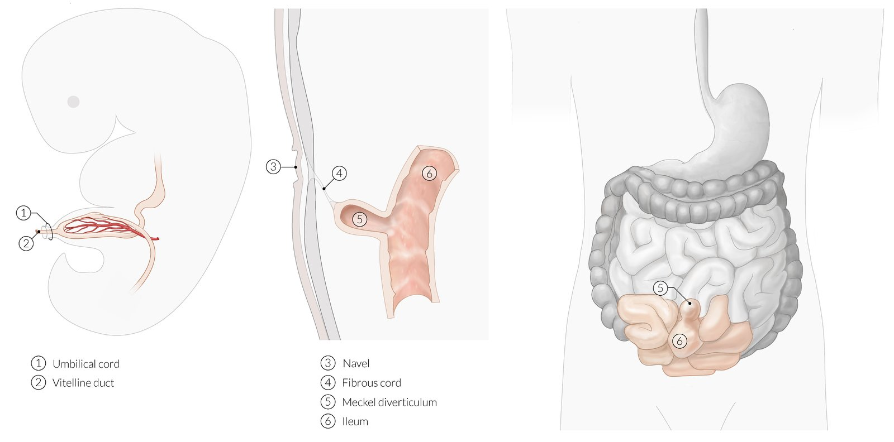
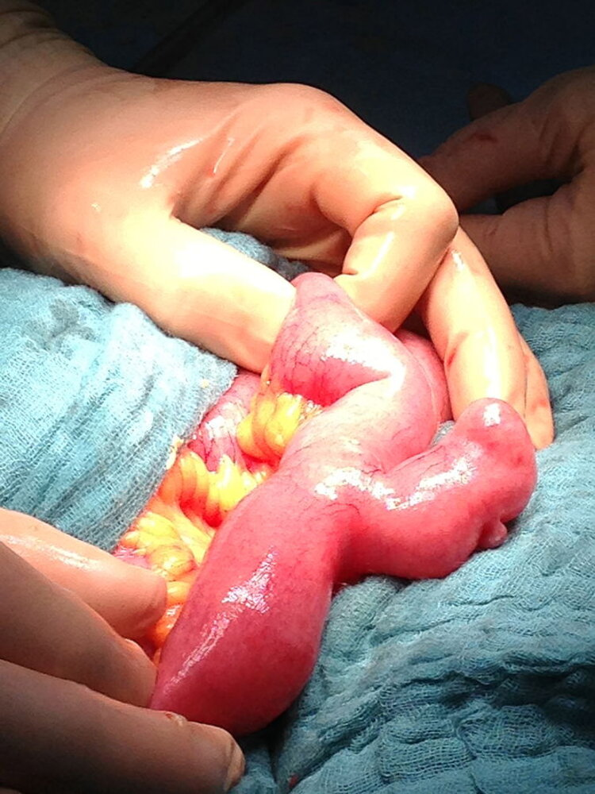
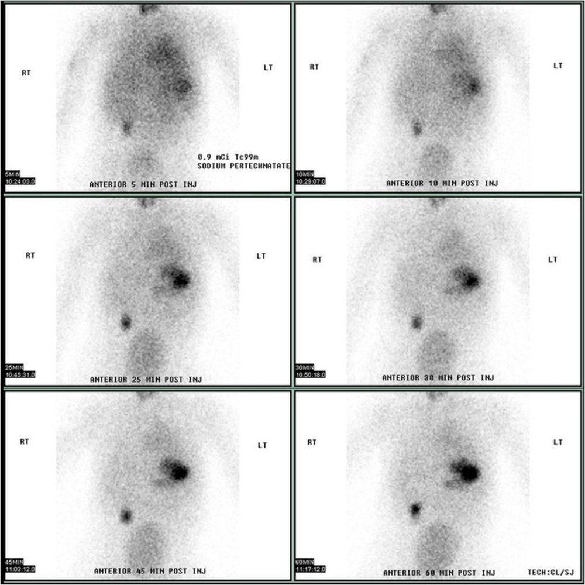

# Meckel diverticulum

*Categories: Clinical knowledge > Surgery > Abdominal surgery > Small and large intestine > Meckel diverticulum*

[Original Article Link](https://coursology-qbank.com/amboss/article/3o0SbS)

---

## Summary

A Meckel diverticulum is the most common congenital anomaly of the gastrointestinal (GI) tract and is caused by an incomplete obliteration of the <u>vitelline duct</u>. It is commonly approx. 5 cm (2 inches) long and located 60 cm (2 feet) <u>proximal</u> to the <u>ileocecal valve</u>. The diverticulum may contain native <u>ileal</u> <u>mucosa</u> or heterotopic (most commonly gastric) <u>mucosa</u>. Meckel <u>diverticula</u> are often asymptomatic and detected incidentally on imaging or during abdominal <u>surgery</u>. A symptomatic Meckel diverticulum usually causes painless <u>lower GI bleeding</u> in children < 2 years. Patients may also present with complications from a Meckel diverticulum including <u>diverticulitis</u>, <u>bowel obstruction</u>, and, rarely, <u>peritonitis</u> due to Meckel diverticulum perforation. Meckel diverticulum should be considered in patients with <u>lower GI bleeding</u> and inconclusive findings on initial workup. Diagnostic studies for Meckel diverticulum include <u>Meckel scan</u>, endoscopy, and <u>laparoscopy</u>. A symptomatic Meckel diverticulum is treated with surgical resection. For an asymptomatic Meckel diverticulum detected incidentally during abdominal <u>surgery</u>, resection is indicated in children and may be considered in adults. An asymptomatic Meckel diverticulum detected incidentally on imaging does not require treatment.

---

## Epidemiology

* <u>Prevalence</u>: most common congenital <u>gastrointestinal tract</u> anomaly (∼ 2% of the population) [[1]](https://coursology-qbank.com/amboss/article/rOdfFJ0)

* Sex: <u>♂</u> > <u>♀</u> (2:1)  [[1]](https://coursology-qbank.com/amboss/article/rOdfFJ0)

* Age: commonly symptomatic at < 2 years of age [[1]](https://coursology-qbank.com/amboss/article/rOdfFJ0)

Epidemiological data refers to the US, unless otherwise specified.

---

## Pathophysiology

### <u>Embryology</u>

* The <u>omphalomesenteric duct</u> (vitelline or vitellointestinal) is a patent tubular structure connecting the <u>yolk sac</u> to the alimentary tract in the embryo.

* The duct is normally obliterated by the 6–7th week of intrauterine life. [[2]](https://coursology-qbank.com/amboss/article/vlaAAk)

* Incomplete obliteration of the <u>omphalomesenteric duct</u> → persistence of the <u>proximal</u> (intestinal) segment of the duct → Meckel diverticulum

Meckel diverticulum

### Meckel diverticulum

* <u>True diverticulum</u>

* Located ∼60 cm <u>proximal</u> to the <u>ileocecal valve</u> (on the antimesenteric side of the <u>ileum</u>) [[3]](https://coursology-qbank.com/amboss/article/TpX6K_)

* Commonly ≤ 5 cm long

* May contain 2 types of <u>mucosa</u> [[4]](https://coursology-qbank.com/amboss/article/wlah_k)

* Native <u>ileal</u> <u>mucosa</u>

* <u>Ectopic</u> <u>mucosa</u>

* Most common: acid-producing gastric <u>mucosa</u> (∼ 60%) [[2]](https://coursology-qbank.com/amboss/article/vlaAAk)

* Other types include <u>pancreatic</u>, <u>colonic</u>, and <u>duodenal</u> <u>mucosa</u>.

* Presence of <u>ectopic</u> gastric <u>mucosa</u> or <u>pancreatic</u> tissue → acid or enzyme secretion within the diverticulum → <u>ileal</u> <u>ulceration</u> → bleeding

* Blood supply: vitelline <u>artery</u>  [[5]](https://coursology-qbank.com/amboss/article/Dla1_k)

> [!NOTE]
> The rule of two's describes common features of Meckel <u>diverticula</u>: occurs in 2% of the population, 2% are symptomatic, mostly in children < 2 years, affects males twice as often as females, is located 2 ft <u>proximal</u> to the <u>ileocecal valve</u>, is ≤ 2 in long, and can have 2 types of <u>mucosal</u> lining.

Meckel diverticulum

---

## Clinical features

* Asymptomatic (most common): often detected incidentally on imaging or during abdominal <u>surgery</u>

* Symptomatic [[1]](https://coursology-qbank.com/amboss/article/rOdfFJ0)[[6]](https://coursology-qbank.com/amboss/article/AN1Rdh0)

* Painless <u>lower GI bleeding</u> (most common presentation), e.g.:

* <u>Hematochezia</u>

* <u>Melena</u>

* Symptoms of complications, e.g.:

* <u>Symptoms of diverticulitis</u> (e.g., abdominal <u>pain</u>)

* <u>Symptoms of intussusception</u> (e.g., currant jelly stools)

* <u>Symptoms of GI perforation</u>

* <u>Symptoms of bowel obstruction</u>

* <u>Symptoms of anemia</u>

---

## Diagnosis

### Approach [[1]](https://coursology-qbank.com/amboss/article/rOdfFJ0)[[6]](https://coursology-qbank.com/amboss/article/AN1Rdh0)[[7]](https://coursology-qbank.com/amboss/article/7Od4FJ0)

* Initial diagnostics for symptomatic patients are based on clinical presentation.

* See “<u>Initial evaluation of GI bleeding</u>.”

* See “<u>Approach to acute abdomen</u>.”

* Consider imaging studies (e.g., CT, US) to narrow the differential diagnosis or assess for suspected complications (e.g., brisk bleeding, <u>bowel obstruction</u>, <u>bowel perforation</u>).

* Perform a <u>Meckel scan</u> in patients (particularly children) with a suspected Meckel diverticulum.

* Consider endoscopy or <u>laparoscopy</u> if diagnosis remains uncertain.

### Meckel scan [[7]](https://coursology-qbank.com/amboss/article/7Od4FJ0)[[8]](https://coursology-qbank.com/amboss/article/sOdtFJ0)

* Description: a noninvasive nuclear medicine imaging technique using <u>technetium-99m</u> pertechnetate, which is preferentially absorbed by the gastric <u>mucosa</u>

* Indications

* Suspected Meckel diverticulum without active bleeding

* Occult bleeding with unclear etiology

* Findings: visualization of <u>ectopic</u> gastric <u>mucosa</u> lining the diverticulum   [[8]](https://coursology-qbank.com/amboss/article/sOdtFJ0)

Meckel diverticulum

### Other imaging studies [[1]](https://coursology-qbank.com/amboss/article/rOdfFJ0)[[7]](https://coursology-qbank.com/amboss/article/7Od4FJ0)[[9]](https://coursology-qbank.com/amboss/article/BOdzuJ0)

Routine imaging has low <u>sensitivity</u> and <u>specificity</u> for Meckel <u>diverticula</u> and is typically used to assess complications.

* <u>Ultrasound</u> abdomen

* Commonly used initial imaging modality in children

* May show <u>intussusception</u> or inflamed <u>diverticula</u>

* CT or <u>MRI</u> abdomen with IV contrast

* May rule out differential diagnoses (e.g., <u>appendicitis</u>)

* May show signs of complications (e.g., <u>diverticulitis</u>, <u>bowel perforation</u>, <u>bowel obstruction</u>)

* Oral contrast improves <u>sensitivity</u> [[1]](https://coursology-qbank.com/amboss/article/rOdfFJ0)

* <u>CT angiography</u>

* Used to localize the source of a <u>GI bleed</u>

* Patent vitelline <u>artery</u> is <u>pathognomonic</u> for Meckel diverticulum [[7]](https://coursology-qbank.com/amboss/article/7Od4FJ0)

### Endoscopy [[7]](https://coursology-qbank.com/amboss/article/7Od4FJ0)

* Double-balloon enteroscopy: an enteroscopic technique to visualize the entire <u>small intestine</u>

* A long endoscope is advanced into the <u>small intestine</u> through the mouth or <u>rectum</u>.

* Sequentially inflating and deflating two balloons advances the scope into the intestine by pleating the bowel over the scope.

* <u>Capsule endoscopy</u>: allows for direct visualization of the diverticulum, but may fail to detect the diverticulum if the capsule passes the diverticular opening without recording it

---

## Management

All symptomatic <u>diverticula</u> require <u>surgery</u>. Managing asymptomatic <u>diverticula</u> is more nuanced and involves weighing the risk of future complications against surgical risks.

### Management of symptomatic <u>diverticula</u> [[6]](https://coursology-qbank.com/amboss/article/AN1Rdh0)

* Stabilize <u>hemodynamically unstable</u> patients using the <u>ABCDE approach</u>, e.g.:

* Initiate <u>immediate hemodynamic support</u>.

* <u>Manage hemorrhagic shock</u>.

* Begin management of acute symptoms:

* See “<u>Initial management of overt GI bleeding</u>.”

* See “<u>Approach to management of acute abdomen</u>.”

* If a Meckel diverticulum is confirmed or likely, consult <u>surgery</u> for operative management.

* In consultation with <u>surgery</u>, determine disposition:

* Admit all patients with ongoing <u>GI bleeding</u> or urgent need for <u>surgery</u>.

* Consider <u>ICU</u> admission for <u>hemodynamic instability</u> or massive <u>GI bleeding</u>.

* Consider discharging patients with minor resolved bleeding and outpatient follow up.

### Management of asymptomatic <u>diverticula</u> [[8]](https://coursology-qbank.com/amboss/article/sOdtFJ0)[[10]](https://coursology-qbank.com/amboss/article/HOdKFJ0)[[11]](https://coursology-qbank.com/amboss/article/xd1EHf0)

* Detected on imaging: no treatment necessary

* Incidental finding during unrelated <u>surgery</u>

* Children: resection typically indicated

* Adults: individualized decision

### <u>Surgery</u> [[8]](https://coursology-qbank.com/amboss/article/sOdtFJ0)[[11]](https://coursology-qbank.com/amboss/article/xd1EHf0)

* Indications

* Symptomatic <u>diverticula</u>

* Selected asymptomatic <u>diverticula</u> incidentally found during unrelated <u>surgery</u>  [[8]](https://coursology-qbank.com/amboss/article/sOdtFJ0)[[10]](https://coursology-qbank.com/amboss/article/HOdKFJ0)

* Procedures (open or <u>laparoscopic</u>)

* <u>Diverticulectomy</u>

* <u>Bowel resection</u>

---

## Complications

* <u>GI hemorrhage</u> (most common)

* <u>Bowel obstruction</u> (usually affects <u>terminal ileum</u>) due to

* <u>Intussusception</u>

* <u>Volvulus</u>

* Littré hernia: incarceration of a Meckel diverticulum inside a <u>femoral hernia</u>.

* <u>Bowel perforation</u>: <u>peritonitis</u> or intra-abdominal <u>abscess</u>

* Meckel <u>diverticulitis</u>: patients present with acute right lower abdominal <u>pain</u>, mimicking acute <u>appendicitis</u> or acute <u>mesenteric lymphadenitis</u>

* <u>Neoplasia</u> (rare)

* <u>Benign tumors</u> (e.g., <u>leiomyoma</u>) are the most common.

* <u>Leiomyosarcomas</u>, <u>neuroendocrine tumors</u>, <u>lipomas</u>, <u>fibromas</u>, and angiomas may also be found

We list the most important complications. The selection is not exhaustive.

---