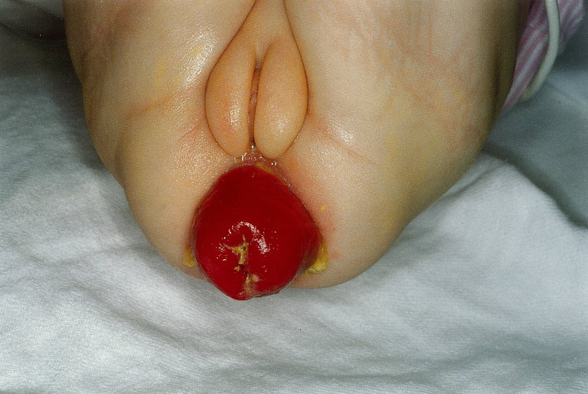
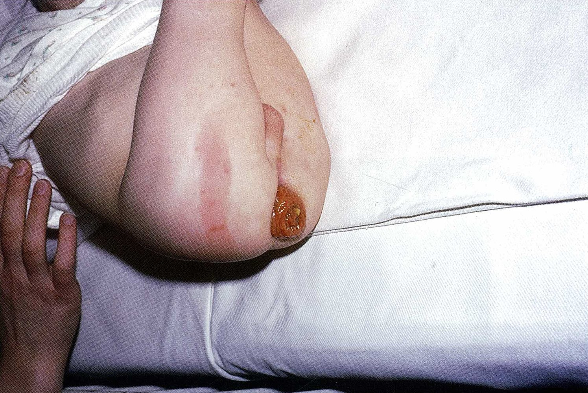
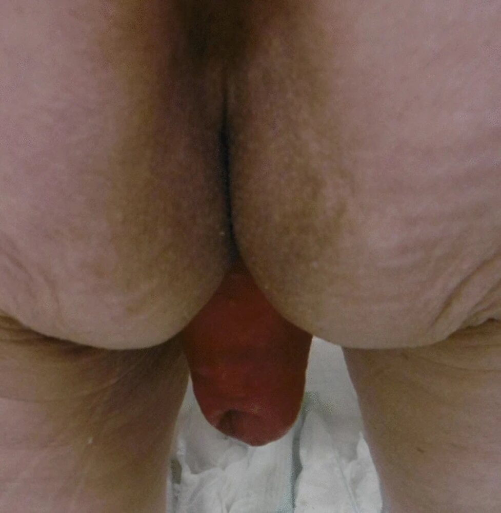

# Rectal prolapse

*Categories: Clinical knowledge > Surgery > Abdominal surgery > Small and large intestine > Rectal prolapse*

[Original Article Link](https://coursology-qbank.com/amboss/article/W30Phf)

---

## Summary

Rectal prolapse is the protrusion of rectal <u>mucosa</u> (<u>mucosal prolapse</u>) or the entire <u>rectum</u> (full-thickness prolapse) through the anal opening. While <u>mucosal prolapse</u> is more common in children, full-thickness prolapse occurs more commonly in adults. Increased intra-abdominal pressure (e.g., excessive straining as a result of <u>constipation</u>) and <u>weakness</u> of the <u>pelvic floor</u> muscles (e.g., as a result of old age, <u>multiple pregnancies</u>) are <u>risk factors</u> for rectal prolapse. <u>Cystic fibrosis</u>, moreover, is an important <u>risk factor</u> in children. The most commonly presenting complaint is a painless rectal mass that appears on straining. Other symptoms include <u>fecal incontinence</u> and/or <u>constipation</u> and <u>pruritus ani</u>. Inspection of the prolapsed structure helps to determine the type: In partial prolapse, radial folds are typically present in the <u>mucosa</u>, while a complete prolapse exhibits concentric <u>mucosal</u> folds. If <u>clinical examination</u> does not reveal any significant findings, video <u>defecography</u> may be used to confirm the diagnosis. <u>Mucosal prolapse</u> can be <u>treated conservatively</u> with digital reduction or injection <u>sclerotherapy</u>. Full-thickness prolapse, on the other hand, usually requires <u>surgery</u>. <u>Surgery</u> for full-thickness prolapse may be conducted either using an abdominal or a perineal approach, usually determined on a case-by-case basis.

---

## Epidemiology

* Age of onset: bimodal <u>incidence</u>

* Adults

* <u>♂</u>: < 40 years

* <u>♀</u>: 60–70 years

* Children: < 3 years

* Sex

* Adults: <u>♀</u> > <u>♂</u> (6:1)

* Children: <u>♀</u> = <u>♂</u>

References:[[1]](https://coursology-qbank.com/amboss/article/K60UNS)[[2]](https://coursology-qbank.com/amboss/article/uz0pui)

Epidemiological data refers to the US, unless otherwise specified.

---

## Etiology

* <u>Risk factors</u> in adults

* Any cause of raised <u>intraabdominal pressure</u>

* Chronic straining as a result of <u>constipation</u> and/or <u>benign prostatic hypertrophy</u> (<u>BPH</u>)

* <u>Chronic cough</u> (e.g. <u>COPD</u>)

* <u>Pregnancy</u>

* <u>Weakness</u> of the <u>pelvic floor</u> muscles

* Advanced age

* <u>Multiparous</u> women

* Damage to the <u>pudendal nerve</u> or sacral roots (e.g., obstetric injury during vaginal delivery, <u>diabetic neuropathy</u>, <u>pelvic</u> tumors)

* Previous perineal <u>surgery</u> (e.g., for the management of <u>anal fistulas</u>)

* <u>Connective tissue disorders</u> (e.g., <u>Ehler Danlos syndrome</u>)

* <u>Risk factors</u> in children 

* Chronic straining as a result of <u>constipation</u>

* Recurrent <u>diarrhea</u>

* <u>Cystic fibrosis</u>

* Rectal <u>parasites</u> (e.g., <u>whipworm</u>)

* High <u>anorectal malformations</u>

* <u>Hirschsprung disease</u>

* Damage to the sacral roots (e.g., <u>meningomyelocele</u>)

* <u>Significant weight loss</u>

References:[[1]](https://coursology-qbank.com/amboss/article/K60UNS)[[2]](https://coursology-qbank.com/amboss/article/uz0pui)[[3]](https://coursology-qbank.com/amboss/article/8z0Oui)[[4]](https://coursology-qbank.com/amboss/article/Cz0qEi)

---

## Clinical features

### Symptoms

* A painless rectal mass that protrudes through the <u>anus</u>

* <u>Fecal incontinence</u>

* <u>Constipation</u>

* <u>Pruritus ani</u>

* <u>Rectal bleeding</u>

### <u>Physical examination</u>

The <u>perineum</u> should ideally be examined while the patient squats or strains.

* The <u>rectum</u> protrudes partially or completely through the external anal opening.

* Mucous prolapse

* Radial <u>mucosal</u> folds are seen on inspection

* Only a double layered <u>mucous membrane</u> can be palpated.

* Full-thickness prolapse

* Concentric <u>mucosal</u> folds are seen on inspection (stacked-coin appearance)

* All four layers of the rectal wall can be palpated.

* A sulcus or groove may be present between the emerging mass and the walls of the <u>anal canal</u>.

* A solitary <u>rectal ulcer</u> on the prolapsed <u>rectum</u> is seen in 10–25% of cases.

* <u>Digital rectal examination</u> may reveal anal sphincter <u>weakness</u> and a mass or other <u>pelvic floor</u> pathology.

* Other conditions associated with <u>pelvic floor weakness</u> (e.g., <u>uterine prolapse</u>, <u>vaginal vault prolapse</u>, <u>cystocele</u>, <u>rectocele</u>) may be present along with rectal prolapse.

Rectal prolapse in a 4-month-old girl

Rectal prolapse in cystic fibrosis

Full-thickness rectal prolapse

References:[[1]](https://coursology-qbank.com/amboss/article/K60UNS)[[2]](https://coursology-qbank.com/amboss/article/uz0pui)[[5]](https://coursology-qbank.com/amboss/article/Dz01Ei)

---

## Diagnosis

* Definitive diagnosis

* Rectal prolapse is primarily a <u>clinical diagnosis</u>.

* Video defecography:  to distinguish full-thickness rectal prolapse from <u>mucosal prolapse</u> when the diagnosis is not obvious from <u>clinical examination</u> alone

* Additional tests 

* Proctoscopy and/or <u>colonoscopy</u> should be performed prior to any surgical therapy.

* If a <u>rectal ulcer</u> is present: <u>biopsy</u> of the <u>rectal ulcer</u>

* If <u>fecal incontinence</u> is present: anal sphincter manometry

* If <u>pelvic floor weakness</u> is suspected: dynamic <u>pelvic floor</u> <u>MRI</u>

* A <u>sweat chloride test</u> should be performed among children with rectal prolapse to rule out <u>cystic fibrosis</u>.

References:[[2]](https://coursology-qbank.com/amboss/article/uz0pui)[[3]](https://coursology-qbank.com/amboss/article/8z0Oui)[[6]](https://coursology-qbank.com/amboss/article/Fz0gui)

---

## Treatment

### <u>Mucosal prolapse</u>

* <u>Mucosal prolapse</u> is generally managed nonsurgically.

* First-line: reduction of <u>mucosal</u> <u>edema</u>, digital repositioning of the <u>rectum</u>, and pressure padding the <u>perineum</u>

* Second-line: injection <u>sclerotherapy</u>

* Grade III and grade IV <u>internal hemorrhoids</u> that are often associated with a <u>mucosal prolapse</u> should be treated with <u>hemorrhoidectomy</u> (see “Treatment” in <u>hemorrhoids</u>)

### Full-thickness rectal prolapse

Full-thickness prolapse requires surgical treatment with either an abdominal or perineal approach.

* Abdominal procedures: <u>laparoscopic</u> <u>rectopexy</u> with/without sigmoidectomy

* Perineal procedures 

* Short, full-thickness prolapse: Delorme procedure

* Long, full-thickness prolapse that cannot be treated by abdominal procedures: Altemeier procedure (perineal rectosigmoidectomy)

> [!WARNING]
> While <u>surgery</u> is performed electively in most cases, incarcerated rectal prolapse should be treated as a surgical emergency!

> [!NOTE]
> In addition to definitive management of rectal prolapse, any underlying <u>risk factors</u> (e.g., <u>constipation</u>) must be addressed in order to prevent recurrence.
> References:[[1]](https://coursology-qbank.com/amboss/article/K60UNS)[[5]](https://coursology-qbank.com/amboss/article/Dz01Ei)[[7]](https://coursology-qbank.com/amboss/article/sdYtrL)

---