# Gastric cancer

*Categories: Clinical knowledge > Surgery > Abdominal surgery > Stomach > Gastric cancer*

[Original Article Link](https://coursology-qbank.com/amboss/article/-g0DB2)

---

## Summary

Gastric cancer is the fifth most common cancer worldwide. Although the <u>incidence</u> is declining in the United States, it remains high in some Asian countries, most notably Japan, South Korea, and Mongolia. The main <u>risk factor</u> for developing gastric cancer is infection with <u>Helicobacter pylori</u>. Other <u>risk factors</u> include <u>GERD</u>, a diet high in salts and <u>nitrates</u>, and tobacco use. <u>Adenocarcinoma</u> accounts for 95% of gastric cancer and is further classified as intestinal or diffuse type. Less frequent gastric cancers include <u>gastric lymphomas</u>, <u>gastrointestinal stromal tumors</u>, and <u>neuroendocrine tumors</u>. Early on, patients are commonly asymptomatic or have nonspecific symptoms (e.g., <u>dyspepsia</u>, epigastric <u>pain</u>). Later on patients may develop signs of <u>metastatic</u> disease or complications (e.g., <u>gastric outlet obstruction</u>, <u>GI bleeding</u>, <u>ascites</u>). Diagnosis is confirmed with <u>upper endoscopy</u> and <u>biopsy</u>. Staging via imaging or <u>diagnostic laparoscopy</u> helps inform the treatment. Early nonmetastatic disease is typically treated with <u>surgery</u> and perioperative <u>chemotherapy</u>. Unresectable or <u>metastatic</u> disease is treated with systemic <u>chemotherapy</u> or <u>chemoradiation</u>. <u>Targeted therapy</u> can be added based on <u>tumor</u> molecular characteristics. <u>Palliative care</u> is the mainstay of therapy for patients with <u>frailty</u> and an <u>advanced cancer</u> stage. The prognosis varies according to <u>tumor stage</u>, but the overall <u>5-year survival rate</u> is low as the diagnosis is often made late once symptoms progress.

---

## Epidemiology

* <u>Incidence</u>

* An estimated 27,600 new cases were diagnosed in the US in 2020.  [[1]](https://coursology-qbank.com/amboss/article/2wYTRr)[[2]](https://coursology-qbank.com/amboss/article/NwY-Qr)

* Highest <u>incidence</u> in South Korea, Mongolia, and Japan [[3]](https://coursology-qbank.com/amboss/article/BxYzAr)

* Sex: <u>♂</u> > <u>♀</u> [[2]](https://coursology-qbank.com/amboss/article/NwY-Qr)

Epidemiological data refers to the US, unless otherwise specified.

---

## Etiology

### <u>Exogenous</u> <u>risk factors</u> [[2]](https://coursology-qbank.com/amboss/article/NwY-Qr)

* Diet rich in <u>nitrates</u> and/or salts (e.g., dried foods, foods preserved by curing or smoking);   and low in fresh vegetables containing antioxidants [[4]](https://coursology-qbank.com/amboss/article/j50_Pg)

* <u>H. pylori</u> infection  [[5]](https://coursology-qbank.com/amboss/article/RqYlyJ)

* <u>Nicotine</u> use

* <u>Epstein-Barr virus</u>

* Low <u>socioeconomic status</u> [[6]](https://coursology-qbank.com/amboss/article/fvbkzv)

* <u>Obesity</u>  [[7]](https://coursology-qbank.com/amboss/article/ewbx3D)

### <u>Endogenous</u> <u>risk factors</u> [[2]](https://coursology-qbank.com/amboss/article/NwY-Qr)

* Gastric conditions

* Chronic <u>atrophic gastritis</u> and associated <u>pernicious anemia</u> [[8]](https://coursology-qbank.com/amboss/article/hvbc-v)

* <u>Achlorhydria</u> (e.g., due to <u>Ménétrier disease</u>)

* <u>Gastric ulcers</u> [[9]](https://coursology-qbank.com/amboss/article/3vbS-v)

* <u>Partial gastrectomy</u>

* Adenomatous gastric polyps

* <u>Gastroesophageal reflux disease</u>

* Hereditary factors

* Positive <u>family history</u>

* <u>Blood type A</u>

* <u>Hereditary nonpolyposis colorectal cancer</u>

---

## Clinical features

### Early stages of gastric cancer

* Often asymptomatic

* Loss of appetite, <u>nausea</u>

### Late stages of gastric cancer

* General signs

* Weight loss (may be aggravated by reduced calorie intake due to abdominal <u>pain</u> after meals)

* Signs of chronic <u>iron deficiency anemia</u>

* Palpable <u>tumor</u> in epigastric region

* Signs of <u>gastric outlet obstruction</u>

* Abdominal <u>pain</u>

* Early satiety

* <u>Vomiting</u>

* Signs of <u>upper gastrointestinal bleeding</u>

* <u>Hematemesis</u>

* <u>Melena</u>

* Signs of <u>metastatic</u> disease

* <u>Hepatomegaly</u>

* <u>Ascites</u>

* <u>Left supraclavicular adenopathy</u> (<u>Virchow node</u>)

* Palpable umbilical <u>nodule</u> (<u>Sister Mary Joseph</u> node)

* Palpable mass on <u>digital rectal examination</u> (<u>Blumer shelf</u>)

* Ovarian mass (<u>Krukenberg tumor</u>)

* See “Complications” below.

* <u>Paraneoplastic syndromes</u>

* <u>Leser-Trélat sign</u>

* <u>Malignant acanthosis nigricans</u>

Virchow node

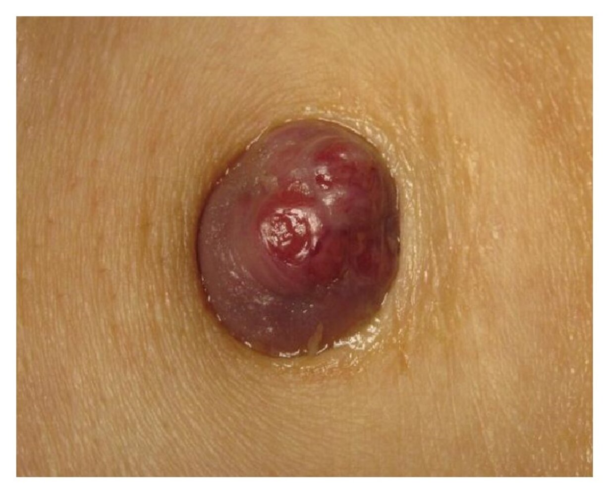

Sister Mary Joseph nodule

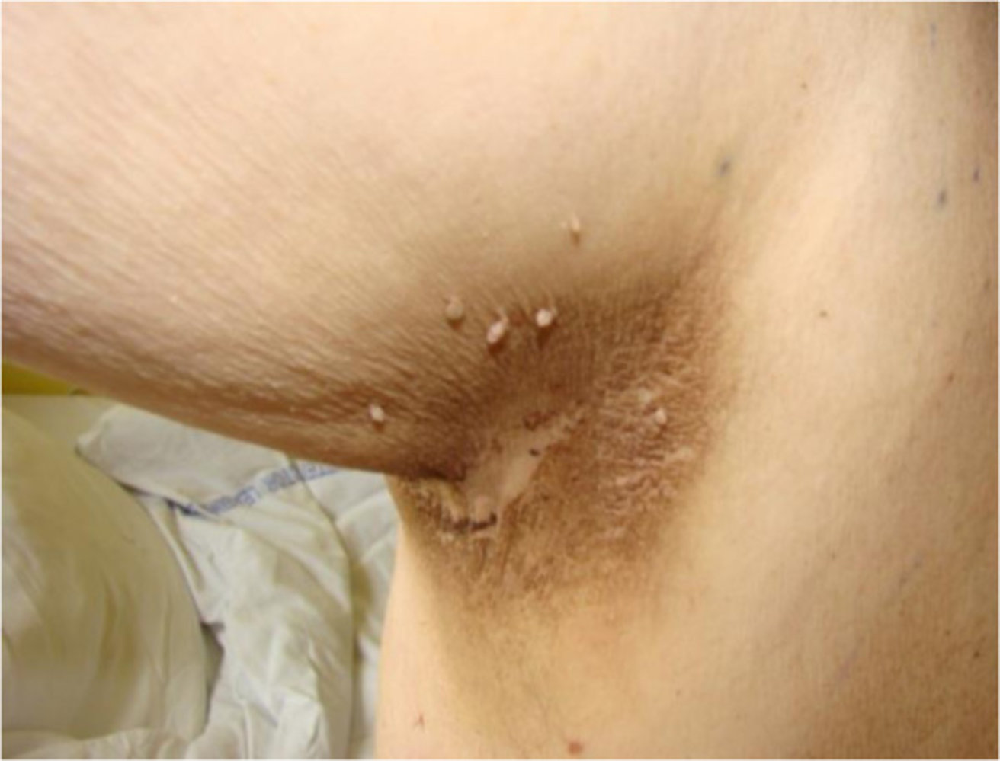

Acanthosis nigricans

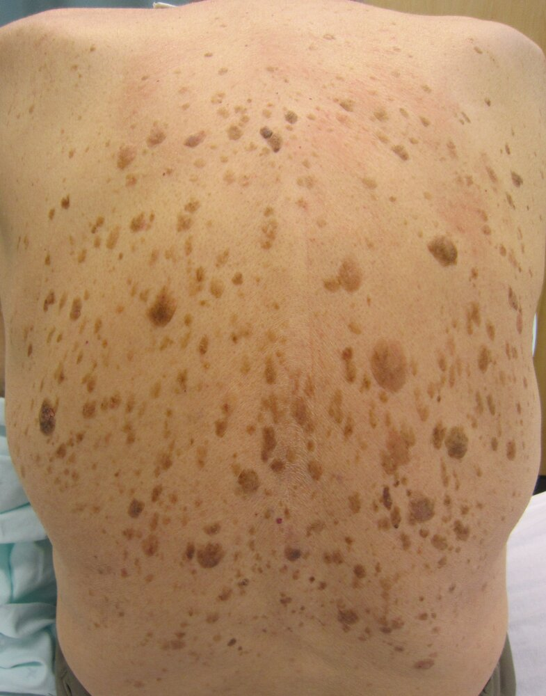

Leser–Trélat sign

---

## Diagnosis

Gastric cancer is frequently diagnosed during the endoscopic evaluation of nonspecific symptoms or findings (e.g., <u>heartburn</u>, <u>dyspepsia</u>, <u>anemia</u>, weight loss). Patients typically need repeat endoscopic tissue sampling for <u>histopathologic studies</u> and imaging studies for <u>cancer staging</u>.

### Diagnostic approach [[10]](https://coursology-qbank.com/amboss/article/CwYqOr)[[11]](https://coursology-qbank.com/amboss/article/ZucZpV0)[[12]](https://coursology-qbank.com/amboss/article/hGcc_d0)

* Diagnostic confirmation: <u>EGD</u> with <u>biopsy</u> (test of choice)

* Staging: Evaluate for <u>lymph node</u> involvement and <u>metastatic</u> disease.

* All patients: Obtain CT abdomen, <u>pelvis</u>, and thorax. [[11]](https://coursology-qbank.com/amboss/article/ZucZpV0)

* Potentially resectable disease (M0): Consider <u>endoscopic ultrasound</u> (<u>EUS</u>) and <u>diagnostic laparoscopy</u>.  [[10]](https://coursology-qbank.com/amboss/article/CwYqOr)[[13]](https://coursology-qbank.com/amboss/article/3GcS_d0)

* Additional modalities include <u>upper GI series</u>  and <u>PET-CT</u>.

* Additional diagnostics (case by case)

* <u>Laboratory studies</u>; : e.g., to identify <u>anemia</u>

* Tissue analysis for biomarkers: e.g., <u>ERBB2</u>, <u>TNF-α</u>

> [!TIP]
> Over half of patients with gastric cancer in the US present with advanced disease (stage III or higher) at the time of diagnosis. [[14]](https://coursology-qbank.com/amboss/article/VucGJV0)

### <u>EGD</u> with <u>biopsy</u> [[15]](https://coursology-qbank.com/amboss/article/UW1bkf0)[[16]](https://coursology-qbank.com/amboss/article/PvbWZD)

* Indications include:

* Clinical features suspicious for gastric cancer

* Incidental finding of gastric cancer on previous <u>EGD</u>

* Procedure

* Visual identification and <u>biopsy</u> of suspicious lesions

* Frequently combined with <u>EUS</u>

* Findings 

* Location, size, and depth of the <u>tumor</u>

* Macroscopic appearance: <u>exophytic</u> mass, <u>ulcer</u>, or diffuse infiltration (<u>linitis plastica</u>)  [[17]](https://coursology-qbank.com/amboss/article/Bc1zef0)

* <u>Histopathology</u> findings include the presence of biomarkers (see “Additional diagnostics”)

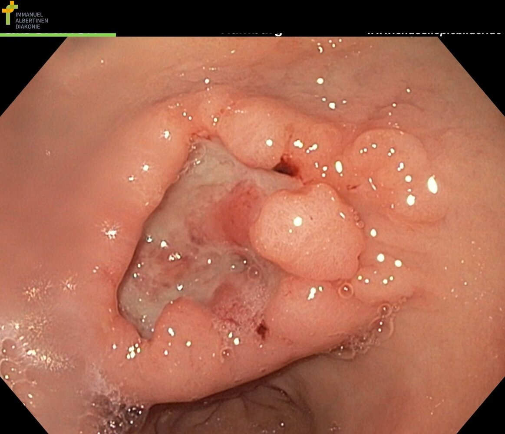

Gastric cancer

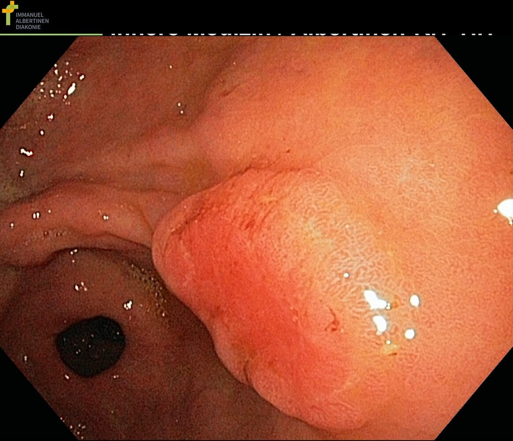

Gastric cancer

### Staging investigations [[10]](https://coursology-qbank.com/amboss/article/CwYqOr)[[11]](https://coursology-qbank.com/amboss/article/ZucZpV0)[[13]](https://coursology-qbank.com/amboss/article/3GcS_d0)

#### Imaging

* Routine modalities

* CT abdomen, <u>pelvis</u>, and thorax with oral and IV contrast: evaluation for distant <u>metastasis</u> and locoregional staging for all patients

* <u>EUS</u> with or without <u>fine-needle aspiration biopsy</u> (<u>FNAB</u>): locoregional staging for potentially resectable cancers

* Additional modalities

* <u>PET-CT</u>: may be considered for the detection of <u>metastatic</u> disease

* <u>Upper GI series</u> (<u>UGI</u>): may identify <u>linitis plastica</u>  [[15]](https://coursology-qbank.com/amboss/article/UW1bkf0)[[18]](https://coursology-qbank.com/amboss/article/_c15Uf0)

* Abdominal <u>ultrasound</u>: may be used to scan for <u>liver metastasis</u> and <u>ascites</u>  [[19]](https://coursology-qbank.com/amboss/article/0ucepV0)

* <u>MRI</u> abdomen and <u>pelvis</u>: if CT and <u>EUS</u> are inconclusive or patients have <u>contraindications for iodinated IV contrast</u>

* Findings

* Local <u>tumor</u> extension and <u>lymph node</u> involvement

* <u>Metastatic</u> disease, e.g., of the <u>liver</u>  or <u>peritoneum</u>

* Signs of unresectable disease, e.g., encasement of major <u>blood vessels</u>

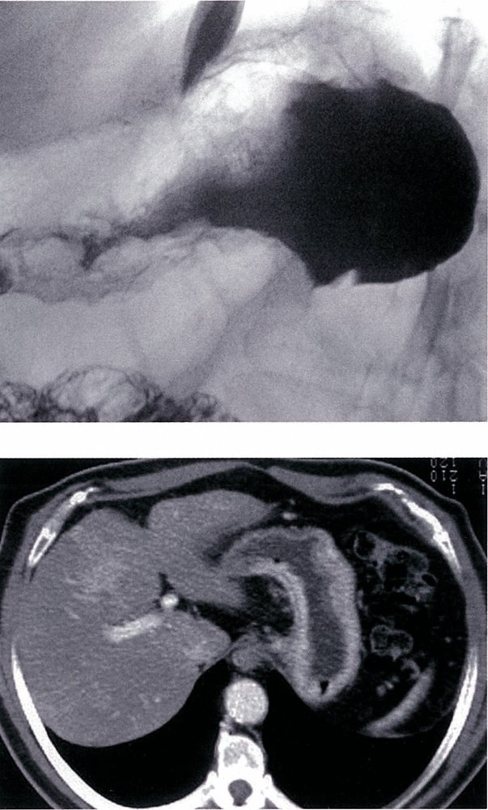

Gastric cancer

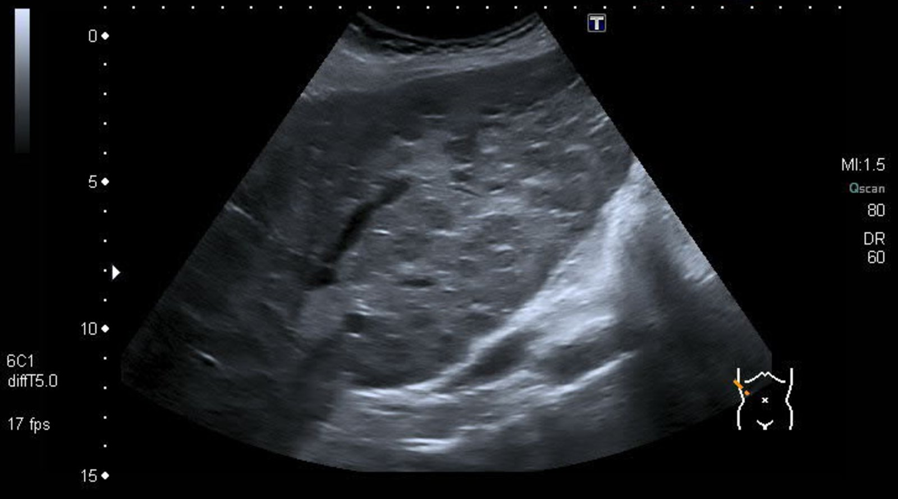

Multiple liver metastases

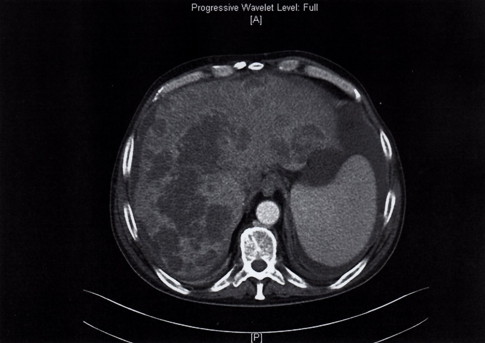

Liver metastases

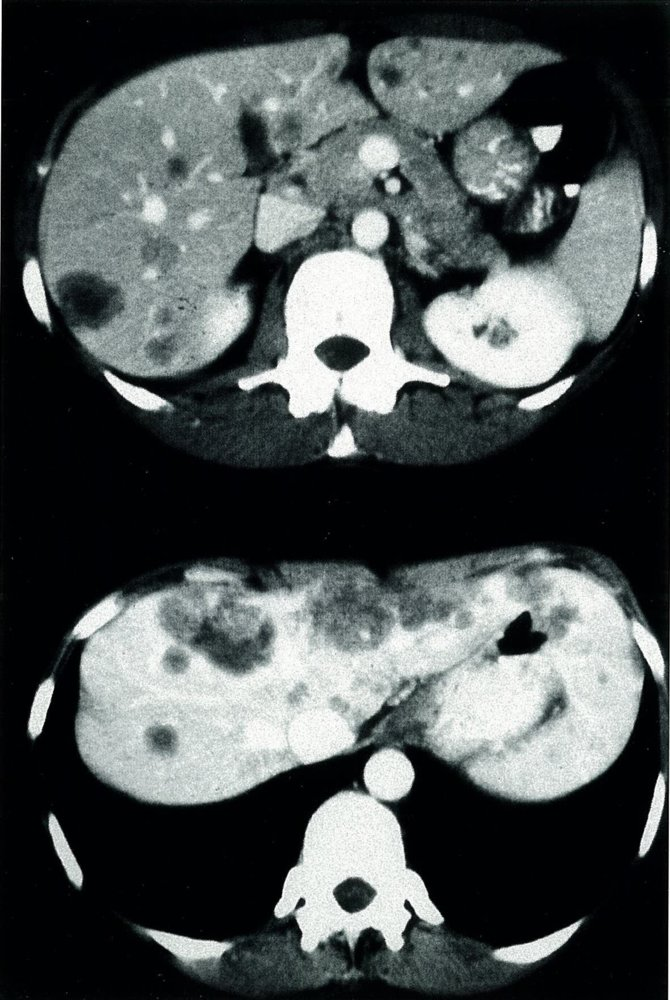

Liver metastases

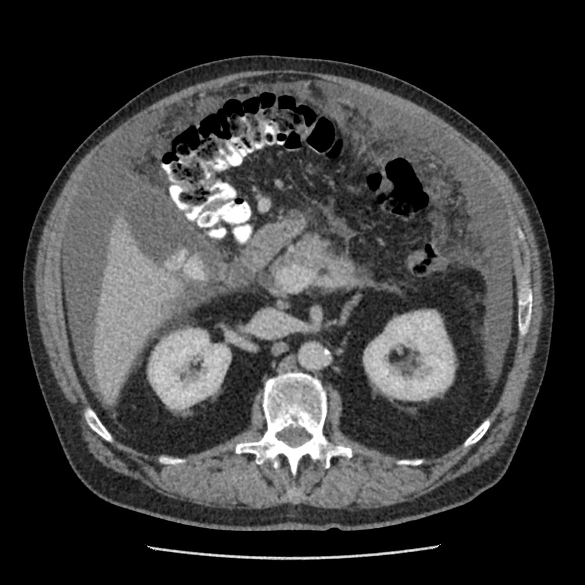

Peritoneal carcinomatosis in a patient with pancreatic cancer

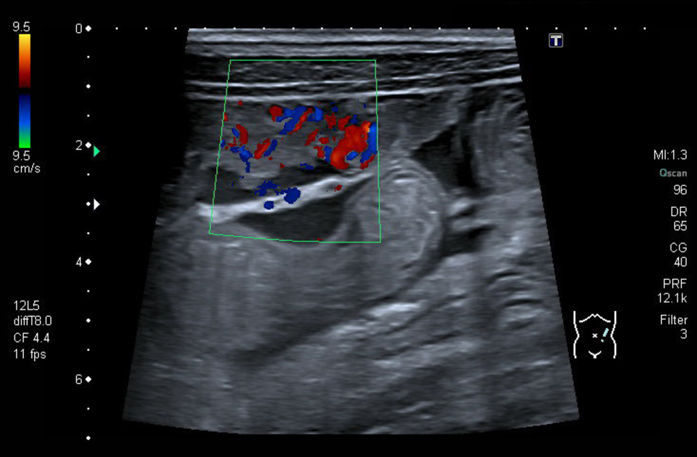

Peritoneal carcinomatosis

#### <u>Diagnostic laparoscopy</u> [[10]](https://coursology-qbank.com/amboss/article/CwYqOr)[[13]](https://coursology-qbank.com/amboss/article/3GcS_d0)[[20]](https://coursology-qbank.com/amboss/article/dd1oKf0)

* Procedure: direct visualization and <u>biopsy</u> of <u>peritoneal</u> lesions, collection and <u>cytology</u> of <u>peritoneal</u> fluid

* Indication: Consider in patients with potentially resectable <u>carcinoma</u>.

* Findings: <u>peritoneal carcinomatosis</u> (frequently not visible on imaging)  [[13]](https://coursology-qbank.com/amboss/article/3GcS_d0)

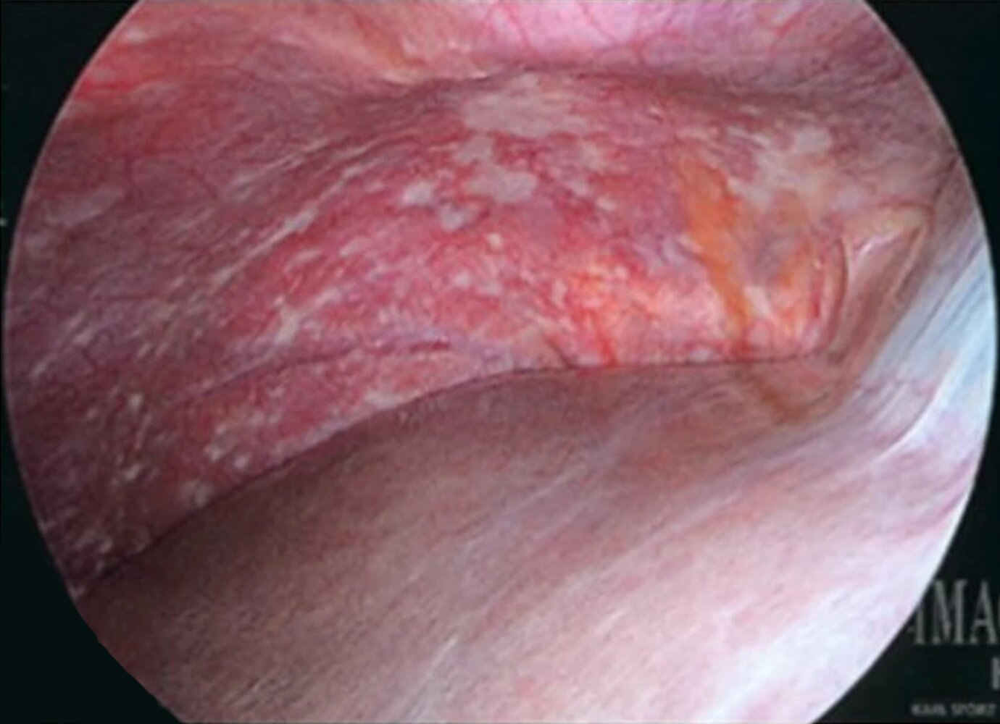

Peritoneal carcinomatosis

> [!TIP]
> The <u>peritoneum</u> is the most common site of <u>metastasis</u> in gastric cancer. Curative <u>gastrectomy</u> is typically not attempted if <u>diagnostic laparoscopy</u> or <u>peritoneal</u> <u>cytology</u> indicate <u>peritoneal metastasis</u>. [[13]](https://coursology-qbank.com/amboss/article/3GcS_d0)[[21]](https://coursology-qbank.com/amboss/article/fW1kkf0)

### Additional diagnostics [[10]](https://coursology-qbank.com/amboss/article/CwYqOr)[[12]](https://coursology-qbank.com/amboss/article/hGcc_d0)[[13]](https://coursology-qbank.com/amboss/article/3GcS_d0)

* <u>Laboratory studies</u>

* <u>CBC</u>: may show <u>anemia</u>  [[22]](https://coursology-qbank.com/amboss/article/TW16kf0)[[23]](https://coursology-qbank.com/amboss/article/gW1Fkf0)

* <u>CMP</u>: baseline renal and <u>hepatic function</u>

* <u>H. pylori diagnostics</u>: indicated after endoscopic resection  [[12]](https://coursology-qbank.com/amboss/article/hGcc_d0)[[24]](https://coursology-qbank.com/amboss/article/5K0iSS)[[25]](https://coursology-qbank.com/amboss/article/Vd1GKf0)

* Biomarkers

* Serologic biomarkers: not routinely used in the US  [[12]](https://coursology-qbank.com/amboss/article/hGcc_d0)[[26]](https://coursology-qbank.com/amboss/article/A8cR6V0)

* <u>CEA</u>, <u>CA-19-9</u>, CA 72-4

* <u>TNF-α</u>  [[27]](https://coursology-qbank.com/amboss/article/ZDbZ1D)[[28]](https://coursology-qbank.com/amboss/article/RW1lOf0)

* Tissue analysis

* <u>ERBB2</u>: used to select patients with unresectable disease for <u>targeted therapy</u>  [[29]](https://coursology-qbank.com/amboss/article/gGcFAd0)

* Additional biomarkers: <u>microsatellite instability</u> (MSI)  , <u>programmed death-ligand 1</u> (<u>PD-L1</u>)  [[13]](https://coursology-qbank.com/amboss/article/3GcS_d0)[[30]](https://coursology-qbank.com/amboss/article/z8cr6V0)[[31]](https://coursology-qbank.com/amboss/article/Md1Mqf0)

* <u>Fecal occult blood testing</u>: may be positive [[32]](https://coursology-qbank.com/amboss/article/kIYm1q)

---

## Pathology

### Gastric adenocarcinoma

#### General features

* Accounts for ∼ 95% of cases [[34]](https://coursology-qbank.com/amboss/article/4wb3QD)

* Most commonly located on the <u>lesser curvature</u>

* Arises from glandular cells in the <u>stomach</u>

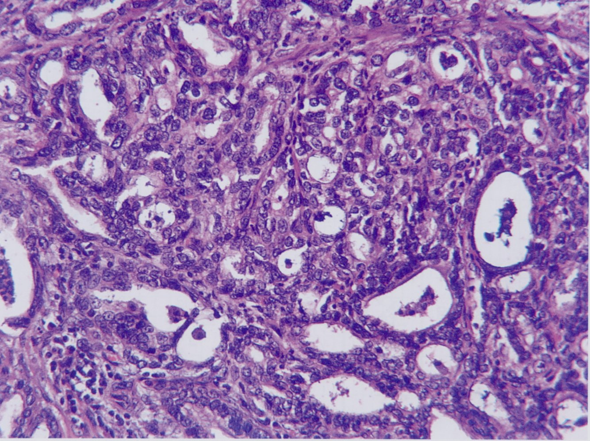

Gastric adenocarcinoma

#### Lauren classification of <u>gastric adenocarcinoma</u>

* Intestinal type gastric carcinoma 

* Typically localized

* Polypoid, glandular formation

* Similar to an ulcerative lesion with clear raised margins

* Commonly located on the <u>lesser curvature</u>

* Diffuse type gastric carcinoma 

* No clear border

* Spreads earlier in the course of disease

* Infiltrative growth

* Diffuse spread in the gastric wall

* Linitis plastica: gastric wall thickening and <u>leather bottle appearance</u>

* Composed of signet ring cells: round cells filled with <u>mucin</u>, with a flat <u>nucleus</u> in <u>the cell</u> periphery

* Associated with <u>E-cadherin</u> mutation  [[35]](https://coursology-qbank.com/amboss/article/2wbTRD)

* Intermediate type (the least common type): should be treated as the diffuse type, as the extent of <u>tumor</u> infiltration is difficult to assess

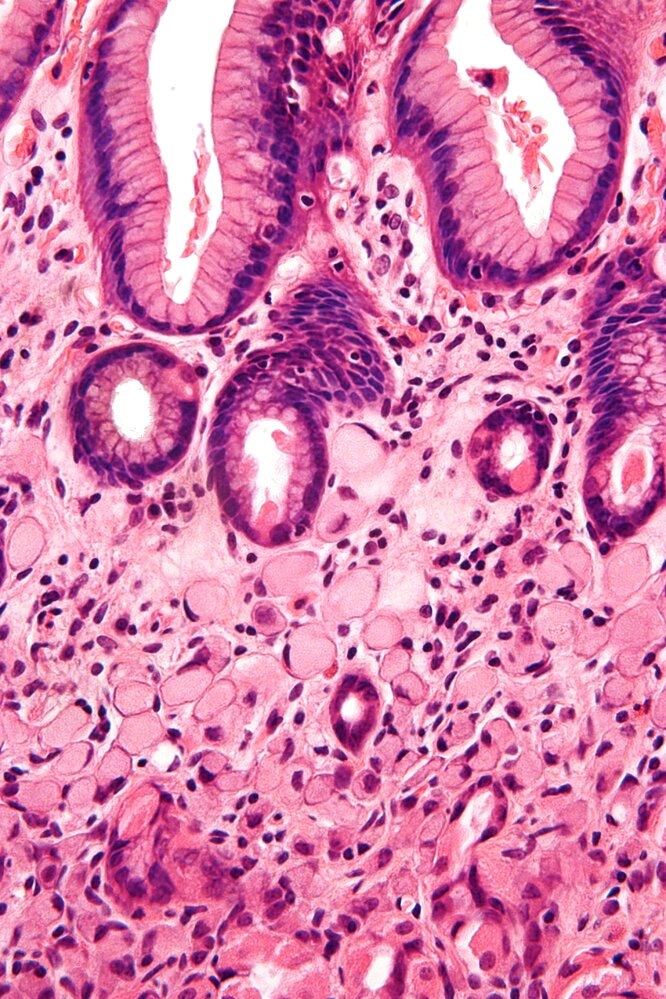

Gastric signet-ring-cell carcinoma

### Gastric squamous cell carcinoma [[36]](https://coursology-qbank.com/amboss/article/BhVzT80)

* Accounts for < 1% of gastric malignancies [[36]](https://coursology-qbank.com/amboss/article/BhVzT80)

* <u>♂</u> > <u>♀</u>

* Most commonly located in the <u>gastric cardia</u>

* <u>Histopathology</u>: squamous differentiation (e.g., <u>keratin pearls</u>, intercellular bridges) without glandular components [[37]](https://coursology-qbank.com/amboss/article/xhVET80)

* Worse survival outcomes compared to <u>gastric adenocarcinoma</u>

---

## Differential diagnoses

See also “<u>Approach to dyspepsia</u>” and “<u>Acute abdominal pain</u>.”

### Gastric conditions

* <u>Gastric ulcer</u>

* <u>Gastroesophageal reflux disease</u> (<u>GERD</u>)

* <u>Ménétrier disease</u>

* <u>Functional dyspepsia</u>

### Other types of cancer

* Gastric lymphoma (e.g., <u>MALT lymphoma</u>)

* <u>Sarcoma</u>

* <u>Neuroendocrine tumor</u>

* <u>Gastrointestinal stromal tumor</u> (<u>GIST</u>)

The differential diagnoses listed here are not exhaustive.

---

## Treatment

### Approach [[10]](https://coursology-qbank.com/amboss/article/CwYqOr)[[13]](https://coursology-qbank.com/amboss/article/3GcS_d0)

Provide <u>multidisciplinary care</u> where available (e.g., <u>tumor board</u>) and base treatment plan on patient fitness, disease characteristics, and <u>goals of care</u> (see “<u>Principles of cancer care</u>” for more information).

* Localized, resectable disease

* Stages 0 and IA (≤ T1 and ≤ N0): surgical or endoscopic resection

* Stage IB or higher (≥ T2 and/or N > 0): surgical resection plus perioperative <u>chemotherapy</u> or adjuvant <u>chemoradiotherapy</u>

* Specific molecular markers present: Consider adding <u>targeted therapy</u> and/or immunotherapy.

* <u>Metastatic</u> or unresectable cancer: Provide <u>palliative care</u>.

> [!TIP]
> The mainstay of treatment for nonmetastatic gastric cancer is surgical resection with perioperative <u>chemotherapy</u>.

### Resection [[13]](https://coursology-qbank.com/amboss/article/3GcS_d0)[[14]](https://coursology-qbank.com/amboss/article/VucGJV0)

Margin-free resection (<u>R0</u> resection) is the only potentially curative therapy. However, it is only possible in 30% of patients and is associated with a high recurrence rate. [[32]](https://coursology-qbank.com/amboss/article/kIYm1q)[[38]](https://coursology-qbank.com/amboss/article/hEccvV0)

#### Surgical

The following procedures are typically combined with radical <u>lymphadenectomy</u>  and reconstructive procedures (e.g., <u>Roux-en-Y anastomosis</u>). [[10]](https://coursology-qbank.com/amboss/article/CwYqOr)

* Total <u>gastrectomy</u>

* Indication: resectable cancer in the <u>proximal</u> or middle third of the <u>stomach</u>

* Technique: complete resection of the <u>stomach</u>

* <u>Subtotal gastrectomy</u>

* Indication: can be considered for resectable cancer in the <u>distal</u> <u>stomach</u>

* Technique: resection of the body and <u>pylorus</u> of the <u>stomach</u>

* <u>Esophagectomy</u> (with <u>mediastinal</u> <u>lymphadenectomy</u>): may be required for <u>adenocarcinoma of the esophagogastric junction</u> (see “<u>Esophageal cancer</u>”) [[39]](https://coursology-qbank.com/amboss/article/Ld1wqf0)

#### Endoscopic

* Options

* <u>Endoscopic mucosal resection</u>

* <u>Endoscopic submucosal dissection</u>

* Indication: well-differentiated, nonulcerated <u>tumor</u> ≤ 2 cm limited to the <u>mucosa</u>  [[10]](https://coursology-qbank.com/amboss/article/CwYqOr)[[13]](https://coursology-qbank.com/amboss/article/3GcS_d0)

* Technique: <u>tumor</u> resection or dissection completely through an endoscope

* Additional consideration: <u>H. pylori</u> testing, and if positive, <u>H. pylori eradication therapy</u> [[24]](https://coursology-qbank.com/amboss/article/5K0iSS)

### Reconstructive procedures [[40]](https://coursology-qbank.com/amboss/article/sW1t5f0)[[41]](https://coursology-qbank.com/amboss/article/IucYsV0)[[42]](https://coursology-qbank.com/amboss/article/g11FTf0)

* Roux-en-Y anastomosis 

* Applications: reestablishing continuity of the <u>GI tract</u> following <u>gastrectomy</u> (total or subtotal); <u>bariatric surgery</u>

* Technique 

* The <u>jejunum</u> is divided transversely <u>distal</u> to the <u>duodenum</u>.

* Esophagojejunostomy or <u>gastrojejunostomy</u>: end-to-end <u>anastomosis</u> between the <u>distal</u> <u>esophagus</u> or remaining part of the <u>stomach</u> and the <u>distal</u> limb of the transected <u>jejunum</u>

* Jejunojejunostomy: end-to-side <u>anastomosis</u> between the <u>proximal</u> limb of the transected <u>jejunum</u> and the transversely <u>incised</u> <u>distal</u> <u>jejunum</u>

* <u>Billroth I</u> or <u>Billroth II</u> procedures: alternative reconstruction techniques for <u>subtotal gastrectomy</u>

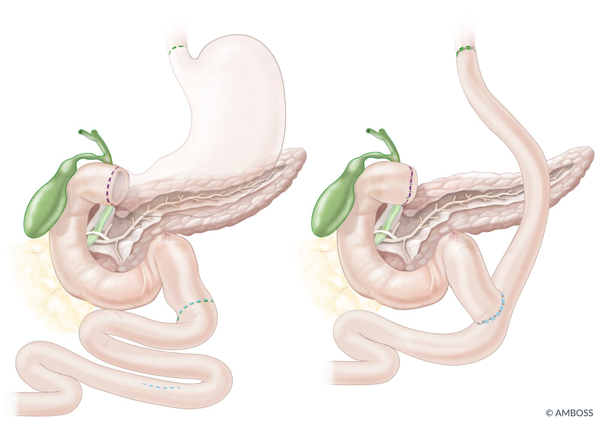

Total gastrectomy (with Roux-en-Y anastomosis)

Subtotal gastrectomy (with Roux-en-Y anastomosis)

Partial gastrectomy (Billroth I procedure)

Partial gastrectomy (Billroth II)

### <u>Chemotherapy</u> and <u>radiotherapy</u> [[10]](https://coursology-qbank.com/amboss/article/CwYqOr)[[13]](https://coursology-qbank.com/amboss/article/3GcS_d0)

* Indications for <u>chemotherapy</u>

* Perioperative treatment (<u>neoadjuvant</u> and <u>adjuvant therapy</u>) of resectable disease

* Primary treatment of <u>metastatic</u> or unresectable disease

* Typical <u>chemotherapy</u> regimens

* Fit patients: double- or triple-agent therapy consisting of a <u>platinum-based agent</u> PLUS <u>fluoropyrimidine</u>, ± <u>taxane</u>

* Frail patients: single-agent therapy with a <u>fluoropyrimidine</u>, <u>irinotecan</u>, or <u>taxane</u>

* <u>Radiotherapy</u> (not routinely used)

* <u>Chemoradiation</u> can be used as <u>adjuvant therapy</u> or as primary treatment for unresectable disease.  [[32]](https://coursology-qbank.com/amboss/article/kIYm1q)[[43]](https://coursology-qbank.com/amboss/article/Kd1UIf0)

* Consider <u>radiotherapy</u> for palliative symptom control.  [[44]](https://coursology-qbank.com/amboss/article/qucCHV0)

> [!TIP]
> A combination of preoperative and postoperative <u>chemotherapy</u> significantly improves survival in resectable disease. [[45]](https://coursology-qbank.com/amboss/article/rucfsV0)

### Personalized treatment [[10]](https://coursology-qbank.com/amboss/article/CwYqOr)[[12]](https://coursology-qbank.com/amboss/article/hGcc_d0)[[13]](https://coursology-qbank.com/amboss/article/3GcS_d0)

Gastric cancers are genetically diverse and have multiple possible genetic mutations amenable to therapeutic manipulation. Systemic therapy may be modified based on the presence of specific molecular markers.

* <u>Targeted therapy</u>

* <u>Trastuzumab</u> is added to the <u>chemotherapy</u> regimen for <u>ERBB2</u>-positive <u>metastatic</u> disease. [[29]](https://coursology-qbank.com/amboss/article/gGcFAd0)

* <u>Ramucirumab</u>, a <u>monoclonal antibody</u> against <u>VEGF</u>, is used as part of second-line regimens.

* <u>Cancer immunotherapy</u>: may be added in cases of MSI and/or <u>PD-L1</u> overexpression  [[30]](https://coursology-qbank.com/amboss/article/z8cr6V0)[[31]](https://coursology-qbank.com/amboss/article/Md1Mqf0)

> [!NOTE]
> For the forms of cancer associated with <u>ERBB2</u> (<u>HER2</u>) <u>gene</u> overexpression and the medication used for treatment, think: TRUST HER, GaBriel (TRUSTuzumab; HER2; Gastric cancer; Breast cancer).

### Supportive and <u>palliative care</u> [[46]](https://coursology-qbank.com/amboss/article/uucpGV0)

* <u>Nutritional support</u> [[47]](https://coursology-qbank.com/amboss/article/8ucOGV0)[[48]](https://coursology-qbank.com/amboss/article/311Sgf0)

* <u>Enteral nutrition</u> (preferred): <u>enteral feeding tube</u>, e.g., <u>jejunostomy tube</u>

* <u>Parenteral nutrition</u>: in patients unable to tolerate <u>enteral nutrition</u> or to briefly <u>complement</u> <u>enteral nutrition</u>

* Management and prevention of complications

* <u>Management of GI bleeding</u>

* Endoscopic intervention (first-line)  [[46]](https://coursology-qbank.com/amboss/article/uucpGV0)

* <u>Transcatheter arterial embolization</u> [[49]](https://coursology-qbank.com/amboss/article/Pd1WJf0)

* <u>External beam radiotherapy</u>

* <u>Ascites</u> control [[50]](https://coursology-qbank.com/amboss/article/cEcauV0)

* <u>Diuretics</u> and <u>sodium</u> restriction

* <u>Therapeutic paracentesis</u>

* <u>Peritoneovenous shunt</u>

* See also “<u>Gastric outlet obstruction</u>” and “<u>Postgastrectomy complications</u>.”

---

## Complications

### <u>Metastatic</u> disease

* Local invasion of adjacent structures

* <u>Peritoneal carcinomatosis</u>

* Infiltration of structures such as the <u>esophagus</u>, <u>transverse colon</u>, and <u>pancreas</u>

* Hematogenous spread

* Skeleton

* <u>Liver</u>

* <u>Lung</u>

* <u>Brain</u>

* <u>Lymphangitic</u> spread

* Virchow node: left supraclavicular <u>lymph node</u> <u>metastasis</u>

* Celiac, paraaortic, and <u>mesenteric</u> <u>lymph nodes</u>

* Sister Mary Joseph node: periumbilical <u>lymph node</u> <u>metastasis</u> (subcutaneous)

* <u>Krukenberg tumor</u>

* <u>Lymph nodes</u> of the lesser and <u>greater curvature</u>

* <u>Mediastinal lymph nodes</u> (in <u>carcinoma</u> of the <u>cardia</u>)

* Direct seeding: Blumer shelf (direct seeding to the <u>pouch of Douglas</u>)

> [!NOTE]
> The Skeleton (bones), Liver, <u>Lung</u>, and <u>Brain</u> are the structures most commonly affected by hematogenous spread of gastric cancer: Zombie SKELETONs don't LIVE LONG (<u>lung</u>) without eating BRAINs.

### <u>Paraneoplastic syndromes</u>

<u>Paraneoplastic syndromes</u> may be signs of <u>visceral</u> malignancies, especially GI <u>carcinomas</u>. These syndromes include:

* <u>Malignant acanthosis nigricans</u>

* <u>Leser-Trélat sign</u>

> [!TIP]
> Always rule out <u>malignancy</u> in patients with <u>acanthosis nigricans</u>.

### <u>Gastric outlet obstruction</u>

See "<u>Gastric outlet obstruction</u>" for more details.

### Postgastrectomy complications

* <u>Malabsorption</u>

* <u>Small intestinal bacterial overgrowth</u>

* <u>Efferent loop syndrome</u>

* <u>Afferent loop syndrome</u>

* <u>Dumping syndrome</u>

* <u>Remnant gastric cancer</u>

#### <u>Malabsorption</u>

* Pathophysiology

* Lack of <u>chyme</u> stimulation → ↓ <u>pancreatic</u> enzyme levels → protein and <u>carbohydrate</u> <u>maldigestion</u> → <u>fat-soluble vitamin deficiency</u> and weight loss

* Loss of <u>parietal cells</u> → ↓/absent <u>intrinsic factor</u> production → <u>vitamin B12 deficiency</u> → <u>pernicious anemia</u>

* Critical reduction of the absorptive surface → ↓ time for <u>chyme</u> absorption → ↓ <u>iron</u> absorption → <u>iron deficiency anemia</u>

* Management

* Diet modifications

* Increased protein intake

* Supplementation of medium-chain <u>triglycerides</u>

* Low <u>carbohydrate</u> diet

* Supplementation of <u>pancreatic enzymes</u> and deficient <u>nutrients</u> (e.g., <u>vitamin B12</u>, <u>iron</u>, <u>fat-soluble vitamins</u>)

#### Efferent loop syndrome

* Definition: kinking or anastomotic narrowing of the efferent loop that causes emesis and/or a feeling of fullness

* Management

* <u>Acute abdomen</u> requires immediate surgical treatment.

* In uncomplicated cases: <u>watch and wait</u>

#### Afferent loop syndrome

* Definition

* Biliary and <u>pancreatic</u> obstruction due to stenosis, kinking, or incorrect <u>anastomosis</u> of the afferent loop

* <u>Chyme</u> enters the afferent loop instead of the efferent loop and causes loss of appetite, a feeling of fullness, and <u>bilious</u> <u>vomiting</u> with subsequent relief of <u>nausea</u>.

* Management: surgical treatment

#### Dumping syndrome

* Definition: rapid gastric emptying as a result of defective gastric reservoir function, impaired <u>pyloric</u> emptying mechanisms, or anomalous postsurgery gastric <u>motor function</u>

##### Early dumping

* Pathophysiology: dysfunctional or bypassed <u>pyloric sphincter</u> → rapid emptying of undiluted hyperosmolar <u>chyme</u> into the <u>small intestine</u> → fluid shift to the intestinal lumen → <u>small bowel</u> distention → <u>vagal</u> stimulation → increased intestinal motility

* Clinical features

* Occur within 15–30 minutes after meal ingestion

* Include <u>nausea</u>, <u>vomiting</u>, <u>diarrhea</u>, and cramps

* <u>Vasomotor symptoms</u> such as sweating, flushing, and <u>palpitations</u>

* Management

* Dietary modifications: small meals that include a combination of complex <u>carbohydrates</u> and foods rich in protein and fat

* 30–60 min of rest in the <u>supine position</u> after meals

* <u>Beta blockers</u> may be helpful to ease <u>tachycardia</u> arising from <u>hypovolemia</u>.

##### Late dumping

* Pathophysiology: dysfunctional <u>pyloric sphincter</u> → rapid emptying of <u>glucose</u>-containing <u>chyme</u> into the <u>small intestine</u> → quick reabsorption of <u>glucose</u> → <u>hyperglycemia</u> → excessive release of <u>insulin</u> → <u>hypoglycemia</u> and release of <u>catecholamines</u>

* Clinical features

* Occur hours after meal ingestion

* Include <u>signs of hypoglycemia</u> (e.g., hunger, <u>tremor</u>, <u>lightheadedness</u>)

* GI discomfort

* Management

* Dietary modifications

* Second-line treatment: <u>octreotide</u>

* Third-line treatment: <u>surgery</u>

> [!TIP]
> Suspect <u>late dumping syndrome</u> in a patient with previous gastric <u>surgery</u> and <u>hypoglycemia</u>.

#### Remnant gastric cancer [[51]](https://coursology-qbank.com/amboss/article/9DYNgr)[[52]](https://coursology-qbank.com/amboss/article/CDYqgr)[[53]](https://coursology-qbank.com/amboss/article/xDYEgr)

* Definition: the development of <u>carcinoma</u> in the remnant <u>stomach</u> after <u>gastrectomy</u>, regardless of the initial gastric condition or its duration

* Pathophysiology: Studies suggest that duodenogastric reflux, chronic irritation due to biliary or <u>pancreatic</u> secretions, and the <u>denervation</u> of gastric <u>mucosa</u> after <u>surgery</u> result in <u>chronic inflammation</u> of the remnant <u>mucosa</u>.

* Management: total <u>gastrectomy</u> with <u>Roux-en-Y</u> <u>anastomosis</u> and radical <u>lymph node dissection</u>

We list the most important complications. The selection is not exhaustive.

---

## Prognosis

* Because there are no early signs, gastric cancer is often diagnosed very late. Around 50% of cancers have already reached an advanced stage that does not allow for curative treatment due to tissue invasion and <u>metastases</u>. [[33]](https://coursology-qbank.com/amboss/article/bZYHZn)

* If diagnosed at a very early stage, the 5-year survival rate is 95%. [[54]](https://coursology-qbank.com/amboss/article/OwbIQD)

* Late-stage disease with distant <u>metastases</u> and/or <u>peritoneal carcinomatosis</u> has a poor prognosis (5-year survival rate of ∼ 5%). [[55]](https://coursology-qbank.com/amboss/article/_xY5_r)

---