# Gastritis

*Categories: Clinical knowledge > Surgery > Abdominal surgery > Stomach > Gastritis*

[Original Article Link](https://coursology-qbank.com/amboss/article/zq0rah)

---

## Summary

Gastritis is an inflammatory process of the gastric <u>mucosa</u> that can be caused by a variety of conditions, commonly <u>H. pylori</u> infection or the use of drugs such as <u>NSAIDs</u>. Patients typically present with <u>dyspepsia</u> and should be tested for <u>H. pylori</u> if there are no <u>indications for EGD</u>. Depending on the results, patients receive eradication therapy or a trial of pharmacological acid suppression. <u>Upper endoscopy</u> and <u>biopsy</u>, which can identify histopathological signs of inflammation, are required for definitive diagnosis. <u>Upper endoscopy</u> is indicated in patients over 60 years of age and considered on a case-by-case basis when <u>red flags for dyspepsia</u> are present. Often, gastritis is diagnosed incidentally, when <u>upper endoscopy</u> is performed for other reasons. The underlying cause of gastritis may be obvious (e.g., direct injury from medication intake), but further testing may be required in order to identify the etiology and provide the optimal treatment.

---

## Etiology

|  Etiology of gastritis [[2]](https://coursology-qbank.com/amboss/article/dJXoG_) |  |  |
| --- | --- | --- |
| Mechanism |  | Cause |
| External | Infectious |   * Bacterial: e.g., <u>H. pylori</u>, <u>Mycobacterium tuberculosis</u>, <u>Treponema pallidum</u>  * Viral: e.g., <u>CMV</u>, <u>EBV</u>  * Fungal: e.g., <u>Candida</u> spp.  * Parasitic: e.g., <u>Anisakis</u> spp.    |
| Noninfectious |   * <u>Alcohol</u>  * Medications: e.g., <u>NSAIDs</u>, <u>aspirin</u>  * <u>Chemotherapy</u>  * Radiation    |  |
| Patient-related | Systemic diseases |   * <u>Crohn disease</u>  * <u>Vasculitis</u>: e.g., <u>IgA vasculitis</u>, <u>ANCA-associated vasculitis</u>  * <u>Mesenteric</u> <u>ischemia</u>    |
| Immune-mediated |   * <u>Autoimmune metaplastic atrophic gastritis</u> (<u>AMAG</u>)  * <u>Lymphocytic gastritis</u>, <u>eosinophilic gastritis</u>  * Non-<u>IgE</u> mediated <u>food allergies</u>    |  |
| Other |   * <u>Ménétrier disease</u>  * Physiological <u>stress</u>: e.g., trauma, <u>burns</u>, critical illness  * <u>Idiopathic</u>    |  |

> [!TIP]
> <u>Helicobacter pylori</u> infection is the most common cause of gastritis.

---

## Classification

There are multiple classification systems for gastritis.  There is significant overlap between different types, e.g., in the histopathological findings of acute and chronic gastritis. The most common types are described here. [[1]](https://coursology-qbank.com/amboss/article/CBYq17)[[2]](https://coursology-qbank.com/amboss/article/dJXoG_)

* Acute gastritis

* Inflammation of the gastric <u>mucosa</u>, predominantly by a neutrophilic infiltrate

* Often used to describe <u>self-limiting</u> symptoms of suspected gastritis

* Chronic gastritis

* Inflammation of the gastric <u>mucosa</u> characterized by a predominantly mononuclear infiltrate and loss of the normal architecture of the tissue (e.g., loss of normal <u>mucosal</u> glands)

* Often used to describe long-term or recurring symptoms of suspected gastritis

* <u>Atrophic gastritis</u>

* <u>Chronic inflammation</u> of the gastric <u>mucosa</u>, which results in loss of the native glands

* Inflammatory changes are replaced over time by <u>fibrosis</u> or <u>metaplastic</u> changes  (see “<u>Atrophic gastritis</u>”)

* Nonatrophic gastritis

* <u>Chronic inflammation</u> of the gastric <u>mucosa</u> without <u>atrophic</u> changes

* The <u>mucosa</u> may recover with minimal sequelae or begin to <u>atrophy</u>.

* Erosive gastritis

* Multiple <u>superficial</u> <u>erosions</u> that do not extend beyond the <u>muscularis mucosae</u> and may occasionally cause bleeding

* Subtypes

* Stress-induced gastritis: acute <u>erosions</u> and/or <u>superficial</u> hemorrhages of the <u>stomach</u> caused by critical conditions (e.g., <u>sepsis</u>, <u>shock</u>)

* <u>Reactive gastropathy</u>: injury to the gastric <u>mucosa</u> caused by chronic exposure to irritant <u>endogenous</u> (e.g., <u>bile</u> reflux) or <u>exogenous</u> substances (e.g., <u>alcohol</u>, <u>NSAIDs</u>, <u>aspirin</u>)

* May progress to an <u>ulcer</u>  [[3]](https://coursology-qbank.com/amboss/article/i7XJlz)

---

## Clinical features

* Typical symptoms [[4]](https://coursology-qbank.com/amboss/article/MuYM7I)

* <u>Dyspepsia</u>

* <u>Postprandial</u> fullness, early satiety

* <u>Bloating</u>

* Typical signs: Epigastric tenderness without <u>peritoneal signs</u>

* Atypical symptoms: concerning for underlying GI <u>malignancy</u> (see “<u>Approach to dyspepsia</u>” for more details)

* <u>Unintentional weight loss</u>

* Progressive <u>dysphagia</u>

* Other <u>red flag features of gastritis</u>

---

## Subtypes and variants

### Acute hemorrhagic erosive gastropathy [[1]](https://coursology-qbank.com/amboss/article/CBYq17)[[5]](https://coursology-qbank.com/amboss/article/47X3Nz)

* Definition: injury of the gastric <u>mucosa</u> caused by acute exposure to drugs or other <u>exogenous</u> or <u>endogenous</u> substances.

* Etiology

* <u>NSAIDs</u>, <u>aspirin</u> ,

* <u>Alcohol</u>, <u>caffeine</u>, corrosive substances (e.g., accidental or intentional ingestion of acid or <u>disinfectant</u>)

* Certain supplements (e.g., <u>iron</u>, <u>potassium</u>)

* <u>Ischemic</u> injury (e.g., <u>hypovolemia</u>, <u>sepsis</u>, severe <u>burns</u>).

* Pathophysiology: direct <u>mucosal</u> injury → <u>edema</u> → <u>hyperemia</u> → <u>erosion</u> → <u>ulceration</u>

* Clinical features: Patients often present with typical symptoms of gastritis, <u>nausea</u>/<u>vomiting</u>, and occult or <u>massive bleeding</u> (e.g., <u>hematemesis</u>).

* Treatment

* Discontinue causative drugs (e.g., <u>NSAIDs</u>).

* Abstain from tobacco and <u>alcohol</u>.

* Avoid other substances that may worsen symptoms (e.g., <u>caffeine</u>, <u>iron supplements</u>).

* <u>Proton pump inhibitor</u> (<u>PPI</u>) therapy (see ”<u>Antacids and acid suppression medications</u>”)

### Reactive gastropathy [[6]](https://coursology-qbank.com/amboss/article/HZWK1P0)

* Definition: injury of the gastric <u>mucosa</u> caused by chronic exposure to drugs or other <u>exogenous</u> or <u>endogenous</u> substances.

* Etiology

* Chronic <u>NSAID</u> use

* Chronic high <u>alcohol</u> use

* <u>Bile</u> reflux

* Clinical features: Patients may be asymptomatic or present with abdominal <u>pain</u>, <u>nausea</u>/<u>vomiting</u>, and weight loss.

* Treatment

* Discontinue causative agents (e.g., <u>NSAIDs</u>)

* <u>Surgery</u> (e.g., <u>Roux-en-Y</u> revision) for <u>bile acid</u> reflux <u>gastropathy</u>

* Complications: obstruction, bleeding, or <u>perforation of the stomach</u> or <u>duodenum</u>

### Ménétrier disease [[7]](https://coursology-qbank.com/amboss/article/kOamsk)[[8]](https://coursology-qbank.com/amboss/article/AiXR8B)

* Definition: gastritis featuring massive enlargement of the <u>mucosal</u> folds

* Pathophysiology
* Foveolar <u>hyperplasia</u> leads to:

* Increased mucus production → loss of protein

* <u>Atrophy</u> of <u>parietal cells</u> → decreased <u>gastric acid</u> production

* <u>Hyperplasia</u> of <u>gastric rugae</u>

* Clinical features

* <u>Dyspeptic</u> symptoms (i.e., abdominal <u>pain</u>, <u>nausea</u>, <u>vomiting</u>, <u>diarrhea</u>, weight loss)

* Protein-loss <u>gastropathy</u> → <u>hypoalbuminemia</u> and <u>peripheral edema</u>

* Diagnostics: based on endoscopic and histopathological findings 

* Endoscopic findings: prominent rugae in the <u>gastric fundus</u>

* Histopathological findings: foveolar <u>hyperplasia</u> and <u>parietal cell</u> <u>atrophy</u>

* When performed, imaging (e.g., <u>CT scan</u>; ) shows thick, convoluted rugae (resembling cerebral <u>gyri</u>).

* Management

* Most patients

* <u>Supportive care</u>: high-protein diet and possibly IV <u>albumin</u> infusions

* Management of <u>H. pylori</u> infection, if present

* Severe cases with persistent protein loss

* First line: <u>cetuximab</u>

* Second line: total <u>gastrectomy</u>

* Complications

* <u>Peripheral edema</u>

* Malignant degeneration

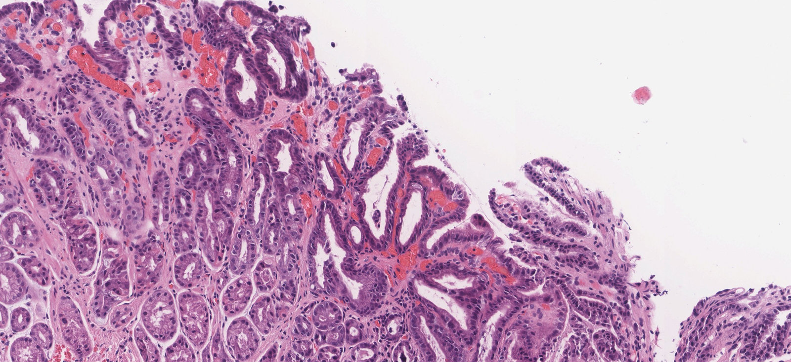

Foveolar hyperplasia

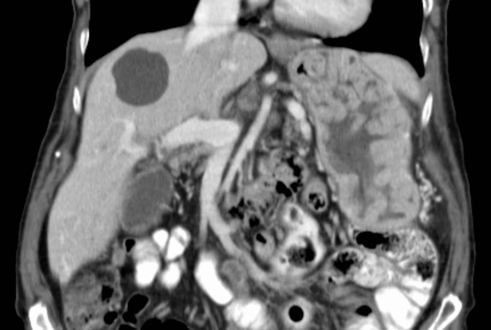

Hypertrophic gastropathy (Ménétrier disease)

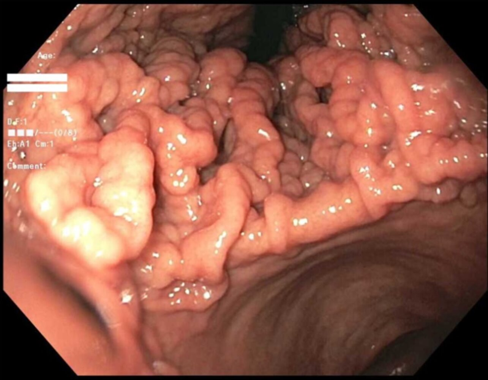

Menetrier disease (giant hypertrophic gastritis)

### Specific infiltrates

* Granulomatous gastritis: the presence of multiple <u>granulomas</u> in the gastric <u>mucosa</u> due to infectious or noninfectious causes  [[1]](https://coursology-qbank.com/amboss/article/CBYq17)[[9]](https://coursology-qbank.com/amboss/article/_bb5wH)

* Infectious <u>granulomatous gastritis</u>: e.g., <u>tuberculosis</u> , <u>syphilis</u>, <u>Whipple disease</u>, <u>histoplasmosis</u>, <u>anisakiasis</u>

* Noninfectious <u>granulomatous gastritis</u> : e.g., <u>Crohn disease</u> , <u>sarcoidosis</u>, <u>granulomatosis with polyangiitis</u>, foreign body

* Lymphocytic gastritis: <u>lymphocytic</u> infiltration  of the gastric <u>mucosa</u>, not specific to any particular disease, that is likely due to autoimmune or allergic inflammation

* <u>Eosinophilic gastritis</u>

---

## Diagnosis

### Approach [[4]](https://coursology-qbank.com/amboss/article/MuYM7I)

Although gastritis is diagnosed based on the results of gastric <u>mucosal</u> <u>biopsy</u>, not all patients require invasive diagnostic testing. For more detailed recommendations, see “<u>Approach to dyspepsia</u>.”

* Initial step: for most patients with upper GI symptoms, perform <u>testing for H. pylori</u>.

* <u>Upper endoscopy</u> and <u>biopsies</u>

* Indicated in patients > 60 years old

* Consider on a case-by-case basis if <u>red flags for dyspepsia</u> are present , or insufficient or no response to initial medical management

* Additional studies: indicated based on individual evaluation and clinical suspicion

* Detecting complications: e.g., ↓ <u>Hb</u> and ↑ <u>BUN/Cr ratio</u> suggest <u>GI bleeding</u>

* Evaluating differential diagnoses: e.g., <u>liver chemistries</u>, <u>lipase</u>, <u>amylase</u> to screen for hepatic or <u>pancreatic</u> disease

* Identifying the underlying etiology: e.g., <u>inflammatory markers</u> or <u>antibody</u> testing if there is suspicion of systemic inflammatory disease or autoimmune disease

### <u>Esophagogastroduodenoscopy</u> (<u>EGD</u>) with <u>biopsies</u> [[1]](https://coursology-qbank.com/amboss/article/CBYq17)[[4]](https://coursology-qbank.com/amboss/article/MuYM7I)

* Endoscopic findings

* Common findings include:

* Macroscopically normal <u>mucosa</u>

* <u>Mucosal</u> <u>hyperemia</u> and <u>edema</u>

* <u>Erosion</u> with or without bleeding

* <u>Atrophy</u> (focal or multifocal), <u>metaplasia</u>

* Other endoscopic findings may be present in some types of gastritis (e.g., significant enlargement of <u>mucosal</u> folds in <u>hypertrophic</u> gastritis).

* Histopathologic findings: dependent on etiology

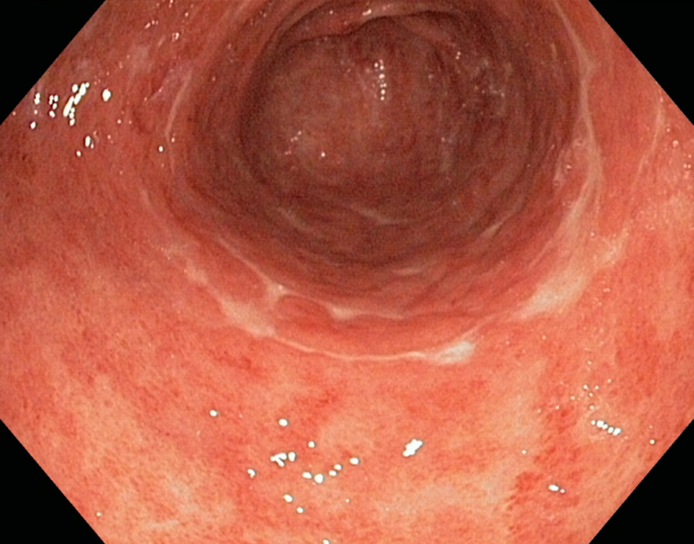

Confluent erosions in erosive gastritis

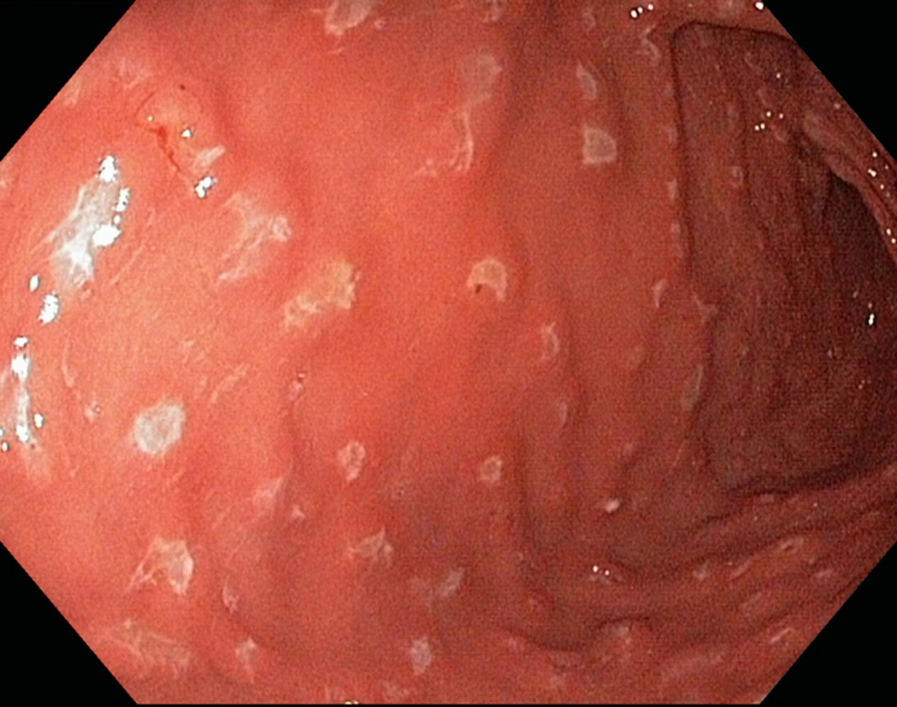

Elevated erosions in erosive gastritis

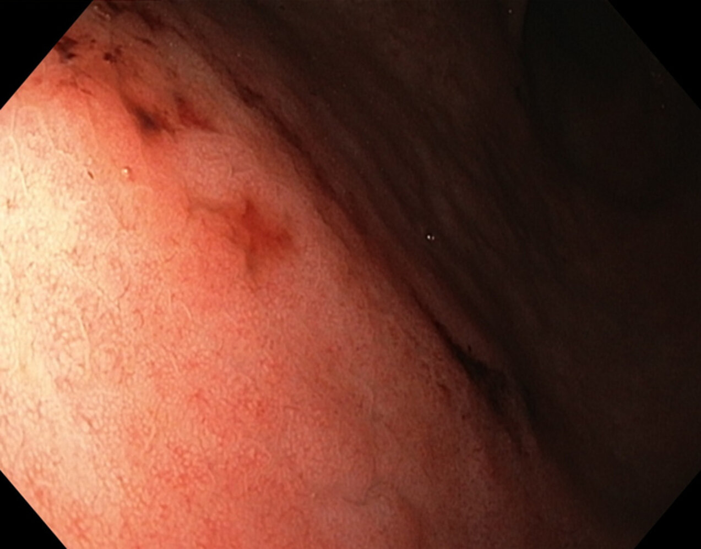

Hemorrhagic erosive gastritis

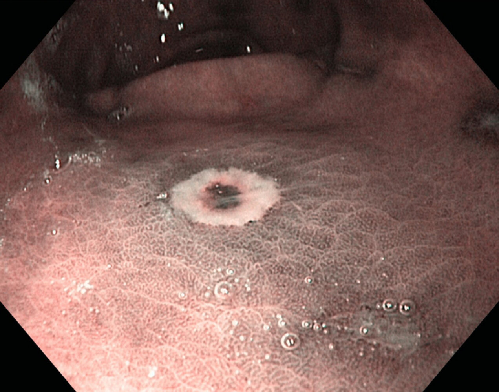

Hematin deposition in hemorrhagic erosive gastritis

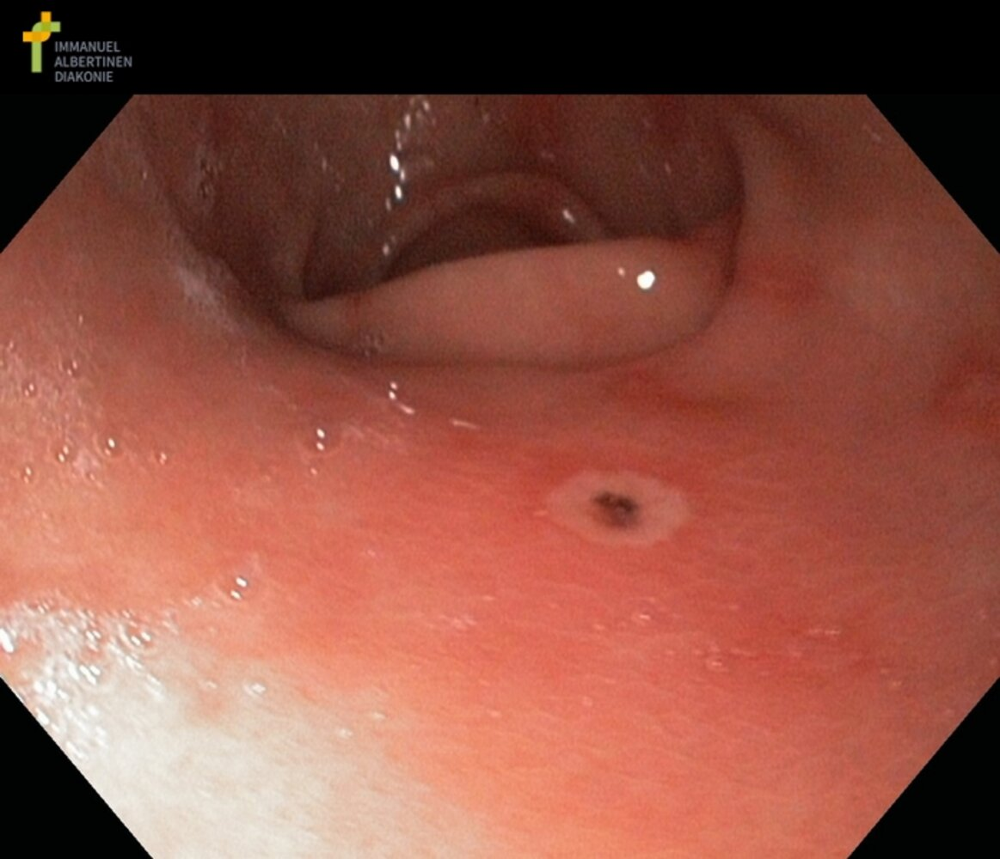

Hemorrhagic erosion in erosive gastritis

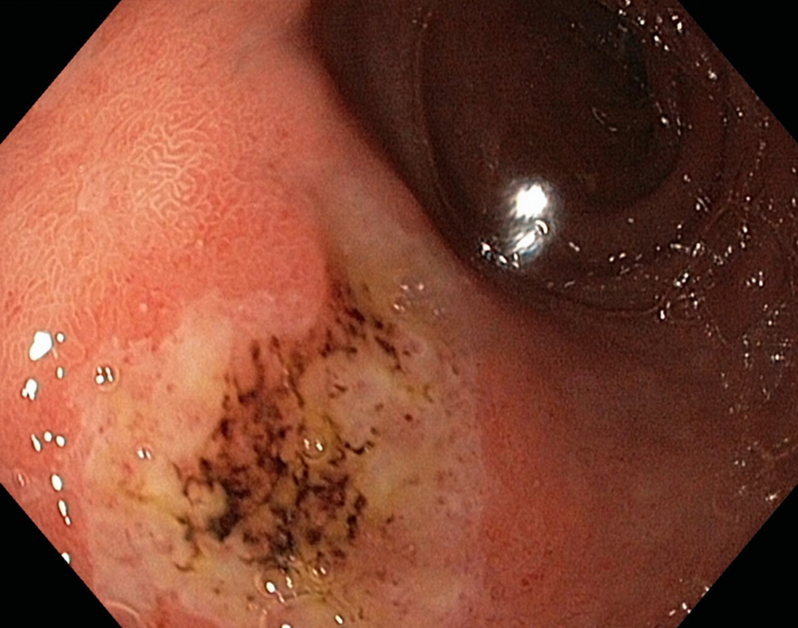

Hemorrhagic erosive gastritis

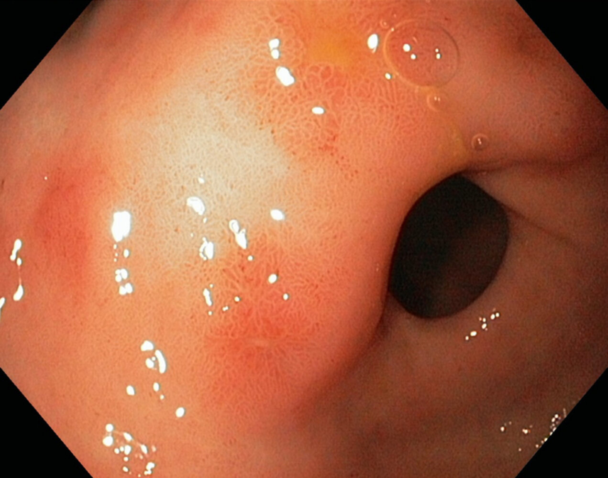

Diffuse erosive gastritis

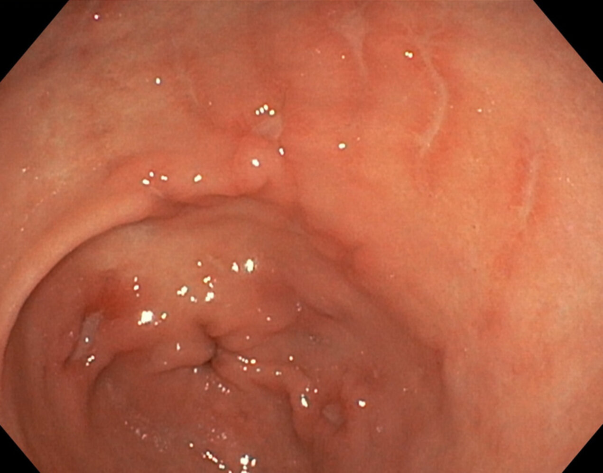

Linear erosions in erosive gastritis

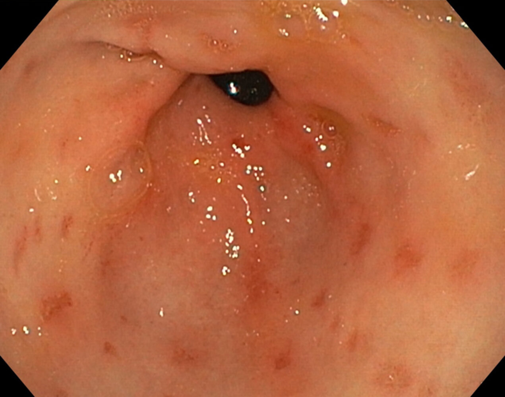

Multiple erosions in erosive gastritis

---

## Treatment

Patients with upper GI symptoms are often treated empirically (see “<u>Approach to dyspepsia</u>”). If gastritis is confirmed by <u>upper endoscopy</u>, treatment should be tailored to the underlying etiology. [[4]](https://coursology-qbank.com/amboss/article/MuYM7I)

* Pharmacological therapy

* <u>H. pylori eradication therapy</u>

* <u>Antacids and acid suppression medications</u>

* Nonpharmacological therapy [[10]](https://coursology-qbank.com/amboss/article/pO0LtT)[[11]](https://coursology-qbank.com/amboss/article/zaXrM9)[[12]](https://coursology-qbank.com/amboss/article/-aXDM9)

* Dietary and lifestyle modification

* Trigger avoidance: e.g., <u>NSAIDs</u>, tobacco, <u>caffeine</u>, <u>alcohol</u>

* Specific treatment depending on etiology: see “Subtypes and variants.”

---