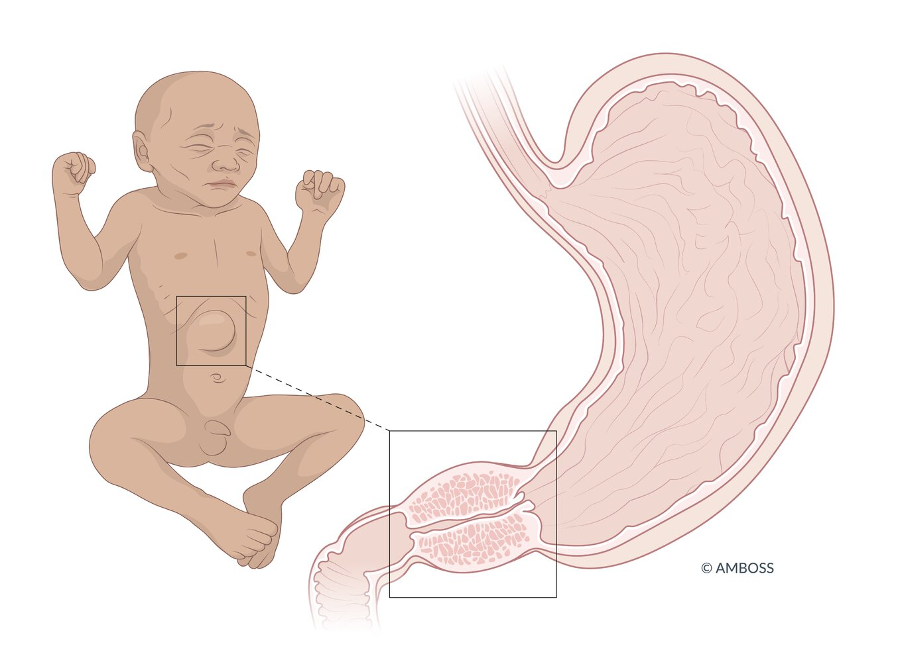
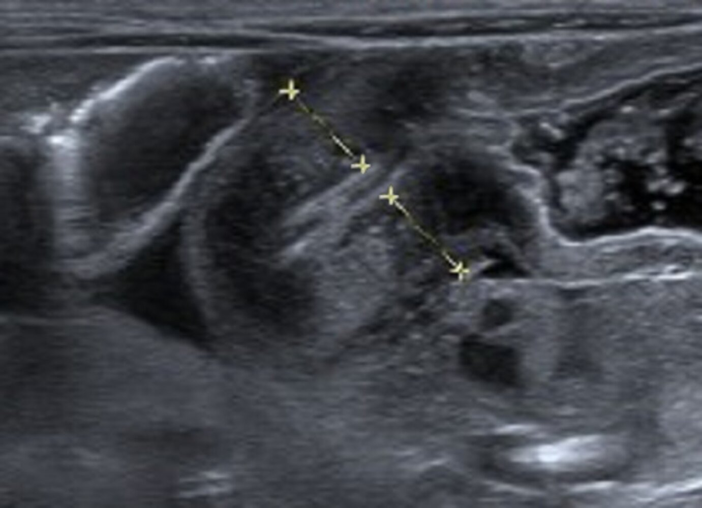
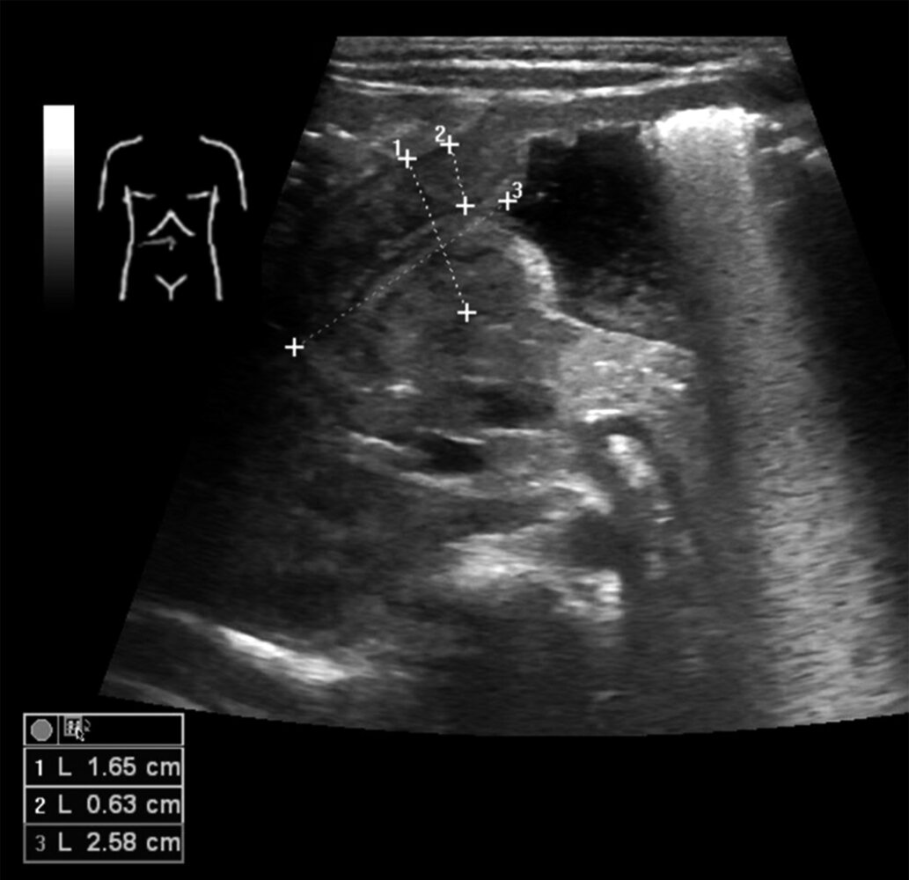

# Hypertrophic pyloric stenosis

*Categories: Clinical knowledge > Surgery > Abdominal surgery > Stomach > Hypertrophic pyloric stenosis*

[Original Article Link](https://coursology-qbank.com/amboss/article/J40s4T)

---

## Summary

<u>Hypertrophic</u> <u>pyloric</u> stenosis is the most common cause of <u>gastric outlet obstruction</u> in <u>infants</u>. The condition manifests with <u>postprandial</u> nonbilious <u>projectile vomiting</u>, and symptom onset is typically between 2 and 6 weeks of age. On examination, an olive-shaped mass may be palpable in the epigastrium. The diagnosis is confirmed with abdominal <u>ultrasound</u>. Rehydration and correction of <u>electrolyte</u> derangements are required before definitive treatment with <u>pyloromyotomy</u>.

---

## Epidemiology

* <u>Incidence</u>: 0.5–5:1000 <u>live births</u> (considered to be the most common cause of <u>gastric outlet obstruction</u> in <u>infants</u>) [[1]](https://coursology-qbank.com/amboss/article/E1b8is)

* Sex: <u>♂</u> > <u>♀</u> (∼ 5:1)

* More common in firstborn children

* The <u>incidence</u> is higher in White populations. [[2]](https://coursology-qbank.com/amboss/article/f40kiT)

Epidemiological data refers to the US, unless otherwise specified.

---

## Etiology

* Environmental factors

* Exposure to <u>nicotine</u> during <u>pregnancy</u> [[2]](https://coursology-qbank.com/amboss/article/f40kiT)

* Bottle feeding  [[3]](https://coursology-qbank.com/amboss/article/T406iT)

* Genetic factors: Patients with affected relatives have an increased risk of <u>hypertrophic</u> <u>pyloric</u> stenosis.

* <u>Macrolide</u> <u>antibiotics</u>: <u>Erythromycin</u> and <u>azithromycin</u> are associated with an increased risk of <u>hypertrophic</u> <u>pyloric</u> stenosis, especially when administered within 2 weeks after <u>birth</u>.

---

## Clinical features

* Onset: typically between 2 and 6 weeks of age (rarely after 12 weeks of age) [[4]](https://coursology-qbank.com/amboss/article/AN1Rdh0)[[5]](https://coursology-qbank.com/amboss/article/xmdE3q0)

* Symptoms [[4]](https://coursology-qbank.com/amboss/article/AN1Rdh0)

* Frequent <u>regurgitation</u> that progresses to projectile and nonbilious <u>vomiting</u> after feeding

* Continued hunger after <u>vomiting</u>

* Late stage: <u>dehydration</u>, poor weight gain, <u>failure to thrive</u>

* <u>Physical examination</u> [[4]](https://coursology-qbank.com/amboss/article/AN1Rdh0)

* Enlarged, thickened, nontender <u>pylorus</u> on palpation (described as olive-like)

* Visible <u>peristaltic</u> waves in the epigastrium

Hypertrophic pyloric stenosis

Anatomy of the stomach

---

## Diagnosis

<u>Hypertrophic</u> <u>pyloric</u> stenosis is suspected based on history and <u>physical examination</u>; imaging (e.g., abdominal <u>ultrasound</u>) is required for confirmation. [[5]](https://coursology-qbank.com/amboss/article/xmdE3q0)

### <u>Ultrasound</u> abdomen [[4]](https://coursology-qbank.com/amboss/article/AN1Rdh0)[[6]](https://coursology-qbank.com/amboss/article/Jods1I0)

* Indication: first-line for suspected <u>hypertrophic</u> <u>pyloric</u> stenosis [[4]](https://coursology-qbank.com/amboss/article/AN1Rdh0)[[6]](https://coursology-qbank.com/amboss/article/Jods1I0)

* Findings [[6]](https://coursology-qbank.com/amboss/article/Jods1I0)

* Thickened <u>pylorus</u> muscle (≥ 4 mm)

* Elongated <u>pyloric</u> channel length (> 18 mm)

Infantile hypertrophic pyloric stenosis

Hypertrophic pyloric stenosis on ultrasound

### <u>Upper GI series</u> [[6]](https://coursology-qbank.com/amboss/article/Jods1I0)

* Indications [[6]](https://coursology-qbank.com/amboss/article/Jods1I0)

* Concern for <u>bowel obstruction</u> (e.g., <u>midgut volvulus</u>)

* May be indicated for patients with suspected <u>pyloric</u> stenosis with nondiagnostic <u>ultrasound</u>

* Findings [[6]](https://coursology-qbank.com/amboss/article/Jods1I0)

* <u>String sign</u>: elongated <u>pylorus</u> with narrow lumen

* Beak sign: <u>distal</u> tapering of the <u>pylorus</u> lumen

* Shoulder sign: indentation of the <u>antrum</u> caused by the <u>pylorus</u>

### <u>Laboratory studies</u> [[4]](https://coursology-qbank.com/amboss/article/AN1Rdh0)[[5]](https://coursology-qbank.com/amboss/article/xmdE3q0)

Assess for <u>electrolyte</u> derangements and <u>dehydration</u> with a <u>BMP</u>. The following findings are common in late-stage disease and uncommon in early disease:

* <u>Hypochloremic</u>, <u>hypokalemic</u> <u>metabolic alkalosis</u>

* Loss of gastric <u>hydrochloric acid</u> due to emesis results in increased <u>bicarbonate</u> and decreased <u>chloride</u> concentrations in the blood.

* <u>Hypokalemia</u> usually occurs in <u>infants</u> who have been <u>vomiting</u> for many days or even weeks.

* <u>Hyponatremia</u> or <u>hypernatremia</u>

> [!NOTE]
> <u>Hypertrophic</u> <u>pyloric</u> stenosis is now usually diagnosed early, and <u>infants</u> generally do not present with significant <u>electrolyte</u> imbalances.

---

## Differential diagnoses

| Differential diagnosis of newborn vomiting |  |
| --- | --- |
| Condition | Findings |
| <u>Hypertrophic</u> <u>pyloric</u> stenosis |   * <u>Regurgitation</u>  * Projectile, nonbilious <u>vomiting</u>  * No <u>diarrhea</u>  * <u>Alkalosis</u> and <u>hypokalemia</u>    |
| <u>Midgut volvulus and intestinal malrotation</u> |   * <u>Bilious</u> <u>vomiting</u>  * Signs of <u>bowel ischemia</u>: <u>hematochezia</u>, <u>hematemesis</u>, <u>hypotension</u>, and <u>tachycardia</u> in severe cases  * Abdominal distention    |
| <u>Gastroesophageal reflux in infants</u> |   * <u>Regurgitation</u> and/or <u>vomiting</u> of food shortly after feeding  * Healthy children with normal development    |
| <u>Gastroesophageal reflux disease</u> in <u>infants</u> |   * <u>Regurgitation</u> and/or persistent <u>vomiting</u> of food  * Poor appetite, weight loss, <u>failure to thrive</u>  * Abdominal <u>pain</u>/discomfort  * <u>Wheezing</u>, <u>stridor</u>, <u>chronic cough</u>, <u>hoarseness</u>    |
| <u>Gastroenteritis</u> |   * <u>Diarrhea</u>  * <u>Vomiting</u>  * Possibly <u>fever</u>    |
| <u>Congenital adrenal hyperplasia</u> with salt loss |   * <u>Vomiting</u>, <u>apathy</u>, weight loss  * <u>Acidosis</u> and <u>hyperkalemia</u>    |
|  <u>Cyclical vomiting syndrome</u> [[7]](https://coursology-qbank.com/amboss/article/V_cGMU0) |  * Recurrent, <u>self-limiting</u> attacks of severe <u>vomiting</u> (See "<u>Rome IV criteria for cyclical vomiting syndrome</u>.")   |

The differential diagnoses listed here are not exhaustive.

---

## Treatment

### Initial management [[4]](https://coursology-qbank.com/amboss/article/AN1Rdh0)[[5]](https://coursology-qbank.com/amboss/article/xmdE3q0)

* Establish <u>NPO</u> status.

* Initiate <u>IV fluid resuscitation</u> and/or IV <u>maintenance fluids</u>.

* <u>Replete electrolytes</u> (e.g., <u>potassium repletion</u>) as indicated.

* Consult <u>surgery</u> for <u>pyloromyotomy</u>.

* Admit for surgical management.

### Pyloromyotomy [[4]](https://coursology-qbank.com/amboss/article/AN1Rdh0)[[5]](https://coursology-qbank.com/amboss/article/xmdE3q0)

* Definition: : a surgical procedure in which a longitudinal <u>incision</u> is made through the muscular layers of the <u>hypertrophic</u> <u>pylorus</u> to widen its lumen

* Indications: <u>hypertrophic</u> <u>pyloric</u> stenosis

* Contraindications: inadequate <u>fluid resuscitation</u> and <u>electrolyte repletion</u>

* Techniques

* <u>Laparoscopic</u> <u>pyloromyotomy</u> (preferred)

* Open <u>Ramstedt pyloromyotomy</u>

* Complications

* <u>Gastrointestinal perforation</u>

* Incomplete <u>pyloromyotomy</u>

> [!WARNING]
> <u>Infants</u> with uncorrected <u>metabolic alkalosis</u> are at increased risk of postoperative <u>apnea</u> and prolonged <u>intubation</u>. [[5]](https://coursology-qbank.com/amboss/article/xmdE3q0)

---