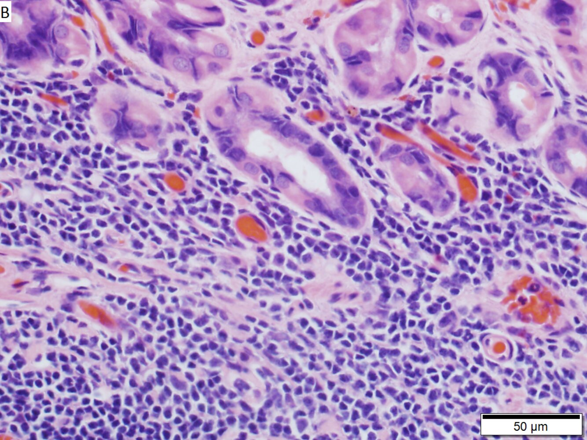
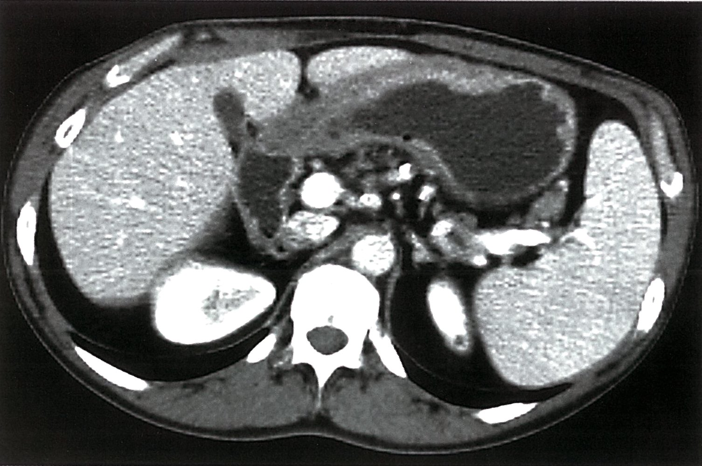
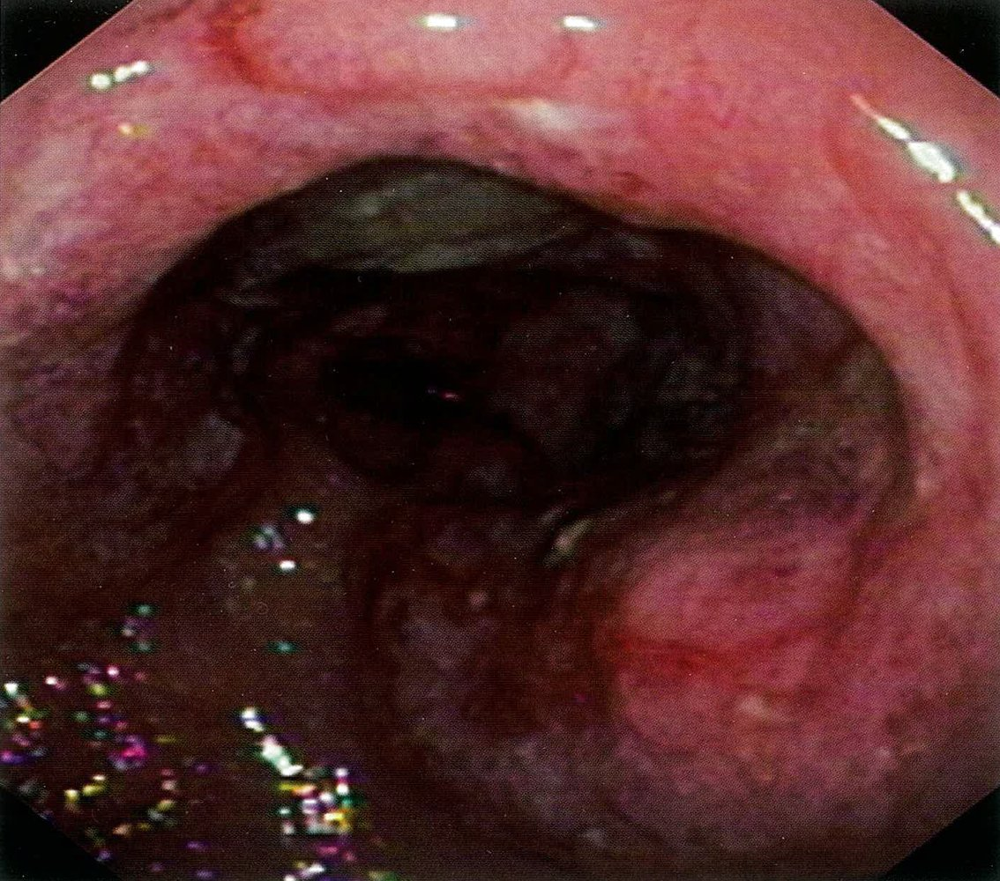
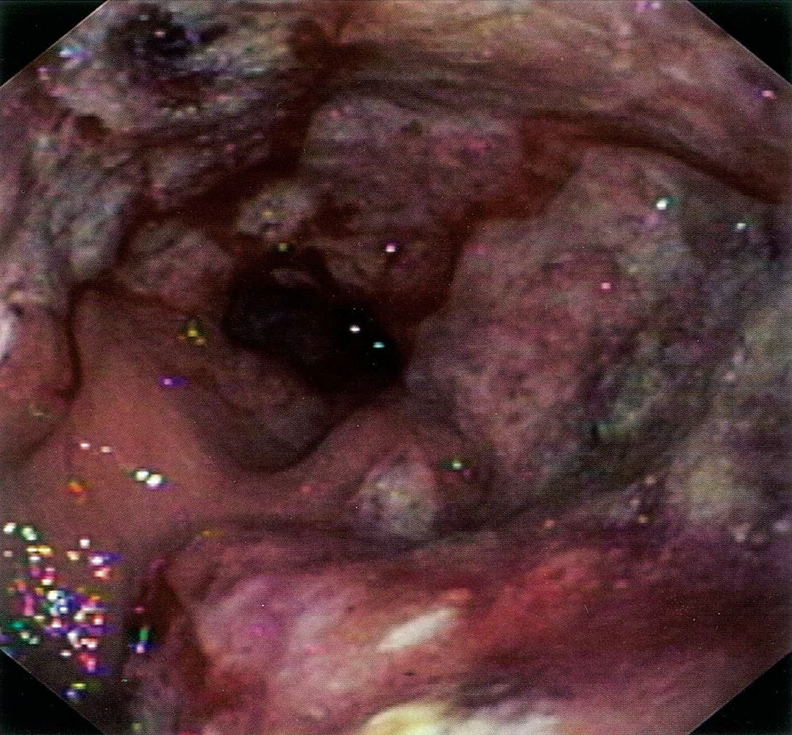
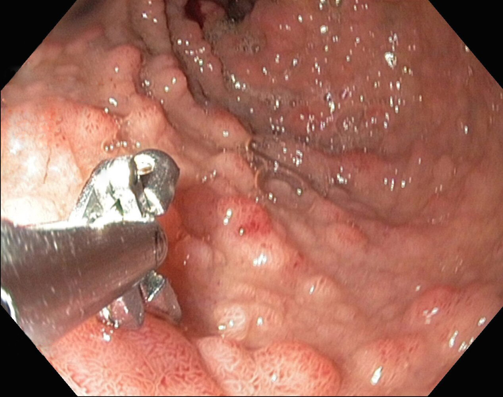

# MALT lymphoma

*Categories: Clinical knowledge > Surgery > Abdominal surgery > Stomach > MALT lymphoma*

[Original Article Link](https://coursology-qbank.com/amboss/article/LT0wr2)

---

## Summary

<u>Mucosa</u>-Associated Lymphoid Tissue (<u>MALT</u>) <u>lymphoma</u> (also called MALToma or extranodal <u>marginal zone lymphoma</u>) is a <u>B-cell</u> <u>non-Hodgkin lymphoma</u> (<u>NHL</u>) that typically affects elderly patients in the 7th and 8th decades. MALTomas can be categorized according to their location as either gastric or nongastric. Gastric MALTomas are frequently associated with <u>Helicobacter pylori</u> (<u>H. pylori</u>) infection, whereas nongastric MALTomas are rather associated with autoimmune conditions (e.g., Sjögren syndrome, <u>Hashimoto's thyroiditis</u>). MALTomas typically present with nonspecific symptoms (e.g., fatigue, weight loss) and an unremarkable <u>physical exam</u>. Diagnosis is based on <u>histopathology</u> and <u>immunohistochemistry</u>. In the case of gastric MALTomas, a <u>biopsy</u> should be performed by upper gastrointestinal (<u>UGI</u>) endoscopy. Imaging techniques such as <u>computed tomography</u> (CT) are used for staging purposes. Treatment depends on the type of MALToma: Gastric MALTomas, for example, are treated in most cases with the eradication of the underlying <u>H. pylori</u> infection, whereas nongastric MALTomas are treated with radiation, <u>chemotherapy</u>, and <u>surgery</u>.

---

## Epidemiology

* Approx. 5% of NHLs are due to MALTomas

* Peak <u>incidence</u>: 7th and 8th decades

Epidemiological data refers to the US, unless otherwise specified.

---

## Etiology

* Gastric MALTomas:  multiple studies show an association with <u>H. pylori</u> infection.

* Nongastric MALTomas: frequent association with autoimmune conditions

* <u>Salivary gland</u> MALTomas: see <u>Sjogren syndrome</u>

* <u>Thyroid</u> MALTomas: see <u>Hashimoto thyroiditis</u>

> [!NOTE]
> MALTomas show an association with chronic immune stimulation (bacterial, autoimmune).

---

## Clinical features

* Symptoms depend on the affected organ

* <u>Physical exam</u> is often unremarkable

* <u>Lymphadenopathy</u> is rarely present

* Gastric MALTomas

* Present similarly to <u>peptic ulcer disease</u> and <u>gastritis</u>

* Abdominal <u>pain</u>

* <u>Melena</u>, <u>hematemesis</u>, potentially <u>anemia</u>

* Fatigue, weight loss

* Non-gastric MALTomas

* Salivary MALToma: <u>parotid</u> enlargement

* <u>Thyroid</u> MALToma: may present with compression symptoms (e.g., <u>dysphagia</u>, <u>hoarseness</u>)

---

## Diagnosis

### General approach

* Blood analysis: <u>anemia</u>

* <u>Histopathology</u> and <u>immunohistochemistry</u> 

* Thick infiltrates of small to medium-sized lymphoid cells

* <u>Granulation tissue</u>, <u>ulcerations</u>

* Immunologic phenotyping: markers of <u>B-cell</u> <u>lymphoma</u> (e.g., <u>CD20</u>)

* Imaging: CT, <u>MRI</u>, <u>PET-CT</u> for <u>tumor staging</u>

Gastric MALT lymphoma

### Gastric MALToma

* Endoscopy: additionally, upper gastrointestinal (<u>UGI</u>) endoscopy

* Determination of <u>tumor</u> spread

* <u>Biopsy</u> studies may reveal type B <u>gastritis</u> and <u>H. pylori</u>

* Imaging: <u>CT scan</u> of the chest and abdomen with IV contrast for staging

Gastric wall thickening

MALT lymphoma

MALT lymphoma

MALT lymphoma of the small intestine

---

## Treatment

### Gastric MALTomas

* First-line: : <u>H. pylori eradication therapy</u>

* Should be performed even if patient tests negative

* Eradication of <u>H. pylori</u> is curative in up to 90% of low-malignant gastric MALTomas

* If <u>H. pylori eradication therapy</u> fails: <u>radiotherapy</u> or <u>chemotherapy</u>

* <u>Surgery</u>: gastric resection only necessary if complications (e.g., perforation, bleeding, obstruction) occur.

### Nongastric MALToma

* Depends on the exact type and staging

* Treatment options include : radiation, <u>chemotherapy</u>, <u>surgery</u> for local diseases

---