# Peptic ulcer disease

*Categories: Clinical knowledge > Surgery > Abdominal surgery > Stomach > Peptic ulcer disease*

[Original Article Link](https://coursology-qbank.com/amboss/article/zg0rB2)

---

## Summary

Peptic <u>ulcer</u> disease (PUD) is the presence of one or more ulcerative lesions in the <u>stomach</u> or <u>duodenum</u>. Etiologies include <u>Helicobacter pylori infection</u> (most common), prolonged <u>NSAID</u> use (<u>NSAID-induced ulcer</u>), conditions associated with an overproduction of <u>stomach acid</u> (hypersecretory states), and <u>stress</u>. Epigastric <u>pain</u> is a typical symptom of PUD; however, many patients remain asymptomatic. Usually, patients younger than 60 years of age can be managed with <u>testing for H. pylori</u> infection or with empirical <u>acid suppression therapy</u>. Older patients and those with high-risk clinical features benefit from an <u>esophagogastroduodenoscopy</u> (<u>EGD</u>) and <u>biopsies</u> to confirm the diagnosis or rule out differential diagnoses (especially <u>gastric cancer</u>). First-line treatment for most peptic <u>ulcers</u> involves symptom control (e.g., acid-lowering medication), <u>H. pylori eradication therapy</u> as indicated, and withdrawal of causative agents. Antisecretory drugs (e.g., proton-pump inhibitors), which reduce <u>stomach acid</u> production, are continued for 4–8 weeks after eradication therapy and may be considered for <u>maintenance therapy</u> if symptoms recur. Surgical intervention may be considered in rare cases. Some patients benefit from endoscopic surveillance, especially if symptoms persist or there is clinical suspicion for <u>malignancy</u>.

---

## Definitions

* Peptic <u>ulcer</u>: a defect in the gastric or <u>duodenal</u> <u>mucosa</u> with a diameter of at least 0.5 cm and a depth that penetrates through the <u>muscularis mucosae</u> [[1]](https://coursology-qbank.com/amboss/article/_uY5FI)

* Gastric ulcer: a peptic <u>ulcer</u> of the gastric <u>mucosa</u>, typically located along the <u>lesser curvature</u> in the transitional portion between the corpus and <u>antrum</u>

* Duodenal ulcer: a peptic <u>ulcer</u> of the <u>duodenal</u> <u>mucosa</u>, usually located on the <u>anterior</u> or <u>posterior</u> wall of the <u>duodenal bulb</u>

> [!TIP]
> <u>Erosions</u> are more <u>superficial</u> than <u>ulcers</u>. <u>Ulcers</u> involve damage to the gastric <u>mucosa</u> extending beyond the <u>muscularis mucosa</u> layer into the <u>submucosa</u>.

---

## Etiology

### Common causes of PUD

The two major contributing factors to the development of PUD are <u>H. pylori</u> infection and nonsteroidal anti-inflammatory drug (<u>NSAID</u>) use. Both factors contribute to the development of PUD and interact with other <u>risk factors</u> to promote <u>ulcer</u> formation.

* <u>Helicobacter pylori</u> infection

* Associated with 40–70% of <u>duodenal ulcers</u> and 25–50% of <u>gastric ulcers</u>  [[6]](https://coursology-qbank.com/amboss/article/mkXVoy)[[7]](https://coursology-qbank.com/amboss/article/5kXioy)

* The rate of <u>H. pylori infection</u> (and, therefore, the development of PUD) is decreasing. [[8]](https://coursology-qbank.com/amboss/article/lkXvLy)

* Chronic <u>NSAID</u> use

* Associated with a fourfold risk of developing PUD [[9]](https://coursology-qbank.com/amboss/article/LkXwoy)

* Increases the risk for <u>complications of PUD</u> (see “<u>Complications of peptic ulcer disease</u>”)

> [!TIP]
> For patients requiring chronic <u>NSAID</u> therapy, consider <u>acid suppression medication</u> for <u>ulcer</u> prevention. [[10]](https://coursology-qbank.com/amboss/article/H51Klh0)

### Associated <u>risk factors</u>

<u>H. pylori infection</u> or <u>NSAID</u> use alone do not typically cause <u>ulcer</u> formation. There are often additional <u>risk factors</u> present, such as the following, that increase the <u>probability</u> of developing an <u>ulcer</u>:

* <u>Shared risk factors for PUD, GERD and gastritis</u> (i.e., smoking, <u>heavy alcohol use</u>, <u>glucocorticoids</u>, <u>caffeine</u>)

* Diet  [[11]](https://coursology-qbank.com/amboss/article/nkX7oy)

* Psychological factors (e.g., <u>anxiety</u>, <u>stress</u>, <u>PTSD</u>)

* Genetic factors  [[12]](https://coursology-qbank.com/amboss/article/MkXMoy)

### Rare causes of PUD

* Acid hypersecretory states

* <u>Zollinger-Ellison syndrome</u> (<u>gastrinoma</u>)

* <u>Systemic mastocytosis</u>

* <u>Hyperparathyroidism</u>

* Non-<u>NSAID</u> medications

* <u>Acetaminophen</u>

* <u>Bisphosphonates</u>

* <u>Sirolimus</u>

* <u>Mycophenolate</u>

* <u>SSRIs</u>

* <u>Chemotherapeutics</u> (e.g., <u>5-FU</u>)

* Infections

* <u>CMV</u>

* <u>HSV-1</u>

* <u>EBV</u>

* Helicobacter heilmannii

* Others

* Radiation

* Illicit drug use (e.g., <u>cocaine</u>, <u>methamphetamine</u>)

* Systemic inflammatory diseases (e.g., <u>Crohn disease</u>, <u>sarcoidosis</u>)

* Mechanical (e.g., foreign body, <u>GI tract</u> obstruction, postsurgical anatomy)

---

## Pathophysiology

Under typical physiological conditions, the cells of the gastric <u>mucosa</u> secrete a gastric juice (an acidic fluid composed of <u>HCl</u>, <u>pepsinogen</u>, <u>intrinsic factor</u>, and mucus), which may damage the native cells of the <u>GI tract</u>. Protective mechanisms (e.g., secretion of mucus and <u>HCO3-</u> to form a protective barrier) prevent the gastric juices from digesting and eroding the gastric <u>epithelial</u> cells. <u>Ulcer</u> formation occurs when either the protective mechanisms are disrupted and/or excessive acids or <u>pepsin</u> are secreted.

### Physiological <u>gastric secretions</u> [[13]](https://coursology-qbank.com/amboss/article/2OXT7y)

* <u>Parietal cells</u>

* Secrete <u>hydrochloric acid</u> (<u>HCl</u>) and <u>intrinsic factor</u>

* Stimulated by <u>acetylcholine</u>, <u>histamine</u>, and <u>gastrin</u>

* Inhibited by <u>prostaglandins</u> and <u>somatostatin</u>

* <u>Mucosal</u> cells

* Secrete protective mucus

* Stimulated by <u>acetylcholine</u>, <u>prostaglandins</u> (which inhibit <u>HCl</u> secretion), and <u>secretin</u>

* <u>Chief cells</u>

* Secrete <u>pepsinogen</u>

* Stimulated by <u>acetylcholine</u>, <u>gastrin</u>, <u>secretin</u>, and <u>vasoactive intestinal polypeptide</u> (<u>VIP</u>)

See “<u>Secretory and regulatory products of the gastrointestinal tract</u>” in “<u>Gastrointestinal tract</u>” for more details on typical physiological secretions.

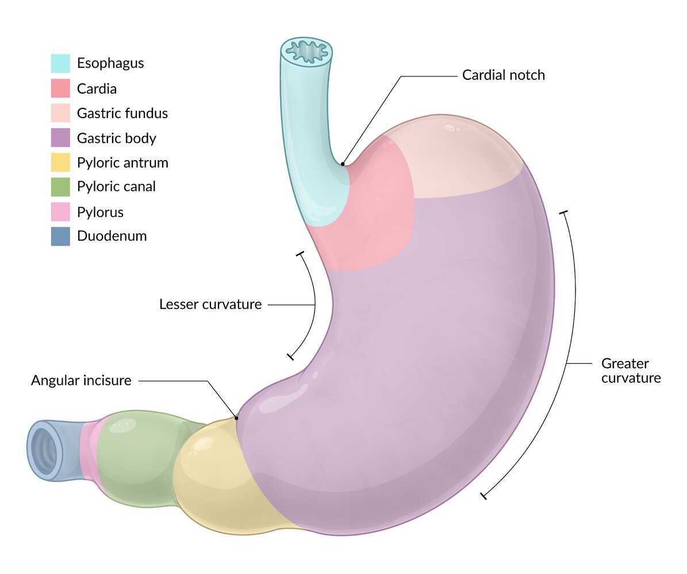

Sections of the stomach

Anatomy of the stomach

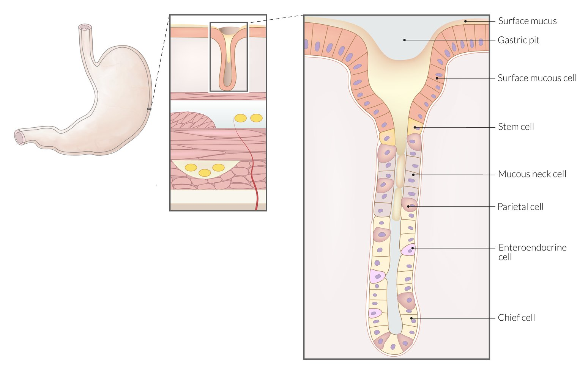

Gastric gland

### Mechanisms of physiological disruption [[13]](https://coursology-qbank.com/amboss/article/2OXT7y)

* <u>H. pylori</u>

* <u>Gastric ulcers</u>

* <u>H. pylori</u> secretes <u>urease</u> → conversion of <u>urea</u> to <u>NH3</u> → alkalinization of acidic environment → survival of bacteria in gastric lumen

* Bacterial <u>colonization</u> and attachment to <u>epithelial</u> cells → release of cytotoxins (e.g., cagA toxin) → disruption of the <u>mucosal</u> barrier and damage to underlying cells

* <u>Duodenal ulcers</u>

* <u>H. pylori</u> inhibits <u>somatostatin</u> secretion → ↑ <u>gastrin</u> secretion → ↑ H+ secretion → excess H+ delivery to the <u>duodenum</u>

* Direct spread of <u>H. pylori</u> to the <u>duodenum</u> → inhibition of <u>duodenal</u> <u>HCO3-</u> secretion→ acidification and insufficient neutralization of <u>duodenal</u> contents

* <u>NSAIDs</u>

* Inhibit <u>COX-1</u> and <u>COX-2</u> → decrease in <u>prostaglandin</u>;   production → <u>erosion</u> of the gastric <u>mucosa</u>

* Decrease <u>mucosal</u> blood flow

* Inhibit <u>mucosal</u> cell <u>proliferation</u>

* Acid hypersecretion: : acid hypersecretion (e.g., <u>Zollinger-Ellison syndrome</u>) and increased <u>gastrin</u> production → ↑ H+ secretion and <u>parietal cell</u> mass → delivery of excessive acid to the <u>duodenum</u>

---

## Clinical features

PUD may be asymptomatic or manifest with a variety of clinical features, e.g., general <u>dyspepsia</u> or complications such as perforation or bleeding.

### Asymptomatic PUD

* Up to 70% of patients with peptic <u>ulcers</u> do not experience symptoms. [[14]](https://coursology-qbank.com/amboss/article/POXWsy)[[15]](https://coursology-qbank.com/amboss/article/3NXSaA)

* Patients who take <u>NSAIDs</u> are more likely to have asymptomatic <u>ulcers</u> and present with <u>complications of PUD</u>.

### Symptomatic PUD

* Abdominal <u>pain</u>

* The most common symptom of PUD  [[16]](https://coursology-qbank.com/amboss/article/QNXuaA)

* Commonly located in the epigastrium

* Often described as “gnawing” or “burning”

* Can be related to meal intake depending on the location of the <u>ulcer</u> (see “<u>Clinical symptoms of gastric and duodenal ulcers</u>”)

* Other associated symptoms

* Belching

* Indigestion

* Gastrointestinal reflux

* <u>Nausea</u> and/or <u>vomiting</u>

* <u>Bloating</u>/abdominal fullness

| Clinical symptoms of gastric and duodenal ulcers |  |  |
| --- | --- | --- |
|  | <u>Gastric ulcer</u> | <u>Duodenal ulcer</u> |
| Findings common to both |   * <u>Dyspepsia</u>: <u>postprandial</u> heaviness, early satiety, and gnawing, aching, or burning epigastric <u>pain</u>  * <u>Pain</u> relief with <u>antacids</u>  * Potential signs of internal bleeding (e.g., <u>anemia</u>, <u>hematemesis</u>, <u>melena</u>)  * Stool sample positive for occult blood (see “Diagnostics” in “<u>Gastrointestinal bleeding</u>”)    |  |
| <u>Pain</u> and eating |  * <u>Pain</u> increases shortly after eating → weight loss   |   * <u>Pain</u> is relieved with food intake → weight gain  * <u>Pain</u> increases 2–5 hours after eating. [[17]](https://coursology-qbank.com/amboss/article/iNXJaA)    |
| Nocturnal <u>pain</u> |  * Less common [[18]](https://coursology-qbank.com/amboss/article/C6XqM_)   |  * More common [[18]](https://coursology-qbank.com/amboss/article/C6XqM_)   |

> [!NOTE]
> Gastric <u>ulcer</u> is associated with <u>pain</u> after light (weight loss) Gorging. Duodenal <u>ulcer</u> is associated with relief after massive (weight gain) Desserts.

---

## Diagnosis

### Approach [[19]](https://coursology-qbank.com/amboss/article/uK0pRS)[[20]](https://coursology-qbank.com/amboss/article/EK08RS)[[21]](https://coursology-qbank.com/amboss/article/TBa6ZM)[[22]](https://coursology-qbank.com/amboss/article/LOYwG6)

|  Diagnostic approach for suspected PUD [[23]](https://coursology-qbank.com/amboss/article/MuYM7I)  |  |  |
| --- | --- | --- |
|  | Patient group | Testing strategy |
| Initial evaluation |  * All patients   |   * Screen for common etiologies on history, e.g., <u>NSAID</u> use (see “Etiology”)  * Consider the following if there is suspicion for occult bleeding:  * <u>CBC</u> and <u>BMP</u>  * <u>Fecal occult blood test</u>    |
|  * Patients ≤ 60 years of age without <u>red flags for dyspepsia</u>   |  * Begin with noninvasive testing for <u>H. pylori infection</u>.   * <u>Urea breath test</u>  * <u>H. pylori stool antigen test</u>   |  |
|   * Patients > 60 years of age, or > 45 years of age in areas with high <u>gastric cancer</u> <u>prevalence</u>  * Patients with <u>red flags for dyspepsia</u>: on a case-by-case basis  [[23]](https://coursology-qbank.com/amboss/article/MuYM7I)  * Patients unresponsive to empiric medical therapy (e.g., <u>H. pylori eradication therapy</u>, <u>PPI</u> trial therapy)    |  * Refer directly for <u>EGD</u> (or other indicated diagnostic study, e.g., <u>liver chemistries</u> and abdominal <u>ultrasound</u> for <u>jaundice</u>).   |  |
| Further evaluation |  * All patients with persistently uncertain etiology   |  * Consider specialized <u>laboratory studies</u> (e.g., <u>secretin stimulation test</u> for <u>gastrinoma</u>).   |

> [!TIP]
> <u>Alarm features</u> warranting an <u>EGD</u> in younger patients include progressive <u>dysphagia</u>, <u>odynophagia</u>, rapid weight loss, persistent <u>vomiting</u>, suspected <u>GI bleeding</u>, and a <u>family history</u> of upper GI <u>malignancy</u>.

### <u>Esophagogastroduodenoscopy</u> (<u>EGD</u>) [[23]](https://coursology-qbank.com/amboss/article/MuYM7I)

The most accurate test to confirm the diagnosis.  Other clinical applications include:

* <u>Malignancy</u> screening: to differentiate PUD from <u>gastric cancer</u>

* Visualization of the lesions

* <u>Biopsy</u> sampling

* Invasive <u>H. pylori testing</u>

* Simultaneous therapeutic measures, e.g., <u>hemostasis</u> treatment with electrocautery for active bleeding

#### Endoscopic findings [[24]](https://coursology-qbank.com/amboss/article/RcblXs)

| Differentiating between benign and malignant gastroduodenal ulcers |  |  |
| --- | --- | --- |
|  |  Benign (classic endoscopic appearance of peptic <u>ulcers</u>)  | Malignant |
| Base |  * Smooth   |  * Ulcerated mass protruding into the lumen   |
| Edges |  * Rounded, regular   |  * Irregular, overhanging   |
| Surrounding <u>mucosa</u> |  * Regular   |  * Nodular, irregular   |
| Location |   * <u>Gastric ulcers</u>: <u>lesser curvature of the stomach</u>, between the corpus and <u>antrum</u>  * <u>Duodenal ulcers</u>: <u>anterior</u> or <u>posterior</u> wall of the <u>duodenal bulb</u>    |  * Atypical   |
| <u>Histopathology</u> |  * Chronic inflammatory changes and active granulation   |  * <u>Dysplasia</u>, invasion of deeper layers (see also “<u>Gastric cancer</u>”)   |

* <u>Gastrinoma</u>: multiple <u>ulcers</u> and thick <u>gastric folds</u>

* Bleeding <u>ulcers</u>: See “<u>Gastrointestinal bleeding</u>.”

> [!WARNING]
> An atypical location is suspicious for <u>carcinoma</u>!

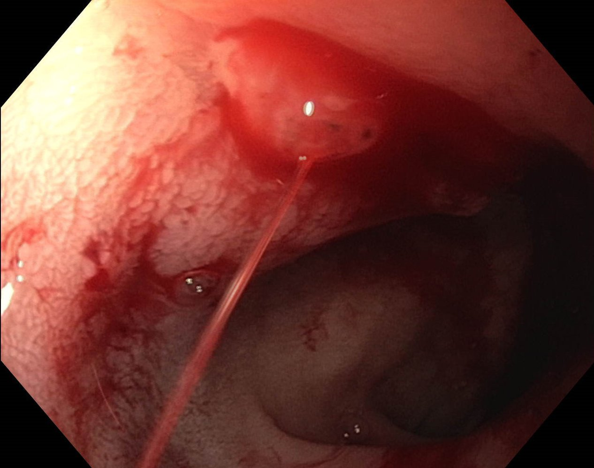

Duodenal ulcer: Forrest stage Ia

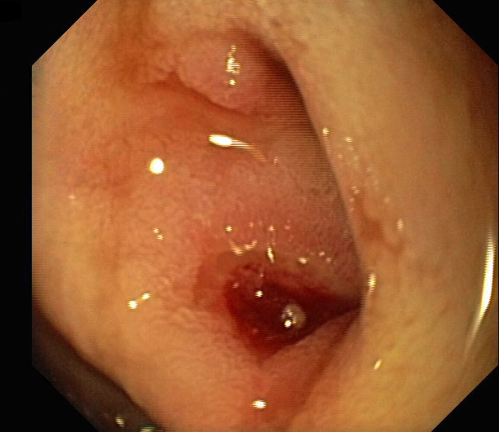

Duodenal ulcer: Forrest stage IIa

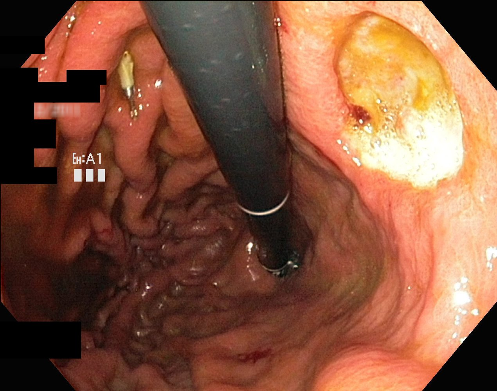

Gastric ulcer: Forrest stage IIc

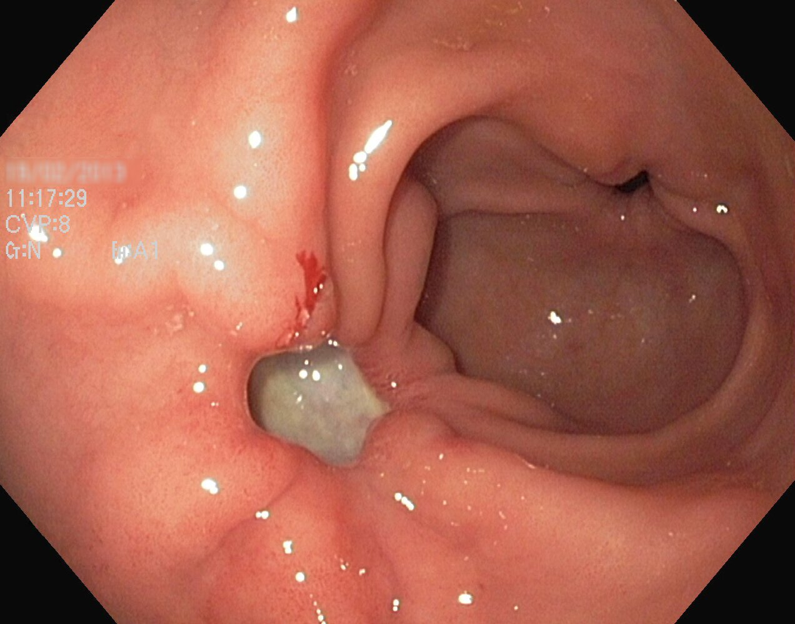

Gastric ulcer: Forrest stage III

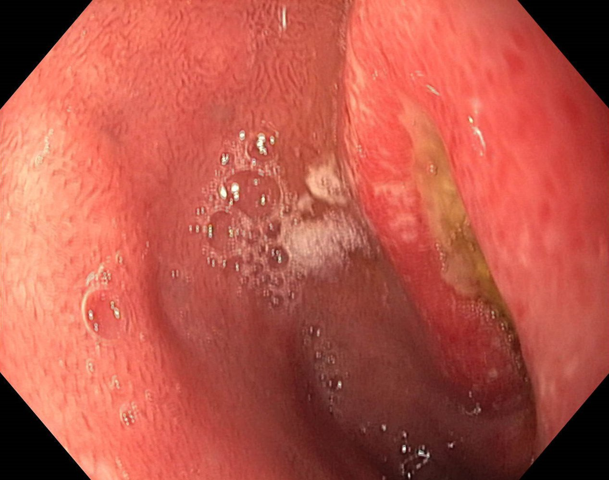

Duodenal ulcer: Forrest stage III

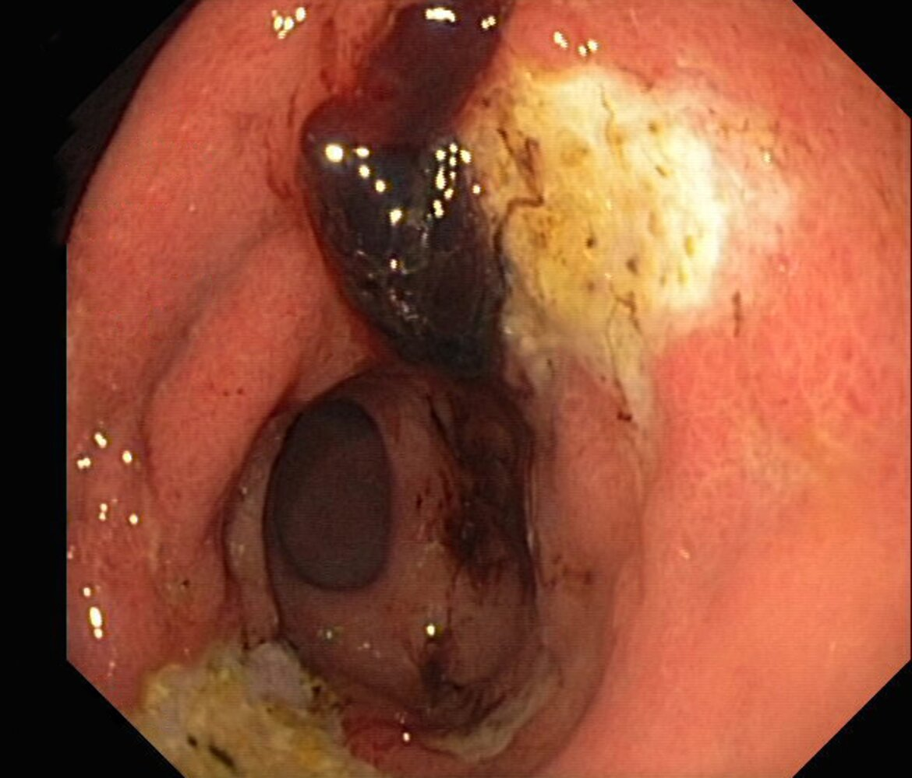

Duodenal ulcer: Forrest stage IIb

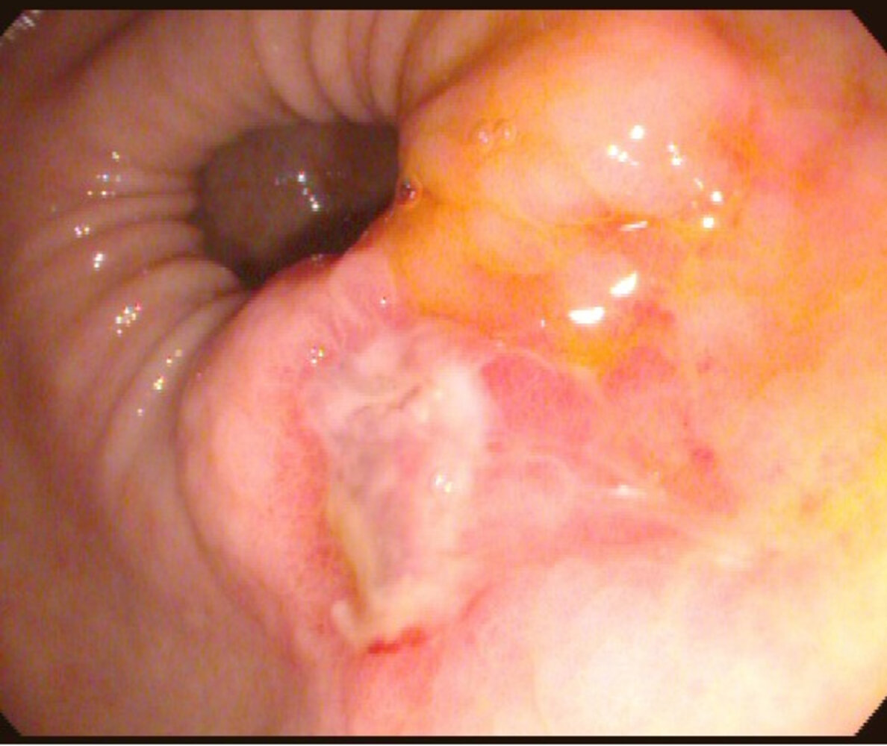

Gastric ulcer

#### Indications for <u>biopsy</u>

* <u>Gastric ulcers</u> [[20]](https://coursology-qbank.com/amboss/article/EK08RS)

* <u>Biopsies</u> are recommended in most cases.

* Multiple <u>biopsies</u> are recommended.

* From the edge and base of the <u>ulcer</u> (essential to rule out <u>malignancy</u>, which is not uncommon in <u>gastric ulcers</u>)

* Multiple <u>biopsies</u> from different areas of the <u>stomach</u> lining, including those not surrounding the <u>ulcer</u> (to test for <u>H. pylori</u>)

* <u>Duodenal ulcers</u>

* Obtain <u>biopsies</u> from <u>ulcers</u> with endoscopic features that suggest <u>malignancy</u>.

* <u>Duodenal ulcers</u> are usually benign and do not require routine <u>biopsy</u>.

> [!WARNING]
> To rule out <u>gastric cancer</u>, patients with suspicious <u>gastric ulcers</u> should undergo follow-up <u>EGD</u> and <u>histology</u> until the <u>ulcer</u> has healed completely!

### Specialized <u>laboratory studies</u> [[1]](https://coursology-qbank.com/amboss/article/_uY5FI)

Consider testing for rare causes if the etiology remains unclear or the patient presents with recurrent <u>ulcers</u>.

* <u>Fasting</u> serum <u>gastrin</u> and <u>secretin stimulation test</u>

* Measure baseline serum <u>gastrin</u> level and repeat after administration of <u>secretin</u>.

* High levels in <u>gastrinoma</u> (<u>Zollinger-Ellison syndrome</u>)

* Serum intact <u>PTH</u> level

* Specific testing for systemic inflammatory diseases (e.g., <u>Behcet disease</u>, <u>Crohn disease</u>)

---

## Differential diagnoses

### <u>Differential diagnosis of gastric and duodenal ulcers</u>

| Differential diagnosis of gastric and duodenal ulcers |  |  |  |
| --- | --- | --- | --- |
|  |  | <u>Gastric ulcers</u> | <u>Duodenal ulcers</u> |
| Etiology | <u>H. pylori</u> infection |  * 25–50%   |  * 40–70%   |
| Other causes |  * Chronic <u>NSAID</u> use   |  * <u>Zollinger-Ellison syndrome</u> (<u>gastrinoma</u>)   |  |
| Pathophysiology | <u>H. pylori infection</u> |   * <u>H. pylori</u> secretes <u>urease</u> → alkalinization of acidic environment → survival of bacteria in gastric lumen  * Release of cytotoxins (e.g., cagA toxin) → disruption of the <u>mucosal</u> barrier and damage to underlying cells    |   * <u>H. pylori</u> inhibits <u>somatostatin</u> secretion → ↑ <u>gastrin</u> secretion → ↑ H+ secretion to the <u>duodenum</u>  * Inhibition of <u>duodenal</u> <u>HCO3-</u>secretion → acidification and insufficient neutralization of <u>duodenal</u> contents    |
| Other causes |  * <u>NSAIDs</u> (<u>NSAID-induced ulcer</u>): inhibit <u>COX-1</u> and <u>COX-2</u> → ↓ <u>prostaglandin</u> production → ↓ <u>mucosal</u> protection → <u>erosion</u> of the gastric <u>mucosa</u>   |   * Acid hypersecretion  * ↑ Acid secretion  * ↑ <u>Gastrin</u> production → ↑ H+ secretion and <u>parietal cell</u> mass →  delivery of excessive acid to the <u>duodenum</u>  * ↓ <u>Mucosal</u> protection    |  |
|   Clinical features  | General |  * See “<u>Clinical symptoms of gastric and duodenal ulcers</u>” above.   |  |
| <u>Pain</u> and eating |  * <u>Pain</u> increases shortly after eating → weight loss   |   * <u>Pain</u> is relieved with food intake → weight gain  * <u>Pain</u> increases 2–5 hours after eating. [[17]](https://coursology-qbank.com/amboss/article/iNXJaA)    |  |
|  Nocturnal <u>pain</u> [[18]](https://coursology-qbank.com/amboss/article/C6XqM_) |  * Less common   |  * More common   |  |
| Diagnostics | General |   * Screening for common etiologies on <u>medical history</u>  * <u>Esophagogastroduodenoscopy</u> (most accurate test)  * Visualization of the lesions  * <u>Biopsy</u> sampling  * See “<u>Diagnostic approach for suspected PUD</u>” above.    |  |
| <u>Biopsy</u> |  * Multiple <u>biopsies</u> are recommended in most cases and should be taken:  * From the edge and base of the <u>ulcer</u>  * From different areas of the <u>stomach</u> lining, including those not surrounding the <u>ulcer</u> (to test for <u>H. pylori</u>)   |  * Usually not required; obtain <u>biopsies</u> from <u>ulcers</u> with endoscopic features that suggest <u>malignancy</u>.   |  |
| <u>Carcinoma</u> risk |  |  * Increased   |  * <u>Ulcers</u> are usually benign.   |

### Differential diagnoses based on clinical presentation

For differential diagnoses based on the initial clinical presentation, see:

* “<u>Differential diagnoses of acute abdominal pain</u>”

* “<u>Differential diagnoses of dyspepsia</u>”

* “<u>Differential diagnoses of nausea and vomiting</u>”

* “<u>Differential diagnoses of upper GI bleeding</u>”

* “<u>Differential diagnoses of chest pain</u>”

The differential diagnoses listed here are not exhaustive.

---

## Treatment

### Approach [[23]](https://coursology-qbank.com/amboss/article/MuYM7I)

* General measures

* Nonpharmacological measures: e.g., avoid <u>NSAIDs</u>, restrict <u>alcohol</u>.

* Follow-up to confirm treatment success; possibly endoscopic surveillance

* <u>H. pylori diagnostics</u>

* Positive

* <u>H. pylori eradication therapy</u> with <u>antibiotics</u> and a <u>PPI</u>

* Continue <u>acid suppression medication</u> (i.e., <u>PPIs</u>) for 4–8 weeks. [[22]](https://coursology-qbank.com/amboss/article/LOYwG6)

* Negative: Trial of <u>acid suppression medication</u> (i.e., <u>PPIs</u>) for 4–8 weeks, followed by reevaluation

* Failure of medical treatment : Consider elective <u>surgery</u>.

* Management of critical <u>complications of PUD</u>

* Acute stabilization: <u>airway management</u> for massive <u>hematemesis</u>, <u>immediate hemodynamic support</u> for <u>shock</u>

* <u>Initial management of overt GI bleeding</u>

* <u>Management of gastrointestinal perforation</u>

> [!WARNING]
> A <u>perforated peptic ulcer</u> is a surgical emergency.

> [!TIP]
> In patients with <u>hemorrhagic shock</u>, consider <u>ulcer penetration</u> into a major <u>artery</u> as the underlying cause. [[25]](https://coursology-qbank.com/amboss/article/Mm1MTh0)

### Disposition [[26]](https://coursology-qbank.com/amboss/article/35YSPp)[[27]](https://coursology-qbank.com/amboss/article/KnbU88)

* Outpatient management is usually appropriate for patients without complications.

* Obtain GI consult for patients with <u>alarm features of PUD</u>.

* Consider hospital admission for patients with: 

* <u>Complications of PUD</u>

* Insufficient <u>pain control</u>

* Need for further workup

* Consider <u>ICU</u> admission or direct transfer to the OR for: 

* <u>Hemodynamic instability</u>

* <u>Peritonitis</u> and/or <u>sepsis</u>

### Medical treatment of PUD

Pharmacologic therapies for uncomplicated PUD include a trial of <u>acid suppression therapy</u> and, if <u>H. pylori</u> is detected, eradication therapy. These may be complemented with <u>antacids</u> for rapid symptom relief, and in some cases with <u>cytoprotective agents</u> for <u>mucosal</u> protection. All patients should also be counseled on lifestyle and <u>risk factor</u> modification.

* <u>Acid suppression medications and antacids</u> are covered in detail in “<u>Treatment of dyspepsia</u>.”

* Recommended duration of acid suppression for PUD [[1]](https://coursology-qbank.com/amboss/article/_uY5FI)[[22]](https://coursology-qbank.com/amboss/article/LOYwG6)

* <u>Duodenal ulcers</u>: ≥ 4 weeks

* <u>Gastric ulcers</u>: ≥ 8 weeks

* Unknown location: Consider 8 weeks of empiric treatment.

* Select patients (e.g., those with <u>idiopathic</u> <u>ulcers</u>) may benefit from maintenance <u>acid suppression therapy</u> to prevent recurrence.

* Cytoprotective agents (gastrointestinal <u>mucosal</u> protection)

* Sucralfate DOSAGE : a <u>sucrose</u> sulfate-aluminum complex that reacts with <u>HCl</u> in an acidic environment to create a protective barrier over the gastric/<u>duodenal</u> <u>mucosa</u>

* Acts as an acid buffer and promotes HCO3 production

* Mostly used to promote <u>ulcer</u> healing in patients with <u>duodenal ulcers</u>

* Should not be taken simultaneously with a <u>PPI</u> or <u>H2 blocker</u>

* <u>Misoprostol</u> DOSAGE: Consider as an alternative to <u>PPIs</u> for <u>ulcer</u> prophylaxis in patients at high risk of developing <u>NSAID</u>-induced GI toxicity (e.g., older individuals, those with a history of complicated peptic <u>ulcer</u>).  [[10]](https://coursology-qbank.com/amboss/article/H51Klh0)[[28]](https://coursology-qbank.com/amboss/article/bK1HU30)[[29]](https://coursology-qbank.com/amboss/article/Zx1ZEQ0)

* <u>Antibiotics</u>: e.g., <u>optimized bismuth quadruple therapy</u> (<u>metronidazole</u>, <u>tetracycline</u>, <u>bismuth</u>, and a <u>PPI</u>). [[30]](https://coursology-qbank.com/amboss/article/i4dJQJ0) See “<u>H. pylori eradication therapy</u>” for other treatment regimens.

* Nonpharmacological measures  [[1]](https://coursology-qbank.com/amboss/article/_uY5FI)

* Restrict <u>alcohol</u>, smoking, and <u>caffeine</u>, and avoid <u>stress</u>.

* Avoid medications that may cause or worsen PUD (e.g., discontinue <u>NSAIDs</u>, reduce or stop <u>corticosteroids</u> if possible).

* Avoid eating before bedtime.

### Elective surgical treatment [[31]](https://coursology-qbank.com/amboss/article/lAYvP7)

Surgical management of uncomplicated peptic <u>ulcers</u> is rarely necessary because they usually respond well to medical treatment. When <u>malignancy</u> is confirmed or complications such as <u>massive bleeding</u> or <u>gastrointestinal perforation</u> occur, <u>surgery</u> specific to these complications must be performed.

* Indications (consider after thorough evaluation)

* Refractory symptoms or recurrence of disease despite appropriate medical treatment

* Diseases that require the continuation of <u>NSAIDs</u>

* Inability to tolerate medical treatment

* Surgical procedures

* Vagotomy: surgical division of the <u>anterior</u> and <u>posterior vagal trunk</u> of the <u>vagus nerve</u> (truncal <u>vagotomy</u>), both located along the lower <u>esophagus</u>. <u>Denervation</u> through truncal <u>vagotomy</u> results in ∼ 70% reduction of acid production. 

* Complications include <u>delayed gastric emptying</u>, postvagotomy <u>diarrhea</u> , postvagotomy <u>hypergastrinemia</u>, and <u>dumping syndrome</u>.

* To improve results, truncal <u>vagotomy</u> is combined with one of the following drainage procedures:

* <u>Pyloroplasty</u>

* Antrectomy

* <u>Subtotal gastrectomy</u>

* <u>Partial gastrectomy</u> (Billroth) and reconstruction

* Billroth I: <u>distal</u> <u>gastrectomy</u> with end-to-end or side-to-end gastroduodenostomy

* Billroth II: resection of the <u>distal</u> two-thirds of the <u>stomach</u> with a blind-ending <u>duodenal</u> stump and end-to-side <u>gastrojejunostomy</u>

* Total <u>gastrectomy</u> and reconstruction: <u>Roux-en-Y</u>

> [!TIP]
> The <u>anterior</u> and <u>posterior</u> branches of the <u>vagus nerve</u> (<u>CN X</u>) are also known as nerves of Latarjet, which divide into terminal branches that innervate the <u>stomach</u> and the <u>pylorus</u>. The terminal branches on the antropyloric area are sometimes referred to as “crow's foot.”

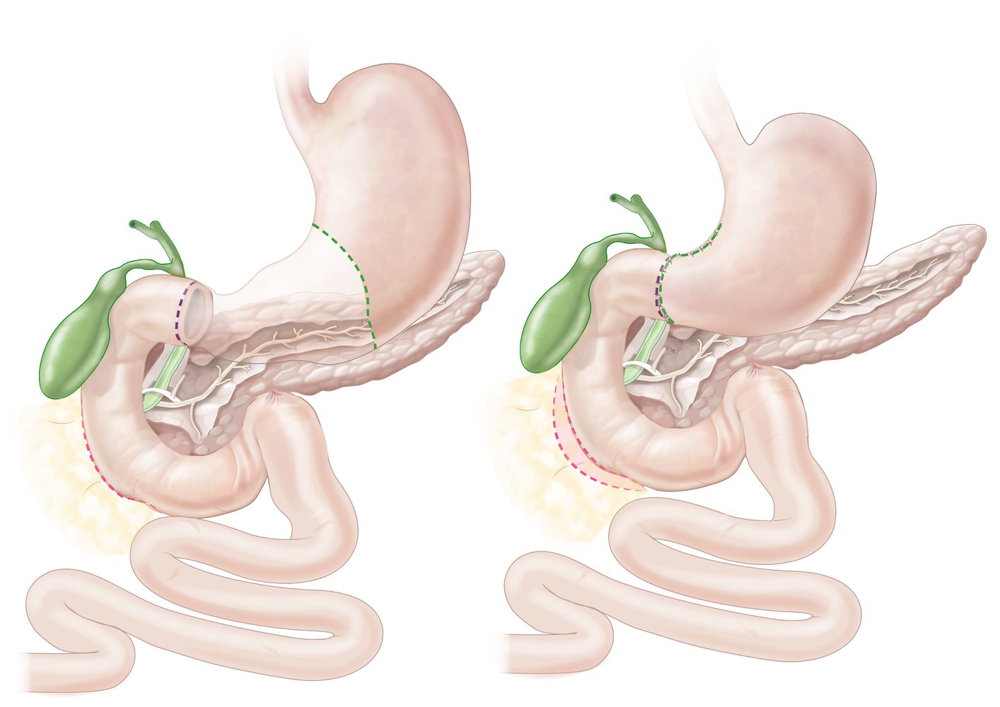

Partial gastrectomy (Billroth I procedure)

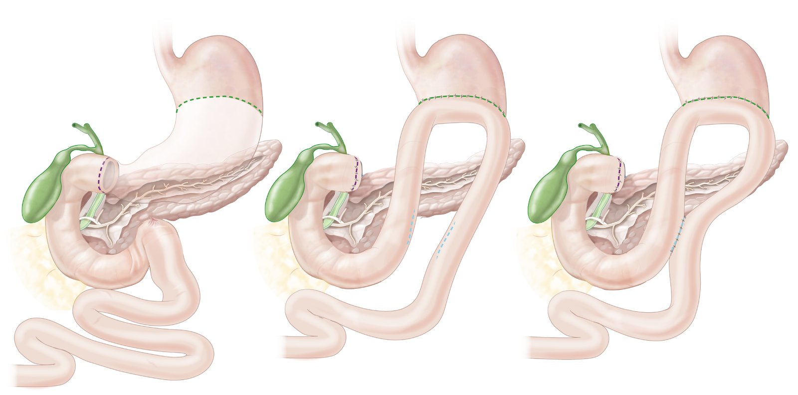

Partial gastrectomy (Billroth II)

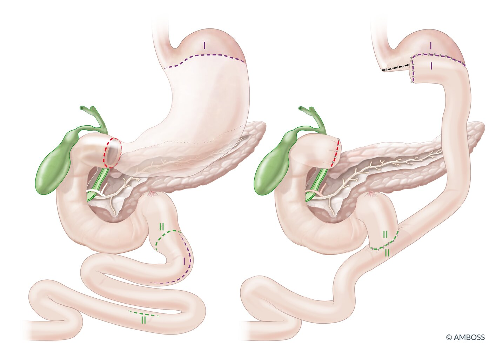

Subtotal gastrectomy (with Roux-en-Y anastomosis)

---

## Follow-up

### Endoscopic follow-up [[20]](https://coursology-qbank.com/amboss/article/EK08RS)

* Indications

* <u>Gastric ulcer</u> in patients with ≥ 1 of the following :

* Refractory symptoms

* <u>Ulcer</u> of unknown etiology

* <u>Ulcer</u> that appears malignant in initial <u>EGD</u> (even if <u>biopsies</u> are negative)

* No <u>biopsies</u> taken in initial <u>EGD</u> (e.g., due to active bleeding)

* <u>Ulcer</u> diagnosed via radiological imaging

* <u>Duodenal ulcer</u>: if symptoms persist after an appropriate course of antisecretory treatment

* <u>Bleeding peptic ulcer</u> requiring initial emergency endoscopy: endoscopic control on the following day

* <u>Dysplasia</u>: endoscopy every 6–12 months depending on the degree of <u>dysplasia</u>

* Refractory <u>ulcer</u>: Consider repeated <u>EGD</u> until the <u>ulcer</u> heals or etiology is identified.

* New onset of symptoms after successful <u>H. pylori eradication</u>

* Surveillance method: Repeat endoscopy and obtain new <u>biopsies</u>.

> [!TIP]
> Perform <u>H. pylori eradication confirmation</u> ≥ 4 weeks after completion of <u>H. pylori eradication therapy</u>. [[19]](https://coursology-qbank.com/amboss/article/uK0pRS)

---

## Complications

### Bleeding peptic ulcer

#### Overview

* The most common complication of PUD

* Can be a chronic, slow bleed or an overt, rapid, life-threatening hemorrhage

#### Etiology

* <u>Posterior</u> <u>duodenal ulcers</u> are more likely to bleed than <u>anterior</u> <u>duodenal ulcers</u>.

* <u>Gastric ulcers</u> of the <u>lesser curvature</u> may cause bleeding from the <u>left gastric artery</u>.

* <u>Duodenal ulcers</u> of the <u>posterior</u> wall may cause bleeding from the <u>gastroduodenal artery</u>.

#### Clinical features

* <u>Hematemesis</u> (coffee-grounds emesis)

* <u>Melena</u>

* <u>Clinical features of anemia</u>

* <u>Hematochezia</u> (less common; only seen in <u>massive bleeding</u>)

* <u>Orthostatic hypotension</u>

#### Diagnostics

* Consult gastroenterology for <u>EGD</u>.

* Management strategy is determined by endoscopic risk <u>stratification</u>, e.g., <u>Forrest classification</u>.

* See “<u>Diagnostic approach to overt GI bleeding</u>.”

|  Forrest classification of bleeding peptic ulcers [[32]](https://coursology-qbank.com/amboss/article/cuYaJI)  |  |  |  |
| --- | --- | --- | --- |
|  Stage  |  | Stigmata on <u>upper endoscopy</u> |  |
|  Active hemorrhage (Stage I)  |  Ia  | Active spurting   | High-risk stigmata |
|  Ib  | Active oozing |  |  |
|  Evidence of a recent hemorrhage (Stage II)  |  IIa  | Nonbleeding <u>ulcer</u> with a visible vessel |  |
|  IIb  |  <u>Ulcer</u> with an adherent clot | Unclear risk |  |
|  IIc  | Flat pigmented spot (covered with <u>hematin</u>) | Low-risk stigmata |  |
|  Clean-based <u>ulcer</u> (Stage III)  |  III  |  Clean <u>ulcer</u> base (no active hemorrhage)   |  |

Forrest Classification (risk of rebleeding post-endoscopy for UGIB)

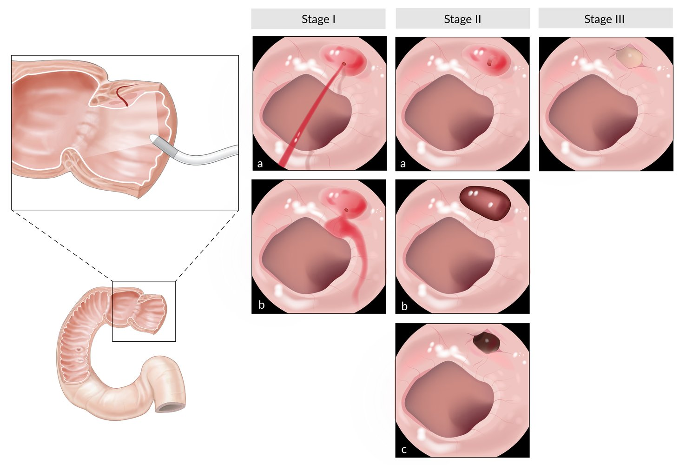

Forrest classification of upper gastrointestinal hemorrhages

Duodenal ulcer: Forrest stage Ia

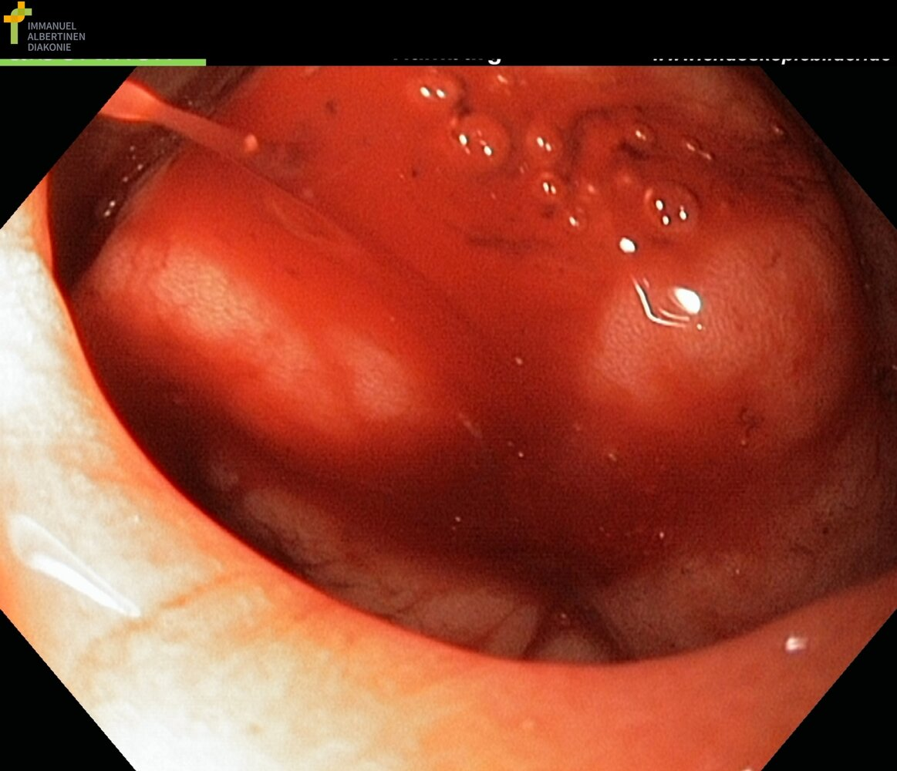

Duodenal ulcer: Forrest stage Ib

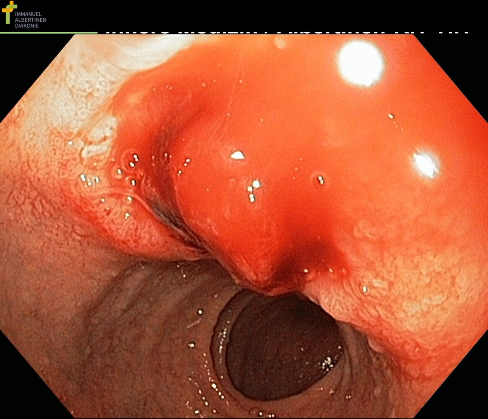

Gastric ulcer: Forrest stage Ib

Duodenal ulcer: Forrest stage IIa

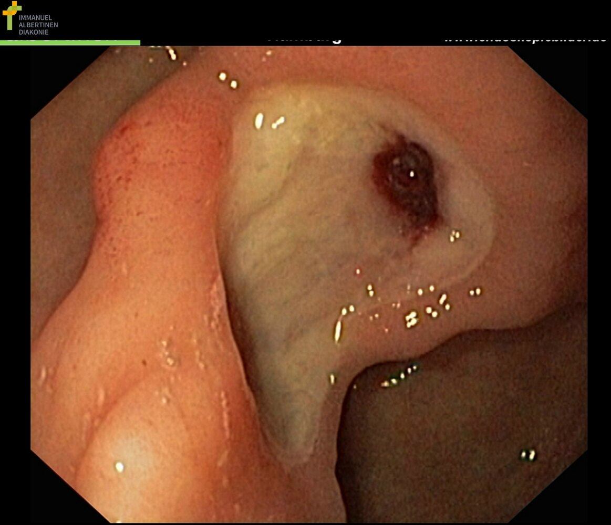

Gastric ulcer: Forrest stage IIa

Duodenal ulcer: Forrest stage IIb

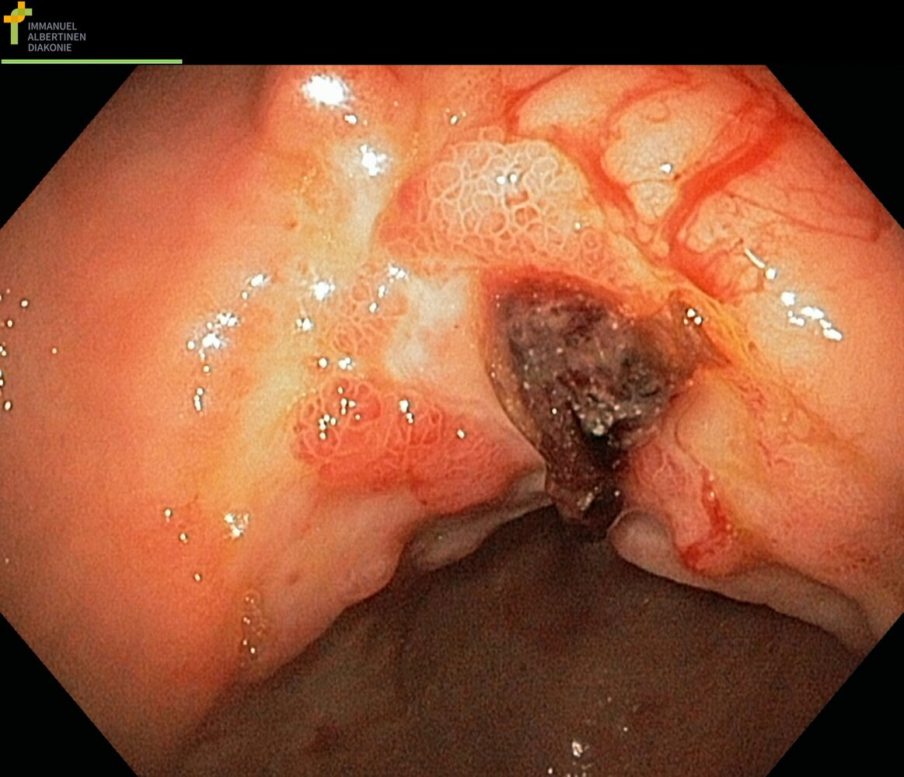

Gastric ulcer: Forrest stage IIb

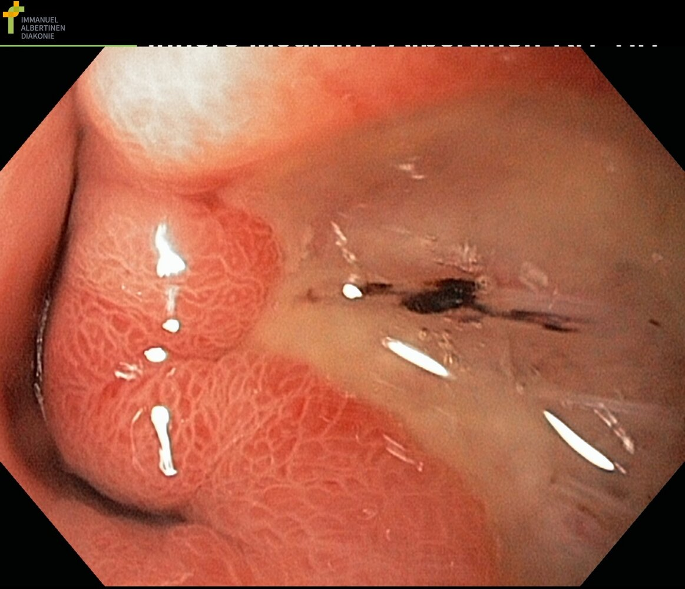

Duodenal ulcer: Forrest stage IIc

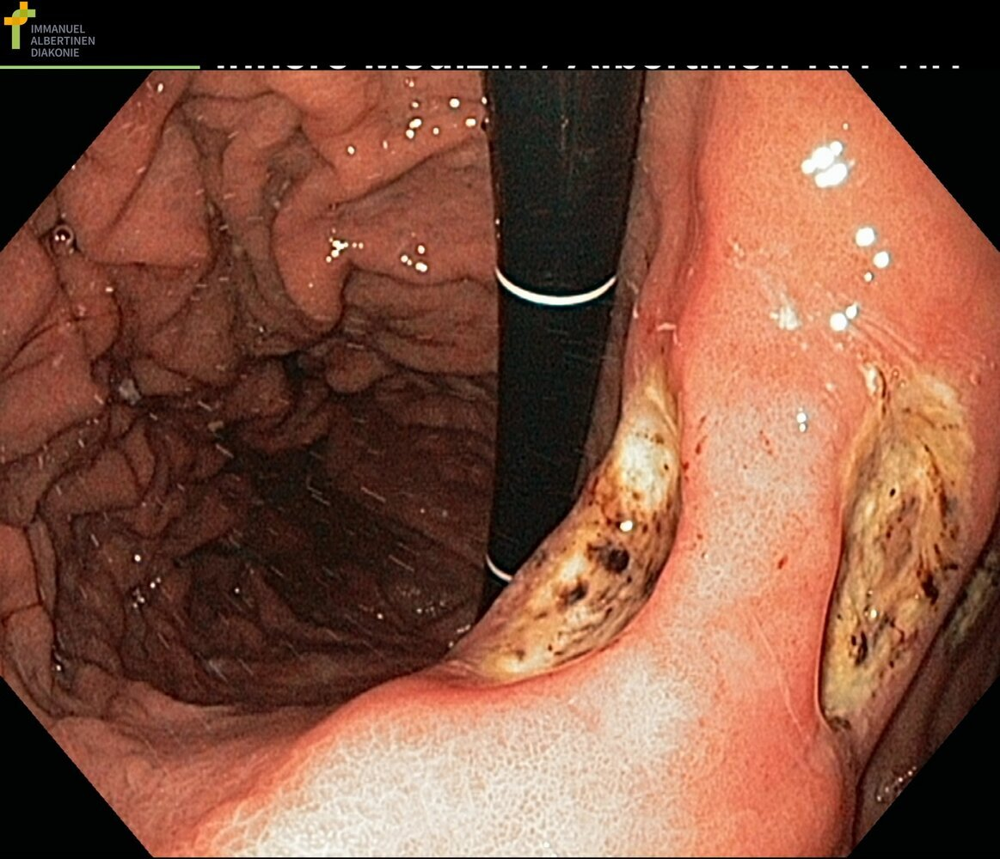

Gastric ulcer: Forrest stage IIc

Duodenal ulcer: Forrest stage III

Gastric ulcer: Forrest stage III

#### Management

* General measures [[33]](https://coursology-qbank.com/amboss/article/qNXCXA)

* <u>NPO</u>

* Volume resuscitation, <u>transfusion</u> as needed

* See “<u>Initial management of an overt GI bleed</u>” for details.

* <u>Ulcer</u> with high-risk stigmata [[34]](https://coursology-qbank.com/amboss/article/6Z1jc20)

* <u>Endoscopic hemostasis</u> is indicated.

* Thermocoagulation, sclerosant injection, clips

* <u>Epinephrine</u> injection hemostatic power spray can be used in combination with other methods.

* Requires inpatient care

* After after index endoscopy

* Start 3 days of high-dose <u>PPI</u>, e.g., <u>esomeprazole</u> DOSAGE.  [[34]](https://coursology-qbank.com/amboss/article/6Z1jc20)

* Continue <u>PPI</u> treatment on days 4–14, e.g., <u>esomeprazole</u> (<u>off-label</u>) DOSAGE. [[34]](https://coursology-qbank.com/amboss/article/6Z1jc20)

* <u>Ulcer</u> with unclear risk: Controversial; <u>PPI</u> therapy alone or <u>endoscopic hemostasis</u> may be considered.  [[34]](https://coursology-qbank.com/amboss/article/6Z1jc20)[[35]](https://coursology-qbank.com/amboss/article/OybI2w)[[36]](https://coursology-qbank.com/amboss/article/tybXSw)

* <u>Ulcer</u> with low-risk stigmata

* <u>Endoscopic hemostasis</u> is not recommended.

* Can usually be managed as outpatients with <u>PPI</u> therapy

### Peptic ulcer perforation

See also “<u>Secondary peritonitis</u>” and “<u>Gastrointestinal perforation</u>."

* Definition: full-thickness injury and loss of bowel wall integrity that results in leakage of gastrointestinal contents

* The second most common complication of PUD

* PUD is the most common cause of <u>GI perforation</u>.

* Etiology

* Prepyloric <u>gastric ulcers</u> are the most common cause of perforation.

* <u>Duodenal ulcers</u> of the <u>anterior</u> wall are more likely to perforate than <u>ulcers</u> of the <u>posterior</u> wall.

* Clinical features

* Sudden, <u>diffuse abdominal pain</u> and rigidity

* <u>Fever</u>, <u>tachycardia</u>, <u>tachypnea</u>, <u>hypotension</u>

* <u>Pneumoperitoneum</u>

* Shoulder <u>pain</u> (irritation of the <u>phrenic nerve</u>)

* Treatment [[33]](https://coursology-qbank.com/amboss/article/qNXCXA)

* <u>NPO</u>, volume resuscitation, <u>supportive care</u>

* Graham patch: surgical repair of a small, (generally < 5 mm) perforated <u>duodenal ulcer</u> using a piece of <u>omentum</u> to close the perforation

* See “Treatment” in “<u>Gastrointestinal perforation</u>” for more details.

> [!NOTE]
> Posterior <u>ulcers</u> are more likely to bleed and anterior <u>ulcers</u> are more likely to perforate: Postal workers wear Blue collars and should not have an Antisocial Personality.

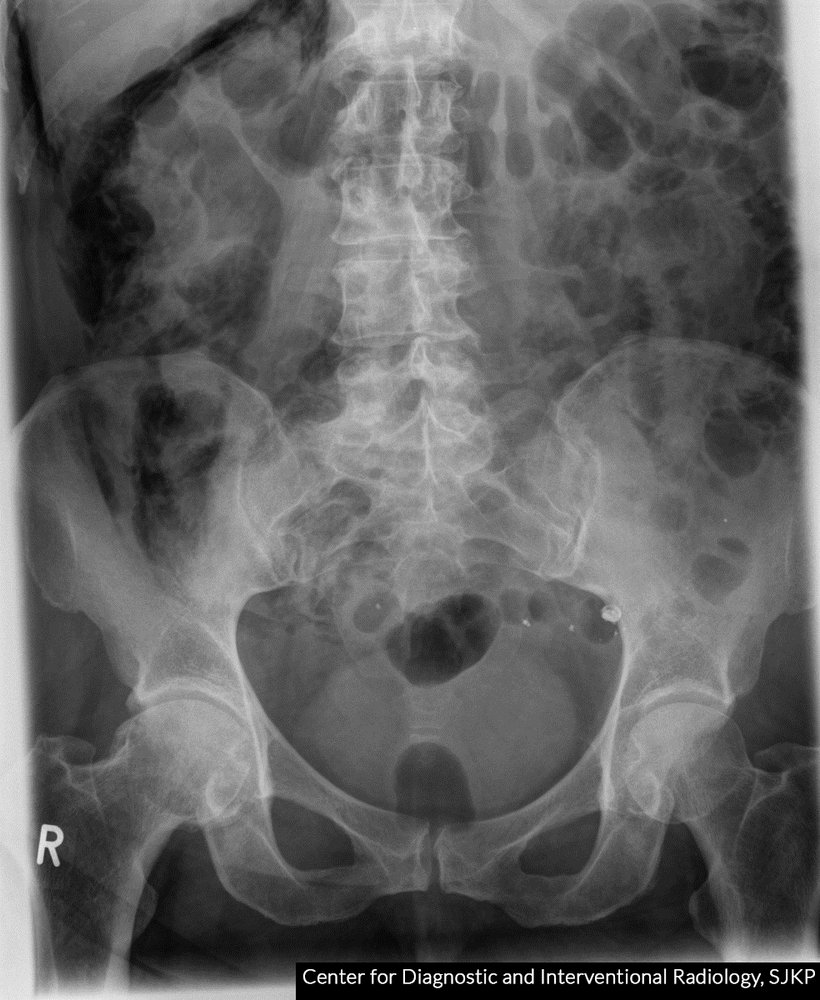

Pneumoretroperitoneum and pneumoperitoneum

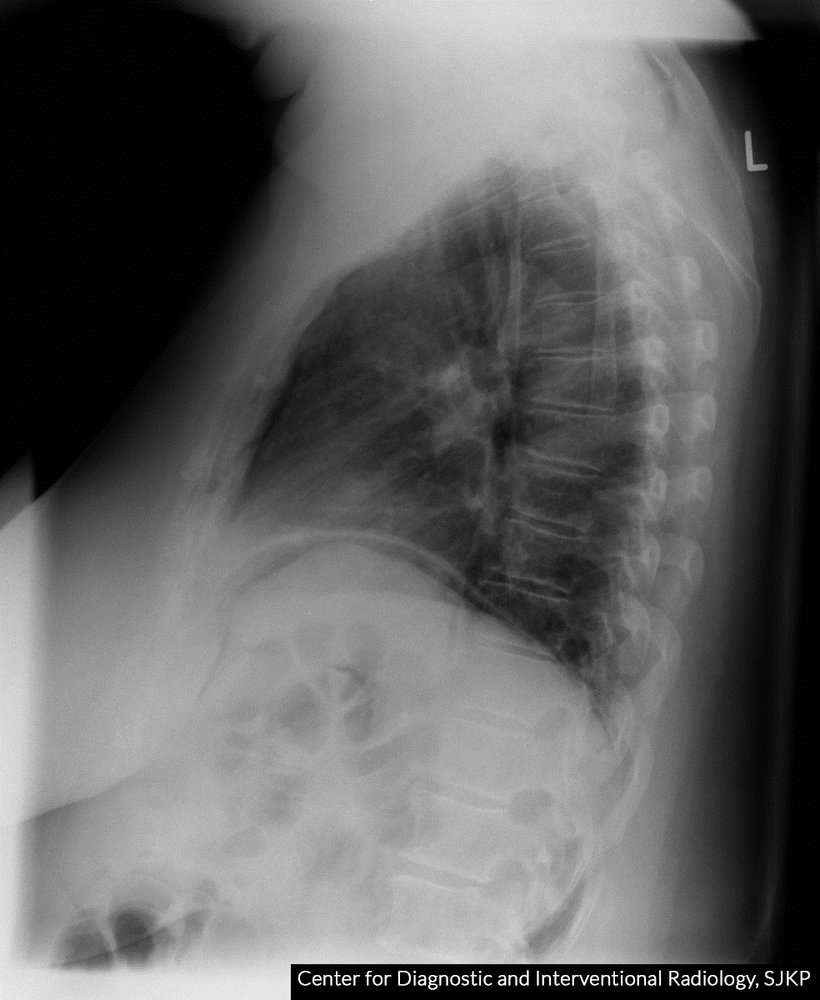

Pneumoperitoneum

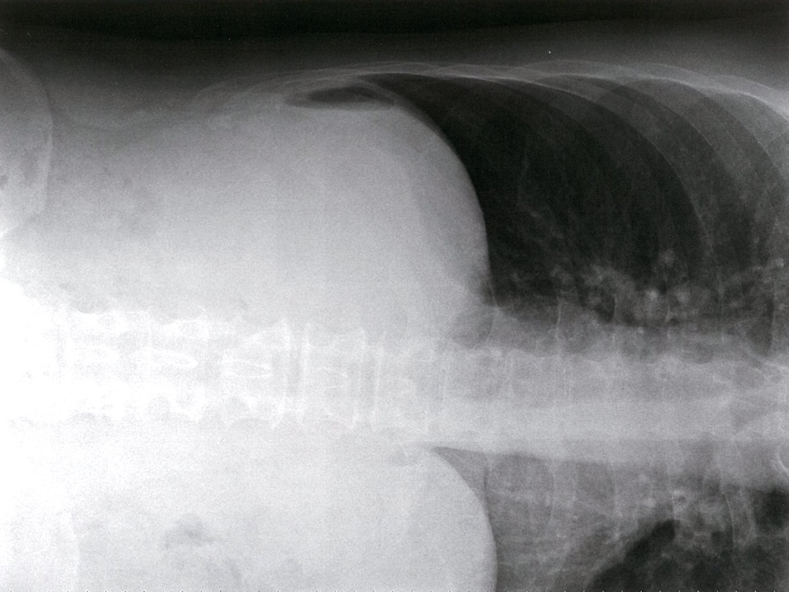

Free intraperitoneal air

### Ulcer penetration and <u>fistula</u> formation

* Definition: Penetration of a peptic <u>ulcer</u> through the gastric/<u>duodenal</u> wall into adjacent organs (e.g., <u>pancreas</u>, biliary tree, <u>colon</u>) without leaking of gastric contents into the <u>peritoneal cavity</u>

* Etiology: <u>Duodenal ulcers</u> are the most common cause of penetration.

* Clinical features: a change in clinical symptoms that are related to the affected neighboring organs

* <u>Colon</u>: Gastrocolic or duodenocolic <u>fistulas</u> may manifest with <u>copremesis</u> and <u>postprandial</u> <u>diarrhea</u>.

* <u>Liver</u>, <u>spleen</u>, or <u>diaphragm</u>: Penetration may result in <u>visceral</u> <u>abscesses</u> (<u>fever</u>, abdominal tenderness, and <u>sepsis</u>).

* <u>Gastroduodenal artery</u> or aorta: Vascular <u>fistulas</u> may result in severe hemorrhage.

* Biliary tree: <u>Choledochoduodenal fistulas</u> may manifest with <u>biliary tract obstruction</u> (<u>fever</u>, <u>jaundice</u>, <u>RUQ</u> <u>pain</u>).

* <u>Pancreas</u>: increased epigastric <u>pain</u> and <u>peritonitis</u>

* Treatment

* <u>Conservative management</u>: indicated in all patients, as most <u>fistulas</u> close spontaneously

* Surgical resection: in patients unresponsive to <u>conservative management</u>

### <u>Gastric outlet obstruction</u> (GOO)

* GOO is more commonly due to <u>malignancy</u> (e.g., <u>pancreatic cancer</u>, <u>gastric cancer</u>) in regions where the <u>treatment of PUD</u> and H. Pylori is prevalent.

* Pathophysiology

* Acute PUD → inflammation and <u>edema</u>

* Chronic PUD → scarring and <u>fibrosis</u>

### Malignant transformation

* <u>Gastric ulcers</u> [[20]](https://coursology-qbank.com/amboss/article/EK08RS)

* High malignant potential (progression to cancer in 5–10% of cases)

* <u>Malignancy</u> should be ruled out with <u>biopsy</u>.

* <u>Duodenal ulcers</u>

* Usually benign

* Routine <u>biopsy</u> is not required.

We list the most important complications. The selection is not exhaustive.

---

## Subtypes and variants

### Stress ulcers

<u>Stress ulcers</u> are <u>ulcers</u> associated with <u>erosive gastritis</u>, i.e., acute damage to the gastric <u>mucosa</u> resulting from increased levels of <u>endogenous</u> <u>glucocorticoids</u> and decreased blood flow to the <u>stomach</u>.

#### Etiology [[37]](https://coursology-qbank.com/amboss/article/iK1JT30)

* Critical illness, such as:

* <u>Respiratory failure</u> requiring ventilation for > 48 hours

* <u>SIRS</u>

* <u>Renal failure</u>

* Hepatic failure

* Severe head or <u>spinal cord injury</u>

* <u>Burns</u> affecting a surface area > 35% of the body surface area.

* Major <u>surgery</u>

#### Types

* Curling ulcer: severe <u>burns</u> → decreased plasma volume → decreased gastric blood flow → <u>hypoxic</u> tissue injury of <u>stomach</u> surface <u>epithelium</u> → weakening of the normal <u>mucosal</u> barrier

* Cushing ulcer: <u>brain</u> injury → increased <u>vagal</u> stimulation → increased production of <u>stomach acid</u> via <u>acetylcholine</u> release

> [!NOTE]
> Imagine a hot curling <u>iron</u> to remember that Curling <u>ulcers</u> occur in patients with severe <u>burns</u>.

> [!NOTE]
> Imagine a <u>brain</u> resting on a cushion to remember that patients with <u>brain injury</u> can develop Cushing <u>ulcers</u>.

#### Management [[38]](https://coursology-qbank.com/amboss/article/QaYu4n)[[39]](https://coursology-qbank.com/amboss/article/OcbIcs)[[40]](https://coursology-qbank.com/amboss/article/Ncb-cs)[[41]](https://coursology-qbank.com/amboss/article/WFbPSv)

#### Indications

Stress ulcer prophylaxis should be considered in any critically ill patient with a risk of <u>GI bleeding</u>. Prophylaxis was formerly recommended for all <u>ICU</u> patients, but evidence suggests that risks (e.g., for <u>pneumonia</u>) outweigh the benefits in patients with low bleeding risk.

|  Indications for stress ulcer prophylaxis in critically ill patients [[41]](https://coursology-qbank.com/amboss/article/WFbPSv)  |  |
| --- | --- |
| <u>GI bleeding</u> risk | Indications |
| High |  * Any of the following:  * <u>Mechanical ventilation</u> without <u>enteral nutrition</u>  * <u>Chronic liver disease</u>  * Concerning <u>coagulopathy</u>   |
| Moderate |  * ≥ 2 of the following:  * <u>Mechanical ventilation</u> with <u>enteral nutrition</u>  * <u>Acute kidney injury</u>  * <u>Sepsis</u>  * <u>Shock</u> (e.g., due to extensive <u>burns</u>, <u>multiorgan failure</u>, or severe trauma)   |
| Low |   * Prophylaxis is not routinely indicated.  * Consider for any of the following :  * Critically ill patients with conditions not considered high or moderate risk for <u>GI bleeding</u> (e.g., <u>traumatic brain injury</u>, major <u>surgery</u>, <u>acidosis</u>)  * Acute <u>liver</u> disease  * <u>Steroid</u> use or <u>immunosuppression</u>  * <u>Anticoagulant</u> use  * Cancer  * Male sex    |

##### Prophylactic agents  [[41]](https://coursology-qbank.com/amboss/article/WFbPSv)

* <u>PPIs</u> (preferred for patients with moderate-to-high <u>risk factors</u>): e.g., <u>pantoprazole</u> DOSAGE

* <u>H2receptor blockers</u> (may be used as an alternative): e.g., <u>famotidine</u> DOSAGE

* Continue <u>stress ulcer prophylaxis</u> for as long as significant <u>risk factors</u> are present or until critical illness resolves. [[42]](https://coursology-qbank.com/amboss/article/1Ba2-5)

> [!WARNING]
> Both <u>PPIs</u> and <u>H2 receptor antagonists</u> may increase the risk of <u>pneumonia</u> in critically ill patients. [[41]](https://coursology-qbank.com/amboss/article/WFbPSv)

> [!TIP]
> <u>Stress ulcer prophylaxis</u> likely has little effect on mortality, length of admission, length of stay in critical care units, and duration of <u>mechanical ventilation</u>. [[41]](https://coursology-qbank.com/amboss/article/WFbPSv)

### NSAID-induced ulcers [[10]](https://coursology-qbank.com/amboss/article/H51Klh0)[[43]](https://coursology-qbank.com/amboss/article/sAbtOw)

* <u>NSAIDs</u> are widely used for their antiinflammatory, <u>analgesic</u>, and antiplatelet properties.

* <u>NSAIDs</u> act by inhibiting <u>cyclooxygenase</u>, an enzyme required for the synthesis of <u>prostaglandins</u> that protect the gastric <u>mucosal</u> barrier.

* Chronic use of <u>NSAIDs</u>  can result in gastrointestinal toxicity, including peptic <u>ulcer</u> disease and its complications (e.g., <u>GI hemorrhage</u>, perforation).

#### Risk factors for NSAID-induced GI toxicity [[10]](https://coursology-qbank.com/amboss/article/H51Klh0)[[44]](https://coursology-qbank.com/amboss/article/XJ19s30)

* Age > 60 years  [[45]](https://coursology-qbank.com/amboss/article/UJ1bt30)[[46]](https://coursology-qbank.com/amboss/article/zH1rGR0)

* Concurrent <u>H. pylori infection</u>

* Concurrent use of <u>antithrombotics</u>, <u>corticosteroids</u>, <u>aspirin</u> (including low-dose), or <u>SSRIs</u>

* Higher doses or use of higher-risk <u>NSAIDs</u>  [[10]](https://coursology-qbank.com/amboss/article/H51Klh0)

* Prior peptic <u>ulcer</u> disease

* <u>Dyspepsia</u> [[47]](https://coursology-qbank.com/amboss/article/-H1DGR0)

* Comorbidities  [[47]](https://coursology-qbank.com/amboss/article/-H1DGR0)

#### Prevention of NSAID-induced GI toxicity [[10]](https://coursology-qbank.com/amboss/article/H51Klh0)[[44]](https://coursology-qbank.com/amboss/article/XJ19s30)

* Consider switching <u>NSAID</u> to an alternative agent (e.g., an <u>oral analgesic</u>), if appropriate.

* Modify <u>risk factors for NSAID-induced GI toxicity</u> where possible, e.g.:

* Decrease <u>NSAID</u> dose to the lowest effective dose.

* In patients requiring long-term <u>NSAID</u> therapy consider <u>testing for H. pylori</u>, followed by <u>H. pylori eradication</u> if positive.  [[10]](https://coursology-qbank.com/amboss/article/H51Klh0)[[44]](https://coursology-qbank.com/amboss/article/XJ19s30)[[45]](https://coursology-qbank.com/amboss/article/UJ1bt30)[[47]](https://coursology-qbank.com/amboss/article/-H1DGR0)

* Select an <u>NSAID</u> based on the patient's <u>ASCVD risk</u>.  [[10]](https://coursology-qbank.com/amboss/article/H51Klh0)[[44]](https://coursology-qbank.com/amboss/article/XJ19s30)

* <u>Celecoxib</u> is preferred in patients with low cardiovascular risk.

* <u>Naproxen</u> is preferred in patients with high cardiovascular risk.

* Determine the need for gastric <u>mucosal</u> protection based on the presence of <u>risk factors for NSAID-induced GI toxicity</u>.

* In general, <u>PPIs</u> are preferred; ; see “<u>PPIs</u>” in “<u>Acid suppression medications</u>” for dosages.

* <u>Misoprostol</u> DOSAGE can be given as an alternative, but its use is limited because of associated adverse effects (especially at higher doses). [[10]](https://coursology-qbank.com/amboss/article/H51Klh0)[[28]](https://coursology-qbank.com/amboss/article/bK1HU30)[[29]](https://coursology-qbank.com/amboss/article/Zx1ZEQ0)

* Reassess indications for gastric <u>mucosal</u> protection periodically; discontinue when no longer indicated. [[46]](https://coursology-qbank.com/amboss/article/zH1rGR0)[[48]](https://coursology-qbank.com/amboss/article/oRX0LB)

|  Risk-based strategies to <u>prevent NSAID-induced GI toxicity</u> [[10]](https://coursology-qbank.com/amboss/article/H51Klh0)[[44]](https://coursology-qbank.com/amboss/article/XJ19s30)[[45]](https://coursology-qbank.com/amboss/article/UJ1bt30)  |  |  |
| --- | --- | --- |
| Risk of GI toxicity |  Criteria [[10]](https://coursology-qbank.com/amboss/article/H51Klh0)  |  Management [[10]](https://coursology-qbank.com/amboss/article/H51Klh0)[[44]](https://coursology-qbank.com/amboss/article/XJ19s30)[[45]](https://coursology-qbank.com/amboss/article/UJ1bt30)  |
|  High risk [[48]](https://coursology-qbank.com/amboss/article/oRX0LB)  |   * History of a complicated <u>ulcer</u> (e.g., prior <u>GI bleeding</u>)  * OR > 2 <u>risk factors for NSAID-induced GI toxicity</u>  * OR concurrent use of <u>antithrombotics</u>, <u>corticosteroids</u>, or <u>aspirin</u>    |   * Avoid <u>NSAIDs</u> if possible.  * If <u>NSAIDs</u> cannot be avoided: Select an <u>NSAID</u> based on cardiovascular risk (and add a <u>PPI</u>).  * Low cardiovascular risk: Use <u>celecoxib</u> and add a <u>PPI</u>  * High cardiovascular risk: Consider <u>naproxen</u> or low-dose <u>celecoxib</u>; add a <u>PPI</u>.  [[21]](https://coursology-qbank.com/amboss/article/TBa6ZM)[[44]](https://coursology-qbank.com/amboss/article/XJ19s30)[[49]](https://coursology-qbank.com/amboss/article/Bu1zti0)    |
| Moderate risk |  * 1–2 <u>risk factors for NSAID-induced GI toxicity</u>   |   * Low cardiovascular risk: Use <u>celecoxib</u> alone, OR add a <u>PPI</u> to <u>NSAID</u> therapy.  * High cardiovascular risk: Use <u>naproxen</u> and add a <u>PPI</u>.    |
| Low risk |  * No <u>risk factors for NSAID-induced GI toxicity</u>   |   * Low cardiovascular risk: No modification to treatment is required.  * High cardiovascular risk: Use <u>naproxen</u> and add a <u>PPI</u>.    |

> [!WARNING]
> In patients with a recent, complicated <u>ulcer</u>, NSAIDS should be avoided or used with extreme caution. [[10]](https://coursology-qbank.com/amboss/article/H51Klh0)

> [!TIP]
> Always use the lowest possible effective dose of an <u>NSAID</u>. [[10]](https://coursology-qbank.com/amboss/article/H51Klh0)[[48]](https://coursology-qbank.com/amboss/article/oRX0LB)

> [!TIP]
> Generally, prescribe a <u>PPI</u> for patients on <u>low-dose aspirin</u> who have at least one other <u>risk factor</u> for <u>NSAID</u>-induced GI toxicity (e.g., currently taking another <u>NSAID</u> or antithrombotic). [[10]](https://coursology-qbank.com/amboss/article/H51Klh0)[[46]](https://coursology-qbank.com/amboss/article/zH1rGR0)

#### Management of <u>NSAID</u>-induced GI toxicity [[44]](https://coursology-qbank.com/amboss/article/XJ19s30)[[45]](https://coursology-qbank.com/amboss/article/UJ1bt30)[[46]](https://coursology-qbank.com/amboss/article/zH1rGR0)

* See “<u>Treatment of peptic ulcer disease</u>.”

* Patients with a <u>GI bleed</u> on <u>antithrombotics</u>: Consult specialists to decide when and how to withhold, adjust, or resume <u>antithrombotics</u>.

* For <u>secondary prevention</u>, see “<u>Prevention of NSAID-induced GI toxicity</u>.”

---