# Aortic dissection

*Categories: Clinical knowledge > Surgery > Cardiothoracic surgery > Aortic dissection*

[Original Article Link](https://coursology-qbank.com/amboss/article/M50Mkg)

---

## Summary

An aortic dissection is a tear in the inner layer of the aorta that leads to a progressively growing <u>hematoma</u> in the <u>intima</u>-media space. <u>Risk factors for aortic dissection</u> include age and <u>hypertension</u>. Patients typically present with sudden onset severe <u>pain</u> radiating into the chest, back, or abdomen. A <u>widened mediastinum</u> on <u>chest x-ray</u> is characteristic of the diagnosis. The diagnosis is usually confirmed with <u>CT angiogram</u> in stable patients and <u>transesophageal echocardiography</u> (<u>TEE</u>) in unstable patients. Treatment options range from <u>conservative measures</u> (e.g., blood pressure optimization) to <u>surgery</u> (aortic <u>stent</u> graft), depending on the localization and severity of the dissection. Complete occlusion of branching vessels and <u>aortic rupture</u> are common complications. Even with treatment, <u>mortality rates</u> associated with aortic dissection are high.

---

## Epidemiology

* <u>Incidence</u>

* Peak <u>incidence</u>: 60–80 years of age [[1]](https://coursology-qbank.com/amboss/article/HxXKBZ0)

* In patients with <u>connective tissue disease</u>: peak <u>incidence</u> 30–50 years of age [[2]](https://coursology-qbank.com/amboss/article/GxXBBZ0)

* Sex: <u>♂</u> > <u>♀</u> [[1]](https://coursology-qbank.com/amboss/article/HxXKBZ0)

* Localization [[3]](https://coursology-qbank.com/amboss/article/g30F3f)

* <u>Ascending aorta</u>: ∼ 65% of cases

* <u>Descending aorta</u>, <u>distal</u> to the <u>left subclavian artery</u>: 20% of cases

* <u>Aortic arch</u>: 10% of cases

* <u>Abdominal aorta</u>: 5% of cases

Epidemiological data refers to the US, unless otherwise specified.

---

## Etiology

* Acquired

* <u>Hypertension</u> (most common <u>risk factor</u>)

* Approx. 70% of patients with aortic dissection have <u>elevated blood pressure</u>, which can lead to propagation of the dissection and increases the risk of rupture.

* Exception: In patients < 40 years of age, less than 40% of cases are due to <u>hypertension</u>.

* Trauma; , e.g., deceleration injury in a <u>motor vehicle collision</u>, or <u>iatrogenic</u> injury during valve replacements or graft <u>surgery</u> (traumatic aortic dissection)

* <u>Vasculitis</u>;  with aortic involvement (e.g., <u>syphilis</u>, <u>Takayasu arteritis</u>)

* Use of <u>amphetamines</u> and <u>cocaine</u>

* Third-trimester <u>pregnancy</u> (or early <u>postpartum period</u>)

* <u>Atherosclerosis</u>

* Congenital

* <u>Connective tissue disease</u> (<u>Marfan syndrome</u>, <u>Ehlers-Danlos</u> syndrome)

* <u>Bicuspid aortic valve</u> (e.g., in <u>Turner syndrome</u>)

* <u>Coarctation of the aorta</u>

---

## Classification

There are two classifications of aortic dissection to help direct management. <u>Stanford classification</u> groups dissections by whether the ascending or <u>descending aorta</u> is involved. <u>DeBakey classification</u> categorizes dissections according to their origin and extent.

### Stanford classification [[4]](https://coursology-qbank.com/amboss/article/mM0V6g)

* Stanford type A aortic dissection: any dissection involving the <u>ascending aorta</u> (defined as <u>proximal</u> to the brachiocephalic <u>artery</u>), regardless of origin

* Can extend proximally to the <u>aortic valve</u> and distally to the <u>descending aorta</u>

* Generally requires <u>surgery</u>

* Complications include <u>aortic regurgitation</u> and <u>cardiac tamponade</u>.

* Stanford type B aortic dissection: any dissection not involving the <u>ascending aorta</u>

* <u>Descending aorta</u>; originating <u>distal</u> to the <u>left subclavian artery</u>

* Most cases can be managed with medical therapy (e.g., <u>beta blockers</u>, <u>vasodilators</u>).

> [!NOTE]
> <u>Stanford</u> A = Affects ascending aorta; <u>Stanford</u> B = Begins beyond brachiocephalic vessels

### DeBakey classification (rarely used) [[4]](https://coursology-qbank.com/amboss/article/mM0V6g)

* Type I

* Dissections originate in the <u>ascending aorta</u> and continue to at least the <u>aortic arch</u> but typically as far as the <u>descending aorta</u>.

* Generally requires <u>surgery</u>

* Type II

* Dissections originate in, and are restricted to, the <u>ascending aorta</u>.

* Generally requires <u>surgery</u>

* Type III

* Dissections originate in the <u>descending aorta</u> and most often extend distally.

* Most cases can be managed by medical therapy.

* Can be further subdivided into:

* Type IIIa: limited to the descending <u>thoracic aorta</u> above the level of the <u>diaphragm</u>

* Type IIIb: extends below the <u>diaphragm</u>

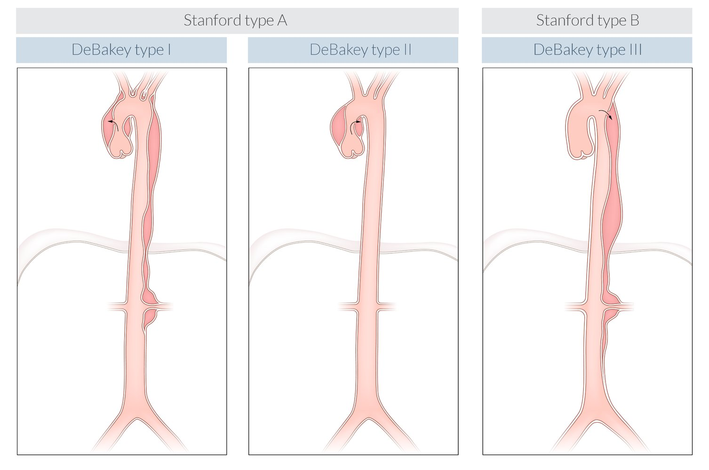

Classifications of aortic dissection

---

## Pathophysiology

* Common anatomic sites of origin 

* Above the aortic root

* <u>Aortic arch</u>

* <u>Distal</u> to <u>left subclavian artery</u>

* Transverse tear in the aortic <u>intima</u> (“entry”) → blood enters the media of the aorta and forms a false lumen in the <u>intima</u>-media space ; → <u>hematoma</u> forms and propagates longitudinally downwards [[5]](https://coursology-qbank.com/amboss/article/330SRf)

* Rising pressure within the aortic wall → rupture

* Occlusion of branching vessels;  (e.g., <u>coronary arteries</u>, <u>arteries</u> supplying the <u>brain</u>, <u>renal arteries</u>, <u>arteries</u> supplying the lower limbs) → <u>ischemia</u> in the affected areas (see “Complications” below)

* A second <u>intimal</u> tear may result in a “reentry” into the primary aortic lumen.

Types of aneurysms

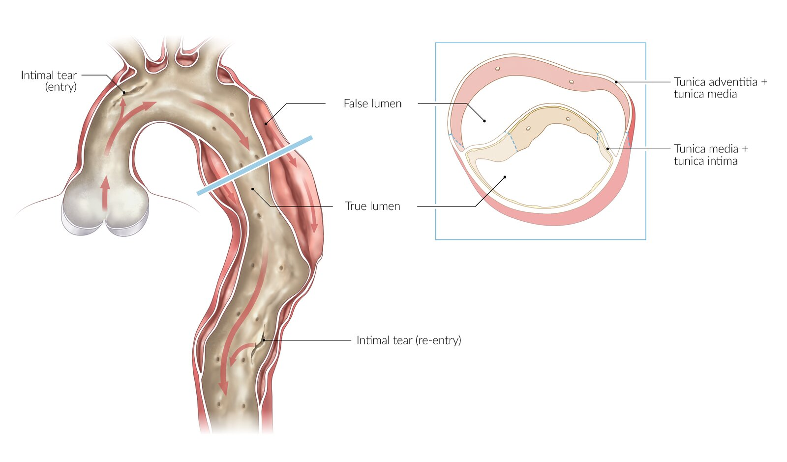

Aortic dissection

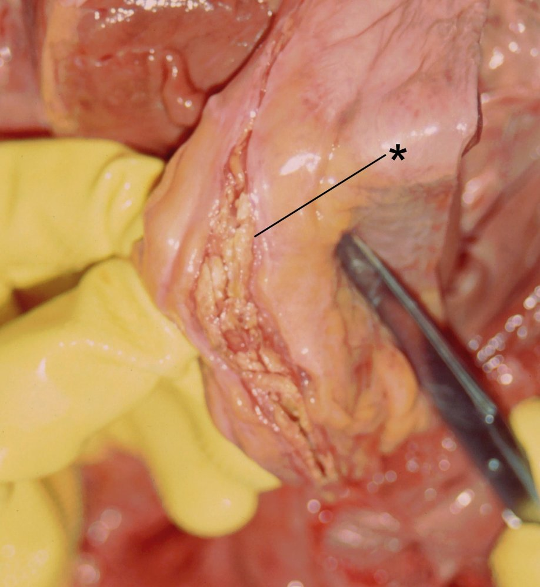

Aortic dissection (Macroscopy)

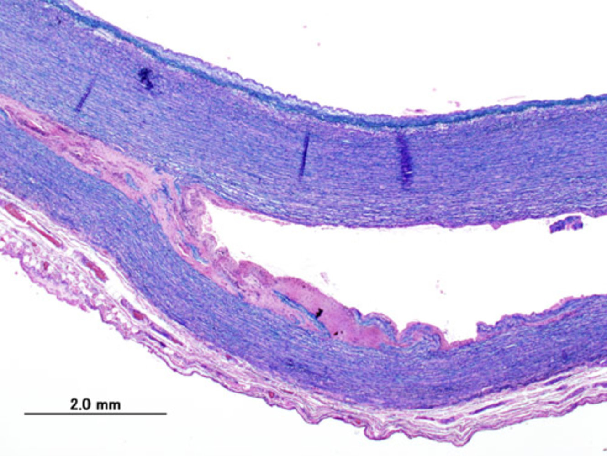

Aortic dissection

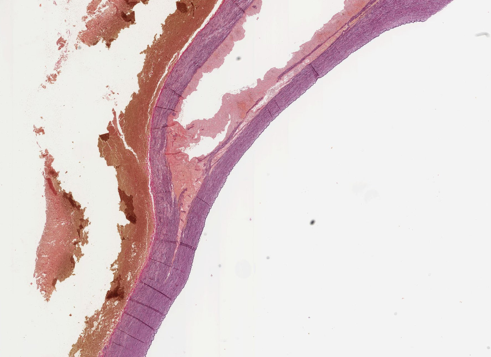

Aortic dissection

---

## Clinical features

* Sudden and severe tearing/ripping <u>pain</u>

* Location

* <u>Anterior</u> chest (ascending) or back (descending)

* Interscapular or retrosternal <u>pain</u>

* Neck and <u>jaw</u>

* Abdomen or periumbilical, colicky <u>pain</u>

* Character: migrates as the dissected wall propagates <u>caudally</u>

* <u>Hypertension</u>  or <u>hypotension</u>

* Asymmetrical blood pressure and <u>pulse</u> readings between limbs

* Wide <u>pulse pressure</u> [[6]](https://coursology-qbank.com/amboss/article/_Mc5r10)

* <u>Syncope</u>, <u>diaphoresis</u>, confusion, or <u>agitation</u>

---

## Diagnosis

### Approach [[4]](https://coursology-qbank.com/amboss/article/mM0V6g)[[7]](https://coursology-qbank.com/amboss/article/73b4Pt)[[9]](https://coursology-qbank.com/amboss/article/pMcLp10)[[10]](https://coursology-qbank.com/amboss/article/JMcsp10)

The optimal diagnostic approach depends on each individual's <u>pretest probability</u>, clinical presentation, and risk profile (see “Management”).

* Order <u>ECG</u> for all patients.

* Order <u>laboratory studies</u> (consider including <u>D-dimer</u>).  [[8]](https://coursology-qbank.com/amboss/article/KMcUp10)

* <u>CXR</u>, <u>TTE</u>, and <u>POCUS</u> are considered screening imaging and are usually only obtained as the initial study if:

* Invasive or risky testing is not desired for low-risk patients.

* Definitive imaging is not readily available.

* Patients are too unstable to undergo definitive imaging.  [[13]](https://coursology-qbank.com/amboss/article/L3cwQX0)[[16]](https://coursology-qbank.com/amboss/article/n3c7QX0)

* Definitive imaging includes <u>CTA</u> (<u>gold standard</u>), <u>TEE</u>, and <u>MRA</u> and should be obtained as the: 

* Initial study for high-risk patients

* Confirmatory study if the diagnosis remains uncertain

> [!TIP]
> Definitive imaging can determine the type of lumen, location, and extent of the dissecting membrane. The identification of a false lumen on imaging is highly suggestive of aortic dissection.

> [!WARNING]
> <u>D-dimer</u>, <u>CXR</u>, <u>TTE</u>, and <u>POCUS</u> are not sensitive enough to reliably rule out aortic dissection. [[8]](https://coursology-qbank.com/amboss/article/KMcUp10)

|  Imaging for aortic dissection [[4]](https://coursology-qbank.com/amboss/article/mM0V6g)[[7]](https://coursology-qbank.com/amboss/article/73b4Pt)[[9]](https://coursology-qbank.com/amboss/article/pMcLp10)[[10]](https://coursology-qbank.com/amboss/article/JMcsp10)  |  |  |  |
| --- | --- | --- | --- |
| Modalities |  | Advantages | Disadvantages |
| <u>CXR</u> |  |   * Rapid; can be performed at the bedside  * Readily available, noninvasive, low level of radiation  * Allows rapid detection of differential diagnoses, e.g. <u>pneumothorax</u>    |  * Poorly sensitive: Normal findings do not rule out aortic dissection   |
| <u>Echocardiography</u> |  <u>TTE</u> or <u>POCUS</u> [[13]](https://coursology-qbank.com/amboss/article/L3cwQX0)[[16]](https://coursology-qbank.com/amboss/article/n3c7QX0)  |   * Rapid; can be performed at the bedside  * Widely available, noninvasive, no radiation  * Does not require <u>procedural sedation and analgesia</u> (<u>PSA</u>)  * Allows detection of other causes of instability, e.g., <u>cardiac tamponade</u>    |   * Requires trained clinicians  * Operator-dependent  * Views may be limited by intervening bone, air, or fat.  * Limited <u>sensitivity</u>: Normal findings do not rule out aortic dissection    |
| <u>TEE</u> |   * Rapid; can be performed at the bedside  * No radiation exposure  * High <u>accuracy</u>: sensitive and specific; more reliable visualization  * Allows for quick differentiation between <u>TAA</u> and aortic dissection    |   * May not be readily available; requires specialized expertise  * Invasive  * Often requires <u>PSA</u> for patient comfort and tolerance which can worsen <u>hypotension</u> [[17]](https://coursology-qbank.com/amboss/article/M3cMQX0)  * Dissection <u>flap</u> can be difficult to distinguish from artifact    |  |
| <u>CTA</u> |  |   * <u>Gold standard</u>: Very high <u>sensitivity</u> and <u>specificity</u>  [[4]](https://coursology-qbank.com/amboss/article/mM0V6g)  * Allows for operative planning  * Widely available    |   * Radiation exposure  * Contrast exposure  * Cannot be performed at the bedside    |
| <u>MRA</u> |  |   * Similar <u>sensitivity</u> and <u>specificity</u> to <u>CTA</u>  * No radiation exposure  * Can also help detect <u>aortic valve</u> pathology and <u>LV dysfunction</u>    |   * Time-consuming  * Limited by <u>contraindications to MRI</u>  * Not readily available  * Cannot be performed at the bedside    |
|  <u>Aortography</u> (rarely performed) |  |   * High <u>accuracy</u> [[9]](https://coursology-qbank.com/amboss/article/pMcLp10)  * Can be performed at the bedside    |   * Invasive and involves exposure to radiation and contrast  * Requires specialized expertise  * Does not help be exclude differential diagnoses or evaluate surrounding structures. [[9]](https://coursology-qbank.com/amboss/article/pMcLp10)    |

### <u>ECG</u>

Findings are variable and include: [[18]](https://coursology-qbank.com/amboss/article/_9Y5Jr)

* Normal findings

* Signs of <u>left ventricular hypertrophy</u>   [[11]](https://coursology-qbank.com/amboss/article/35YSPp)

* Nonspecific changes, such as <u>ST depression</u> and <u>T-wave</u> changes

* <u>ST elevation</u> due to <u>coronary artery</u> occlusion [[4]](https://coursology-qbank.com/amboss/article/mM0V6g)

### <u>Laboratory studies</u>

* <u>D-dimer</u>: elevated levels  [[15]](https://coursology-qbank.com/amboss/article/y9YdJr)

* Studies to evaluate <u>end-organ damage</u>: e.g., <u>troponin</u>, <u>BMP</u>, <u>lactate</u>

* Preoperative studies: <u>CBC</u>, <u>type and screen</u>, <u>BMP</u>, <u>coagulation panel</u>

### <u>Chest x-ray</u> (AP view) [[19]](https://coursology-qbank.com/amboss/article/z9YrJr)[[20]](https://coursology-qbank.com/amboss/article/-9YDJr)

<u>Chest x-ray</u> is often normal.

* Classic radiographic findings of aortic dissection

* <u>Widened mediastinum</u> (> 8 cm) at the level of the <u>aortic knuckle</u>

* Alteration of the <u>mediastinal</u> contour seen on serial imaging

* <u>Mediastinal mass</u>

* <u>Calcium</u> sign: displacement of the <u>intimal</u> calcification of > 6 mm

* Additional findings: may be present

* Double aortic contour

* <u>Pleural cap</u>

* <u>Pleural effusion</u>

* Blurring of the <u>aortic knuckle</u>

* <u>Tracheal shift</u>

* Widening of the paratracheal stripe

> [!TIP]
> Normal <u>chest x-ray</u> findings do not rule out aortic dissection. If clinical suspicion for acute aortic dissection persists, perform a second imaging study.

Widened mediastinum

### <u>Angiography</u>  [[4]](https://coursology-qbank.com/amboss/article/mM0V6g)

* Indications: stable patients, surgical planning

* Modalities

* <u>CTA</u> chest, abdomen, and <u>pelvis</u>

* <u>Magnetic resonance angiography</u> (<u>MRA</u>) chest, abdomen, and <u>pelvis</u> (if <u>CTA</u> is contraindicated)

* Angiography findings suggestive of aortic dissection

* <u>Intimal dissection flap</u>

* Double lumen

* Aortic dilatation

* Regions of malperfusion

* Aortic <u>hematoma</u> (high-attenuation)

* Contrast leak: indicates rupture

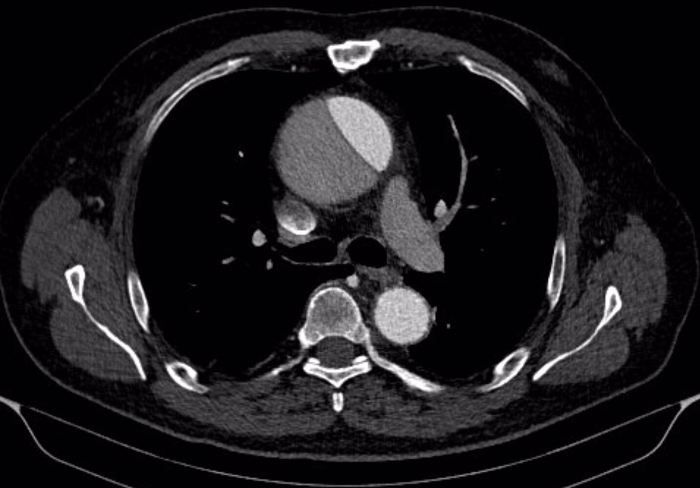

Aortic dissection (Stanford A)

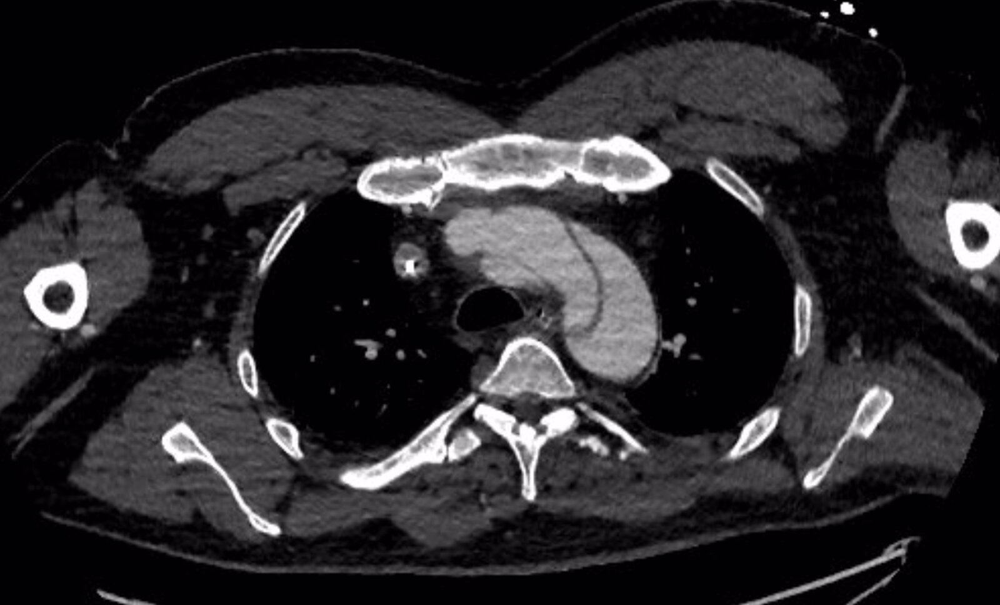

Aortic dissection (Stanford B)

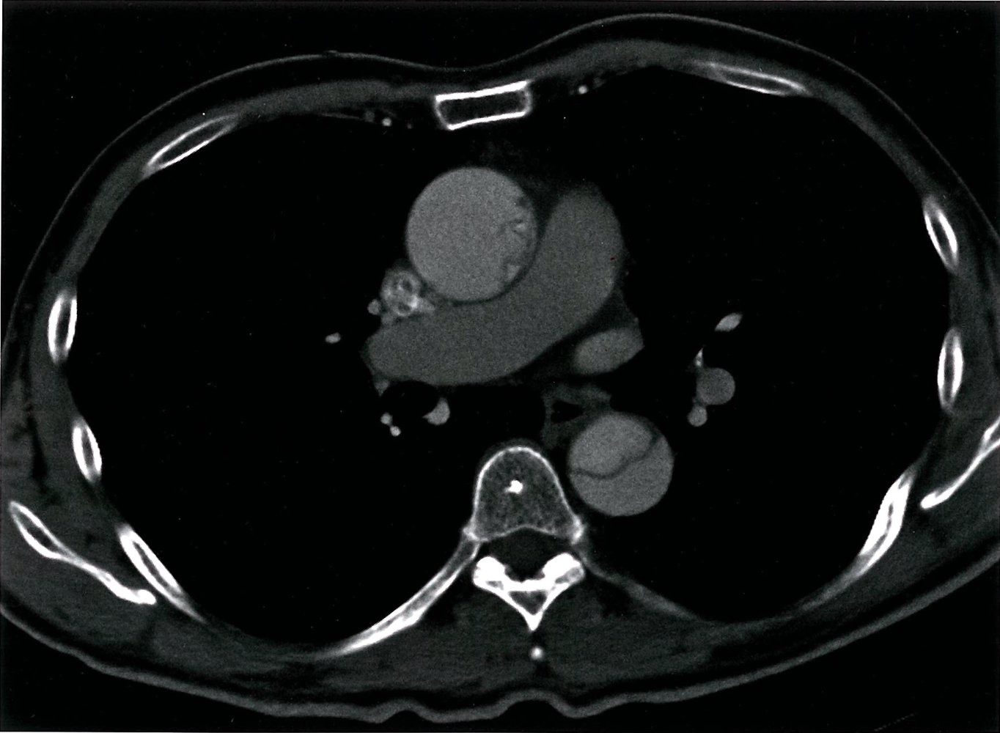

Aortic dissection (Stanford A)

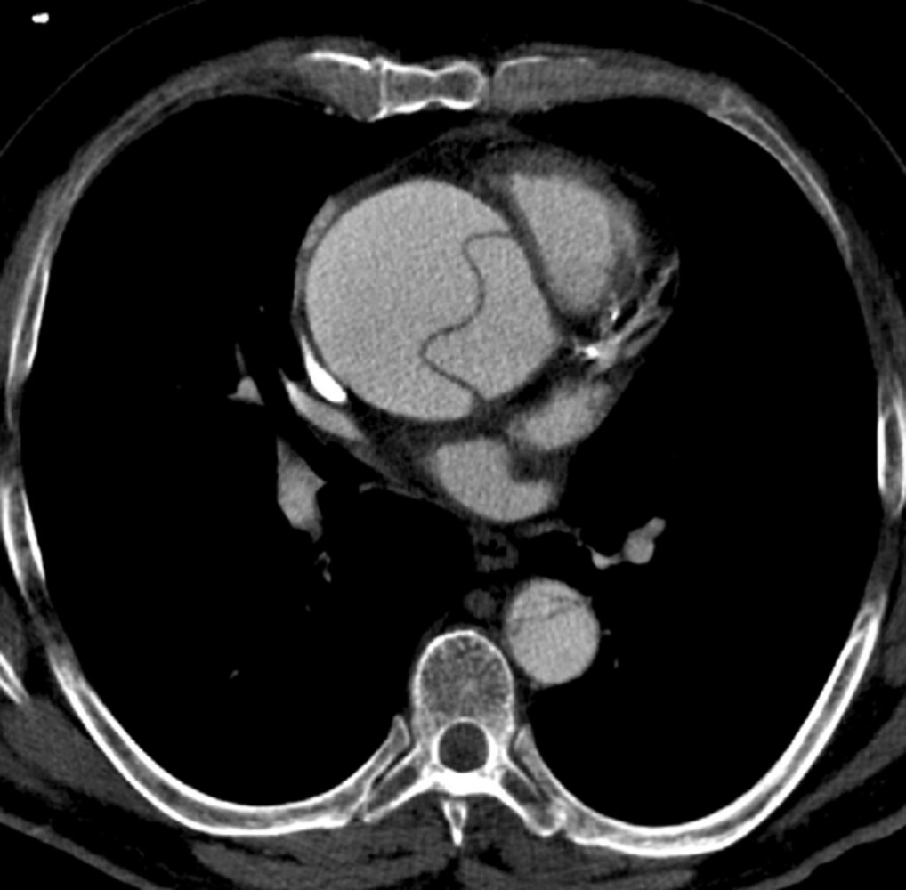

Aortic dissection (Stanford A)

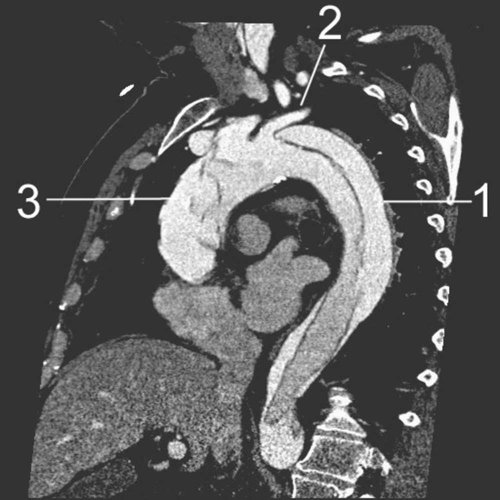

Aortic dissection (Stanford A)

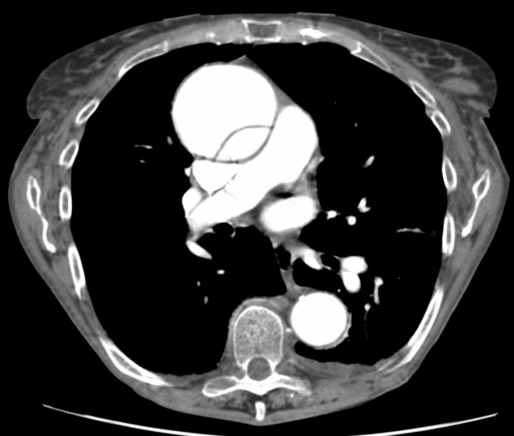

Aortic dissection (Stanford A)

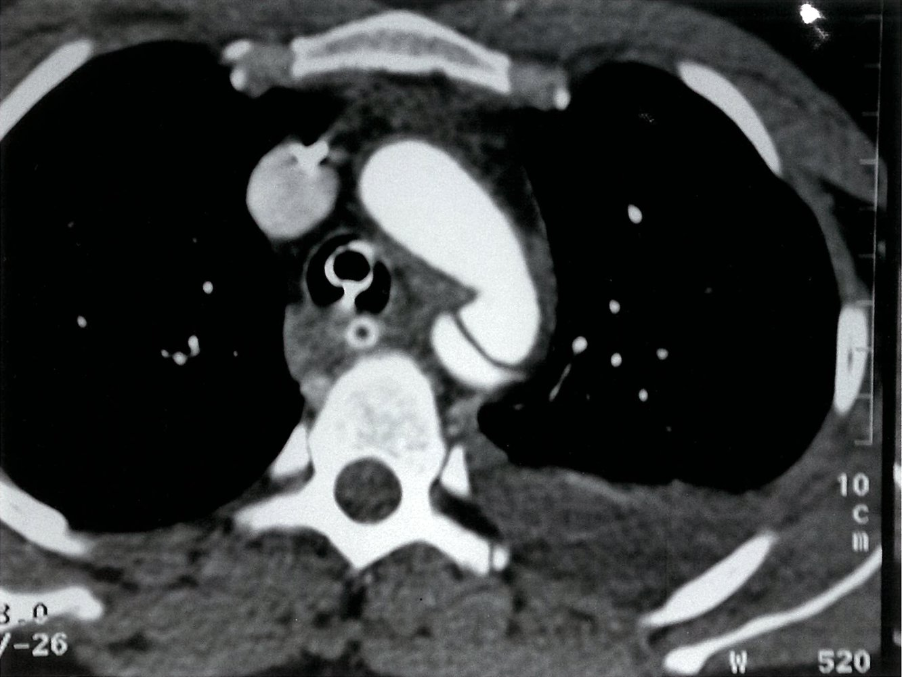

Aortic dissection with rupture and a mediastinal hematoma

### <u>Transesophageal echocardiography</u> (<u>TEE</u>)

* Indications

* Unstable patients

* Intraoperative visualization

* <u>Renal insufficiency</u> or contrast <u>allergy</u>

* TEE findings of aortic dissection include: 

* Dissection <u>flap</u> (with differential Doppler flow)

* Double lumen in the <u>ascending aorta</u>

* <u>Thrombosis</u> in false lumen

* Evidence of <u>aortic regurgitation</u> [[16]](https://coursology-qbank.com/amboss/article/n3c7QX0)

* <u>Pericardial effusion</u>

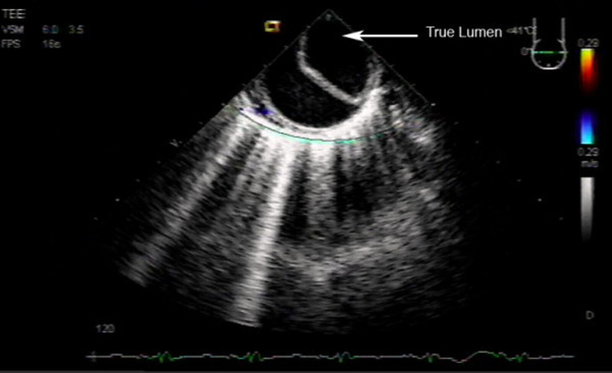

Transesophageal echocardiography of aortic dissection

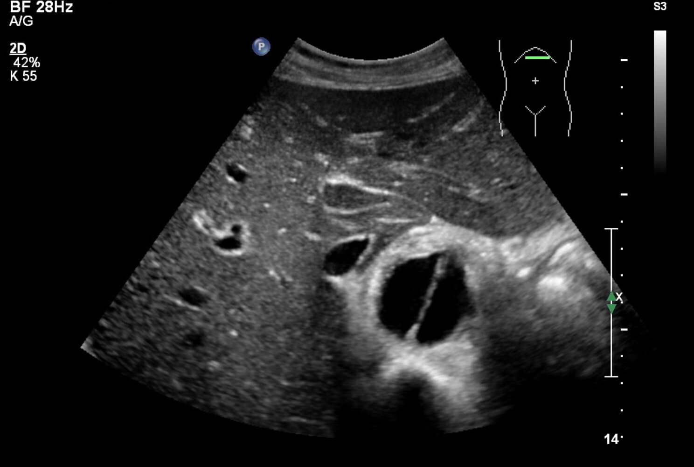

Aortic dissection flap

---

## Differential diagnoses

For other differential diagnosis considerations, see “Differential diagnoses of <u>acute chest pain</u>”.

### Acute aortic occlusion [[21]](https://coursology-qbank.com/amboss/article/sJXtv_)[[22]](https://coursology-qbank.com/amboss/article/tJXXD_)

* Etiology

* Aortic embolism

* Referred to as a <u>saddle embolus</u> when located at the <u>aortic bifurcation</u>

* Commonly caused by <u>cardiac emboli</u>

* <u>Myocardial infarction</u>

* <u>Atrial fibrillation</u>

* <u>Rheumatic heart disease</u>

* <u>Thrombosis</u> of atherosclerotic aorta

* <u>Stent</u> or graft occlusion

* Aortic dissection

* Clinical features: The clinical features of <u>acute aortic occlusion</u> are due to <u>ischemia</u> of the tissues <u>distal</u> to the level of occlusion.

* Occlusion at <u>aortic bifurcation</u>: bilateral <u>acute limb ischemia</u> (most common presentation)

* Limb <u>pain</u>

* <u>Pallor</u> or <u>cyanosis</u>

* Absent <u>pulse</u>

* <u>Paresthesia</u> and <u>paralysis</u>

* Occlusion above <u>aortic bifurcation</u>

* Bilateral <u>acute limb ischemia</u>

* <u>Acute abdomen</u>

* <u>Acute renal failure</u>

* Diagnostics

* <u>CT angiography</u> (<u>confirmatory test</u>)

* Investigate the underlying cause

* <u>ECG</u>

* <u>Echocardiography</u>

* Treatment

* Bilateral transfemoral embolectomy

* Aortobifemoral bypass

* <u>Thrombolysis</u>

The differential diagnoses listed here are not exhaustive.

---

## Treatment

### Approach [[4]](https://coursology-qbank.com/amboss/article/mM0V6g)

* <u>Stanford A dissection</u>: immediate <u>surgery</u>.

* <u>Stanford B dissection</u>: treat conservatively;  (<u>watchful waiting</u> and ongoing medical therapy) unless complications occur. [[4]](https://coursology-qbank.com/amboss/article/mM0V6g)[[23]](https://coursology-qbank.com/amboss/article/4CY3Hr)

* Blood pressure control: essential in all patients to prevent progression of the dissection

* <u>Supportive care</u>

> [!WARNING]
> Avoid <u>thrombolytic therapy</u> in patients with suspected aortic dissection, e.g., for patients presenting with features of <u>stroke</u> or <u>MI</u>.

### Surgical therapy [[4]](https://coursology-qbank.com/amboss/article/mM0V6g)

* Indications

* All patients with <u>Stanford A dissection</u>  [[4]](https://coursology-qbank.com/amboss/article/mM0V6g)

* Patients with <u>Stanford B dissection</u> who develop complications:

* <u>End-organ damage</u> (<u>ischemia</u>)

* <u>Hypotension</u>

* Persistent severe <u>chest pain</u> or <u>hypertension</u>

* Propagation of dissection

* Expanding <u>aneurysm</u>

* Expanding <u>hematoma</u>

* Rupture

* Procedure 

* Open <u>surgery</u> with the replacement of the dissection with a polyester graft implantation [[4]](https://coursology-qbank.com/amboss/article/mM0V6g)

* Endovascular treatment;  with aortic <u>stent implantation</u> (only in type B dissections and if the open operative risk is too high)  [[4]](https://coursology-qbank.com/amboss/article/mM0V6g)

> [!TIP]
> <u>Ascending aortic dissection</u> is a surgical emergency!

### Medical therapy

#### Hypotensive patients [[4]](https://coursology-qbank.com/amboss/article/mM0V6g)

* <u>Hemodynamic support</u>: target <u>MAP</u> of 70 mm Hg or <u>euvolemia</u> [[4]](https://coursology-qbank.com/amboss/article/mM0V6g)

* <u>IV fluids</u>

* <u>Vasopressor</u> support: if the patient remains hypotensive [[4]](https://coursology-qbank.com/amboss/article/mM0V6g)[[24]](https://coursology-qbank.com/amboss/article/ufbpLG)

* <u>Norepinephrine</u> DOSAGE

* <u>Phenylephrine</u> DOSAGE

* <u>Inotropes</u> should be avoided as they can increase shear <u>stress</u> on the aortic wall through increased force of ventricular contraction.

* Identify and treat, if possible, any comorbidities that may be contributing to the <u>hypotension</u>

* Severe <u>aortic insufficiency</u>

* <u>Cardiac tamponade</u>: Consider urgent <u>pericardial fluid drainage</u> if the patient is unlikely to survive until <u>surgery</u> can be performed without intervention (See “<u>Management of cardiac tamponade</u>”). [[4]](https://coursology-qbank.com/amboss/article/mM0V6g)

* Expedite operative management.

> [!WARNING]
> Avoid <u>inotropes</u> as they can worsen aortic wall <u>stress</u>.

#### Hypertensive patients [[4]](https://coursology-qbank.com/amboss/article/mM0V6g)

* Control <u>hypertension</u> and <u>heart rate</u>: target <u>SBP</u> 100–120 mm Hg and HR ≤ 60 beats per minute ;  [[4]](https://coursology-qbank.com/amboss/article/mM0V6g)[[25]](https://coursology-qbank.com/amboss/article/LZbwXH)

* Start with an IV <u>beta blocker</u>: to avoid <u>reflex tachycardia</u> 

* <u>Esmolol</u> DOSAGE

* <u>Labetalol</u> DOSAGE

* Followed by <u>vasodilator</u> (e.g., IV <u>sodium</u> <u>nitroprusside</u>) DOSAGE [[4]](https://coursology-qbank.com/amboss/article/mM0V6g)

* <u>Contraindications to beta blockers</u>: Start a <u>calcium channel blocker</u>.

* <u>Verapamil</u> DOSAGE

* <u>Diltiazem</u> DOSAGE

* Patients with dissection of the <u>descending aorta</u> who remain stable on IV treatment can be transitioned to oral medications and discharged with outpatient imaging surveillance.

> [!TIP]
> Start <u>beta blocker</u> therapy before <u>vasodilators</u> to avoid <u>reflex tachycardia</u>!

#### <u>Supportive care</u>

Adequate <u>treatment of pain</u> and <u>anxiety</u> helps reduce <u>sympathetic</u> tone, which reduces blood pressure and <u>heart rate</u>, thereby lowering shear <u>stress</u>. [[11]](https://coursology-qbank.com/amboss/article/35YSPp)

* Initiate <u>pain management</u> (e.g., <u>morphine</u>). DOSAGE

* Consider <u>procedural sedation</u>.

* For patients taking <u>anticoagulants</u>, urgently consult <u>hematology</u> for consideration of <u>anticoagulant reversal</u>.  [[26]](https://coursology-qbank.com/amboss/article/K3cUjX0)

* Identify and treat any complications (e.g., <u>mesenteric</u> <u>ischemia</u>, <u>acute kidney injury</u>).

---

## Complications

* Malperfusion syndrome

* A complication of aortic dissection where blood flow to major vascular beds is interrupted, resulting in <u>ischemia</u> and <u>end-organ damage</u>

* <u>Malperfusion syndrome</u> may affect the gut, <u>kidneys</u>, upper or lower limbs, as well as coronary, spinal, or cerebral circulation

* <u>Aortic rupture</u> and acute blood loss: acute back and flank <u>pain</u>;  (tearing <u>pain</u>), symptoms of <u>shock</u> → indication for emergency <u>surgery</u>

* Complications of <u>Stanford</u> type A dissections

* <u>Myocardial infarction</u> (<u>coronary artery</u> occlusion)

* <u>Aortic regurgitation</u> (extension of the dissection into the <u>aortic valve</u>)

* <u>Cardiac tamponade</u> progressing to <u>cardiogenic shock</u>

* <u>Pericarditis</u>, <u>pericardial effusion</u>, and <u>pericardial tamponade</u> (slow extension of the dissection into the <u>pericardium</u>)

* <u>Stroke</u> (extension of the dissection into the carotids)

* Complications of both <u>Stanford</u> type A dissection and <u>Stanford</u> type B dissections 

* Bleeding into the thorax, <u>mediastinum</u>, and abdomen

* Arterial occlusion followed by <u>ischemia</u> of the:

* <u>Celiac trunk</u>, superior/<u>inferior mesenteric artery</u> → <u>acute abdomen</u>, <u>ischemic colitis</u>

* <u>Renal arteries</u> → <u>acute renal failure</u> (<u>oliguria</u>, <u>anuria</u>)

* Spinal <u>arteries</u> → <u>weakness</u> of lower extremities or acute <u>paraplegia</u>

* Complete occlusion of the <u>distal</u> aorta → <u>Leriche syndrome</u> (<u>aortoiliac occlusive disease</u>)

We list the most important complications. The selection is not exhaustive.

---

## Prevention

* Blood pressure control

* <u>Smoking cessation</u> [[4]](https://coursology-qbank.com/amboss/article/mM0V6g)

* Age-appropriate <u>AAA screening</u>

---