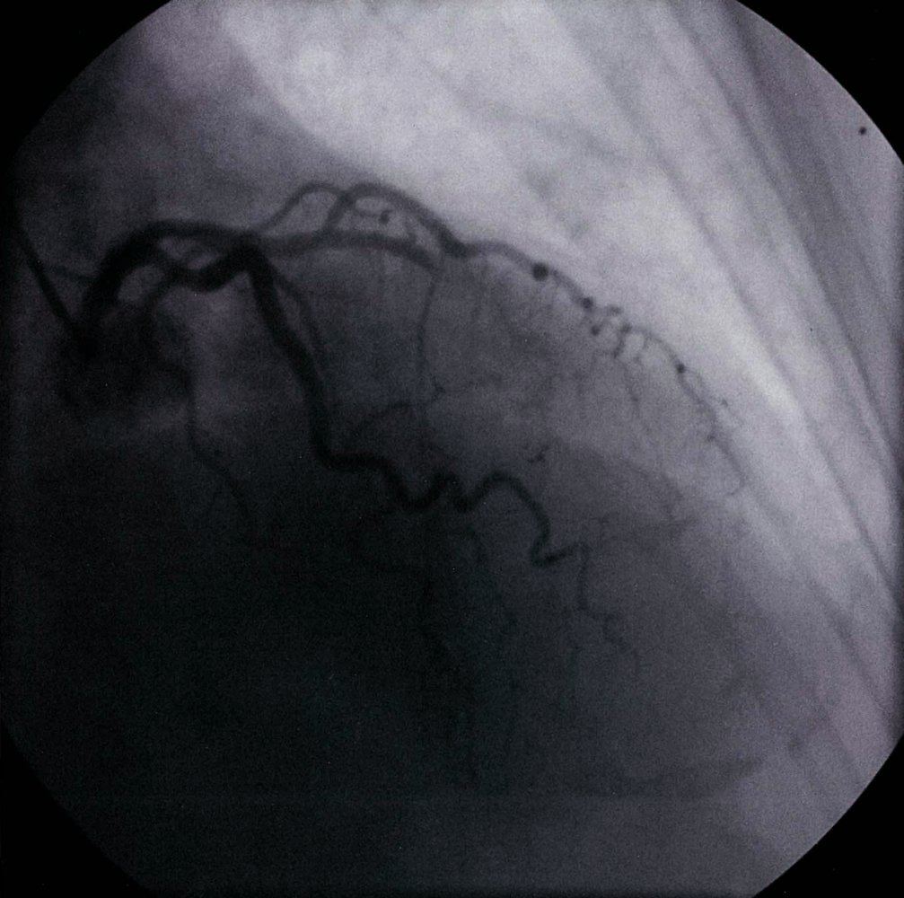
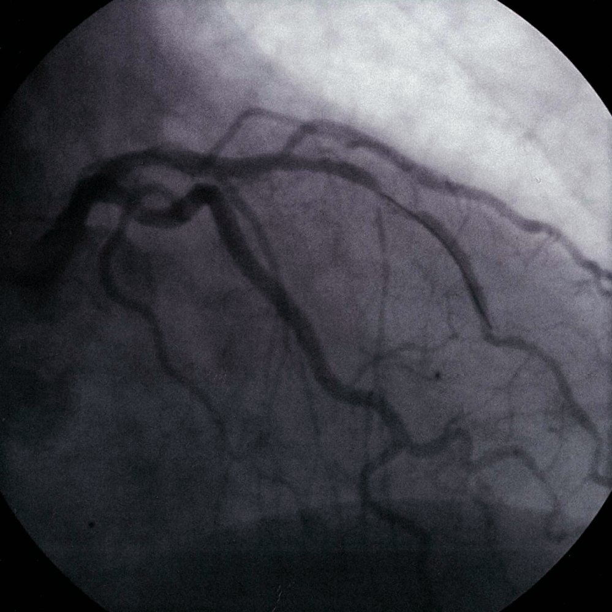
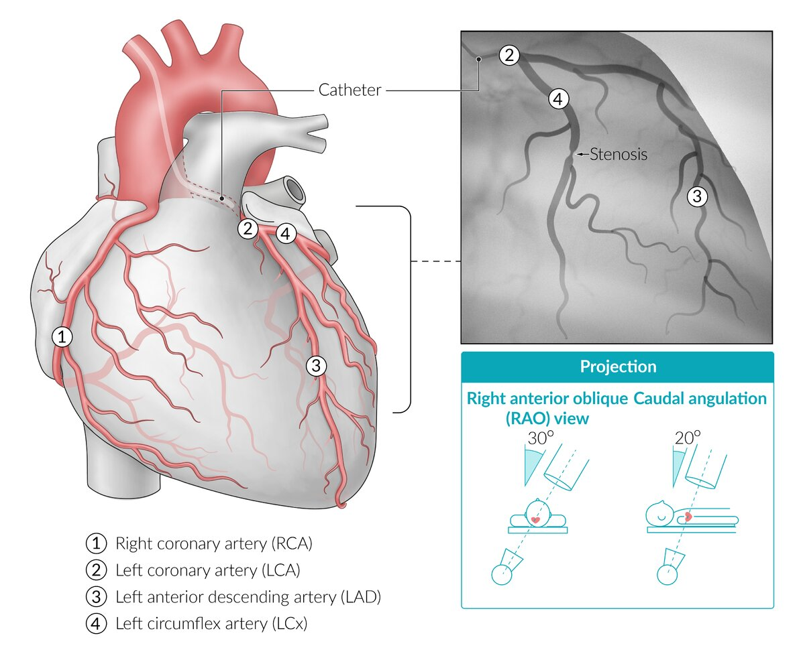
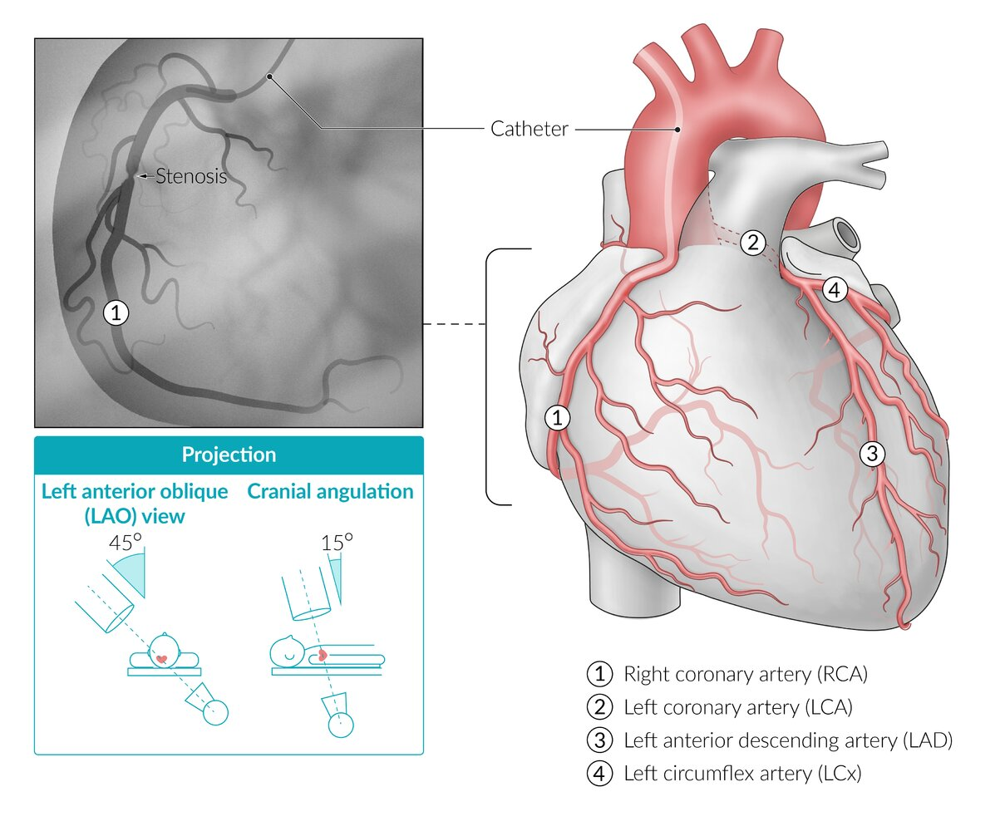
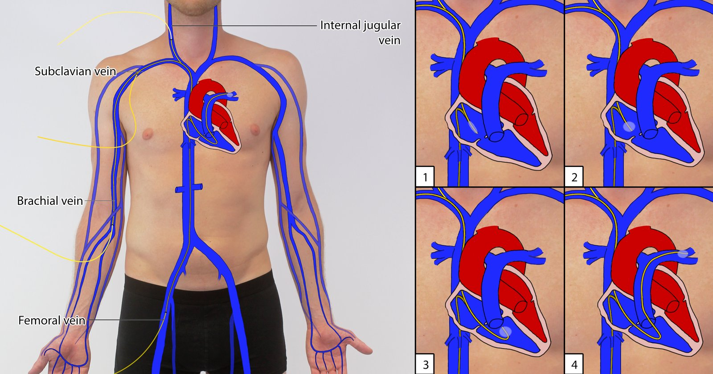
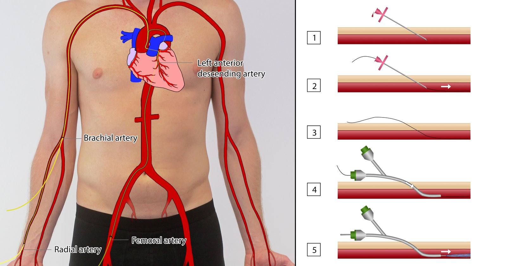
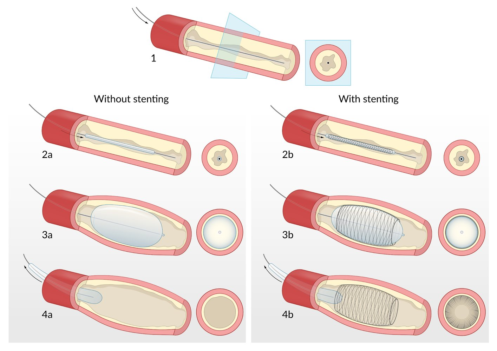

# Cardiac catheterization

*Categories: Clinical knowledge > Surgery > Cardiothoracic surgery > Cardiac catheterization*

[Original Article Link](https://coursology-qbank.com/amboss/article/rl0fyT)

---

## Summary

Cardiac catheterization is a procedure used in the diagnosis and treatment of cardiovascular conditions. It involves the insertion of a catheter into a cardiac vessel (<u>coronary catheterization</u>) or chamber by way of a suitable <u>vascular access</u> (usually a femoral or <u>radial artery</u>). Once in position, a cardiac catheter can help evaluate the blood supply to the cardiac musculature (<u>coronary angiography</u>) or open up narrowed or blocked segments of a <u>coronary artery</u> by means of a <u>percutaneous coronary intervention</u> (<u>PCI</u>) with or without <u>stenting</u>. Additionally, it can be used to perform a <u>myocardial biopsy</u>, open narrowed <u>heart valves</u> via <u>balloon valvuloplasty</u>, examine electrophysiological pathways (<u>electrophysiological study</u>), or measure pressure and oxygen levels in different chambers (<u>hemodynamic assessment</u>). The procedure is associated with a low rate of complications, with the most common among these being <u>bruising</u> and bleeding at the site of access. Rarer, more severe complications include <u>arrhythmias</u>, <u>cardiac arrest</u>, embolization of existing <u>plaques</u>, and infection.

---

## Procedure/overview

### General

* <u>Arterial catheter insertion</u> sites 

* Most common: <u>femoral artery</u>

* <u>Radial artery</u>

* <u>Brachial artery</u> (access generally via cutdown approach)

* Imaging: A contrast dye is injected via the catheter, and is visualized with serial <u>x-ray</u> imaging.

* Preprocedural testing

* <u>ECG</u>

* Laboratory tests: <u>complete blood count</u>, <u>INR</u>/<u>prothrombin time</u>, serum <u>urea</u>, and <u>creatinine</u>

### Coronary angiography/ventriculography

* Description

* <u>Coronary angiography</u>: contrast-enhanced radiological imaging technique used to visualize and assess the <u>coronary arteries</u>

* <u>Ventriculography</u>; : contrast-enhanced radiological imaging technique used to visualize and assess the structure and function of the ventricles and valves

* Indications

* <u>Coronary artery disease</u>: to assess the exact location and extent of coronary vessel narrowing before possible <u>PCI</u>/<u>surgery</u>

* Valvular or <u>myocardial</u> diseases with symptoms (e.g., <u>shortness of breath</u>)

* Recurring <u>chest pain</u> of unidentified cause

* <u>Preoperative evaluation</u> prior to noncardiac and planned cardiac <u>surgery</u> (<u>CABG</u>) in high-risk patients

* To detect and quantify the presence of an intracardiac shunt

* <u>Valvular heart diseases</u>

* Direct measurement of the ventricular and aortic pressures to determine the degree of valvular stenosis [[1]](https://coursology-qbank.com/amboss/article/HMbKJ8)

* Cardiac <u>ventriculography</u> can directly visualize and quantify the reflux of the contrast material in valvular insufficiencies. [[1]](https://coursology-qbank.com/amboss/article/HMbKJ8)

> [!NOTE]
> <u>Coronary angiography</u> is not a screening method for <u>coronary heart disease</u> in asymptomatic patients!

Coronary angiography in acute anterior myocardial infarction

Treatment of acute anterior myocardial infarction (2/2)

Illustration of coronary angiography; left coronary artery (LCA)

Illustration of coronary angiography; right coronary artery (RCA)

### Electrophysiological study

* Description: testing of the electrical <u>conduction system of the heart</u> to assess electrical activity and conduction pathways via a cardiac catheter

* Indications

* Diagnostic: evaluation of various, repeat refractory <u>cardiac arrhythmias</u>

* Therapeutic

* Radioablation of areas of accessory pathways (areas that generate and conduct the <u>arrhythmias</u>)

* Placement of intracardiac pacemakers or <u>defibrillators</u>

### Right heart catheterization

* Description: the passing of a balloon-tipped, multi-lumen catheter (<u>Swan-Ganz catheter</u>) into the right side of the <u>heart</u> and the <u>pulmonary artery</u> to monitor pressure within the <u>heart</u> (intracardiac pressure)  and pulmonary arterial pressure.

* Indications

* For patients with <u>heart failure</u>, <u>cardiomyopathy</u>, <u>congenital heart disease</u>, and valvular disease: to measure pressure, oxygen, and <u>cardiac output</u> of the right <u>heart</u> to assess the severity of dysfunction

* It also helps measure pulmonary capillary wedge pressure (<u>PCWP</u>), which can be used to diagnose the severity of <u>left ventricular failure</u> and <u>mitral stenosis</u>.

* In suspected <u>pulmonary hypertension</u>: helps measure <u>mean pulmonary arterial pressure</u> (<u>mPAP</u>) and <u>central venous pressure</u> (<u>CVP</u>)

* Procedure: <u>venipuncture</u> (groin, arm, neck) → advancement of the Swan-Ganz catheter into the right <u>heart</u>

### <u>Myocardial biopsy</u> [[2]](https://coursology-qbank.com/amboss/article/a-dQDs0)

* Indications

* Suspected <u>cardiomyopathies</u>

* <u>Myocarditis</u>

* Systemic illnesses with cardiac involvement (e.g., <u>sarcoidosis</u>, <u>amyloidosis</u>, <u>hemochromatosis</u>) [[3]](https://coursology-qbank.com/amboss/article/FAXgl00)

* Follow-up after <u>heart transplantation</u> (to rule out the possibility of organ rejection)

* Findings: depending on the underlying disease

Right heart catheterization and placement of a flow-directed catheter

### Percutaneous coronary intervention (<u>PCI</u>)

* Description

* A therapeutic procedure carried out during cardiac catheterization

* A balloon catheter is used to dilate the narrowed section of a blocked coronary vessel to restore appropriate blood flow

* With or without the placement of a <u>stent</u> to keep the vessel patent

* Indications: acute and chronic occlusion of <u>coronary arteries</u>

* <u>Myocardial infarction</u> (primary <u>revascularization</u> or <u>primary PCI</u>)

* Occlusion of bypass grafts and <u>stents</u>

* Recurrent <u>ischemia</u> after <u>PCI</u> or <u>bypass surgery</u>

* Procedure: a catheter is inserted through the access site → a deflated balloon catheter is advanced into the obstructed <u>artery</u> → balloon is inflated at the obstructed/narrowed section → the narrowing is relieved → <u>stent</u> may/may not be deployed to keep the blood vessel open

* Types of <u>stents</u>

* Bare metal stent (<u>BMS</u>): bare-surfaced, metallic <u>stent</u> that provides a mechanical framework to keep the <u>artery</u> open

* After placement, <u>endothelial</u> cells begin to cover the bare surface of the <u>stent</u> (<u>stent</u> endothelialization) → ↓ exposure time of the foreign, thrombogenic material → ↓ risk of <u>stent thrombosis</u> → ↓ time of post-placement anticoagulation

* Thus, <u>bare metal stents</u> are better suited to patients who are not compliant with long-term oral medications and/or those who may need to undergo <u>surgery</u> in the near future.

* Drug-eluting stent (<u>DES</u>): <u>stents</u> that are coated with antiproliferative substances (<u>immunosuppressant</u> drugs, cytostatic drugs) that prevent excessive <u>intimal</u> <u>hyperplasia</u>

* Alternative method: <u>coronary artery bypass grafting</u> (<u>CABG</u>)

Cardiac catheterization based on the Seldinger technique

Percutaneous transluminal coronary angioplasty (PTCA)

References:[[4]](https://coursology-qbank.com/amboss/article/U30b3f)[[4]](https://coursology-qbank.com/amboss/article/U30b3f)[[5]](https://coursology-qbank.com/amboss/article/hu0cI3)[[6]](https://coursology-qbank.com/amboss/article/3u0SI3)[[7]](https://coursology-qbank.com/amboss/article/Ru0lI3)

---

## Contraindications

* <u>Relative contraindications</u>: comorbidities in which the risks associated with <u>coronary angiography</u> are greater than the benefits of securing the diagnosis

* <u>Decompensated heart failure</u>

* <u>Acute renal failure</u>

* Uncontrolled, severe <u>hypertension</u>

* <u>Bleeding disorder</u> or anticoagulated state

* <u>Allergy</u> to radiographic agents

* Special consideration: Abnormal results on a <u>modified Allen test</u> are a contraindication for radial access.

References:[[5]](https://coursology-qbank.com/amboss/article/hu0cI3)[[8]](https://coursology-qbank.com/amboss/article/Su0yq3)

We list the most important contraindications. The selection is not exhaustive.

---

## Complications

### Periprocedural complications

#### Complications at the site of vascular access

* <u>Superficial</u> <u>hematoma</u> formation

* <u>Retroperitoneal hematoma</u> [[9]](https://coursology-qbank.com/amboss/article/Qu0uI3)[[10]](https://coursology-qbank.com/amboss/article/ju0_I3)

* <u>Pseudoaneurysms</u>  [[11]](https://coursology-qbank.com/amboss/article/qM0Cpg)

* Arterial injury;  (can include <u>laceration</u>, <u>arteriovenous fistula</u> formation, or <u>thrombosis</u>)

#### Complications at the cardiac level

* Cardiac procedural myocardial injury: i.e.:

* Elevated <u>cardiac troponin</u> levels > 99th <u>percentile</u> of <u>ULN</u> in patients with normal preprocedural <u>troponin</u> levels

* Or a rise in <u>cardiac troponin</u> levels > 20% in patients with preprocedural levels that were elevated or falling

* <u>Myocardial infarction</u>

* <u>Arrhythmias</u> can be induced by catheter introduction into the right or <u>left ventricle</u>.

* <u>Spontaneous coronary artery dissection</u> (<u>SCAD</u>) in the <u>artery</u> affected by acute coronary occlusion

* Injury to coronary vasculature by the catheter (e.g., dissection of <u>coronary artery</u> wall)

#### Other complications

* Hypersensitivity to contrast media

* <u>Acute kidney injury</u>  (see also <u>contrast nephropathy</u>)

* <u>Cholesterol embolization syndrome</u>

### Delayed complications

* Restenosis (most common complication)

* Stent thrombosis (0.5–5%)

* Vascular complications

* <u>Spontaneous coronary artery dissection</u> (<u>SCAD</u>; ∼ 5% after <u>PTCA</u>) → increased risk of <u>infarction</u>

* Systemic embolisms: <u>stroke</u> due to <u>cerebral emboli</u> (< 1%)

* Infection (localized or generalized <u>bacteremia</u>)

We list the most important complications. The selection is not exhaustive.

---