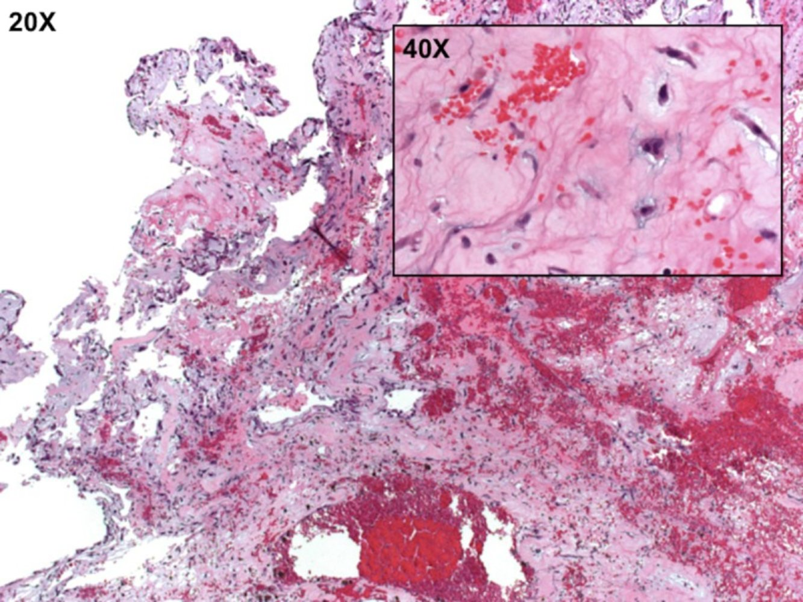

# Cardiac myxoma

*Categories: Clinical knowledge > Surgery > Cardiothoracic surgery > Cardiac myxoma*

[Original Article Link](https://coursology-qbank.com/amboss/article/To06YS)

---

## Summary

Cardiac <u>myxomas</u> are the most common type of primary <u>tumor</u> of the <u>heart</u>. They are usually benign and arise from primary <u>connective tissue</u>. Most cardiac <u>myxomas</u> arise sporadically; however, 10% are hereditary (following an <u>autosomal dominant</u> pattern). Even though they may develop in any chamber of the <u>heart</u>, most (∼ 75 %) cardiac <u>myxomas</u> arise in the <u>left atrium</u>, usually from the <u>interatrial septum</u>, while the rest occur in the <u>right atrium</u> (ventricular <u>myxomas</u> are rare). Clinical features are primarily caused by obstruction of the blood flow through the <u>heart</u> and include <u>dyspnea on exertion</u>, <u>palpitations</u>, <u>syncope</u>, weight loss, or even sudden <u>death</u>. Rarely, life-threatening conditions (e.g., <u>stroke</u>) may result from an embolization from the <u>myxoma</u>. Typical examination findings include abnormal <u>heart sounds</u>, such as a rumbling <u>diastolic</u> <u>murmur</u> over the apex or a characteristic “<u>tumor</u> plop.” The diagnosis is not easily established clinically because of the nonspecific nature of symptoms. <u>Echocardiography</u> is the diagnostic procedure of choice. Surgical resection of the <u>tumor</u> is the curative treatment of choice. The prognosis is usually favorable, but tumors can recur after inadequate resection.

---

## Epidemiology

* Most common primary cardiac <u>neoplasm</u> in adults (usually benign)

* Most common location: <u>left atrium</u> (∼ 75% of all cases)  [[1]](https://coursology-qbank.com/amboss/article/naX7O9)

* Sex: <u>♀</u> > <u>♂</u> (3:1)

* Peak <u>incidence</u>: 40–60 years [[2]](https://coursology-qbank.com/amboss/article/KaXUl9)

> [!NOTE]
> Adult hearts are left with myxed feelings.

Epidemiological data refers to the US, unless otherwise specified.

---

## Etiology

* The exact etiology is unknown.

* Most cases are sporadic.

* Familial inheritance:

* ∼ 10% of all cases

* <u>Autosomal dominant inheritance</u>

* <u>Carney syndrome</u>

---

## Clinical features

* General

* Production of <u>IL-6</u> by <u>tumor</u> causes <u>constitutional symptoms</u> (e.g., weight loss, <u>fever</u>, <u>pallor</u>)

* <u>Digital clubbing</u>

* Clinical features caused directly by the <u>tumor</u> 

* Symptoms caused by obstruction

* <u>Dyspnea on exertion</u>, <u>paroxysmal nocturnal dyspnea</u>, and/or <u>orthopnea</u>

* <u>Dizziness</u> or <u>syncope</u> (patients commonly have a history of multiple <u>syncopes</u>)

* <u>Palpitations</u>

* <u>Auscultatory</u> findings

* Low pitched, middiastolic rumbling <u>murmur</u> over the apex (similar to <u>mitral stenosis</u>)

* <u>Early diastolic murmur</u>: “plop” sound related to movement of the <u>tumor</u>

* Potentially, an additional <u>heart sound</u> (audible just after <u>S2</u>)

* These sounds may change when the patient changes position (improve lying down, worsen upright)

* Valve damage may result in <u>mitral regurgitation</u>.

* See “<u>Symptoms of left heart failure</u>” and “<u>Symptoms of right heart failure</u>.”

* Symptoms due to embolization

* <u>CNS</u>: <u>transient ischemic attack</u>, <u>stroke</u>, or <u>seizure</u>

* Abdomen: <u>visceral</u> <u>infarction</u> or hemorrhage

* <u>Lungs</u>: pulmonary embolization

* Distant recurrence

---

## Diagnosis

Because of the nonspecific nature of the cardiac symptoms, the diagnosis is often only established much later in the course of the disease.

* <u>Echocardiography</u>: diagnostic test of choice

* The <u>tumor</u> appears as a <u>pedunculated</u>, heterogeneous, mobile mass, usually present in the <u>left atrium</u> (the valve may appear as an obstructing ball). [[3]](https://coursology-qbank.com/amboss/article/RTYlqo)

* Helps assess <u>tumor</u> location, size, attachment, and mobility

* Other tests: CT and <u>MRI</u> scans help better visualize the intracardiac mass.

Left atrial myxoma

---

## Pathology

* Microscopic appearance  [[4]](https://coursology-qbank.com/amboss/article/fUYkco)

* Scattered <u>mesenchymal</u> cells within mucoid, gelatinous material

* Surrounded by <u>glycosaminoglycans</u>

* Produce <u>VEGF</u>

* Macroscopic appearance: often <u>pedunculated</u>, gelatinous consistency

Cardiac myxoma

---

## Differential diagnoses

* Secondary (metastatic) cardiac tumors

* ∼ 20–30 times more common than primary cardiac tumors

* Most common primary cancers: <u>melanoma</u>, <u>lung cancer</u>, and <u>breast cancer</u>

* <u>Lipoma</u>: usually an incidental finding

* <u>Rhabdomyoma</u>

* A type of <u>hamartoma</u>

* Most common primary cardiac <u>tumor</u> in children

* Associated with <u>tuberous sclerosis</u>

The differential diagnoses listed here are not exhaustive.

---

## Treatment

* The only definitive treatment of cardiac <u>myxoma</u> is immediate surgical resection.  [[5]](https://coursology-qbank.com/amboss/article/MaXMO9)

* Medical intervention may be required for the treatment of associated conditions like <u>arrhythmias</u>, <u>heart failure</u>, or embolism.

> [!TIP]
> Recurrence may occur in cases of incomplete excision of the <u>tumor</u>, growth from a second focus, or intracardiac implantation from the primary <u>tumor</u>.

---