# Pleural effusion

*Categories: Clinical knowledge > Surgery > Cardiothoracic surgery > Pleural effusion*

[Original Article Link](https://coursology-qbank.com/amboss/article/F50gNg)

---

## Summary

Pleural effusion is the abnormal accumulation of fluid in the <u>pleural cavity</u> between the lining of the <u>lungs</u> and the <u>thoracic cavity</u> (i.e., the <u>visceral</u> and <u>parietal pleurae</u>). Normally, a small amount of <u>pleural fluid</u> is present, which helps lubricate the <u>pleural cavity</u> and facilitates <u>lung</u> movement within the thoracic space. An imbalance between the oncotic and hydrostatic forces that govern <u>pleural fluid</u> formation and <u>lymphatic drainage</u> can result in excessive fluid accumulation. Fluid that permeates into the <u>pleural cavity</u> through intact pulmonary vessels, e.g., in <u>congestive heart failure</u> (<u>CHF</u>), is called a <u>transudate</u>. Conversely, fluid that <u>escapes</u> into the <u>pleural cavity</u> through lesions in blood and <u>lymph</u> vessels, e.g., due to inflammation or tumors, is called an <u>exudate</u>. Pleural effusion is often diagnosed using <u>chest x-ray</u> and <u>ultrasound</u>, but chest CT may be used for very small effusions. <u>Thoracentesis</u> serves as both a diagnostic and therapeutic procedure: <u>pleural fluid analysis</u> can help identify the underlying cause and excess <u>pleural fluid</u> evacuation can provide symptomatic relief. <u>Treatment of pleural effusion</u> often focuses on treating the underlying condition.

---

## Overview

|  Transudative vs exudative pleural effusion [[1]](https://coursology-qbank.com/amboss/article/U30b3f)[[2]](https://coursology-qbank.com/amboss/article/RjYlZ6)[[3]](https://coursology-qbank.com/amboss/article/BAYzN7)  |  |  |  |
| --- | --- | --- | --- |
|  |  | Transudative pleural effusion | Exudative pleural effusion |
|  Pathophysiology   |  |   * ↑ <u>Capillary</u> <u>hydrostatic pressure</u> (increased <u>capillary</u> wedge pressure)  * ↓ <u>Capillary</u> <u>oncotic pressure</u>    |  * ↑ <u>Capillary</u> permeability (e.g., due to inflammation)   |
|  Common causes (See “<u>Etiology of pleural effusion</u>” for details.) |  |   * <u>Congestive heart failure</u>  * Low protein states, e.g., chronic <u>kidney</u> and <u>liver</u> disease    |   * Pulmonary infections  * <u>Malignancy</u> of pulmonary or <u>metastatic</u> origin  * Inflammatory conditions: e.g., <u>pancreatitis</u>, autoimmune diseases  * Injury: e.g., <u>hemothorax</u>, <u>chylothorax</u>  * <u>Pulmonary embolism</u>    |
| Light Criteria | <u>Pleural fluid</u> protein/<u>serum protein</u> <u>ratio</u> |  * ≤ 0.5   |  * > 0.5   |
| <u>Pleural fluid</u> <u>LDH</u>/serum <u>LDH</u> <u>ratio</u> |  * ≤ 0.6   |  * > 0.6   |  |
| <u>Pleural fluid</u> <u>LDH</u> |  * < ⅔ the <u>upper limit of normal</u> serum <u>LDH</u>   |  * > ⅔ the <u>upper limit of normal</u> serum <u>LDH</u>   |  |

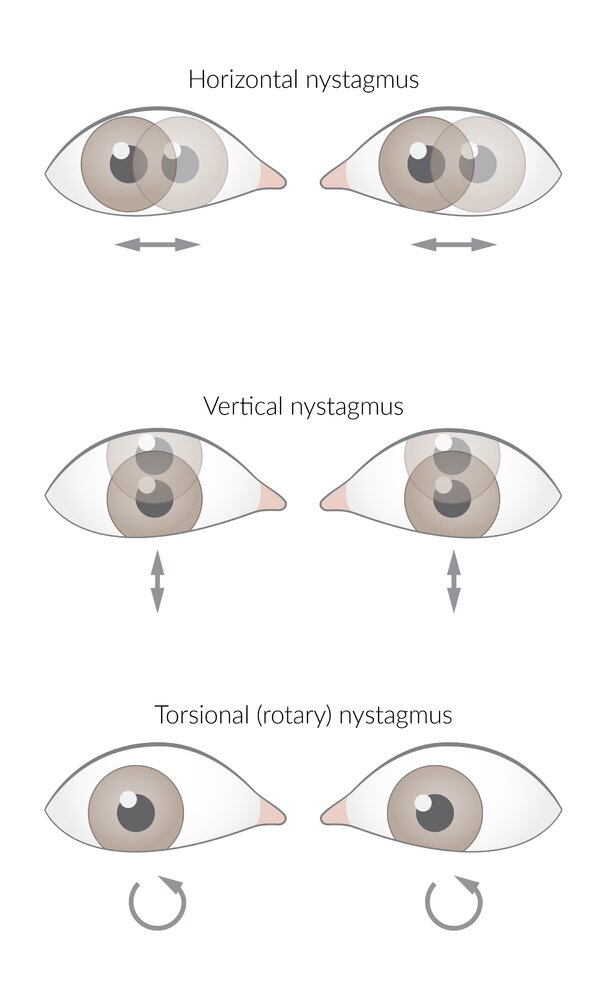

Characterization of nystagmus by direction

---

## Definitions

An excessive amount of fluid between pleural layers that impairs the expansion of the <u>lungs</u>

---

## Etiology

### <u>Transudative effusions</u> [[2]](https://coursology-qbank.com/amboss/article/RjYlZ6)[[3]](https://coursology-qbank.com/amboss/article/BAYzN7)

* <u>Congestive heart failure</u>

* Hepatic <u>cirrhosis</u>

* <u>Nephrotic syndrome</u>

* <u>Protein-losing enteropathy</u>

* <u>Chronic kidney disease</u> (Na+ retention)

* Rare causes

* <u>Superior vena cava obstruction</u>

* <u>Myxedema</u>

### <u>Exudative</u> effusions [[2]](https://coursology-qbank.com/amboss/article/RjYlZ6)[[3]](https://coursology-qbank.com/amboss/article/BAYzN7)

* Infection

* <u>Pneumonia</u> (<u>parapneumonic effusion</u>)

* <u>Tuberculosis</u>

* <u>Pleural empyema</u>

* Parasitic illness (e.g., <u>amebiasis</u>, <u>echinococcal disease</u>)

* Malignancies

* <u>Lung cancer</u>

* <u>Metastatic</u> <u>breast cancer</u>

* <u>Lymphoma</u>

* <u>Mesothelioma</u>

* <u>Ovarian cancer</u>

* <u>Pulmonary embolism</u> (<u>PE</u>)

* Autoimmune disease (especially <u>collagen vascular diseases</u>) 

* <u>Vasculitis</u>

* <u>SLE</u>

* <u>Rheumatoid arthritis</u>

* <u>Sarcoidosis</u>

* Trauma (high vascular permeability)

* <u>Pancreatitis</u>

* <u>Hemothorax</u>

* <u>Chylothorax</u>

* <u>Pseudochylothorax</u>

* Rare causes

* Postcardiac <u>surgery</u>

* <u>Esophageal perforation</u>

* Gynecological causes

* <u>Endometriosis</u>

* <u>Ruptured ectopic pregnancy</u>

* <u>Meigs syndrome</u>

---

## Clinical features

### Symptoms [[3]](https://coursology-qbank.com/amboss/article/BAYzN7)

* Patients with a small pleural effusion (< 300 mL) are often asymptomatic.

* Characteristic symptoms

* <u>Dyspnea</u>

* <u>Symptoms of hypoxia</u>

* <u>Pleuritic chest pain</u> (sharp retrosternal <u>pain</u>)

* Dry, nonproductive <u>cough</u>

* Symptoms of the underlying disease (e.g., <u>fever</u> in <u>empyema</u>, <u>cachexia</u> in cases of <u>malignancy</u>, <u>symptoms of left-sided heart failure</u>)

### <u>Physical exam</u> findings

* Inspection and palpation

* Asymmetric expansion and unilateral lagging on the affected side

* Reduced <u>tactile fremitus</u> due to fluid in the <u>pleural space</u>

* <u>Auscultation</u>

* Faint or absent breath sounds over the area of effusion

* <u>Pleural friction rub</u> (squeaking sound of inflamed pleural layers rubbing together during inspiration and expiration)

* Percussion: dullness over the area of effusion

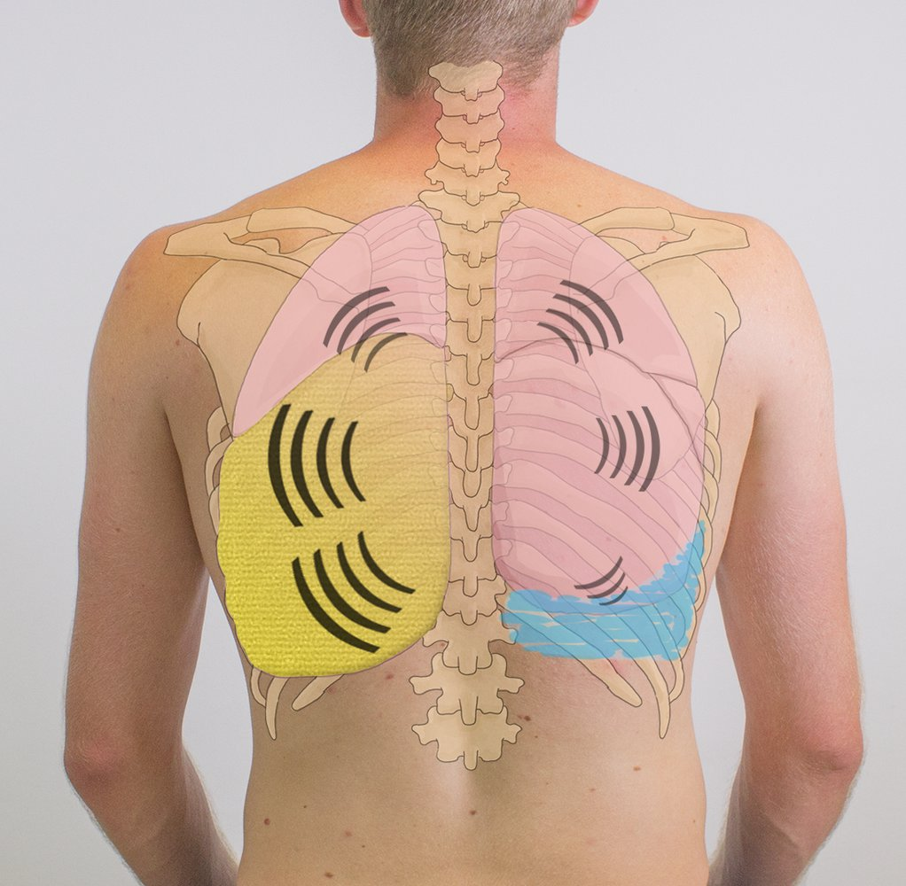

Tactile fremitus

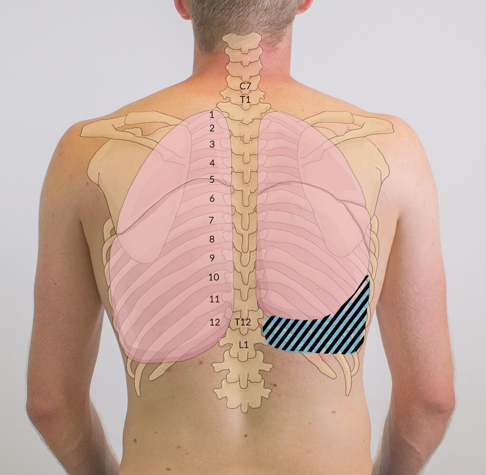

Right pleural effusion

Examination of the Lungs - Clinical Examination

---

## Diagnosis

### Approach

* Imaging is necessary to confirm the diagnosis.

* Consider <u>diagnostic thoracentesis</u> if the diagnosis is uncertain or management requires additional information (e.g., culture, <u>cytology</u>).

* Consider additional diagnostic procedures (e.g., <u>bronchoscopy</u>, <u>VATS</u>) if the diagnosis remains unclear.

### Chest x-ray for pleural effusion [[4]](https://coursology-qbank.com/amboss/article/35YSPp)[[5]](https://coursology-qbank.com/amboss/article/K_YU67)

* Indications

* Standard initial imaging modality for detecting pleural effusion.

* <u>Lateral decubitus view</u> (most sensitive): allows for detection of fluid collections as small as 5 mL  [[6]](https://coursology-qbank.com/amboss/article/LpYwJJ)

* Supportive findings

* Typically unilateral blunting of the <u>costophrenic angle</u>

* Homogeneous density with a <u>meniscus</u>-shaped margin (meniscus sign)

* Large effusion

* Complete opacification of the <u>lung</u>

* <u>Mediastinal</u> shift

* <u>Tracheal deviation</u> away from the effusion (space-occupying lesion)

* Disease-specific signs: See “<u>Pleural empyema</u>”, “<u>Lung cancer</u>”, “Active <u>primary tuberculosis</u>”, "<u>Pneumonia diagnostics</u>”, and “<u>Pneumothorax</u>.”

> [!WARNING]
> <u>Supine</u> <u>CXR</u> has poor <u>sensitivity</u> for pleural effusions, and effusions < 200 mL may not be visible on frontal upright <u>CXR</u>. Include <u>lateral</u> upright and <u>lateral</u> <u>decubitus</u> views whenever possible when obtaining radiographs. [[3]](https://coursology-qbank.com/amboss/article/BAYzN7)[[4]](https://coursology-qbank.com/amboss/article/35YSPp)[[6]](https://coursology-qbank.com/amboss/article/LpYwJJ)

> [!WARNING]
> <u>False positives</u> for pleural effusions on <u>CXR</u> include elevated hemidiaphragm, <u>atelectasis</u>, consolidation, mass lesions.

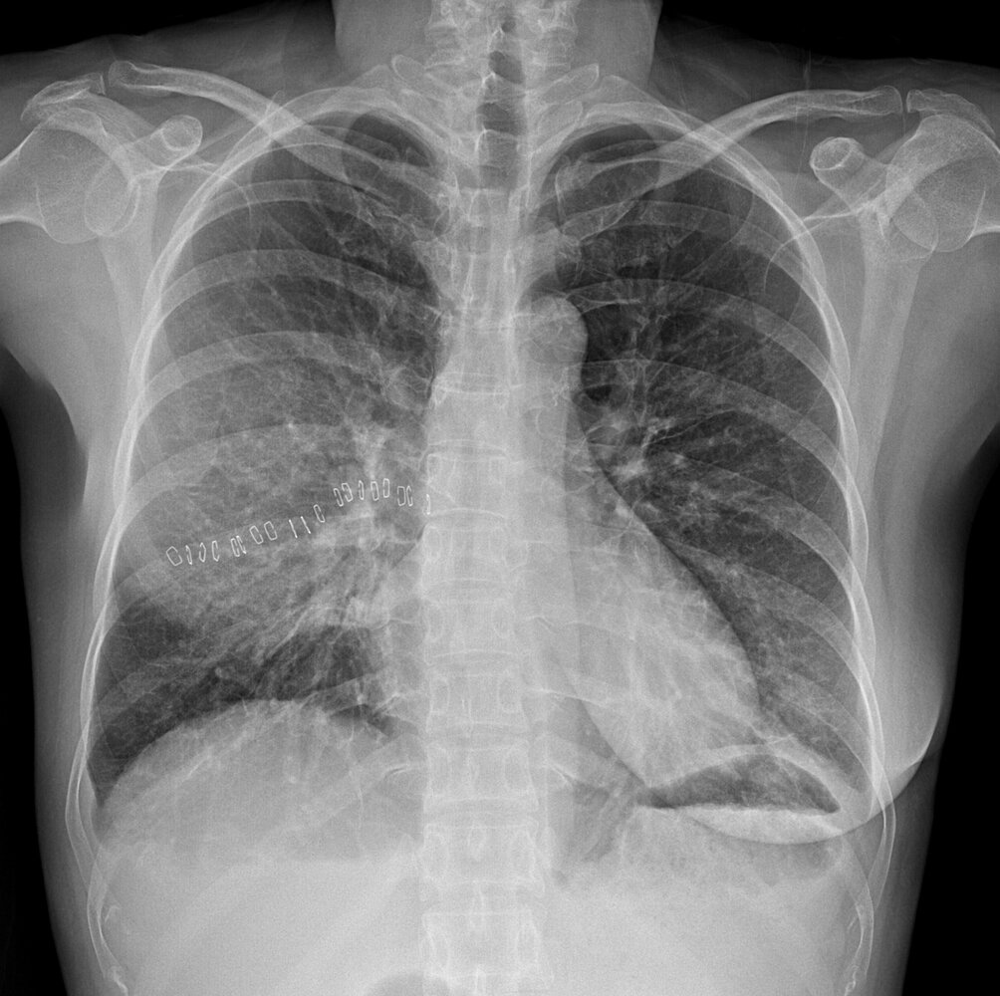

Costophrenic sulcus blunting from pleural effusion

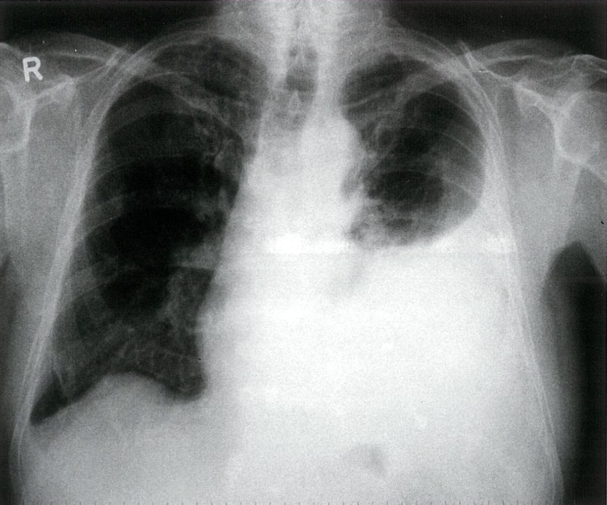

Left-sided pleural effusion in malignant mesothelioma (1/2)

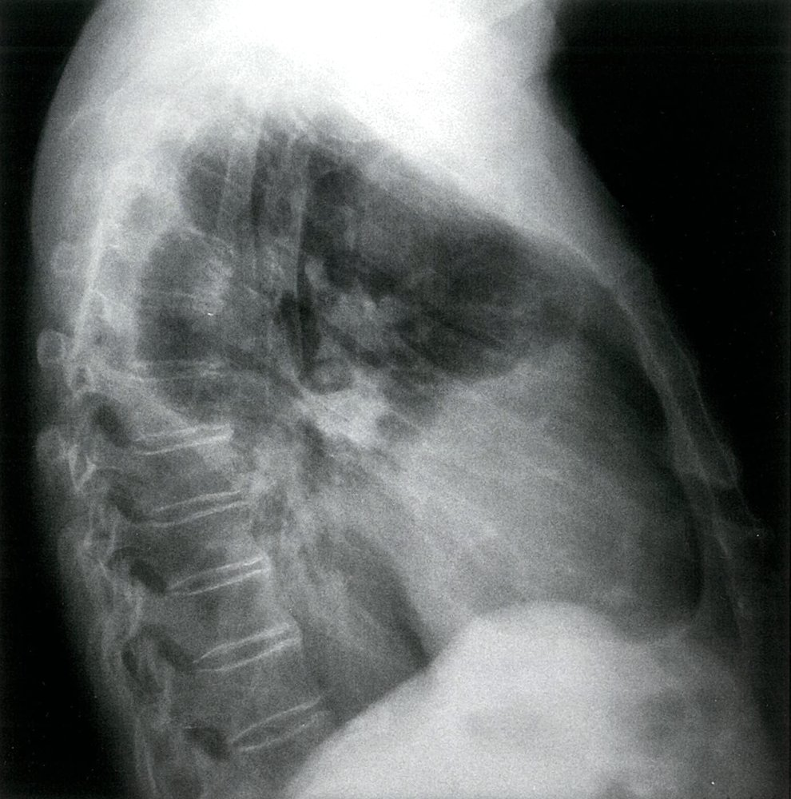

Left-sided pleural effusion in malignant mesothelioma (2/2)

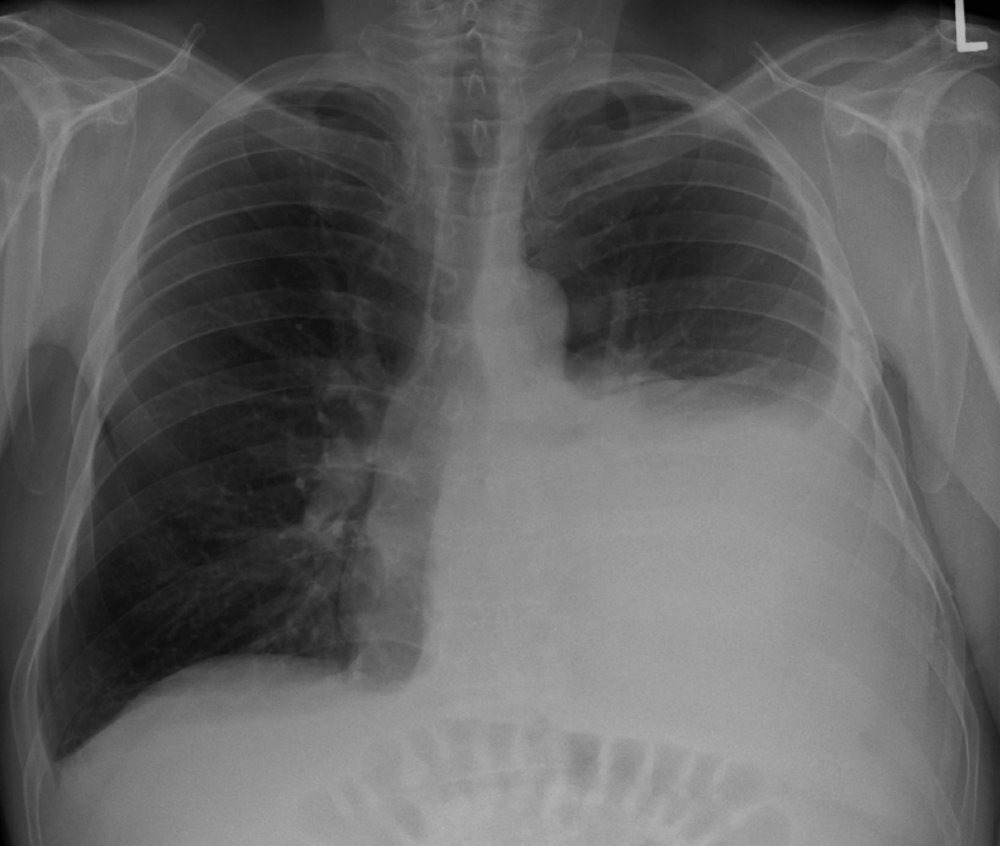

Pleural effusion and passive atelectasis

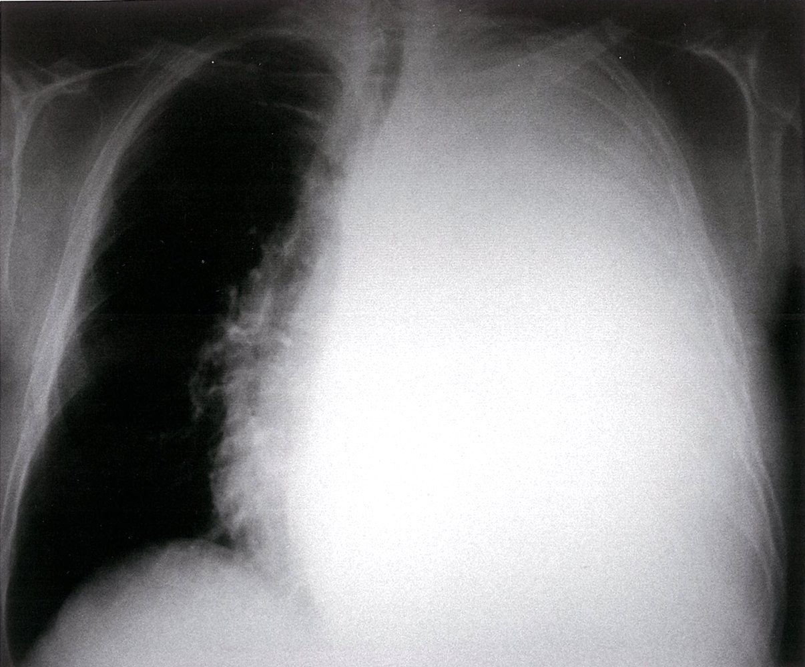

Pleural effusion with mediastinal shift

### Thoracic ultrasound for pleural effusion [[4]](https://coursology-qbank.com/amboss/article/35YSPp)[[7]](https://coursology-qbank.com/amboss/article/3MYSop)

* Indications

* Quick bedside assessment

* <u>Thoracentesis</u> planning

* Procedure: See;  “<u>Lung POCUS</u>” and “<u>eFAST</u>.”

* Ultrasound findings suggestive of pleural effusion: <u>hypoechoic</u> or <u>anechoic</u> collection in the lower margins of the <u>pleural cavity</u> (<u>costodiaphragmatic recess</u>) 

* Very sensitive: can detect fluid amounts as low as 20 mL

* <u>Hemothorax</u> and <u>empyema</u> may appear heterogeneous.

* <u>Pleural fluid</u> septations may be present.

* Allows for detection of pleural thickening and pleural <u>nodules</u>

> [!TIP]
> Thoracic <u>ultrasound</u> is more sensitive than <u>chest x-ray</u> for diagnosing effusions and estimating effusion size. [[8]](https://coursology-qbank.com/amboss/article/a-cQDU0)

> [!WARNING]
> <u>False positives</u> on <u>ultrasound</u> can result if the following are mistaken for <u>pleural fluid</u>: subdiaphragmatic fluid (e.g., <u>ascites</u>), <u>pericardial</u> fluid, contained fluid (e.g., <u>hypoechoic</u> masses, <u>abscesses</u>), or pleural thickening. <u>False negatives</u> may result if clotted blood or <u>empyema</u> fluid is mistaken for normal <u>lung</u> or <u>liver</u> tissue. [[9]](https://coursology-qbank.com/amboss/article/ebbxsH)

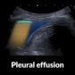

AMBOSS POCUS series | Pleural effusion

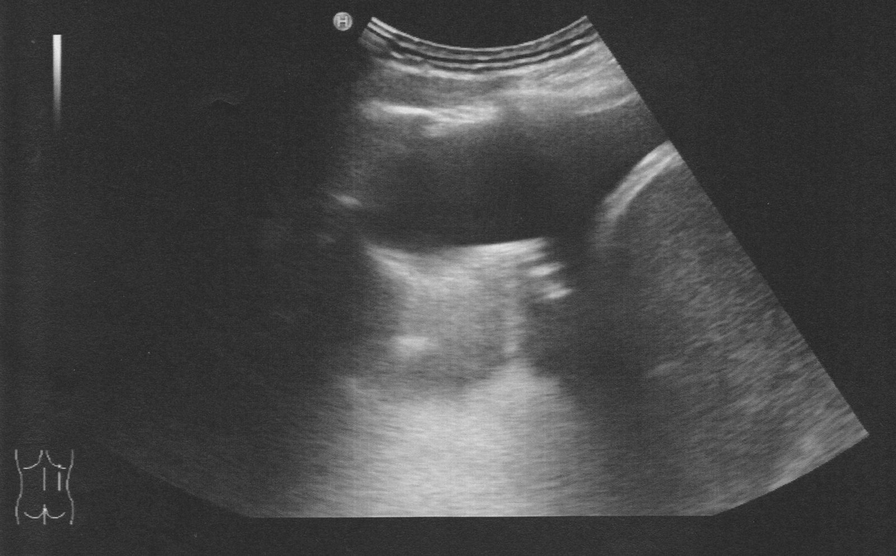

Pleural effusion

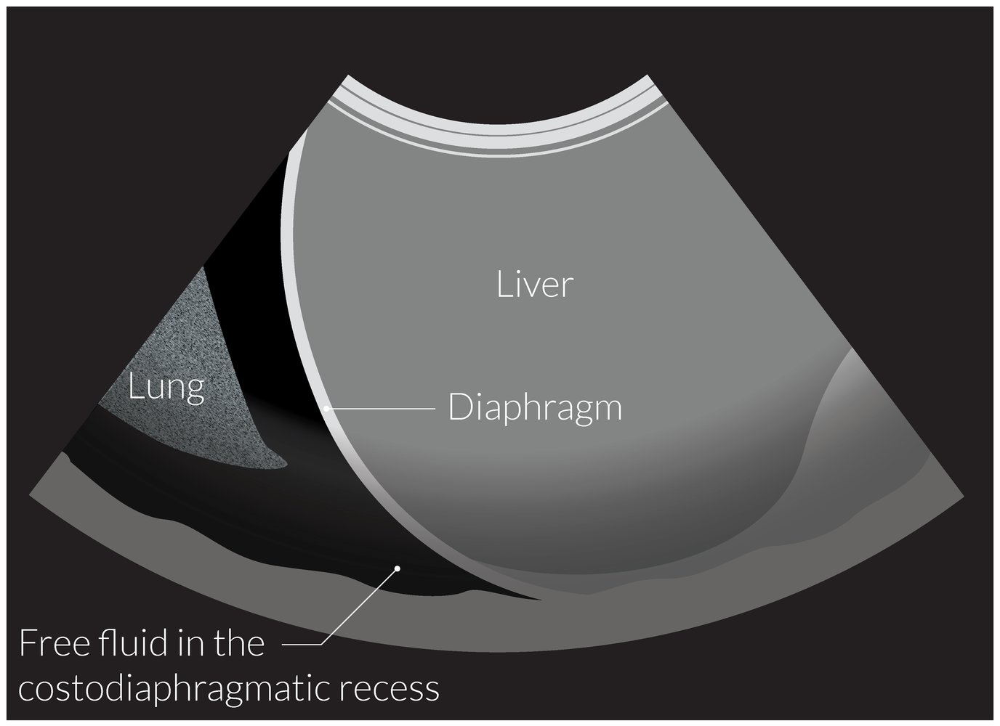

Fluid in the right costodiaphragmatic recess

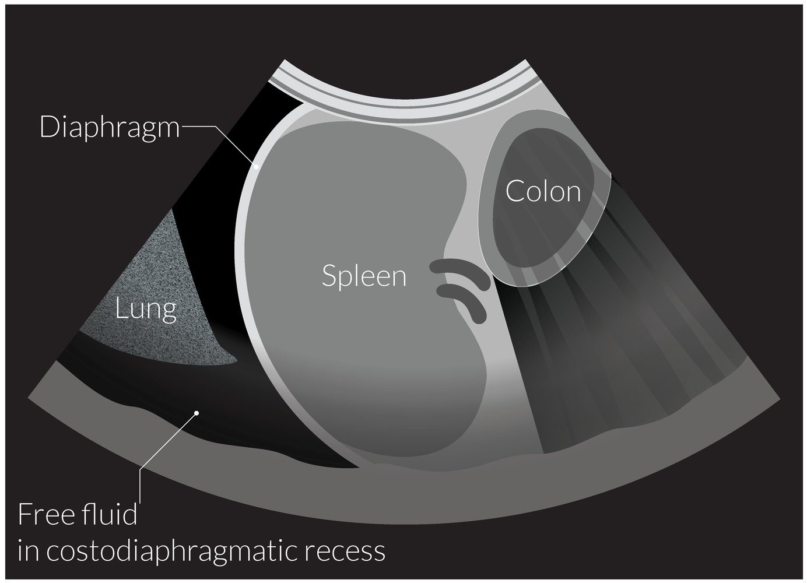

Fluid in the left costodiaphragmatic recess

### Chest CT [[4]](https://coursology-qbank.com/amboss/article/35YSPp)[[7]](https://coursology-qbank.com/amboss/article/3MYSop)

* Indications: <u>gold standard</u> ; for small effusions but use is limited because of radiation and contrast exposure

* Guiding placement of <u>indwelling pleural catheters</u>

* Directed <u>thoracentesis</u> of a <u>loculated</u> effusion

* Suspected <u>parenchymal</u> or pleural pathology

* Better quantification of the amount of fluid (compared to <u>CXR</u>) is desired

* Procedure: chest CT without IV contrast is usually sufficient

* With IV contrast: allows for the detection of underlying <u>malignancy</u> (e.g., <u>metastases</u> and/or primary <u>tumor</u>)

* <u>CT angiogram</u>: helps to identify vascular pathology (e.g., dissection or <u>AVM</u>)

* Supportive findings 

* Can detect > 3–5 mL of fluid

* Fluid density measurement can help differentiate pleural effusion from <u>empyema</u> and <u>hemothorax</u>  [[10]](https://coursology-qbank.com/amboss/article/p_YL67)

* Disease-specific signs: See “<u>Pleural empyema</u>.”

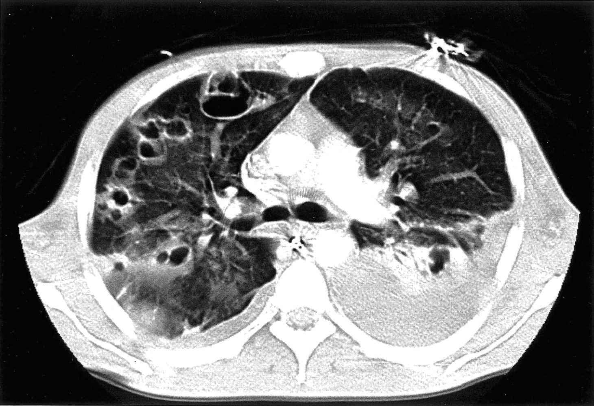

Multiple cavitary lung lesions

Bilateral pleural effusion

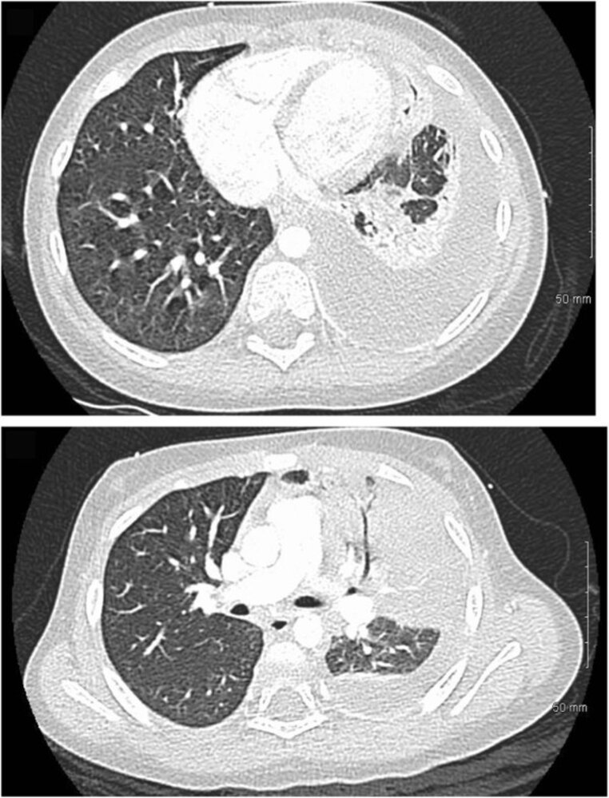

Pneumonia with parapneumonic effusion

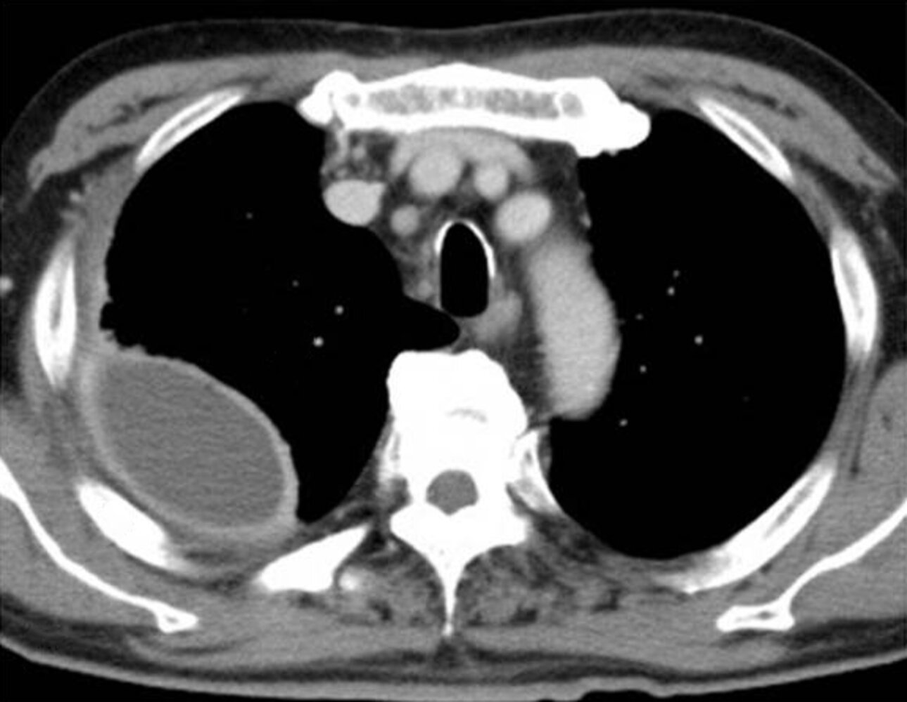

Split-pleura sign

### <u>Diagnostic thoracentesis</u> [[3]](https://coursology-qbank.com/amboss/article/BAYzN7)[[11]](https://coursology-qbank.com/amboss/article/3wYSir)

Can be combined with <u>therapeutic thoracentesis</u> if both are indicated. See “<u>Thoracentesis</u>” for detailed indications, contraindications, procedural steps, and complications.

* Goal: obtain samples for <u>pleural fluid analysis</u>, e.g., to <u>differentiate transudates from exudates</u>, and identify the underlying <u>cause of pleural effusion</u>

* Indications:  include new unilateral pleural effusions and bilateral effusions with atypical features (e.g., <u>fever</u>, <u>chest pain</u>, variable size).

* Routine <u>pleural fluid</u> studies 

* Biochemistry: protein, <u>LDH</u>, <u>pH</u>, and <u>glucose</u>

* <u>Gram stain</u> and culture

* <u>Cytology</u>

* Serum studies (for comparison): <u>serum protein</u>, <u>LDH</u>, <u>pH</u>, and <u>glucose</u>

* Advanced <u>pleural fluid</u> studies (case by case)

* Cell count

* Lipids: <u>cholesterol</u>, <u>triglycerides</u>

* <u>Amylase</u>, <u>lipase</u>

* <u>TB testing</u>: <u>adenosine deaminase</u>, <u>AFB smear microscopy</u>

* Parasitology

* <u>Tumor markers</u>

* Rheumatological markers

* <u>NT-proBNP</u>

### Additional studies [[6]](https://coursology-qbank.com/amboss/article/LpYwJJ)

* <u>Laboratory studies</u>: may be indicated further workup of <u>transudative effusions</u>.

* Elevated serum <u>NT-proBNP</u>: suggests <u>heart failure</u>

* ↑ <u>Liver</u> <u>transaminases</u>, ↓ serum <u>albumin</u>, and abnormal <u>coagulation studies</u>: suggests <u>cirrhosis</u>

* <u>Proteinuria</u>: suggests <u>nephrotic syndrome</u>

* ↑ Serum <u>TSH</u>: suggests <u>hypothyroidism</u>

* Invasive tests: Consider for patients with inconclusive <u>pleural fluid analysis</u> to rule out <u>malignancy</u> or intracellular infection.

* <u>Bronchoscopy</u>

* Percutaneous needle <u>biopsy</u>

* <u>VATS</u>

---

## Pleural fluid analysis

### Differentiating transudates from exudates [[3]](https://coursology-qbank.com/amboss/article/BAYzN7)[[6]](https://coursology-qbank.com/amboss/article/LpYwJJ)[[7]](https://coursology-qbank.com/amboss/article/3MYSop)[[12]](https://coursology-qbank.com/amboss/article/3_YSL7)[[13]](https://coursology-qbank.com/amboss/article/g_YFn7)

| Primary pleural fluid analysis |  |  |  |
| --- | --- | --- | --- |
| Laboratory parameters |  | <u>Transudative effusion</u> | <u>Exudative</u> effusion |
|  Light criteria   | <u>Pleural fluid</u> protein/<u>serum protein</u> <u>ratio</u> |  * ≤ 0.5   |  * > 0.5   |
| <u>Pleural fluid</u> <u>LDH</u>/serum <u>LDH</u> <u>ratio</u> |  * ≤ 0.6   |  * > 0.6   |  |
| <u>Pleural fluid</u> <u>LDH</u> |  * < ⅔ the <u>upper limit of normal</u> serum <u>LDH</u>   |   * <u>Pleural fluid</u> <u>LDH</u> > ⅔ the <u>upper limit of normal</u> serum <u>LDH</u>  * Very high <u>LDH</u> levels, e.g., > 1000 U/L, suggest <u>empyema</u>, <u>malignancy</u>, or rheumatoid effusion.    |  |
|  <u>Pleural fluid</u> <u>cholesterol</u>   |  |  * < 45 mg/dL   |  * > 55 mg/dL   |
|  <u>Pleural fluid</u> <u>LDH</u>   |  |  * < 200 U/L   |  * > 200 U/L   |
|  <u>Pleural fluid</u> <u>cholesterol</u>:serum <u>cholesterol</u> <u>ratio</u>   |  |  * < 0.3   |  * > 0.3   |

> [!WARNING]
> <u>Light criteria</u> are useful for ruling out an <u>exudate</u> if all criteria are assessed as the <u>sensitivity</u> is high. They are less reliable for ruling in an <u>exudate</u> as the <u>specificity</u> is poor and can misclassify ∼ 25% of <u>transudates</u> as <u>exudates</u>. Interpret results taking the full clinical picture into account. [[6]](https://coursology-qbank.com/amboss/article/LpYwJJ)[[14]](https://coursology-qbank.com/amboss/article/P_YWo7)

|  Adjunctive pleural fluid analysis [[3]](https://coursology-qbank.com/amboss/article/BAYzN7)[[7]](https://coursology-qbank.com/amboss/article/3MYSop)[[13]](https://coursology-qbank.com/amboss/article/g_YFn7)  |  |  |  |
| --- | --- | --- | --- |
| <u>Pleural fluid</u> parameter |  | Suggests <u>transudative effusion</u> | Suggests <u>exudative</u> effusion |
| Physical appearance |  |   * Clear fluid  * Does not froth or form clots    |   * Cloudy or straw-colored fluid (may be hemorrhagic in rare cases)  * Froths when shaken and forms clots when left standing    |
| Specific gravity |  |  * ≤ 1.016   |  * > 1.016   |
|  <u>pH</u> Normal <u>pH</u> ∼ 7.6  |  |  * 7.4–7.55   |  * < 7.3–7.45   |
| <u>Glucose</u> |  |  * ≥ 60 mg/dL   |  * < 60 mg/dL   |
|  Total protein gradient (i.e., the difference between <u>pleural fluid</u> and serum total protein) |  |  * > 3.1 g/dL lower than serum total protein   |  * < 3.1 g/dL lower than serum total protein   |
| <u>Albumin</u> gradient |  |  * > 1.2 g/dL lower than serum <u>albumin</u>   |  * < 1.2 g/dL lower than serum <u>albumin</u>   |

### Narrowing the differential diagnosis of <u>exudative</u> effusions [[3]](https://coursology-qbank.com/amboss/article/BAYzN7)[[7]](https://coursology-qbank.com/amboss/article/3MYSop)[[13]](https://coursology-qbank.com/amboss/article/g_YFn7)

| Differential diagnosis of <u>exudative</u> effusions |  |  |
| --- | --- | --- |
| <u>Pleural fluid</u> parameter |  |  Associated conditions [[2]](https://coursology-qbank.com/amboss/article/RjYlZ6)[[11]](https://coursology-qbank.com/amboss/article/3wYSir)[[15]](https://coursology-qbank.com/amboss/article/_uY5FI)  |
| Cell count and differential | <u>WBC count</u> > 10,000/mm³ |   * <u>Parapneumonic effusion</u>  * <u>Pancreatitis</u>  * <u>Pulmonary embolism</u>  * <u>Collagen vascular disease</u>    |
| <u>Neutrophils</u> > 50% of total <u>leukocytes</u> |   * Acute infection  * <u>Pulmonary infarct</u>    |  |
| <u>Lymphocytes</u> > 50% of total <u>leukocytes</u> |   * Primary or chronic tuberculous infection  * <u>Malignant effusion</u>  * <u>Chylothorax</u>    |  |
|  <u>RBC count</u> > 5,000/mm³  |   * <u>Hemothorax</u>  * <u>Malignant effusion</u> (i.e., bleeding <u>tumor</u>)  * <u>Pulmonary embolism</u>/<u>infarct</u>    |  |
| <u>Hematocrit</u> > 0.5 × peripheral <u>hematocrit</u> |  |  * <u>Hemothorax</u>   |
|  <u>pH</u> < 7.2 [[15]](https://coursology-qbank.com/amboss/article/_uY5FI)  |  |   * <u>Complicated parapneumonic effusion</u>  * <u>Empyema</u>  * <u>Malignant effusion</u>  * <u>Esophageal perforation</u>  * <u>Collagen vascular disease</u>    |
|  <u>Glucose</u> < 60 mg/dL   |  |   * <u>Malignant effusion</u>  * <u>Parapneumonic effusion</u>  * <u>Empyema</u>  * Rheumatoid <u>pleurisy</u>  * <u>Tuberculous pleurisy</u>  * <u>Esophageal rupture</u>  * <u>Lupus</u> <u>pleuritis</u>    |
| Positive <u>Gram stain</u> or culture |  |   * <u>Parapneumonic effusion</u>  * <u>Empyema</u>    |
|  <u>Adenosine deaminase</u> > 50 IU/L Positive <u>AFB smear microscopy</u>  |  |  * Tuberculous effusion   |
|  Abnormal <u>cytology</u>    |  |  * <u>Malignant effusion</u>   |
| <u>Amylase</u> > 200 IU/L |  |   * <u>Pancreatitis</u>  * <u>Malignant effusion</u>  * <u>Esophageal perforation</u>  * <u>Ruptured ectopic pregnancy</u>    |
| Positive <u>rheumatoid factor</u>, <u>ANA</u> |  |  * <u>Collagen vascular diseases</u>   |
| Lipids | <u>Triglycerides</u> > 110 mg/dL |   * <u>Chylothorax</u>  * Tuberculous effusion  * Accidental intrathoracic leak of <u>TPN</u> solution    |
|  Total <u>cholesterol</u> > 200 mg/dL Total <u>cholesterol</u>:<u>triglyceride</u> <u>ratio</u> > 1 <u>Cholesterol</u> crystals  |  * <u>Pseudochylothorax</u>   |  |
|  Total <u>cholesterol</u> 55–200 mg/dL <u>Chylomicrons</u> and <u>fat-soluble vitamins</u>  |  * <u>Chylothorax</u>   |  |
| Appearance | Cloudy, milky |   * <u>Chylothorax</u>  * <u>Pseudochylothorax</u>    |
| <u>Purulent</u> |   * <u>Parapneumonic effusion</u>  * <u>Empyema</u>    |  |
| Bloody |   * <u>Hemothorax</u>  * <u>Malignant effusion</u>  * <u>Pulmonary embolism</u>/<u>infarct</u>    |  |

> [!NOTE]
> <u>Transudate</u> is usually clear, has a decreased cell count, and has low levels of protein, <u>albumin</u>, and <u>LDH</u>. <u>Exudate</u> typically appears cloudy, has an increased cell count, and has high levels of protein, <u>albumin</u>, and <u>LDH</u>.

> [!NOTE]
> MEAT has low <u>glucose</u>: Malignancy, Empyema, Arthritis (rheumatoid <u>pleurisy</u>), and Tuberculosis are causes of pulmonary effusion associated with low <u>glucose</u> levels.

> [!WARNING]
> <u>Pleural fluid</u> with a bloody appearance suggests a malignant etiology or <u>hemothorax</u>!

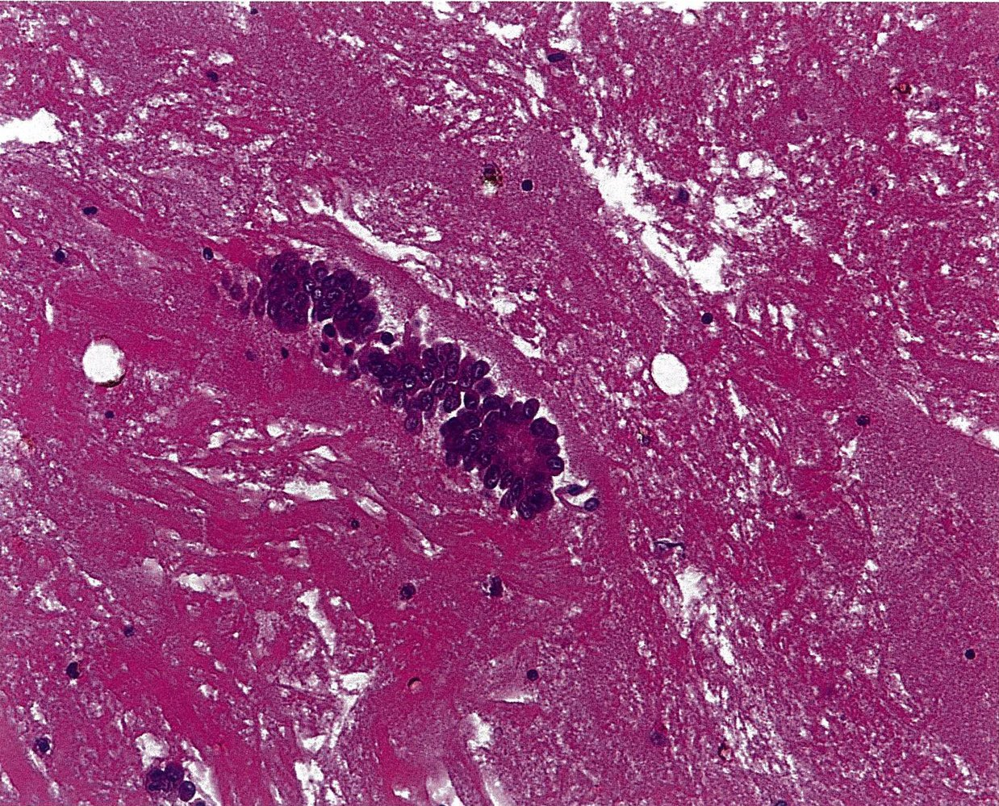

Malignant pleural effusion secondary to ovarian cancer

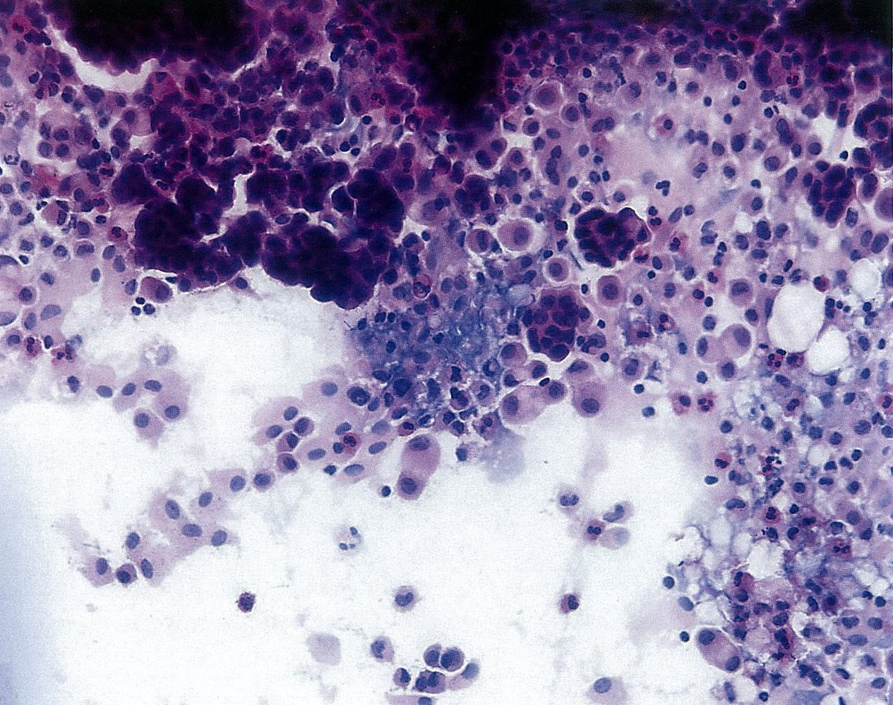

Malignant pleural effusion secondary to ovarian cancer

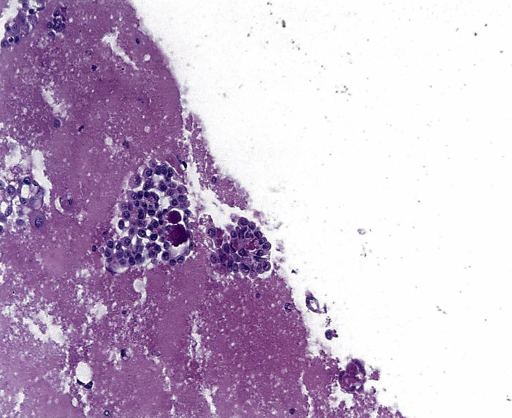

Malignant pleural effusion secondary to ovarian cancer

---

## Treatment

### Treatment of the underlying cause [[6]](https://coursology-qbank.com/amboss/article/LpYwJJ)

* Acute <u>congestive heart failure</u>: <u>loop diuretics</u> (see “<u>Treatment of heart failure</u>”)

* <u>Collagen vascular diseases</u>: <u>steroids</u> (see “<u>Systemic lupus erythematosus</u>” and “<u>Rheumatoid arthritis</u>”)

* <u>Pancreatitis</u>: See “<u>Treatment of acute pancreatitis</u>.”

* Pancreaticopleural <u>fistula</u>: Endoscopic or surgical intervention is recommended.  [[21]](https://coursology-qbank.com/amboss/article/l_Yvo7)[[22]](https://coursology-qbank.com/amboss/article/N_Y-o7)[[23]](https://coursology-qbank.com/amboss/article/m_YVK7)

* <u>Meigs syndrome</u>: Removal of the <u>ovarian tumor</u> is recommended.

* Other <u>malignancy</u>: targeted <u>cancer immunotherapy</u>, <u>chemotherapy</u>, <u>radiotherapy</u>, or surgical resection

> [!TIP]
> Consider <u>pulmonary embolism</u> as a potential cause of unexplained effusion; anticoagulation therapy may be initiated even in the presence of blood-tinged pleural effusion. [[24]](https://coursology-qbank.com/amboss/article/b-cHDU0)

### <u>Therapeutic thoracentesis</u> [[11]](https://coursology-qbank.com/amboss/article/3wYSir)

See “<u>Thoracentesis</u>” for detailed indications, contraindications, procedural steps, and complications.

* Goals: removal of <u>pleural fluid</u> that compromises cardiac and/or respiratory function and/or carries a risk of infection

* Indications include large symptomatic effusion (e.g., causing <u>hemodynamic instability</u> or <u>respiratory failure</u>), and <u>complicated parapneumonic effusions</u>.

* Complications include <u>re-expansion pulmonary edema</u>, infection, and injury.

> [!TIP]
> <u>Complicated parapneumonic effusions</u> should be drained due to a high risk of progression to <u>empyema</u>.

#### Re-expansion pulmonary edema [[25]](https://coursology-qbank.com/amboss/article/f_Ykn7)[[26]](https://coursology-qbank.com/amboss/article/T-Y697)

* Definition: <u>Self-limiting</u> <u>noncardiogenic pulmonary edema</u> that develops within 24 hours following rapid re-expansion of <u>lung tissue</u> that has collapsed as a result of air, <u>pleural fluid</u>, or mucus plugging; most commonly occurs as a complication of <u>therapeutic thoracentesis</u>.

* <u>Risk factors</u>

* Age 20–40 years

* <u>Diabetes</u>

* Collapsed <u>lung</u> for > 3–7 days

* > 1.5 L of fluid removed

* Large associated <u>pneumothorax</u>

* Clinical features

* <u>Dyspnea</u>, <u>increased work of breathing</u>

* <u>Cough</u>, frothy <u>sputum</u>

* <u>Tachycardia</u>, <u>tachypnea</u>, <u>hypoxemia</u>

* Diagnosis: confirmed by <u>CXR</u> or bedside <u>ultrasound</u>

* Treatment 

* <u>Supplemental oxygen</u>

* Severe cases: <u>NIPPV</u> or <u>invasive mechanical ventilation</u>

* Prevention  [[4]](https://coursology-qbank.com/amboss/article/35YSPp)[[27]](https://coursology-qbank.com/amboss/article/g-YF97)

* Limit <u>pleural fluid</u> removal to < 1.2–1.5 L at a time.

* Avoid pleural pressures < -20 cm H2O.

> [!WARNING]
> Stop <u>therapeutic thoracentesis</u> if patients develop chest discomfort, <u>cough</u>, or <u>hypoxia</u>, as this could represent <u>re-expansion pulmonary edema</u>

### Indwelling pleural catheter [[28]](https://coursology-qbank.com/amboss/article/AAYRm7)[[29]](https://coursology-qbank.com/amboss/article/_AY5m7)[[30]](https://coursology-qbank.com/amboss/article/zAYrm7)[[31]](https://coursology-qbank.com/amboss/article/j_Y_L7)

* Goal: recurrent <u>pleural fluid</u> removal without repeated puncture

* Indication: rapidly reaccumulating pleural effusions (e.g., <u>malignant effusions</u> )   [[30]](https://coursology-qbank.com/amboss/article/zAYrm7)[[31]](https://coursology-qbank.com/amboss/article/j_Y_L7)

* Contraindications: See “<u>Contraindications to thoracentesis</u>.”

* Procedure [[32]](https://coursology-qbank.com/amboss/article/5_YiK7)

* A pleural catheter is inserted under the guidance of interventional radiology.

* Similar to <u>thoracentesis</u>, except that the catheter is tunneled into the <u>skin</u> and can remain in situ for months.

* Complications [[32]](https://coursology-qbank.com/amboss/article/5_YiK7)[[33]](https://coursology-qbank.com/amboss/article/M_YMK7)

* <u>Pain</u>

* Mechanical: dislodgement, blockage, leak, tube <u>fracture</u>

* Infection: <u>cellulitis</u>, tunnel infection, <u>empyema</u>

* <u>Fibrosis</u> and <u>loculation</u> within the <u>pleural cavity</u>

* Catheter tract <u>metastasis</u> (i.e., deposition of malignant tissue at insertion site)

> [!TIP]
> Mild cases of <u>superficial</u> <u>cellulitis</u> can often be treated with <u>antibiotics</u> without the need for catheter removal. [[34]](https://coursology-qbank.com/amboss/article/Q11ugf0)

### Surgical procedures [[6]](https://coursology-qbank.com/amboss/article/LpYwJJ)

Consultation with a thoracic <u>surgeon</u> and/or chest physician is recommended.

#### <u>Tube thoracostomy</u>

* Indications

* Pleural effusion in combination with significant cardiac and/or respiratory decompensation [[35]](https://coursology-qbank.com/amboss/article/Z-aZDM)

* For recurrent pleural effusion or urgent drainage of infected and/or <u>loculated</u> effusions [[36]](https://coursology-qbank.com/amboss/article/4_Y3o7)[[37]](https://coursology-qbank.com/amboss/article/O_YIo7)

* Drainage of high-viscosity fluid that is likely to clog  [[38]](https://coursology-qbank.com/amboss/article/8CYOFr)[[39]](https://coursology-qbank.com/amboss/article/V-YGw7)

* <u>Empyema</u>

* <u>Hemothorax</u>

* Procedure: See “<u>Chest tube placement</u>.”

#### Video-assisted thoracoscopic surgery (<u>VATS</u>)

* Definition: a minimally invasive surgical method used for diagnosis and treatment of various thoracic pathologies

* Indications

* Collection of histological samples in <u>malignant effusions</u>

* Pleural <u>biopsy</u>

* Drainage of <u>parapneumonic effusions</u> that cannot be sufficiently controlled by <u>tube thoracostomy</u>

* Drainage of <u>pleural empyema</u> and <u>debridement</u> of <u>fibrin</u> deposits, adhesions, and <u>scar</u> tissue

#### Pleurodesis [[29]](https://coursology-qbank.com/amboss/article/_AY5m7)[[30]](https://coursology-qbank.com/amboss/article/zAYrm7)

* Definition: chemical or surgical obliteration of the <u>pleural space</u>

* Indication

* Recurrent <u>malignant effusions</u>  [[31]](https://coursology-qbank.com/amboss/article/j_Y_L7)

* Effusions that do not respond to drugs (e.g., <u>diuretics</u>, <u>antibiotics</u>)

* Contraindications [[28]](https://coursology-qbank.com/amboss/article/AAYRm7)

* Predicted survival < 3 months

* <u>Trapped lung</u>

* Procedure

* After draining the pleural effusion, a substance (e.g., talc) is introduced into the <u>pleural cavity</u>.

* This induces an inflammatory reaction that causes the pleural layers to bind together.

* Alternatively, thoracoscopic <u>pleurodesis</u> with partial resection of the pleural layers may be performed.

* Complication: <u>fibrothorax</u>

> [!TIP]
> A chest <u>x-ray</u> should be performed after each of these procedures to rule out <u>iatrogenic</u> <u>pneumothorax</u>

---

## Subtypes and variants

<u>Pleural fluid analysis</u> is necessary in almost all cases to distinguish between the various subtypes of pleural effusion. Treatment depends on the underlying cause. Subtypes of pleural effusion include the following:

* <u>Parapneumonic effusion</u>

* <u>Pleural empyema</u>

* <u>Nontraumatic hemothorax</u>

* <u>Malignant pleural effusion</u>

* <u>Chylothorax</u>

* <u>Pseudochylothorax</u>

---

## Parapneumonic effusion

### Definition [[3]](https://coursology-qbank.com/amboss/article/BAYzN7)[[40]](https://coursology-qbank.com/amboss/article/TYa6oQ)

* Accumulation of <u>exudative</u> fluid in the <u>pleural cavity</u> in response to <u>pneumonia</u>

* Uncomplicated: without direct bacterial invasion

* Complicated: extension of bacterial infection into the <u>pleural space</u>

### Distinguishing features [[4]](https://coursology-qbank.com/amboss/article/35YSPp)[[11]](https://coursology-qbank.com/amboss/article/3wYSir)[[15]](https://coursology-qbank.com/amboss/article/_uY5FI)[[40]](https://coursology-qbank.com/amboss/article/TYa6oQ)

* Clinical features

* <u>Fever</u>, chills

* <u>Cough</u>

* Chest discomfort

* Diagnostics

* Imaging: associated <u>pneumonia</u>

* <u>Pleural fluid analysis</u>

* <u>Exudative</u> effusion

* Cloudy or <u>purulent</u> appearance

* <u>WBC count</u> > 10,000/mm³

* Positive <u>Gram stain</u>/culture for <u>complicated parapneumonic effusion</u>

* <u>Pleural fluid</u> criteria for <u>complicated parapneumonic effusion</u>

* <u>pH</u> < 7.2

* ↑ <u>LDH</u>

* <u>Glucose</u> < 60 mg/dL

### Treatment [[11]](https://coursology-qbank.com/amboss/article/3wYSir)[[37]](https://coursology-qbank.com/amboss/article/O_YIo7)[[41]](https://coursology-qbank.com/amboss/article/lpYvpJ)[[42]](https://coursology-qbank.com/amboss/article/y8Yd6I)[[43]](https://coursology-qbank.com/amboss/article/k_Ymo7)

* All patients: systemic <u>antibiotic</u> treatment 

* Early <u>antibiotic</u> treatment can prevent progression to complicated effusion and <u>empyema</u>.

* See “<u>Pneumonia treatment</u>” for <u>empiric antibiotic</u> regimens.

* Patients with <u>complicated parapneumonic effusions</u>: <u>therapeutic thoracentesis</u>

* <u>Complicated parapneumonic effusions</u> at high risk of progression to <u>pleural empyema</u>: Consult <u>surgery</u> for surgical drainage.  [[20]](https://coursology-qbank.com/amboss/article/d-cowU0)

---

## Pleural empyema

### Definition [[40]](https://coursology-qbank.com/amboss/article/TYa6oQ)

* Accumulation of <u>pus</u> in the <u>pleural cavity</u>

### Etiology [[15]](https://coursology-qbank.com/amboss/article/_uY5FI)[[40]](https://coursology-qbank.com/amboss/article/TYa6oQ)

* Most common: <u>pneumonia</u>

* Less common

* Infected <u>hemothorax</u>

* Ruptured <u>lung abscess</u>

* Esophageal tear

* Thoracic trauma

### Classification [[44]](https://coursology-qbank.com/amboss/article/2-YT97)[[45]](https://coursology-qbank.com/amboss/article/hZbcYH)

* Stage I (<u>exudative</u>): accumulation of fluid and <u>pus</u>

* Stage II (fibrinopurulent): aggregation of <u>fibrin</u> deposits that form septations and pockets

* Stage III (organizing): formation of thick fibrous peel on pleural surface that restricts <u>lung</u> movement

### Distinguishing features [[40]](https://coursology-qbank.com/amboss/article/TYa6oQ)

* Clinical features

* <u>Fever</u>, chills

* <u>Cough</u>

* Chest discomfort

* Diagnostics

* <u>CXR</u>: will typically show opacity with one or more of the following characteristics [[46]](https://coursology-qbank.com/amboss/article/SXbyxH)

* <u>Meniscus sign</u>

* Lenticular shape

* Diffuse consolidation of adjacent <u>lung</u>

* <u>Ultrasound</u>: heterogeneous fluid collection

* Chest CT ;  [[10]](https://coursology-qbank.com/amboss/article/p_YL67)

* Distinctive appearance of <u>empyema</u> fluid

* Split pleura sign: thickening of <u>visceral</u> and <u>parietal pleura</u> caused by <u>fibrin</u> that adheres to the surfaces, resulting in vascular <u>proliferation</u>

* Septations

* Displacement and compression of the adjacent <u>lung</u>

* <u>Pleural fluid analysis</u>

* <u>Exudative</u> effusion

* Grossly <u>purulent</u> appearance

* Positive <u>Gram stain</u> and <u>bacterial culture</u>

* <u>pH</u> < 7.2

* Low <u>glucose</u> (30–60 mg/dL)

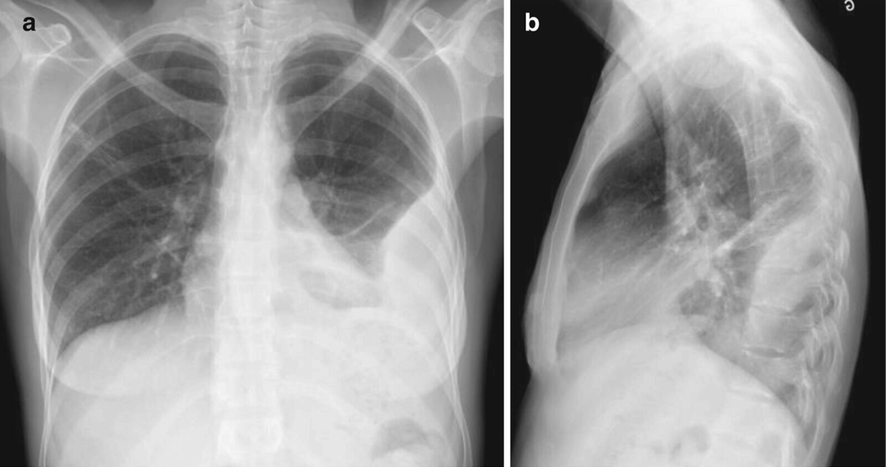

Loculated pleural collection (1/2)

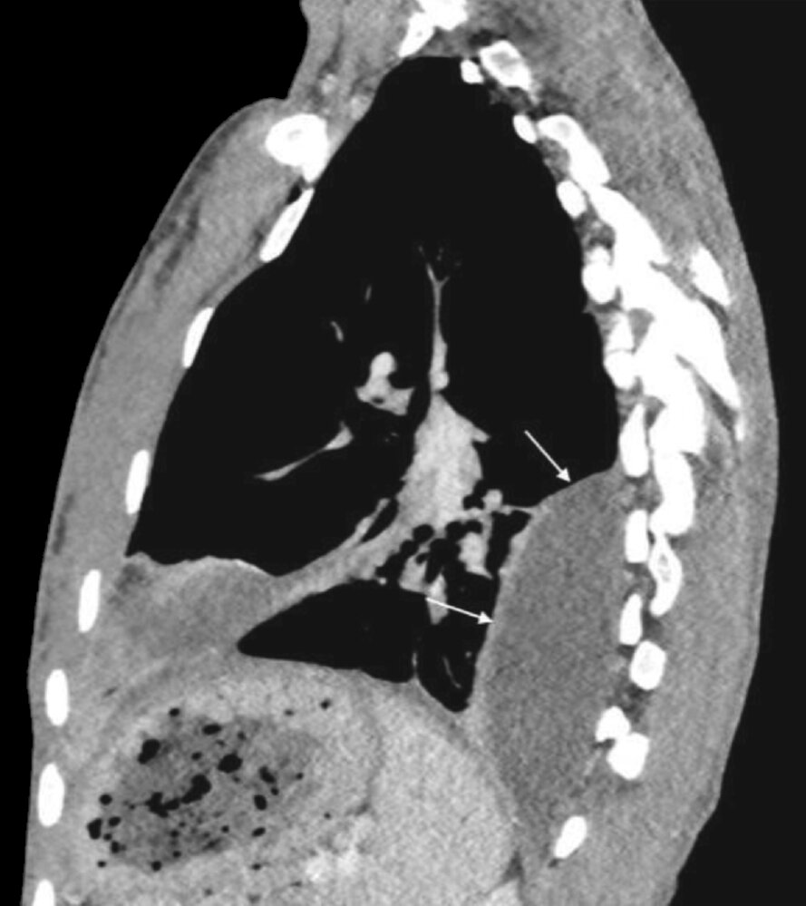

Loculated pleural collection (2/2)

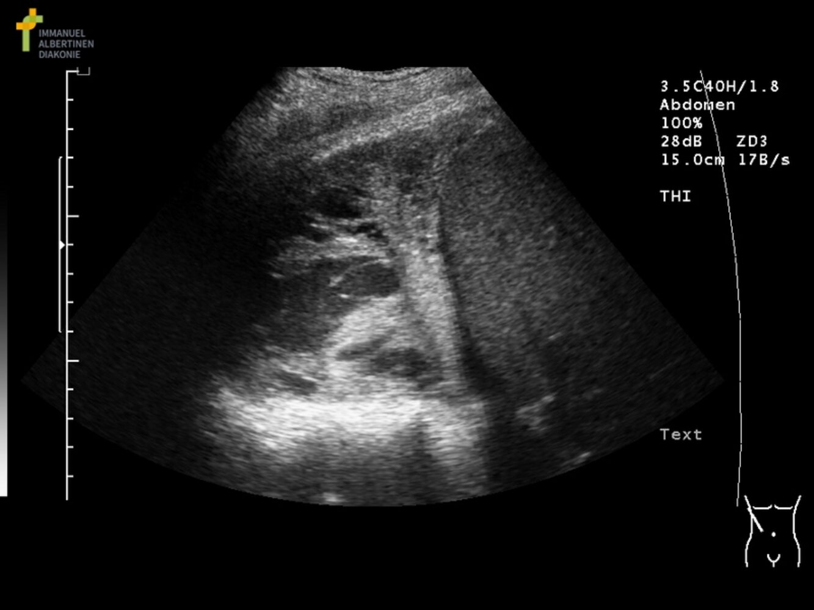

Complex septated pleural collection

Pneumonia with parapneumonic effusion

Split-pleura sign

### Treatment of pleural empyema

#### Empiric antibiotic therapy for pleural infection [[37]](https://coursology-qbank.com/amboss/article/O_YIo7)[[41]](https://coursology-qbank.com/amboss/article/lpYvpJ)[[42]](https://coursology-qbank.com/amboss/article/y8Yd6I)[[43]](https://coursology-qbank.com/amboss/article/k_Ymo7)

All patients should receive <u>empiric antibiotics</u> adjusted to their needs, local resistance patterns, and institutional guidelines.

* Community-acquired <u>pleural empyema</u>   [[44]](https://coursology-qbank.com/amboss/article/2-YT97)

* Combination therapy with a parenteral second- or third-generation <u>cephalosporin</u> (e.g., <u>ceftriaxone</u> DOSAGE) PLUS one of the following for anaerobic coverage:

* <u>Metronidazole</u> DOSAGE

* <u>Clindamycin</u> DOSAGE

* Or single-agent therapy with a parenteral <u>aminopenicillin</u> and <u>β-lactamase</u> inhibitor (e.g., <u>ampicillin-sulbactam</u> DOSAGE)

* Hospital-acquired <u>pleural empyema</u>: Add <u>MRSA</u> and <u>pseudomonal</u> coverage to the above. [[44]](https://coursology-qbank.com/amboss/article/2-YT97)
* <u>Vancomycin</u> DOSAGE PLUS one of the following:

* <u>Cefepime</u> DOSAGE and <u>metronidazole</u> DOSAGE

* <u>Piperacillin-tazobactam</u> DOSAGE

* <u>Meropenem</u> DOSAGE (if extended-spectrum <u>β-lactamase</u>-producing organisms are suspected)

* Additional considerations [[44]](https://coursology-qbank.com/amboss/article/2-YT97)

* <u>Aminoglycoside antibiotics</u> are not recommended because of poor pleural <u>bioavailability</u>.

* Use <u>empyema</u> fluid culture to guide therapy.

* Intrapleural <u>antibiotics</u> are not recommended.

* Drainage should be arranged as quickly as possible for source control.

* Duration of therapy depends on the identified organism, source control, and clinical response.

* See <u>tuberculosis therapy</u> for the treatment of suspected tuberculous effusion.

#### Definitive treatment [[44]](https://coursology-qbank.com/amboss/article/2-YT97)

* Stage I

* <u>Chest tube</u> (thoracostomy) to remove <u>empyema</u> fluid

* Consider intrapleural administration of fibrinolytic agents.

* Stage II or mixed stage II/III

* First-line: <u>chest tube</u> drainage

* Second-line: <u>VATS</u> <u>debridement</u>  if chest-tube drainage is ineffective

* Stage III 

* <u>VATS</u> <u>debridement</u>

* Pleurectomy and <u>lung decortication</u> via open <u>thoracotomy</u>

---

## Parapneumonic effusion vs. empyema

| Overview of parapneumonic effusion and empyema |  |  |  |  |
| --- | --- | --- | --- | --- |
|  |  | Uncomplicated <u>parapneumonic effusion</u> | <u>Complicated parapneumonic effusion</u> | <u>Pleural empyema</u> |
| Definition |  |  * Accumulation of <u>exudative</u> fluid in the <u>pleural cavity</u>   |  |  * Accumulation of <u>pus</u> in the <u>pleural cavity</u>   |
| Etiology |  |  * <u>Pneumonia</u>   |  |   * <u>Pneumonia</u> (most common)  * Infected <u>hemothorax</u>  * Ruptured <u>lung abscess</u>  * Esophageal tear  * Thoracic trauma    |
| Characteristics |  |  * <u>Exudative</u> effusion (without direct bacterial invasion)   |  * <u>Exudative</u> effusion (with bacterial invasion)   |  * <u>Exudative</u> effusion (bacterial <u>colonization</u>)   |
| Clinical features |  |   * <u>Fever</u>, chills  * <u>Cough</u>  * Chest discomfort    |  |  |
| Diagnostics | Imaging |  * <u>Chest x-ray</u>   |  |   * <u>Chest x-ray</u>  * Chest CT (<u>split pleura sign</u>)    |
| <u>Pleural fluid analysis</u> |   * <u>pH</u> > 7.2  * <u>Glucose</u>: normal/low  * ↑ <u>LDH</u>  * Appearance: slightly cloudy    |   * <u>pH</u> < 7.2  * <u>Glucose</u>: low  * ↑ <u>LDH</u>  * Appearance: cloudy    |   * <u>pH</u> < 7.2  * <u>Glucose</u>: low  * ↑ <u>LDH</u>  * Appearance: <u>purulent</u>    |  |
|  <u>Gram stain</u> and <u>blood culture</u> [[43]](https://coursology-qbank.com/amboss/article/k_Ymo7)[[44]](https://coursology-qbank.com/amboss/article/2-YT97)  |  * Negative   |  * May be positive   |  |  |
| Treatment |  |  * Systemic <u>antibiotic</u> treatment: prevents progression to complicated effusion and <u>empyema</u> (see “<u>Pneumonia treatment</u>”)   |   * Systemic <u>antibiotic</u> treatment (see “<u>Pneumonia treatment</u>”)  * <u>Chest tube</u> (thoracostomy)    |   * Systemic <u>antibiotic</u> treatment  * <u>Chest tube</u> (thoracostomy)    |

Costophrenic sulcus blunting from pleural effusion

Loculated pleural collection (1/2)

Pneumonia with parapneumonic effusion

Split-pleura sign

---

## Nontraumatic hemothorax

### Definition [[47]](https://coursology-qbank.com/amboss/article/PMYWKp)[[48]](https://coursology-qbank.com/amboss/article/J_Ys67)

* Spontaneous or nontraumatic accumulation of blood in the <u>pleural cavity</u>

### Etiology [[48]](https://coursology-qbank.com/amboss/article/J_Ys67)

* Most common: <u>spontaneous pneumothorax</u>

* Less common

* Vascular disease

* <u>Malignancy</u>

* <u>Coagulation disorders</u>

* <u>Necrotizing pneumonia</u> [[49]](https://coursology-qbank.com/amboss/article/xcbEes)

* <u>Endometriosis</u>

* <u>Bony exostoses</u>

* See ”<u>Penetrating trauma</u>” for traumatic causes.

### Distinguishing features

* Clinical

* Symptoms of an underlying disorder

* If there is significant blood loss: <u>hypotension</u>, <u>tachycardia</u>

* Diagnostics

* <u>CXR</u>: can show associated <u>pneumothorax</u> or <u>malignancy</u>

* <u>Ultrasound</u>: heterogeneous fluid collection

* Chest CT: hyperattenuating fluid collection; can reveal an underlying <u>malignancy</u>

* Chest <u>CTA</u>: allows for the identification of the source of hemorrhage (e.g., vascular abnormalities)

* <u>Pleural fluid analysis</u>

* Bloody appearance

* <u>RBC count</u> > 5,000/mm³

* <u>Hematocrit</u> > 0.5 × peripheral <u>hematocrit</u>

* <u>Laboratory studies</u>: ↓ <u>hemoglobin</u>

### Treatment of nontraumatic hemothorax [[47]](https://coursology-qbank.com/amboss/article/PMYWKp)[[48]](https://coursology-qbank.com/amboss/article/J_Ys67)

* Stabilize the patient.

* <u>Fluid resuscitation</u> and <u>blood transfusions</u> as needed (see “<u>Massive transfusion protocol</u>”)

* <u>Anticoagulant reversal</u> (if applicable)

* <u>Chest tube insertion</u> indicated for most patients

* <u>Urgent thoracotomy</u> indicated for <u>massive hemothorax</u> (rare)

* Identify and treat the underlying cause.

* Consult <u>surgery</u> or interventional radiology for bleeding from tumors or vascular pathology.

> [!TIP]
> A <u>hemothorax</u>, however small, must always be drained because blood in the <u>pleural cavity</u> will clot if not evacuated, resulting in a <u>trapped lung</u> or an <u>empyema</u>.

> [!WARNING]
> Use caution when inserting a <u>chest tube</u> if clinical and radiological signs suggest <u>hemothorax</u> secondary to <u>aortic dissection</u> or injury, as this may accelerate blood loss. [[17]](https://coursology-qbank.com/amboss/article/Ic1Ydf0)

---

## Malignant pleural effusion

### Description [[50]](https://coursology-qbank.com/amboss/article/XMY9Mp)

* Definition: accumulation of <u>exudative</u> fluid and malignant cells in the <u>pleural cavity</u>

* Pathophysiology: cancer-related barrier dysfunction of the <u>capillary</u> walls → increased permeation of <u>plasma protein</u>, blood cells, and <u>tumor</u> cells

### Etiology [[50]](https://coursology-qbank.com/amboss/article/XMY9Mp)

* Caused by either direct invasion of the <u>pleural space</u> or distant <u>metastases</u>

* Most common: <u>lung cancer</u>, <u>breast cancer</u>

* Less common: <u>mesothelioma</u>, <u>lymphoma</u>, and pleural <u>metastases</u>

### Distinguishing features [[50]](https://coursology-qbank.com/amboss/article/XMY9Mp)

* Clinical: symptoms of underlying <u>malignancy</u> (e.g., <u>constitutional symptoms</u>, <u>cachexia</u>, <u>hemoptysis</u>)

* Diagnostics

* Imaging: associated underlying <u>malignancy</u>

* <u>Pleural fluid analysis</u>

* Cell-rich <u>exudative</u> effusion

* Cloudy or straw-colored appearance

* Abnormal <u>cytology</u>  

* Pronounced nucleoli

* Cells with multiple <u>nuclei</u>

* Numerous figures of <u>mitosis</u>

* <u>pH</u> < 7.2

* <u>Glucose</u> < 60 mg/dL

* <u>Amylase</u> > 200 IU/L

* <u>LDH</u> usually high (> 0.45 x normal serum <u>LDH</u>)

* If hemorrhagic: bloody appearance, <u>RBC count</u> > 5,000/mm³

* <u>Laboratory studies</u>: positive <u>tumor markers</u>

Malignant pleural effusion secondary to ovarian cancer

Malignant pleural effusion secondary to ovarian cancer

Malignant pleural effusion secondary to ovarian cancer

### Treatment [[51]](https://coursology-qbank.com/amboss/article/hMYcop)

* Asymptomatic: <u>supportive care</u>

* Symptomatic

* <u>Therapeutic thoracentesis</u>

* <u>Indwelling pleural catheter</u>

* Chemical <u>pleurodesis</u>

* Treatment of underlying <u>malignancy</u> as needed

---

## Chylothorax

### Definition [[7]](https://coursology-qbank.com/amboss/article/3MYSop)

* Accumulation of lymphatic fluid from the <u>thoracic duct</u> (<u>chyle</u>) in the <u>pleural cavity</u>

### Etiology [[7]](https://coursology-qbank.com/amboss/article/3MYSop)

* Trauma (including <u>iatrogenic</u>)

* <u>Malignancy</u> (e.g., <u>lymphoma</u>, <u>bronchogenic carcinoma</u>)

* Congenital lymphatic anomalies (e.g., lymphangiectasis)

### Distinguishing features [[7]](https://coursology-qbank.com/amboss/article/3MYSop)

* Clinical: <u>Chest pain</u> is rare.

* Diagnostics [[2]](https://coursology-qbank.com/amboss/article/RjYlZ6)

* Chest CT: underlying <u>malignancy</u> or thoracic injury

* <u>Lymphangiography</u>: source of <u>chyle</u> leak or obstruction

* <u>Pleural fluid analysis</u>

* Cloudy, milky fluid with high concentrations of lipids (<u>triglycerides</u>, <u>cholesterol</u>, <u>chylomicrons</u>, and fat-soluble <u>vitamins</u>)

* <u>Exudative</u> effusion

* Total <u>cholesterol</u> usually < 200 mg/dL

* <u>Triglyceride</u> concentration > 110 mg/dL

* <u>LDH</u> usually low

* <u>Glucose</u> level similar to the plasma <u>glucose</u> level

* <u>Lymphocyte</u> predominance

### Treatment of chylothorax [[52]](https://coursology-qbank.com/amboss/article/6_Yj67)

* First-line conservative treatment of chylothorax

* <u>Total parenteral nutrition</u> and special diet

* Adjunctive medication: <u>somatostatin</u> and <u>octreotide</u>

* <u>Therapeutic thoracentesis</u> as needed based on symptoms and the patient's functional needs

* Treatment of underlying disorder

* Surgical treatment: via <u>thoracotomy</u>, <u>thoracoscopy</u>, or <u>VATS</u>

* Indications

* Unsuccessful <u>conservative treatment</u>

* Clinical deterioration (e.g., nutritional or metabolic)

* <u>Chyle</u> drainage

* > 1000–1500 mL/day

* Up to 1000 mL/day for ≥ 5 days

* Unchanged over 1–2 weeks

* Persistent <u>chyle</u> leak: > 100 mL/day for > 2 weeks

* Procedures

* <u>Thoracic duct</u>: leak repair or ligation

* <u>Pleura</u>: defect repair, <u>pleurodesis</u>, or pleurectomy

* Diversion of <u>chyle</u> into a <u>vein</u>, the <u>peritoneum</u>, or externally

* Interventional radiology

* Indications: an alternative for patients who cannot tolerate operative procedures and for whom the treatment is anatomically feasible

* Procedures

* <u>TIPS</u> procedure (for hepatic <u>chylothorax</u>)

* Embolization or disruption of the <u>lymph</u> ducts

* Percutaneous repair of the thoracic ducts

---

## Pseudochylothorax

### Definition [[7]](https://coursology-qbank.com/amboss/article/3MYSop)[[53]](https://coursology-qbank.com/amboss/article/ToY6YJ)

* Accumulation of <u>cholesterol</u>-rich fluid due to <u>chronic inflammation</u> in the <u>pleural cavity</u>

### Etiology [[7]](https://coursology-qbank.com/amboss/article/3MYSop)[[53]](https://coursology-qbank.com/amboss/article/ToY6YJ)

* Chronic pleural inflammation (e.g., due to underlying <u>rheumatoid arthritis</u>, <u>pulmonary tuberculosis</u>)

### Distinguishing features [[7]](https://coursology-qbank.com/amboss/article/3MYSop)[[53]](https://coursology-qbank.com/amboss/article/ToY6YJ)

* Clinical

* Chronic symptoms of underlying disorder

* <u>Dyspnea</u> and <u>chest pain</u> in ∼ 75% of patients [[53]](https://coursology-qbank.com/amboss/article/ToY6YJ)

* Diagnostics

* Imaging: signs of underlying disorder

* <u>Pleural fluid analysis</u> 

* Cloudy, milky appearance

* <u>Exudative</u> effusion

* Total <u>cholesterol</u> usually > 200 mg/dL

* <u>Triglyceride</u> concentration < 110 mg/dL

* Presence of <u>cholesterol</u> crystals

> [!NOTE]
> In contrast to <u>chylothorax</u>, a <u>pseudochylothorax</u> is characterized by <u>high cholesterol</u> and low <u>triglyceride</u> levels in the <u>pleural fluid</u>. The presence of <u>cholesterol</u> crystals may also help to differentiate a <u>pseudochylothorax</u> from a <u>chylothorax</u>.

### Treatment

* Identical to <u>first-line conservative treatment of chylothorax</u>  [[53]](https://coursology-qbank.com/amboss/article/ToY6YJ)

---