# Pulmonary examination

*Categories: Clinical knowledge > Surgery > Cardiothoracic surgery > Pulmonary examination*

[Original Article Link](https://coursology-qbank.com/amboss/article/tl0XAT)

---

## Summary

The examination of the pulmonary system is a fundamental part of the <u>physical examination</u> that consists of inspection, palpation, percussion, and <u>auscultation</u> (in that order). Recognition of surface landmarks and their relationship to underlying structures is essential. The <u>physical examination</u> of the pulmonary system begins with the patient seated comfortably on the examination table and his/her upper body completely exposed. The chest and the patient's breathing pattern are then inspected, followed by <u>palpation of the chest</u> wall, percussion of the thorax, and <u>auscultation of the lung fields</u>. A carefully recorded <u>medical history</u> and thorough <u>physical examination</u> allow for differential diagnosis and prompt initiation of therapy.

See also <u>differential diagnoses of dyspnea</u>.

---

## Inspection

The following should be assessed:

### Breathing pattern

* Normal respiratory rates

* 12–20/min in adults

* 30–60/min in <u>infants</u> and <u>neonates</u>

* See also “<u>Normal vital signs at rest</u>” for all age groups.

* Bradypnea 

* <u>Respiratory rate</u> < 12/min in adults

* < 30/min in <u>infants</u> and <u>neonates</u>

* < 40/min in <u>newborns</u>

* Tachypnea

* <u>Respiratory rate</u> > 20/min, shallow breathing in adults

* > 60/min in pediatric patients

* Hyperpnea: <u>respiratory rate</u> > 20/min, deep breathing

* Inspiratory:expiratory ratio: The <u>ratio</u> of the inspiratory time to expiratory time during spontaneous breathing, which is normally 1:2.

* Common abnormal patterns of breathing include: [[1]](https://coursology-qbank.com/amboss/article/cuXaJ-)

* Cheyne-Stokes breathing: alternating periods of deep breathing followed by <u>apnea</u>  

* Results from a delay in detecting changes in ventilation and arterial carbon dioxide pressure.

* Common causes include: <u>advanced heart failure</u>, damage to <u>respiratory centers</u> (e.g., <u>stroke</u>, <u>traumatic brain injuries</u>, <u>metabolic encephalopathies</u>), and <u>central sleep apnea</u>

* Ataxic breathing: irregular breathing in rhythm and depth

* Obstructive breathing: prolonged exhalation

Cheyne-Stokes respiration

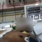

Cheyne–Stokes respiration or Periodic breathing

### Increased effort of breathing

* <u>Tachypnea</u>

* Use of <u>accessory muscles of respiration</u> during inspiration 

* Sternomastoid muscles

* <u>Scalene muscles</u>

* <u>Pectoralis major</u>

* <u>Trachea</u> off midline

* Tripod position: patients experiencing <u>respiratory distress</u>, particularly those with conditions like <u>asthma</u>, <u>COPD</u>, or other respiratory issues, will lean forward while sitting, resting with their hands on their knees.

Epiglottitis

### Peripheral signs of respiratory dysfunction

* Cyanosis: bluish discoloration of the <u>skin</u> and <u>mucosa</u> (due to <u>deoxygenated hemoglobin</u>)

#### Nail clubbing [[2]](https://coursology-qbank.com/amboss/article/8VYOwL)

* Definition: <u>Nail clubbing</u> is a physical finding characterized by painless swelling of the <u>distal</u> <u>phalanges</u> typically associated with chronic <u>hypoxemia</u>.

* Pathophysiology

* Not fully understood

* Hereditary factors may predispose to <u>clubbing</u>.

* Fibrovascular <u>proliferation</u> in the region of the <u>nail</u> bed due to accumulation of <u>megakaryocytes</u> and <u>platelets</u> in digital vessels and subsequent local <u>PDGF</u> and <u>VEGF</u> release is suggested.

* Associated conditions

* Respiratory conditions, such as:

* <u>Interstitial lung disease</u>

* <u>Idiopathic pulmonary fibrosis</u>

* <u>Cystic fibrosis</u>

* <u>Lung cancer</u>

* Cardiovascular conditions, such as:

* <u>Cyanotic congenital heart disease</u>

* Cardiac shunts

* Infections, such as:

* <u>Tuberculosis</u>

* Infections causing <u>lung abscesses</u>

* <u>Hypertrophic osteoarthropathy</u>: a syndrome (either hereditary or paraneoplastic) that manifests with painful <u>nail clubbing</u>, synovial effusions, and <u>periostitis</u>

* <u>IBD</u>

* Not associated with <u>COPD</u>, <u>asthma</u>

* Clinical features 

* Painless swelling of <u>connective tissue</u> in the <u>distal</u> <u>phalanges</u>

* Lovibond angle ≥ 180°: angle between the base of the <u>nail</u> and its surrounding <u>skin</u>

* <u>Nail</u> bed feels spongy when pressed and springs back when released.

* Schamroth test

* Place <u>distal</u> <u>phalanges</u> against each other so that both fingernails touch

* When there is <u>nail clubbing</u>, the normal diamond-shaped “window” between the <u>nail</u> beds will not be seen.

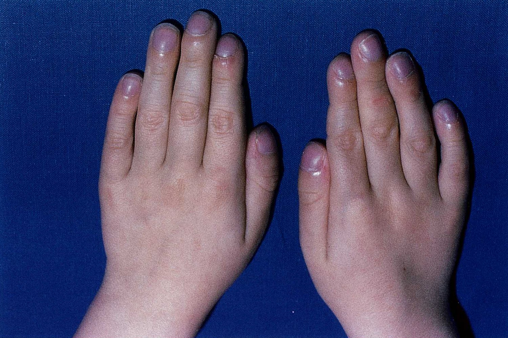

Finger clubbing and hippocratic nails in cystic fibrosis

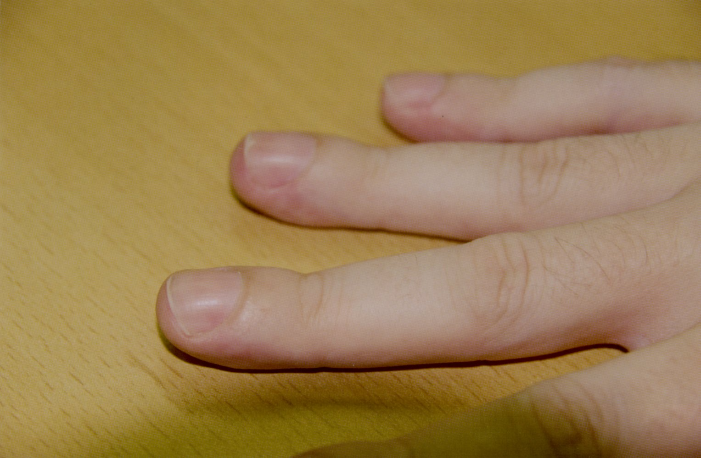

Digital clubbing in hypertrophic osteoarthropathy

Digital clubbing

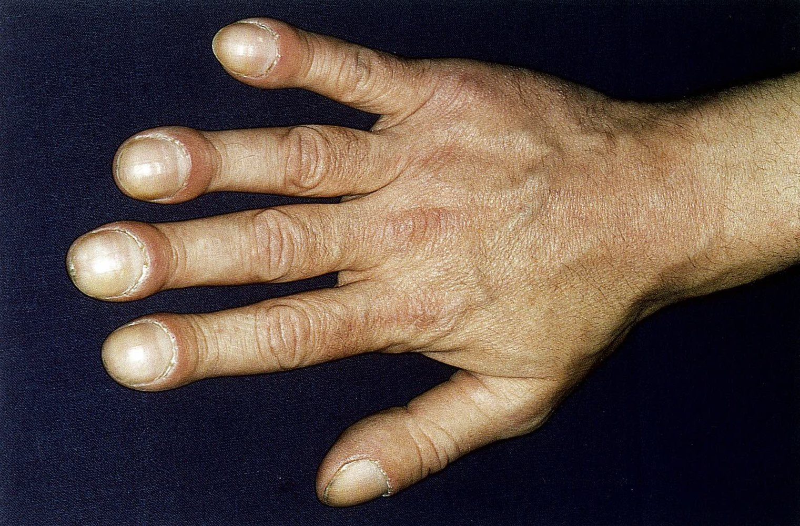

Hippocratic nails and finger clubbing

### Abnormalities in the shape of the thorax

* The <u>anteroposterior diameter</u> of the thorax may increase in <u>COPD</u>, leading to a “<u>barrel chest</u>” appearance.

* <u>Retraction</u> of the <u>intercostal spaces</u>

* Asymmetric movement may be associated with pleural disease, <u>phrenic nerve</u> damage, or <u>pleural effusion</u>.

* <u>Kyphosis</u> or <u>scoliosis</u> may lead to decreased <u>forced vital capacity</u>, <u>forced expiratory volume</u> and overall respiratory function

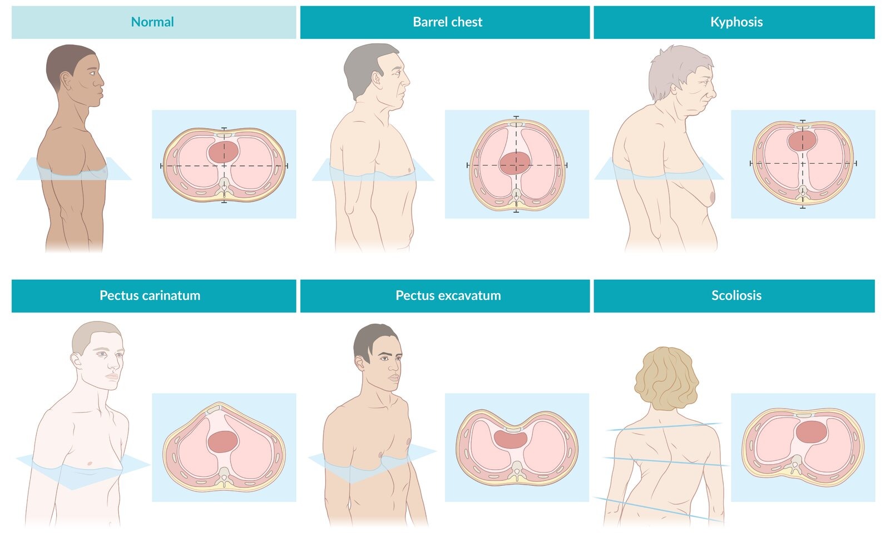

Thoracic deformities

### Sputum production or secretions, if any

* White and translucent: viral infection (for example, <u>bronchitis</u> that presents with a typical early-morning <u>cough</u>)

* White and foamy: <u>pulmonary edema</u>

* Yellow-green: bacterial infection

* Green: an indication of a <u>pseudomonal</u> infection

* Grayish: <u>pneumoconiosis</u>, a waning bacterial infection

* Blackish-brown: possibly old blood; should be further investigated (can also be a harmless incidental finding)

* <u>Friable</u>: <u>tuberculosis</u>, <u>actinomycosis</u>

* <u>Hemoptysis</u>: See "<u>Etiology of hemoptysis</u>.”

### In <u>newborn</u> and <u>infants</u>

* Jugular, sternal, and intercostal <u>retraction</u>

* <u>Nasal flaring</u> or flaring of the nostrils

* Neck extension

---

## Palpation

* General: Evaluate areas of tenderness or <u>bruising</u>.

* Symmetry of chest expansion

* Place both hands on the patient's back at the level of the 10th <u>ribs</u> with thumbs pointing medially and parallel to the <u>rib</u> cage.

* As the patient inhales, evaluate for asymmetric movement of your thumbs.

* Tactile fremitus

* Ask the patient to say “toy boat” and feel for vibrations transmitted throughout the <u>chest wall</u>.

* Can be asymmetrically decreased in effusion, obstruction, or <u>pneumothorax</u>, among others

* Can be asymmetrically increased in <u>pneumonia</u>

References:[[3]](https://coursology-qbank.com/amboss/article/W_0PMi)

---

## Percussion

* Technique

* Hyperextend the nondominant middle finger and place the <u>distal interphalangeal joint</u> against the <u>chest wall</u>.

* Strike the <u>joint</u> with the other middle finger and evaluate the elicited sound.

* Always percuss both sides of the chest at the same level. Often the finding of asymmetry is more important than the specific percussion note that is heard.

* Physiological finding: resonant percussion note (a comparatively hollow and loud note)

* Pathological findings

* Hyper-resonant percussion note

* Louder and hollower than normal

* Sign of increased air inside the <u>thoracic cavity</u>: <u>emphysema</u>, <u>bronchial asthma</u>, <u>pneumothorax</u>

* Dull percussion note

* Muffled and softer note

* Sign of fluid inside the <u>thoracic cavity</u>: <u>pneumonia</u>, <u>pleural effusion</u>

* Assess diaphragmatic movement

* Move downwards while percussing over both sides of the <u>chest wall</u>.

* The transition point from resonant to dull percussion notes marks the approximate position of the <u>diaphragm</u>.

* Abnormally high transition points on one side may be seen in unilateral <u>pleural effusion</u> and unilateral <u>diaphragmatic paralysis</u>.

* The distance between the transition point on full expiration and the transition point on full inspiration is the extent of diaphragmatic excursion (normally 1–2.2 in).

References:[[3]](https://coursology-qbank.com/amboss/article/W_0PMi)

---

## Auscultation

### Physiological breath sounds

* Vesicular breathing

* Soft and low pitched, through inspiration and part of expiration

* Heard over both <u>lungs</u>

* Bronchovesicular breathing

* Intermediate intensity and pitch, through both inspiration and expiration

* Heard over 1st and 2nd<u>intercostal spaces</u>

* Bronchial breathing

* Loud and high pitched, through part of inspiration and all of expiration

* Heard over the <u>sternum</u>

* Tracheal breathing

* Very loud and high pitched, through both inspiration and expiration

* Heard over the neck

* Cavernous breathing

* A harsh, hollow breath sound with high-pitched overtones heard on <u>lung auscultation</u>

* It is produced by air passing through a large, <u>superficial</u> cavity that communicates with the bronchial system (e.g., a cyst or <u>abscess</u>)

* Can not be heard if there is fluid or a fungal ball within the cavity

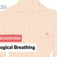

Physiological breathing - Lung Auscultation - Episode 1 LC

### Pathological breath sounds

* Also known as adventitious or added sounds

* Consider secretions (such as in <u>bronchitis</u>) if breath sounds clear after <u>coughing</u>

#### Types of <u>pathological breath sounds</u>

* Crackles or <u>rales</u>: discontinuous, intermittent

* Fine: soft, high-pitched (e.g., normal, <u>asbestosis</u>, <u>sarcoidosis</u>)

* Coarse: loud, low-pitched (e.g., <u>COPD</u>, <u>pulmonary edema</u>)  [[4]](https://coursology-qbank.com/amboss/article/1_02Mi)

* Wheezes (sibilant <u>wheezing</u>): musical, prolonged

* Rhonchi (<u>sonor wheezing</u>): low-pitched, snoring

* <u>Stridor</u>: high-pitched, over <u>trachea</u> ; may occur on:

* Inspiration (<u>inspiratory stridor</u>): narrowing of the extrathoracic <u>airway</u>; characteristic of <u>epiglottitis</u>, <u>pseudocroup</u>, <u>foreign body aspiration</u>, bilateral <u>vocal cord palsy</u>

* Expiration (<u>expiratory stridor</u>): obstruction of the intrathoracic <u>airways</u>; characteristic of <u>bronchial asthma</u>, <u>COPD</u>

* Inspiration and expiration (biphasic <u>stridor</u>): obstruction at the level of the <u>glottis</u>

* Pleural friction rub: scratchy, high-frequency sound

* Muffled or absent breath sounds: suggest presence of air or fluid between the <u>lung</u> and the <u>chest wall</u> (e.g., <u>pleural effusion</u>, <u>pneumothorax</u>)

Fine Crackles (Rales) - Lung Auscultation - Episode 2 LC

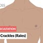

Coarse Crackles (Rales) - Lung Auscultation - Episode 3 LC

Sibilant Wheezing - Lung Auscultation - Episode 4 LC

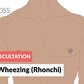

Sonor Wheezing (Rhonchi) - Lung Auscultation - Episode 5 LC

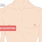

Stridor - Lung Auscultation - Episode 6 LC

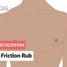

Pleural friction rub - Lung Auscultation - Episode 7 LC

Muffled Lung Sound - Lung Auscultation LC

#### Transmitted sounds

* Bronchophony

* Increased transmission of voice sounds

* Ask patient to say “ninety-nine” in a normal voice while <u>auscultating</u>.

* An asymmetric increase in voice transmission suggests a collapsed <u>lung</u> or <u>atelectasis</u>.

* Egophony

* Ask the patient to say “ee” while <u>auscultating</u>.

* If it sounds like “A” rather than “E”, this is called <u>egophony</u> and suggests <u>lobar pneumonia</u>.

* Whispered pectoriloquy

* Ask patient to whisper “ninety-nine” while <u>auscultating</u>.

* Normally this is barely audible.

* Clearly audible in the presence of <u>pulmonary consolidation</u>

Examination of the Lungs - Clinical Examination

Surface anatomy of the lungs

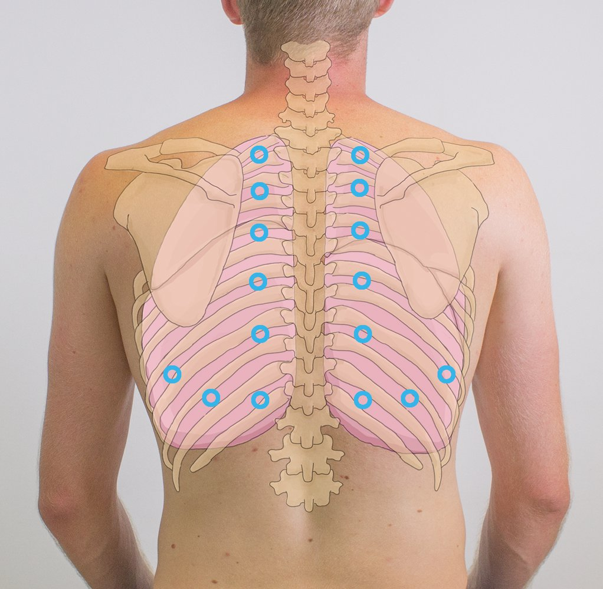

Percussion and auscultation of the lung

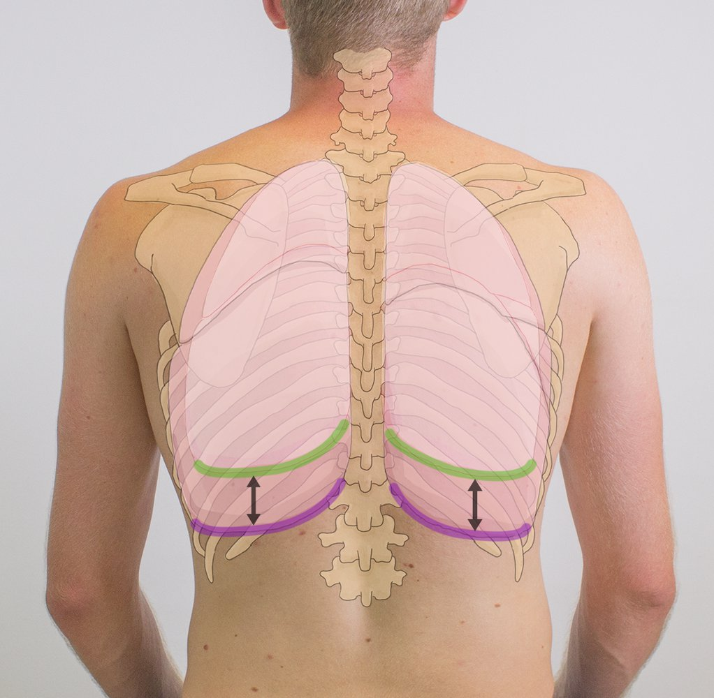

Lung movement during respiration

Right pleural effusion

Tactile fremitus

References:[[3]](https://coursology-qbank.com/amboss/article/W_0PMi)[[4]](https://coursology-qbank.com/amboss/article/1_02Mi)

---

## Overview of pulmonary examination findings

|  | Main symptom | <u>Tactile fremitus</u> |  | Percussion | <u>Auscultation</u> (breath sounds) | <u>Tracheal deviation</u> |  |  |  |  |  |
| --- | --- | --- | --- | --- | --- | --- | --- | --- | --- | --- | --- |
| Physiological | – | Normal |  | Resonant | <u>Vesicular</u> | None |  |  |  |  |  |
| <u>Pleural effusion</u> | <u>Dyspnea</u> may be present | Decreased |  | Dull | Decreased | To the opposite side of the lesion (no deviation in small effusions) |  |  |  |  |  |
| <u>Pulmonary edema</u> | Severe <u>dyspnea</u> | Possibly increased |  | Dull | Fine or coarse <u>crackles</u>, depending on severity | None |  |  |  |  |  |
| Simple <u>pneumothorax</u> | Acute <u>dyspnea</u> | Decreased or absent |  | Hyperresonant | Decreased or absent | None |  |  |  |  |  |
| <u>Tension pneumothorax</u> | Severe <u>dyspnea</u> | Decreased or absent |  | Hyperresonant | Decreased or absent | To the opposite side of the lesion |  |  |  |  |  |
|  <u>Bronchial asthma</u>1  | <u>Paroxysmal</u> attacks of <u>dyspnea</u>, <u>wheezing</u> | Decreased |  | Hyperresonant | <u>Wheeze</u>, a prolonged expiratory phase, possibly decreased breath sounds | None |  |  |  |  |  |
|  <u>Chronic bronchitis</u>1  | <u>Chronic cough</u> | Decreased |  | Hyperresonant | <u>Wheezing</u>, <u>rhonchi</u> | None |  |  |  |  |  |
| <u>Emphysema</u> | Chronic <u>dyspnea</u> | Decreased |  | Hyperresonant | End-expiratory <u>wheezing</u>, decreased breath sounds | None |  |  |  |  |  |
|  <u>Pneumonia</u>2  | <u>Fever</u>, <u>dyspnea</u> | Increased |  | Dull | Coarse <u>crackles</u> | None |  |  |  |  |  |
| <u>Lung</u> <u>fibrosis</u> | <u>Cachexia</u> and <u>weakness</u>, <u>dyspnea</u> | Normal or slightly increased |  | Dull | Basal inspiratory <u>crackles</u> | To the side of the lesion |  |  |  |  |  |
| <u>Atelectasis</u> | <u>Pain</u> may be present | Decreased |  | Dull | Decreased | To the side of the lesion |  |  |  |  |  |
|  <u>Pulmonary embolism</u>1  | Acute <u>dyspnea</u>, <u>pleuritic chest pain</u>, <u>tachypnea</u> | Normal |  | Normal | Normal | None |  |  |  |  |  |
|  <u>Tumor</u>1,2,3  | <u>Hemoptysis</u>, <u>constitutional symptoms</u> (weight loss, <u>fever</u>, night sweats) | Possibly decreased |  | Possibly dull | Possibly decreased | To the opposite side of the lesion |  |  |  |  |  |
|  | The following conditions frequently complicate the aforementioned pulmonary disease: 1pneumonia, 2pleural effusion, 3atelectasis. |  |  |  |  |  |  |  |  |  |  |

See “<u>Dyspnea</u>” for more information.

Surface anatomy of the lungs

Percussion and auscultation of the lung

Lung movement during respiration

Right pleural effusion

Tactile fremitus

Bronchopulmonary segments

Anatomy of the lung

Right and left lung

References:[[3]](https://coursology-qbank.com/amboss/article/W_0PMi)

---