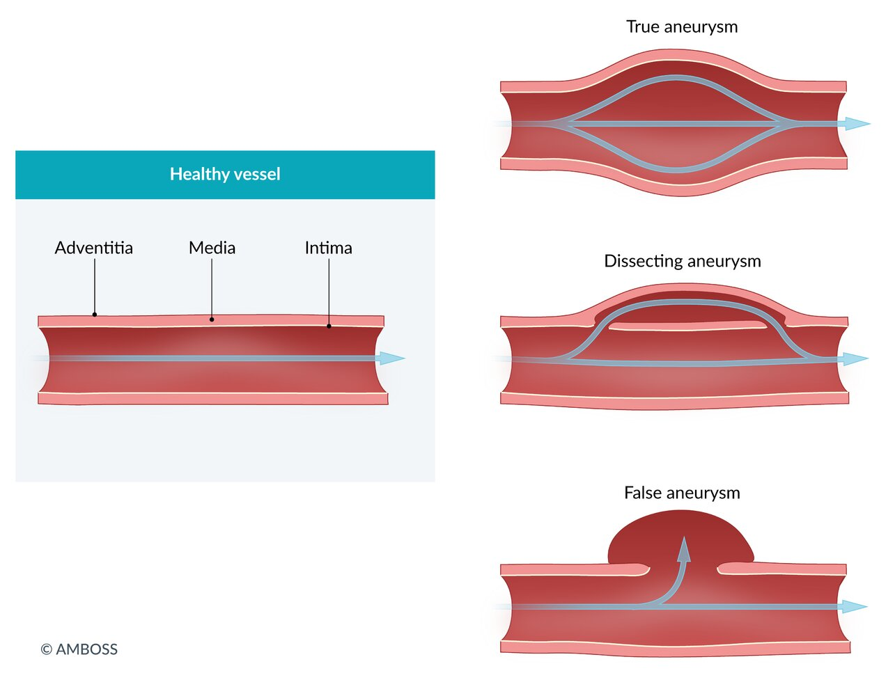
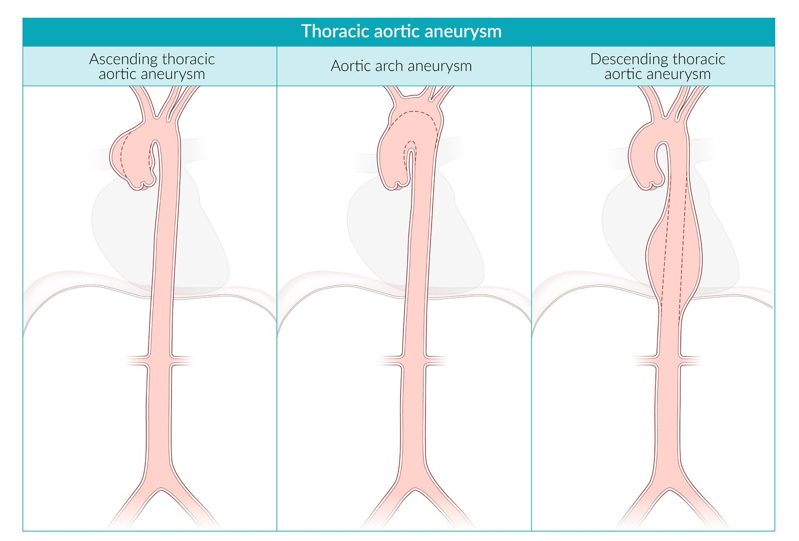
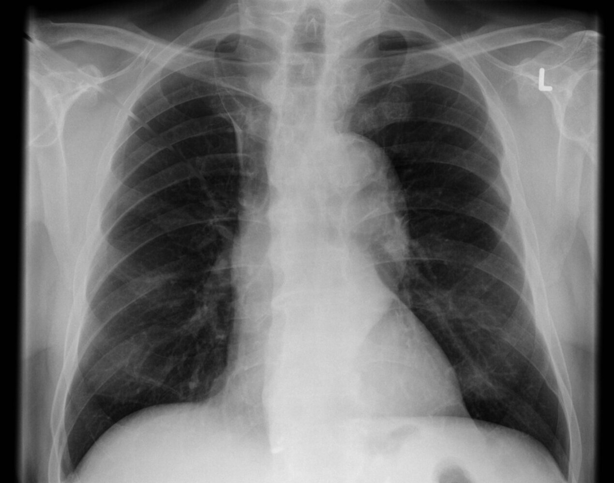
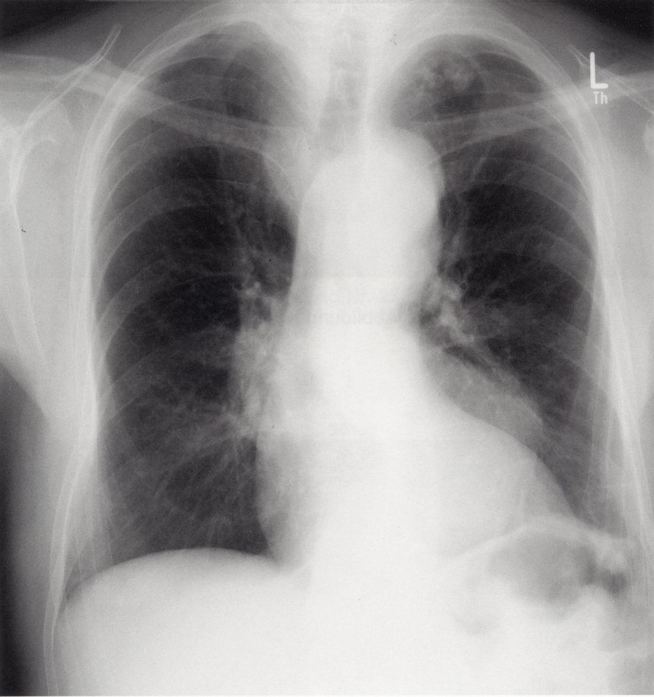
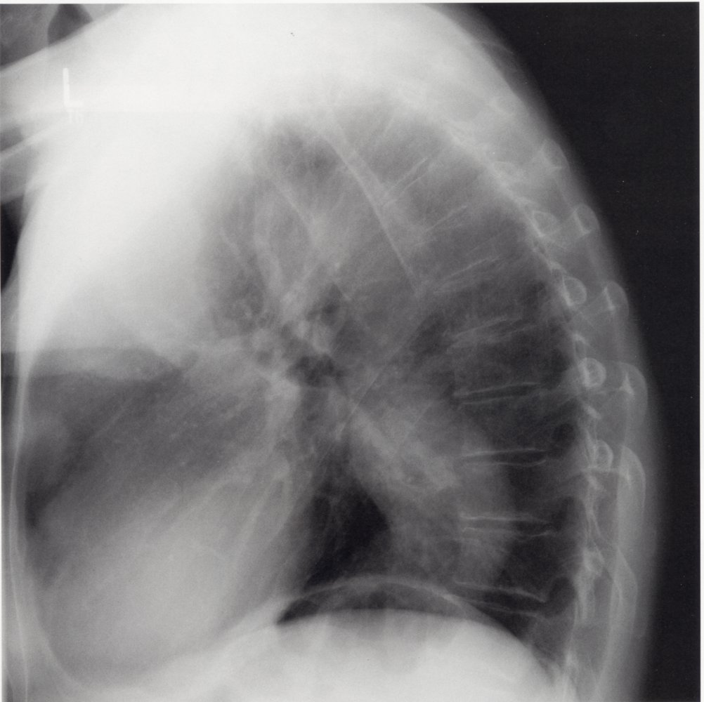
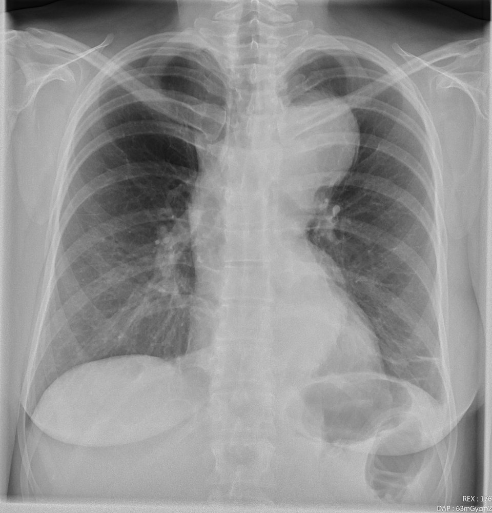
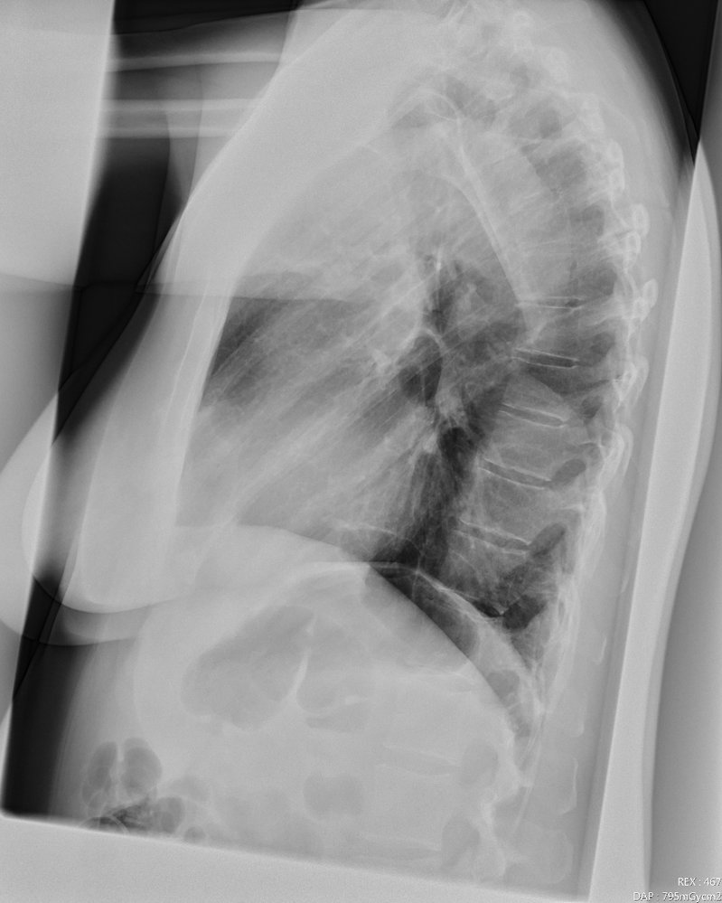
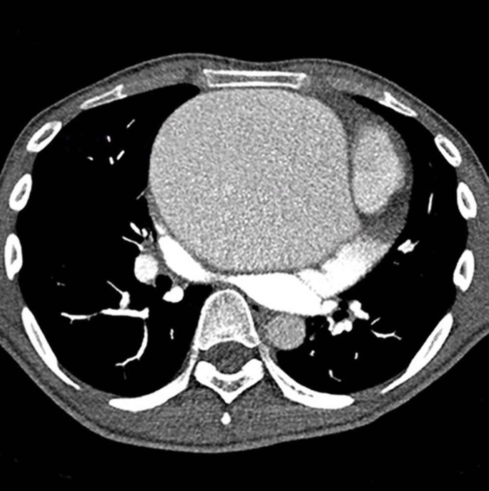
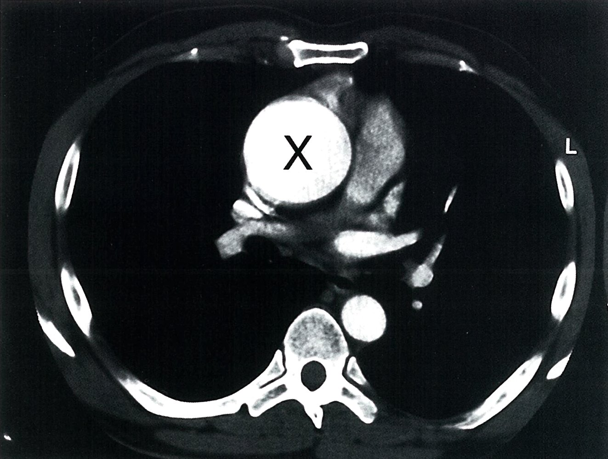
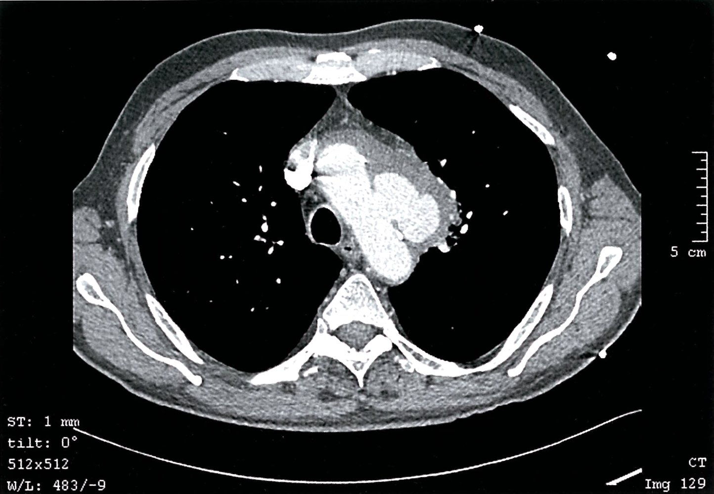

# Thoracic aortic aneurysm

*Categories: Clinical knowledge > Surgery > Cardiothoracic surgery > Thoracic aortic aneurysm*

[Original Article Link](https://coursology-qbank.com/amboss/article/dh0o1f)

---

## Summary

Thoracic <u>aortic aneurysm</u> (TAA) is the focal dilatation of the <u>thoracic aorta</u> to more than 1.5 times its normal diameter. TAAs are classified by location as affecting the <u>ascending aorta</u>, <u>descending aorta</u>, or <u>aortic arch</u>. Men of advanced age are at a higher risk of forming TAAs; other <u>risk factors</u> include trauma, <u>connective tissue disorders</u>, and <u>hypertension</u>. TAAs are frequently asymptomatic and therefore detected incidentally. If symptomatic, they may manifest with a feeling of pressure in the chest, thoracic <u>back pain</u>, and signs of <u>mediastinal</u> obstruction (e.g., difficulty <u>swallowing</u>). The initial test is often a chest <u>x-ray</u>, which may show a prominent <u>aortic arch</u>. CT with contrast is used to confirm the diagnosis and determine the extent of the <u>aneurysm</u>. Observation, close follow-up, and reduction of <u>cardiovascular risk factors</u> are indicated for small <u>aneurysms</u> whereas pronounced or rapidly expanding <u>aneurysms</u> require <u>surgery</u>. <u>TAA rupture</u> and dissection are life-threatening conditions that require emergency surgical repair to prevent <u>cardiac tamponade</u>, <u>hemothorax</u>, and <u>death</u>.

---

## Definitions

* Dilatation of all three layers of the aortic wall (<u>intima</u>, media, and adventitia) to > 150% of the normal diameter (a <u>true aneurysm</u>)  [[1]](https://coursology-qbank.com/amboss/article/q3bCjt)

* <u>Ascending aorta</u>: approx. > 5.0 cm

* <u>Descending aorta</u>: approx. > 4.0 cm

Types of aneurysms

---

## Epidemiology

* Less common than <u>abdominal aortic aneurysm</u> (<u>AAA</u>)  [[2]](https://coursology-qbank.com/amboss/article/NM0-Kg)

* Peak <u>incidence</u>: 60–65 years [[3]](https://coursology-qbank.com/amboss/article/awXQhZ0)

* Sex: <u>♂</u> > <u>♀</u> (∼ 3:1)

Epidemiological data refers to the US, unless otherwise specified.

---

## Etiology

The <u>risk factors</u> for TAA include:

* <u>Arterial hypertension</u>

* Smoking

* Advanced age

* Trauma

* Tertiary <u>syphilis</u> (due to <u>obliterative endarteritis</u> of the <u>vasa vasorum</u>) [[4]](https://coursology-qbank.com/amboss/article/VnYGHp)

* <u>Connective tissue diseases</u> (e.g., <u>Marfan syndrome</u>, <u>Ehlers-Danlos</u> syndrome)

* <u>Bicuspid aortic valve</u> [[5]](https://coursology-qbank.com/amboss/article/enYxHp)

* Positive <u>family history</u>

* Aortitis: aortic wall inflammation  [[6]](https://coursology-qbank.com/amboss/article/uw1pkQ0)[[7]](https://coursology-qbank.com/amboss/article/SFWyhM0)

* Noninfectious (most common): <u>giant cell arteritis</u>, <u>Takayasu arteritis</u>, other inflammatory conditions

* Infectious: bacterial , <u>mycobacterial</u>, fungal

---

## Classification

* <u>Ascending aorta</u> (most common location) [[8]](https://coursology-qbank.com/amboss/article/gPbFVF)

* <u>Descending aorta</u> (thoracoabdominal)

* <u>Aortic arch</u>

Thoracic aortic aneurysm

---

## Pathophysiology

* Ascending thoracic <u>aortic aneurysm</u>: most often due to <u>cystic medial necrosis</u>

* Descending thoracic <u>aortic aneurysm</u>: typically a result of <u>atherosclerosis</u>

* Inflammation and proteolytic degeneration of <u>connective tissue</u> <u>proteins</u>;  (e.g., <u>collagen</u> and <u>elastin</u>) and/or <u>smooth muscle cells</u> in high-risk patients → loss of structural integrity of the aortic wall → widening of the vessel

* The aneurysmatic dilatation of the vessel wall may cause disruption of the <u>laminar blood flow</u> and <u>turbulence</u>.

* Possible <u>formation of thrombi</u> in the <u>aneurysm</u> → peripheral <u>thromboembolism</u>

References:[[9]](https://coursology-qbank.com/amboss/article/p30Ljf)

---

## Clinical features

<u>Aortic aneurysms</u> are mostly asymptomatic or have nonspecific symptoms. They are often discovered incidentally on imaging.

* Chest pressure

* Thoracic <u>back pain</u>

* Features of <u>mediastinal</u> compression/obstruction, such as:

* Difficulty <u>swallowing</u> (<u>esophagus</u>)

* Upper venous congestion (<u>superior vena cava syndrome</u>)

* <u>Hoarseness</u> (<u>recurrent laryngeal nerve</u>)

* <u>Cough</u>, <u>wheeze</u>, <u>stridor</u> (<u>trachea</u>)

* <u>Horner syndrome</u> (<u>sympathetic trunk</u>)

---

## Diagnosis

### Imaging [[10]](https://coursology-qbank.com/amboss/article/mM0V6g)[[11]](https://coursology-qbank.com/amboss/article/g3bF3t)[[12]](https://coursology-qbank.com/amboss/article/t3bX4t)[[13]](https://coursology-qbank.com/amboss/article/73b4Pt)

#### <u>Chest x-ray</u>

* Indications: may be conducted as an initial imaging study in patients with <u>chest pain</u> and/or <u>dyspnea</u>

* Suggestive findings [[10]](https://coursology-qbank.com/amboss/article/mM0V6g)[[11]](https://coursology-qbank.com/amboss/article/g3bF3t)[[13]](https://coursology-qbank.com/amboss/article/73b4Pt)

* Abnormal aortic contour

* <u>Widened mediastinum</u>

* <u>Tracheal deviation</u>

Abnormal contour of thoracic aorta

Thoracic aortic aneurysm (1/2)

Thoracic aortic aneurysm (2/2)

Thoracic aortic aneurysm 

Thoracic aortic aneurysm

#### <u>CT angiography</u> chest

* Indications: best <u>confirmatory test</u> for TAAs

* Abnormal findings on chest <u>x-ray</u>, <u>ultrasound</u>, or <u>echocardiography</u>

* Interventional planning and follow-up

* Detailed evaluation of the extent, length, angulation, and diameter of the <u>aneurysm</u>

* Evaluation of aortic branch involvement

* Supportive findings [[11]](https://coursology-qbank.com/amboss/article/g3bF3t)[[12]](https://coursology-qbank.com/amboss/article/t3bX4t)

* Dilatation of the aorta    [[10]](https://coursology-qbank.com/amboss/article/mM0V6g)

* Possible <u>mural thrombus</u> (nonenhancing)

* Possible dissection, perforation, or rupture

Aneurysm of the ascending aorta

Ascending aortic aneurysm

Ruptured thoracic aortic aneurysm

#### Additional imaging

* <u>MR angiography</u> chest with and without IV contrast 

* Indication: Consider as an alternative to <u>CTA</u>. [[12]](https://coursology-qbank.com/amboss/article/t3bX4t)

* In stable patients who should avoid <u>ionizing radiation</u>

* For serial follow-ups

* Supportive findings: similar to <u>CTA</u>

* Disadvantages

* Prolonged duration

* Less accurate than <u>CTA</u> in allowing for the visualization of branch vessel involvement [[12]](https://coursology-qbank.com/amboss/article/t3bX4t)

* <u>Transthoracic echocardiography</u> [[12]](https://coursology-qbank.com/amboss/article/t3bX4t)

* Indications

* Rapid assessment in <u>hemodynamically unstable</u> patients

* Evaluation for concomitant <u>heart</u> disease

* Supportive findings

* Dilatation of the aorta

* Possible cardiac pathology

* <u>Signs of coronary artery disease</u>  [[14]](https://coursology-qbank.com/amboss/article/sPbtTF)

* <u>Transesophageal echocardiography</u>: allows for more accurate assessment than <u>TTE</u> [[12]](https://coursology-qbank.com/amboss/article/t3bX4t)

* Indication: intraoperative monitoring

* Disadvantages

* Less accurate than <u>CTA</u> in allowing for the visualization of branch vessel involvement

* Limited visualization of pathologies above the <u>gastroesophageal junction</u>

* <u>Catheter angiography</u> (<u>aortography</u>) [[13]](https://coursology-qbank.com/amboss/article/73b4Pt)

* Indications 

* Evaluation and possibly treatment of coexisting <u>coronary artery disease</u>

* Assessment of aortic lumen and branch vessels

* Supportive findings: contrast column in the lumen of the <u>aneurysm</u>

* Disadvantages

* May mask the actual diameter of the <u>aneurysm</u>  [[11]](https://coursology-qbank.com/amboss/article/g3bF3t)

* <u>Thrombus</u>-filled discrete <u>aneurysms</u> might be missed. [[13]](https://coursology-qbank.com/amboss/article/73b4Pt)

---

## Treatment

### Approach

* Unstable patients (e.g., in the case of rupture): emergency <u>TAA repair</u> (see “<u>Thoracic aortic aneurysm rupture</u>”)

* Symptomatic patients: urgent <u>TAA repair</u>

* Asymptomatic patients

* <u>Aneurysm</u> surveillance

* Elective <u>TAA repair</u> when size or growth thresholds are passed

* All patients: <u>conservative management</u> with reduction of <u>cardiovascular risk factors</u>

### Invasive treatment: TAA repair [[10]](https://coursology-qbank.com/amboss/article/mM0V6g)

#### General indications

* <u>TAA rupture</u>

* Symptomatic TAA

* Asymptomatic TAA when size or growth thresholds are passed

#### Indications for asymptomatic patients

The decision to perform elective <u>TAA repair</u> in asymptomatic patients depends on the size and expansion rate of the <u>aneurysm</u>. In all patients, the risks and benefits of <u>aneurysm</u> resection should be weighed carefully. [[8]](https://coursology-qbank.com/amboss/article/gPbFVF)

|  Indications for <u>TAA repair</u> in asymptomatic patients [[15]](https://coursology-qbank.com/amboss/article/FEWgxM0)  |  |
| --- | --- |
| Affected location of the aorta | Aortic diameter |
| Aortic root and <u>ascending aorta</u> |   * Threshold: ≥ 5.5 cm  * Growth rate: ≥ 0.3 cm/year in 2 consecutive years or ≥ 0.5 cm/year    |
| <u>Aortic arch</u> |  * General threshold: ≥ 5.5 cm   |
| Descending <u>thoracic aorta</u> |   * Threshold: ≥ 5.5 cm  * Increased operative risk: Higher thresholds may be reasonable.  * Increased risk of rupture: Lower thresholds may be reasonable.    |
| Thoracoabdominal aorta |   * Threshold: ≥ 6.0 cm  * Increased risk of rupture: Lower thresholds may be reasonable.    |

#### Procedures [[10]](https://coursology-qbank.com/amboss/article/mM0V6g)

Open surgical repair (OSR) is recommended for patients with TAA of the <u>ascending aorta</u> and <u>aneurysms</u> involving the <u>aortic arch</u>. For patients with descending thoracic or <u>thoracoabdominal aortic aneurysms</u>, <u>thoracic endovascular aneurysm repair</u> (<u>TEVAR</u>) or OSR can be performed.

##### Open surgical repair (OSR) [[10]](https://coursology-qbank.com/amboss/article/mM0V6g)

Open surgical repair is a major operation with high associated <u>morbidity</u> and mortality.  [[8]](https://coursology-qbank.com/amboss/article/gPbFVF)

* Indications: preferred in young patients with few comorbidities and low surgical risk and patients with <u>connective tissue disorders</u> [[8]](https://coursology-qbank.com/amboss/article/gPbFVF)

* Symptomatic TAAs involving the <u>ascending aorta</u> or the <u>aortic arch</u>

* Consider as an alternative in symptomatic TAAs involving the <u>descending aorta</u> (see indications for <u>TEVAR</u> below).

* Consider in asymptomatic TAAs.

* Complications: 40% of all patients experience a perioperative complication [[8]](https://coursology-qbank.com/amboss/article/gPbFVF)

* <u>Paralysis</u> (due to <u>spinal cord injury</u> or <u>ischemia</u>)

* Renal and <u>mesenteric</u> <u>ischemia</u>

##### Thoracic endovascular aneurysm repair (<u>TEVAR</u>) [[10]](https://coursology-qbank.com/amboss/article/mM0V6g)

* Indications:
* Degenerative or traumatic descending <u>aortic aneurysms</u>

* Contraindications

* Absence of a sufficiently long (2–3 cm) “landing zone”  for the <u>stent</u> graft

* Absence of adequate <u>vascular access</u> sites

* Procedure: Under <u>fluoroscopic</u> guidance, an expandable <u>stent</u> graft is placed via the femoral or <u>iliac arteries</u> intraluminally at the site of the <u>aneurysm</u>.

* Complications [[10]](https://coursology-qbank.com/amboss/article/mM0V6g)[[16]](https://coursology-qbank.com/amboss/article/PRbWMt)

* <u>Ischemia</u> of the bowel, <u>kidneys</u>, spinal cord

* Access site complications, e.g., infection, bleeding, <u>hematoma</u>

* Embolic cerebral <u>ischemia</u>

* <u>Endoleak</u>

* Graft migration

* Need for reintervention

* Other: requires lifelong postoperative surveillance

##### Additional procedures

Concomitant diseases may require additional procedures, e.g., <u>CABG</u>, valve replacement or repair.

* Identify coronary anatomy and possible <u>CAD</u> before repair of the <u>ascending aorta</u>.

* In end-organ <u>ischemia</u> or stenosis, ancillary <u>revascularization</u> is recommended.

#### Perioperative care

* See “<u>Perioperative care for AAA repair</u>.”

#### Surveillance after repair  [[12]](https://coursology-qbank.com/amboss/article/t3bX4t)

* <u>CTA</u> chest abdomen <u>pelvis</u> with IV contrast

* Initially: within the first month then at 3–12 months

* Then every 6–12 months depending on the stability of findings

* <u>MRA</u> chest/abdomen/<u>pelvis</u> with IV contrast: in patients with <u>MR</u>-compatible <u>stent</u> grafts (e.g., nitinol)

### <u>Conservative management</u>

All patients should receive <u>conservative treatment</u> to reduce the risk of further <u>aneurysm</u> expansion or rupture. Regular <u>aneurysm</u> surveillance via CT or <u>MR</u> is recommended for patients in whom the diameter of the <u>aneurysm</u> has not reached the threshold defined as the indication for repair.

#### Reduction of <u>cardiovascular risk factors</u> [[10]](https://coursology-qbank.com/amboss/article/mM0V6g)

* Blood pressure management

* Optimal blood pressure goal to reduce aortic wall <u>stress</u>: the lowest blood pressure that the patient can tolerate [[10]](https://coursology-qbank.com/amboss/article/mM0V6g)

* Less than 140/90 mm Hg in patients without <u>diabetes</u>

* Less than 130/80 mm Hg in patients with <u>diabetes</u> or <u>CKD</u>

* Preferred agents:

* <u>Beta blockers</u> (e.g., <u>propranolol</u> DOSAGE, <u>metoprolol</u> DOSAGE)

* <u>ACE inhibitor</u> (e.g., <u>lisinopril</u> DOSAGE, <u>enalapril</u> DOSAGE)

* <u>Angiotensin receptor blocker</u> (e.g., <u>losartan</u> DOSAGE, <u>candesartan</u> DOSAGE )  [[10]](https://coursology-qbank.com/amboss/article/mM0V6g)[[17]](https://coursology-qbank.com/amboss/article/kRbmMt)

* <u>Smoking cessation</u>

* <u>Lipid profile</u> optimization: in patients with atherosclerotic <u>aortic aneurysms</u>

* Target <u>LDL cholesterol</u>: < 70 mg/dL

* Preferred agent: <u>statin</u> (e.g., <u>atorvastatin</u> DOSAGE)

* Lifestyle modification [[18]](https://coursology-qbank.com/amboss/article/LRbwnt)

* No participation in most competitive sports

* No heavy weight lifting

#### <u>Aneurysm</u> surveillance

|  Follow-up frequency for surveillance of thoracic aortic aneurysm or dilatation via CT or MR [[10]](https://coursology-qbank.com/amboss/article/mM0V6g)  |  |  |
| --- | --- | --- |
| Part of the aorta | Maximum diameter of the aorta | Recommended follow-up interval |
| <u>Ascending aorta</u> |  * 3.5–4.4 cm   |  * 12 months   |
|  * ≥ 4.5 cm   |  * 6 months   |  |
| <u>Aortic arch</u> |  * 3.5–3.9 cm   |  * 12 months   |
|  * ≥ 4 cm   |  * 6 months   |  |
| <u>Descending aorta</u> |  * 4–4.9 cm   |  * 12 months   |
|  * ≥ 5 cm   |  * 6 months   |  |

---

## Complications

* Embolism: caused by <u>thrombotic</u> material of the <u>aneurysm</u>

* <u>Aortic valve regurgitation</u>: due to <u>aortic root dilation</u>

* <u>Aortic dissection</u>

* <u>Thoracic aortic aneurysm rupture</u>

We list the most important complications. The selection is not exhaustive.

---

## Thoracic aortic aneurysm rupture

### <u>Risk factors</u> [[10]](https://coursology-qbank.com/amboss/article/mM0V6g)

* Large <u>aneurysm</u> diameter

* Rapid <u>aneurysm</u> expansion

* Trauma

* Smoking

### Clinical features [[10]](https://coursology-qbank.com/amboss/article/mM0V6g)[[13]](https://coursology-qbank.com/amboss/article/73b4Pt)

It is difficult to tell TAA apart from other causes of <u>acute aortic syndrome</u> using clinical features alone.

* Contained rupture 

* Severe <u>chest pain</u> (may be indistinguishable from acute <u>MI</u>)

* Possible abdominal <u>pain</u> in patients with thoracoabdominal <u>aneurysms</u>

* Patients are often hemodynamically stable.

* Free rupture 

* Possible <u>loss of consciousness</u>

* Severe chest and possible abdominal <u>pain</u>

* <u>Hypotension</u>

* Acute <u>respiratory failure</u>

* <u>Hemoptysis</u>

* <u>Gastrointestinal bleeding</u>

* <u>Cardiac tamponade</u> and <u>cardiogenic shock</u>

* <u>Cardiac arrest</u> (secondary to profound <u>hypovolemia</u>)

> [!WARNING]
> More than half of patients with <u>TAA rupture</u> die before reaching the emergency department! [[13]](https://coursology-qbank.com/amboss/article/73b4Pt)

### Diagnostics [[10]](https://coursology-qbank.com/amboss/article/mM0V6g)[[12]](https://coursology-qbank.com/amboss/article/t3bX4t)[[13]](https://coursology-qbank.com/amboss/article/73b4Pt)

* Initial evaluation

* <u>Hemodynamically unstable</u> patients: no time for detailed assessment
* Proceed directly to OR; <u>POCUS</u> or formal bedside <u>TTE</u> may be considered if it does not delay treatment.

* Hemodynamically stable patients: Obtain <u>CTA</u> of the chest, abdomen, and <u>pelvis</u> with IV contrast.
* Supportive findings

* Extravasation of contrast

* Contained rupture: perivascular <u>hematoma</u> sealed off by surrounding structures

* Free rupture: massive <u>hematoma</u>

* Additional diagnostic evaluation to consider (once patient has been stabilized)

* <u>ECG</u>: to rule out <u>STEMI</u> as a differential diagnosis

* <u>Laboratory studies</u>: There are no laboratory findings specific to <u>TAA rupture</u>.

* <u>CBC</u>: ↓ <u>hemoglobin</u>, ↓ <u>hematocrit</u>, and ↓ <u>red blood cell count</u> in severe hemorrhage

* <u>ABG</u>: <u>metabolic acidosis</u> in cases of <u>shock</u>

* See “<u>Chest pain</u>” for workup and differential diagnoses.

### Treatment

#### Initial stabilization [[19]](https://coursology-qbank.com/amboss/article/a3cQSX0)

* As soon as <u>TAA rupture</u> is suspected, obtain an immediate cardiothoracic <u>surgery</u> consult.

* Start continuous <u>telemetry</u>, consider <u>invasive blood pressure monitoring</u>.

* Manage <u>hypotension</u>.

* Start <u>fluid resuscitation</u>, giving <u>blood products</u> as soon as they are available.

* Refractory <u>hypotension</u>: Start <u>vasopressors</u> and consider <u>POCUS</u> to assess for <u>pericardial effusion</u>.  [[10]](https://coursology-qbank.com/amboss/article/mM0V6g)

* For patients with acute <u>respiratory failure</u>, start <u>oxygen therapy</u> and consider cautious <u>intubation</u>.

* Initiate IV <u>pain management</u>.

* Reassess frequently, as patients may rapidly decompensate.

> [!WARNING]
> Interventions such as <u>intubation</u> and <u>opioid</u> <u>analgesia</u> may worsen <u>hypotension</u>!

> [!TIP]
> Patients are at risk of <u>massive transfusion-associated reactions</u>; give <u>blood products</u> in a balanced <u>ratio</u>, use inline blood warming devices, and screen for <u>electrolyte</u> imbalances.

#### Emergency surgical repair [[20]](https://coursology-qbank.com/amboss/article/BRbz6t)

* OSR

* <u>TEVAR</u> may be considered in patients with rupture of the descending <u>thoracic aorta</u>.  [[20]](https://coursology-qbank.com/amboss/article/BRbz6t)

### Complications

* Bleeding into the <u>mediastinum</u> → <u>cardiac tamponade</u> (rapidly fatal)

* Left <u>hemothorax</u>

### Prognosis

* Free rupture has a high <u>mortality rate</u>.  [[13]](https://coursology-qbank.com/amboss/article/73b4Pt)

---