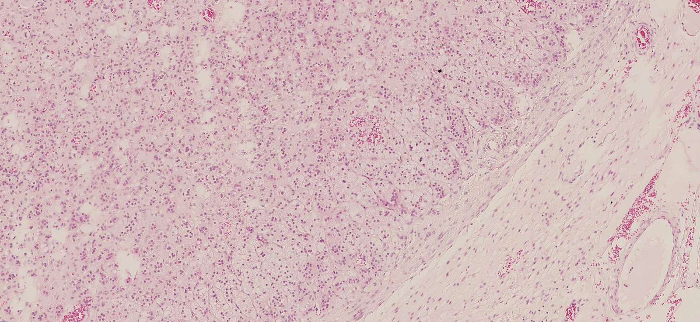
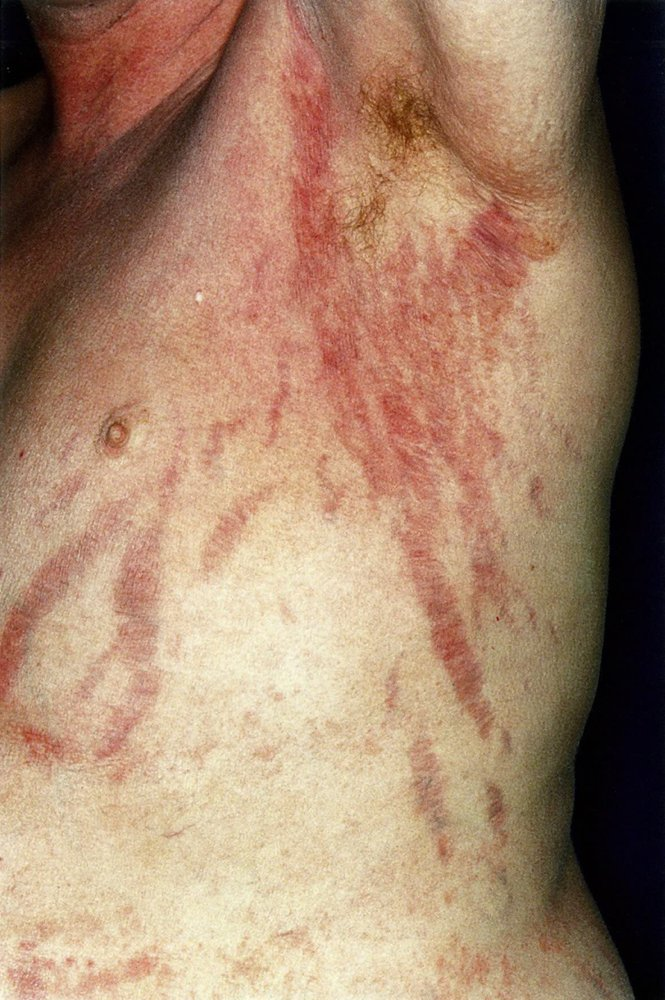
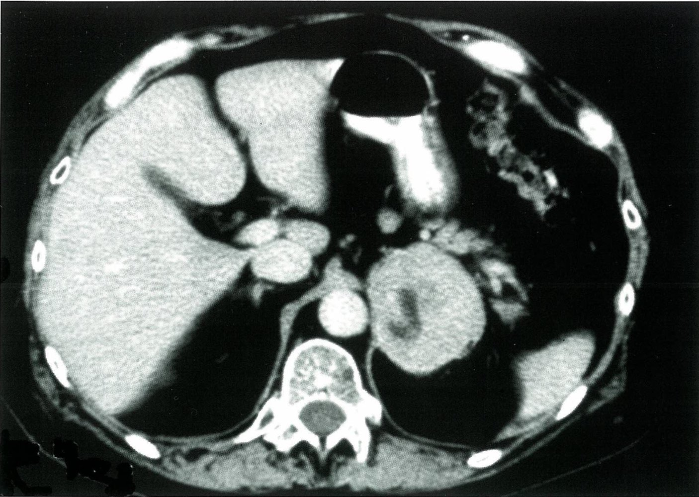

# Cushing syndrome

*Categories: Clinical knowledge > Surgery > Endocrine surgery > Cushing syndrome*

[Original Article Link](https://coursology-qbank.com/amboss/article/fg0ku2)

---

## Summary

Cushing syndrome is an endocrine disorder caused by hypercortisolism, most commonly due to <u>exogenous</u> <u>glucocorticoid</u> administration (<u>iatrogenic</u> Cushing syndrome). Cushing syndrome can also be caused by <u>endogenous</u> overproduction of <u>cortisol</u>. <u>Primary hypercortisolism</u> is caused by autonomous overproduction of <u>cortisol</u> by the <u>adrenal gland</u> (e.g., due to an <u>adrenal adenoma</u> or <u>carcinoma</u>). <u>Secondary hypercortisolism</u> is the result of elevated <u>adrenocorticotropic hormone</u> (<u>ACTH</u>) due to overproduction by either a <u>pituitary adenoma</u> (<u>Cushing disease</u>) or <u>ectopic</u>, paraneoplastic foci (e.g., in patients with <u>small cell lung cancer</u>). Typical clinical features include <u>central obesity</u>, thin and easily bruisable <u>skin</u>, abdominal <u>striae</u>, <u>secondary hypertension</u>, <u>hyperglycemia</u>, and <u>proximal</u> <u>muscle weakness</u>. Prepubertal children with Cushing syndrome also commonly present with lack of height gain and excessive weight gain. Measurement of <u>cortisol</u> (urine free and/or <u>late-night salivary cortisol</u>) and/or the <u>dexamethasone suppression test</u> are used to diagnose hypercortisolism. Serum <u>ACTH</u> levels are used to differentiate between primary and <u>secondary hypercortisolism</u>. Depending on the suspected type of Cushing syndrome, additional studies may include imaging, further <u>hormone</u> testing, and bilateral <u>sampling of the inferior petrosal sinus</u>. The treatment of <u>endogenous hypercortisolism</u> primarily involves surgical removal of the source of excessive <u>cortisol</u> (e.g., <u>adrenalectomy</u>) or <u>ACTH</u> (e.g., <u>transsphenoidal hypophysectomy</u>) production. Pharmacological treatment aimed at normalizing <u>cortisol</u> levels (e.g., <u>metyrapone</u>) may be used in addition to surgical treatment or as second-line treatment if <u>surgery</u> is unsuccessful.

Cushing syndrome (hypercortisolism) fact sheet

---

## Etiology

### <u>Exogenous</u> (<u>iatrogenic</u>) Cushing syndrome

* Prolonged <u>glucocorticoid</u> therapy → hypercortisolism → decreased <u>ACTH</u> → bilateral <u>adrenal</u> <u>atrophy</u>

* Most common cause of hypercortisolism

### <u>Endogenous Cushing syndrome</u>

|  Overview of endogenous Cushing syndrome [[1]](https://coursology-qbank.com/amboss/article/ZXYZ9n)[[2]](https://coursology-qbank.com/amboss/article/zbYrwn)  |  |  |  |
| --- | --- | --- | --- |
| Types |  Primary hypercortisolism (<u>ACTH</u>-independent Cushing syndrome) | Secondary hypercortisolism |  |
| <u>Pituitary</u> <u>ACTH</u> production (Cushing disease) | Ectopic ACTH production |  |  |
|  Relative frequency [[3]](https://coursology-qbank.com/amboss/article/-bYDwn)  |  * 5–10%   |  * ∼ 75%   |  * ∼ 15%   |
| Sex |  * <u>♂</u> < <u>♀</u> (1:4)   |  * <u>♂</u> < <u>♀</u> (1:4)   |  * <u>♂</u> = <u>♀</u>   |
| Causes |  * Autonomous overproduction of <u>cortisol</u> by the <u>adrenal</u> gland → <u>ACTH</u> suppression → <u>atrophy</u> of the <u>contralateral</u> <u>adrenal gland</u>  * <u>Adrenal adenomas</u>  * <u>Adrenal carcinoma</u>  * Macronodular <u>adrenal hyperplasia</u>   |  * <u>Pituitary adenomas</u> → <u>ACTH</u> secretion  → bilateral <u>adrenal gland</u> <u>hyperplasia</u>   |   * <u>Paraneoplastic syndrome</u> → ↑ <u>ACTH</u> secretion → bilateral <u>adrenal gland</u> <u>hyperplasia</u>  * <u>Carcinomas</u> include:  * <u>Small cell lung cancer</u>  * <u>Renal cell carcinoma</u>  * <u>Pancreatic</u> or <u>lung</u> <u>neuroendocrine tumors</u>  * <u>Pheochromocytoma</u>  * <u>Medullary thyroid carcinoma</u>    |

> [!TIP]
> While the term “Cushing syndrome” can be applied to any cause of hypercortisolism, “<u>Cushing disease</u>” refers specifically to <u>secondary hypercortisolism</u> that results from excessive production of <u>ACTH</u> by <u>pituitary adenomas</u>.

> [!NOTE]
> <u>Secondary hypercortisolism</u> is also called <u>ACTH</u>-dependent Cushing syndrome because hypercortisolism is the result of increased <u>ACTH</u> levels.

Adrenal adenoma

---

## Clinical features

For additional features in children, see “<u>Cushing syndrome in children</u>.”

### <u>Skin</u> [[2]](https://coursology-qbank.com/amboss/article/zbYrwn)

* Thin, easily bruisable <u>skin</u> with <u>ecchymoses</u>

* <u>Stretch marks</u> (classically purple abdominal <u>striae</u>)

* <u>Hirsutism</u>

* <u>Acne</u>

* If <u>secondary hypercortisolism</u>: often <u>hyperpigmentation</u> (darkening of the <u>skin</u> due to an overproduction of <u>melanin</u>), especially in areas that are not normally exposed to the sun (e.g., palm creases, <u>oral cavity</u>)

* Caused by excessive <u>ACTH</u> production because <u>melanocyte-stimulating hormone</u> (<u>MSH</u>) is cleaved from the same precursor as <u>ACTH</u> called <u>proopiomelanocortin</u> (<u>POMC</u>)

* Not a feature of <u>primary hypercortisolism</u>

* <u>Delayed wound healing</u>

* Flushing of the face

Stretch marks (striae)

### Neuropsychological

* <u>Anxiety</u>, irritability

* <u>Lethargy</u>, fatigue

* <u>Sleep</u> disturbance

* <u>Memory</u> deficits

* <u>Depression</u>

* <u>Psychosis</u>

### Musculoskeletal [[2]](https://coursology-qbank.com/amboss/article/zbYrwn)

* <u>Osteopenia</u>, <u>osteoporosis</u>, <u>pathological fractures</u>, <u>avascular necrosis of the femoral head</u>

* Muscle <u>atrophy</u>/<u>weakness</u>

### Endocrine and metabolic [[3]](https://coursology-qbank.com/amboss/article/-bYDwn)

* <u>Insulin resistance</u>;   → <u>hyperglycemia</u> (see “<u>Diabetes mellitus</u>”) → mild <u>polyuria</u> in the case of severe <u>hyperglycemia</u>

* <u>Dyslipidemia</u>

* Weight gain characterized by  

* <u>Central obesity</u>

* Round face (sometimes called “moon facies”)

* <u>Dorsocervical fat pad</u>

* Supraclavicular fat pads

* <u>♂</u>: Decreased libido, <u>gynecomastia</u>

* <u>♀</u>: Decreased libido, <u>virilization</u>, and/or irregular <u>menstrual cycles</u> (e.g., <u>amenorrhea</u>)

Moon face

### Other features [[1]](https://coursology-qbank.com/amboss/article/ZXYZ9n)

* <u>Secondary hypertension</u> (∼ 90% of cases)

* Increased susceptibility to infections (due to <u>immunosuppression</u>)

* <u>Peptic ulcer disease</u>

* <u>Cataracts</u>

> [!NOTE]
> “CUSHINGOID” is the acronym for side effects of <u>corticosteroids</u>: Cataracts, Ulcers, Striae/Skin thinning, Hypertension/Hirsutism/Hyperglycemia, Infections, Necrosis (of the femoral head), Glucose elevation, Osteoporosis/Obesity, Immunosuppression, Depression/Diabetes.

> [!NOTE]
> Patients with <u>secondary hypercortisolism</u> due to <u>ectopic ACTH production</u> may present with rapid onset of <u>hypertension</u> and <u>hypokalemia</u> without other typical <u>features of Cushing syndrome</u>.

> [!TIP]
> Consider a diagnosis of hypercortisolism in patients who present with <u>proximal</u> <u>muscle weakness</u>, <u>central obesity</u>, thinning <u>skin</u>, weight gain, <u>sleep</u> disturbance, and/or <u>depression</u>.

---

## Diagnosis

### Approach [[1]](https://coursology-qbank.com/amboss/article/ZXYZ9n)[[4]](https://coursology-qbank.com/amboss/article/nxc7Ce0)[[5]](https://coursology-qbank.com/amboss/article/U_cbnU0)

* Evaluate for <u>clinical features of Cushing syndrome</u>.

* Rule out <u>exogenous</u> Cushing syndrome caused by <u>glucocorticoid</u> administration.

* Obtain initial testing to confirm hypercortisolism; consult <u>endocrinology</u> if the diagnosis remains unclear.

* Refer to <u>endocrinology</u> for further diagnostics and treatment if hypercortisolism is confirmed.

* Identify the cause of hypercortisolism.

* Consider nonneoplastic causes of <u>endogenous hypercortisolism</u> (<u>pseudo-Cushing</u>).

* Determine if Cushing syndrome is <u>ACTH</u>-dependent.

* Order further testing depending on the suspected type of Cushing syndrome.

> [!TIP]
> Prolonged <u>glucocorticoid</u> therapy is the most common cause of hypercortisolism (<u>exogenous</u> Cushing syndrome); further testing is not required in these patients.

### Routine <u>laboratory studies</u> [[6]](https://coursology-qbank.com/amboss/article/kIYm1q)

Not required to establish the diagnosis, but if performed, may show the following typical findings:

* <u>Hypernatremia</u>, <u>hypokalemia</u>, <u>metabolic alkalosis</u>

* <u>Hyperglycemia</u>: due to stimulation of gluconeogenic enzymes (e.g., <u>glucose-6-phosphatase</u>) and inhibition of <u>glucose</u> uptake in peripheral tissue

* <u>Hyperlipidemia</u> (<u>hypercholesterolemia</u> and <u>hypertriglyceridemia</u>)

* <u>CBC</u>: <u>leukocytosis</u> without <u>left shift</u> (predominantly neutrophilic), <u>eosinopenia</u>

### Testing for hypercortisolism [[2]](https://coursology-qbank.com/amboss/article/zbYrwn)[[3]](https://coursology-qbank.com/amboss/article/-bYDwn)[[4]](https://coursology-qbank.com/amboss/article/nxc7Ce0)[[5]](https://coursology-qbank.com/amboss/article/U_cbnU0)[[7]](https://coursology-qbank.com/amboss/article/hBcc0U0)

Any of the following tests can be used. The diagnosis is confirmed if at least two of the tests have abnormal results.

* Urine free cortisol ;  [[2]](https://coursology-qbank.com/amboss/article/zbYrwn)

* Free <u>cortisol</u> is measured in a complete 24-hour urine collection.

* Supportive finding: ↑ urine free <u>cortisol</u>  [[2]](https://coursology-qbank.com/amboss/article/zbYrwn)[[3]](https://coursology-qbank.com/amboss/article/-bYDwn)

* Low-dose dexamethasone suppression test 

* 1 mg of <u>dexamethasone</u> is administered between 11 pm and midnight and serum <u>cortisol</u> is measured the following morning between 8 and 9 am.

* Supportive finding: ↑ early morning serum <u>cortisol</u> level (> 50 nmol/L) [[5]](https://coursology-qbank.com/amboss/article/U_cbnU0)

* Late-night salivary cortisol 

* A saliva sample is collected at the patient's usual bedtime.

* Supportive finding: ↑ salivary <u>cortisol</u> (> 4 nmol/L)  [[5]](https://coursology-qbank.com/amboss/article/U_cbnU0)[[8]](https://coursology-qbank.com/amboss/article/E1X8iC)

* Late-night serum <u>cortisol</u>: not routinely recommended as the initial test but can be used in patients with inconsistent results from previous tests

* A serum sample is taken from the patient (awake or asleep).

* Supportive finding: ↑ serum <u>cortisol</u> (> 210 nmol/L)  [[4]](https://coursology-qbank.com/amboss/article/nxc7Ce0)

> [!TIP]
> Consult an endocrinologist for further evaluation if any of the findings above are present or if the results are negative despite a high <u>pretest probability</u>.

### Identifying the cause [[5]](https://coursology-qbank.com/amboss/article/U_cbnU0)

#### Initial evaluation

1. * Consider nonneoplastic and physiological causes of hypercortisolism based on clinical features and <u>patient history</u> (e.g., <u>depression</u>, <u>heavy alcohol use</u>, <u>obesity</u>) and in pregnant patients.  [[9]](https://coursology-qbank.com/amboss/article/iAcJjU0)
2. * Measure serum <u>ACTH</u> levels.

* Low (< 5 pg/mL): Suspect <u>primary hypercortisolism</u> (<u>ACTH</u>-independent).  [[2]](https://coursology-qbank.com/amboss/article/zbYrwn)[[10]](https://coursology-qbank.com/amboss/article/F1XgiC)

* Inappropriately normal OR elevated (> 20 pg/mL): Suspect <u>secondary hypercortisolism</u> (<u>ACTH</u>-dependent).  [[2]](https://coursology-qbank.com/amboss/article/zbYrwn)[[3]](https://coursology-qbank.com/amboss/article/-bYDwn)[[10]](https://coursology-qbank.com/amboss/article/F1XgiC)
3. * Proceed based on the results.

* If <u>ACTH-independent hypercortisolism</u> is suspected: Obtain <u>adrenal</u> <u>MRI</u> and/or CT.

* Assess for an <u>adrenal</u> <u>tumor</u> (e.g., <u>adrenal adenoma</u>, <u>carcinoma</u>, <u>hyperplasia</u>).

* The <u>adrenal cortex</u> <u>contralateral</u> to the <u>tumor</u> shows <u>atrophy</u> due to reduced <u>ACTH</u> stimulation.

* If <u>ACTH-dependent hypercortisolism</u> is suspected: Obtain further testing.

> [!TIP]
> Differentiating between Cushing syndrome and <u>nonneoplastic-physiologic hypercortisolism</u> can be very challenging. If there is any doubt, refer the patient to a specialized center.

Left adrenal mass

#### Further testing in patients with <u>ACTH-dependent hypercortisolism</u> [[2]](https://coursology-qbank.com/amboss/article/zbYrwn)[[5]](https://coursology-qbank.com/amboss/article/U_cbnU0)

The goal is to differentiate between <u>Cushing disease</u> and <u>ectopic ACTH production</u>. A combination of tests is often necessary.

* Obtain a <u>pituitary</u> <u>MRI</u> to evaluate for <u>Cushing disease</u> (see also “Diagnostics” in “<u>Pituitary adenoma</u>”).

* <u>Pituitary adenoma</u> > 10 mm confirms <u>Cushing disease</u>.

* If there is no evidence of a <u>pituitary adenoma</u> or findings are unclear, obtain either:  [[5]](https://coursology-qbank.com/amboss/article/U_cbnU0)

* Bilateral sampling of the inferior petrosal sinus

* <u>Hormone testing in ACTH-dependent hypercortisolism</u>

* If <u>ectopic ACTH production</u> is suspected: imaging to locate the <u>ACTH</u>-producing primary <u>malignancy</u> (e.g., <u>SCLC</u>, <u>RCC</u>, <u>neuroendocrine tumor</u>).

* Multiple studies are often necessary.  [[10]](https://coursology-qbank.com/amboss/article/F1XgiC)

* May include a thin-slice whole-body CT scan and functional imaging (e.g., <u>PET scan</u>)

> [!TIP]
> Abdominal CT or <u>MRI</u> in a patient with <u>Cushing disease</u> will show bilateral <u>hyperplasia</u> of both the <u>zona fasciculata</u> and <u>zona reticularis</u>.

|  Hormone testing in ACTH-dependent hypercortisolism [[2]](https://coursology-qbank.com/amboss/article/zbYrwn)[[5]](https://coursology-qbank.com/amboss/article/U_cbnU0)  |  |  |
| --- | --- | --- |
|  | Important considerations | Findings |
|  CRH stimulation test [[10]](https://coursology-qbank.com/amboss/article/F1XgiC)  |  * A combination of both tests (dexamethasone/corticotropin releasing hormone test) is preferred to differentiate between <u>Cushing disease</u> and <u>ectopic ACTH production</u>.   |   * <u>ACTH</u> and <u>cortisol</u> levels increase further: <u>Cushing disease</u> is likely.  * No increase in <u>ACTH</u> or <u>cortisol</u> levels: <u>Ectopic ACTH production</u> is likely.    |
|  <u>Desmopressin</u> stimulation test  |  |  |
|  High-dose <u>dexamethasone suppression test</u> [[2]](https://coursology-qbank.com/amboss/article/zbYrwn)  |  * Not routinely recommended due to low <u>accuracy</u>   |   * Adequate suppression, i.e., ↓ <u>cortisol</u> (< 50% of baseline): <u>Cushing disease</u> is likely.  * No or inadequate suppression: <u>Ectopic ACTH production</u> is likely.    |

> [!TIP]
> The results of these tests must always be considered in the clinical context, and a combination of tests is usually necessary. <u>Hormone</u>-secreting <u>pituitary microadenomas</u> cannot always be detected on imaging and, conversely, small endocrine-inactive tumors may be detected in healthy individuals, potentially leading to overdiagnosis.

|  Differential <u>diagnosis of Cushing syndrome</u> [[2]](https://coursology-qbank.com/amboss/article/zbYrwn)[[5]](https://coursology-qbank.com/amboss/article/U_cbnU0)  |  |  |  |  |
| --- | --- | --- | --- | --- |
|  |  |  |  |  |
| Normal | <u>Primary hypercortisolism</u> | <u>Ectopic</u> <u>ACTH</u> secretion | <u>Cushing disease</u> |  |
| <u>ACTH</u> levels | ↔︎ | ↓ | ↑ |  |
| Low-dose <u>dexamethasone suppression test</u> | ↓ <u>Cortisol</u> | ↔︎ <u>Cortisol</u> |  |  |
| High-dose <u>dexamethasone suppression test</u> | ↓ <u>Cortisol</u> | ↔︎ <u>Cortisol</u> |  | ↓ <u>Cortisol</u> |
| <u>CRH</u> and <u>desmopressin</u> stimulation tests |  ↑ <u>ACTH</u>, ↑ <u>cortisol</u>  | ↔︎ <u>ACTH</u>, ↔︎ <u>cortisol</u> |  | ↑ <u>ACTH</u>, ↑ <u>cortisol</u> |

> [!TIP]
> In Cushing syndrome, only patients with <u>Cushing disease</u> remain (partially) susceptible to <u>cortisol</u> suppression (high-dose <u>dexamethasone suppression test</u>) and stimulation (<u>CRH stimulation test</u>).

---

## Treatment

The following section applies to <u>endogenous Cushing syndrome</u>. For patients with <u>exogenous</u> Cushing syndrome, consider lowering the dose of <u>glucocorticoids</u> or replacing them.

### Approach [[2]](https://coursology-qbank.com/amboss/article/zbYrwn)[[3]](https://coursology-qbank.com/amboss/article/-bYDwn)[[5]](https://coursology-qbank.com/amboss/article/U_cbnU0)[[11]](https://coursology-qbank.com/amboss/article/ByczhU0)

* Manage with a multidisciplinary team including an endocrinologist.

* First-line treatment: <u>tumor</u> resection

* Second-line or adjunctive therapy: pharmacological treatment

> [!TIP]
> Patients who develop <u>adrenal insufficiency</u> after <u>surgery</u> require lifelong <u>glucocorticoid</u> replacement therapy.

> [!NOTE]
> Enzyme inhibitors (e.g., <u>metyrapone</u>, <u>ketoconazole</u>) suppress <u>cortisol synthesis</u>, while <u>glucocorticoid</u> <u>antagonists</u> block the action of <u>cortisol</u> in peripheral tissues.

### Supportive management [[11]](https://coursology-qbank.com/amboss/article/ByczhU0)

* Educate patients about the disease, including the risk of recurrence  and the increased risk for <u>venous thromboembolism</u>.

* Ensure <u>vaccinations</u> are up-to-date in accordance with the <u>ACIP immunization schedule</u>.

* Screen for and treat any common comorbidities (e.g., <u>diabetes</u>, <u>hypertension</u>, <u>osteoporosis</u>, psychiatric disorders).

### First line: curative <u>surgery</u> [[12]](https://coursology-qbank.com/amboss/article/2AcTQU0)

<u>Radiotherapy</u> and/or <u>chemotherapy</u> may be indicated as part of the management of the causative <u>tumor</u>.

#### Surgical procedures

* <u>Primary hypercortisolism</u>: : unilateral or bilateral <u>laparoscopic</u> or open <u>adrenalectomy</u> for adrenocortical tumors

* <u>Cushing disease</u>: <u>transsphenoidal hypophysectomy</u>

* <u>Ectopic ACTH production</u>: <u>tumor</u> resection with node dissection, as appropriate

#### Follow-up

* Patients should receive lifelong monitoring for recurrence by a specialist.

* <u>Glucocorticoid</u> replacement therapy is often necessary after <u>surgery</u>.

* Reevaluate 6–18 months after unilateral <u>adrenalectomy</u> or resection of <u>ACTH</u>-secreting tumors.

* Lifelong <u>glucocorticoid</u> replacement therapy is required after bilateral <u>adrenalectomy</u> (see “Treatment” in “<u>Adrenal insufficiency</u>”).

### Pharmacological treatment

Decisions about pharmacotherapy should be guided by an endocrinologist.

|  Pharmacological <u>treatment of Cushing syndrome</u>  [[5]](https://coursology-qbank.com/amboss/article/U_cbnU0)[[11]](https://coursology-qbank.com/amboss/article/ByczhU0)  |  |  |  |
| --- | --- | --- | --- |
|  |  | Examples | Indications |
| Enzyme inhibitors |  |   * <u>Ketoconazole</u> (<u>off-label</u>) DOSAGE [[5]](https://coursology-qbank.com/amboss/article/U_cbnU0)  * <u>Metyrapone</u> (<u>off-label</u>) DOSAGE [[5]](https://coursology-qbank.com/amboss/article/U_cbnU0)    |   * Adjunctive treatment for patients with overt Cushing syndrome  * Second-line treatment for Cushing syndrome of any cause    |
| <u>Glucocorticoid</u> <u>antagonists</u> |  |  * <u>Mifepristone</u> (<u>off-label</u>) DOSAGE [[5]](https://coursology-qbank.com/amboss/article/U_cbnU0)   |  |
| <u>Pituitary</u> targeted drugs | <u>Dopamine agonists</u> |  * <u>Cabergoline</u> (<u>off-label</u>) DOSAGE [[5]](https://coursology-qbank.com/amboss/article/U_cbnU0)   |  * Second-line treatment for <u>Cushing disease</u>   |
| <u>Somatostatin analogues</u> |  * Pasireotide (<u>off-label</u>) DOSAGE [[5]](https://coursology-qbank.com/amboss/article/U_cbnU0)   |  |  |

### Bilateral <u>adrenalectomy</u> [[11]](https://coursology-qbank.com/amboss/article/ByczhU0)

* Indications

* <u>Primary hypercortisolism</u> caused by bilateral <u>adrenal</u> disease (recommended curative treatment)

* Emergency treatment in severe <u>ACTH-dependent hypercortisolism</u> that cannot be controlled pharmacologically

* Symptomatic treatment for <u>metastatic</u> or occult <u>ectopic</u> tumors

* Complication: Nelson syndrome (post <u>adrenalectomy</u> syndrome) [[13]](https://coursology-qbank.com/amboss/article/3AcSjU0)

* Etiology: bilateral <u>adrenalectomy</u> in patients with a previously undetected <u>pituitary adenoma</u>

* Pathophysiology: bilateral <u>adrenalectomy</u> → no <u>endogenous</u> <u>cortisol</u> production → no negative feedback from <u>cortisol</u> on the <u>hypothalamus</u> → ↑ <u>CRH</u> production → uncontrolled enlargement of preexisting but undetected <u>ACTH-secreting pituitary adenoma</u> → ↑ secretion of <u>ACTH</u> and <u>MSH</u> → manifestation of symptoms due to <u>pituitary adenoma</u> and ↑ <u>MSH</u>

* Clinical features: <u>headache</u>, <u>bitemporal hemianopia</u> (<u>mass effect</u>), cutaneous <u>hyperpigmentation</u>

* Diagnostics

* High levels of <u>β-MSH</u> and <u>ACTH</u>

* <u>Pituitary adenoma</u> on <u>MRI</u> confirms the diagnosis.

* Treatment: <u>surgery</u> (e.g., <u>transsphenoidal resection</u>) and/or <u>pituitary</u> <u>radiation therapy</u> (e.g., if the <u>tumor</u> cannot be fully resected)

---