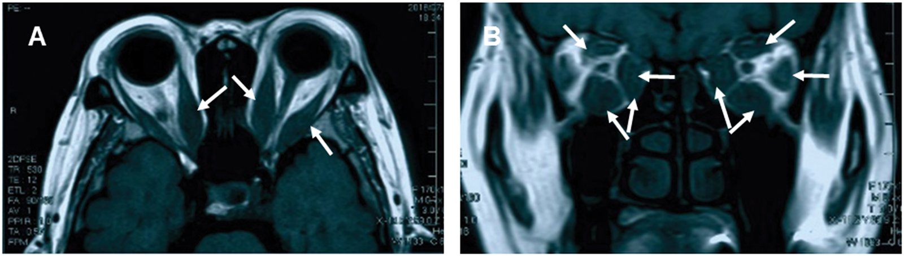
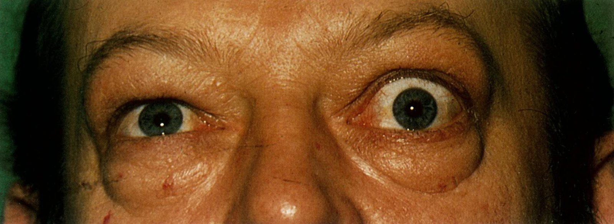
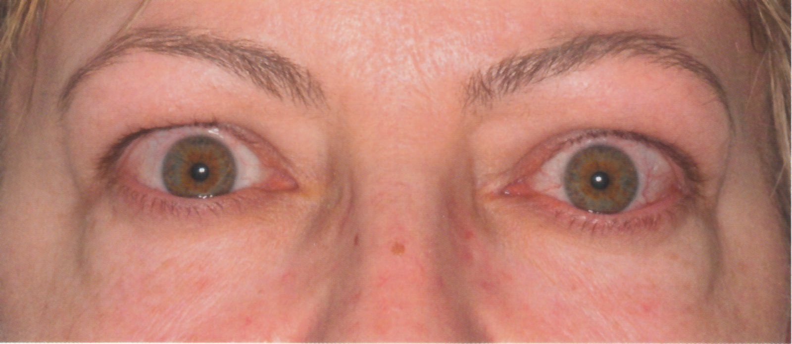
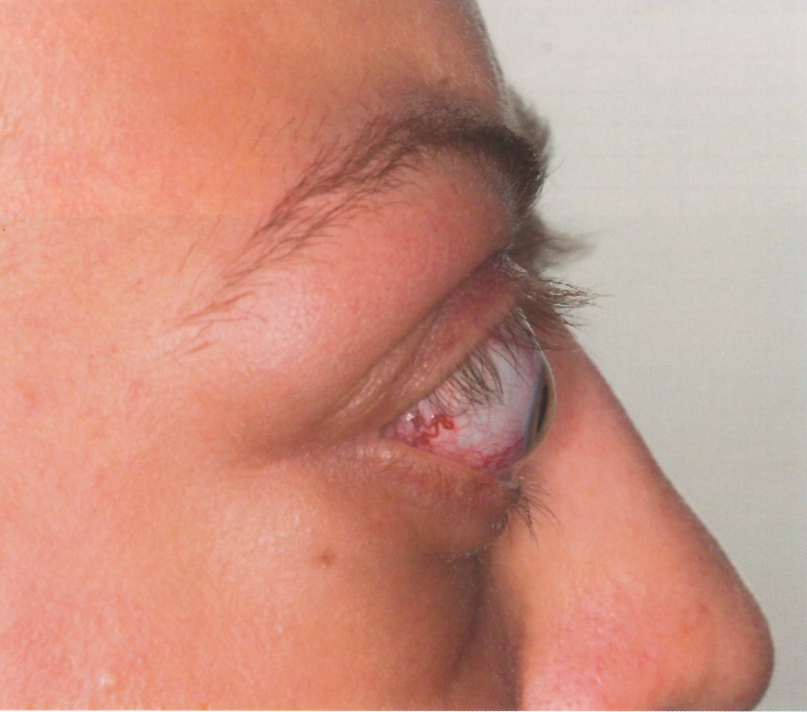
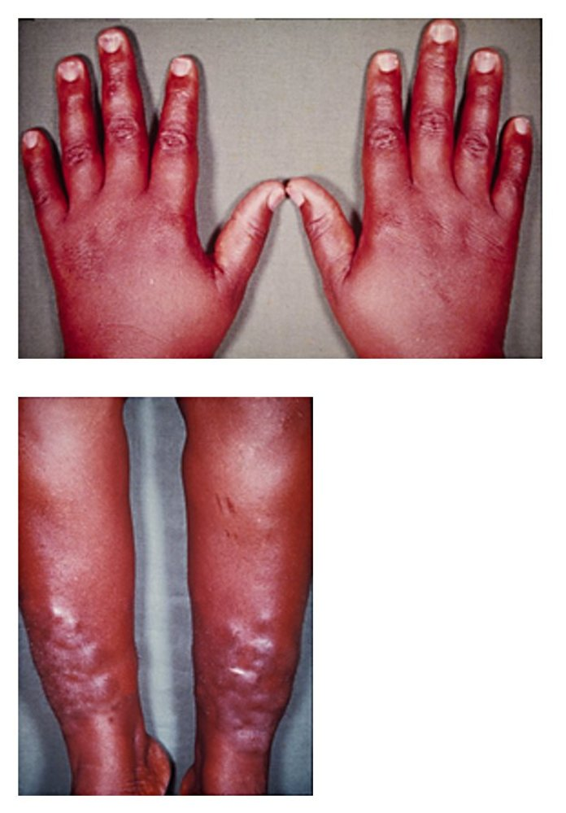
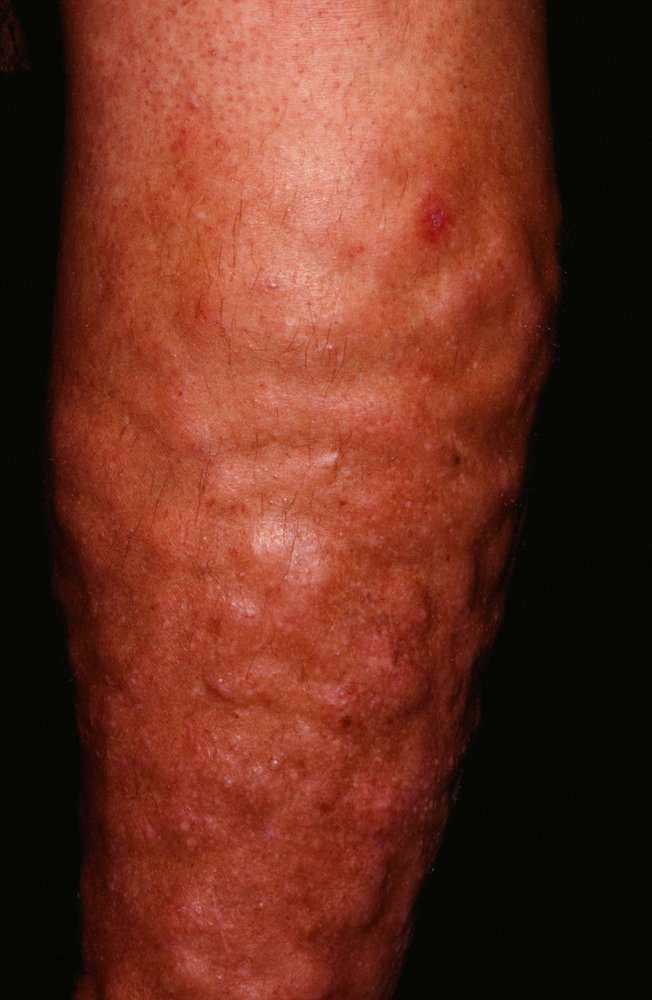
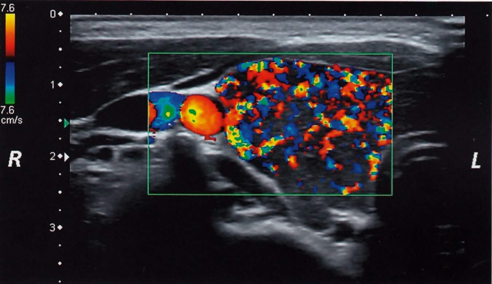
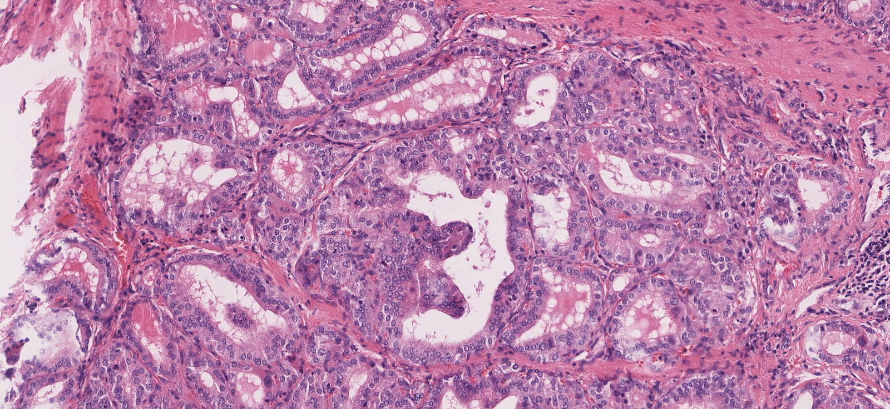

# Graves disease

*Categories: Clinical knowledge > Surgery > Endocrine surgery > Graves disease*

[Original Article Link](https://coursology-qbank.com/amboss/article/0o0e0S)

---

## Summary

Graves disease (<u>GD</u>) is an autoimmune condition in which <u>TSH receptor</u> <u>autoantibodies</u> stimulate the <u>thyroid gland</u>, resulting in increased <u>thyroid hormone production</u>. This condition is the most common cause of <u>hyperthyroidism</u>. Clinical features include <u>symptoms of hyperthyroidism</u>, diffuse <u>goiter</u>, <u>Graves ophthalmopathy</u>, and <u>thyroid</u> dermatopathy (i.e., <u>pretibial myxedema</u>), although presentation often differs with patient age. Diagnosis is confirmed by clinical presentation and thyrotoxocosis on <u>thyroid function testing</u>. In diagnostic uncertainty, elevated <u>TSH receptor antibody</u> (<u>TRAb</u>) levels or characteristic findings on <u>thyroid</u> imaging can confirm the diagnosis. Treatment includes <u>symptomatic therapy for thyrotoxicosis</u> with <u>beta blockers</u>, if needed, combined with therapeutic management with one of three options: <u>antithyroid drugs for GD</u>, <u>radioactive iodine ablation</u> (<u>RAIA</u>) or <u>thyroid surgery</u>. Treatment choice depends on many factors, including patient characteristics (e.g., age, <u>pregnancy</u>, preference) and clinical presentation (e.g., size of <u>goiter</u>, <u>TRAb</u> levels). <u>Ongoing management for GD</u> involves monitoring for disease recurrence and side effects of treatment.

---

## Epidemiology

* Most common cause of <u>hyperthyroidism</u> in the United States

* <u>Incidence</u>: ∼ 30 cases per 100,000 people per year

* Sex: <u>♀</u> > <u>♂</u> (∼10:1)

* Typical age range: 20–50 years

Epidemiological data refers to the US, unless otherwise specified.

---

## Etiology

* Genetic predisposition

* 50% of individuals with Graves disease have a <u>family history</u> of autoimmune disorders (e.g., <u>type 1 diabetes</u> mellitus, <u>Hashimoto disease</u>, <u>pernicious anemia</u>, <u>myasthenia gravis</u>).

* Associated with <u>HLA-DR3</u> and <u>HLA-B8</u> <u>alleles</u>

* <u>Autoimmunity</u>: B and <u>T lymphocyte</u>-mediated disorder

* Triggers

* Infectious agents: <u>Yersinia enterocolitica</u> and <u>Borrelia burgdorferi</u> have been shown to trigger <u>antigen</u> mimicry for homologies between their protein constituents and <u>thyroid</u> autoantigens.

* <u>Stress</u> 

* Physical: <u>surgery</u>, trauma

* Psychological

* <u>Pregnancy</u> (see “<u>Hyperthyroidism in pregnancy</u>”)  [[2]](https://coursology-qbank.com/amboss/article/3ZbSYH)

* Environmental factors: smoke, irradiations, drugs, endocrine disruptors

References:[[1]](https://coursology-qbank.com/amboss/article/xx1EAQ0)[[3]](https://coursology-qbank.com/amboss/article/Xea9xj)

---

## Pathophysiology

* General mechanism: B and <u>T cell</u>-mediated <u>autoimmunity</u> → production of stimulating <u>immunoglobulin G</u> (<u>IgG</u>) against <u>TSH-receptor</u> (<u>TRAb</u>; <u>type II hypersensitivity</u> reaction) → ↑ <u>thyroid</u> function and growth → <u>hyperthyroidism</u> and diffuse <u>goiter</u>

* <u>Thyroid-associated ophthalmopathy</u>: activated B and <u>T cells</u> infiltrate retro-orbital space targeting orbital <u>fibroblasts</u> → <u>cytokine</u> release (e.g. <u>TNF-α</u>, <u>IFN-γ</u>) → local inflammatory response → <u>fibroblast</u> <u>proliferation</u> and differentiation to <u>adipocytes</u> → production of <u>hyaluronic acid</u> and <u>GAGs</u> and increased amount of <u>adipocytes</u> → increase in the volume of intraorbital fat and muscle tissues → <u>exophthalmos</u>, lid <u>retraction</u>, disturbances in ocular motility (causing <u>diplopia</u>)

* <u>Pretibial myxedema</u>: <u>dermal</u> <u>fibroblast</u> stimulation and deposition of <u>glycosaminoglycans</u> in <u>connective tissue</u>

References:[[4]](https://coursology-qbank.com/amboss/article/_jY516)

---

## Clinical features

* <u>Symptoms of hyperthyroidism</u>

* Diffuse <u>goiter</u> [[6]](https://coursology-qbank.com/amboss/article/rQ1fxg0)

* Smooth, uniformly enlarged <u>goiter</u>

* <u>Bruit</u> may be heard at the superior and/or inferolateral poles of the <u>thyroid gland</u>.  [[7]](https://coursology-qbank.com/amboss/article/kIYm1q)

* <u>Pemberton sign</u>

* Ophthalmopathy (see <u>Graves ophthalmopathy</u>)  

* <u>Exophthalmos</u>

* Ocular motility disturbances

* Lid <u>retraction</u> and <u>conjunctival</u> conditions

* Thyroid dermopathy  ;  [[6]](https://coursology-qbank.com/amboss/article/rQ1fxg0)[[8]](https://coursology-qbank.com/amboss/article/OBWIaL0)

* Usually manifests as bilateral pretibial <u>nonpitting edema</u> and <u>skin</u> thickening (pretibial myxedema)

* <u>Plaques</u> and/or <u>nodules</u> may be seen.

* May also occur on other areas of the <u>skin</u> (e.g., after <u>skin</u> trauma)

* Patchy <u>vitiligo</u> [[6]](https://coursology-qbank.com/amboss/article/rQ1fxg0)

* <u>Thyroid acropachy</u>  [[5]](https://coursology-qbank.com/amboss/article/FIYgeq)[[6]](https://coursology-qbank.com/amboss/article/rQ1fxg0)

* Severe disease: <u>thyroid storm</u>

> [!TIP]
> <u>Pretibial myxedema</u> and <u>thyroid acropachy</u> are rare manifestations of Graves disease that typically occur in patients with <u>Graves ophthalmopathy</u>. [[5]](https://coursology-qbank.com/amboss/article/FIYgeq)[[8]](https://coursology-qbank.com/amboss/article/OBWIaL0)

Thyroid-associated orbitopathy (Graves ophthalmopathy)

Graves' ophthalmopathy

Graves ophthalmopathy

Graves ophthalmopathy

Graves ophthalmopathy

Localized myxedema in Graves dermopathy

Pretibial myxedema

---

## Subtypes and variants

### Graves ophthalmopathy [[9]](https://coursology-qbank.com/amboss/article/8zaOuM)

<u>Graves ophthalmopathy</u> or orbitopathy (GO), also known as <u>thyroid</u>-associated orbitopathy/ophthalmopathy (<u>TAO</u>), is an autoimmune condition that is generally associated with Graves disease

#### Etiology

* <u>TAO</u> is not due to the <u>thyroid disorder</u>, rather due to an autoimmune <u>antibody</u> reaction.

* Associated with <u>hyperthyroidism</u> (most common); , <u>euthyroidism</u>, <u>hypothyroidism</u> such as <u>Hashimoto's thyroiditis</u>; , other autoimmune disorders, <u>thyroid cancer</u>, and neck <u>irradiation</u>.

#### <u>Epidemiology</u>

* Sex: <u>♀</u> > <u>♂</u>

* <u>Risk factors</u>: <u>family history</u> of Graves disease and <u>tobacco smoking</u>

* Severe <u>Graves ophthalmopathy</u> is more common in older adults. [[9]](https://coursology-qbank.com/amboss/article/8zaOuM)

#### Pathophysiology

* <u>TSH</u> <u>autoantibodies</u> are present in the orbital cavity (<u>eye</u> socket) → bind <u>TSH receptor</u> <u>antigen</u> (autoimmune reaction) on cells → <u>lymphocytic</u> infiltration into the orbital tissues → inflammation and release of <u>cytokines</u> from <u>CD4+ T cells</u> → stimulates <u>fibroblasts</u> to secrete <u>glycosaminoglycans</u> (<u>hyaluronic acid</u>), which also pulls water into the <u>interstitial space</u> (osmotic effect) ;   → expansion of retro-orbital tissue due to increased fluid in <u>extraocular muscles</u>, <u>lymphocytic</u> infiltration, and adipogenesis

#### Clinical features

* Exophthalmos : can be unilateral or bilateral, often asymmetric. Retropulsion (palpation of the globe while the <u>eyelid</u> is closed) enables adequate examination.

* Ocular motility disturbances

* <u>Binocular diplopia</u>

* Poor <u>convergence</u> (Moebius sign)

* Restriction of one or more <u>extraocular muscles</u> (Ballet sign)

* Lid <u>retraction</u>, also known as “<u>thyroid</u> stare”

* Dalrymple sign: <u>retraction</u> of the upper <u>eyelid</u> with visible <u>sclera</u> and extended <u>palpebral fissure</u>

* Von Graefe sign: lagging of the upper <u>eyelid</u> on downgaze (may occur with Grove sign: resistance to pulling the <u>retracted</u> upper lid down)

* Stellwag sign: infrequent and incomplete blinking (rare)

* Vigouroux sign: <u>Eyelid</u> fullness

* <u>Lagophthalmos</u>  → <u>keratitis</u> (occurs with insufficient blinking)

* Joffroy sign: absent forehead creases during superior gaze

* <u>Conjunctival injection</u> and <u>chemosis</u>

* Ocular discomfort (<u>pain</u> or pressure)

* <u>Photopsia</u> on upward gaze

* Patient may also have <u>clinical features of hyperthyroidism</u> or <u>clinical features of hypothyroidism</u>.

#### Diagnostics

* <u>Laboratory analysis</u>: ↓ <u>TSH</u> and ↑ free T3/T4 (to diagnose of <u>hyperthyroidism</u>), ↑ <u>TSH</u> <u>receptor</u> <u>antibodies</u>, which are specific and sensitive to Graves disease but not widely available

* <u>Comprehensive eye examination</u> including <u>slit lamp examination</u>

* CT: <u>confirmatory test</u> that shows <u>exophthalmos</u>, increased fat density, inflammation, and enlargement of <u>extraocular muscles</u>

* <u>MRI</u>: alternative option to CT that can show similar findings to CT and, additionally, compression of the <u>optic nerve</u>

* Photo documentation

#### Differential diagnosis

Pseudoproptosis: the appearance of protrusion or bulging of the <u>eye</u>(s) that is not due to <u>anterior</u> displacement of the <u>eye</u>

#### Treatment

* Usually a <u>self-limiting</u> disease, but intervention may be necessary because of severe symptoms or risk of complications.

* All patients

* Refer to <u>endocrinology</u> and ophthalmology.

* Conservative local measures

* <u>Eye</u> protection (e.g., artificial tears, sunglasses)

* <u>Sleep</u> with the head of the bed elevated

* Treat <u>hyperthyroidism</u>, if present 

* Usually with <u>thioamides</u> and/or <u>surgery</u>

* <u>Radioactive iodine ablation</u> (<u>RAIA</u>) can be used for patients with mild disease (contraindicated in moderate-to-severe disease)

* <u>Smoking cessation</u>

* Mild disease: transient or no <u>diplopia</u>, mild <u>soft tissue</u> involvement, lid <u>retraction</u> < 2 mm, <u>proptosis</u> < 3 mm

* <u>Conservative measures</u> are usually sufficient

* <u>Selenium</u> may be considered, if deficient [[10]](https://coursology-qbank.com/amboss/article/-VdDCK0)

* Moderate to severe disease: inconstant or constant <u>diplopia</u>, moderate to severe <u>soft tissue</u> involvement, lid <u>retraction</u> ≥ 2 mm, <u>proptosis</u> ≥ 3 mm

* High-dose IV <u>steroids</u>

* Nonresponders or threatened/manifest <u>vision loss</u> (See “<u>Orbital compartment syndrome</u>.”)

* Orbital decompression <u>surgery</u> (following <u>steroid</u> administration)

* <u>Strabismus</u> correction

* Lid-lengthening <u>surgery</u>

* Blepharoplasty

* For patients who are refractory to treatment or poorly tolerate <u>glucocorticoids</u>: <u>teprotumumab</u>, <u>rituximab</u>, <u>cyclosporine</u>, <u>octreotide</u>, <u>intravenous immunoglobulin</u>, and <u>tarsorrhaphy</u>  [[11]](https://coursology-qbank.com/amboss/article/mgbVDG)

> [!TIP]
> Goals of therapy include <u>treatment of hyperthyroidism</u>, <u>smoking cessation</u>, <u>eye</u> protection, and decreasing inflammation.

Thyroid-associated orbitopathy (Graves ophthalmopathy)

---

## Diagnosis

### Approach [[6]](https://coursology-qbank.com/amboss/article/rQ1fxg0)[[9]](https://coursology-qbank.com/amboss/article/8zaOuM)[[12]](https://coursology-qbank.com/amboss/article/3NWSaN0)

* Obtain <u>thyroid function tests</u>.

* Confirmed <u>hyperthyroidism</u>: Assess for <u>clinical features of GD</u> to determine if <u>diagnostic criteria for GD</u> have been met.

* If patients do not meet diagnostic criteria, order <u>confirmatory studies for GD</u>.

* Consider additional studies based on clinical findings, e.g.:

* <u>Thyroid nodules</u>: Initiate <u>workup for thyroid nodules</u>.

* <u>Graves ophthalmopathy</u>: <u>comprehensive eye examination</u> with consideration of imaging

* For additional studies indicated in <u>pregnancy</u>, see “<u>GD in pregnancy</u>.”

> [!WARNING]
> Stabilize individuals with life-threatening conditions (e.g., <u>thyroid storm</u>, <u>arrhythmia</u>, <u>hemodynamic instability</u>) before diagnostic testing. [[9]](https://coursology-qbank.com/amboss/article/8zaOuM)

### Diagnostic criteria for GD [[9]](https://coursology-qbank.com/amboss/article/8zaOuM)

<u>GD</u> can be diagnosed without further testing in patients who meet all of the following criteria:

* <u>Overt hyperthyroidism</u> [[6]](https://coursology-qbank.com/amboss/article/rQ1fxg0)[[9]](https://coursology-qbank.com/amboss/article/8zaOuM)[[12]](https://coursology-qbank.com/amboss/article/3NWSaN0)

* <u>TSH</u>: decreased or undetectable  [[9]](https://coursology-qbank.com/amboss/article/8zaOuM)[[12]](https://coursology-qbank.com/amboss/article/3NWSaN0)

* Free T4 and total T3: increased  [[9]](https://coursology-qbank.com/amboss/article/8zaOuM)

* New onset of features of <u>Graves ophthalmopathy</u>

* Symmetric enlargement of the <u>thyroid gland</u> (<u>goiter</u>)

### Confirmatory studies for GD [[9]](https://coursology-qbank.com/amboss/article/8zaOuM)

* Options include <u>TSH receptor antibodies</u> and <u>thyroid</u> imaging studies.

* Choice of test depends on availability, cost, and treatment preference.  [[9]](https://coursology-qbank.com/amboss/article/8zaOuM)

#### <u>TSH receptor antibodies</u> (<u>TRAbs</u>)  [[9]](https://coursology-qbank.com/amboss/article/8zaOuM)[[12]](https://coursology-qbank.com/amboss/article/3NWSaN0)[[13]](https://coursology-qbank.com/amboss/article/1NW2ZN0)

* Elevated levels of stimulating <u>TRAbs</u> are specific to <u>GD</u>. [[12]](https://coursology-qbank.com/amboss/article/3NWSaN0)

* <u>TRAbs</u> can be negative in very mild <u>GD</u>. [[9]](https://coursology-qbank.com/amboss/article/8zaOuM)

> [!TIP]
> <u>Antithyroid peroxidase antibodies</u> (<u>anti-TPO</u>) and <u>thyroglobulin antibodies</u> (<u>TgAbs</u>) can be elevated in all forms of <u>autoimmune thyroid disease</u> and are not specific to Graves disease. [[14]](https://coursology-qbank.com/amboss/article/13c2hX0)

#### Thyroid imaging in Graves disease [[9]](https://coursology-qbank.com/amboss/article/8zaOuM)[[12]](https://coursology-qbank.com/amboss/article/3NWSaN0)[[15]](https://coursology-qbank.com/amboss/article/dTbopG)

* <u>Nuclear medicine thyroid scan</u> and <u>radioactive iodine uptake measurement</u>: often the imaging modality of choice [[9]](https://coursology-qbank.com/amboss/article/8zaOuM)

* Indications: nonpregnant adults with <u>thyrotoxicosis</u> of unknown cause

* Findings: diffuse <u>thyroid</u> enlargement, diffuse uptake of <u>radioactive iodine</u> (123I)  [[16]](https://coursology-qbank.com/amboss/article/no07cS)

* <u>Thyroid ultrasound</u> with color Doppler

* Indications

* Preferred <u>thyroid</u> imaging for pregnant or lactating individuals with <u>thyrotoxicosis</u> of unknown cause [[9]](https://coursology-qbank.com/amboss/article/8zaOuM)

* Any individual with an asymmetric or nodular <u>thyroid gland</u> (see “<u>Workup of thyroid nodules</u>”)

* Findings: enlarged, hypervascular, <u>hypoechoic</u> <u>thyroid gland</u>   [[9]](https://coursology-qbank.com/amboss/article/8zaOuM)[[12]](https://coursology-qbank.com/amboss/article/3NWSaN0)[[17]](https://coursology-qbank.com/amboss/article/fN1k0h0)

> [!WARNING]
> <u>Radioactive iodine uptake</u> scans are contraindicated during <u>pregnancy</u> and lactation. See “<u>GD in pregnancy</u>.” [[9]](https://coursology-qbank.com/amboss/article/8zaOuM)

Hyperthyroidism

Hyperthyroidism in Graves disease

Thyroid gland in Graves disease

Hypervascular thyroid gland

Hypervascular thyroid gland

---

## Pathology

* Macroscopic

* Diffuse, uniform gland enlargement

* Cut surfaces show beefy red appearance

* Microscopic: histological features of an overactive gland

* Diffuse <u>hyperplasia</u> of <u>thyroid follicles</u>

* Tall, <u>hyperplastic</u> and <u>hypertrophic</u> follicular cells

* Colloid reabsorption with peripheral scalloping

* Irregular stromal <u>lymphocytic</u> infiltration

Hyperthyroidism (Graves disease)

References:[[18]](https://coursology-qbank.com/amboss/article/p30Ljf)

---

## Management

The following information pertains to nonpregnant adults. For information on managing <u>GD</u> in all other patient groups, see “Special patient groups.”

### Approach [[6]](https://coursology-qbank.com/amboss/article/rQ1fxg0)[[9]](https://coursology-qbank.com/amboss/article/8zaOuM)

* Initiate <u>symptomatic therapy for thyrotoxicosis</u> including, if necessary, <u>treatment of thyroid storm</u>. [[9]](https://coursology-qbank.com/amboss/article/8zaOuM)

* Refer all patients to <u>endocrinology</u> for <u>treatment of GD</u>.

* Consider further referrals depending on clinical features.

* <u>Graves ophthalmopathy</u> : ophthalmology [[19]](https://coursology-qbank.com/amboss/article/_7W5o50)

* Significant cardiac features, e.g., <u>thyrotoxicosis-induced cardiac failure</u>: cardiology

* Provide <u>ongoing management for GD</u>.

> [!WARNING]
> <u>Graves ophthalmopathy</u> can be sight-threatening. Immediately refer all patients with orbital <u>pain</u>, impaired <u>vision</u> or <u>diplopia</u>, impaired <u>eye</u> movement, or <u>afferent pupillary defect</u> to ophthalmology. [[19]](https://coursology-qbank.com/amboss/article/_7W5o50)

### Treatment of Graves disease [[9]](https://coursology-qbank.com/amboss/article/8zaOuM)

* Options include:

* <u>Antithyroid drugs for GD</u>

* Definitive treatment:

* <u>Radioactive iodine ablation</u>

* <u>Thyroid surgery</u>

* Use <u>shared decision-making</u> to determine the most appropriate choice for the patient.  [[9]](https://coursology-qbank.com/amboss/article/8zaOuM)[[12]](https://coursology-qbank.com/amboss/article/3NWSaN0)

#### Antithyroid drugs (ATDs) for Graves disease  [[6]](https://coursology-qbank.com/amboss/article/rQ1fxg0)[[9]](https://coursology-qbank.com/amboss/article/8zaOuM)[[12]](https://coursology-qbank.com/amboss/article/3NWSaN0)

For more detailed information, including dosages and how to initiate therapy, see “<u>Medications for hyperthyroidism</u>.”

* Indications [[9]](https://coursology-qbank.com/amboss/article/8zaOuM)

* Individuals with a high likelihood of remission, e.g.: [[9]](https://coursology-qbank.com/amboss/article/8zaOuM)[[12]](https://coursology-qbank.com/amboss/article/3NWSaN0)

* Mild disease

* Small <u>goiter</u>  [[9]](https://coursology-qbank.com/amboss/article/8zaOuM)

* Low <u>TRAb</u> <u>titers</u>

* Pregnant individuals [[9]](https://coursology-qbank.com/amboss/article/8zaOuM)

* Poor surgical candidates  [[9]](https://coursology-qbank.com/amboss/article/8zaOuM)

* Individuals with moderate to severe <u>Graves ophthalmopathy</u> [[9]](https://coursology-qbank.com/amboss/article/8zaOuM)

* As an adjunctive treatment to achieve <u>euthyroidism</u> before and/or after <u>RAIA</u> or <u>thyroid surgery</u>

* Options

* Thionides (preferred): <u>methimazole</u> (<u>MMI</u>) or <u>carbimazole</u> (not available in the US)  [[9]](https://coursology-qbank.com/amboss/article/8zaOuM)[[12]](https://coursology-qbank.com/amboss/article/3NWSaN0)

* Pregnant patients: <u>propylthiouracil</u>  [[9]](https://coursology-qbank.com/amboss/article/8zaOuM)[[12]](https://coursology-qbank.com/amboss/article/3NWSaN0)

* <u>Potassium iodide</u>: if other options are not tolerated

* Additional considerations [[9]](https://coursology-qbank.com/amboss/article/8zaOuM)

* If unsuccessful, <u>RAIA</u> or <u>thyroid surgery</u> may be required. [[9]](https://coursology-qbank.com/amboss/article/8zaOuM)

* Effective treatment requires a high degree of adherence; definitive therapy may be preferred for individuals with <u>risk factors for poor adherence</u>.

* Complications of <u>ATD</u> therapy [[9]](https://coursology-qbank.com/amboss/article/8zaOuM)

* <u>Agranulocytosis</u>: Obtain a <u>CBC</u> in patients with <u>fever</u> and/or <u>pharyngitis</u>.

* <u>Hepatotoxicity</u>: Obtain <u>liver chemistries</u> in patients with <u>symptoms of liver failure</u>.

#### <u>Radioactive iodine ablation</u> (<u>RAIA</u>)  [[9]](https://coursology-qbank.com/amboss/article/8zaOuM) [[6]](https://coursology-qbank.com/amboss/article/rQ1fxg0)

For additional information see “<u>RAIA</u>” in “<u>Definitive therapy for hyperthyroidism and thyrotoxicosis</u>.”

* Indications [[9]](https://coursology-qbank.com/amboss/article/8zaOuM)

* Desire for definitive treatment and either wishes to avoid or is at increased risk from <u>surgery</u>

* Planned <u>pregnancy</u> in > 6 months

* Presence of any of the following conditions:

* <u>Thyrotoxic periodic paralysis</u>

* <u>Pulmonary hypertension</u>

* <u>Heart failure</u>

* Contraindications to <u>ATDs</u>

* Contraindications

* Pregnant and/or lactating patients

* Patients unable to follow <u>radiation safety</u> regulations

* Patients with confirmed or suspected <u>thyroid cancer</u>

* Other treatment modalities are preferred in patients:

* With <u>Graves ophthalmopathy</u>  [[9]](https://coursology-qbank.com/amboss/article/8zaOuM)[[20]](https://coursology-qbank.com/amboss/article/Dgb1xG)

* Age < 5 years  [[9]](https://coursology-qbank.com/amboss/article/8zaOuM)

* Additional considerations

* Patients often require additional medical management. [[9]](https://coursology-qbank.com/amboss/article/8zaOuM)

* Prior to the procedure: <u>RAIA</u> can transiently worsen symptoms, consider prophylactic use of <u>ATDs for GD</u> and <u>symptomatic therapy for thyrotoxicosis</u> for patients at increased risk.

* After the procedure: <u>Iatrogenic</u> <u>hypothyroidism</u> can occur, requiring lifelong <u>levothyroxine replacement</u>.

* Retreatment with <u>RAIA</u> can be considered after 3–6 months if <u>hyperthyroidism</u> persists. [[9]](https://coursology-qbank.com/amboss/article/8zaOuM)

> [!WARNING]
> <u>RAIA</u> is contraindicated during <u>pregnancy</u>. Test for <u>pregnancy</u> no more than 48 hours prior to <u>RAIA</u> in all patients of reproductive age. [[9]](https://coursology-qbank.com/amboss/article/8zaOuM)

Thyroid scan before and after radioiodine therapy in Graves disease

#### <u>Thyroid surgery</u> [[6]](https://coursology-qbank.com/amboss/article/rQ1fxg0)[[9]](https://coursology-qbank.com/amboss/article/8zaOuM)

For more detailed information, see “<u>Thyroid surgery for hyperthyroidism</u>.”

* Indications [[9]](https://coursology-qbank.com/amboss/article/8zaOuM)

* Desire for definitive treatment and <u>RAIA</u> is unlikely to be successful (i.e. low uptake on <u>RAIU testing</u>)

* Anticipated <u>pregnancy</u> within 6 months

* Presence of the following conditions:

* Suspected <u>thyroid cancer</u>

* <u>Hyperparathyroidism</u> or <u>thyrotoxic periodic paralysis</u>

* Moderate to severe <u>Graves ophthalmopathy</u>

* Large and/or symptomatic <u>goiter</u>

* Options: <u>Near-total thyroidectomy</u> or <u>total thyroidectomy</u> [[9]](https://coursology-qbank.com/amboss/article/8zaOuM)

* Additional considerations

* Results in <u>iatrogenic</u> <u>hypothyroidism</u> requiring lifelong <u>thyroid hormone</u> replacement

* <u>Complications of thyroid surgery</u> can be serious; to reduce the risk:

* An experienced <u>thyroid</u> <u>surgeon</u> is highly recommended. [[9]](https://coursology-qbank.com/amboss/article/8zaOuM)[[21]](https://coursology-qbank.com/amboss/article/tQ1XBg0)

* Optimize medical management as part of <u>preparation for thyroid surgery</u>. [[9]](https://coursology-qbank.com/amboss/article/8zaOuM)[[20]](https://coursology-qbank.com/amboss/article/Dgb1xG)

* Follow <u>postprocedural care for thyroid surgery</u>.

> [!WARNING]
> Patients who have undergone <u>thyroid surgery</u> require lifelong <u>thyroid hormone</u> replacement and may additionally develop permanent <u>hypoparathyroidism</u>. [[9]](https://coursology-qbank.com/amboss/article/8zaOuM)

### Ongoing management for GD [[9]](https://coursology-qbank.com/amboss/article/8zaOuM)

* Encourage <u>smoking cessation</u> in individuals with <u>GD</u>.  [[9]](https://coursology-qbank.com/amboss/article/8zaOuM)

* <u>Ongoing management for patients treated for hyperthyroidism</u> involves follow-up with <u>endocrinology</u>, <u>surgery</u>, and ophthalmology, as indicated.

* For patients on <u>ATDs</u>, <u>endocrinology</u> may stop medication after 12–18 months if <u>TSH</u> and <u>TRAb</u> levels are normal. [[9]](https://coursology-qbank.com/amboss/article/8zaOuM)

* For patients who wish to conceive, discuss options (see “<u>Graves disease in individuals planning pregnancy</u>”).

---

## Special patient groups

Graves disease can manifest differently in certain patient groups, and treatment modifications may be required due to factors such as age or <u>pregnancy</u> status.

---

## Graves disease in pregnancy

<u>Hyperthyroidism</u> occurs in < 1% of <u>pregnancies</u>, with ∼ 95% of cases caused by <u>GD</u>. <u>hCG-mediated hyperthyroidism</u> occurs in 1–3% of early <u>pregnancies</u> and is the main differential diagnosis for <u>GD in pregnancy</u>.

### Clinical features

* <u>Clinical features of GD</u> are similar between pregnant and nonpregnant adults.

* Some <u>symptoms of hyperthyroidism</u> (e.g., heat intolerance, <u>palpitations</u>, mild <u>thyroid</u> enlargement) overlap with <u>symptoms of pregnancy</u>, which may delay recognition of <u>hyperthyroidism</u>. [[1]](https://coursology-qbank.com/amboss/article/xx1EAQ0)

### <u>Diagnosis of GD</u> in <u>pregnancy</u> [[9]](https://coursology-qbank.com/amboss/article/8zaOuM)[[22]](https://coursology-qbank.com/amboss/article/msYVvq)[[23]](https://coursology-qbank.com/amboss/article/1812li0)

For screening, see “<u>Pregnant individuals at risk for thyroid disease</u>” in “<u>Prenatal care</u>.”

* Diagnosis of hyperthyroidism in pregnancy relies on interpreting elevated <u>thyroid hormones</u> using trimester-specific <u>reference ranges</u>. [[22]](https://coursology-qbank.com/amboss/article/msYVvq)

* <u>TSH</u> <u>reference ranges</u> are lower during <u>pregnancy</u>.

* Total T4 and total T3 <u>reference ranges</u> are higher during <u>pregnancy</u>.

* Free T4 <u>reference ranges</u> vary by trimester.

* <u>Diagnostics of GD</u> are similar to nonpregnant individuals with the following modifications:

* All patients with suspected or confirmed <u>GD</u> should have a <u>TRAb</u> measurement

* The imaging study of choice is <u>thyroid</u> US   [[22]](https://coursology-qbank.com/amboss/article/msYVvq)[[23]](https://coursology-qbank.com/amboss/article/1812li0)

* In diagnostic uncertainty, serum <u>hCG</u> should be measured for <u>differentiation of GD from hCG-mediated hyperthyroidism</u>.

* Additional testing may be required to identify <u>infants</u> at risk for <u>neonatal GD</u>, see “<u>Screening for neonatal GD</u>”

> [!WARNING]
> Nuclear medicine <u>thyroid scans</u> and <u>radioactive iodine uptake measurements</u> are contraindicated during <u>pregnancy</u>. [[22]](https://coursology-qbank.com/amboss/article/msYVvq)[[23]](https://coursology-qbank.com/amboss/article/1812li0)

### Management of GD in pregnancy

* Coordinate management with obstetrics, <u>maternal-fetal medicine</u>, and/or <u>endocrinology</u> specialists.

* Symptomatic patients: Consider a low-dose <u>beta-blocker</u> (<u>propranolol</u> or <u>metoprolol</u>) for 2–6 weeks.   [[9]](https://coursology-qbank.com/amboss/article/8zaOuM)[[22]](https://coursology-qbank.com/amboss/article/msYVvq)

* For <u>treatment of GD</u>, <u>ATDs</u> are preferred.

* <u>GD</u> diagnosed before <u>pregnancy</u>: <u>ATDs</u> may be stopped if asymptomatic and well-controlled.

* ≤ 16 weeks' <u>gestation</u>: <u>propylthiouracil</u>  [[9]](https://coursology-qbank.com/amboss/article/8zaOuM)[[22]](https://coursology-qbank.com/amboss/article/msYVvq)

* > 16 weeks' <u>gestation</u>: <u>methimazole</u> or continue <u>propylthiouracil</u>   [[21]](https://coursology-qbank.com/amboss/article/tQ1XBg0)[[22]](https://coursology-qbank.com/amboss/article/msYVvq)

* Treatment goals: Keep the free T4 level at or just above the <u>upper limit of normal</u> using the lowest possible dose of <u>ATDs</u>.  [[22]](https://coursology-qbank.com/amboss/article/msYVvq)

* Monitoring throughout <u>pregnancy</u> includes:

* <u>TFTs</u> every 2–6 weeks [[22]](https://coursology-qbank.com/amboss/article/msYVvq)

* <u>TRAb</u> <u>titers</u> (intervals vary)  [[22]](https://coursology-qbank.com/amboss/article/msYVvq)

* <u>Prenatal ultrasounds</u> (if <u>TRAbs</u> are elevated or uncontrolled maternal <u>hyperthyroidism</u>)

* Alternative: <u>thyroidectomy</u> 

* Indicated for refractory symptoms or the inability to take <u>ATDs for GD</u>

* Safest in the <u>second trimester</u>

* <u>Screening for neonatal GD</u> is recommended for all <u>infants</u> born to mothers with <u>GD</u>.

> [!WARNING]
> <u>Radioactive iodine ablation therapy</u> is contraindicated during <u>pregnancy</u>. [[9]](https://coursology-qbank.com/amboss/article/8zaOuM)

### Differential diagnoses of hyperthyroidism in pregnancy

* Graves disease

* <u>hCG-mediated hyperthyroidism</u>

* Rare

* <u>Toxic adenoma</u>

* <u>Toxic multinodular goiter</u>

* Thyroiditis

* <u>Iodine-induced hyperthyroidism</u>

* See also “<u>Common causes of hyperthyroidism</u>.”

|  Differentiation of Graves disease from hCG-mediated hyperthyroidism [[9]](https://coursology-qbank.com/amboss/article/8zaOuM)[[22]](https://coursology-qbank.com/amboss/article/msYVvq)[[23]](https://coursology-qbank.com/amboss/article/1812li0)[[24]](https://coursology-qbank.com/amboss/article/OpWIpm0)  |  |  |
| --- | --- | --- |
|  | Graves disease | hCG-mediated hyperthyroidism |
| Etiology |   * Genetic predisposition  * <u>Autoimmunity</u>  * See “<u>Etiology of Graves disease</u>.”    |  * Increased <u>hCG</u> levels, e.g., due to:  * <u>GTT</u> with or without <u>hyperemesis gravidarum</u>  * <u>GTD</u>, e.g., <u>hydatidiform moles</u>, <u>choriocarcinoma</u>   |
| Pathophysiology |  * Stimulating <u>TRAbs</u> → <u>thyroid</u> stimulation (<u>hyperthyroidism</u>) and <u>hypertrophy</u> (diffuse <u>goiter</u>)   |   * <u>hCG</u> has the same α-subunit as <u>TSH</u>.  * <u>hCG</u> binds to <u>TSH receptors</u> → <u>thyroid</u> stimulation (<u>hyperthyroidism</u>) [[25]](https://coursology-qbank.com/amboss/article/hi1crg0)    |
|  Clinical features [[9]](https://coursology-qbank.com/amboss/article/8zaOuM)[[22]](https://coursology-qbank.com/amboss/article/msYVvq)  |  * <u>Clinical features of GD</u> (typically overt and include <u>Graves ophthalmopathy</u>, <u>goiter</u>, dermopathy)  [[23]](https://coursology-qbank.com/amboss/article/1812li0)[[24]](https://coursology-qbank.com/amboss/article/OpWIpm0)   |   * <u>Clinical features of hyperthyroidism</u> (subclinical or overt)  * <u>Vomiting</u>, <u>hyperemesis gravidarum</u>  * <u>GTT</u> resolves by 18 weeks' <u>gestation</u>.    |
| Diagnostics |  * <u>TRAbs</u>: ↑   |  * <u>TRAbs</u>: not detected   |
| Management |   * <u>ATDs</u> (<u>propylthiouracil</u>, <u>methimazole</u>)  * Consider <u>beta blockers</u>.  [[9]](https://coursology-qbank.com/amboss/article/8zaOuM)[[22]](https://coursology-qbank.com/amboss/article/msYVvq)  * <u>Thyroidectomy</u>: if unable to tolerate <u>ATDs</u>; safest in the <u>2nd trimester</u>    |   * Treat symptoms.  * Consider <u>beta blockers</u>.  [[9]](https://coursology-qbank.com/amboss/article/8zaOuM)[[22]](https://coursology-qbank.com/amboss/article/msYVvq)  * Give <u>antiemetic therapy for nausea and vomiting in pregnancy</u>.  * Address underlying causes.  * Monitor <u>TFTs</u> every 3–4 weeks.  * <u>ATDs</u> are usually avoided because of the lack of benefit and risk of <u>birth</u> defects. [[22]](https://coursology-qbank.com/amboss/article/msYVvq)[[23]](https://coursology-qbank.com/amboss/article/1812li0)    |

> [!TIP]
> Consider <u>gestational trophoblastic disease</u> in patients presenting with severe <u>hyperthyroidism</u>, a positive <u>pregnancy test</u>, and no features of Graves disease. [[22]](https://coursology-qbank.com/amboss/article/msYVvq)

### Complications [[23]](https://coursology-qbank.com/amboss/article/1812li0)

* Fetus or <u>newborn</u>

* <u>Death</u>: <u>spontaneous abortion</u>, <u>stillbirth</u>

* Poor growth: <u>IUGR</u>, <u>small for gestational age</u>, <u>low birth weight</u>

* <u>Prematurity</u>

* Congenital conditions: <u>malformations</u>, <u>thyroid disease</u>  [[22]](https://coursology-qbank.com/amboss/article/msYVvq)

* Pregnant individual

* <u>Hypertension</u>

* <u>Premature labor</u>

* <u>Heart failure</u>

* <u>Thyroid storm</u>

> [!TIP]
> Uncontrolled <u>hyperthyroidism</u> is associated with both adverse fetal and maternal outcomes. [[22]](https://coursology-qbank.com/amboss/article/msYVvq)

---

## Graves disease in neonates

* <u>Epidemiology</u>: Neonatal hyperthyroidism occurs in ∼ 5% of babies born to mothers with <u>GD</u>.

* Etiology: : transplacental passage of maternal <u>TRAbs</u>

* Clinical features

* <u>Hyperthyroidism</u>: irritability, restlessness, <u>tachycardia</u>, <u>diaphoresis</u>, <u>hyperphagia</u>, poor weight gain, diffuse <u>goiter</u> (can cause <u>tracheal</u> compression), <u>microcephaly</u> (due to <u>craniosynostosis</u>)

* May present directly after <u>birth</u> or be delayed for up to 10 days as a result of transplacental antithyroid medication (including <u>propylthiouracil</u> or <u>carbimazole</u>)

* Screening for neonatal hyperthyroidism:

* Maternal <u>TRAbs</u> should be performed for all women with: [[9]](https://coursology-qbank.com/amboss/article/8zaOuM)

* Current <u>GD</u>

* Previous <u>GD</u> if treated with <u>RAIA</u> or <u>surgery</u>

* Previous <u>pregnancy</u> affected by <u>neonatal hyperthyroidism</u>

* Screen all <u>infants</u> born to women with positive or unknown <u>TRAbs</u> during <u>pregnancy</u>. [[27]](https://coursology-qbank.com/amboss/article/_Vd5CK0)

* Measure cord blood at delivery for <u>TRAbs</u>; if negative, no further screening is required.

* Measure <u>TSH</u> and free T4 at day 3–5 and again at day 10–14.

* Follow <u>infants</u> clinically until 2–3 months of age.

* Treatment

* Usually resolves within 1–3 months

* <u>Infants</u> with symptomatic <u>hyperthyroidism</u>: <u>methimazole</u> and <u>propranolol</u>  [[27]](https://coursology-qbank.com/amboss/article/_Vd5CK0)

* Complications: Untreated symptomatic <u>hyperthyroidism</u> in <u>infants</u> can cause cardiac failure and <u>intellectual disability</u>.

> [!TIP]
> If fetal <u>hyperthyroidism</u> is suspected, involve a <u>multidisciplinary care</u> team, including <u>maternal-fetal medicine</u>, neonatology, and anesthesiology. [[22]](https://coursology-qbank.com/amboss/article/msYVvq)

---

## Graves disease in children

<u>GD</u> is the most common cause of <u>hyperthyroidism</u> in children. [[17]](https://coursology-qbank.com/amboss/article/fN1k0h0)

### Clinical features [[9]](https://coursology-qbank.com/amboss/article/8zaOuM)[[17]](https://coursology-qbank.com/amboss/article/fN1k0h0)

* Classic <u>clinical features of GD</u> are often less marked or variable in children and <u>adolescents</u>.

* <u>Goiter</u> often vary in size.

* <u>Graves ophthalmopathy</u> is typically milder than in adults.

* Dermopathy is rare. [[28]](https://coursology-qbank.com/amboss/article/Od1IJf0)

* Additional symptoms

* Behavioral problems

* Poor performance in school

* Emotional instability

* <u>Growth spurt</u> with advanced <u>bone age</u>

### Diagnostics [[9]](https://coursology-qbank.com/amboss/article/8zaOuM)[[17]](https://coursology-qbank.com/amboss/article/fN1k0h0)

* <u>Diagnostics of GD</u> is similar in children and adults.

* Because <u>clinical features of GD</u> are frequently absent, <u>confirmatory studies for GD</u> are often necessary. [[9]](https://coursology-qbank.com/amboss/article/8zaOuM)[[17]](https://coursology-qbank.com/amboss/article/fN1k0h0)

* Initial <u>confirmatory test</u>: <u>TRAb</u> <u>titers</u>

* If <u>TRAb</u> <u>titers</u> are normal: <u>thyroid ultrasound</u> [[17]](https://coursology-qbank.com/amboss/article/fN1k0h0)

> [!TIP]
> In children with suspected <u>GD</u>, <u>TRAb</u> <u>titers</u> and <u>thyroid ultrasound</u> are generally preferred for diagnosis because of radiation exposure from <u>RAIU</u>. [[17]](https://coursology-qbank.com/amboss/article/fN1k0h0)[[29]](https://coursology-qbank.com/amboss/article/7Q14xg0)

### Treatment [[9]](https://coursology-qbank.com/amboss/article/8zaOuM)[[17]](https://coursology-qbank.com/amboss/article/fN1k0h0)[[29]](https://coursology-qbank.com/amboss/article/7Q14xg0)

<u>Treatment of GD</u> is generally similar to adults, with some modifications.

* Preferred first-line treatment: trial of <u>methimazole</u> (<u>MMI</u>) DOSAGE  ;  [[9]](https://coursology-qbank.com/amboss/article/8zaOuM)

* If free T4, total T3, and <u>TSH</u> levels begin to normalize, continue treatment for at least 1–2 years.  [[9]](https://coursology-qbank.com/amboss/article/8zaOuM)[[21]](https://coursology-qbank.com/amboss/article/tQ1XBg0)

* If there is no improvement in <u>TFTs</u> with <u>MMI</u>,;  or if the medication is not tolerated, proceed to definitive treatment.  [[9]](https://coursology-qbank.com/amboss/article/8zaOuM)[[21]](https://coursology-qbank.com/amboss/article/tQ1XBg0)

* Definitive treatment (i.e., <u>RAIA</u> or <u>thyroid surgery</u>) is indicated if <u>ATD</u> therapy fails and may be used as initial treatment in patients with:

* Contraindications to <u>MMI</u>

* Low chance of remission with <u>MMI</u>  [[9]](https://coursology-qbank.com/amboss/article/8zaOuM)[[29]](https://coursology-qbank.com/amboss/article/7Q14xg0)

* Indications for <u>thyroid surgery</u>

* If considering definitive therapy, patient factors are used to determine the preferred modality.

* <u>RAIA</u> is not recommended in children < 5 years; ; consider in patients 5–10 years of age.  [[9]](https://coursology-qbank.com/amboss/article/8zaOuM)[[17]](https://coursology-qbank.com/amboss/article/fN1k0h0)[[29]](https://coursology-qbank.com/amboss/article/7Q14xg0)

* <u>Surgery</u> may be preferred over <u>RAIA</u> in patients with large <u>goiters</u>.  [[9]](https://coursology-qbank.com/amboss/article/8zaOuM)[[17]](https://coursology-qbank.com/amboss/article/fN1k0h0)

* Lifelong monitoring with <u>TFTs</u> is necessary to:

* Detect recurrence (e.g., for <u>MMI</u> therapy)

* Monitor <u>iatrogenic</u> <u>hypothyroidism</u> (e.g., after <u>RAIA</u> or <u>thyroid surgery</u>)

> [!WARNING]
> <u>Propylthiouracil</u> is not recommended in children and <u>adolescents</u> because of an increased risk of <u>liver</u> injury. [[9]](https://coursology-qbank.com/amboss/article/8zaOuM)

---