# Hyperthyroidism and thyrotoxicosis

*Categories: Clinical knowledge > Surgery > Endocrine surgery > Hyperthyroidism and thyrotoxicosis*

[Original Article Link](https://coursology-qbank.com/amboss/article/bg0HF2)

---

## Summary

<u>Thyrotoxicosis</u> refers to the symptoms caused by the excessive circulation of <u>thyroid hormones</u>. It is typically caused by <u>thyroid gland</u> hyperactivity (i.e., <u>hyperthyroidism</u>), the most common causes of which are <u>Graves disease</u> (most common), <u>toxic multinodular goiter</u> (MNG), and <u>toxic adenoma</u>. It may also be caused by the inappropriate release of <u>thyroid hormone</u> from a damaged or inflamed <u>thyroid gland</u> (e.g., thyroiditis). In rare cases, <u>thyrotoxicosis</u> is caused by <u>TSH</u>-producing <u>pituitary tumors</u> (central <u>hyperthyroidism</u>), excessive production of <u>hCG</u> (e.g., in <u>gestational trophoblastic disease</u>), or oral intake of <u>thyroid hormones</u> (<u>exogenous hyperthyroidism</u>). The most common <u>symptoms of thyrotoxicosis</u> include fatigue, <u>anxiety</u>, heat intolerance, increased perspiration, <u>palpitations</u>, and <u>significant weight loss</u> despite increased appetite. <u>Thyroid function tests</u> (<u>TFTs</u>) confirm <u>thyrotoxicosis</u>, while <u>TSH receptor antibodies</u>, <u>thyroid ultrasonography</u>, and <u>radioactive iodine uptake tests</u> are used to identify the etiology. Management of any form of <u>thyrotoxicosis</u> involves the initial control of symptoms with <u>beta blockers</u> and <u>antithyroid drugs</u>, often followed by definitive therapy with either <u>radioactive iodine ablation</u> (<u>RAIA</u>) of the <u>thyroid gland</u> or <u>thyroid surgery</u>. An acute exacerbation of <u>thyrotoxicosis</u> can lead to a life-threatening <u>hypermetabolic state</u> known as <u>thyroid storm</u>, which is <u>diagnosed clinically</u> along with <u>thyroid function tests</u>. Patients with <u>thyroid storm</u> require urgent stabilization in critical care settings with fluids, <u>beta blockers</u>, <u>antithyroid medications</u> (<u>propylthiouracil</u>, <u>potassium iodide</u>, and parenteral <u>glucocorticoids</u>), <u>active cooling</u>, and management of <u>tachyarrhythmias</u>. Definitive therapy with <u>RAIA</u> or <u>surgery</u> is considered once they are stable.

Hyperthyroidism fact sheet

---

## Definitions

While <u>thyrotoxicosis</u> and <u>hyperthyroidism</u> are often used interchangeably, the two terms are not synonymous. [[1]](https://coursology-qbank.com/amboss/article/8HbOHE)

* Thyrotoxicosis: a hypermetabolic condition caused by an inappropriately high level of circulating <u>thyroid hormones</u> irrespective of the source.

* Hyperthyroidism: a condition characterized by the overproduction  ;  of <u>thyroid hormones</u> by the <u>thyroid gland</u>; can cause <u>thyrotoxicosis</u>

* Overt hyperthyroidism

* ↓ Serum <u>TSH</u> levels with ↑ serum free T4 and/or T3 levels

* Patients typically experience <u>symptoms of thyrotoxicosis</u>.

* Subclinical hyperthyroidism

* ↓ Serum <u>TSH</u> levels with normal serum free T4 and T3 levels

* Patients are normally asymptomatic or mildly symptomatic.

* May progress to <u>overt hyperthyroidism</u>

---

## Overview

|  Overview of common etiologies in hyperthyroidism and thyrotoxicosis [[2]](https://coursology-qbank.com/amboss/article/Lo0wcS)[[3]](https://coursology-qbank.com/amboss/article/GoaBWl)[[4]](https://coursology-qbank.com/amboss/article/-qYDaq)[[5]](https://coursology-qbank.com/amboss/article/GIYBVq)[[6]](https://coursology-qbank.com/amboss/article/sIYtVq)[[7]](https://coursology-qbank.com/amboss/article/tIYXeq)[[8]](https://coursology-qbank.com/amboss/article/FIYgeq)  |  |  |  |  |  |  |
| --- | --- | --- | --- | --- | --- | --- |
|  |  | <u>Graves disease</u> | <u>Toxic MNG</u> | <u>Subacute granulomatous thyroiditis</u> (<u>de Quervain thyroiditis</u>) | <u>Subacute lymphocytic thyroiditis</u> (<u>silent thyroiditis</u>) | <u>Iodine-induced hyperthyroidism</u> |
| <u>Thyroid</u> status |  |  * Acute to chronic <u>hyperthyroidism</u>   |  * Chronic <u>hyperthyroidism</u>   |  * Transient <u>thyrotoxicosis</u> followed by <u>features of hypothyroidism</u>   |  |  * <u>Thyrotoxicosis</u> in patients with a preexisting <u>iodine</u>-deficiency <u>thyroid disorder</u>   |
| <u>Epidemiology</u> |  |   * Most common cause of <u>hyperthyroidism</u> in the US  * Peak <u>incidence</u>: 20–30 years of age  * <u>♀</u> > <u>♂</u> (8:1)    |   * Peak <u>incidence</u>: > 50 years of age  * <u>♀</u> > <u>♂</u>    |   * Peak <u>incidence</u>: 30–50 years of age  * <u>♀</u> > <u>♂</u> (3:1)    |  |  * More common in <u>iodine</u>-deficient regions   |
| Causes |  |  * Autoimmune due to <u>TSH receptor</u> <u>autoantibodies</u>   |  * Chronic <u>iodine deficiency</u>   |  * Viral infections causing damage to follicular cells   |   * Postpartum thyroiditis  * Autoimmune diseases  * Drugs: α–<u>interferon</u>, <u>lithium</u>, <u>amiodarone</u>, <u>interleukin</u>–2, <u>tyrosine kinase inhibitors</u>    |  * <u>Iodine excess</u> from diet, contrast, or <u>amiodarone</u>   |
| <u>Goiter</u> | Consistency |  * Diffuse and smooth   |  * Multinodular   |  * Diffuse and firm   |  |  * Depends on underlying <u>thyroid disorder</u>   |
| <u>Pain</u> |  * Painless   |  * Painless   |  * Painful   |  * Painless   |  * Painless   |  |
| Other findings |  |   * Graves ophthalmopathy  * <u>Pretibial myxedema</u>    |  * Nonspecific   |   * ↑ <u>ESR</u>  * <u>Fever</u>, <u>malaise</u>  * Possible history of <u>upper respiratory tract infections</u> a few weeks prior to the onset of <u>subacute thyroiditis</u>    |  |  * Nonspecific   |
| <u>Thyroid function tests</u> |  |   * ↓/Undetectable <u>TSH</u>  * ↑ T3/T4    |   * ↓ <u>TSH</u>  * ↑ T3/T4    |   * Thyrotoxic phase: ↓ <u>TSH</u>, ↑ T3/T4, and ↑ <u>thyroglobulin</u>  * Hypothyroid phase: ↑ <u>TSH</u> and ↓ T3/T4    |  |   * ↓ <u>TSH</u>  * ↑ T3/T4    |
| <u>Antibodies</u> |  |  * ↑ <u>TRAbs</u>, <u>anti-TPO</u> <u>antibody</u>, and <u>anti-Tg</u>   |  * Absent   |  * <u>Anti-TPO</u> <u>antibody</u>   |  |  * Possible ↑ <u>TRAb</u> in patients with <u>Graves disease</u>   |
| <u>Iodine</u> uptake on <u>scintigraphy</u> |  |  * Diffuse   |  * Multiple focal areas of increased uptake   |  * Reduced   |  |  * Reduced   |
| Histopathological findings |  |  * Diffuse <u>hyperplasia</u> and <u>hypertrophy</u> of follicular cells   |  * Patches of enlarged follicular cells distended with colloid and flattened <u>epithelium</u>   |  * <u>Granulomatous inflammation</u>, <u>multinucleated giant cells</u> on <u>histology</u>   |  * Absence of germinal follicles, <u>lymphocytic</u> infiltration on <u>histology</u>   |  * Depends on underlying <u>thyroid disorder</u>   |

---

## Epidemiology

* <u>Prevalence</u>  [[9]](https://coursology-qbank.com/amboss/article/kqYmAJ)

* <u>Overt hyperthyroidism</u>: ∼ 1%

* <u>Subclinical hyperthyroidism</u>: 2–3%

* Sex: <u>♀</u> > <u>♂</u> (5:1)

* Age range at presentation [[10]](https://coursology-qbank.com/amboss/article/No0-XS)

* <u>Graves disease</u>: 20–30 years of age

* <u>Toxic adenoma</u>: 30–50 years of age

* <u>Toxic MNG</u>: peak <u>incidence</u> > 50 years of age

References:[[11]](https://coursology-qbank.com/amboss/article/ko0mXS)[[12]](https://coursology-qbank.com/amboss/article/Oo0IXS)

Epidemiological data refers to the US, unless otherwise specified.

---

## Etiology

* Hyperfunctioning <u>thyroid gland</u>  

* <u>Graves disease</u> (∼ 60–80% of cases)

* <u>Toxic MNG</u> (∼ 15–20% of cases)

* <u>Toxic adenoma</u> (3–5% of cases)

* <u>TSH</u>-producing <u>pituitary adenoma</u> (<u>thyrotropic adenoma</u>)

* <u>hCG</u>-mediated <u>hyperthyroidism</u>: e.g., <u>gestational transient thyrotoxicosis</u> (<u>GTT</u>), <u>gestational trophoblastic disease</u> (<u>GTD</u>)

* Destruction of the <u>thyroid gland</u> (destructive thyroiditis) 

* Thyroiditis (see “<u>Subacute thyroiditis</u>”)

* <u>Subacute granulomatous thyroiditis</u> (<u>de Quervain thyroiditis</u>)

* <u>Subacute lymphocytic thyroiditis</u> (e.g., <u>postpartum thyroiditis</u>)

* Drug-induced thyroiditis (e.g., <u>amiodarone</u>, <u>lithium</u>)

* Contrast-induced thyroiditis (<u>Jod-Basedow phenomenon</u>)

* <u>Hashitoxicosis</u> (see “<u>Hashimoto thyroiditis</u>”)

* <u>Radiation thyroiditis</u>

* Palpation thyroiditis: due to <u>thyroid gland</u> manipulation during parathyroid <u>surgery</u>.

* <u>Riedel thyroiditis</u>

* <u>Exogenous thyrotoxicosis</u>

* <u>Ectopic</u> (extrathyroidal) <u>hormone</u> production

* <u>Struma ovarii</u>

* <u>Metastatic</u> <u>follicular thyroid carcinoma</u>

References:[[2]](https://coursology-qbank.com/amboss/article/Lo0wcS)[[13]](https://coursology-qbank.com/amboss/article/lo0vXS)[[14]](https://coursology-qbank.com/amboss/article/oo001S)

---

## Pathophysiology

### <u>Hypothalamic-pituitary-thyroid axis</u>

The <u>hypothalamus</u>, <u>anterior pituitary gland</u>, and <u>thyroid gland</u>, together with their respective <u>hormones</u>, make up a self-regulating circuit known as the <u>hypothalamic-pituitary-thyroid axis</u>.

* Physiological regulation: See “<u>Thyroid gland</u>” in “<u>General endocrinology</u>.”

* <u>Hyperthyroidism</u>

* Disorders of the <u>thyroid gland</u> → excess production of T3/T4 → compensatory decrease of <u>TSH</u>

* <u>Thyrotropic adenoma</u> → ↑ <u>TSH</u> levels → ↑ T3/T4 levels

* Other causes of <u>thyrotoxicosis</u>

* Excess intake/<u>ectopic</u> production of <u>thyroid hormone</u> → ↑ levels of circulating T3/T4 → compensatory decrease of <u>TSH</u>

* Trigger ;   → inflammation of the <u>thyroid gland</u> → cellular damage and destruction → inappropriate release of T3/T4

### Effects of <u>thyrotoxicosis</u>

* Generalized <u>hypermetabolism</u> (increased substrate consumption)

* ↑ Number of <u>Na+/K+-ATPase</u> → elevation of basal metabolism → promoted <u>thermogenesis</u>

* Upregulation of <u>β-adrenergic receptors</u> → hyperstimulation of the <u>sympathetic nervous system</u>

* Cardiac effects (increased <u>cardiac output</u>)  [[15]](https://coursology-qbank.com/amboss/article/QuXuI-)

* ↑ Numbers of ATPase on cardiac <u>myocytes</u>; ↓ amount of <u>phospholamban</u> (PLB) → ↑ transsarcolemmal <u>Ca2+</u> movement → enhanced <u>myocardial contractility</u>

* ↓ <u>Peripheral vascular resistance</u>

---

## Clinical features

* General  

* Heat intolerance

* <u>Excessive sweating</u> because of increased cutaneous blood flow

* Weight loss despite increased appetite

* Frequent bowel movements (because of intestinal hypermotility)

* <u>Weakness</u>, fatigue

* <u>Skin</u>

* Infiltrative dermopathy, especially in the pretibial area (<u>pretibial myxedema</u>)

* <u>Onycholysis</u>

* An early cutaneous manifestation of <u>hyperthyroidism</u>

* Thickened <u>nails</u> with <u>distal</u> white discoloration and separation of the <u>nail plate</u>

* Initially develops in the fourth fingers, but can involve all <u>nails</u>, including the toenails

* Thyroid acropachy: <u>nail clubbing</u> seen in late stages of <u>Graves disease</u>

* Eyes

* <u>Lid lag</u>: caused by adrenergic overactivity, which results in spasming of the <u>smooth muscle</u> of the <u>levator palpebrae superioris</u>

* Lid <u>retraction</u>: “staring look”

* <u>Graves ophthalmopathy</u> (<u>exophthalmos</u>, <u>edema</u> of the periorbital tissue)

* <u>Goiter</u>   

* Diffuse, smooth, nontender <u>goiter</u>

* Often with an audible <u>bruit</u> at the superior poles

* Also seen in <u>subacute thyroiditis</u>, <u>toxic adenoma</u>, and <u>toxic MNG</u>

* Cardiovascular 

* <u>Tachycardia</u>

* <u>Palpitations</u>, irregular <u>pulse</u> (due to <u>atrial fibrillation</u>/<u>ectopic</u> beats)

* <u>Hypertension</u> with widened <u>pulse pressure</u>

* Systolic pressure is increased due to increased <u>heart rate</u> and <u>cardiac output</u>.

* <u>Diastolic</u> pressure is decreased due to decreased <u>peripheral vascular resistance</u>.

* Thyrotoxicosis-induced cardiac failure; : elderly patients often present with features of cardiac failure (e.g., pedal <u>edema</u>, <u>exertional dyspnea</u>).

* Abnormal <u>heart</u> rhythms, including <u>atrial fibrillation</u>

* <u>Chest pain</u>

* Musculoskeletal

* Fine <u>tremor</u> of the outstretched fingers

* Hyperthyroid myopathy: a condition of <u>muscle weakness</u>, <u>pain</u>, and <u>atrophy</u> associated with <u>hyperthyroidism</u> (e.g., from <u>Graves disease</u>, thyroiditis)

* Predominantly affects individuals > 40 years of age

* Can develop acutely or several weeks to months after the onset of <u>hyperthyroidism</u>.

* Typically affects <u>proximal</u> muscles (e.g., hip flexors, <u>quadriceps</u>) more than <u>distal</u> muscles

* Serum <u>creatine kinase</u> levels are most often normal

* <u>Treatment of hyperthyroidism</u> often reverses <u>myopathy</u>

* Osteopathy: <u>osteoporosis</u> due to the direct effect of T3 on <u>osteoclastic</u> bone resorption , <u>fractures</u> (in the elderly)

* Endocrinological

* Female: <u>oligomenorrhea</u>, <u>amenorrhea</u>, anovulatory <u>infertility</u>, <u>dysfunctional uterine bleeding</u>

* Male: <u>gynecomastia</u>, decreased libido, <u>infertility</u>, <u>erectile dysfunction</u>

* <u>Glucose intolerance</u> [[16]](https://coursology-qbank.com/amboss/article/MIXMWz)

* ↓ <u>Insulin sensitivity</u> of peripheral tissue

* Impaired <u>insulin</u> secretion

* Neuropsychiatric system

* <u>Anxiety</u>

* Emotional instability

* <u>Depression</u>

* Restlessness

* <u>Insomnia</u>

* Tremoulousness (results from the <u>hyperadrenergic state</u>)

* <u>Hyperreflexia</u>

Graves ophthalmopathy

Patient with goiter

Surface anatomy of the thyroid gland

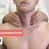

Examination of the Thyroid - Clinical Examination

---

## Subtypes and variants

### Exogenous thyrotoxicosis

#### Etiology [[17]](https://coursology-qbank.com/amboss/article/8zaOuM)[[18]](https://coursology-qbank.com/amboss/article/Ax1R_Q0)

<u>Exogenous thyrotoxicosis</u> is caused by excessive intake of <u>thyroid hormone</u>.

* Intentional

* Therapeutic: suppressive doses of <u>thyroid hormones</u> for <u>thyroid cancer</u> treatment

* Related to psychiatric illness (e.g., <u>eating disorders</u>, <u>body dysmorphia</u>, or <u>factitious disorders</u>) [[19]](https://coursology-qbank.com/amboss/article/meXVzC)

* Attempting weight loss

* Unintentional

* <u>Iatrogenic</u>

* Accidental ingestion (primarily in children) [[17]](https://coursology-qbank.com/amboss/article/8zaOuM)

* Dietary supplements

#### Clinical features [[17]](https://coursology-qbank.com/amboss/article/8zaOuM)[[20]](https://coursology-qbank.com/amboss/article/7Q14xg0)

* <u>Symptoms of thyrotoxicosis</u>

* <u>Goiter</u> is absent.  [[21]](https://coursology-qbank.com/amboss/article/2IWTX50)

#### Diagnostics [[17]](https://coursology-qbank.com/amboss/article/8zaOuM)[[20]](https://coursology-qbank.com/amboss/article/7Q14xg0)

* Low/undetectable <u>TSH</u>

* High levels of T4 and/or T3; T3:T4 <u>ratio</u> < 20 ng/mcg [[17]](https://coursology-qbank.com/amboss/article/8zaOuM)

* Low <u>Tg</u> levels

* Low RAI uptake on <u>scintigraphy</u> [[22]](https://coursology-qbank.com/amboss/article/dTbopG)

#### Treatment [[17]](https://coursology-qbank.com/amboss/article/8zaOuM)

* Taper and stop the <u>exogenous</u> <u>thyroid hormone</u>. [[19]](https://coursology-qbank.com/amboss/article/meXVzC)

* Consider <u>symptomatic therapy for thyrotoxicosis</u> with <u>beta blockers</u> if symptoms are severe.

* Consider psychiatric consultation, depending on the reason for ingestion. [[19]](https://coursology-qbank.com/amboss/article/meXVzC)

* For severe <u>thyrotoxicosis</u>, consider: [[17]](https://coursology-qbank.com/amboss/article/8zaOuM)

* <u>Cholestyramine</u> (which binds to T3 and T4 in the intestine and interrupts the <u>enterohepatic circulation</u>)  [[17]](https://coursology-qbank.com/amboss/article/8zaOuM)

* Charcoal <u>hemoperfusion</u> [[17]](https://coursology-qbank.com/amboss/article/8zaOuM)

---

## Diagnosis

For <u>neonates</u> or pregnant individuals, see “Special patient groups” for additional information.

### Approach

* Initial evaluation: perform clinical assessment and screen <u>thyroid function tests</u> (<u>TFTs</u>) alongside routine <u>laboratory studies</u>.

* Consider alternate diagnoses if <u>TFTs</u> are normal.

* If characteristic features of <u>Graves disease</u> are present: can stop investigations and begin <u>management of Graves disease</u>.

* Identify any <u>tachyarrhythmia</u> requiring treatment (see also “<u>Atrial fibrillation</u>” and “<u>Acute management of tachycardia</u>”).

* Subsequent evaluation depends on the clinical picture . Options include:

* <u>Thyroid scintigraphy</u>: first-line for most patients with uncertain diagnoses, e.g., suspected <u>thyroid adenoma</u> or <u>toxic MNG</u>

* <u>TSH receptor antibody</u> (<u>TRAb</u>): for suspected <u>Graves disease</u> without characteristic features

* <u>Thyroid ultrasound</u>: first-line for pregnant/lactating patients, palpable <u>nodules</u> or suspected thyroiditis

* Further evaluation: based on initial results

* Normal imaging and negative <u>TRAb</u>: consider serum <u>thyroglobulin</u> to identify <u>exogenous thyrotoxicosis</u>

* Inconclusive imaging and negative <u>TRAb</u>: consider <u>thyroid peroxidase antibodies</u> to identify thyroiditis

* Suspicious <u>nodules</u> visible on imaging: refer for <u>FNAC</u> (see also “<u>Thyroid nodules</u>”)

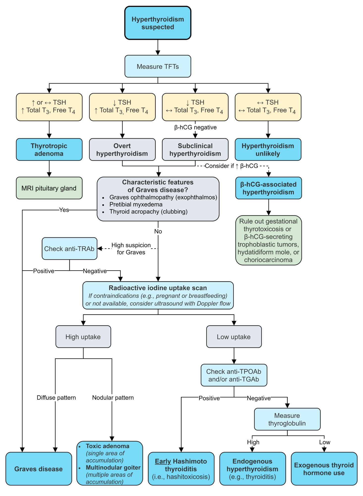

Diagnosis of hyperthyroidism

### Initial evaluation [[17]](https://coursology-qbank.com/amboss/article/8zaOuM)[[23]](https://coursology-qbank.com/amboss/article/35YSPp)

* <u>Thyroid function tests</u>

* <u>Thyroid-stimulating hormone</u> (<u>TSH</u>) level (initial <u>screening test</u>): Typically low/undetectable; a normal <u>TSH</u> level usually rules out <u>hyperthyroidism</u>.

* Free T4 (FT4) and total T3 levels: Typically both elevated; indicated when <u>thyrotoxicosis</u> is strongly suspected or <u>TSH</u> is abnormal

|  Interpretation of elevated thyroid hormones [[17]](https://coursology-qbank.com/amboss/article/8zaOuM)[[23]](https://coursology-qbank.com/amboss/article/35YSPp)  |  |  |  |
| --- | --- | --- | --- |
| Condition | <u>TSH</u> level | Free T4 | Total T3 |
|  <u>Overt hyperthyroidism</u>  and thyrotoxic-phase thyroiditis  | ↓ | ↑ In 90% of cases | ↑ |
|  <u>Subclinical hyperthyroidism</u>  | ↓ | Normal | Normal |
|  Early <u>pregnancy</u>   | ↓ | Normal | Normal |
|  <u>Exogenous</u> thyrotoxicosis or <u>hyperthyroidism</u> in older adults/comorbid illness   | ↓ | ↑ | Normal or ↑ |
| <u>Thyrotropic adenoma</u> | Normal or ↑ | ↑ | ↑ |

* Routine <u>laboratory studies</u>

* <u>CBC</u>: <u>leukocytosis</u> and/or <u>mild anemia</u>

* <u>BMP</u>

* <u>Hyperglycemia</u>

* <u>Mild hypercalcemia</u>

* <u>Liver chemistries</u>: mildly elevated <u>AST</u>, <u>ALT</u>, <u>ALP</u>, and <u>bilirubin</u>

* Serum <u>cholesterol</u>: decreased total <u>cholesterol</u>, <u>LDL</u>, and <u>HDL</u>

* <u>ESR</u>: typically elevated (> 100 mm/hour) in <u>subacute thyroiditis</u>

* <u>ECG</u> findings

* <u>Tachycardia</u>

* <u>Atrial fibrillation</u>

* <u>LBBB</u> and <u>ECG signs of LVH</u> in patients with <u>dilated cardiomyopathy</u>

### Subsequent evaluation

Indicated if the diagnosis remains uncertain after clinical assessment and initial evaluation. The choice and priority of studies depends on the clinical picture, patient characteristics and test availability.

#### <u>TSH receptor antibody</u> (<u>TRAb</u>)

* Indication: if <u>Graves disease</u> is suspected but classic clinical features are absent  [[17]](https://coursology-qbank.com/amboss/article/8zaOuM)

* Interpretation

* Positive: <u>Diagnosis of Graves disease</u> is established.

* Negative: Further investigation is necessary.  [[17]](https://coursology-qbank.com/amboss/article/8zaOuM)

#### Nuclear medicine thyroid scan and radioactive iodine uptake measurement[[24]](https://coursology-qbank.com/amboss/article/no07cS)

* Definitions

* <u>Nuclear medicine thyroid scan</u>: a nuclear medicine imaging technique that visualizes the distribution of <u>thyroid</u> function;   using an oral or IV radiotracer (most commonly <u>Tc-99m</u> pertechnetate or <u>iodine</u>-123)

* <u>Radioactive iodine uptake measurement</u> (<u>RAIU test</u>): a test that quantifies the percentage of the administered amount of <u>radioactive iodine</u> taken up by the <u>thyroid gland</u>  [[25]](https://coursology-qbank.com/amboss/article/isbJuE)

* Indications [[17]](https://coursology-qbank.com/amboss/article/8zaOuM)

* First-line test for most patients with uncertain etiology of <u>thyrotoxicosis</u> after initial evaluation

* Assessment of functional status of <u>thyroid nodules</u> [[25]](https://coursology-qbank.com/amboss/article/isbJuE)

* <u>Thyroid malignancy</u>

* Identification of <u>ectopic</u> <u>thyroid</u> tissue (e.g., <u>lingual thyroid</u>, <u>struma ovarii</u>)

* Evaluation of retrosternal <u>goiters</u>

* Evaluation of <u>thyroglossal cysts</u>

* Contraindications: pregnant or <u>breastfeeding</u> women [[17]](https://coursology-qbank.com/amboss/article/8zaOuM)

* Findings

* <u>Hot nodule</u>: Hyperfunctioning tissue takes up large amounts of <u>radioactive iodine</u>

* <u>Cold nodule</u>: Non-functioning <u>nodules</u> do not take up any <u>radioactive iodine</u> and appear "cold”, but the surrounding normal <u>thyroid</u> tissue takes up <u>radioactive iodine</u> and appears "warm"

* See also “Diagnostics” in “<u>Thyroid cancer</u>” and “<u>Diagnostic steps for thyroid nodules</u>”

|  Characteristic findings of nuclear medicine thyroid scan and RAIU measurement [[24]](https://coursology-qbank.com/amboss/article/no07cS)  |  |  |
| --- | --- | --- |
|  | Appearance of <u>thyroid</u> |  <u>RAIU measurement</u>  |
| Normal <u>thyroid</u> tissue |  * Normal-sized gland with evenly distributed activity   |  * Normal   |
| <u>Graves disease</u> |  * Diffusely enlarged gland with increased activity   |  * ↑   |
| <u>Toxic MNG</u> |  * Heterogeneous appearance  * Several hyperfunctioning (hot) <u>nodules</u>  * Suppression of the rest of the gland   |  * Normal or ↑ (mild)   |
| <u>Toxic adenoma</u> |   * One or two <u>hot nodules</u>  * Suppression of the rest of the gland    |  * ↑ (Mild to moderate)   |
| <u>Destructive thyroiditis</u> |  * No or minimal activity throughout the gland   |  * ↓   |
| <u>Exogenous thyrotoxicosis</u> |  * Overall decreased activity   |  * ↓   |
| <u>Thyrotropic adenoma</u> |  * Enlarged gland with increased activity   |  * ↑   |

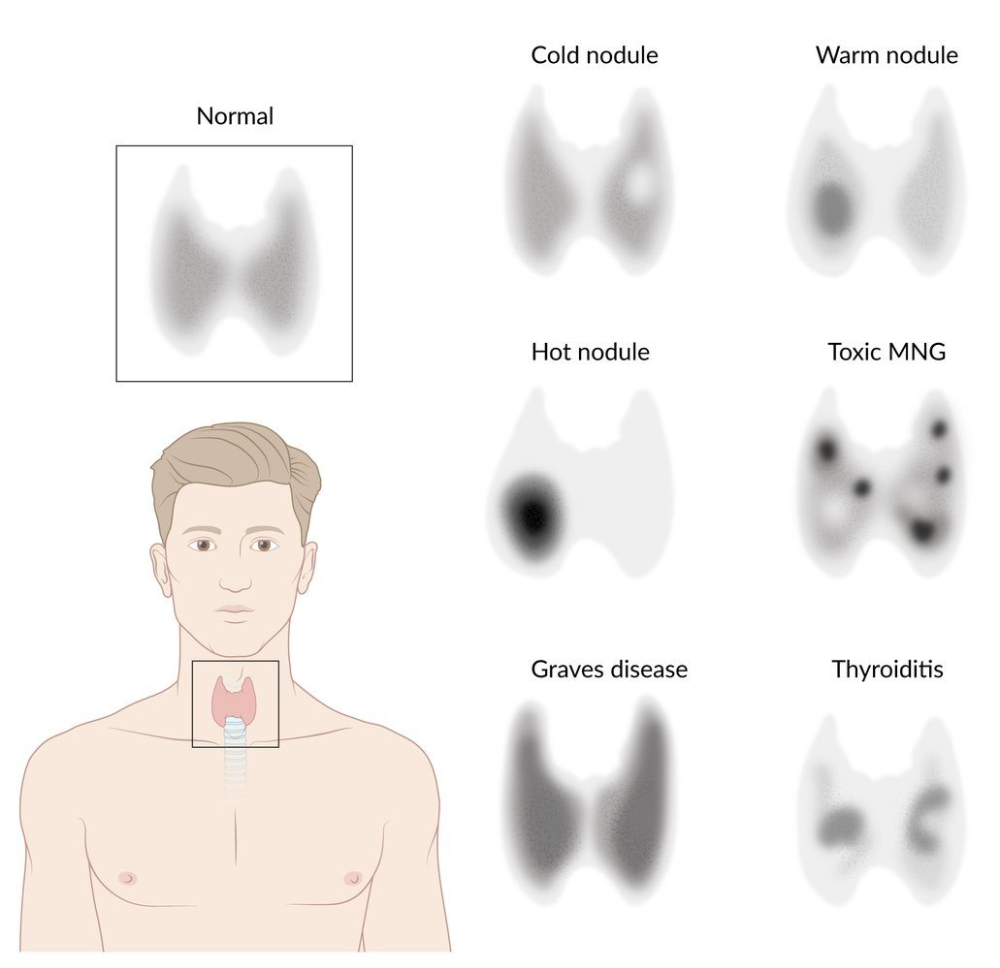

Thyroid scintigraphy

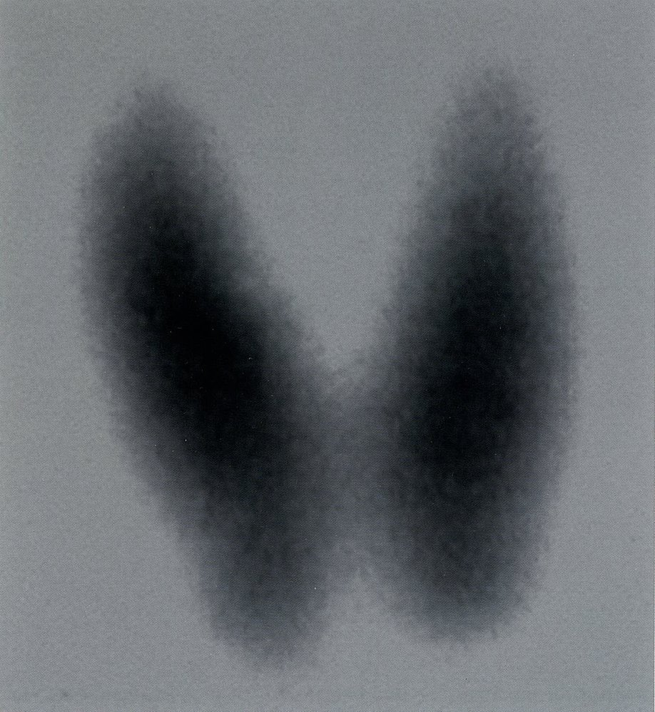

Hyperthyroidism

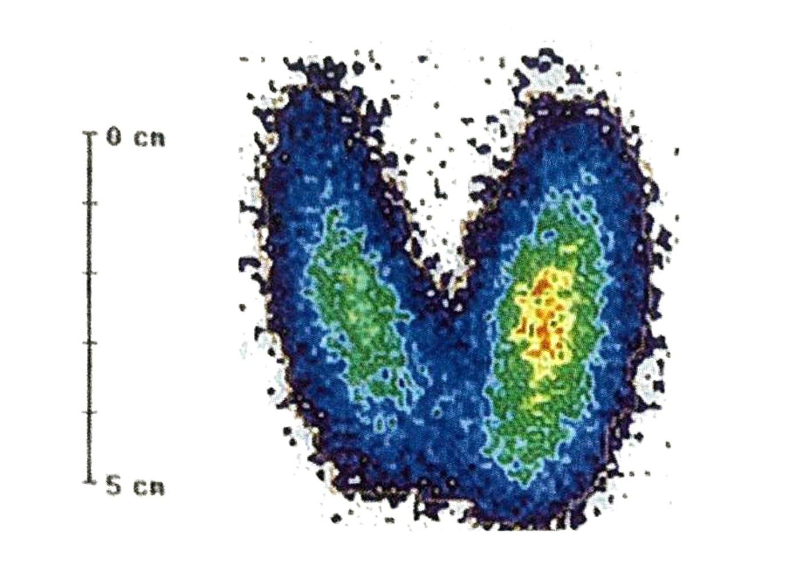

Hyperthyroidism in Graves disease

#### Thyroid ultrasound with Doppler

* Indications [[22]](https://coursology-qbank.com/amboss/article/dTbopG)

* Palpable abnormality, e.g., <u>goiter</u> or <u>nodules</u>

* Additional study following <u>nuclear medicine thyroid scan</u> or second-line initial imaging study

* Preferred imaging technique in pregnant or <u>breastfeeding</u> women

* Typical findings [[22]](https://coursology-qbank.com/amboss/article/dTbopG)

* Changes to morphology: diffuse enlargement or <u>nodules</u>

* Increased <u>perfusion</u>: either diffuse (<u>Graves disease</u>, <u>toxic adenoma</u>) or nodular (<u>toxic MNG</u>)

* Decreased <u>perfusion</u>: <u>destructive thyroiditis</u>

* <u>Hypoechoic</u> areas in acute thyroiditis and <u>malignancy</u>

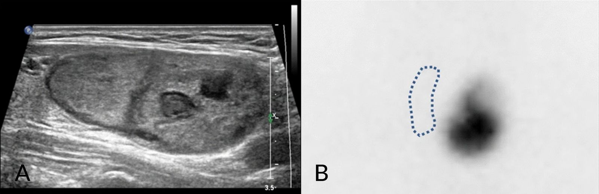

Toxic adenoma

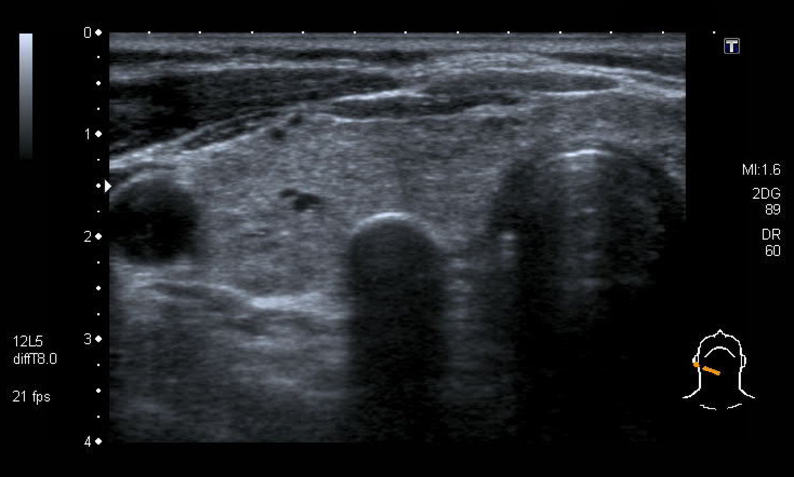

Thyroid nodule with peripheral calcification

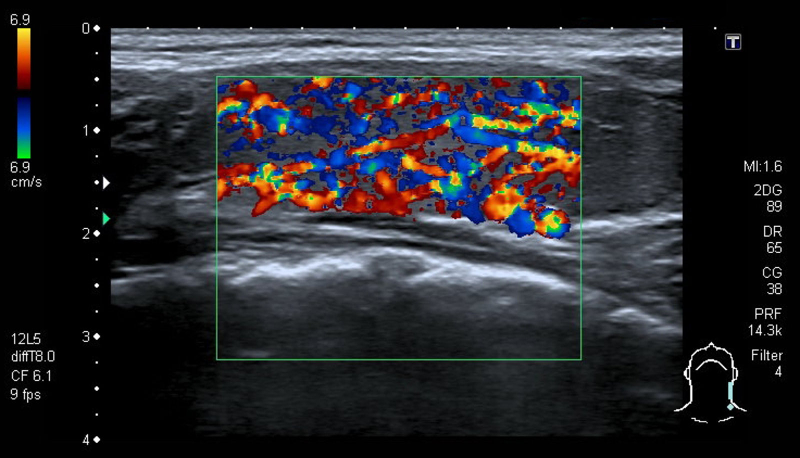

Hypervascular thyroid gland

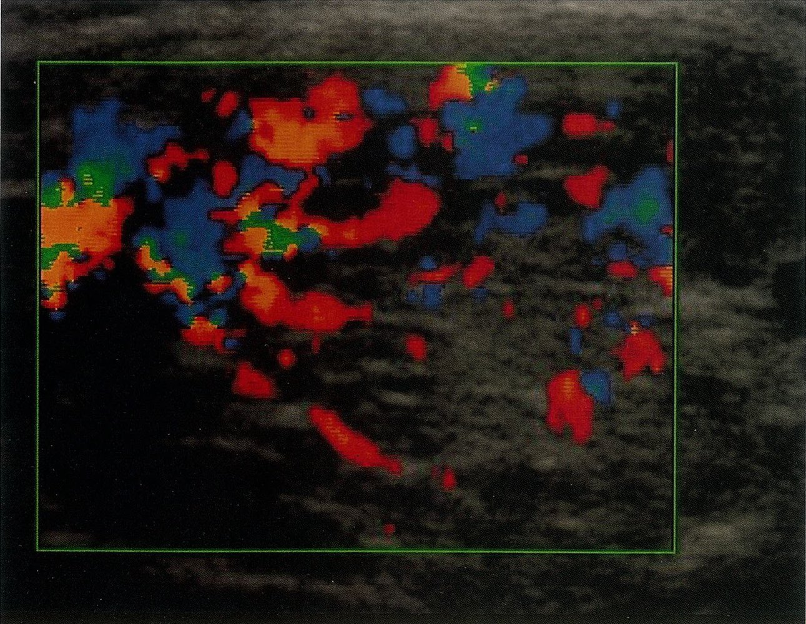

Hypervascularity in Graves disease

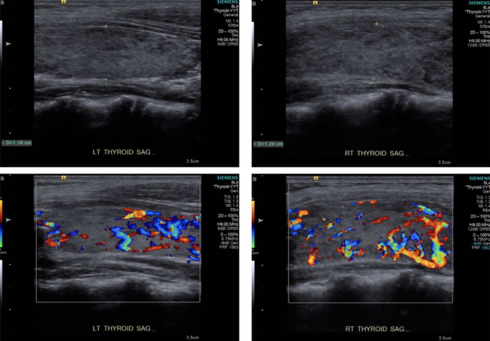

Thyroid gland in Graves disease

### Further evaluation

These additional tests are not routinely required but may be performed depending on the suspected underlying etiology.

* <u>Ultrasound</u>-guided <u>FNAC</u>

* Consider for suspicious <u>nodules</u> (see “<u>Diagnostic steps for thyroid nodules</u>” and “<u>Indications for FNAC in thyroid nodules</u>”).

* Can help confirm etiology if diagnosis remains uncertain (see “Pathological findings” in “<u>Common causes of thyrotoxicosis</u>”)

* Other <u>thyroid antibodies</u> [[17]](https://coursology-qbank.com/amboss/article/8zaOuM)

* <u>Thyroid peroxidase antibodies</u> (<u>TPOAb</u>)

* Indication: suspected <u>subacute lymphocytic thyroiditis</u>, including <u>postpartum thyroiditis</u>

* Elevated levels may also be seen in <u>Graves disease</u>.

* <u>Thyroglobulin antibodies</u> (<u>TgAb</u>): not routinely indicated but can be elevated in <u>Graves disease</u>, autoimmune conditions, and <u>thyroid cancer</u>

* See also “<u>Thyroid antibodies</u>.”

* Serum <u>thyroglobulin</u> (<u>Tg</u>): indicated for suspected <u>exogenous hyperthyroidism</u> with unclear history 

* Serum <u>Tg</u> should be assessed alongside <u>TgAb</u> because a <u>TgAb</u>-positive result indicates an unreliable serum <u>Tg</u> finding.  [[17]](https://coursology-qbank.com/amboss/article/8zaOuM)

* Findings

* <u>Exogenous hyperthyroidism</u>: ↓ <u>Tg</u> due to production that is suppressed by the administered <u>thyroid hormones</u>

* <u>Endogenous</u> <u>hyperthyroidism</u>: normal or ↑ <u>Tg</u>

---

## Differential diagnoses

The <u>symptoms of thyrotoxicosis</u> are nonspecific and overlap significantly with other common conditions. If there is any clinical uncertainty, <u>TSH</u> should be assessed.

* Neuropsychiatric symptoms: <u>anxiety</u>/<u>panic disorders</u>

* <u>Hyperadrenergic symptoms</u>: intoxication with <u>anticholinergics</u>; <u>cocaine</u>/<u>amphetamine</u> misuse; withdrawal syndromes

* Weight loss: <u>diabetes mellitus</u>, <u>malignancy</u>

* Cardiac symptoms: <u>congestive cardiac failure</u>

References:[[2]](https://coursology-qbank.com/amboss/article/Lo0wcS)[[4]](https://coursology-qbank.com/amboss/article/-qYDaq)[[5]](https://coursology-qbank.com/amboss/article/GIYBVq)[[6]](https://coursology-qbank.com/amboss/article/sIYtVq)[[7]](https://coursology-qbank.com/amboss/article/tIYXeq)[[8]](https://coursology-qbank.com/amboss/article/FIYgeq)[[14]](https://coursology-qbank.com/amboss/article/oo001S)

The differential diagnoses listed here are not exhaustive.

---

## Treatment

### Overview [[17]](https://coursology-qbank.com/amboss/article/8zaOuM)[[23]](https://coursology-qbank.com/amboss/article/35YSPp)

* For severe symptoms, screen for <u>thyroid storm</u> (e.g., with <u>BWPS</u>) and start immediate <u>treatment of thyroid storm</u> if present.

* For <u>hyperadrenergic symptoms</u>, initiate <u>symptomatic therapy for thyrotoxicosis</u> (e.g., <u>beta blockers</u>).

* Symptomatic patients and asymptomatic individuals with <u>risk factors</u> : Management depends on the individual clinical situation and patient preferences.

* <u>Graves disease</u>: <u>Antithyroid drugs</u>, <u>RAIA</u>, and <u>thyroid surgery</u> are all effective options (see “<u>Management of Graves disease</u>”).

* <u>Toxic MNG</u> and <u>toxic adenoma</u>: <u>Definitive therapy for hyperthyroidism</u> (i.e., <u>RAIA</u> or <u>thyroid surgery</u>) is preferable to <u>antithyroid drugs</u>.

* Asymptomatic younger adults without <u>risk factors</u>: Consider either observation or treatment.  [[17]](https://coursology-qbank.com/amboss/article/8zaOuM)

* Identify and treat reversible causes (e.g., discontinuing offending medications , starting <u>NSAIDs</u> or <u>corticosteroids</u> for thyroiditis).

* Avoid triggers, e.g., contrast medium, <u>amiodarone</u>, and <u>aspirin</u>.

### Symptomatic therapy for thyrotoxicosis [[17]](https://coursology-qbank.com/amboss/article/8zaOuM)

The treatment of <u>hyperadrenergic symptoms</u> is important for decreasing the risk of cardiac complications in <u>thyrotoxicosis</u>, such as <u>atrial fibrillation</u> and <u>heart failure</u>.

* Indication: all symptomatic patients

* Treatment of <u>hyperadrenergic symptoms</u>: <u>beta blockers</u> (first line)   [[17]](https://coursology-qbank.com/amboss/article/8zaOuM); 

* Provide immediate control of symptoms, e.g., neuropsychiatric and/or <u>hyperadrenergic symptoms</u>

* Treatment options

* First line: <u>propranolol</u> DOSAGE

* Alternatives: <u>atenolol</u> DOSAGE OR <u>metoprolol</u> DOSAGE

* Severe <u>thyrotoxicosis</u> or <u>thyroid storm</u> treated in <u>ICU</u>: <u>esmolol</u> DOSAGE

* If there are <u>contraindications to beta blockers</u>, e.g., <u>severe asthma</u>, <u>Raynaud phenomenon</u> ;  , consider <u>CCBs</u>: <u>verapamil</u> DOSAGE OR <u>diltiazem</u> DOSAGE. [[26]](https://coursology-qbank.com/amboss/article/HHbK7E)

* Treatment of cardiac complications [[23]](https://coursology-qbank.com/amboss/article/35YSPp)

* <u>Heart failure</u>: patients should receive the same treatment as <u>euthyroid</u> patients with <u>heart failure</u> (see “Treatment” in “<u>Acute heart failure</u>”).

* <u>Atrial fibrillation</u>

* May be refractory to treatment until antithyroid therapy has been initiated

* <u>Amiodarone</u> should be avoided.

* See “Treatment” in “<u>Atrial fibrillation</u>” for details on further management.

### Antithyroid drugs

<u>Antithyroid drugs</u> can effectively render a patient <u>euthyroid</u>. 20–75% of patients with <u>Graves disease</u> achieve permanent remission after 1–2 years of treatment; however, some patient groups have a higher likelihood of remission than others.

* Indications

* <u>Thyroid storm</u>: initial management ;   as well as prevention in at-risk patients prior to <u>surgery</u> or <u>RAIA</u>

* <u>Graves disease</u>: Patients with high remission likelihood , and/or moderate to severe active <u>Graves ophthalmopathy</u>   [[27]](https://coursology-qbank.com/amboss/article/mgbVDG)

* Contraindications to both <u>RAIA</u> and <u>surgery</u>

* Other: <u>hyperthyroidism in pregnancy</u>, limited <u>life expectancy</u>, patient preference

* Contraindication: <u>destructive thyroiditis</u> [[17]](https://coursology-qbank.com/amboss/article/8zaOuM)

* Medication for hyperthyroidism
* The choice of medication depends on the severity of symptoms and patient factors.

* Most patients: <u>methimazole</u> DOSAGE

* <u>Thyroid storm</u> or <u>first trimester</u> of <u>pregnancy</u>: <u>propylthiouracil</u> DOSAGE

* Monitoring [[17]](https://coursology-qbank.com/amboss/article/8zaOuM)

* <u>CBC</u>, <u>liver chemistries</u>, and <u>bilirubin</u>

* Obtain baseline prior to therapy.

* Repeat if <u>febrile</u> illness or symptoms of <u>liver</u> injury, e.g., <u>jaundice</u>.

* <u>TFTs</u>: measure free T4 and T32–6 weeks after initiation of therapy and adjust dosage accordingly.

* See also “Adverse effects” in “<u>Antithyroid drugs</u>”.

* Duration of therapy 

* Primary therapy for <u>Graves disease</u>: typically 12–18 months

* Preparation for <u>surgery</u>: given until <u>TFTs</u> normalize, after which <u>surgery</u> may be performed  [[28]](https://coursology-qbank.com/amboss/article/HGbK0v)

* Preparation for <u>RAIA</u>: given until <u>TFTs</u> normalize and stopped 2–3 days before <u>ablation</u>

> [!WARNING]
> Obtain a <u>CBC</u> and <u>liver chemistries</u> immediately if patients develop <u>fever</u> or signs of <u>hepatotoxicity</u> while taking <u>ATD</u>. [[17]](https://coursology-qbank.com/amboss/article/8zaOuM)

> [!TIP]
> <u>ATDs</u> are ineffective in the management of <u>destructive thyroiditis</u>-induced <u>thyrotoxicosis</u>, which is caused by a release of preformed <u>thyroid hormones</u> by the damaged follicles [[17]](https://coursology-qbank.com/amboss/article/8zaOuM)

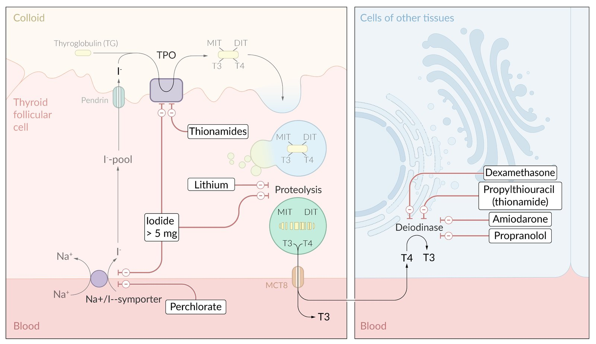

Mechanisms of action: antithyroid drugs

### Definitive therapy for hyperthyroidism and thyrotoxicosis [[17]](https://coursology-qbank.com/amboss/article/8zaOuM)[[29]](https://coursology-qbank.com/amboss/article/ZAaZRM)

#### Radioactive iodine ablation (<u>RAIA</u>) [[30]](https://coursology-qbank.com/amboss/article/po0L1S)

* Definition: destruction of <u>thyroid</u> tissue via <u>radioactive iodine</u> (<u>iodine</u>-131) through a <u>sodium</u>/<u>iodine</u> <u>symporter</u>

* Technical background: Radioactive <u>iodine</u>-131 emits both gamma and beta rays.

* Gamma rays: diagnostic effect

* Beta rays: therapeutic effect

* Indications

* <u>Toxic MNG</u> and <u>toxic adenoma</u> with high nodular <u>radioactive iodine uptake</u>

* Failure to achieve <u>euthyroidism</u> with <u>antithyroid drugs</u> (<u>ATDs</u>) in <u>Graves disease</u>, due to:

* Refractory disease

* Contraindications to <u>ATDs</u>, e.g., <u>liver</u> disease

* Major <u>adverse reactions</u> to <u>ATDs</u>

* High surgical risk due to comorbidities  or previous <u>surgery</u> or radiation of the neck

* Limited life-expectancy

* Other: <u>thyrotoxic periodic paralysis</u>, post-surgical treatment of certain <u>thyroid cancers</u>, large/compressive nontoxic <u>goiters</u>  [[31]](https://coursology-qbank.com/amboss/article/VSbGAG)

* Contraindications

* Pregnant/<u>breastfeeding</u> women

* Children < 5 years of age

* Initial treatment for confirmed or suspected <u>thyroid malignancy</u>

* Moderate to severe <u>Graves ophthalmopathy</u>

* Inability to follow <u>radiation safety</u> regulations

* Preparation for <u>RAIA</u>

* <u>RAIA</u> can cause a transient worsening of <u>hyperthyroidism</u>.

* Prophylactic treatment can reduce the risk of complications in high-risk patient groups, e.g., severe <u>hyperthyroidism</u>, older patients, and those with comorbid conditions. 

* Consider <u>beta blockers</u> even in asymptomatic patients (see “<u>Symptomatic therapy for thyrotoxicosis</u>” for dosages).

* Administer <u>methimazole</u> to rapidly achieve a <u>euthyroid</u> state; must be discontinued 2–3 days before <u>RAIA</u> is started.

* Avoid excess <u>iodine</u> for 7 days prior to <u>RAIA</u>.

* In women of childbearing potential, a negative <u>pregnancy test</u> must be confirmed within 48 hours before <u>RAIA</u>.

* Procedure: Single oral dose of <u>iodine</u>-131 → isotope uptake by <u>thyroid gland</u> → emission of <u>beta radiation</u> that slowly destroys the <u>thyroid</u> tissue

* Complications [[32]](https://coursology-qbank.com/amboss/article/bSbHyG)[[33]](https://coursology-qbank.com/amboss/article/VVXGtC)

* Early

* Most patients with <u>Graves disease</u> become hypothyroid after <u>RAIA</u> and require life-long <u>thyroid hormone</u> replacement with <u>L-thyroxine</u> DOSAGE

* <u>Gastritis</u>: <u>nausea and vomiting</u>

* <u>Sialadenitis</u>

* Other: transient loss of <u>taste</u> or <u>smell</u>, <u>stomatitis</u>, transient <u>bone marrow suppression</u>

* Late

* Radiation-induced thyroiditis: a form of acute thyroiditis that occurs a few days after the <u>thyroid gland</u> is exposed to radiation

* It is most commonly seen following <u>radioiodine therapy</u> in patients with <u>Graves disease</u>, or following <u>external beam radiotherapy</u> for <u>head and neck cancers</u>.

* Patients present with <u>pain</u> in the <u>thyroid</u> region and <u>thyrotoxicosis</u> (due to the release of T3 and T4 following rapid destruction of <u>thyroid</u> tissue).

* Secondary <u>malignancy</u> or <u>leukemia</u>

* Dry mouth (<u>xerostomia</u>)

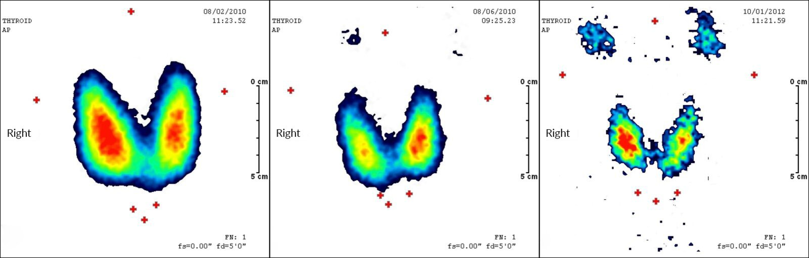

Thyroid scan before and after radioiodine therapy in Graves disease

#### Thyroid surgery for hyperthyroidism [[34]](https://coursology-qbank.com/amboss/article/Dgb1xG)

The <u>efficacy</u> of <u>antithyroid drugs</u> and <u>RAIA</u> has reduced the need for <u>thyroid surgery</u>.

* Indications

* Large <u>goiters</u> (≥ 80 g) or obstructive symptoms

* Confirmed or suspected <u>thyroid</u> <u>malignancy</u>

* <u>Graves disease</u> with: [[35]](https://coursology-qbank.com/amboss/article/-yaD3M)

* Concomitant <u>primary hyperparathyroidism</u> or <u>periodic paralysis</u>

* Moderate to severe active <u>Graves ophthalmopathy</u>  [[27]](https://coursology-qbank.com/amboss/article/mgbVDG)

* <u>Toxic MNG</u> or <u>toxic adenoma</u> with: concomitant <u>primary hyperparathyroidism</u>, insufficient <u>RAIA</u>, or retrosternal extension

* Other: large <u>thyroid nodules</u> , refractory <u>amiodarone</u>-induced <u>thyrotoxicosis</u> , planned <u>pregnancy</u> within next 6 months , or patient preference

* Contraindications

* Severe comorbidities that influence surgical risk

* <u>Pregnancy</u>

* Preparation for thyroid surgery

* Achieving <u>euthyroidism</u> prior to <u>surgery</u>: preoperative application of <u>antithyroid drugs</u> (and <u>beta blockers</u> if necessary) for at least 4–8 weeks if possible (see “<u>Symptomatic therapy for thyrotoxicosis</u>” and “<u>Antithyroid drugs</u> for <u>thyrotoxicosis</u>” for doses).

* Patients with <u>Graves disease</u>: <u>potassium iodide</u> solution DOSAGE for 10 days preoperatively (harnesses the <u>Wolff-Chaikoff effect</u>)

* Assess for <u>hypocalcemia</u>: Replete <u>calcium</u> DOSAGE and 25-hydroxy <u>vitamin D</u> as needed

* Urgent <u>surgery</u> or antithyroid <u>drug allergy</u>/intolerance: Consider adding <u>corticosteroids</u> and <u>cholestyramine</u> in consultation with a specialist.  [[26]](https://coursology-qbank.com/amboss/article/HHbK7E)[[36]](https://coursology-qbank.com/amboss/article/hHbcJE)

* Procedure

* <u>Graves disease</u> or <u>toxic MNG</u>: near-total or <u>total thyroidectomy</u>

* Isolated <u>toxic adenoma</u>: <u>lobectomy</u>

* See also “Procedure/application” in “<u>Thyroid surgery</u>.”

* Postprocedural care for thyroid surgery

* Measure serum <u>calcium</u> and <u>PTH</u> levels at 6 and 12 hours post-operatively and start <u>calcium</u> and <u>calcitriol</u>.  [[17]](https://coursology-qbank.com/amboss/article/8zaOuM)

* Wean <u>beta blockers</u>.

* Stop <u>ATDs</u>.

* Start <u>levothyroxine replacement</u>. . [[34]](https://coursology-qbank.com/amboss/article/Dgb1xG)

### Ongoing management for patients treated for hyperthyroidism [[17]](https://coursology-qbank.com/amboss/article/8zaOuM)

* Ongoing management is usually provided by <u>endocrinology</u> and/or <u>surgery</u>.

* <u>Thyroid</u> function is measured at set intervals depending on the treatment given.  [[17]](https://coursology-qbank.com/amboss/article/8zaOuM)

* Patients who have undergone <u>surgery</u> are given <u>calcium</u> and <u>vitamin D</u> and monitored for <u>postoperative hypoparathyroidism</u>.

---

## Special patient groups

<u>Management of hyperthyroidism</u> differs slightly in select patient groups (e.g., individuals who are pregnant or planning <u>pregnancy</u>, <u>newborns</u>). For more information on <u>management of Graves disease</u>, the most common cause of <u>hyperthyroidism</u>, see “Special patient groups” in “<u>Graves disease</u>.”

---

## Thyroid storm

### Definition [[17]](https://coursology-qbank.com/amboss/article/8zaOuM)

* An acute exacerbation of <u>hyperthyroidism</u> that results in a life-threatening <u>hypermetabolic state</u>.

* Also known as <u>thyrotoxic crisis</u>

### Etiology [[17]](https://coursology-qbank.com/amboss/article/8zaOuM)

* <u>Iatrogenic</u>

* <u>Thyroid surgery</u>

* <u>RAIA</u>

* <u>Exogenous</u> <u>iodine</u> from contrast media or <u>amiodarone</u>

* Discontinuation of antithyroid medication

* <u>Stress</u>-related <u>catecholamine</u> surge 

* Nonthyroidal <u>surgery</u>

* Anesthesia induction

* <u>Labor</u>

* Intercurrent illness, e.g., <u>sepsis</u>, <u>myocardial infarction</u>, <u>diabetic ketoacidosis</u>

### Clinical features [[17]](https://coursology-qbank.com/amboss/article/8zaOuM)

* <u>Hyperpyrexia</u> with profuse sweating

* <u>Tachycardia</u> (> 140/minute) and (possibly severe) <u>arrhythmia</u> (e.g., <u>atrial fibrillation</u>), <u>hypertension</u> with wide <u>pulse pressure</u>, <u>congestive cardiac failure</u>

* <u>Hypotension</u>/<u>shock</u> secondary to <u>high output heart failure</u> or <u>hypovolemia</u> as a result of GI and <u>insensible losses</u>

* <u>Symptoms of thyrotoxicosis</u>

* Abdominal <u>pain</u>

* Severe <u>nausea</u>, <u>vomiting</u>, <u>diarrhea</u>, possibly <u>jaundice</u>

* Severe <u>agitation</u> and <u>anxiety</u>, <u>delirium</u> and <u>psychoses</u>, <u>seizures</u>, <u>coma</u>

### Diagnostics [[17]](https://coursology-qbank.com/amboss/article/8zaOuM)

* A <u>thyroid storm</u> is diagnosed on the basis of classic clinical features and supporting <u>TFT</u> abnormalities, e.g., low/undetectable <u>TSH</u>, elevated free T3/T4.

* Further tests should be performed to identify any underlying precipitants and to assess for complications, e.g.:

* <u>ECG</u> to assess for <u>atrial fibrillation</u>

* <u>Liver chemistries</u> to assess for evidence of <u>jaundice</u>

* The <u>Burch-Wartofsky Point Scale</u> (<u>BWPS</u>) can be considered to assess disease severity and guide treatment.

|  Burch-Wartofsky Point Scale for the diagnosis of thyroid storm (<u>BWPS</u>) [[17]](https://coursology-qbank.com/amboss/article/8zaOuM)  |  |  |
| --- | --- | --- |
| Criteria |  | Points |
| Temperature |  37.2–37.7°C (99.0–99.9°F) | 5 |
|  37.8–38.2°C (100–100.9°F) | 10 |  |
|  38.3–38.8°C (101–101.9°F) | 15 |  |
|  38.9–39.4°C (102–102.9°F) | 20 |  |
|  39.4–39.9°C (103–103.9°F) | 25 |  |
|  ≥ 40°C (≥ 104°F) | 30 |  |
| <u>Tachycardia</u> | 100–109/minute | 5 |
| 110–119/minute | 10 |  |
| 120–129/minute | 15 |  |
| 130–139/minute | 20 |  |
| ≥ 140/minute | 25 |  |
| <u>Atrial fibrillation</u> | Absent | 0 |
| Present | 10 |  |
| <u>Congestive heart failure</u> | Absent | 0 |
| Mild | 5 |  |
| Moderate | 10 |  |
| Severe | 20 |  |
| Gastrointestinal-hepatic dysfunction | Absent | 0 |
| Moderate (e.g., <u>diarrhea</u>, abdominal <u>pain</u>, <u>nausea</u>/<u>vomiting</u>) | 10 |  |
| Severe (<u>jaundice</u>) | 20 |  |
| <u>Central nervous system</u> disturbance | Absent | 0 |
| Mild (<u>agitation</u>) | 10 |  |
| Moderate (e.g., <u>delirium</u>, <u>psychosis</u>, extreme <u>lethargy</u>) | 20 |  |
| Severe (e.g., <u>seizure</u>, <u>coma</u>) | 30 |  |
| Identified precipitant | Yes | 10 |
| No | 0 |  |
|  Interpretation   * > 45 points: <u>thyroid storm</u>  * 25–44 points: impending <u>thyroid storm</u>  * < 25 points: <u>thyroid storm</u> unlikely     |  |  |

Burch-Wartofsky Point Scale (BWPS) for Thyrotoxicosis

### Treatment of thyroid storm [[17]](https://coursology-qbank.com/amboss/article/8zaOuM)[[37]](https://coursology-qbank.com/amboss/article/2SbT_G)

<u>Thyroid storm</u> has a high <u>mortality rate</u> and patients should receive aggressive treatment to manage complications and restore normal <u>thyroid</u> function.

#### Approach

* Consult critical care for <u>ICU</u> admission and monitoring.

* Start symptomatic treatment to manage <u>hypotension</u>, <u>hyperpyrexia</u>, and <u>tachycardia</u>.

* Administer medication to reduce <u>thyroid hormone synthesis</u> and release, and inhibit their peripheral action.

* Identify and treat any precipitating cause.

* Once the patient is stable, initiate <u>definitive therapy for hyperthyroidism and thyrotoxicosis</u>.

* Consider <u>plasmapheresis</u> or emergency <u>surgery</u> as life-saving treatment for rare refractory cases

#### Symptomatic treatment

* <u>Hyperadrenergic symptoms</u>: <u>beta blockers</u> are first-line 

* Preferred: <u>Propranolol</u> DOSAGE, due to combined beta-blockade and antithyroid effects

* Alternatives

* Preexisting <u>heart failure</u>: <u>esmolol</u> DOSAGE   [[23]](https://coursology-qbank.com/amboss/article/35YSPp)[[38]](https://coursology-qbank.com/amboss/article/HrbKiE)

* Mild obstructive <u>airway</u> disease/stable <u>asthma</u>: <u>atenolol</u> DOSAGE or <u>metoprolol</u> DOSAGE

* <u>Beta blocker contraindications</u>: consider <u>CCBs</u>, e.g., <u>diltiazem</u> DOSAGE

* <u>Hyperthermia</u>

* External <u>cooling techniques</u> (e.g., ice packs, cooling blankets, <u>alcohol</u> washes)

* <u>Antipyretics</u>, e.g., consider IV <u>acetaminophen</u> DOSAGE

* Avoid <u>aspirin</u>.

* <u>Hypotension</u> and <u>hypovolemia</u>: <u>fluid resuscitation</u> to treat insensible and GI losses [[37]](https://coursology-qbank.com/amboss/article/2SbT_G)

* Fluids containing 5–10% dextrose are preferred to meet the high metabolic demand.

* Fluid requirement is often high (3–5 L/day).

* <u>Electrolyte</u> disturbances: (see “<u>Electrolyte repletion</u>” for specific repletion regimens)

* <u>Agitation</u>: <u>benzodiazepines</u>, e.g., <u>lorazepam</u> DOSAGE

* Concurrent conditions: e.g., <u>CHF</u> and/or <u>Atrial fibrillation</u> (See “Management” in “<u>Acute heart failure</u>” and “<u>Management of Afib with RVR</u>”)

> [!WARNING]
> If <u>thyroid storm</u> has led to <u>congestive heart failure</u>, <u>esmolol</u> is the preferred <u>beta blocker</u>. All patients receiving <u>beta blockers</u> should be monitored carefully for <u>signs of heart failure</u>.

#### <u>Antithyroid drugs</u> in <u>thyroid storm</u> [[17]](https://coursology-qbank.com/amboss/article/8zaOuM)[[23]](https://coursology-qbank.com/amboss/article/35YSPp)[[26]](https://coursology-qbank.com/amboss/article/HHbK7E)

* Inhibition of <u>thyroid hormone synthesis</u>

* First line: <u>propylthiouracil</u> DOSAGE

* Alternative: <u>methimazole</u> DOSAGE

* Inhibition of <u>thyroid hormone</u> release (through the <u>Wolff-Chaikoff effect</u>)

* First line: <u>iodine</u> solutions given at least 1 hour after <u>antithyroid drugs</u> 

* <u>Potassium iodide</u> solution DOSAGE

* <u>Lugol</u> solution DOSAGE

* In patients with <u>iodine</u> <u>allergy</u> or <u>iodine</u>-induced <u>thyrotoxicosis</u>, <u>lithium</u> can be used DOSAGE.

* Inhibition of peripheral conversion of T4 to T3

* <u>Propranolol</u>

* <u>Glucocorticoids</u>: can also treat concurrent <u>adrenal insufficiency</u> 

* First line: <u>hydrocortisone</u> DOSAGE

* Alternative: <u>dexamethasone</u> DOSAGE

> [!NOTE]
> Treat <u>thyroid storm</u> with PROverbial PROficiency and POetic GLUttony: PROpranolol, PROpylthiouracil, POtassium iodide, and GLUcocorticoids.

### Acute management checklist for thyroid storm

* Conduct <u>ABCDE survey</u> and draw initial <u>laboratory studies</u> (e.g., <u>TFTs</u>, <u>BMP</u>, <u>liver chemistries</u>)

* Begin <u>IV fluid resuscitation</u>

* Identify and treat <u>tachyarrhythmias</u> or <u>acute heart failure</u>

* Treat <u>hyperadrenergic symptoms</u> with <u>beta blockers</u> (first-line: <u>propranolol</u>).

* <u>Treat hyperthermia</u>: external cooling and <u>acetaminophen</u>.

* Consider <u>BWPS</u> if uncertain diagnosis or for assessing severity and need for aggressive therapy.

* Consult critical care for <u>ICU</u> admission.

* Initiate <u>antithyroid drugs</u>:

* <u>PTU</u>

* <u>KI</u>

* IV <u>glucocorticoids</u>

* Identify and treat reversible triggers.

* <u>Electrolyte repletion</u> as needed

* Administer <u>benzodiazepines</u> as needed for <u>agitation</u>.

* Consider <u>plasmapheresis</u> for life-threatening refractory cases.

* Ensure <u>definitive therapy for hyperthyroidism and thyrotoxicosis</u> when stabilized.

---