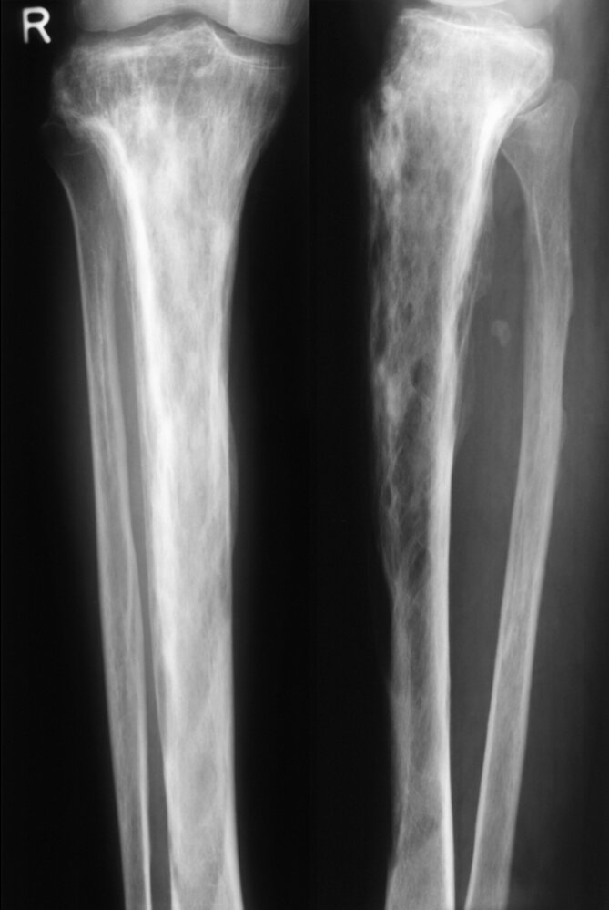
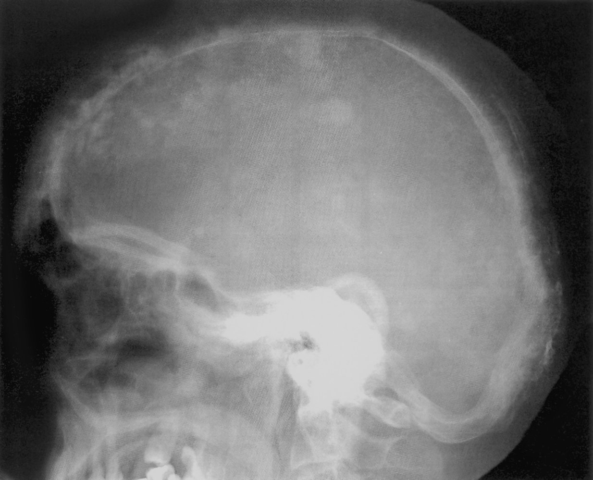
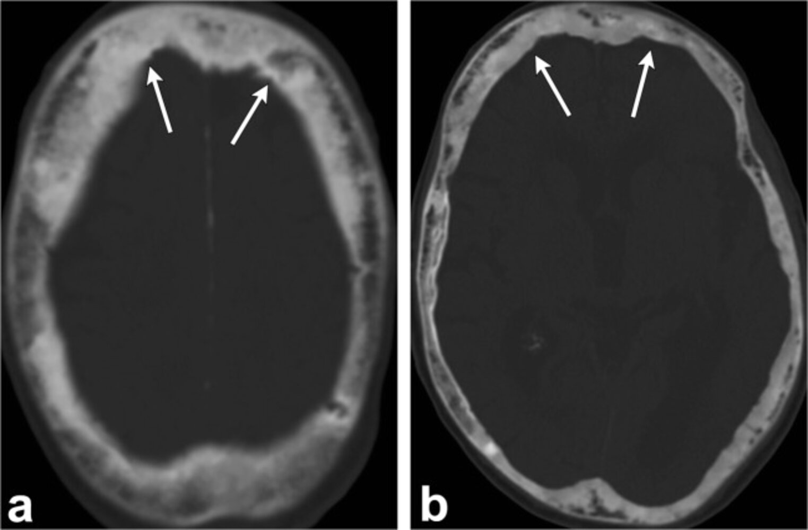
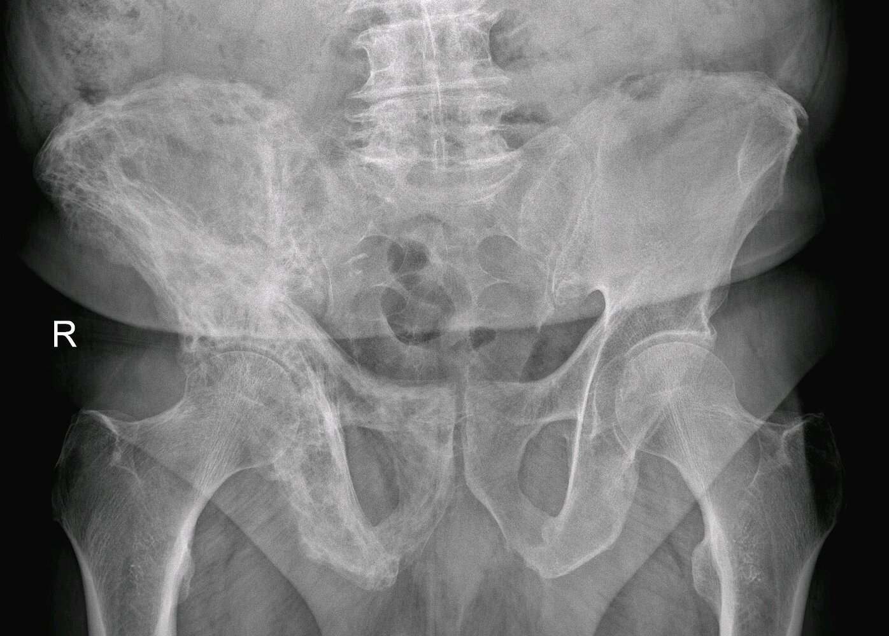
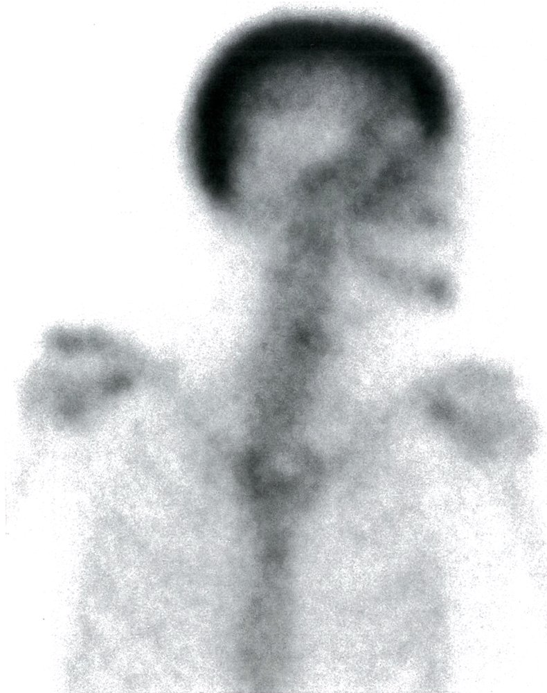
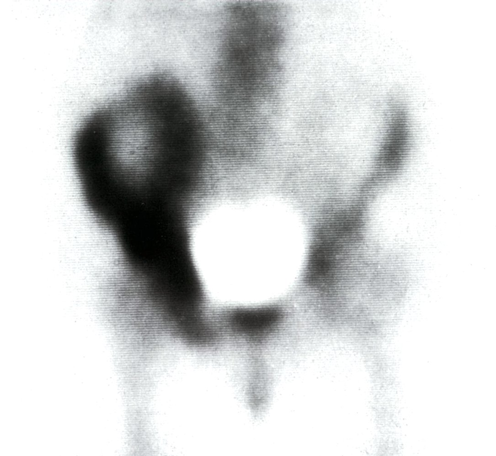
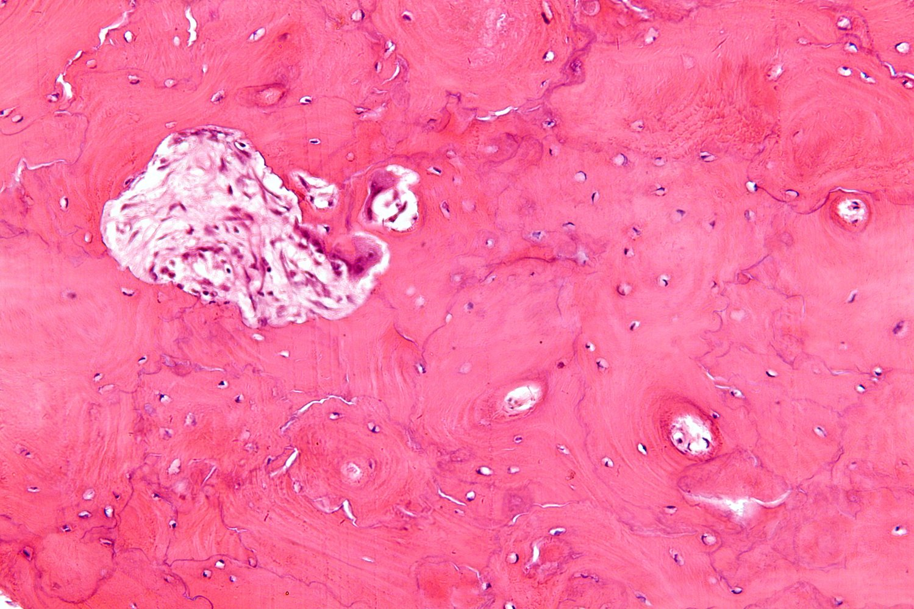

# Paget disease of bone

*Categories: Clinical knowledge > Surgery > Endocrine surgery > Paget disease of bone*

[Original Article Link](https://coursology-qbank.com/amboss/article/FQ0gBf)

---

## Summary

Paget disease of bone (PDB, or <u>osteitis</u> deformans) is a slowly progressive skeletal disease; it can be <u>monostotic</u> or <u>polyostotic</u>. In PDB, increased <u>bone turnover</u> causes normal <u>lamellar bone</u> to be replaced by weak <u>woven bone</u>. PDB is common but underdiagnosed, and its etiology is not known. PDB predominantly affects individuals over 55 years of age. The condition is often identified incidentally based on a finding of isolated elevated serum <u>alkaline phosphatase</u> (<u>ALP</u>) on blood tests. Symptomatic patients present with localized <u>pain</u> and bony deformities (such as bowing of <u>long bones</u>). Skeletal <u>x-rays</u>, <u>bone scans</u>, and serum <u>ALP</u> are important tests for diagnosing and monitoring the progression of PDB. Treatment is mainly supportive and involves <u>bisphosphonate</u> use to inhibit <u>osteoclastic</u> function. Surgical therapy may be indicated in patients with bone deformities or <u>pathological fractures</u>.

PDB should not be confused with <u>Paget disease of the breast</u> or <u>Paget disease of the vulva</u>, which are named after the same physician.

Paget disease of bone fact sheet

---

## Epidemiology

* <u>Prevalence</u>: second most prevalent skeletal disease after <u>osteoporosis</u> in individuals > 50 years of age  [[1]](https://coursology-qbank.com/amboss/article/hl0c9T)

* Sex: <u>♂</u> > <u>♀</u> (1.2:1)

* Age of onset: : > 55 years  [[1]](https://coursology-qbank.com/amboss/article/hl0c9T)

Epidemiological data refers to the US, unless otherwise specified.

---

## Pathophysiology

### Overview

* <u>Idiopathic</u> disease

* Associated with a high rate of <u>bone remodeling</u>: ↑ <u>RANKL</u>-<u>RANK</u> activity → ↑ <u>NF-κB</u> signaling → ↑ <u>osteoclast</u> activity → ↑ <u>osteoblast</u> activity → formation of disorganized (woven) bone

### Stages of Paget disease

<u>Bone remodeling</u> in Paget disease occurs in three phases, followed by a quiescent stage: [[2]](https://coursology-qbank.com/amboss/article/BOYzu6)

* Lytic phase: ↑ number of <u>osteoclasts</u> appear in bone → ↑ <u>osteoclastic</u> activity → ↑ rate of bone resorption

* Mixed lytic and blastic phase: ↑ <u>osteoclastic</u> activity is accompanied by an ↑ number of <u>osteoblasts</u>, which infiltrate the lacunae:   → ↑ rate of bone formation with haphazardly laid <u>collagen fibers</u>;   → formation of abnormal hypervascular <u>woven bone</u>

* <u>Sclerotic</u> phase: <u>Osteoblastic</u> activity overtakes <u>osteoclastic</u> activity, which leads to formation of dense, <u>sclerotic</u> bone.

* Quiescent stage: Both <u>osteoclastic</u> and <u>osteoblastic</u> activity cease (“quiet phase” of the disease).

### Disease localization

The <u>pelvis</u>, <u>skull</u>, <u>vertebral column</u>, and <u>long bones</u> of the lower extremities are the most commonly affected sites.

* <u>Monostotic</u> PDB: affects only one bone (∼ ⅓ of cases)

* <u>Polyostotic</u> PDB: affects two or more bones (∼ ⅔ of cases)

---

## Clinical features

* Approximately 70–90% of cases are asymptomatic.

* Bone <u>pain</u>, which may be associated with <u>erythema</u> and elevated <u>skin</u> temperature over the affected bones

* <u>Pathological fractures</u>: chalk-stick <u>fractures</u> of <u>long bones</u>  [[2]](https://coursology-qbank.com/amboss/article/BOYzu6)

* Bony deformities, e.g., bowing of legs (<u>saber shin</u>)

* <u>Skull</u> involvement (in ∼ 40% of cases)

* <u>Skull</u> enlargement (increasing hat size)

* <u>Cranial nerve</u> deficits

* Impaired <u>hearing</u>: due to <u>ankylosis</u> of the <u>ossicles</u> ;   and narrowing of the <u>internal auditory meatus</u>

* <u>Headache</u>

* <u>Leonine facies</u>

* <u>Cauda equina syndrome</u>, <u>nerve root</u> compression, <u>spinal stenosis</u>

---

## Diagnosis

### Approach

* Suspect PDB in adults with any of the following:

* <u>Idiopathic</u> serum <u>ALP</u> elevation

* Incidental radiographic findings of bone disease

* Characteristic clinical features, e.g., bone <u>pain</u>

* Obtain <u>x-rays</u> to confirm the diagnosis. [[3]](https://coursology-qbank.com/amboss/article/x-1Ezj0)[[4]](https://coursology-qbank.com/amboss/article/C-1qzj0)

* Symptomatic: targeted imaging of affected areas

* Asymptomatic: imaging of abdomen, <u>skull</u>, <u>facial bones</u>, and tibias

* If PDB is confirmed:

* Order <u>bone scintigraphy</u>.

* Obtain <u>laboratory studies</u>.

> [!TIP]
> PDB should be considered in asymptomatic patients with isolated total <u>ALP</u> elevation that cannot be explained by any other condition (e.g., <u>cholestasis</u> or <u>bone metastases</u>).

### Imaging studies [[3]](https://coursology-qbank.com/amboss/article/x-1Ezj0)[[4]](https://coursology-qbank.com/amboss/article/C-1qzj0)

#### <u>X-ray</u>

In isolation, the following findings are nonspecific; in combination, they can confirm the diagnosis. [[3]](https://coursology-qbank.com/amboss/article/x-1Ezj0)[[5]](https://coursology-qbank.com/amboss/article/BPWzSl0)

* General findings [[6]](https://coursology-qbank.com/amboss/article/kIYm1q)

* Bone deformity with <u>osteolytic</u> and <u>osteosclerotic</u> lesions

* Expansion or enlargement of a section of the bone

* Thickened <u>cortical bone</u>

* Coarsened trabeculae

* Loss of distinction between the medulla and cortex

* Site-specific findings [[6]](https://coursology-qbank.com/amboss/article/kIYm1q)

* <u>Skull</u> <u>x-ray</u>: thickening of the diploe; <u>osteoporosis</u> circumscripta (cotton wool appearance)

* <u>Vertebral</u> <u>x-ray</u>: thickening of the upper and lower plates of the <u>vertebral body</u> (picture frame appearance), diffuse enlargement of the <u>vertebrae</u> (ivory <u>vertebra</u>)

* <u>Pelvic</u> <u>x-ray</u>: disruption and/or fusion of <u>sacroiliac joints</u>; thickened iliopectineal line (brim sign)

Paget disease of lower leg

Paget disease of the skull

Paget disease of bone

Paget disease of pelvis

#### <u>Bone scintigraphy</u>

* Indications: all patients with confirmed PDB

* Use: to assess the extent of metabolically active disease   [[3]](https://coursology-qbank.com/amboss/article/x-1Ezj0)

* Findings: Increased uptake of <u>Tc-99m</u> resulting from increased vascularity in active pagetic foci

Nuclear medicine bone scan in Paget disease

Nuclear medicine bone scan in Paget disease of the bone

#### CT and/or <u>MRI</u>

* Not routinely required for diagnosis

* May be used to assess for complications of PDB, e.g., <u>osteosarcoma</u>

### <u>Laboratory studies</u> [[3]](https://coursology-qbank.com/amboss/article/x-1Ezj0)[[4]](https://coursology-qbank.com/amboss/article/C-1qzj0)[[7]](https://coursology-qbank.com/amboss/article/dZWo0P0)

<u>Laboratory studies</u> support the diagnosis and rule out alternative diagnoses, and they should be obtained after imaging studies.

#### Initial studies

* Serum total <u>ALP</u>: often significantly increased; first-line test to assess disease severity and monitor response to therapy

* Serum <u>calcium</u>, <u>phosphate</u>, and <u>parathyroid hormone</u> (<u>PTH</u>) levels: typically normal  [[6]](https://coursology-qbank.com/amboss/article/kIYm1q)[[8]](https://coursology-qbank.com/amboss/article/WZWP0P0)

* <u>Liver chemistries</u>: to rule out <u>ALP</u> elevation due to <u>liver</u> dysfunction

* 25–hydroxyvitamin D: to assess for <u>vitamin D</u> deficiency

* <u>Creatinine</u>: to assess for renal dysfunction

* See also “<u>Laboratory evaluation of bone disease</u>.”

> [!TIP]
> <u>Immobilization</u> of affected bones can cause <u>non-PTH-mediated hypercalcemia</u> (and <u>hypercalciuria</u>). <u>Secondary hyperparathyroidism</u> affects 12–18% of patients with PDB. [[8]](https://coursology-qbank.com/amboss/article/WZWP0P0)

#### Additional studies [[3]](https://coursology-qbank.com/amboss/article/x-1Ezj0)[[7]](https://coursology-qbank.com/amboss/article/dZWo0P0)

For patients with normal serum total <u>ALP</u>, consider the following in consultation with a specialist, e.g., <u>endocrinology</u>:

* Urinary markers of <u>collagen</u> degradation (e.g., deoxypyridinoline, N–telopeptide, and C–telopeptide)  [[3]](https://coursology-qbank.com/amboss/article/x-1Ezj0)

* Other markers of <u>bone turnover</u> (e.g., <u>bone-specific ALP</u>, <u>procollagen</u> type I N-terminal propeptide)

### <u>Bone biopsy</u>

* Not routinely recommended or performed

* Typically shows a chaotic, <u>mosaic</u>-like pattern of irregularly juxtaposed lamellar and <u>woven bone</u>

Paget disease of bone (Osteitis deformans)

---

## Differential diagnoses

* <u>Bone metastases</u>

* <u>Primary hyperparathyroidism</u>

* <u>Osteopetrosis</u> (<u>marble bone disease</u>)

* <u>Fibrous dysplasia</u>

The differential diagnoses listed here are not exhaustive.

---

## Treatment

### Pharmacotherapy [[3]](https://coursology-qbank.com/amboss/article/x-1Ezj0)[[4]](https://coursology-qbank.com/amboss/article/C-1qzj0)

#### <u>Bisphosphonates</u>

* First-line therapy for patients with bone <u>pain</u> and those at risk of bone complications   [[9]](https://coursology-qbank.com/amboss/article/3ZWSYP0)

* Mechanism: induce <u>apoptosis</u> of <u>osteoclasts</u>

* Agents

* Preferred: a single dose of IV <u>zoledronate</u> (<u>off-label</u>) DOSAGE [[4]](https://coursology-qbank.com/amboss/article/C-1qzj0)

* Alternatives: IV pamidronate , oral <u>bisphosphonates</u> (e.g., tiludronate, alendronate, risedronate)  [[4]](https://coursology-qbank.com/amboss/article/C-1qzj0)

#### Other agents [[3]](https://coursology-qbank.com/amboss/article/x-1Ezj0)[[7]](https://coursology-qbank.com/amboss/article/dZWo0P0)

* <u>Calcitonin</u>: less effective than <u>bisphosphonates</u>; may be considered if <u>bisphosphonates</u> are poorly tolerated

* <u>Calcium</u> and <u>vitamin D</u> supplementation: to prevent <u>hypocalcemia</u> and <u>secondary hyperparathyroidism</u> in patients undergoing <u>bisphosphonate</u> therapy

* <u>Oral analgesics</u> (e.g., <u>NSAIDs</u>): as needed for <u>pain management</u>

### Surgical therapy [[3]](https://coursology-qbank.com/amboss/article/x-1Ezj0)[[4]](https://coursology-qbank.com/amboss/article/C-1qzj0)

* Indications: bone deformities, <u>pathological fractures</u>, <u>osteoarthritis</u>

* Techniques: <u>osteotomy</u>, <u>fracture</u> fixation, <u>arthroplasty</u>

* Important considerations: Active pagetic foci can be highly vascular and tend to bleed heavily during <u>surgery</u>.

---

## Complications

* <u>Osteoarthritis</u>

* Malignant degeneration into <u>osteosarcoma</u> (very rare: < 1% of cases)

* <u>High-output cardiac failure</u> (due to the formation of arteriovenous shunts within the bone, which leads to an increased overall blood flow)

* <u>Hyperuricemia</u>

We list the most important complications. The selection is not exhaustive.

---