# Thyroid cancer

*Categories: Clinical knowledge > Surgery > Endocrine surgery > Thyroid cancer*

[Original Article Link](https://coursology-qbank.com/amboss/article/Vg0G82)

---

## Summary

<u>Thyroid</u> cancer is a <u>malignant tumor</u> that arises from either the <u>thyrocytes</u> or the <u>parafollicular cells</u> of the <u>thyroid gland</u>. It is more common in women, especially between 30–50 years of age. The predominant <u>risk factors</u> for <u>thyroid</u> cancer are a history of childhood <u>irradiation</u> to the head and neck and a <u>family history</u> of <u>thyroid</u> cancer. <u>Thyroid</u> cancer typically manifests as firm to hard <u>thyroid nodule</u> (or <u>nodules</u>). Initial evaluation of all patients includes <u>TSH</u> assay and <u>thyroid ultrasound</u>. <u>Sonographic signs of thyroid cancer</u> include a solid, <u>hypoechoic</u> <u>nodule</u>(s) with irregular margins, microcalcifications, and evidence of local infiltration into adjacent structures or cervical <u>lymph nodes</u>. On <u>thyroid scintigraphy</u>, which should be obtained in patients with low serum <u>TSH</u>, a malignant <u>nodule</u> is typically “cold” or hypofunctional. Cytopathological analysis with <u>FNAB</u> is required to confirm the diagnosis. Depending on <u>the cell</u> of origin, <u>thyroid</u> cancer can be classified as <u>papillary</u>, follicular, medullary, or <u>anaplastic thyroid cancer</u>. Most <u>thyroid</u> cancers are treated surgically with <u>total thyroidectomy</u> (in some cases with <u>hemithyroidectomy</u>), followed by <u>adjuvant therapy</u>, which may include <u>RAIA</u> and <u>TSH suppression therapy</u> with <u>L-thyroxine</u>, <u>radiation therapy</u>, and <u>chemotherapy</u>. In advanced <u>anaplastic carcinoma</u>, only <u>palliative care</u> may be feasible. The prognosis depends on the type of <u>thyroid</u> cancer.

---

## Etiology

* Genetic factors

* Medullary <u>carcinoma</u>: associated with <u>MEN2</u> (<u>RET gene</u> mutations) or familial medullary <u>carcinoma</u>

* <u>Papillary</u> <u>carcinoma</u>: associated with <u>RET</u>/PTC rearrangements and <u>BRAF</u> mutations

* <u>Follicular carcinoma</u>: associated with PAX8-PPAR-γ rearrangement and RAS mutation

* Undifferentiated/<u>anaplastic carcinoma</u>: associated with <u>TP53</u> mutation

* <u>Ionizing radiation</u>;  (particularly during childhood): mostly associated with <u>papillary</u> <u>carcinoma</u>

References:[[3]](https://coursology-qbank.com/amboss/article/1m02eg)

---

## Overview

|  Characteristic features of thyroid cancer [[4]](https://coursology-qbank.com/amboss/article/em0xeg) |  |  |  |  |  |
| --- | --- | --- | --- | --- | --- |
| Tissue of origin | <u>Carcinoma</u> | Differentiation | Characteristics | Distribution | Peak <u>incidence</u> |
| <u>Thyrocytes</u> |  Papillary thyroid carcinoma   | Well differentiated |   * Most common type of <u>thyroid</u> cancer  * Palpable <u>lymph nodes</u> due to <u>metastatic</u> spread (often detected before primary <u>tumor</u>)  * May be multifocal  * Very good prognosis    |  * ∼ 80% of cases [[5]](https://coursology-qbank.com/amboss/article/SEXyE-)   |  * 30–50 years of age   |
| Follicular thyroid carcinoma |   * <u>Hematogenous metastasis</u> especially to  * <u>Lungs</u>  * Bone (lytic lesions)  * Rarely multifocal  * Vascular and capsular invasion  * Good prognosis    |  * ∼ 10% of cases [[6]](https://coursology-qbank.com/amboss/article/hEXcv-)   |  * 40–60 years of age   |  |  |
| Anaplastic thyroid carcinoma | Poorly differentiated |   * Rapid local growth  * Symptoms of compression of the structures of the neck (e.g. <u>dysphagia</u>, <u>dyspnea</u>)  * Lymphatic and <u>hematogenous metastasis</u>  * Very poor prognosis    |  * ∼ 1–2% of cases [[7]](https://coursology-qbank.com/amboss/article/3EXSv-)   |  * After 60 years of age   |  |
| <u>Parafollicular cells</u> (<u>C cells</u>) |  Medullary thyroid carcinoma   |   * Sometimes a genetic predisposition → <u>multiple endocrine neoplasia type 2</u> (<u>MEN2</u>) (25% of medullary <u>carcinomas</u>)  * Sporadic (75% of medullary <u>carcinomas</u>)  * Produces <u>calcitonin</u>  * <u>Diarrhea</u> and <u>facial flushing</u>  [[8]](https://coursology-qbank.com/amboss/article/u0Xp39)    |  * < 10%of cases [[9]](https://coursology-qbank.com/amboss/article/REXlv-)   |  * 50–60 years of age   |  |

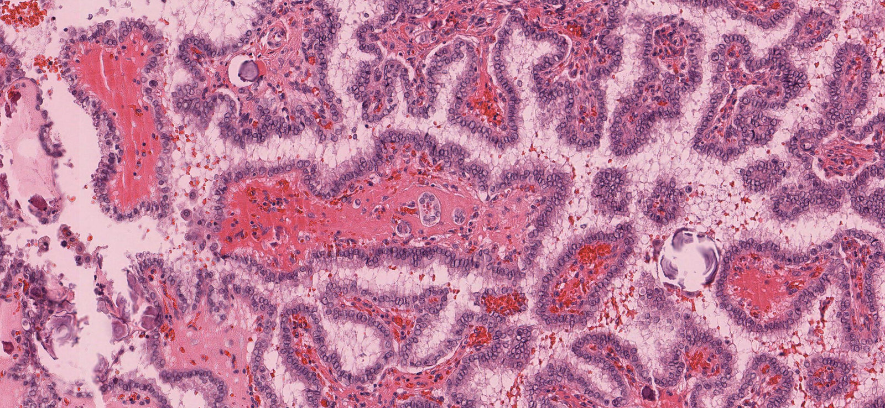

Papillary thyroid carcinoma

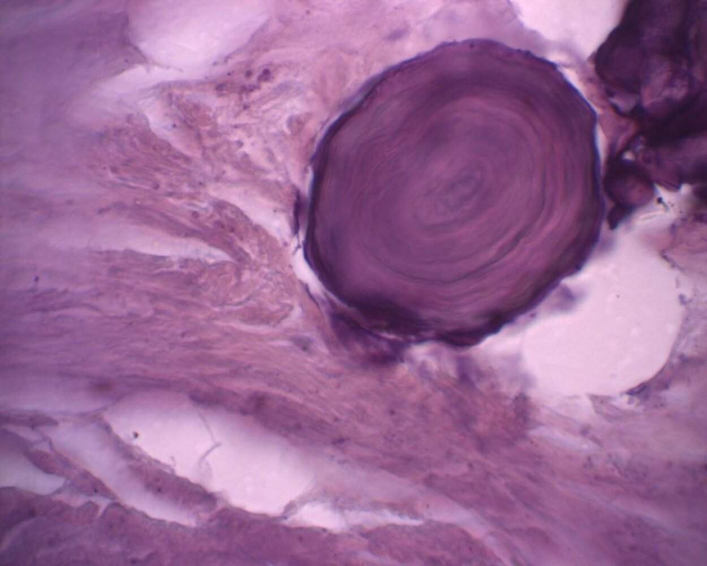

Psammoma body

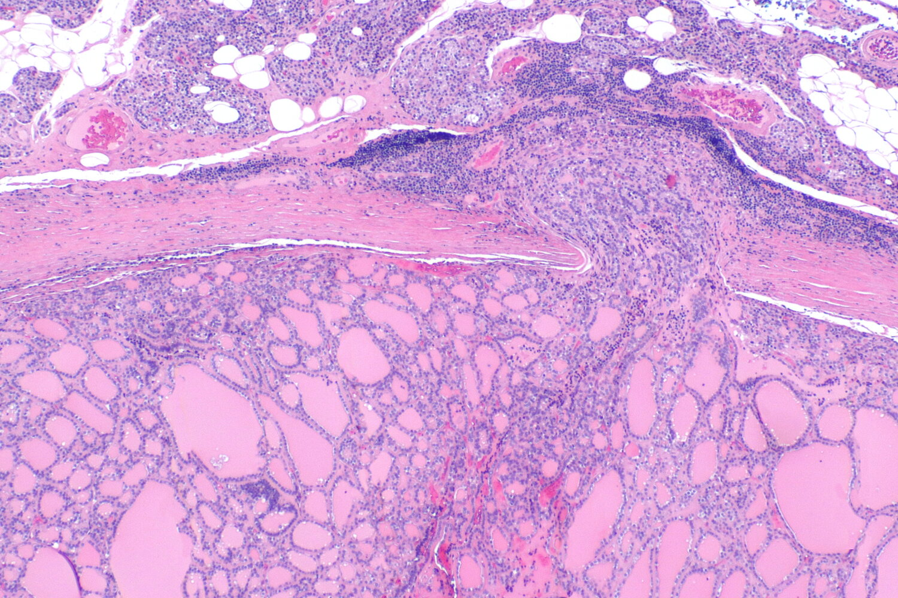

Follicular thyroid carcinoma

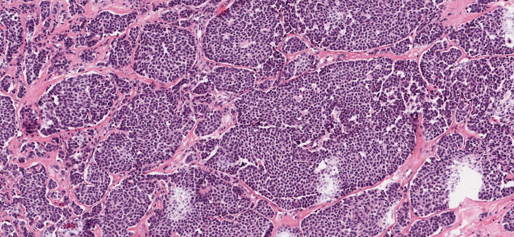

Medullary thyroid carcinoma

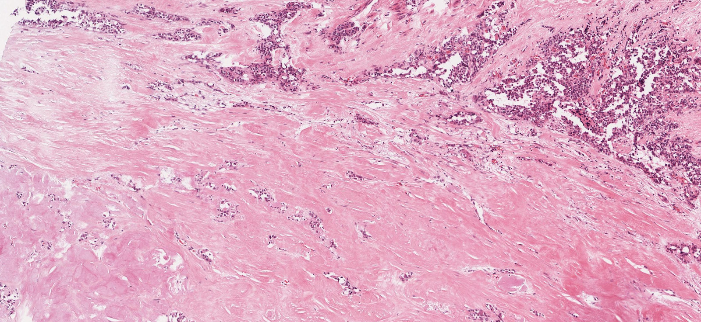

Amyloid deposits in medullary thyroid carcinoma

> [!NOTE]
> Papillary <u>carcinoma</u> is the most Prevalent type of <u>thyroid</u> cancer, it features Palpable <u>lymph nodes</u>, and it has the best Prognosis compared to all other types of <u>thyroid</u> cancer.

---

## Subtypes and variants

* Hurthle cell carcinoma

* 3–10% of all well-differentiated <u>thyroid</u> cancers

* Often classified as subtype of <u>follicular carcinoma</u>

* <u>Thyroid</u> <u>histopathology</u>: hypercellularity with a predominance of Hurthle cells (large, polygonal <u>epithelial</u> cell with eosinophilic granular <u>cytoplasm</u> as a result of numerous altered <u>mitochondria</u>) 

* <u>Hurthle cells</u> are nonspecific and also observed in <u>Hashimoto thyroiditis</u>, <u>Graves disease</u>, previously-<u>irradiated</u> <u>thyroid glands</u>, and in Hurthle cell adenoma (no vascular or capsular invasion; no <u>metastasis</u>)

* They are also found in the <u>parathyroid glands</u>, <u>salivary glands</u>, and <u>kidneys</u>

* <u>B-cell lymphoma</u>: usually develops from <u>Hashimoto thyroiditis</u>

* <u>Sarcoma</u>: rare

* <u>Metastatic</u> (e.g., <u>breast</u>, renal, <u>melanoma</u>): rare

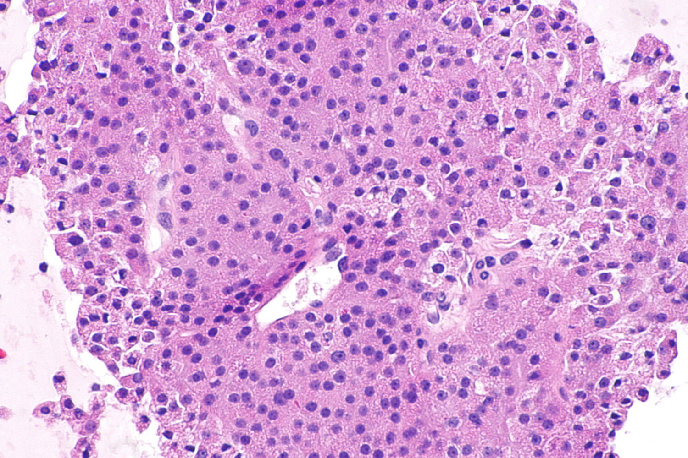

Hurthle cell carcinoma

---

## Clinical features

<u>Thyroid</u> <u>carcinoma</u> may be asymptomatic (e.g., <u>thyroid incidentaloma</u>) or manifest with any or all of the following clinical features: [[10]](https://coursology-qbank.com/amboss/article/-TXDtx)

* <u>Thyroid nodule</u> [[11]](https://coursology-qbank.com/amboss/article/70X4h9)[[12]](https://coursology-qbank.com/amboss/article/bbXHH9)

* Firm to hard consistency

* Typically painless

* See also “<u>Red flags for thyroid cancer</u>.”

* Features of local infiltration or compression

* Fixed <u>thyroid nodule</u>  [[13]](https://coursology-qbank.com/amboss/article/yhXdgB)[[14]](https://coursology-qbank.com/amboss/article/Um0bUg)

* Recent onset of any of the following: [[12]](https://coursology-qbank.com/amboss/article/bbXHH9)

* <u>Hoarseness</u> of voice (<u>vocal cord</u> <u>paresis</u>)

* <u>Dyspnea</u>

* <u>Dysphagia</u>

* <u>Horner syndrome</u> (rare)  [[15]](https://coursology-qbank.com/amboss/article/YXXn99)[[16]](https://coursology-qbank.com/amboss/article/cVXatC)

* Venous obstruction (very rare): <u>IJV thrombosis</u>, <u>SVC syndrome</u> [[17]](https://coursology-qbank.com/amboss/article/bm0HVg)[[18]](https://coursology-qbank.com/amboss/article/XXX999)

* Painless <u>cervical lymphadenopathy</u> [[14]](https://coursology-qbank.com/amboss/article/Um0bUg)

* More common in <u>papillary thyroid cancer</u> and <u>anaplastic thyroid cancer</u>

* Less common in <u>follicular thyroid cancer</u>

* Signs of distant <u>metastasis</u> [[19]](https://coursology-qbank.com/amboss/article/pfXLMx)

* More common in <u>follicular thyroid cancer</u> and <u>anaplastic thyroid cancer</u>

* Less common in <u>papillary thyroid cancer</u>

* Examples include:

* <u>Pulmonary metastases</u>: <u>coughing</u>, <u>hemoptysis</u>, <u>dyspnea</u>

* <u>Bone metastases</u>: bone <u>pain</u>, <u>pathologic fractures</u>

* <u>Brain metastases</u>: <u>focal neurologic deficit</u>, <u>seizures</u>

* <u>Paraneoplastic syndrome</u>: <u>diarrhea</u> and <u>facial flushing</u> (typically seen in advanced medullary <u>carcinoma</u>)  [[8]](https://coursology-qbank.com/amboss/article/u0Xp39)

Examination of the Thyroid - Clinical Examination

Surface anatomy of the thyroid gland

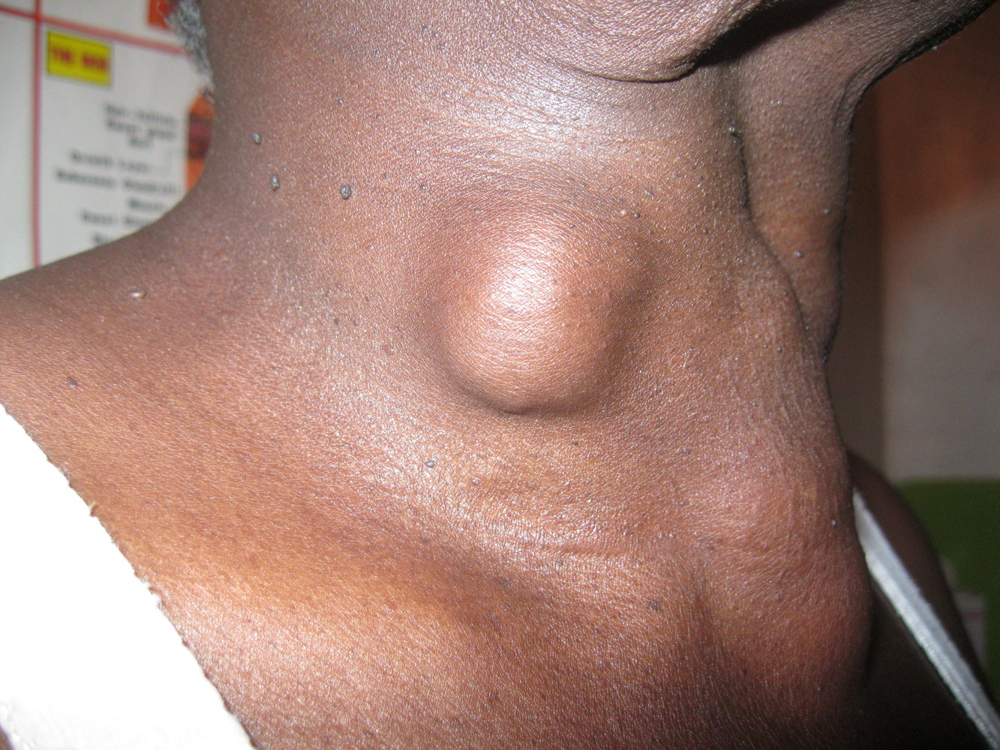

Thyroid cancer

---

## Diagnosis

### Approach [[11]](https://coursology-qbank.com/amboss/article/70X4h9)[[14]](https://coursology-qbank.com/amboss/article/Um0bUg)

* For initial evaluation, follow the <u>diagnostic approach to thyroid nodules</u>.

* <u>TSH</u>, <u>ultrasound</u>, potentially <u>scintigraphy</u>

* Confirmation: <u>fine-needle aspiration cytology</u> (<u>FNAC</u>) or intraoperative <u>frozen-section</u>

* <u>Thyroid tumor markers</u> help to estimate the prognosis and assess response to therapy.

* Differentiated <u>thyroid</u> cancer: serum <u>thyroglobulin</u> (<u>Tg</u>)

* Medullary <u>carcinoma</u>: serum <u>calcitonin</u> and <u>carcinoembryonic antigen</u> (<u>CEA</u>)

* Staging of <u>lymph node</u> and distant <u>metastases</u>

* Patients with medullary <u>carcinoma</u> require further assessment.

* <u>Genetic testing</u> for <u>RET</u> <u>germline mutations</u>  [[8]](https://coursology-qbank.com/amboss/article/u0Xp39)

* Screening of family members

* Screening for associated conditions (e.g., <u>MEN2</u>)

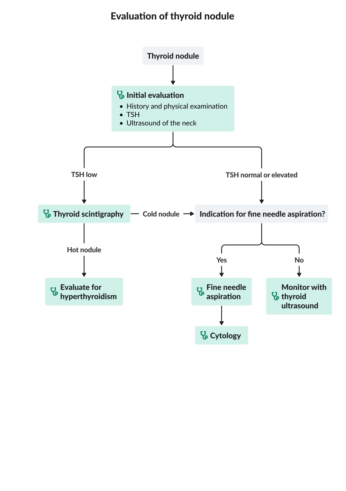

Evaluation of thyroid nodule

### Initial evaluation

#### <u>Laboratory studies</u> and <u>ultrasound</u>

Serum <u>TSH</u> and <u>ultrasound</u> should be obtained in all patients with <u>thyroid nodules</u>.

* <u>TSH</u>: typically normal or mildly elevated  [[14]](https://coursology-qbank.com/amboss/article/Um0bUg)

* <u>Thyroid ultrasound</u>: to assess for sonographic signs of thyroid malignancy ;  [[11]](https://coursology-qbank.com/amboss/article/70X4h9)[[14]](https://coursology-qbank.com/amboss/article/Um0bUg)

* Solid or mostly solid <u>hypoechoic</u> <u>nodule</u>(s)

* Irregular margins

* Microcalcifications within <u>nodules</u>

* <u>Nodules</u> that are taller than wide

* Extrathyroidal growth

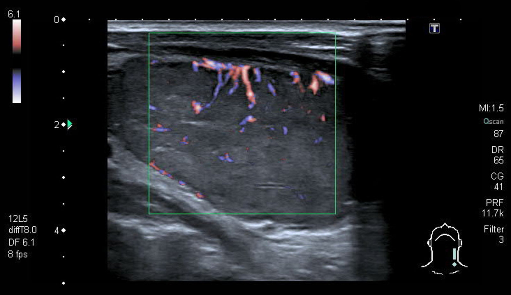

Solid thyroid nodule

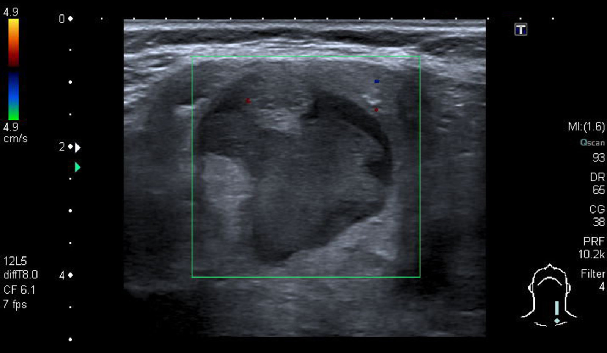

Mixed echogenicity thyroid nodule

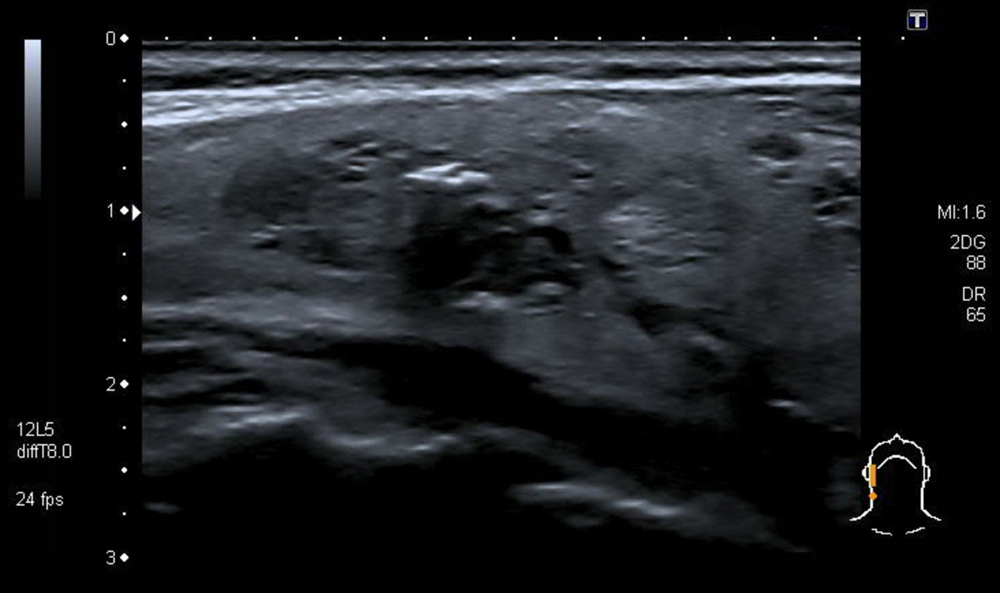

Mixed cystic and solid thyroid nodule

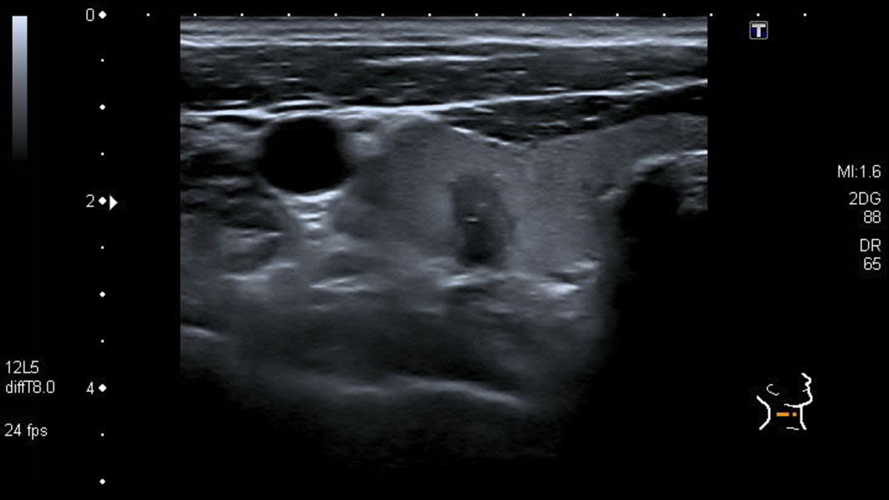

Suspicious thyroid nodule

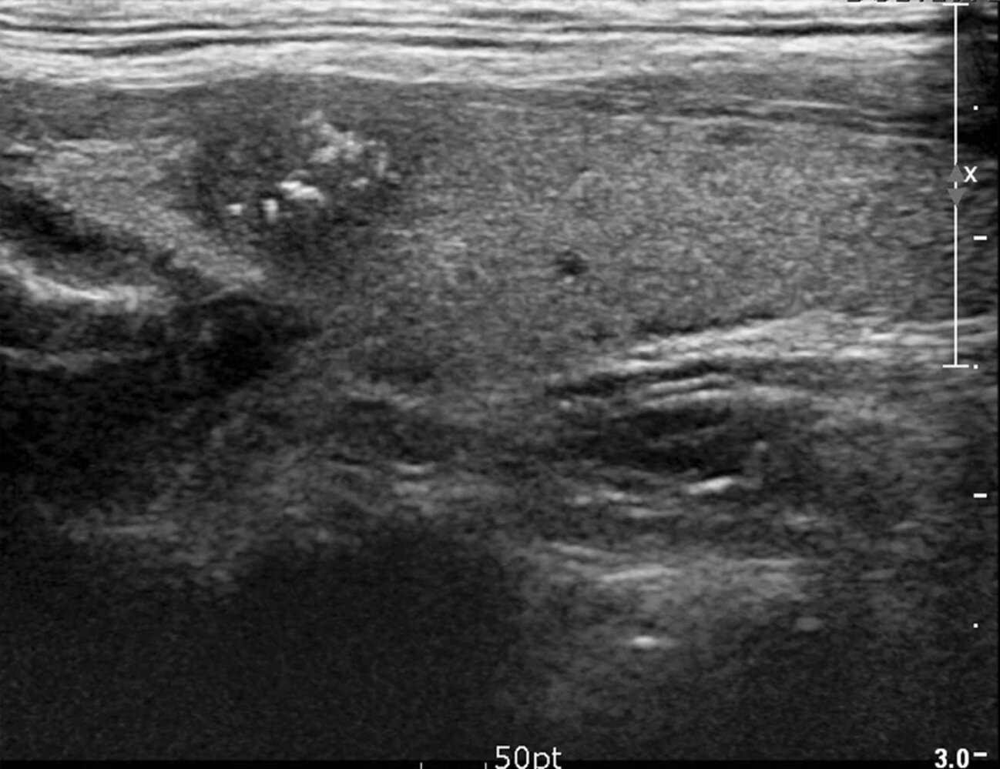

Solid thyroid nodule with microcalcifications

#### <u>Thyroid scintigraphy</u> [[11]](https://coursology-qbank.com/amboss/article/70X4h9)

* Indications

* <u>Thyroid nodule</u>(s) with ↓ <u>TSH</u> levels

* Multinodular <u>thyroids</u> (to identify <u>nodules</u> that require <u>FNAC</u>)

* Prior to <u>RAIA</u> to evaluate eligibility for <u>adjuvant treatment</u> of well-differentiated <u>thyroid</u> cancer

* Contraindications: pregnant and <u>breastfeeding</u> women

* Supportive findings: decreased or no radiotracer uptake (i.e., hypofunctioning or nonfunctioning <u>nodules</u>, referred to as <u>cold nodules</u>)   [[20]](https://coursology-qbank.com/amboss/article/5XXiA9)

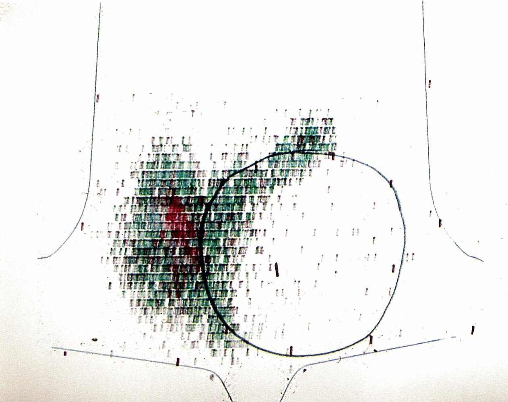

Cold nodule on thyroid scintigraphy

Thyroid scintigraphy

> [!TIP]
> <u>Nodules</u> that appear <u>hypoechoic</u> on <u>thyroid ultrasound</u> and cold on <u>thyroid scintigraphy</u> should increase suspicion for <u>malignancy</u>.

> [!TIP]
> Hyperfunctioning <u>nodules</u> (<u>hot nodules</u>) are rarely malignant and typically do not require further evaluation for <u>malignancy</u>. [[11]](https://coursology-qbank.com/amboss/article/70X4h9)[[21]](https://coursology-qbank.com/amboss/article/sfXtnx)

#### <u>Confirmatory tests</u> [[11]](https://coursology-qbank.com/amboss/article/70X4h9)[[14]](https://coursology-qbank.com/amboss/article/Um0bUg)

* <u>Fine-needle aspiration cytology</u> (<u>FNAC</u>)

* Indications: <u>sonographic signs of thyroid cancer</u> detected on <u>thyroid ultrasound</u> (see “<u>Indications for FNAC of thyroid nodules</u>”)

* Supportive findings: typically reported as “malignant” or “suspicious for <u>malignancy</u>” according to the <u>Bethesda system for thyroid cytopathology</u>

* Intraoperative <u>frozen-section</u>: Consider if <u>FNAC</u> cannot reliably rule out <u>malignancy</u> in high-risk patients.

### Additional studies after confirmed diagnosis

#### Thyroid cancer tumor markers

The specific <u>tumor markers</u> depend on the histological type of the cancer.

* Follicular or <u>papillary thyroid cancer</u>
* Thyroglobulin (<u>Tg</u>): precursor of <u>thyroid hormones</u>; produced exclusively by the <u>thyroid gland</u> [[14]](https://coursology-qbank.com/amboss/article/Um0bUg)

* Indicated after <u>total thyroidectomy</u> or <u>RAIA</u> therapy

* Baseline (pretreatment) levels are not routinely indicated.

* Medullary <u>carcinoma</u>

* <u>Calcitonin</u>: A <u>hormone</u> secreted by <u>parafollicular cells</u>, which is the tissue of origin of medullary <u>carcinoma</u>

* Indicated preoperatively if <u>FNAC</u> is suspicious for medullary <u>carcinoma</u> (supportive diagnostic marker)  [[8]](https://coursology-qbank.com/amboss/article/u0Xp39)[[11]](https://coursology-qbank.com/amboss/article/70X4h9))

* Used to monitor response to therapy

* <u>Carcinoembryonic antigen</u> (<u>CEA</u>): nonspecific marker, used in combination with <u>calcitonin</u> to monitor response to therapy  [[8]](https://coursology-qbank.com/amboss/article/u0Xp39)

> [!TIP]
> Elevation of <u>tumor markers</u> after <u>total thyroidectomy</u> or <u>RAIA</u> indicates persistent disease, recurrence, or <u>metastasis</u>.

#### Staging [[14]](https://coursology-qbank.com/amboss/article/Um0bUg)

Staging includes evaluation for cervical <u>lymph node</u> <u>metastases</u> in all patients and of distant <u>metastases</u> as needed.

* <u>Preoperative assessment</u> of cervical <u>lymph nodes</u>

* Neck <u>ultrasound</u> in all patients with confirmed diagnosis

* <u>FNAC</u> of <u>lymph nodes</u> with signs of <u>metastases</u>  [[14]](https://coursology-qbank.com/amboss/article/Um0bUg)

* Assessment of distant <u>metastases</u>: based on clinical suspicion  [[22]](https://coursology-qbank.com/amboss/article/fbXkG9)

* Chest <u>x-ray</u> or CT

* <u>Bone scintigraphy</u>

* CT or <u>MRI</u> head  [[23]](https://coursology-qbank.com/amboss/article/80XO39)

---

## Pathology

### <u>Papillary thyroid cancer</u>

#### Psammoma bodies

* Morphology: concentric lamellar calcifications

* Occurrence: seen in diseases associated with calcific degeneration

* <u>Papillary thyroid carcinomas</u> (evidence of <u>psammoma bodies</u> in <u>thyroid</u> tissue should always raise suspicion of <u>malignancy</u>)

* Serous <u>papillary</u> <u>cystadenocarcinoma</u> of <u>ovary</u> and <u>endometrium</u>

* <u>Meningiomas</u>

* Mesotheliomas

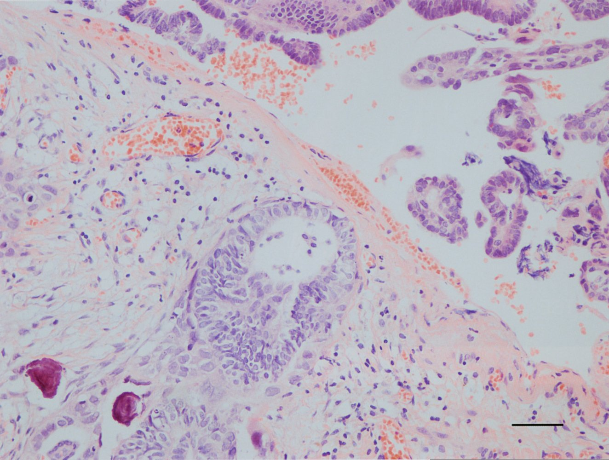

Serous papillary cystadenoma of the ovary with Psammoma bodies

Papillary thyroid carcinoma

Psammoma body

#### “Orphan Annie” eyes <u>nuclei</u>

* Morphology: empty-appearing large oval <u>nuclei</u> with central clearing

* Occurrence

* <u>Papillary thyroid carcinomas</u>

* <u>Autoimmune thyroiditis</u> (e.g., <u>Hashimoto disease</u>, <u>Grave disease</u>)

#### Nuclear grooves [[24]](https://coursology-qbank.com/amboss/article/DZY1dn)

* Morphology: longitudinal invaginations of nuclear bilayer

* Occurrence: <u>papillary thyroid carcinomas</u>

> [!NOTE]
> “Papi and Moma adopted Orphan Annie:” papillary <u>thyroid</u> cancer is histologically characterized by psammoma bodies and Orphan Annie-<u>eye</u> <u>nuclei</u>.

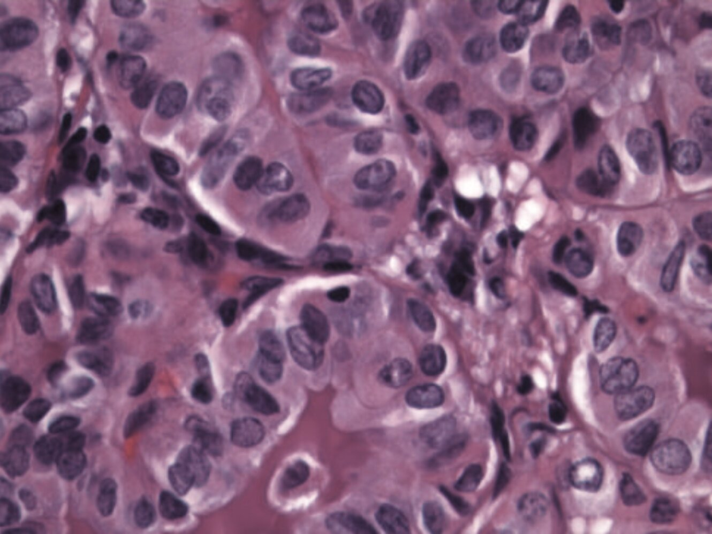

Nuclear grooves and Orphan-Annie eyes in papillary thyroid carcinoma

### <u>Follicular carcinoma</u>

* Uniform follicles

* Vascular and/or capsular invasion

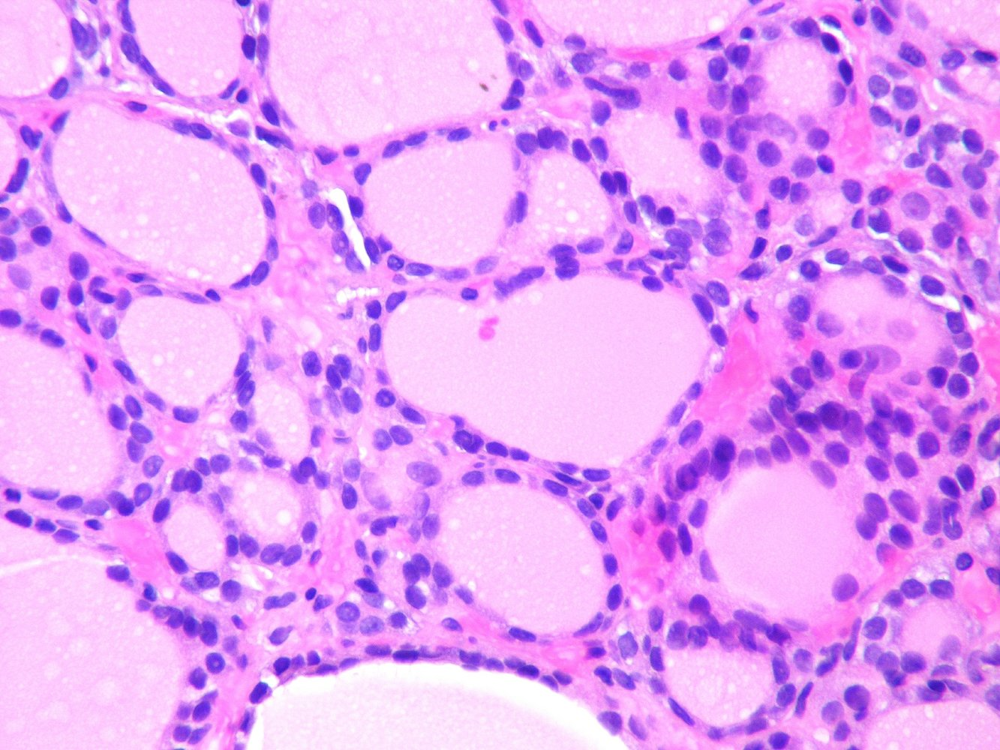

Follicular thyroid cancer

Follicular thyroid carcinoma

### Medullary <u>carcinoma</u>

* Ovoid cells of <u>C cell</u> origin and therefore without follicle development

* <u>Amyloid</u> in the stroma (stains with <u>Congo red</u>)

Medullary thyroid carcinoma

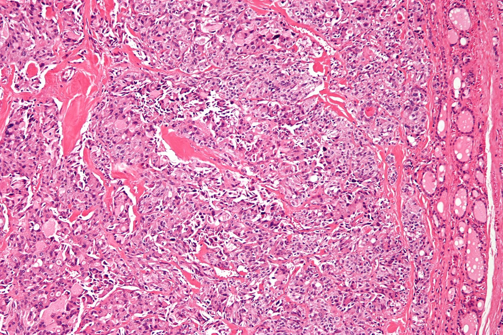

Medullary thyroid carcinoma

Amyloid deposits in medullary thyroid carcinoma

> [!NOTE]
> Medullary <u>carcinoma</u> is composed of C-cells producing Calcitonin and is characterized by <u>amyloid</u> aCCumulation staining with Congo red.

### <u>Anaplastic thyroid carcinoma</u>

* Undifferentiated <u>giant cell</u> (i.e., <u>osteoclast</u>-like cell)

* Areas of <u>necrosis</u> and hemorrhage

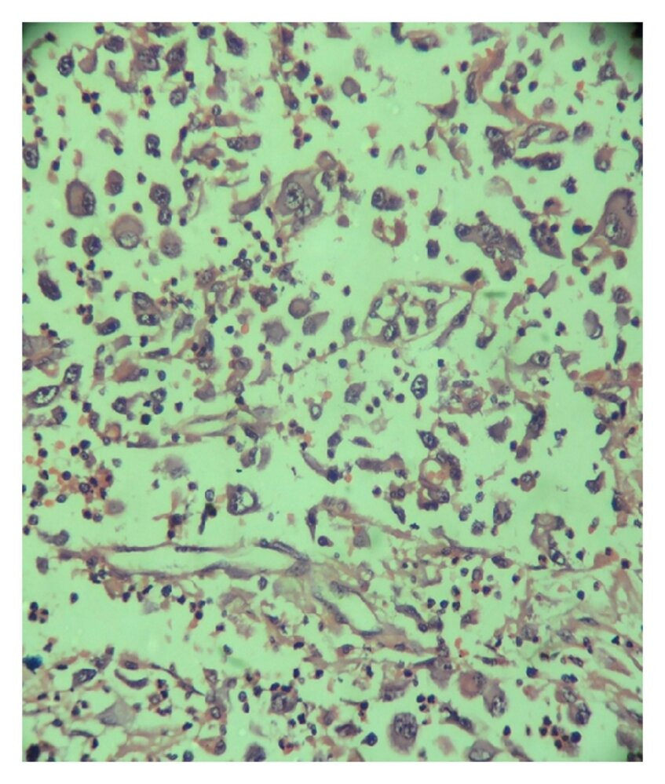

Anaplastic thyroid carcinoma

---

## Differential diagnoses

* See the article “<u>Thyroid nodules</u>.”

* <u>Thyroid cyst</u>

* <u>Ultrasound</u> findings

* <u>Anechoic</u> round mass

* In many cases, <u>dorsal</u> <u>acoustic enhancement</u>

* Relatively frequent and typically harmless

The differential diagnoses listed here are not exhaustive.

---

## Treatment

### General principles  [[8]](https://coursology-qbank.com/amboss/article/u0Xp39)[[14]](https://coursology-qbank.com/amboss/article/Um0bUg)[[23]](https://coursology-qbank.com/amboss/article/80XO39)

* Well-differentiated <u>thyroid</u> cancer [[8]](https://coursology-qbank.com/amboss/article/u0Xp39)[[14]](https://coursology-qbank.com/amboss/article/Um0bUg)

* Standard management (regardless of nodal or distant <u>metastases</u>): <u>total thyroidectomy</u> (with <u>neck dissection</u> as needed) + <u>RAIA</u> + <u>TSH suppression therapy</u>

* Small cancers without nodal or distant <u>metastases</u>: Consider <u>hemithyroidectomy</u> + <u>TSH suppression therapy</u>.

* <u>Papillary microcarcinoma</u> in low-risk patients : Consider <u>active surveillance</u>.

* Poorly-differentiated <u>thyroid</u> cancer

* Medullary <u>carcinoma</u>: <u>total thyroidectomy</u> + <u>neck dissection</u> ± radiation therapy and/or systemic <u>chemotherapy</u> as needed.  [[8]](https://coursology-qbank.com/amboss/article/u0Xp39)

* <u>Anaplastic carcinoma</u> [[23]](https://coursology-qbank.com/amboss/article/80XO39)

* Resectable cancer: <u>total thyroidectomy</u> + <u>neck dissection</u> + <u>radiochemotherapy</u>

* Unresectable or <u>metastatic</u> cancer: <u>palliative care</u>

> [!WARNING]
> <u>RAIA</u> and <u>TSH suppression therapy</u> are not useful in the management of medullary <u>carcinoma</u> or <u>anaplastic thyroid cancer</u>. [[8]](https://coursology-qbank.com/amboss/article/u0Xp39)[[23]](https://coursology-qbank.com/amboss/article/80XO39)

### <u>Surgery</u> [[14]](https://coursology-qbank.com/amboss/article/Um0bUg)

Surgical resection is the primary <u>treatment for thyroid cancer</u>. For further information on preoperative testing and complications see “<u>Thyroid surgery</u>.”

#### <u>Total thyroidectomy</u>

* Indications

* Well-differentiated <u>thyroid</u> <u>carcinoma</u>

* <u>Tumor</u> size ≥ 4 cm

* <u>Tumor</u> size 1–4 cm (individual decision)

* With/without extrathyroidal extension

* With/without nodal or distant <u>metastases</u>  [[14]](https://coursology-qbank.com/amboss/article/Um0bUg)

* Medullary <u>carcinoma</u> [[8]](https://coursology-qbank.com/amboss/article/u0Xp39)

* Resectable <u>anaplastic thyroid cancer</u>  [[23]](https://coursology-qbank.com/amboss/article/80XO39)

* Important considerations

* <u>Total thyroidectomy</u> should be combined with <u>neck dissection</u> as needed (e.g., in patients with regional <u>lymph node</u> spread).

* <u>Thyroid hormone</u> replacement is required in all patients who undergo <u>total thyroidectomy</u>.

* Maintain <u>TSH</u> within the physiological range for poorly-differentiated <u>thyroid</u> cancer. [[8]](https://coursology-qbank.com/amboss/article/u0Xp39)

* <u>TSH-suppressive therapy</u> is required for well-differentiated <u>thyroid</u> cancer. [[14]](https://coursology-qbank.com/amboss/article/Um0bUg)

#### <u>Hemithyroidectomy</u> [[14]](https://coursology-qbank.com/amboss/article/Um0bUg)

* Indications

* Small, well-differentiated <u>thyroid</u> <u>carcinoma</u> with all of the following characteristics:

* Intrathyroidal tumors (i.e., no evidence of extrathyroidal extension)

* No nodal or distant <u>metastasis</u>

* No high-risk patient factors such as age > 45 years, history of head and neck radiation, or <u>family history</u> of cancer

* Preferred option in tumors < 1 cm in size with all of the above characteristics

* An alternative to <u>total thyroidectomy</u> in tumors 1–4 cm in size with all of the above characteristics

* Contraindications 

* Intrathyroidal <u>tumor</u> ≥ 4 cm

* Extrathyroidal spread

* Distant or nodal <u>metastasis</u>

* High-risk patient factors

#### Complications [[25]](https://coursology-qbank.com/amboss/article/Dgb1xG)

* <u>Hypocalcemia</u>: as a result of accidental removal of <u>parathyroid glands</u>  [[26]](https://coursology-qbank.com/amboss/article/AcbRUs)

* <u>Dysphonia</u> (<u>hoarseness</u>) and/or <u>dysphagia</u>: as a result of transection of the superior and <u>recurrent laryngeal nerve</u>

* May occur during ligation of the superior laryngeal <u>artery</u> and <u>inferior thyroid artery</u> due to the proximity of the nerves to the <u>arteries</u>

* If only the external branch of the <u>superior laryngeal nerve</u> is damaged, complete loss of the voice is unlikely, but a loss of vocal range may occur (with potentially career-damaging consequences for, e.g., singers and actors).

* <u>Vocal cord</u> function should be assessed preoperatively with <u>laryngoscopy</u>.

### <u>Adjuvant therapy</u> [[14]](https://coursology-qbank.com/amboss/article/Um0bUg)

* Well-differentiated <u>thyroid</u> cancer

* <u>Radioactive iodine ablation</u> (<u>RAIA</u>): conducted 4– 6 weeks after <u>total thyroidectomy</u> to destroy remaining <u>thyroid</u> tissue or <u>metastases</u>  [[11]](https://coursology-qbank.com/amboss/article/70X4h9)

* TSH suppression therapy:

* Administration of <u>L-thyroxine</u> to suppress serum <u>TSH</u> to subnormal levels to minimize the risk of <u>tumor</u> recurrence

* Administered after completion of <u>RAIA</u> in patients who have undergone <u>total thyroidectomy</u>

* <u>L-thyroxine</u> also serves as <u>hormone replacement therapy</u> after <u>surgery</u> and <u>RAIA</u>.

* Poorly differentiated <u>thyroid</u> cancer: <u>adjuvant radiation therapy</u> and/or <u>chemotherapy</u> as needed [[8]](https://coursology-qbank.com/amboss/article/u0Xp39)[[23]](https://coursology-qbank.com/amboss/article/80XO39)

### Nonoperative management

* <u>Active surveillance</u> [[14]](https://coursology-qbank.com/amboss/article/Um0bUg)

* Papillary microcarcinoma (i.e., a <u>tumor</u> < 1 cm in diameter) with no nodal or distant <u>metastasis</u> in low-risk patients  [[27]](https://coursology-qbank.com/amboss/article/cgXa8x)

* Multimorbid patients with high surgical risk or short <u>life expectancy</u>

* <u>Palliative therapy</u>: Palliative <u>radiation therapy</u> and/or <u>chemotherapy</u> may be considered for advanced <u>anaplastic thyroid cancer</u>.  [[23]](https://coursology-qbank.com/amboss/article/80XO39)

---