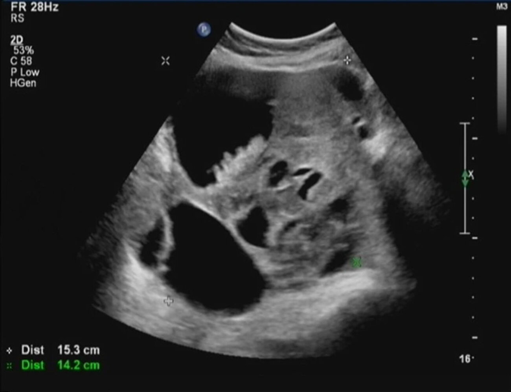

# Adnexal mass

*Categories: Clinical knowledge > Surgery > Gynecologic surgery > Adnexal mass*

[Original Article Link](https://coursology-qbank.com/amboss/article/FE0gx3)

---

## Summary

An adnexal mass is a benign or malignant mass of the <u>ovary</u>, <u>fallopian tube</u>, or surrounding tissues. Although most adnexal masses have a benign cause (e.g., <u>functional ovarian cyst</u>, <u>endometrioma</u>, benign <u>ovarian tumor</u>), <u>malignancy</u> is an important consideration. While most adnexal masses in adults are asymptomatic and incidentally detected, some patients present with <u>pelvic pain</u>, <u>vaginal bleeding</u>, or systemic symptoms. Patients with acute symptoms of potentially life-threatening diagnoses (e.g., <u>ectopic pregnancy</u>, <u>ovarian torsion</u>) should receive immediate evaluation and management. Initial diagnostics include tests to rule out <u>ectopic pregnancy</u>, if appropriate, and <u>transvaginal ultrasound</u> (<u>TVUS</u>). Depending on the suspected etiology, additional testing may include <u>diagnostics for pelvic inflammatory disease</u> (<u>PID</u>) and <u>ovarian tumor markers</u>. Management depends on the suspected underlying cause and presence of symptoms. Patients with likely benign etiologies can usually be managed expectantly if they are asymptomatic. Symptomatic patients or those with indeterminate findings or features suggestive of <u>malignancy</u> should be referred to a gynecologic oncologist for surgical evaluation.

---

## Etiology

### Benign causes [[2]](https://coursology-qbank.com/amboss/article/NJY-8J)[[3]](https://coursology-qbank.com/amboss/article/omd0gq0)

* <u>Functional ovarian cyst</u>

* <u>Endometrioma</u>

* <u>Polycystic ovary syndrome</u> (<u>PCOS</u>)

* <u>PID</u> (e.g., <u>tubo-ovarian abscess</u>)

* <u>Ovarian torsion</u>

* Benign <u>ovarian tumors</u>

* <u>Ovarian cystadenoma</u> (serous or <u>mucinous</u>)

* <u>Brenner tumor</u>

* <u>Dermoid cyst</u>

* <u>Struma ovarii</u> [[4]](https://coursology-qbank.com/amboss/article/a2dQT60)

* <u>Ovarian fibroma</u>

* <u>Theca cell tumor</u>

* <u>Sertoli-Leydig cell tumor</u>

* <u>Hydrosalpinx</u>

* <u>Uterine leiomyoma</u>

* <u>Müllerian anomalies</u>

> [!TIP]
> Most adnexal masses are benign. [[2]](https://coursology-qbank.com/amboss/article/NJY-8J)[[4]](https://coursology-qbank.com/amboss/article/a2dQT60)

### Malignant causes [[2]](https://coursology-qbank.com/amboss/article/NJY-8J)[[3]](https://coursology-qbank.com/amboss/article/omd0gq0)

* <u>Primary ovarian cancer</u>

* Ovarian <u>epithelial</u> <u>carcinoma</u>

* <u>Ovarian germ cell tumors</u>

* <u>Granulosa cell tumor</u>

* <u>Metastatic</u> cancer (<u>Krukenberg tumor</u>)

> [!TIP]
> Ovarian <u>epithelial</u> <u>carcinoma</u> most commonly occurs in <u>postmenopausal</u> individuals. [[2]](https://coursology-qbank.com/amboss/article/NJY-8J)

---

## Diagnostics

### Approach [[2]](https://coursology-qbank.com/amboss/article/NJY-8J)[[3]](https://coursology-qbank.com/amboss/article/omd0gq0)

* All individuals who can become pregnant: <u>pregnancy test</u>

* Pregnant individuals

* <u>Diagnostics for ectopic pregnancy</u>

* <u>Ectopic pregnancy</u> excluded: diagnostics as for nonpregnant individuals

* Nonpregnant individuals

* Imaging (first-line: <u>TVUS</u>)

* Consider laboratory testing based on clinical presentation, e.g.:

* Suspected infection: <u>CBC</u> and <u>diagnostics for PID</u>

* <u>Ovarian tumor markers</u> to assess risk of <u>malignancy</u>

* Refer to a specialist for <u>confirmatory tests</u> if <u>malignancy</u> is suspected.

> [!WARNING]
> Although most adnexal masses are benign, rule out <u>malignancy</u> in all patients. [[2]](https://coursology-qbank.com/amboss/article/NJY-8J)[[3]](https://coursology-qbank.com/amboss/article/omd0gq0)

> [!WARNING]
> Invasive diagnostics are not routinely required for suspected benign adnexal masses. <u>Fine-needle aspiration</u> is typically contraindicated because it can directly spread <u>tumor</u> cells to the <u>peritoneum</u>. [[2]](https://coursology-qbank.com/amboss/article/NJY-8J)

### Imaging [[2]](https://coursology-qbank.com/amboss/article/NJY-8J)[[6]](https://coursology-qbank.com/amboss/article/G7dBMr0)[[7]](https://coursology-qbank.com/amboss/article/Om1Ifh0)

#### <u>Ultrasound</u>

* Modalities

* <u>TVUS</u>

* First-line imaging modality in all patients

* <u>Doppler ultrasound</u> is typically performed at the same time.

* Transabdominal <u>ultrasound</u>

* Adjunct to <u>TVUS</u>  [[2]](https://coursology-qbank.com/amboss/article/NJY-8J)

* Alternative to <u>TVUS</u>  [[2]](https://coursology-qbank.com/amboss/article/NJY-8J)

* Findings

* Findings of the underlying cause may be present.

* Specific <u>ultrasound</u> features may suggest benign or malignant etiologies.  [[7]](https://coursology-qbank.com/amboss/article/Om1Ifh0)[[8]](https://coursology-qbank.com/amboss/article/OudIr70)

|  Ultrasound features of adnexal masses [[2]](https://coursology-qbank.com/amboss/article/NJY-8J)[[6]](https://coursology-qbank.com/amboss/article/G7dBMr0)[[7]](https://coursology-qbank.com/amboss/article/Om1Ifh0)[[8]](https://coursology-qbank.com/amboss/article/OudIr70)  |  |  |
| --- | --- | --- |
|  | Features suggestive of benign etiology | Features concerning for <u>malignancy</u> |
| Size |  * < 10 cm   |  * ≥ 10 cm   |
| Appearance |   * Thin-walled, smooth, <u>anechoic</u>, unilocular cystic lesion (e.g., <u>simple ovarian cyst</u>)  * <u>Acoustic shadowing</u>  * Typical-appearing benign cyst (e.g., hemorrhagic cyst, <u>dermoid cyst</u>, or <u>endometrioma</u>)    |   * Cystic masses with:  * Solid or <u>papillary</u> components  * Irregularly thickened septa or inner margins  * Solid masses    |
| Doppler flow |  * Absent   |  * High color flow (due to vascularization)   |
| <u>Peritoneal</u> findings |  * Unremarkable   |  * Free fluid (<u>ascites</u>) or <u>peritoneal</u> <u>nodules</u>   |

Complex ovarian mass

Ovarian follicular cyst

Endometrioma (chocolate cyst)

Ovarian Teratoma (1/2)

#### Additional imaging modalities [[2]](https://coursology-qbank.com/amboss/article/NJY-8J)[[6]](https://coursology-qbank.com/amboss/article/G7dBMr0)

* <u>MRI</u> <u>pelvis</u> without and with IV contrast: indicated when <u>ultrasound</u> is inconclusive

* CT

* CT <u>pelvis</u>: not routinely recommended to evaluate an undifferentiated adnexal mass

* CT chest, abdomen, and <u>pelvis</u>: may be used for <u>cancer staging</u> in patients with confirmed <u>pelvic</u> <u>malignancy</u>

> [!WARNING]
> Consider <u>ovarian cancer</u> in patients with extraovarian findings such as <u>retroperitoneal</u> <u>lymphadenopathy</u> and <u>omental caking</u> on <u>cross-sectional imaging</u>. [[3]](https://coursology-qbank.com/amboss/article/omd0gq0)

> [!TIP]
> <u>FDG-PET/CT</u> cannot reliably distinguish between benign and malignant adnexal lesions and is not recommended in the initial diagnostic workup for an undifferentiated adnexal mass. [[6]](https://coursology-qbank.com/amboss/article/G7dBMr0)

### Ovarian tumor markers [[2]](https://coursology-qbank.com/amboss/article/NJY-8J)[[3]](https://coursology-qbank.com/amboss/article/omd0gq0)[[4]](https://coursology-qbank.com/amboss/article/a2dQT60)

* <u>CA 125</u>: Consider obtaining in all patients, especially <u>postmenopausal</u> patients and those with <u>ultrasound features concerning for ovarian malignancy</u>.

* <u>CA 125</u> levels are elevated in ∼ 80% of malignant <u>epithelial ovarian tumors</u>; , and in other malignancies.

* <u>CA 125</u> levels may also be elevated in benign gynecologic conditions (e.g., <u>PID</u>, <u>endometriosis</u>).

* Interpretation of results

* <u>Postmenopausal</u> women: Levels > 35 U/mL should raise concern for <u>malignancy</u>. [[2]](https://coursology-qbank.com/amboss/article/NJY-8J)

* <u>Premenopausal</u> women: no established cutoff; very high levels should raise suspicion for <u>malignancy</u>.

* <u>AFP</u>, <u>β-hCG</u>, and <u>LDH</u> (<u>germ cell tumor</u> marker): Obtain if clinical or imaging findings are suggestive of <u>ovarian germ cell tumors</u>.

* <u>Inhibin</u> (<u>granulosa cell tumor</u> marker): Obtain in selected patients, e.g., those with:

* Signs of <u>hyperestrogenism</u>

* <u>Vaginal bleeding</u> and a solid <u>pelvic</u> mass

* <u>Tumor marker</u> panels: may be considered by a specialist prior to <u>surgery</u>  [[3]](https://coursology-qbank.com/amboss/article/omd0gq0)

> [!TIP]
> The <u>positive predictive value</u> and <u>specificity</u> of <u>CA 125</u> for <u>malignancy</u> are higher in <u>postmenopausal</u> patients (with or without an adnexal mass) than in other patient groups. [[2]](https://coursology-qbank.com/amboss/article/NJY-8J)

---

## Special patient groups

### Adnexal mass in children [[2]](https://coursology-qbank.com/amboss/article/NJY-8J)[[3]](https://coursology-qbank.com/amboss/article/omd0gq0)[[4]](https://coursology-qbank.com/amboss/article/a2dQT60)

* Etiology

* Etiologies are similar to those in adults.

* <u>Ovarian germ cell tumors</u> are the most common <u>ovarian cancer</u> in children and <u>adolescents</u>. [[2]](https://coursology-qbank.com/amboss/article/NJY-8J)

* Although most adnexal masses in adults and children are benign, the likelihood of <u>malignancy</u> is higher in children. [[2]](https://coursology-qbank.com/amboss/article/NJY-8J)[[4]](https://coursology-qbank.com/amboss/article/a2dQT60)

* Clinical evaluation

* Generally the same as in adults; see “<u>Clinical evaluation of adnexal mass</u>.”

* Inquire confidentially about <u>sexual activity</u>.

* Children are more likely than adults to be symptomatic (e.g., <u>pelvic pain</u>, menstrual irregularities, <u>precocious puberty</u>).  [[18]](https://coursology-qbank.com/amboss/article/lHdvqr0)

* Diagnostics: Approach is generally the same as in adults (see “<u>Diagnostics for adnexal mass</u>”), with some modifications detailed here.

* Imaging: Transabdominal <u>ultrasound</u> is recommended instead of <u>TVUS</u> for prepubertal children or those who have not had vaginal intercourse.

* <u>Tumor markers</u>

* <u>AFP</u>, <u>β-hCG</u>, and <u>LDH</u> (<u>germ cell tumor</u> marker): all patients

* <u>Inhibin</u> (<u>granulosa cell tumor</u> marker): patients with signs of <u>precocious puberty</u>

* <u>CA 125</u>: not routinely obtained

* Management

* Approach is generally the same as in adults; see “<u>Management of adnexal mass</u>.”

* <u>Fertility</u>-preserving procedures should be prioritized.

> [!TIP]
> Although most adnexal masses in children are benign, the likelihood of <u>malignancy</u> is higher in children than in adults. [[2]](https://coursology-qbank.com/amboss/article/NJY-8J)[[4]](https://coursology-qbank.com/amboss/article/a2dQT60)

### Adnexal mass in pregnancy [[2]](https://coursology-qbank.com/amboss/article/NJY-8J)[[19]](https://coursology-qbank.com/amboss/article/LHdwIr0)

* Etiology

* Adnexal mass occurs in up to 2–3% of <u>pregnancies</u>. [[2]](https://coursology-qbank.com/amboss/article/NJY-8J)[[3]](https://coursology-qbank.com/amboss/article/omd0gq0)[[19]](https://coursology-qbank.com/amboss/article/LHdwIr0)

* Most adnexal masses in <u>pregnancy</u> are benign and identified incidentally on <u>prenatal ultrasound</u>.

* In addition to general <u>causes of adnexal mass</u>, causes specific to <u>pregnancy</u> include:

* <u>Theca lutein cyst</u>

* <u>Pregnancy luteoma</u>

* <u>Ectopic pregnancy</u>

* <u>Heterotopic pregnancy</u>

* Diagnostics: Approach is generally the same as in <u>premenopausal</u> adults (see “<u>Diagnostics for adnexal mass</u>”), with some modifications detailed here.

* Imaging

* Transabdominal <u>ultrasound</u> may be useful as an adjunct to <u>TVUS</u> later in <u>pregnancy</u>.  [[2]](https://coursology-qbank.com/amboss/article/NJY-8J)

* If <u>MRI</u> is performed, <u>gadolinium</u> contrast is not recommended.

* <u>Tumor markers</u>

* Lower <u>specificity</u> for <u>malignancy</u> in <u>pregnancy</u>  [[19]](https://coursology-qbank.com/amboss/article/LHdwIr0)

* Consult specialists if <u>malignancy</u> is suspected.

* Management

* Approach is generally the same as in adults; see “<u>Management of adnexal mass</u>.”  [[19]](https://coursology-qbank.com/amboss/article/LHdwIr0)

* Timing of <u>surgery</u> if indicated: early <u>second trimester</u> [[20]](https://coursology-qbank.com/amboss/article/WwdP3H0)

> [!WARNING]
> <u>Ovarian tumor markers</u> may be abnormal in <u>pregnancy</u> for reasons other than <u>malignancy</u> (e.g., <u>CA 125</u> can be elevated in an uncomplicated first-trimester <u>pregnancy</u>). [[2]](https://coursology-qbank.com/amboss/article/NJY-8J)[[19]](https://coursology-qbank.com/amboss/article/LHdwIr0)

> [!TIP]
> Removal of an adnexal mass should ideally take place in the early <u>second trimester</u> to avoid damage to the <u>corpus luteum</u>. <u>Progesterone</u>, which is essential for maintenance of <u>pregnancy</u>, is secreted by the <u>corpus luteum</u> prior to this time, but subsequently by the <u>placenta</u>. [[20]](https://coursology-qbank.com/amboss/article/WwdP3H0)

---

## Mimics

Nongynecologic causes of <u>pelvic</u> mass include: [[2]](https://coursology-qbank.com/amboss/article/NJY-8J)

* <u>Complicated diverticulitis</u>

* <u>Periappendiceal abscess</u>

* <u>Pelvic kidney</u>

* <u>Bladder diverticulum</u>

* <u>Crohn disease</u> [[19]](https://coursology-qbank.com/amboss/article/LHdwIr0)

* <u>Retroperitoneal sarcoma</u>

* Gastrointestinal cancers

* <u>Metastatic</u> cancer (e.g., <u>breast</u>, gastric, colorectal)

---