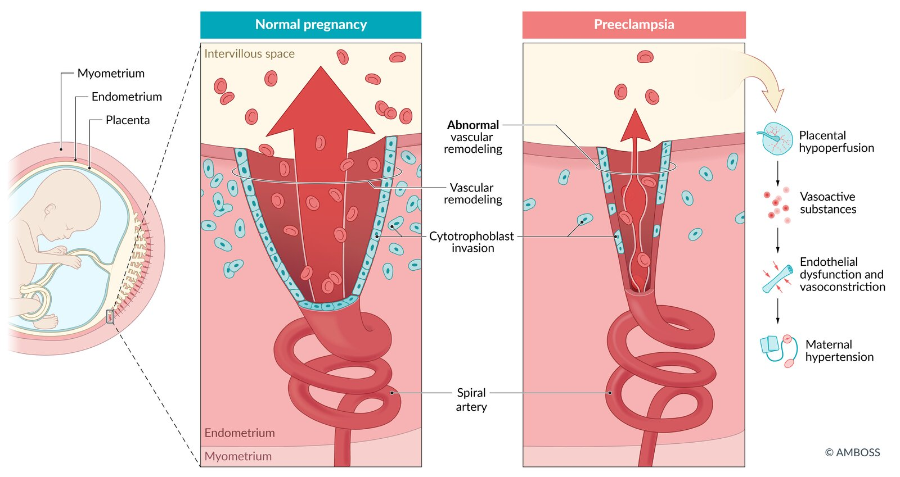

# Hypertensive pregnancy disorders

*Categories: Clinical knowledge > Surgery > Gynecologic surgery > Hypertensive pregnancy disorders*

[Original Article Link](https://coursology-qbank.com/amboss/article/VO0GrT)

---

## Summary

Hypertensive <u>pregnancy</u> disorders, also called hypertensive disorders of <u>pregnancy</u> (HDP), are among the most common complications during <u>pregnancy</u> and the early <u>postpartum period</u>. There are four major types of HDP: chronic <u>hypertension</u>, <u>gestational hypertension</u>, <u>preeclampsia</u>, and <u>eclampsia</u>. The most common type is <u>gestational hypertension</u>, also referred to as <u>pregnancy-induced hypertension</u>, which is <u>hypertension</u> that occurs after 20 weeks' <u>gestation</u>. Chronic <u>hypertension</u> describes <u>hypertension</u> that is diagnosed prior to <u>pregnancy</u> or in early <u>pregnancy</u>. <u>Preeclampsia</u> is a condition in which preexisting or new-onset <u>hypertension</u> is complicated by <u>proteinuria</u> and/or other features of <u>end-organ dysfunction</u> after 20 weeks' <u>gestation</u>. <u>Preeclampsia</u> may also progress to the life-threatening <u>HELLP syndrome</u>, which is characterized by <u>hemolysis</u>, <u>elevated liver enzymes</u>, and <u>low platelet count</u>. <u>Eclampsia</u> is a severe <u>convulsive</u> manifestation of hypertensive <u>pregnancy</u> disorders that is characterized by new-onset eclamptic <u>seizures</u> (<u>tonic-clonic</u>, focal, or multifocal).

These disorders are usually diagnosed during regular <u>prenatal care</u>, which includes routine surveillance of blood pressure, weight, and urine tests. Management depends on the severity of the condition. <u>Preeclampsia with severe features</u>, <u>eclampsia</u>, and <u>HELLP</u> are associated with increased maternal and fetal <u>morbidity</u> and mortality and thus require urgent maternal stabilization, including <u>magnesium sulfate for seizure prophylaxis</u>, and expedited delivery of the fetus. <u>Preeclampsia without severe features</u>, <u>gestational hypertension</u>, and chronic <u>hypertension</u> can usually be medically managed until 37 weeks' <u>gestation</u>, when delivery is recommended. Delivery is the only curative option for HDP.

---

## Definitions

* <u>Gestational hypertension</u> [[2]](https://coursology-qbank.com/amboss/article/Ljcwac0)

* <u>Pregnancy-induced hypertension</u> (defined as systolic blood pressure ≥ 140 mm Hg or <u>diastolic</u> blood pressure ≥ 90 mm Hg on two separate measurements at least 4 hours apart) without <u>proteinuria</u> or <u>end-organ dysfunction</u>

* Diagnosed after 20 weeks' <u>gestation</u> in patients without a prior history of <u>hypertension</u>.

* Does not persist longer than 12 weeks postpartum.

* Chronic <u>hypertension</u>: <u>hypertension</u> diagnosed before <u>pregnancy</u> or in the first 20 weeks of <u>pregnancy</u>

* Severe <u>hypertension</u> in <u>pregnancy</u>: systolic blood pressure > 160 mm Hg or <u>diastolic</u> pressure > 110 mm Hg

* Preeclampsia: new-onset <u>gestational hypertension</u> with <u>proteinuria</u> or other <u>end-organ dysfunction</u> [[3]](https://coursology-qbank.com/amboss/article/F4XgOy)

* Superimposed preeclampsia: <u>preeclampsia</u> that occurs in a patient with chronic <u>hypertension</u>

* HELLP syndrome

* A life-threatening form of <u>preeclampsia</u> characterized by Hemolysis, Elevated Liver enzymes, and Low Platelets

* May occur without <u>hypertension</u> or <u>proteinuria</u>

* Occurrence of new-onset <u>hypertension</u>, <u>proteinuria</u>, or <u>end-organ dysfunction</u> at < 20 weeks' <u>gestation</u> is suggestive of <u>gestational trophoblastic disease</u>.

* <u>Eclampsia</u>: new-onset <u>seizures</u> (<u>tonic-clonic</u>, focal, or multifocal) in the absence of other causes ; a <u>convulsive</u> manifestation of hypertensive <u>pregnancy</u> disorders [[2]](https://coursology-qbank.com/amboss/article/Ljcwac0)

* Postpartum hypertension [[4]](https://coursology-qbank.com/amboss/article/s4Xtky)[[5]](https://coursology-qbank.com/amboss/article/G4XBky)

* <u>Hypertension</u> that persists after delivery

* Generally resolves within 12 weeks.

* If <u>hypertension</u> lasts > 12 weeks postpartum, a secondary cause should be considered.

> [!TIP]
> <u>Gestational hypertension</u> can only be diagnosed if the patient was <u>normotensive</u> prior to 20 weeks' <u>gestation</u>. Otherwise, <u>high blood pressure</u> during <u>pregnancy</u> is classified as chronic <u>hypertension</u>.

> [!NOTE]
> The three primary features of PRE<u>eclampsia</u> are Proteinuria, Rising blood pressure (<u>hypertension</u>), and End-organ dysfunction.

---

## Etiology

* Etiology: not fully understood

* <u>Risk factors</u>  [[1]](https://coursology-qbank.com/amboss/article/NJW-8m0)[[10]](https://coursology-qbank.com/amboss/article/a6aQjl)

* General <u>risk factors</u>

* <u>Thrombophilia</u> (e.g., <u>antiphospholipid syndrome</u>)

* < 20 or > 35 years of age

* Non-Hispanic Black descent  [[1]](https://coursology-qbank.com/amboss/article/NJW-8m0)[[11]](https://coursology-qbank.com/amboss/article/iLcJx10)

* <u>Diabetes mellitus</u> or <u>gestational diabetes</u>

* Chronic <u>hypertension</u>

* <u>Chronic renal disease</u> (e.g., <u>SLE</u>)

* <u>Obesity</u> (<u>BMI</u> ≥ 30)

* <u>Pregnancy</u>-related <u>risk factors</u>

* <u>Nulliparity</u>

* <u>Multiple gestation</u> (e.g., twins)

* <u>Hydatidiform mole</u>

* Previous <u>preeclampsia</u>

* <u>Chromosomal anomalies</u> or congenital structural anomalies

* <u>Family history</u>

---

## Pathophysiology

* Overview: Multiple maternal, fetal, and <u>placental</u> factors are involved in <u>placental</u> <u>hypoperfusion</u>, which leads to maternal <u>hypertension</u> and other consequences.

* Uterine <u>spiral arteries</u> normally develop into high-capacity <u>blood vessels</u>. This process is defective in patients with <u>preeclampsia</u>, which leads to acute atherosis of the decidual vessels (presence of arterial wall <u>fibrinoid necrosis</u> and <u>lymphocytic</u> infiltration) and abnormal blood flow (high pressure, pulsatile flow) of the <u>placenta</u> and fetus (see “<u>Placenta</u>” for more information on normal <u>placenta</u> formation). [[12]](https://coursology-qbank.com/amboss/article/ne17zf0)

* <u>Arterial hypertension</u> with systemic <u>vasoconstriction</u> causes <u>placental</u> <u>hypoperfusion</u> → release of vasoactive substances → ↑ maternal blood pressure to ensure sufficient blood supply of the fetus

* Systemic <u>endothelial</u> dysfunction causes <u>placental</u> <u>hypoperfusion</u> → ↑ <u>placental</u> release of factors;   → <u>endothelial</u> lesions that lead to microthrombosis

* Abnormal <u>placental</u> (or <u>trophoblast</u>) implantation or development in the <u>uterus</u>

* Consequences of <u>vasoconstriction</u> and microthrombosis

* Organ <u>ischemia</u> and damage

* <u>Preeclampsia</u>: multiorgan involvement (primarily renal)

* <u>Eclampsia</u>: predominantly cerebral involvement

* <u>HELLP syndrome</u>; : severe systemic inflammation with multiorgan hemorrhage and <u>necrosis</u> (<u>thrombotic microangiopathy</u> of the <u>liver</u>)

* Chronic <u>hypoperfusion</u> of the <u>placenta</u> → insufficiency of the uteroplacental unit and <u>fetal growth restriction</u>

| Systemic effects of hypertensive <u>pregnancy</u> disorders |  |  |  |
| --- | --- | --- | --- |
| Organ | Pathomechanism | Disorder |  Occurrence [[13]](https://coursology-qbank.com/amboss/article/b6aHjl) |
| <u>Kidney</u> |  * <u>Glomerular</u> <u>endothelial</u> dysfunction and <u>hypertension</u>-induced <u>vasoconstriction</u>   |   * <u>Proteinuria</u> [[14]](https://coursology-qbank.com/amboss/article/Y6anjl)  * Impaired renal function  * <u>Edema</u>    |   * <u>Preeclampsia</u>  * <u>Eclampsia</u>  * <u>HELLP syndrome</u>    |
| <u>Lung</u> |  * Increased <u>systemic vascular resistance</u> and <u>volume overload</u>  → <u>left ventricular dysfunction</u> → ↑ pulmonary <u>capillary</u> <u>hydrostatic pressure</u>, ↑ <u>capillary</u> permeability , and ↓ <u>albumin</u>   |   * <u>Pulmonary edema</u>  * <u>Respiratory distress</u>    |   * <u>Severe preeclampsia</u>  * <u>HELLP syndrome</u>    |
| <u>Liver</u> |  * <u>Vasoconstriction</u> and microthrombotic obstruction of <u>liver sinusoids</u> → <u>liver</u> cell damage   |  * <u>Liver</u> impairment and <u>liver</u> swelling   |   * <u>HELLP syndrome</u>  * <u>Severe preeclampsia</u>  * <u>Eclampsia</u>    |
| <u>CNS</u> |  * <u>Hypertension</u>-induced <u>vasoconstriction</u> and <u>endothelial</u> damage → disruption of cerebral <u>microcirculation</u> with microthrombi → vasospasms in the <u>CNS</u>   |  * <u>Seizures</u>   |  * <u>Eclampsia</u>   |
| Blood |   * Systemic microthrombi and <u>vasoconstriction</u> → overactivation of the coagulation system and <u>platelet</u> consumption  * <u>Microangiopathic hemolysis</u>    |   * Disseminated <u>intravascular</u> <u>coagulopathy</u>  * <u>Thrombocytopenia</u>  * <u>Anemia</u>    |   * <u>HELLP syndrome</u>  * <u>Severe preeclampsia</u>    |

Pathophysiology of preeclampsia

---

## Clinical features

### <u>Gestational hypertension</u>

* Asymptomatic <u>hypertension</u>

* Nonspecific symptoms (e.g., morning <u>headaches</u>, fatigue, <u>dizziness</u>) can occur.

### <u>Preeclampsia</u> [[8]](https://coursology-qbank.com/amboss/article/D4X1ly)

* Onset

* ∼ 90% occur after 34 weeks' of <u>gestation</u>.

* In approx. 5% of individuals with <u>preeclampsia</u>, the condition is not diagnosed during <u>pregnancy</u> and symptoms only develop postpartum (postpartum <u>preeclampsia</u>). [[15]](https://coursology-qbank.com/amboss/article/uL1pzh0)

#### <u>Preeclampsia without severe features</u>

* Usually asymptomatic

* Nonspecific symptoms may include:

* <u>Headaches</u>

* Visual disturbances

* <u>RUQ</u> or epigastric <u>pain</u>

* Rapid development of <u>edema</u>

* <u>Hypertension</u>

* <u>Proteinuria</u>

#### <u>Preeclampsia with severe features</u> [[16]](https://coursology-qbank.com/amboss/article/okX0Ky)

* Severe <u>hypertension</u> (systolic BP ≥ 160 mm Hg or <u>diastolic</u> BP ≥ 110 mm Hg)

* <u>Proteinuria</u>, <u>oliguria</u>

* <u>Headache</u>

* Visual disturbances (e.g., blurred <u>vision</u>, <u>scotoma</u>)

* <u>RUQ</u> or epigastric <u>pain</u>

* <u>Pulmonary edema</u>

* Cerebral symptoms (e.g., <u>altered mental status</u>, <u>nausea</u>, <u>vomiting</u>, <u>hyperreflexia</u>, <u>clonus</u>)

#### <u>HELLP syndrome</u> [[17]](https://coursology-qbank.com/amboss/article/w4Xhly)

* Onset: most commonly > 27 weeks' <u>gestation</u> (∼ 30% occur postpartum)

* <u>Preeclampsia</u> usually present (∼ 85%)

* Nonspecific symptoms: <u>nausea</u>, <u>vomiting</u>, <u>diarrhea</u>

* <u>RUQ</u> <u>pain</u> (<u>liver capsule</u> <u>pain</u>; <u>liver hematoma</u>)

* Rapid clinical deterioration (<u>DIC</u>, <u>pulmonary edema</u>, <u>acute renal failure</u>, <u>stroke</u>, <u>abruptio placentae</u>)

> [!WARNING]
> <u>Hypertension</u> and <u>proteinuria</u> may be mild or even absent in patients with <u>HELLP syndrome</u>. Patients may present primarily with nonspecific symptoms. [[18]](https://coursology-qbank.com/amboss/article/Fkcgpc0)

### <u>Eclampsia</u>

* Onset: The majority of cases occur <u>intrapartum</u> and postpartum.

* Most often associated with <u>severe preeclampsia</u>

* Eclamptic <u>seizures</u>: generalized <u>tonic-clonic</u> <u>seizures</u>  (usually <u>self-limited</u>) [[7]](https://coursology-qbank.com/amboss/article/-KaDQl)

> [!WARNING]
> Deterioration with <u>headaches</u>, <u>RUQ</u> <u>pain</u>, <u>hyperreflexia</u>, and visual changes are warning signs of a potential eclamptic <u>seizure</u>.

---

## Diagnosis

### Approach [[1]](https://coursology-qbank.com/amboss/article/NJW-8m0)[[2]](https://coursology-qbank.com/amboss/article/Ljcwac0)[[19]](https://coursology-qbank.com/amboss/article/Nkc-Lc0)[[20]](https://coursology-qbank.com/amboss/article/_l15zS0)

* At each <u>prenatal care</u> appointment, screen all patients for <u>features of HDP</u>, e.g.:

* Blood pressure ≥ 140/90 mm Hg

* Rapid weight gain and/or new severe <u>edema</u>

* <u>Urine dipstick</u>: > 2+ protein

* <u>Symptoms of preeclampsia</u>

* If any <u>features of HDP</u> are present:

* Repeat <u>blood pressure measurement</u>.

* Assess for <u>proteinuria</u>.

* Assess for <u>end-organ damage</u> (e.g., <u>CBC</u>, <u>BMP</u>, <u>liver chemistries</u>).

* Confirm diagnosis based on <u>diagnostic criteria for hypertensive pregnancy disorders</u>.

* Assess fetal health via <u>antepartum fetal surveillance</u>.

> [!TIP]
> In patients with chronic <u>hypertension</u>, conduct baseline 24-hour urine protein, serum <u>liver</u>, and <u>renal function tests</u> at the initial <u>prenatal care</u> visit; an upward trend may indicate <u>superimposed preeclampsia</u>. [[2]](https://coursology-qbank.com/amboss/article/Ljcwac0)

> [!WARNING]
> Hispanic, Black, Native American, and Alaska Native patients have a higher risk of <u>preeclampsia</u> complications, including <u>stroke</u>, and may benefit from additional screening and monitoring. [[1]](https://coursology-qbank.com/amboss/article/NJW-8m0)

### Diagnostic workup [[1]](https://coursology-qbank.com/amboss/article/NJW-8m0)[[2]](https://coursology-qbank.com/amboss/article/Ljcwac0)[[21]](https://coursology-qbank.com/amboss/article/C4Xqly)

The initial workup for all suspected HDP is the same.

#### Serial <u>blood pressure measurement</u> [[2]](https://coursology-qbank.com/amboss/article/Ljcwac0)

* <u>Hypertension</u>: systolic blood pressure ≥ 140 mm Hg or <u>diastolic</u> blood pressure ≥ 90 mm Hg (on 2 separate measurements at least 4 hours apart)  [[1]](https://coursology-qbank.com/amboss/article/NJW-8m0)[[2]](https://coursology-qbank.com/amboss/article/Ljcwac0)[[19]](https://coursology-qbank.com/amboss/article/Nkc-Lc0)[[22]](https://coursology-qbank.com/amboss/article/94cNlc0)

* Severe <u>hypertension</u>: systolic blood pressure ≥ 160 mm Hg or <u>diastolic</u> blood pressure ≥ 110 mm Hg [[2]](https://coursology-qbank.com/amboss/article/Ljcwac0)

* Suspected <u>white coat hypertension</u> [[19]](https://coursology-qbank.com/amboss/article/Nkc-Lc0)

* Consider <u>ambulatory blood pressure monitoring</u> to rule out chronic <u>hypertension</u>.

* Confirmed <u>white coat hypertension</u>: Monitor blood pressure regularly.

> [!TIP]
> Ensure that an appropriately sized blood pressure cuff is used and that the patient has not used tobacco or <u>caffeine</u> within 30 minutes of the readings, as these may lead to inaccurate values. [[23]](https://coursology-qbank.com/amboss/article/-4cDNc0)

> [!WARNING]
> <u>Hypertension</u> should not be diagnosed on the basis of a single abnormal value; repeat blood pressure readings at least once, 4 hours apart (may be reduced to 15 minutes in severe <u>hypertension</u> requiring urgent treatment). [[2]](https://coursology-qbank.com/amboss/article/Ljcwac0)

#### Urine studies [[2]](https://coursology-qbank.com/amboss/article/Ljcwac0)[[20]](https://coursology-qbank.com/amboss/article/_l15zS0)

Any of the following may be used to assess for <u>proteinuria</u>.

* <u>24-hour urine collection</u> (<u>gold standard</u>): <u>proteinuria</u> (urinary protein excretion ≥ 300 mg/24 h)

* <u>Urine protein:creatinine ratio</u>: ≥ 0.3

* <u>Urine dipstick</u>: > 2+ protein (low <u>accuracy</u>; consider only if other tests are not feasible) [[1]](https://coursology-qbank.com/amboss/article/NJW-8m0)

> [!TIP]
> Once a diagnosis of <u>preeclampsia</u> has been established, additional tests for <u>proteinuria</u> are unnecessary as the degree of <u>proteinuria</u> does not correlate with maternal or fetal outcome or affect management. [[2]](https://coursology-qbank.com/amboss/article/Ljcwac0)

#### Blood tests [[2]](https://coursology-qbank.com/amboss/article/Ljcwac0)[[19]](https://coursology-qbank.com/amboss/article/Nkc-Lc0)

##### Routine studies

Perform the following in all patients to assess for <u>end-organ dysfunction</u>.

* <u>CBC</u>: ↓ <u>Hb</u>; ↓ <u>platelets</u> may be seen in <u>severe preeclampsia</u> or <u>HELLP</u>

* <u>Liver chemistries</u>: ↑ <u>Transaminases</u> are suggestive of <u>severe preeclampsia</u> or <u>HELLP</u>.

* <u>Renal function tests</u>: Declining <u>eGFR</u> is indicative of <u>severe preeclampsia</u>.

* <u>Lactate dehydrogenase</u>: Levels may be elevated in <u>HELLP</u>.

##### Additional studies (selected patients)

* Chronic <u>hypertension</u> [[19]](https://coursology-qbank.com/amboss/article/Nkc-Lc0)

* Serum <u>electrolytes</u>

* <u>ECG</u> in patients with long-standing <u>hypertension</u>

* Consider serum <u>uric acid</u> levels: Abnormal elevation suggests <u>preeclampsia</u>.  [[2]](https://coursology-qbank.com/amboss/article/Ljcwac0)

* Suspected <u>HELLP</u> (<u>thrombocytopenia</u> and/or <u>liver function</u> impairment)

* <u>Peripheral smear</u>: <u>Schistocytes</u> indicate <u>hemolysis</u>.

* <u>Coagulation studies</u>: ↑ <u>D-dimer</u>, ↑ <u>PT</u>/<u>aPTT</u>, ↓ <u>fibrinogen</u>, and ↓ <u>antithrombin III</u> suggest <u>DIC</u>

* Intractable <u>headache</u> or neurological symptoms: CT head to rule out <u>intracranial hemorrhage</u> or alternative pathology

### Diagnostic criteria [[1]](https://coursology-qbank.com/amboss/article/NJW-8m0)[[2]](https://coursology-qbank.com/amboss/article/Ljcwac0)[[19]](https://coursology-qbank.com/amboss/article/Nkc-Lc0)

| Diagnostic criteria for hypertensive pregnancy disorders |  |  |
| --- | --- | --- |
| Disorder |  | Diagnostic criteria |
|  Chronic <u>hypertension</u> [[19]](https://coursology-qbank.com/amboss/article/Nkc-Lc0)  |  |   * <u>Hypertension</u> diagnosed before <u>pregnancy</u> or in the first 20 weeks of <u>pregnancy</u>  * With or without <u>end-organ dysfunction</u>    |
|  Gestational hypertension [[2]](https://coursology-qbank.com/amboss/article/Ljcwac0)  |  |   * <u>Hypertension</u> (≥ 140/90 mm Hg) diagnosed at ≥ 20 weeks' <u>gestation</u>  * Prior to 20 weeks' <u>gestation</u>, patients were <u>normotensive</u> at all previous <u>prenatal care</u> visits  * No history of preexisting <u>hypertension</u>  * Patients are otherwise asymptomatic with normal <u>laboratory studies</u> (i.e., no <u>proteinuria</u>, no <u>end-organ dysfunction</u>).    |
|  <u>Preeclampsia</u>  |  Preeclampsia without severe features [[2]](https://coursology-qbank.com/amboss/article/Ljcwac0)  |   * <u>Hypertension</u> (≥ 140/90 mm Hg)  * And <u>proteinuria</u>, as evidenced by any of the following:  * <u>24-hour urine collection</u>: ≥ 300 mg/24 h  * <u>Urine protein:creatinine ratio</u>: ≥ 0.3  * <u>Urine dipstick</u>: > 2+ protein    |
|  Preeclampsia with severe features [[2]](https://coursology-qbank.com/amboss/article/Ljcwac0)  |  * <u>Gestational hypertension</u>, plus ≥ 1 of the following:  * Severe <u>hypertension</u> (≥ 160 mm Hg systolic or ≥ 110 mm Hg <u>diastolic</u>)  * <u>Thrombocytopenia</u> (e.g., <u>platelets</u> < 100,000/mm³)  * Impaired renal function   * Serum <u>creatinine</u> > 1.1 mg/dL  * Or doubling of serum <u>creatinine</u>  * Impaired <u>liver function</u> not explained by alternative diagnoses  * ≥ 2 times the <u>ULN</u> of <u>transaminases</u>  * Severe, refractory <u>RUQ</u> or epigastric <u>pain</u>  * <u>Pulmonary edema</u>  * New onset of either:  * <u>Headache</u> that is unresponsive to medication  * Visual disturbances (e.g., blurred <u>vision</u>, <u>scotoma</u>)   |  |
|  <u>HELLP syndrome</u> [[2]](https://coursology-qbank.com/amboss/article/Ljcwac0)[[18]](https://coursology-qbank.com/amboss/article/Fkcgpc0)  |   * H = Hemolysis (e.g., ↓ <u>hemoglobin</u>, ↓ <u>haptoglobin</u>, ↑ <u>LDH</u>, and ↑ <u>indirect bilirubin</u>)  * EL = Elevated Liver enzymes (↑ <u>AST</u>, ↑ <u>ALT</u>)  * LP = Low Platelets (< 100,000/mm³)  * Usually accompanied by features of <u>preeclampsia</u>    |  |
|  Chronic <u>hypertension</u> with <u>superimposed preeclampsia</u>  [[19]](https://coursology-qbank.com/amboss/article/Nkc-Lc0)[[24]](https://coursology-qbank.com/amboss/article/pjcLYc0)  |  * History of chronic <u>hypertension</u> with either:  * New onset of ≥ 1 of the following:  * <u>Proteinuria</u>  * <u>Thrombocytopenia</u>  * Impaired renal or <u>liver function</u>  * <u>Symptoms of preeclampsia</u>  * Or sudden worsening of existing <u>proteinuria</u> or <u>hypertension</u>   |  |
|  Eclampsia [[19]](https://coursology-qbank.com/amboss/article/Nkc-Lc0)  |  |  * New-onset <u>seizures</u> (<u>generalized tonic-clonic</u>, focal, or multifocal) in a patient with <u>preeclampsia</u> (may be the presenting symptom in some cases)   |

> [!TIP]
> <u>RUQ</u> <u>pain</u> is the most common symptom in <u>HELLP</u>. In 15% of cases, <u>hypertension</u> and <u>proteinuria</u> are not present. [[2]](https://coursology-qbank.com/amboss/article/Ljcwac0)

> [!WARNING]
> <u>Proteinuria</u> is not required to diagnose <u>severe preeclampsia</u>! [[2]](https://coursology-qbank.com/amboss/article/Ljcwac0)[[20]](https://coursology-qbank.com/amboss/article/_l15zS0)

### Fetal assessment [[2]](https://coursology-qbank.com/amboss/article/Ljcwac0)[[25]](https://coursology-qbank.com/amboss/article/Jncs810)

Fetal evaluation should be conducted in parallel with maternal workup. See “<u>Antepartum fetal surveillance</u>” and “<u>Overview of maternal and fetal vessel doppler ultrasound</u>.”

* <u>Cardiotocography</u>: to monitor <u>fetal heart rate</u> and uterine contractions

* <u>Ultrasound</u> including:

* Assessment of blood flow to the <u>placenta</u> and fetus; findings on <u>Doppler ultrasound</u> include:

* Increased resistance and abnormal flow pattern in atypical uterine <u>arteries</u>  [[26]](https://coursology-qbank.com/amboss/article/IncYu10)

* Bilateral notches (i.e., early <u>diastolic</u> indentation) in the <u>uterine artery</u> flow profile  [[27]](https://coursology-qbank.com/amboss/article/qncC810)

* <u>Biophysical profile</u> to assess for signs of <u>fetal distress</u> (e.g., <u>oligohydramnios</u>) [[28]](https://coursology-qbank.com/amboss/article/8ncOE10)

* <u>Fetal biometric parameters</u> to assess for <u>fetal growth restriction</u> [[20]](https://coursology-qbank.com/amboss/article/_l15zS0)

* Assessment of <u>placenta</u> for signs of <u>placental abruption</u>

> [!TIP]
> <u>Ultrasound</u> and <u>CTG</u> parameters may be used to help guide decisions regarding <u>preterm delivery</u>. [[28]](https://coursology-qbank.com/amboss/article/8ncOE10)

---

## Differential diagnoses

### Differential diagnoses of <u>preeclampsia</u>/<u>HELLP</u> [[29]](https://coursology-qbank.com/amboss/article/051eih0)[[30]](https://coursology-qbank.com/amboss/article/a51Qih0)

* Other causes of abnormal <u>liver chemistries</u> in <u>pregnancy</u>, e.g.:

* <u>Hyperemesis gravidarum</u>  [[31]](https://coursology-qbank.com/amboss/article/c51aQh0)

* <u>Intrahepatic cholestasis of pregnancy</u>

* <u>Acute fatty liver of pregnancy</u>

* <u>Causes of acute liver failure</u> not specific to <u>pregnancy</u> (e.g., fulminant viral <u>hepatitis</u>)

* Other <u>causes of thrombocytopenia</u>, e.g., <u>thrombotic microangiopathy</u> (<u>TTP</u>, <u>HUS</u>)

### Differential diagnoses of <u>eclampsia</u>

<u>Seizure disorders during pregnancy</u> can be caused by any of the following:

* <u>Epilepsy</u>

* <u>Encephalitis</u>

* Metabolic disorders (e.g., <u>hypoglycemia</u>, <u>hyponatremia</u>)

* <u>Hemorrhagic stroke</u>

* <u>Ischemic stroke</u>

* Withdrawal syndromes

The differential diagnoses listed here are not exhaustive.

---

## Management

### Approach

* Start immediate stabilization measures for patients with <u>eclampsia</u>, <u>HELLP</u>, or <u>preeclampsia with severe features</u>. [[2]](https://coursology-qbank.com/amboss/article/Ljcwac0)

* <u>Assess gestational age</u>. [[2]](https://coursology-qbank.com/amboss/article/Ljcwac0)

* ≥ 37 weeks' <u>gestation</u>: Plan for delivery in all cases.

* < 37 weeks' <u>gestation</u>

* Assess for <u>indications for expedited delivery in HDP</u>.

* Consider <u>corticosteroids for fetal lung maturity</u> and <u>fetal neuroprotection</u>.

* For stable patients, the recommended <u>gestational age</u> for delivery depends on the HDP subtype.

* Consult other specialists early.

* All patients: obstetrics and <u>maternal-fetal medicine</u> specialists

* Depending on symptoms: critical care, <u>hematology</u>, <u>neurology</u>

* Consider referral to a higher <u>level of care</u>.

* Further management depends on the specific subtype.

### Immediate stabilization [[2]](https://coursology-qbank.com/amboss/article/Ljcwac0)[[18]](https://coursology-qbank.com/amboss/article/Fkcgpc0)

* Perform an <u>ABCDE assessment</u> and treat time-critical complications (e.g., <u>seizure</u>, hemorrhage).

* Initiate continuous maternal and fetal monitoring.

* Obtain urgent <u>maternal-fetal medicine</u>, obstetric, and critical care consults.

* Admit or transfer the patient to a tertiary care center depending on available local resources.

* Admit to <u>ICU</u> if there is evidence of dysfunction in ≥ 2 organ systems or need for ventilatory support. [[18]](https://coursology-qbank.com/amboss/article/Fkcgpc0)

* Initiate <u>antihypertensives for urgent blood pressure control in pregnancy</u>.

* Administer <u>magnesium sulfate for seizure prophylaxis</u>.

* Assess for <u>indications for immediate delivery regardless of gestational age</u>.

* If present: urgent delivery after maternal hemodynamic stabilization

* If absent, management depends on disease severity and <u>gestational age</u>; in general:

* ≥ 34 weeks' <u>gestation</u>: Deliver.

* 24–34 weeks' <u>gestation</u>: Administer <u>corticosteroids for fetal lung maturity</u> followed by expedited delivery.

* Before fetal viability: Continuation of <u>pregnancy</u> is not recommended because of the significant risk of maternal life-threatening complications. [[18]](https://coursology-qbank.com/amboss/article/Fkcgpc0)

> [!WARNING]
> Administer <u>antihypertensives</u> within 30–60 minutes of diagnosis, if feasible. [[2]](https://coursology-qbank.com/amboss/article/Ljcwac0)

> [!WARNING]
> Aggressive <u>fluid therapy</u> can precipitate <u>pulmonary edema</u> in patients with <u>preeclampsia</u>; use fluid judiciously and monitor urine output!

> [!TIP]
> Delivery is the only cure for <u>preeclampsia</u>, <u>eclampsia</u>, and <u>HELLP syndrome</u>. [[18]](https://coursology-qbank.com/amboss/article/Fkcgpc0)

### Indications for expedited delivery in hypertensive pregnancy disorders

#### Immediate delivery [[2]](https://coursology-qbank.com/amboss/article/Ljcwac0)[[18]](https://coursology-qbank.com/amboss/article/Fkcgpc0)[[32]](https://coursology-qbank.com/amboss/article/dm1oeh0)

Assess frequently for indications for immediate delivery regardless of gestational age. The presence of any of the following is an indication for immediate delivery after maternal stabilization:

* <u>Eclampsia</u> (cerebral symptoms)

* <u>Pulmonary edema</u>

* <u>Disseminated intravascular coagulation</u>

* <u>Placental abruption</u>

* Severe <u>hypertension</u> refractory to <u>antihypertensives</u>

* Signs of <u>fetal distress</u>

* <u>Fetal demise</u> or fetus unlikely to survive

> [!WARNING]
> Do not delay delivery to administer <u>corticosteroids</u> if immediate delivery is indicated. [[2]](https://coursology-qbank.com/amboss/article/Ljcwac0)[[18]](https://coursology-qbank.com/amboss/article/Fkcgpc0)

#### Urgent delivery [[2]](https://coursology-qbank.com/amboss/article/Ljcwac0)[[18]](https://coursology-qbank.com/amboss/article/Fkcgpc0)

Delivery should be expedited after administration of <u>corticosteroids for fetal lung maturity</u> if any of the following are present:

* <u>Labor</u> or <u>premature rupture of membranes</u>

* Severe <u>oligohydramnios</u>

* Reversed end-<u>diastolic</u> flow on <u>umbilical artery</u> Doppler

* New-onset or worsening renal impairment

* Moderate or severe <u>thrombocytopenia</u>

* Abnormal <u>liver chemistries</u>

> [!TIP]
> Previously, <u>fetal growth restriction</u> was considered an indication for expedited delivery. However, according to the 2020 <u>ACOG</u> guidelines, <u>expectant management</u> may be continued in the absence of other abnormalities (e.g., Doppler findings, <u>amniotic fluid volume</u>). [[2]](https://coursology-qbank.com/amboss/article/Ljcwac0)

> [!WARNING]
> Continuously monitor maternal and fetal status. If there is any sign of deterioration, immediately expedite delivery without completing the <u>corticosteroid</u> course. [[2]](https://coursology-qbank.com/amboss/article/Ljcwac0)[[18]](https://coursology-qbank.com/amboss/article/Fkcgpc0)

### Overview of pharmacologic therapy

#### Antihypertensives in pregnancy

Specific indications for these agents are detailed in the relevant sections below. Generally, parenteral <u>antihypertensives</u> are used in acute-onset severe <u>hypertension</u> and severe hypertensive <u>pregnancy</u> disorders , and oral <u>antihypertensives</u> are used, as clinically indicated, during <u>expectant management</u>. [[2]](https://coursology-qbank.com/amboss/article/Ljcwac0)

##### Antihypertensives for urgent blood pressure control in pregnancy [[2]](https://coursology-qbank.com/amboss/article/Ljcwac0)

* Parenteral <u>labetalol</u> DOSAGE (avoid in patients with <u>contraindications to β-blockers</u>) [[19]](https://coursology-qbank.com/amboss/article/Nkc-Lc0)

* <u>Nifedipine</u> (immediate release) DOSAGE [[19]](https://coursology-qbank.com/amboss/article/Nkc-Lc0)

* Parenteral <u>hydralazine</u> DOSAGE  [[19]](https://coursology-qbank.com/amboss/article/Nkc-Lc0)

##### Common oral antihypertensives in pregnancy [[19]](https://coursology-qbank.com/amboss/article/Nkc-Lc0) [[2]](https://coursology-qbank.com/amboss/article/Ljcwac0)[[33]](https://coursology-qbank.com/amboss/article/pecL-Y0)

The following can be used alone or in combination.

* <u>Labetalol</u> DOSAGE [[19]](https://coursology-qbank.com/amboss/article/Nkc-Lc0)

* <u>Nifedipine</u> (extended release) DOSAGE [[19]](https://coursology-qbank.com/amboss/article/Nkc-Lc0)

* <u>Methyldopa</u> DOSAGE [[19]](https://coursology-qbank.com/amboss/article/Nkc-Lc0)

> [!WARNING]
> Avoid <u>ACE inhibitors</u> and <u>angiotensin receptor blockers</u> during <u>pregnancy</u> (especially during the <u>1st trimester</u>) because of their <u>teratogenic</u> effect. [[19]](https://coursology-qbank.com/amboss/article/Nkc-Lc0)

> [!NOTE]
> <u>Antihypertensives</u> used in <u>pregnancy</u> can be remembered with the mnemonic “Hypertensive Moms Need Love”: Hydralazine, Methyldopa, Nifedipine, or Labetalol

#### Magnesium sulfate for seizure prophylaxis [[2]](https://coursology-qbank.com/amboss/article/Ljcwac0)[[32]](https://coursology-qbank.com/amboss/article/dm1oeh0)[[33]](https://coursology-qbank.com/amboss/article/pecL-Y0)

* Indications

* <u>Eclampsia</u>

* <u>HELLP syndrome</u>

* <u>Preeclampsia with severe features</u>

* Administration: <u>magnesium sulfate</u> (IV DOSAGE or IM DOSAGE  ; )[[2]](https://coursology-qbank.com/amboss/article/Ljcwac0)[[32]](https://coursology-qbank.com/amboss/article/dm1oeh0)

* Contraindicated in patients with <u>myasthenia gravis</u>

* Should be administered with care in patients with <u>renal insufficiency</u>

* Monitoring

* Monitor all patients for <u>signs of hypermagnesemia</u> (e.g., decreased <u>deep tendon reflexes</u>, respiratory <u>depression</u>).

* <u>Signs of hypermagnesemia</u>: Administer <u>calcium gluconate</u>  DOSAGE (see “<u>Hypermagnesemia</u>” for clinical features and more information on management of <u>hypermagnesemia</u>).[[2]](https://coursology-qbank.com/amboss/article/Ljcwac0)

> [!TIP]
> Continue <u>magnesium sulfate</u> infusion for 24 hours after delivery or last <u>seizure</u>. [[2]](https://coursology-qbank.com/amboss/article/Ljcwac0)

> [!TIP]
> All patients receiving <u>magnesium</u> need close monitoring (including continuous <u>telemetry</u>) for <u>signs of hypermagnesemia</u>.

---

## Eclampsia

### Medical management [[2]](https://coursology-qbank.com/amboss/article/Ljcwac0)[[18]](https://coursology-qbank.com/amboss/article/Fkcgpc0)

* Treat eclamptic <u>seizures</u>.

* Initiate <u>airway management</u>.

* Administer <u>supplemental oxygen</u>.

* Place patient in the left <u>lateral decubitus position</u> to:

* Prevent <u>placental</u> <u>hypoperfusion</u> due to <u>IVC</u> compression

* Reduce the risk of <u>aspiration</u>

* Start anticonvulsive therapy; first line is <u>magnesium sulfate</u> (see “<u>Magnesium for eclampsia</u>” for dosage and monitoring) [[2]](https://coursology-qbank.com/amboss/article/Ljcwac0)

* For <u>seizures</u> unresponsive to <u>magnesium sulfate</u> 

* <u>Amobarbital</u> DOSAGE or <u>phenytoin</u> DOSAGE [[2]](https://coursology-qbank.com/amboss/article/Ljcwac0)

* Consider <u>intubation</u> and <u>assisted ventilation</u>.

* Persistent <u>postictal</u> low <u>GCS</u> scores or <u>focal neurological signs</u>: Consult <u>neurology</u>.

* Start <u>antihypertensives for urgent blood pressure control in pregnancy</u>.

> [!WARNING]
> Managing the <u>airway</u> in <u>pregnancy</u> can be challenging; consult anesthesia early.

### Obstetric management [[2]](https://coursology-qbank.com/amboss/article/Ljcwac0)[[18]](https://coursology-qbank.com/amboss/article/Fkcgpc0)

* Start continuous fetal monitoring.

* <u>Eclampsia</u> is an indication for immediate delivery regardless of <u>gestational age</u>.  [[2]](https://coursology-qbank.com/amboss/article/Ljcwac0)[[18]](https://coursology-qbank.com/amboss/article/Fkcgpc0)[[32]](https://coursology-qbank.com/amboss/article/dm1oeh0)

* Delivery should occur only after the mother is stable and <u>seizures</u> have stopped. [[2]](https://coursology-qbank.com/amboss/article/Ljcwac0)

* <u>Eclampsia</u> is not an indication for <u>cesarean delivery</u>.  [[2]](https://coursology-qbank.com/amboss/article/Ljcwac0)[[32]](https://coursology-qbank.com/amboss/article/dm1oeh0)

> [!TIP]
> <u>Fetal distress</u> often occurs during eclamptic <u>seizures</u>. However, delivery should occur only after maternal stabilization, as fetal status typically returns to normal once <u>seizures</u> have been controlled. [[2]](https://coursology-qbank.com/amboss/article/Ljcwac0)[[18]](https://coursology-qbank.com/amboss/article/Fkcgpc0)

---

## HELLP syndrome

### Medical management [[2]](https://coursology-qbank.com/amboss/article/Ljcwac0)[[18]](https://coursology-qbank.com/amboss/article/Fkcgpc0)

* Consult <u>hematology</u>, hepatology, and critical care (depending on symptoms and severity).

* Administer <u>blood products</u> (e.g., <u>platelets</u>, <u>PRBCs</u>, <u>FFP</u>) as needed to manage hemorrhage and <u>coagulopathy</u>; additionally transfuse <u>platelets</u>: [[18]](https://coursology-qbank.com/amboss/article/Fkcgpc0)

* Prior to <u>cesarean delivery</u> if <u>platelet count</u> is < 50,000/mm³

* Prior to vaginal delivery if <u>platelet count</u> is 20,000–25,000 /mm³

* Initiate <u>antihypertensives for urgent blood pressure control in pregnancy</u>.

* Administer <u>magnesium sulfate for seizure prophylaxis</u>.

* Administer <u>IV fluid therapy</u> and <u>electrolyte repletion</u> as needed.

* Manage complications: See “<u>Management of DIC</u>”, “<u>Management of AKI</u>”, and “<u>Management of acute liver failure</u>” as needed.

* Provide <u>supplemental oxygen</u> or <u>mechanical ventilation</u> as appropriate.

* Monitor <u>vitals</u> closely.

* Repeat <u>laboratory studies</u> every 12 hours during delivery and <u>postpartum period</u> (see “Blood tests” under “Diagnostics”).  [[2]](https://coursology-qbank.com/amboss/article/Ljcwac0)

> [!WARNING]
> Patients with <u>HELLP syndrome</u> are at increased risk of <u>DIC</u>, <u>pulmonary edema</u>, <u>ARDS</u>, and <u>acute renal failure</u> and therefore close monitoring is essential. [[2]](https://coursology-qbank.com/amboss/article/Ljcwac0)

### Obstetric management [[2]](https://coursology-qbank.com/amboss/article/Ljcwac0)[[18]](https://coursology-qbank.com/amboss/article/Fkcgpc0)

* Start continuous fetal monitoring.

* Expedited delivery is indicated for all patients regardless of <u>gestational age</u>.

* ≥ 34 weeks' <u>gestation</u>: Deliver immediately.

* 24–34 weeks' <u>gestation</u>: Administer <u>corticosteroids for fetal lung maturity</u>, if feasible. [[2]](https://coursology-qbank.com/amboss/article/Ljcwac0)[[34]](https://coursology-qbank.com/amboss/article/-N1Ddh0)

* Delivery may be delayed until 24–48 hours after <u>corticosteroid</u> administration if maternal and fetal status remains stable.

* Do not delay delivery for <u>corticosteroid</u> administration if complications arise.

* Before fetal viability: Consider <u>termination of pregnancy</u>.

> [!WARNING]
> Urgent <u>cesarean delivery</u> is recommended for patients who develop <u>DIC</u> to prevent disease progression. [[18]](https://coursology-qbank.com/amboss/article/Fkcgpc0)

---

## Preeclampsia with severe features

### Medical management [[2]](https://coursology-qbank.com/amboss/article/Ljcwac0)[[18]](https://coursology-qbank.com/amboss/article/Fkcgpc0)

* Start <u>antihypertensives for urgent blood pressure control in pregnancy</u>.

* Administer <u>magnesium sulfate for seizure prophylaxis</u>.

* Monitor blood pressure, <u>oxygen saturation</u>, and urine output.

* Manage complications (e.g., <u>pulmonary edema</u>, <u>headache</u>, <u>renal insufficiency</u>).

### Obstetric management [[2]](https://coursology-qbank.com/amboss/article/Ljcwac0)[[18]](https://coursology-qbank.com/amboss/article/Fkcgpc0)

* Start continuous fetal monitoring.

* <u>Indications for immediate delivery regardless of gestational age</u> present: Deliver.

* Indications for immediate delivery absent: Determine <u>gestational age</u> and manage accordingly.

#### Management by <u>gestational age</u>

* Prior to fetal viability: Stabilize the mother and terminate the <u>pregnancy</u>.  [[18]](https://coursology-qbank.com/amboss/article/Fkcgpc0)

* ≥ 34 weeks' <u>gestation</u>: Deliver.

* Between fetal viability and 34 weeks' <u>gestation</u>: Assess maternal and fetal status.

* Unstable: Stabilize the mother and proceed to delivery.

* Stable: Administer <u>corticosteroids for fetal lung maturity</u> and consider a trial of <u>expectant management</u> (via shared-decision making).  ; [[2]](https://coursology-qbank.com/amboss/article/Ljcwac0)[[34]](https://coursology-qbank.com/amboss/article/-N1Ddh0)

* Any decline in maternal or fetal stability: Deliver immediately.

* Serially monitor <u>laboratory studies</u> (e.g., <u>CBC</u>, <u>liver chemistries</u>, serum <u>creatinine</u>).

* Strictly monitor maternal and fetal status.

* Admit or transfer to a hospital with maternal and <u>neonatal ICU</u> availability.

> [!TIP]
> Vaginal delivery is preferred, but often <u>cesarean delivery</u> is needed in the case of younger <u>gestational age</u>, immature <u>cervix</u>, or poor maternal or fetal condition.

---

## Gestational hypertension and preeclampsia without severe features

### Approach [[2]](https://coursology-qbank.com/amboss/article/Ljcwac0)

* ≥ 37 0/7 weeks' <u>gestation</u>: Hospitalize and deliver.

* ≤ 36 6/7 weeks' <u>gestation</u>

* Perform a full <u>obstetric ultrasound</u> (estimating fetal weight and <u>amniotic fluid volume</u>).

* Screen for <u>indications for expedited delivery in hypertensive pregnancy disorders</u>.

* If present: Deliver; administer <u>corticosteroids for fetal lung maturity</u> if indicated and feasible.

* If absent: Manage expectantly; deliver at 37 0/7 weeks.

> [!WARNING]
> Patients with systolic BP ≥ 160 mm Hg and/or <u>diastolic</u> BP ≥ 110 mm Hg) should be diagnosed with <u>preeclampsia with severe features</u> and managed accordingly. [[2]](https://coursology-qbank.com/amboss/article/Ljcwac0)

### Hospitalization and delivery [[2]](https://coursology-qbank.com/amboss/article/Ljcwac0)[[32]](https://coursology-qbank.com/amboss/article/dm1oeh0)

* Delivery is recommended at ≥ 37 0/7 weeks' <u>gestation</u>.

* Expedited delivery is recommended, regardless of <u>gestational age</u>, if there is evidence of maternal or fetal deterioration (see “<u>Indications for expedited delivery in hypertensive pregnancy disorders</u>”).

> [!TIP]
> If feasible, administer <u>corticosteroids for fetal lung maturation</u> if delivery of a viable fetus between 24 and 34 weeks' <u>gestation</u> is indicated. [[2]](https://coursology-qbank.com/amboss/article/Ljcwac0)

### Outpatient management [[2]](https://coursology-qbank.com/amboss/article/Ljcwac0)[[35]](https://coursology-qbank.com/amboss/article/YLcnw10)

Patients at ≤ 36 6/7 weeks' <u>gestation</u> with <u>gestational hypertension</u> or <u>preeclampsia without severe features</u> can be managed in an ambulatory setting.

#### Maternal and fetal monitoring [[2]](https://coursology-qbank.com/amboss/article/Ljcwac0)

Weekly in-clinic or hospital visits are recommended for maternal and fetal evaluation and should include the following:

* Serial blood pressure monitoring

* Assessment for the development or worsening of <u>preeclampsia</u> (e.g., development of severe features).

* Serial <u>laboratory studies</u>

* Weekly assessment of <u>platelet count</u>, serum <u>creatinine</u>, and <u>liver chemistries</u>

* In addition, weekly assessment for <u>proteinuria</u> is recommended for patients with <u>gestational hypertension</u>.  [[2]](https://coursology-qbank.com/amboss/article/Ljcwac0)

* Consider more frequent testing if there is concern for disease progression.

* See “Blood tests” under “Diagnostics” for details.

* Fetal monitoring

* Weekly assessment of <u>amniotic fluid index</u>

* <u>Fetal nonstress test</u> once or twice weekly; if nonreactive, perform a <u>biophysical profile</u>

* <u>Ultrasound</u> assessment of fetal growth every 3–4 weeks

* Educate patients to recognize features of <u>severe preeclampsia</u> ;   or signs of <u>fetal distress</u> ;   and to seek prompt medical attention if they develop.

> [!TIP]
> Follow proper techniques for <u>blood pressure measurement</u> (e.g., use of appropriate cuff sizes, resting for 10 minutes before measurement, and avoiding <u>caffeine</u> and tobacco use 30 minutes before measurement) to ensure accurate results. [[2]](https://coursology-qbank.com/amboss/article/Ljcwac0)

> [!WARNING]
> <u>Preeclampsia without severe features</u> can progress to <u>preeclampsia with severe features</u> within days and, therefore, should be closely monitored. [[2]](https://coursology-qbank.com/amboss/article/Ljcwac0)

#### <u>Antihypertensives</u> [[2]](https://coursology-qbank.com/amboss/article/Ljcwac0)[[33]](https://coursology-qbank.com/amboss/article/pecL-Y0)

* <u>Antihypertensives</u> are not routinely recommended in patients with blood pressure < 160/110 mm Hg and no evidence of <u>end-organ damage</u>.   [[2]](https://coursology-qbank.com/amboss/article/Ljcwac0)[[33]](https://coursology-qbank.com/amboss/article/pecL-Y0)[[36]](https://coursology-qbank.com/amboss/article/RN1lah0)

* Severe <u>hypertension</u> (≥ 160/110 mm Hg): Recategorize as <u>preeclampsia with severe features</u> and manage accordingly. [[2]](https://coursology-qbank.com/amboss/article/Ljcwac0)

* Nonsevere <u>hypertension</u> ≥ 140/90 mm Hg but < 160/110 mm Hg with evidence of <u>end-organ damage</u>: Start <u>antihypertensives</u>; see “<u>Oral antihypertensives in pregnancy</u>.”  [[2]](https://coursology-qbank.com/amboss/article/Ljcwac0)[[33]](https://coursology-qbank.com/amboss/article/pecL-Y0)

#### <u>Preeclampsia prophylaxis</u> [[2]](https://coursology-qbank.com/amboss/article/Ljcwac0)

* Assess patients with <u>gestational hypertension</u> for <u>risk factors for preeclampsia</u>.

* Initiate <u>aspirin for preeclampsia prophylaxis</u> if indicated.

#### Obstetric management [[2]](https://coursology-qbank.com/amboss/article/Ljcwac0)[[35]](https://coursology-qbank.com/amboss/article/YLcnw10)

* Deliver at 37 weeks 0/7 days (unless clinically indicated earlier).

* Vaginal delivery is preferred, if feasible.

* Closely monitor for progression to <u>preeclampsia with severe features</u> during the <u>intrapartum</u> and <u>postpartum period</u>.

* Consider <u>magnesium sulfate for seizure prophylaxis</u> if severe features develop.

> [!TIP]
> In patients who develop <u>gestational hypertension</u> or <u>preeclampsia without severe features</u> at term, delivery within 24 hours of diagnosis is recommended. [[32]](https://coursology-qbank.com/amboss/article/dm1oeh0)

---

## Chronic hypertension in pregnancy

### <u>Management of hypertension</u> [[19]](https://coursology-qbank.com/amboss/article/Nkc-Lc0)

* Initiate <u>antihypertensives</u> (in treatment-naive patients) if blood pressure ≥ 140/90 mm Hg (see “<u>Oral antihypertensives in pregnancy</u>”).  [[37]](https://coursology-qbank.com/amboss/article/ZN1Z-S0)[[38]](https://coursology-qbank.com/amboss/article/0N1e-S0)

* Titrate <u>antihypertensives</u> to maintain blood pressure between 120/80 and 140/90 mm Hg.  [[19]](https://coursology-qbank.com/amboss/article/Nkc-Lc0)[[37]](https://coursology-qbank.com/amboss/article/ZN1Z-S0)[[38]](https://coursology-qbank.com/amboss/article/0N1e-S0)

* Lower blood pressure targets may be appropriate in patients with comorbidities (e.g., <u>diabetes mellitus</u>, renal dysfunction); consult specialists for optimal management. [[19]](https://coursology-qbank.com/amboss/article/Nkc-Lc0)

* For patients with suspected <u>secondary hypertension</u>, refer for specialist management. [[19]](https://coursology-qbank.com/amboss/article/Nkc-Lc0)

|  <u>Management of chronic hypertension in pregnancy</u> [[19]](https://coursology-qbank.com/amboss/article/Nkc-Lc0)  |  |
| --- | --- |
| Blood pressure | Management |
|  ≥ 140/90 mm Hg (mild <u>hypertension</u>) [[37]](https://coursology-qbank.com/amboss/article/ZN1Z-S0)[[38]](https://coursology-qbank.com/amboss/article/0N1e-S0)  |   * Treatment-naive patients  * Start <u>antihypertensives</u>.  * See “<u>Oral antihypertensives in pregnancy</u>” for preferred agents and dosages.  * Patients already on <u>antihypertensives</u>  * Continue treatment (shared-decision making).  * Review safety profiles of <u>antihypertensives</u> for use in <u>pregnancy</u>.    |
|  Systolic pressure ≥ 160 mm Hg  And/or <u>diastolic</u> pressure ≥ 110 mm Hg lasting ≥ 15 minutes (severe <u>hypertension</u>) [[19]](https://coursology-qbank.com/amboss/article/Nkc-Lc0)  |   * Administer <u>antihypertensive therapy</u> as soon as possible (ideally within 60 minutes). [[19]](https://coursology-qbank.com/amboss/article/Nkc-Lc0)  * See “<u>Antihypertensives for urgent blood pressure control in pregnancy</u>” for preferred agents and dosages.    |

### Prophylaxis against <u>superimposed preeclampsia</u> [[11]](https://coursology-qbank.com/amboss/article/iLcJx10)[[19]](https://coursology-qbank.com/amboss/article/Nkc-Lc0)

Patients with chronic <u>hypertension</u> are at high risk of developing <u>preeclampsia</u>.  [[24]](https://coursology-qbank.com/amboss/article/pjcLYc0)

* Educate patients on the <u>symptoms of preeclampsia</u>.

* Start <u>aspirin prophylaxis against preeclampsia</u>.

> [!TIP]
> If <u>superimposed preeclampsia</u> develops, it should be managed based on severity. See “<u>Preeclampsia without severe features</u>” or “<u>Preeclampsia with severe features</u>” as needed.

### Obstetric management [[19]](https://coursology-qbank.com/amboss/article/Nkc-Lc0)

#### <u>Prenatal care</u>

* Assess patients for <u>preeclampsia</u> at every visit (see “Diagnostics”).

* Perform an <u>ultrasound</u> assessment of fetal growth in the <u>third trimester</u>.

#### Timing of delivery

* Chronic <u>hypertension</u> without <u>superimposed preeclampsia</u>: Deliver between 37 and 39 weeks' <u>gestation</u>.  [[19]](https://coursology-qbank.com/amboss/article/Nkc-Lc0)

* Superimposed <u>preeclampsia without severe features</u>: Consider <u>expectant management</u> till 37 weeks' <u>gestation</u> with close maternal and fetal surveillance. [[19]](https://coursology-qbank.com/amboss/article/Nkc-Lc0)

* Severe <u>hypertension</u> refractory to therapy or superimposed <u>preeclampsia with severe features</u>: Deliver immediately; see “<u>Management of preeclampsia with severe features</u>.”

#### <u>Intrapartum</u> management

* Continue <u>antihypertensives</u>.

* Monitor blood pressure.

* Interdisciplinary care is recommended for patients with severe <u>hypertension</u> and/or <u>end-organ dysfunction</u>.

---

## Complications

* Maternal complications

* <u>Placental abruption</u>

* <u>DIC</u>

* Injury to <u>placenta</u> → <u>tissue factor</u> release → unregulated activation of the <u>coagulation cascade</u>

* ∼ 20% of patients with <u>HELLP syndrome</u> develop <u>DIC</u>.

* Cerebral hemorrhage, <u>ischemic stroke</u>

* <u>Acute respiratory distress syndrome</u> (<u>ARDS</u>)

* <u>Acute renal failure</u>

* Hepatic subcapsular <u>hematoma</u>

* Complication of <u>severe preeclampsia</u> and <u>HELLP syndrome</u>

* Severe <u>hypotension</u> may occur due to rupture of <u>hematoma</u>.

* <u>Aspiration pneumonia</u>

* <u>Retinal detachment</u>

* Long-term: increased risk for cardiovascular disease, <u>diabetes mellitus</u>, and <u>chronic kidney disease</u> [[44]](https://coursology-qbank.com/amboss/article/PuaWrm)

* Maternal <u>death</u> [[45]](https://coursology-qbank.com/amboss/article/VEaGum)

* Fetal complications: occur due to insufficient <u>placental</u> <u>perfusion</u>

* <u>Fetal growth restriction</u>

* <u>Preterm birth</u>

* <u>Seizure</u>-induced fetal <u>hypoxia</u>

* Fetal <u>death</u>

> [!TIP]
> <u>Ischemic stroke</u>, cerebral hemorrhage, and <u>ARDS</u> are the most common <u>causes of death</u> in patients with <u>preeclampsia</u>.

References:[[46]](https://coursology-qbank.com/amboss/article/KkXUKy)

We list the most important complications. The selection is not exhaustive.

---

## Prognosis

The prognosis of hypertensive <u>pregnancy</u> disorders depends on the severity of the condition and the complications that occur. In the majority of cases, the conditions resolve within hours or days after delivery.

* Recurrence rate in following <u>pregnancies</u>

* <u>Preeclampsia</u>: 10–20% [[47]](https://coursology-qbank.com/amboss/article/6kXjKy)

* <u>Eclampsia</u>: 1–2% [[48]](https://coursology-qbank.com/amboss/article/pkXLKy)

* <u>HELLP syndrome</u>: 3–5% [[49]](https://coursology-qbank.com/amboss/article/JkXsKy)

* <u>Maternal mortality</u>

* <u>Eclampsia</u>: 5–10%

* <u>HELLP syndrome</u>: 1–3.5% [[50]](https://coursology-qbank.com/amboss/article/qkXCKy)

* Fetal mortality

* <u>Eclampsia</u>: 5–11% [[51]](https://coursology-qbank.com/amboss/article/IkXY6y)

* <u>HELLP syndrome</u>: up to 24%

---

## Prevention

### Approach

* As part of <u>preconception care</u>, address modifiable <u>risk factors for HDP</u>.

* After <u>conception</u>, provide <u>prenatal patient education</u> on healthy diet, exercise, and <u>smoking cessation</u>.

* Screen patients for: [[2]](https://coursology-qbank.com/amboss/article/Ljcwac0)[[11]](https://coursology-qbank.com/amboss/article/iLcJx10)[[19]](https://coursology-qbank.com/amboss/article/Nkc-Lc0)

* <u>Risk factors for preeclampsia</u>; offer <u>aspirin for preeclampsia prophylaxis</u> if necessary.

* <u>Features of HDP</u> at every visit (see “<u>Screening for HDP</u>”)

* Educate on <u>preeclampsia</u> symptoms and the need for urgent evaluation if they occur.

> [!TIP]
> Consider starting <u>preeclampsia prophylaxis</u> with <u>low-dose aspirin</u> for all Black individuals who are pregnant. [[1]](https://coursology-qbank.com/amboss/article/NJW-8m0)

### Aspirin for preeclampsia prophylaxis [[1]](https://coursology-qbank.com/amboss/article/NJW-8m0)[[2]](https://coursology-qbank.com/amboss/article/Ljcwac0)[[19]](https://coursology-qbank.com/amboss/article/Nkc-Lc0)

* Indications [[11]](https://coursology-qbank.com/amboss/article/iLcJx10)

* Recommended in individuals with ≥ 1 high-risk feature or ≥ 2 moderate-<u>risk factors for preeclampsia</u>.

* Consider in individuals with 1 moderate-<u>risk factor</u> for <u>preeclampsia</u>.

* Regimen

* Initiate <u>low-dose aspirin</u>;  DOSAGE between 12–20 weeks' <u>gestation</u> (optimally before 16 weeks)  [[2]](https://coursology-qbank.com/amboss/article/Ljcwac0)[[11]](https://coursology-qbank.com/amboss/article/iLcJx10)[[19]](https://coursology-qbank.com/amboss/article/Nkc-Lc0)

* Continue prophylaxis until delivery.

|  |  Risk factors for preeclampsia [[2]](https://coursology-qbank.com/amboss/article/Ljcwac0)[[11]](https://coursology-qbank.com/amboss/article/iLcJx10)[[19]](https://coursology-qbank.com/amboss/article/Nkc-Lc0)  |
| --- | --- |
|  | Maternal factors |
| High-<u>risk factors</u> |   * Previous <u>eclampsia</u> or <u>preeclampsia</u>  * Chronic <u>hypertension</u>  * Type 1 or 2 <u>diabetes mellitus</u>  * Autoimmune disease (e.g., <u>antiphospholipid syndrome</u>, <u>systemic lupus erythematosus</u>)  * <u>Chronic kidney disease</u>  * <u>Multifetal gestation</u>    |
| Moderate <u>risk factors</u> |   * First <u>pregnancy</u>  * <u>Family history</u> of <u>preeclampsia</u>  * Maternal age ≥ 35 years  * <u>BMI</u> > 30 kg/m2  * <u>Gestational diabetes</u> [[1]](https://coursology-qbank.com/amboss/article/NJW-8m0)[[52]](https://coursology-qbank.com/amboss/article/6JWjEm0)  * <u>Pregnancy</u> <u>risk factors</u> (e.g., <u>small for gestational age</u>, history of poor <u>pregnancy</u> outcome, <u>in vitro fertilization</u>, interval between <u>pregnancies</u> ≥ 10 years)  * Poor socioeconomic background  * Non-Hispanic Black descent    |

---