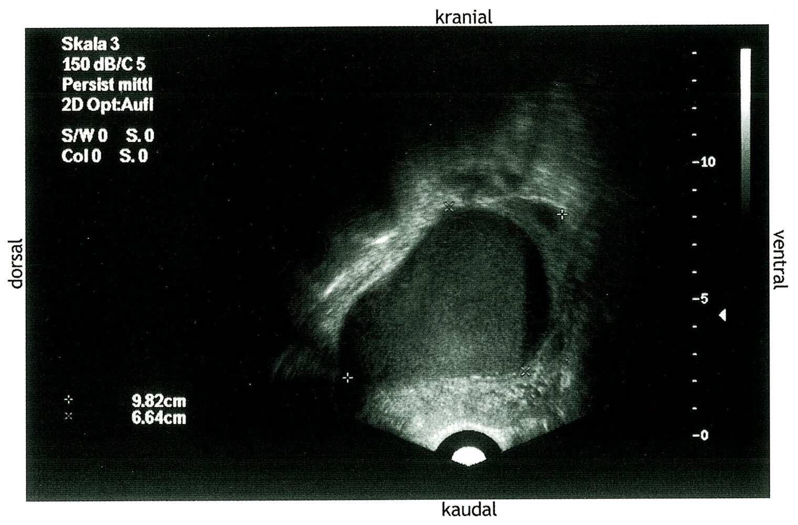
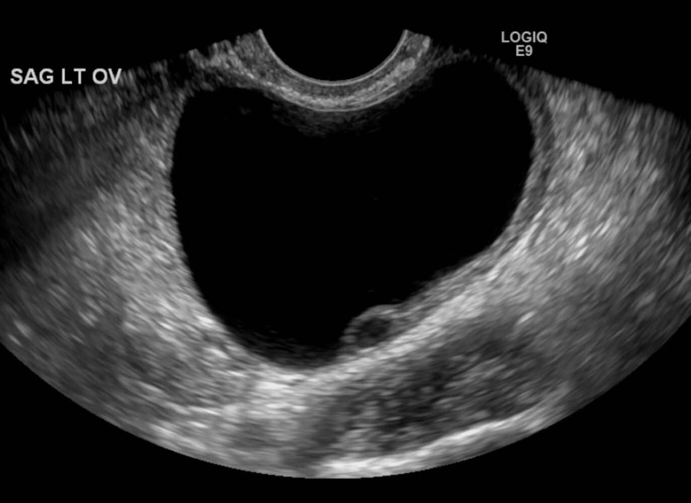
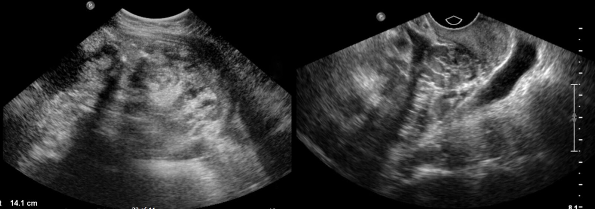
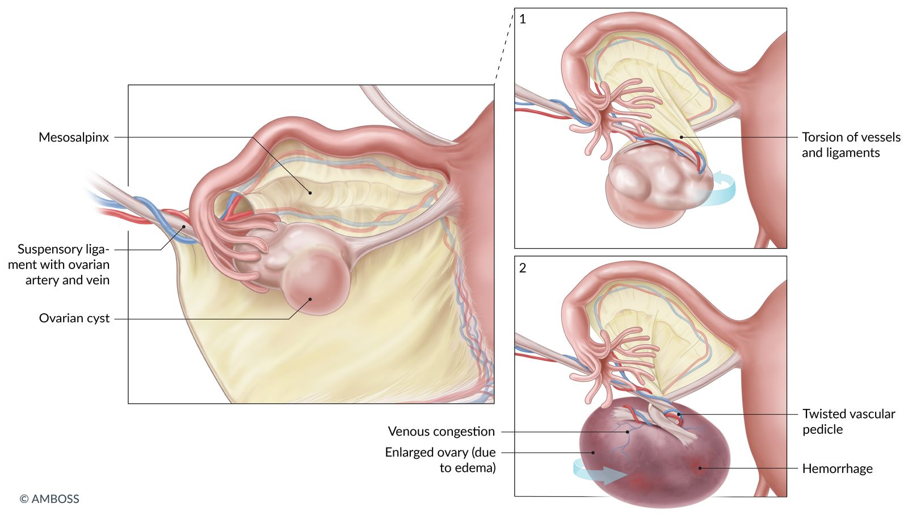

# Ovarian cysts

*Categories: Clinical knowledge > Surgery > Gynecologic surgery > Ovarian cysts*

[Original Article Link](https://coursology-qbank.com/amboss/article/go0FYS)

---

## Summary

Ovarian cysts are fluid-filled sacs within the <u>ovary</u>. The most common types are functional <u>follicular cysts</u>, <u>corpus luteum cysts</u>, and <u>theca lutein cysts</u>, which all develop as part of <u>the menstrual cycle</u> and are usually harmless and resolve on their own. Nonfunctional cysts include <u>chocolate cysts</u> (which are associated with <u>endometriosis</u>), <u>dermoid cysts</u>, <u>cystadenomas</u>, and malignant cysts (a type of <u>ovarian cancer</u>). Ovarian cysts are usually asymptomatic, but they can sometimes cause lower abdominal <u>pain</u> and predispose individuals to complications such as cyst rupture or <u>ovarian torsion</u>, which may require <u>surgery</u>. Diagnosis typically begins with <u>workup of an adnexal mass</u>, and is usually made with <u>pelvic</u> <u>ultrasound</u>. Management and follow-up depend on cyst size and appearance on <u>ultrasound</u>, the patient's <u>menopausal</u> status, and the presence of <u>risk factors</u> for <u>ovarian tumors</u>.

---

## Overview

### Definition

Ovarian cysts are fluid-filled sacs within the <u>ovary</u>.

### Types

#### Functional ovarian cysts

Functional cysts result from a disruption in the development of follicles or the <u>corpus luteum</u> and often resolve on their own.

* Follicular cyst of the ovary (most common ovarian mass in young women)  

* Develops when a <u>Graafian follicle</u> does not rupture and release the egg (<u>ovulation</u>) but continues to grow

* Eventually develops into a large cyst (∼ 7 cm) lined with <u>granulosa cells</u>

* Associated with <u>hyperestrogenism</u> and <u>endometrial hyperplasia</u>

* Corpus luteum cyst

* Enlargement and buildup of fluid in the <u>corpus luteum</u> after failed regression following the release of an <u>ovum</u>

* Produces <u>progesterone</u>, which may delay <u>menses</u>

* Associated with <u>progesterone</u>-only <u>contraceptive</u> pills and <u>ovulation</u>-inducing medication

* Common during <u>pregnancy</u>

* Theca lutein cysts

* Often multiple cysts that typically develop bilaterally

* Result from exaggerated stimulation of the <u>theca interna</u> cells of the <u>ovarian follicles</u> due to excessive amounts of circulating <u>gonadotropins</u> such as <u>β-hCG</u>

* Strongly associated with <u>gestational trophoblastic disease</u> and <u>multiple gestations</u>

* Usually resolve once <u>β-hCG</u> levels have normalized

#### Nonfunctional ovarian cysts

A group of ovarian cysts that do not produce <u>hormones</u>.

* <u>Chocolate cysts</u>

* <u>Dermoid cysts</u>

* <u>Cystadenoma</u> (serous or <u>mucinous</u>)

* Malignant cysts (form of <u>ovarian cancer</u>): higher risk in <u>postmenopausal</u> women

---

## Clinical features

* Usually asymptomatic (incidental finding)

* Can cause lower abdominal <u>pain</u> and lead to complications [[1]](https://coursology-qbank.com/amboss/article/4m13fh0)

* <u>Adnexal mass</u> that is sometimes palpable

* Possibly signs of the underlying cause, such as:

* <u>Menorrhagia</u> in <u>endometriosis</u>

* <u>Hirsutism</u>, <u>acne</u>, and <u>infertility</u> in <u>polycystic ovary syndrome</u>

> [!WARNING]
> <u>Ovarian cancer</u> must be ruled out in premenarchal and <u>postmenopausal</u> patients with an <u>adnexal mass</u>. [[2]](https://coursology-qbank.com/amboss/article/NJY-8J)

---

## Diagnosis

### Approach [[2]](https://coursology-qbank.com/amboss/article/NJY-8J)[[3]](https://coursology-qbank.com/amboss/article/G7dBMr0)

* The diagnostic workup follows the approach to diagnostics for an <u>adnexal mass</u>, including:

* <u>Transvaginal ultrasound</u> with doppler to evaluate for <u>ultrasound</u> findings concerning for ovarian <u>malignancy</u>

* Consideration of <u>ovarian tumor markers</u>

* For acutely symptomatic patients: [[4]](https://coursology-qbank.com/amboss/article/XZb9ZH)[[5]](https://coursology-qbank.com/amboss/article/AN1Rdh0)

* Consider CT abdomen and <u>pelvis</u> with IV contrast to rule out nongynecologic causes and complications.

* Perform additional diagnostics as clinically indicated; see “<u>Initial management of pelvic pain</u>” and “<u>Approach to acute abdomen</u>.”

> [!TIP]
> Exclude <u>pregnancy</u> in all patients of childbearing age with <u>pelvic pain</u> or a <u>pelvic</u> mass. [[5]](https://coursology-qbank.com/amboss/article/AN1Rdh0)

> [!TIP]
> <u>Transvaginal ultrasound</u> with doppler is the first-line imaging modality for symptomatic and asymptomatic patients with a suspected <u>adnexal mass</u>. [[3]](https://coursology-qbank.com/amboss/article/G7dBMr0)

### <u>Pelvic</u> <u>ultrasound</u> findings

* Simple cysts [[6]](https://coursology-qbank.com/amboss/article/5m1iTh0)

* Smooth lining on all sides

* Single: e.g., <u>follicular cyst of the ovary</u>

* Multiple: e.g., <u>polycystic ovary syndrome</u>

* <u>Anechoic</u>

* No internal flow on Doppler

* Functional cysts

* <u>Corpus luteum cyst</u> [[7]](https://coursology-qbank.com/amboss/article/wI1hUR0)

* Unilocular cyst with thick walls

* ↑ Peripheral vascularity (ring-of-fire sign)

* Small central lucency

* Intracystic echogenic debris may be present.

* <u>Theca lutein cysts</u> [[8]](https://coursology-qbank.com/amboss/article/9I1NUR0)

* Bilateral multilocular cysts with thin walls

* Fluid-filled

* Solid components may be present.

* Potentially malignant cysts: <u>ultrasound features concerning for ovarian malignancy</u>

Hemorrhagic ovarian cyst

Ovarian follicular cyst

Ovarian Teratoma (1/2)

---

## Management

Management and follow-up are usually determined by cyst appearance and size as well as <u>menopausal</u> status. [[5]](https://coursology-qbank.com/amboss/article/AN1Rdh0)[[6]](https://coursology-qbank.com/amboss/article/5m1iTh0)

* All patients

* <u>Pain management</u>: <u>NSAIDs</u> (first-line), <u>opioids</u> (only for severe cases)

* Treatment of underlying conditions such as <u>polycystic ovary syndrome</u> or <u>endometriosis</u>

* Refer for outpatient follow-up with a <u>gynecologist</u>.

* Consider gynecology consult prior to discharge for potentially malignant cysts.

* Functional cysts

* <u>Watchful waiting</u> with repeat <u>ultrasound</u>

* <u>Oral contraceptives</u> are not routinely recommended.  [[9]](https://coursology-qbank.com/amboss/article/-11Djf0)

* Complications, large cysts, persistent painful cysts: Consider <u>surgery</u>.

> [!TIP]
> In most patients with functional cysts, <u>watchful waiting</u> is recommended, as cysts often regress spontaneously.

---

## Complications

* <u>Ovarian torsion</u>

* <u>Ruptured ovarian cyst</u>

* Hemorrhage

Ovarian torsion

We list the most important complications. The selection is not exhaustive.

---

## Ruptured ovarian cyst

### Etiology [[11]](https://coursology-qbank.com/amboss/article/Nbb-FH)

* Rupture is caused by an increase in intracystic pressure.

* Most common type of ruptured cyst: <u>corpus luteum cyst</u> [[12]](https://coursology-qbank.com/amboss/article/JbbsuH)

* <u>Risk factors</u>

* Vigorous physical activity

* Vaginal intercourse

* Large cysts

* Reproductive age

### Clinical features

* May be asymptomatic

* Sudden-onset unilateral lower abdominal <u>pain</u> [[10]](https://coursology-qbank.com/amboss/article/MbbM8H)

* Possible <u>signs of peritonitis</u> [[5]](https://coursology-qbank.com/amboss/article/AN1Rdh0)

* Possible <u>nausea and vomiting</u> [[10]](https://coursology-qbank.com/amboss/article/MbbM8H)

* Minimal <u>vaginal bleeding</u> (spotting) may occur in some cases.

* In case of significant hemorrhage: <u>hypovolemic shock</u>  [[10]](https://coursology-qbank.com/amboss/article/MbbM8H)

### Diagnostics [[10]](https://coursology-qbank.com/amboss/article/MbbM8H)

#### <u>Laboratory studies</u>

* Urine or serum <u>β-hCG</u>: obtain in all patients to exclude intrauterine or <u>ectopic pregnancy</u>

* <u>CBC</u>: may show <u>anemia</u>

* <u>Emergency preoperative diagnostics</u>: <u>coagulation panel</u>, <u>type and screen</u>

#### Imaging

* <u>POCUS</u>/<u>FAST</u>: Consider in unstable patients to rapidly assess for the presence and extent of free fluid.

* Transabdominal/transvaginal <u>pelvic</u> <u>ultrasound</u>: imaging modality of choice

* Characteristic findings [[10]](https://coursology-qbank.com/amboss/article/MbbM8H)[[12]](https://coursology-qbank.com/amboss/article/JbbsuH)

* Free fluid, most commonly in the <u>pouch of Douglas</u> (<u>rectouterine pouch</u>)  [[4]](https://coursology-qbank.com/amboss/article/XZb9ZH)[[5]](https://coursology-qbank.com/amboss/article/AN1Rdh0)

* An <u>adnexal mass</u> may be visualized if the cyst is large.

* Disadvantage: cannot reliably distinguish between <u>ruptured ovarian cyst</u> or <u>ruptured ectopic pregnancy</u> in a pregnant patient. [[13]](https://coursology-qbank.com/amboss/article/ZTbZ6G)

* CT <u>pelvis</u> with IV contrast: consider in nonpregnant patients if <u>ultrasound</u> findings are inconclusive
* Characteristic findings: <u>pelvic</u> <u>hemoperitoneum</u> [[13]](https://coursology-qbank.com/amboss/article/ZTbZ6G)

> [!TIP]
> Free fluid in the <u>pouch of Douglas</u> in a pregnant patient should raise concern for <u>ruptured ectopic pregnancy</u>.

### Treatment [[10]](https://coursology-qbank.com/amboss/article/MbbM8H)[[14]](https://coursology-qbank.com/amboss/article/0gbeFG)[[15]](https://coursology-qbank.com/amboss/article/agbQFG)

* <u>Hemodynamically unstable</u> patients: : emergency exploratory <u>laparoscopy</u>/<u>laparotomy</u> to obtain <u>hemostasis</u>

* <u>Suturing</u> or cauterization of the ruptured section or cystectomy

* Consider <u>oophorectomy</u> in intractable hemorrhage

* Hemodynamically stable patients: <u>conservative management</u> with <u>analgesics</u> and observation 

* Consider outpatient monitoring with close follow-up  for patients with:

* Minimal <u>hemoperitoneum</u>

* Stable <u>Hb</u> on serial monitoring over 4–6-hours [[16]](https://coursology-qbank.com/amboss/article/6m1jgh0)

* Inpatient management if there is evidence of significant and/or ongoing hemorrhage  [[10]](https://coursology-qbank.com/amboss/article/MbbM8H)

* Monitor <u>vital signs</u>, <u>hemoglobin</u>, and <u>hemoperitoneum</u> size on <u>ultrasound</u>.

* Consider <u>laparoscopy</u> if there is concern for ongoing hemorrhage.

* All patients: Consider <u>blood transfusion</u> as needed.

### Differential diagnoses

* <u>Mittelschmerz</u>

* Ruptured or bleeding <u>ectopic pregnancy</u>

* <u>Tubo-ovarian abscess</u>

* <u>Ovarian torsion</u>

* <u>Acute appendicitis</u>

* <u>Diverticulitis</u>

* See also: “<u>Differential diagnosis of lower abdominal pain in young women</u>.”

### Acute management checklist for ruptured ovarian cyst

* Urgent <u>OB/GYN</u> consult

* <u>NPO</u>

* <u>IV fluids</u> (see <u>IV fluid therapy</u>)

* <u>Parenteral analgesics</u>: <u>Opioid analgesics</u> are preferred.

* Order <u>emergency preoperative diagnostics</u> and <u>β-hCG</u>.

* Obtain consent for <u>blood transfusion</u> and give emergent <u>transfusion</u> in suspected <u>hemorrhagic shock</u>.

* <u>Hemodynamically unstable</u> patients: emergency exploratory <u>surgery</u> for <u>hemostasis</u>

* Hemodynamically stable patients: Monitor <u>vitals</u>, <u>Hb</u>, and size of <u>hemoperitoneum</u> on imaging.

---