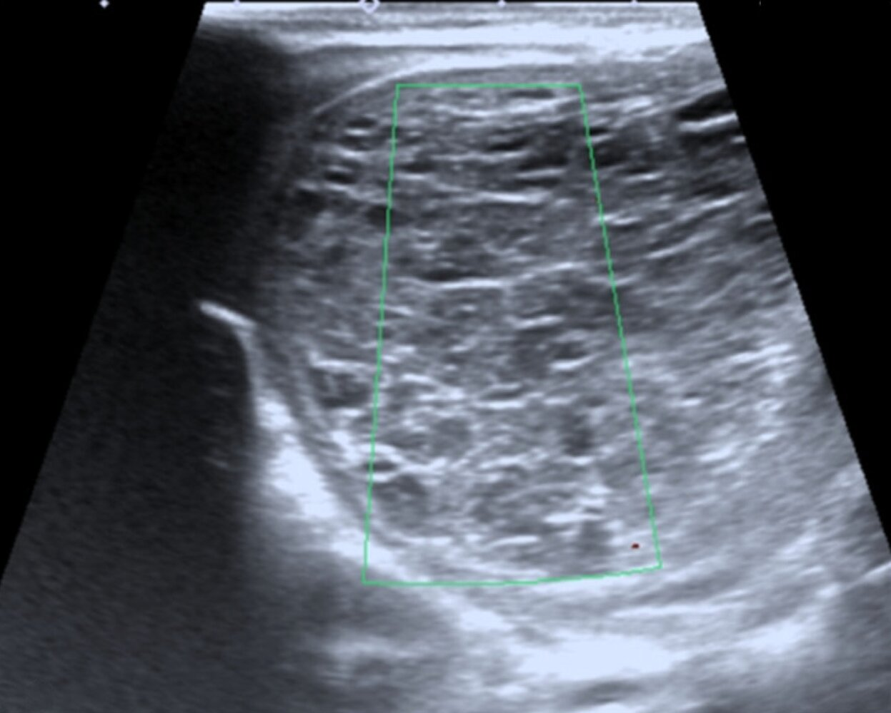

# Ovarian torsion

*Categories: Clinical knowledge > Surgery > Gynecologic surgery > Ovarian torsion*

[Original Article Link](https://coursology-qbank.com/amboss/article/yG0db3)

---

## Summary

Ovarian torsion is the twisting of an <u>ovary</u> around the adnexal <u>ligaments</u>. It most commonly occurs in women of childbearing age. <u>Risk factors</u> include ovarian enlargement (e.g., <u>ovarian cysts</u>, tumors, or hyperstimulation syndrome), laxity of <u>pelvic</u> <u>ligaments</u>, a history of <u>pelvic inflammatory disease</u>, and previous <u>pelvic</u> <u>surgery</u>. Torsion can lead to venous congestion and <u>edema</u>, which cuts off the blood supply to the <u>ovary</u>. Patients present with sudden onset unilateral lower abdominal or <u>pelvic pain</u>, and there may be a palpable <u>adnexal mass</u> and adnexal tenderness. In partial ovarian torsion, the <u>pain</u> may be intermittent or resolve spontaneously. Diagnosis is made using <u>pelvic</u> <u>ultrasound</u>. Torsion is a surgical emergency and <u>exploratory laparoscopy</u> is indicated in all patients with suspected ovarian torsion. Delays in treatment may result in ovarian <u>necrosis</u> and <u>infertility</u>.

---

## Etiology

* Ovarian enlargement is the most important <u>risk factor</u>; common causes include:

* <u>Ovarian cysts</u>, especially: [[2]](https://coursology-qbank.com/amboss/article/YXbn9H)

* Cysts > 5 cm

* <u>Dermoid cysts</u> (<u>teratoma</u>)

* <u>Ovarian tumors</u>

* <u>Ovarian hyperstimulation syndrome</u>

* <u>Pregnancy</u>: especially following <u>assisted reproductive technology</u>  [[3]](https://coursology-qbank.com/amboss/article/bXbH9H)

* Long <u>ovarian ligaments</u> and laxity of <u>pelvic</u> <u>ligaments</u> (e.g., suspensory <u>ligament</u>) may be predisposing factors, especially in <u>adolescents</u>. [[4]](https://coursology-qbank.com/amboss/article/EAY8l7)

* Strenuous physical activity  [[5]](https://coursology-qbank.com/amboss/article/vAYAl7)[[6]](https://coursology-qbank.com/amboss/article/DAY1N7)

* History of <u>pelvic inflammatory disease</u>

* Previous <u>pelvic</u> <u>surgery</u>, e.g., <u>tubal ligation</u> or <u>hysterectomy</u> [[7]](https://coursology-qbank.com/amboss/article/AN1Rdh0)

---

## Pathophysiology

* Twisting of the <u>ovary</u> and the <u>fallopian tube</u> around the <u>infundibulopelvic ligament</u> and ovarian <u>ligament</u> → compression of the <u>ovarian veins</u> and <u>lymphatics</u> → ↓ venous and lymphatic outflow → <u>edema</u> of the <u>fallopian tube</u> and <u>ovary</u>

* Worsening <u>edema</u> of the fallopian tube → compression of the ovarian <u>artery</u> → ovarian <u>ischemia</u> and <u>necrosis</u>

* <u>Friable</u> <u>necrotic</u> ovarian tissue → hemorrhage

Ovarian torsion

---

## Clinical features

* Most common during reproductive years but can occur at any age [[7]](https://coursology-qbank.com/amboss/article/AN1Rdh0)

* Sudden-onset unilateral lower abdominal and/or <u>pelvic pain</u>

* <u>Nausea and vomiting</u>

* <u>Adnexal mass</u> may be palpable

* Adnexal tenderness

* In partial ovarian torsion, abdominal <u>pain</u> may be intermittent or resolve spontaneously.

> [!TIP]
> <u>Pain</u> due to ovarian torsion may resolve intermittently as a result of spontaneous detorsion.

---

## Diagnosis

### <u>Laboratory studies</u>

* Urine or serum <u>β-hCG</u>: to rule out <u>pregnancy</u>

* <u>Emergency preoperative diagnostics</u>: <u>CBC</u>, <u>coagulation panel</u>, <u>type and screen</u>

> [!WARNING]
> A positive <u>pregnancy test</u> does not rule out torsion; an enlarged <u>corpus luteum</u> is a <u>risk factor</u> for torsion during <u>pregnancy</u>. [[8]](https://coursology-qbank.com/amboss/article/KnbU88)

### Imaging [[2]](https://coursology-qbank.com/amboss/article/YXbn9H)[[9]](https://coursology-qbank.com/amboss/article/XZb9ZH)

* <u>Pelvic</u> <u>ultrasound</u> with Doppler: imaging modality of choice [[8]](https://coursology-qbank.com/amboss/article/KnbU88)[[10]](https://coursology-qbank.com/amboss/article/_N15dh0)[[11]](https://coursology-qbank.com/amboss/article/8AYOl7)

* Approach: transvaginal (preferred) and/or transabdominal

* Indication: all patients with suspected ovarian torsion

* Supportive findings

* Enlarged, <u>edematous</u> <u>ovary</u> with decreased blood flow   [[7]](https://coursology-qbank.com/amboss/article/AN1Rdh0)

* Thickened <u>fallopian tube</u>

* Twisted vascular pedicle

* <u>MRI</u> abdomen and <u>pelvis</u> with contrast [[9]](https://coursology-qbank.com/amboss/article/XZb9ZH)

* Indication: inconclusive findings on <u>ultrasound</u>

* Supportive findings

* Enlarged <u>ovary</u> with thickening of the <u>ipsilateral</u> <u>fallopian tube</u>

* Deviation of the <u>uterus</u> to the <u>ipsilateral</u> side

* Decreased <u>contrast enhancement</u> of the affected <u>ovary</u>

* Twisted vascular pedicle (<u>whirlpool sign</u>)

* <u>Ascites</u> (usually minimal)

* CT abdomen and <u>pelvis</u> with IV contrast: not routinely recommended [[9]](https://coursology-qbank.com/amboss/article/XZb9ZH)

* Indication: inconclusive <u>ultrasound</u> findings and <u>MRI</u> is not available

* Contraindication: <u>pregnancy</u>

* Findings: similar to <u>MRI</u>

> [!WARNING]
> Consult gynecology immediately if ovarian torsion is clinically suspected, even if <u>ultrasound</u> findings are normal. [[7]](https://coursology-qbank.com/amboss/article/AN1Rdh0)

> [!WARNING]
> Ovarian torsion is a frequently missed diagnosis; a delay in treatment may affect <u>fertility</u> and pose a medicolegal risk. [[7]](https://coursology-qbank.com/amboss/article/AN1Rdh0)

Ovarian torsion

---

## Treatment

<u>Surgery</u> with <u>adnexal detorsion</u> and preservation of <u>ovaries</u> is the mainstay of treatment.

* Emergency <u>exploratory laparoscopy</u>: indicated in all patients with suspected ovarian torsion

* <u>Premenopausal</u> women: <u>adnexal detorsion</u> and preservation of ovarian function

* Intraoperative findings: enlarged purple or blue-black <u>ovary</u>, twisted <u>fallopian tube</u>

* <u>Oophorectomy</u> should only be performed if the <u>ovary</u> is frankly <u>necrotic</u> or gangrenous.  [[4]](https://coursology-qbank.com/amboss/article/EAY8l7)[[12]](https://coursology-qbank.com/amboss/article/SbbyGH)[[13]](https://coursology-qbank.com/amboss/article/NJY-8J)

* <u>Postmenopausal</u> women: <u>salpingo-oophorectomy</u> [[4]](https://coursology-qbank.com/amboss/article/EAY8l7)

* Additional procedures: based on intraoperative findings

* Ovarian cystectomy or drainage: in patients with <u>ovarian cysts</u>

* Oophoropexy: <u>utero-ovarian ligaments</u> are plicated or the <u>ovary</u> is fixed to either the <u>posterior</u> abdominal or <u>pelvic</u> sidewall to decrease the risk of retorsion. 

* Indications [[14]](https://coursology-qbank.com/amboss/article/tAYXl7)

* Ovarian torsion in a patient with a single <u>ovary</u>

* Bilateral ovarian torsion

* Recurrent ovarian torsion

* Patient with <u>risk factors</u> for retorsion (e.g., polycystic <u>ovaries</u>)

* <u>Oophoropexy</u> of the <u>contralateral</u> <u>ovary</u> may be considered in high-risk patients.

* <u>Supportive care</u>

* <u>IV fluid resuscitation</u>

* <u>Analgesics</u>

* <u>Antiemetics</u> as needed

* Postoperative follow-up

* Consider second-look <u>laparoscopy</u> if there is concern for ovarian <u>gangrene</u>. [[4]](https://coursology-qbank.com/amboss/article/EAY8l7)

* <u>Pelvic</u> <u>ultrasound</u> may be used to evaluate follicular development a few weeks/months after detorsion.

* Prognosis: Viability may be preserved in ∼ 90% of cases even if there is intraoperative evidence of ovarian <u>ischemia</u>.  [[4]](https://coursology-qbank.com/amboss/article/EAY8l7)[[13]](https://coursology-qbank.com/amboss/article/NJY-8J)

> [!TIP]
> <u>Diagnostic laparoscopy</u> should be performed if there is strong clinical suspicion for ovarian torsion despite inconclusive imaging findings.

---