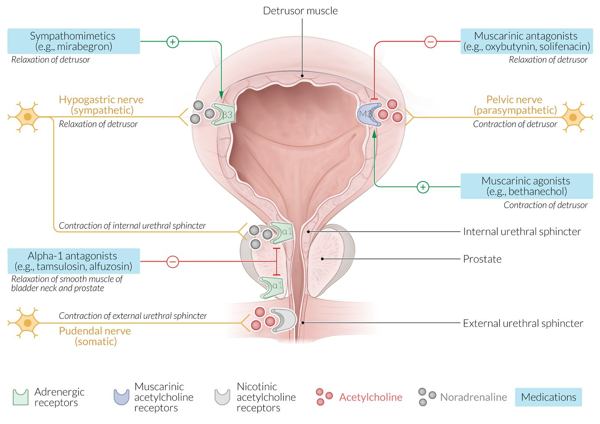

# Urinary incontinence

*Categories: Clinical knowledge > Surgery > Gynecologic surgery > Urinary incontinence*

[Original Article Link](https://coursology-qbank.com/amboss/article/ZQ0Zuf)

---

## Summary

Urinary incontinence (UI) is a common condition characterized by involuntary leakage of urine. Causes and representations are variable. <u>Stress urinary incontinence</u> (<u>SUI</u>), <u>urgency urinary incontinence</u> (<u>UUI</u>), and <u>mixed urinary incontinence</u> are the most common types. UI is more common in older individuals, and approximately twice as common in women than in men. The diagnosis can often be made based on a detailed <u>medical history</u>, a <u>voiding diary</u>, <u>physical examination</u>, and basic testing including <u>urinalysis</u> and measurement of <u>postvoid residual</u> (<u>PVR</u>). Advanced diagnostic studies may be required for patients with <u>red flags in urinary incontinence</u> or incontinence refractory to treatment. Management depends on the underlying cause and may involve <u>conservative measures</u> (e.g., management of comorbidities, <u>pelvic floor exercises</u>, <u>bladder training</u>), pharmacological treatment, minimally invasive procedures, or <u>anti-incontinence surgery</u>. Untreated UI can lead to <u>skin</u> irritation and <u>urinary tract infection</u> (<u>UTI</u>) and potentially result in negative effects on a patient's psychosocial well-being, mobility, and independence.

For the management of <u>stress urinary incontinence</u> and <u>overactive bladder and urgency urinary incontinence</u>, see the respective articles.

---

## Epidemiology

* <u>Prevalence</u> [[1]](https://coursology-qbank.com/amboss/article/1-02wi)

* Increases with age

* Up to 50% of women and up to 25% of men older than 65 years are affected.

* Sex: <u>♀</u> > <u>♂</u> (2:1) [[2]](https://coursology-qbank.com/amboss/article/c-0awi)

* <u>SUI</u> and <u>mixed incontinence</u> are the most common types of incontinence in female patients.

* <u>UUI</u> is the most common type in male patients.

Epidemiological data refers to the US, unless otherwise specified.

---

## Etiology

* <u>Idiopathic</u>

* Neurological causes

* <u>Multiple sclerosis</u>

* Spinal injury

* <u>Normal-pressure hydrocephalus</u>

* <u>Dementia</u>

* <u>Delirium</u>

* Genitourinary causes

* Trauma to the <u>pelvic floor</u>

* Intrinsic sphincter deficiency

* Urethral hypermobility in women

* <u>Impaired detrusor contractility</u>

* <u>Bladder outlet obstruction</u>

* <u>Pelvic floor weakness</u>

* <u>Urogenital fistula</u>

* Transient causes of urinary incontinence

* Drugs (e.g., <u>diuretics</u>)

* <u>UTI</u>

* <u>Postmenopausal</u> <u>atrophic urethritis</u>

* Psychiatric causes (especially <u>depression</u>, <u>delirium</u>/confused state)

* Excessive urinary output (in conditions like <u>hyperglycemia</u>, <u>hypercalcemia</u>, <u>CHF</u>)

* Stool impaction

* Impaired mobility

* General <u>risk factors</u>

* <u>Recurrent UTI</u>

* <u>Obesity</u>

* <u>Caffeine</u>

* <u>Alcohol</u>

> [!NOTE]
> To remember the reversible causes of acute urinary incontinence, think <u>DIAPPERS</u>: Delirium/confusion, Infection, Atrophic <u>urethritis</u>/<u>vaginitis</u>, Pharmaceutical, Psychiatric causes (especially <u>depression</u>), Excessive urinary output (<u>hyperglycemia</u>, <u>hypercalcemia</u>, <u>CHF</u>), Restricted mobility, Stool impaction.

---

## Overview

|  Overview of urinary incontinence [[3]](https://coursology-qbank.com/amboss/article/06cejW0)[[4]](https://coursology-qbank.com/amboss/article/DbX1D9)[[5]](https://coursology-qbank.com/amboss/article/Y51nih0)  |  |  |  |
| --- | --- | --- | --- |
|  | Underlying mechanism | Clinical features | Treatment |
| <u>Stress urinary incontinence</u> |   * Urethral hypermobility in women (<u>bladder</u> outlet <u>incompetence</u>) secondary to:  * Poor <u>pelvic</u> support caused by <u>pelvic</u> <u>postmenopausal</u> <u>estrogen</u> loss  * <u>Connective tissue disorders</u>  * <u>Childbirth</u> (i.e., damage to the <u>pelvic floor</u> muscle <u>levator ani</u> and/or the <u>S2</u>–<u>S4</u> <u>nerve roots</u>)  * Intrinsic sphincter deficiency, caused by:  * <u>Aging</u>  * <u>Obesity</u>  * <u>Pelvic</u> trauma  * <u>Prostate</u> <u>surgery</u> (in men)  * Increase in <u>intraabdominal pressure</u> (e.g., from laughing, sneezing, <u>coughing</u>, exercising) →  ↑ pressure within the <u>bladder</u> → <u>bladder</u> pressure > urethral sphincter resistance to urinary flow    |  * Positive <u>urinary stress test</u>: urinary leakage during activities that increase <u>intraabdominal pressure</u> (e.g., <u>coughing</u>, <u>Valsalva maneuver</u>)   |   * Trial of <u>conservative management of UI</u> for 6–8 weeks [[5]](https://coursology-qbank.com/amboss/article/Y51nih0)  * Consider a <u>vaginal pessary</u>.  * In refractory or severe incontinence, refer to a specialist for: [[4]](https://coursology-qbank.com/amboss/article/DbX1D9)  * Injection of <u>periurethral bulking agents</u>  * <u>Anti-incontinence surgery</u>  * See “<u>Treatment of SUI</u>” for additional information.    |
|  <u>Urgency urinary incontinence</u> [[6]](https://coursology-qbank.com/amboss/article/zdYrsL)  |  * Inflammatory conditions (e.g., <u>UTI</u>) or neurogenic disorders → sphincter dysfunction, <u>detrusor</u> overactivity, or <u>overactive bladder</u>  → premature contractions of the <u>detrusor muscle</u> and initiation of a normal <u>micturition</u> reflex   |  * Strong, sense of sudden urgency, followed by involuntary leakage   |   * <u>Conservative management of UI</u>  * <u>Pharmacological treatment for UUI</u>   * <u>Antimuscarinics</u> (e.g., <u>oxybutynin</u>)  * <u>Beta-3 agonists</u> (e.g., <u>mirabegron</u>)  * Interventional procedures  (e.g., sacral nerve stimulation, injection of <u>botulinum toxin</u> into the <u>bladder</u> wall)  * See “<u>Treatment of UUI</u>” for additional information.    |
| Mixed incontinence |  * Combination of mechanisms of <u>SUI</u> and <u>UUI</u>   |  * May have any of the clinical features above   |   * <u>Conservative management of UI</u>  * Treat the most bothersome symptom first, e.g., <u>antimuscarinics</u> for <u>UUI</u>. [[3]](https://coursology-qbank.com/amboss/article/06cejW0)[[7]](https://coursology-qbank.com/amboss/article/-dYDsL)[[8]](https://coursology-qbank.com/amboss/article/nNc7b10)    |
| Total incontinence |  * Complete loss of sphincter function (due to previous <u>surgery</u>, nerve damage, <u>metastasis</u>) or abnormal anatomy (<u>fistula</u> between <u>urinary tract</u> and <u>skin</u>)   |  * Urinary leakage occurs at all times, with no associated preceding symptoms or specific trigger activity.   |   * Short-term management: pads and external catheters  [[9]](https://coursology-qbank.com/amboss/article/C51qmh0)  * Long-term management: usually surgical (e.g., <u>fistula</u> repair), in consultation with urology and/or urogynecology [[3]](https://coursology-qbank.com/amboss/article/06cejW0)    |
|  Overflow incontinence (<u>overflow bladder</u>) [[10]](https://coursology-qbank.com/amboss/article/1Jc2GW0)  |   * Impaired (weak) <u>detrusor</u> contractility due to:[[11]](https://coursology-qbank.com/amboss/article/OXXIy9)  * <u>Neurogenic bladder</u> in <u>multiple sclerosis</u>  * Neuropathy and <u>polyuria</u> in <u>diabetes mellitus</u>  * <u>Spinal cord injury</u>  * Medication adverse effects  * <u>Bladder outlet obstruction</u> (e.g., <u>BPH</u>)  * Both mechanisms can lead to incomplete <u>bladder</u> emptying → <u>bladder</u> overfilling → chronically distended <u>bladder</u> with ↑ <u>bladder</u> pressure → dribbling of urine (leak) when intravesical pressure > outlet resistance    |   * Frequent, involuntary intermittent/continuous dribbling of urine in the absence of an urge to urinate  * Occurs only when the <u>bladder</u> is full  * Often occurs with changes in position  * <u>Postvoid residual</u> urine volume (seen on <u>ultrasound</u> or with catherization)    |   * Short term management includes:  * <u>Intermittent catheterization</u>: for scheduled <u>bladder</u> emptying  * <u>Alpha-1 antagonists</u>: for <u>outlet obstruction</u> in men  * <u>Muscarinic agonists</u>: for <u>detrusor</u> underactivity [[12]](https://coursology-qbank.com/amboss/article/wpch7W0)  * Long-term management includes treatment of the <u>urinary obstruction</u>, e.g.:  * Correction of <u>pelvic organ prolapse</u>  * <u>Transurethral resection of the prostate</u>  * Urethral dilation or urethroplasty  * See also “<u>Treatment of urinary retention</u>.”    |
|  Neurogenic lower urinary tract dysfunction [[13]](https://coursology-qbank.com/amboss/article/WM1Pnh0)[[14]](https://coursology-qbank.com/amboss/article/x3WEkO0)[[15]](https://coursology-qbank.com/amboss/article/-NdDdq0)  |  * Suprasacral <u>spinal cord lesion</u> (e.g., <u>multiple sclerosis</u>) → <u>detrusor-sphincter dyssynergia</u> with simultaneous contractions of the <u>detrusor muscle</u> and involuntary activation of the <u>urethral sphincter</u>   |  * <u>Urinary retention</u> and/or <u>UUI</u>   |   * Guided by patient and/or caregiver preference  * Voiding dysfunction  * <u>alpha blockers</u>  * Intermittent self-catheterization  * Storage dysfunction  * <u>Pelvic floor physical therapy</u>  * <u>Bladder training</u>  * <u>Antimuscarinic agents</u>  * <u>Beta-3 agonists</u> may be useful in improving storage parameters. [[15]](https://coursology-qbank.com/amboss/article/-NdDdq0)  * Further management of NLUTD may include minimally invasive (e.g., botulinum injections) or surgical treatments (e.g., sphincterotomy) depending on the underlying condition.  * See also “<u>Management of urinary incontinence</u>” and “<u>Treatment of urinary retention</u>.”    |
|  * Sacral or infrasacral lesion (e.g., <u>conus medullaris syndrome</u>) → <u>detrusor</u> underactivity with normal or reduced <u>urethral sphincter</u> tone   |  * <u>Urinary retention</u> and <u>overflow incontinence</u>   |  |  |
|  * Suprapontine lesion (e.g., <u>Parkinson disease</u>) → disrupted inhibition of the <u>pontine micturition center</u> → involuntary <u>detrusor</u> contractions   |  * Urinary incontinence without <u>urinary retention</u>   |  |  |
|  Giggle incontinence [[16]](https://coursology-qbank.com/amboss/article/NXX-y9)  |  * Unknown; not related to <u>stress</u> or <u>detrusor</u> <u>weakness</u>   |   * Affects children  * Involuntary complete voiding triggered by laughing  * Voiding behavior is otherwise normal (not a feature of <u>enuresis</u>).    |   * <u>Conservative management of UI</u>  * Reassurance  * <u>Oxybutynin</u> (second line)    |

> [!NOTE]
> Neural control of <u>micturition</u>: <u>parasympathetic nervous system</u> → <u>S2</u>–<u>S4</u> <u>ventral</u> root → <u>inferior hypogastric plexus</u> → contraction of the <u>detrusor</u> muscle → voluntary relaxation of the <u>external urethral sphincter</u> muscle via the <u>pudendal nerve</u> → <u>micturition</u>

> [!TIP]
> <u>SUI</u> is caused by urethral dysfunction, while <u>UUI</u> is caused by <u>bladder</u> dysfunction. <u>Mixed incontinence</u> is a combination of both. [[17]](https://coursology-qbank.com/amboss/article/oNc0X10)

Urinary incontinence

Urinary bladder (male)

Urinary bladder (female)

---

## Diagnosis

### Approach

* All patients

* Perform an <u>initial evaluation for urinary incontinence</u>.

* Screen for <u>red flags in urinary incontinence</u>.

* Suspected upper <u>urinary tract</u> involvement : Obtain <u>renal ultrasound</u> and <u>laboratory studies</u>.

* <u>Red flags in urinary incontinence</u> present or refractory incontinence: Refer to a specialist for advanced studies.

### Red flags in urinary incontinence [[3]](https://coursology-qbank.com/amboss/article/06cejW0)[[5]](https://coursology-qbank.com/amboss/article/Y51nih0)[[17]](https://coursology-qbank.com/amboss/article/oNc0X10)

Refer to urology or urogynecology for specialist workup if any of the following features are present:

* Associated <u>pain</u>

* Persistent <u>hematuria</u> or <u>proteinuria</u>

* Elevated <u>PVR</u>

* Symptoms suggestive of obstruction

* Suspected <u>fistula</u>

* <u>Pelvic organ prolapse</u>

* <u>Recurrent UTIs</u>

* Incontinence after radiation, radical <u>pelvic</u> <u>surgery</u>, or previous incontinence <u>surgery</u>

### Initial evaluation for urinary incontinence [[3]](https://coursology-qbank.com/amboss/article/06cejW0)[[4]](https://coursology-qbank.com/amboss/article/DbX1D9)[[18]](https://coursology-qbank.com/amboss/article/DNc1W10)

#### Focused history

* Use a validated incontinence questionnaire if possible.  [[3]](https://coursology-qbank.com/amboss/article/06cejW0)[[5]](https://coursology-qbank.com/amboss/article/Y51nih0)

* Inquire about symptoms that occur with voiding.

* Assess for barriers to voiding (e.g., limited mobility, which may delay patients reaching the bathroom).

* Ask patients to record fluid intake and <u>micturition</u> for 3–5 days using a <u>voiding diary</u>.

* Obtain a relevant social and <u>medical history</u>, including:

* <u>Transient causes of urinary incontinence</u>

* Local causes (back, bowel, gynecologic, or <u>bladder</u> <u>surgery</u>; <u>constipation</u>; <u>pelvic organ prolapse</u>)

* Systemic conditions (<u>congestive heart failure</u>, <u>chronic cough</u> , neurological disease)

* Contributing dietary and lifestyle factors.

#### <u>Physical examination</u> [[3]](https://coursology-qbank.com/amboss/article/06cejW0)[[17]](https://coursology-qbank.com/amboss/article/oNc0X10)

* Lower <u>abdominal examination</u>: Evaluate for <u>bladder</u> distention and masses.

* <u>Digital rectal examination</u>: Assess for <u>fecal impaction</u>, prostatomegaly, masses, and decreased <u>anal sphincter tone</u>.

* <u>Pelvic examination</u>: Evaluate for <u>pelvic organ prolapse</u>, vaginal <u>atrophy</u>, masses, and <u>vaginitis</u>.  [[3]](https://coursology-qbank.com/amboss/article/06cejW0)

* <u>Cardiovascular examination</u>: Assess for <u>signs of fluid overload</u> (may worsen <u>urge incontinence</u>).

* <u>Neurological examination</u>: Both spinal and cerebral pathologies can cause incontinence (see “Etiology”).

* Assess <u>motor function</u> of the lower extremities and sensation of the sacral <u>dermatomes</u>.

* Consider <u>cognitive testing</u>.

#### Initial diagnostics

The following outlines a general approach for the workup of undifferentiated incontinence.

* <u>Urinary stress test</u>: performed for all patients to distinguish <u>SUI</u> from other types of UI  [[5]](https://coursology-qbank.com/amboss/article/Y51nih0)

* <u>Urinalysis</u>

* Positive <u>urinary nitrites</u> and/or <u>leukocyte esterase</u>: suggestive of a <u>UTI</u>; send <u>urine culture</u>.

* Isolated <u>microhematuria</u>: obtain <u>diagnostics for hematuria</u>  [[19]](https://coursology-qbank.com/amboss/article/Z5cZi10)

* <u>Glucosuria</u>: If present, <u>screen for diabetes</u>.  [[20]](https://coursology-qbank.com/amboss/article/u6cp5W0)

* <u>Postvoid residual</u> (<u>PVR</u>)  [[10]](https://coursology-qbank.com/amboss/article/1Jc2GW0)

* Indications [[3]](https://coursology-qbank.com/amboss/article/06cejW0)[[5]](https://coursology-qbank.com/amboss/article/Y51nih0)[[17]](https://coursology-qbank.com/amboss/article/oNc0X10)

* Suspected <u>overflow incontinence</u>

* Diagnostic uncertainty

* Patients being considered for specialist referral

* Findings: Elevated <u>PVR</u> suggests either decreased <u>bladder</u> contractility or <u>urethral obstruction</u>.  [[4]](https://coursology-qbank.com/amboss/article/DbX1D9)[[17]](https://coursology-qbank.com/amboss/article/oNc0X10)

* Pad test: Consider to determine symptom severity. [[21]](https://coursology-qbank.com/amboss/article/5ndiFq0)[[22]](https://coursology-qbank.com/amboss/article/g5dFjq0)

* Performed over a set period of time ranging from 1–24 hours

* Patients drink a set amount of fluids before performing specific activities while wearing preweighed incontinence pads.

* The pad is weighed again after the trial to determine the volume of incontinence.

> [!TIP]
> Perform a <u>urinary stress test</u> in all patients to distinguish between <u>SUI</u> and <u>UUI</u>.

#### Differentiation between types of incontinence

|  Diagnostic overview of types of incontinence [[17]](https://coursology-qbank.com/amboss/article/oNc0X10)  |  |  |  |
| --- | --- | --- | --- |
|  | Clinical history | <u>Urinary stress test</u> | <u>Postvoid residual</u> |
| <u>Stress urinary incontinence</u> |  * Leakage with <u>coughing</u>, sneezing, and/or exercising   |  * Leakage with <u>coughing</u>   |  * < 50 mL   |
| <u>Urgency urinary incontinence</u> |  * <u>Symptoms of UUI</u>   |   * Usually negative  * May have delayed leakage  [[17]](https://coursology-qbank.com/amboss/article/oNc0X10)    |  |
| <u>Overflow incontinence</u> |  * No symptoms of <u>SUI</u> or <u>UUI</u>   |  * No leakage   |  * > 200 mL   |
| <u>Functional urinary incontinence</u> |  * Patients may have:  * Mobility issues  * <u>Symptoms of cognitive impairment</u>   |  * Variable   |  |
| Patients with features of both <u>SUI</u> and <u>UUI</u> have <u>mixed incontinence</u>. |  |  |  |

### Upper <u>urinary tract</u> studies [[3]](https://coursology-qbank.com/amboss/article/06cejW0)[[23]](https://coursology-qbank.com/amboss/article/onc0810)

* <u>Renal ultrasound</u>

* Indications include:

* <u>Hematuria</u>

* <u>Neurogenic incontinence</u>

* Elevated <u>PVR</u>

* Comorbid renal disease

* Findings may show:

* <u>Hydronephrosis</u> associated with <u>overflow incontinence</u>

* <u>Urinary tract</u> pathology, e.g., <u>malignancy</u>

* <u>Creatinine</u> and <u>BUN</u>: may be elevated in patients with <u>overflow incontinence</u>

> [!TIP]
> Only perform upper <u>urinary tract</u> studies if the initial assessment indicates a possible renal pathology and/or renal impairment due to <u>urinary retention</u> and <u>vesicoureteral reflux</u>. [[5]](https://coursology-qbank.com/amboss/article/Y51nih0)[[23]](https://coursology-qbank.com/amboss/article/onc0810)

### Advanced studies [[3]](https://coursology-qbank.com/amboss/article/06cejW0)[[4]](https://coursology-qbank.com/amboss/article/DbX1D9)[[24]](https://coursology-qbank.com/amboss/article/g51Fjh0)

Advanced studies are performed under specialist guidance for patients with <u>red flags in urinary incontinence</u> or incontinence refractory to initial management.

* <u>Micturating cystourethrogram</u>: to detect <u>vesicoureteral reflux</u> and/or morphological abnormalities (e.g., <u>diverticula</u>, obstruction)

* <u>Urodynamic studies</u>: to determine <u>detrusor</u> and sphincter function

* <u>Cystoscopy</u>: to evaluate for tumors and vesicorectal and vesicovaginal <u>fistulae</u>

* <u>Ultrasound</u> <u>pelvis</u>  : for suspected <u>pelvic floor dysfunction</u>

* <u>MRI</u>   : to assess for <u>pelvic floor</u> defects, <u>urinary tract</u> anomalies, and masses

* CT with IV contrast: for suspected anatomical abnormalities, e.g., <u>urinary tract</u> masses, <u>bladder</u> wall thickening

---

## Management

This section provides an overview of the <u>management of UI</u>. For specific information, see “<u>Treatment of SUI</u>,” “<u>Treatment of UUI</u>,” and “<u>Treatment of urinary retention</u>.”

### Approach [[3]](https://coursology-qbank.com/amboss/article/06cejW0)

* Identify and manage:

* <u>Transient causes of urinary incontinence</u> (e.g., <u>UTI</u>, <u>constipation</u>)

* Barriers to voiding

* <u>Risk factors</u> for and causes of UI (see “<u>Etiology of urinary incontinence</u>”)

* Offer <u>incontinence products</u> to prevent dermatological complications and improve patient comfort.

* Educate patients on <u>lifestyle recommendations for UI</u>.

* Further management depends on the type of incontinence and can include:

* <u>Pelvic floor physical therapy</u>

* Pharmacological treatment

* Interventional management

* Refer patients with any of the following to urology or urogynecology for further management:

* <u>Red flags in UI</u>

* <u>Neurogenic incontinence</u> or <u>total incontinence</u>

* Refractory incontinence

> [!TIP]
> Assess the impact of incontinence symptoms on the patient's daily activities and discuss their treatment goals; use <u>shared decision-making</u> to individualize treatment plans.

### Conservative management of urinary incontinence [[6]](https://coursology-qbank.com/amboss/article/zdYrsL)[[8]](https://coursology-qbank.com/amboss/article/nNc7b10)

#### Incontinence products [[25]](https://coursology-qbank.com/amboss/article/K7dU5r0)

* Offer to all patients to prevent <u>skin</u> breakdown and improve comfort.

* Products may be used alone or in combination and include:

* Pads and diapers

* <u>Barrier creams</u>

* External urinary catheters

* The following products may be considered by a specialist for refractory incontinence. [[25]](https://coursology-qbank.com/amboss/article/K7dU5r0)

* <u>Urethral inserts</u>

* Continence pessaries

* Penile clamps

* Indwelling catheters

#### Management of <u>risk factors</u> and causes

* Treat common comorbidities, e.g.:

* <u>Management of obesity</u>

* <u>Management of diabetes mellitus</u>

* <u>Treatment of genitourinary syndrome of menopause</u>  [[26]](https://coursology-qbank.com/amboss/article/851ONh0)

* Advise <u>smoking cessation</u>.

* Reduce the dose of or discontinue contributing medications (e.g., <u>diuretics</u>).

* Refer patients with limited mobility to <u>physical therapy</u> and <u>occupational therapy</u>.

* Refer patients with <u>SUI</u> and <u>UUI</u> to <u>pelvic floor physical therapy</u>. [[27]](https://coursology-qbank.com/amboss/article/zMcrr10)

#### Lifestyle recommendations for UI

* Limiting consumption of <u>alcohol</u> and <u>caffeine</u> (including carbonated drinks)

* Discuss appropriate fluid intake and timing throughout the day  [[5]](https://coursology-qbank.com/amboss/article/Y51nih0)

#### Bladder training

* <u>Scheduled voiding</u> regimens and patient education are used to increase leak-free intervals. [[4]](https://coursology-qbank.com/amboss/article/DbX1D9)

* Timed voiding: Intervals between voiding are sequentially increased until the goal of at least 3–4 hours is met.

* Relaxation and distraction techniques: used to suppress the urge to urinate

* Indications: <u>UUI</u>, but also effective for <u>SUI</u> and <u>mixed incontinence</u>

#### Pharmacological treatment

* Used in the management of <u>UUI</u>, <u>urinary retention</u>, or <u>outlet obstruction</u>

* Adverse effects and interactions may limit use (see “<u>Pharmacotherapy in older adults</u>”).

|  Autonomic drugs used to treat bladder incontinence [[3]](https://coursology-qbank.com/amboss/article/06cejW0)[[4]](https://coursology-qbank.com/amboss/article/DbX1D9)[[5]](https://coursology-qbank.com/amboss/article/Y51nih0)  |  |  |
| --- | --- | --- |
| Drug group | Indications |  Mechanism of action   |
|  <u>Muscarinic antagonists</u> e.g., <u>oxybutynin</u>  |  * <u>UUI</u> (<u>detrusor</u> overactivity)   |  * Blocks <u>M3 receptor</u> → <u>detrusor muscle</u> relaxation   |
|  <u>Beta-3 agonists</u> (<u>sympathomimetics</u>) e.g., <u>mirabegron</u>  |  * Stimulates <u>β3 receptor</u> → <u>detrusor muscle</u> relaxation → increased <u>bladder</u> capacity   |  |
|  <u>Muscarinic agonists</u> e.g., <u>bethanechol</u>   [[10]](https://coursology-qbank.com/amboss/article/1Jc2GW0)[[12]](https://coursology-qbank.com/amboss/article/wpch7W0)  |  * <u>Urinary retention</u>   |  * Stimulates <u>M3 receptor</u> → <u>detrusor muscle</u> contraction → emptying of the <u>bladder</u>   |
|  <u>Alpha-1 antagonists</u> e.g., <u>tamsulosin</u>  |  * <u>Outlet obstruction</u> associated with <u>BPH</u>   |  * Blocks <u>α1 receptor</u> → relaxation of <u>smooth muscles</u> in the <u>bladder neck</u> and <u>prostate</u> → reduced obstruction of urinary outflow   |

> [!WARNING]
> The use of <u>muscarinic agonists</u> may lead to <u>urinary urgency</u>, while the use of <u>sympathomimetics</u> or <u>muscarinic antagonists</u> may lead to <u>urinary retention</u>, especially if there is an untreated <u>outlet obstruction</u>. [[3]](https://coursology-qbank.com/amboss/article/06cejW0)

> [!TIP]
> No pharmacological treatments are <u>FDA</u>-approved for <u>SUI</u>; management is either conservative (e.g., <u>physiotherapy</u>) or surgical. [[4]](https://coursology-qbank.com/amboss/article/DbX1D9)

Mechanism of action of medications used in micturition problems

### Interventional management

* Minimally invasive procedures

* For <u>SUI</u>: <u>periurtheral bulking</u>

* For <u>UUI</u>: <u>sacral neuromodulation</u>, <u>botulinum toxin</u> injections, <u>posterior tibial nerve stimulation</u>

* <u>Anti-incontinence surgery</u>

* Choice of procedure depends on type of incontinence

* See “<u>Treatment of SUI</u>,” “<u>Treatment of UUI</u>,” and “<u>Treatment of urinary retention</u>” for more information.

---

## Complications

* Mental health: <u>depression</u>, psychosocial <u>distress</u>

* Dermatologic: dermatitis, <u>skin infections</u>, sores [[31]](https://coursology-qbank.com/amboss/article/UJcbtW0)

* Environmental: decreased independence

* <u>Urinary tract</u>: : increased risk of <u>UTIs</u>

We list the most important complications. The selection is not exhaustive.

---