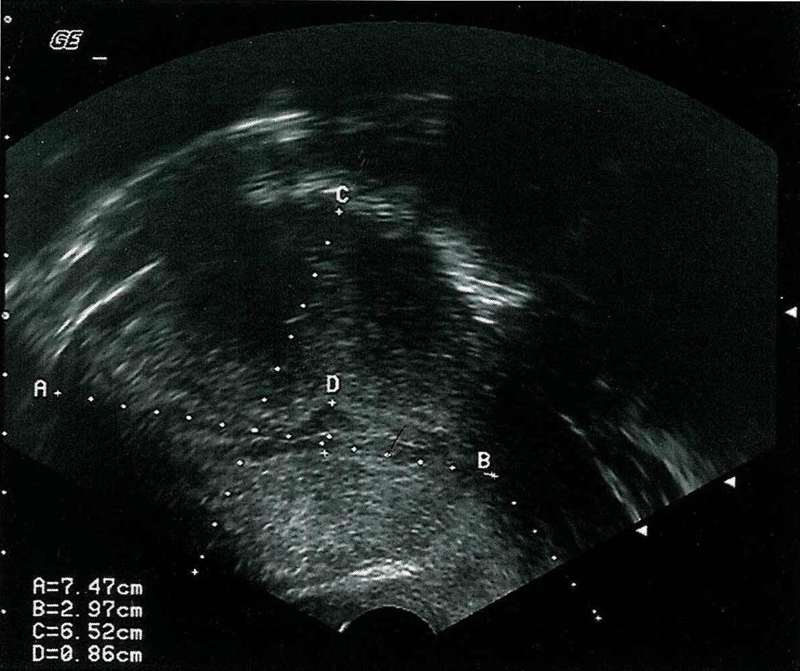
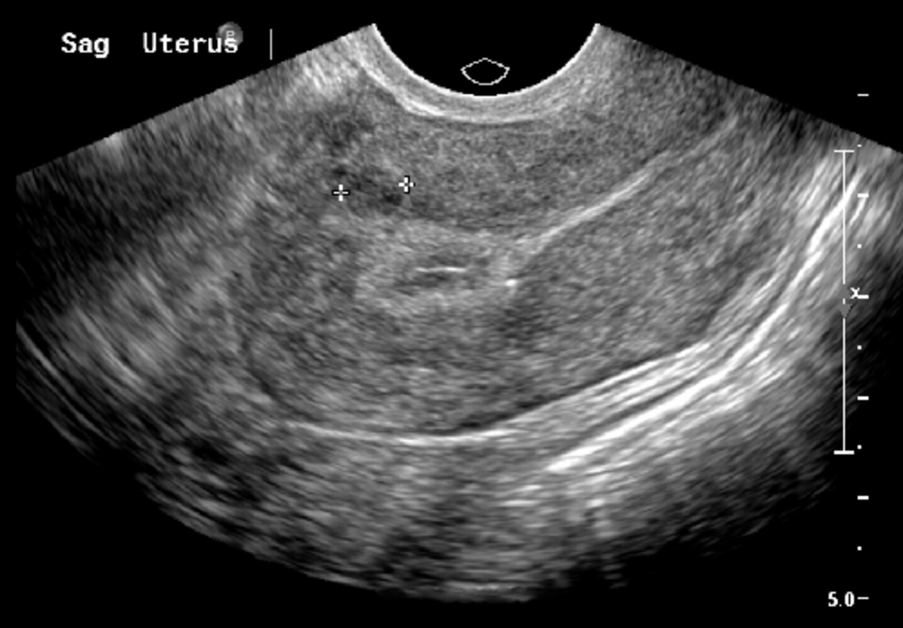
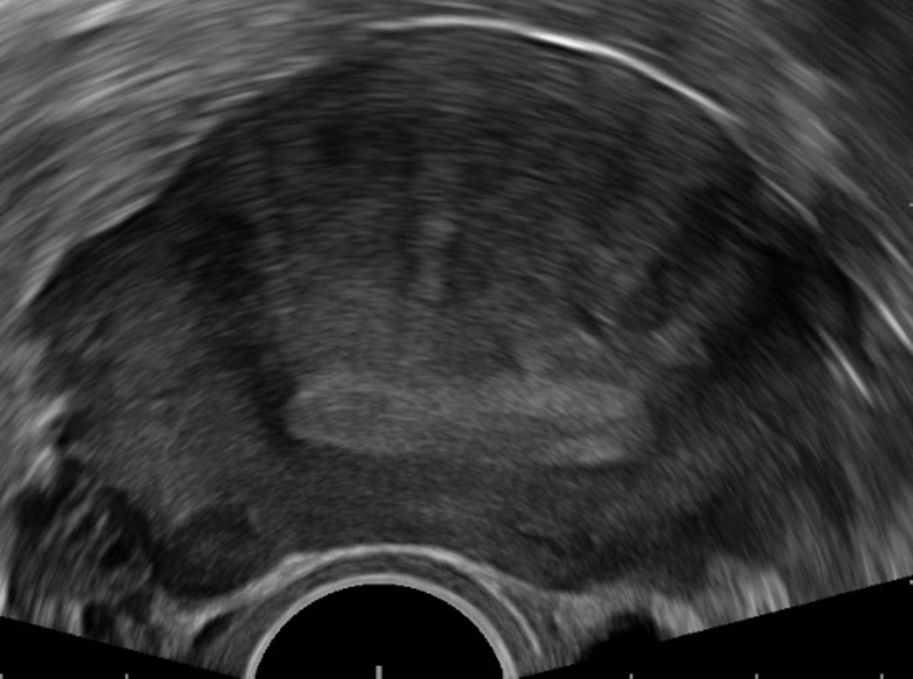
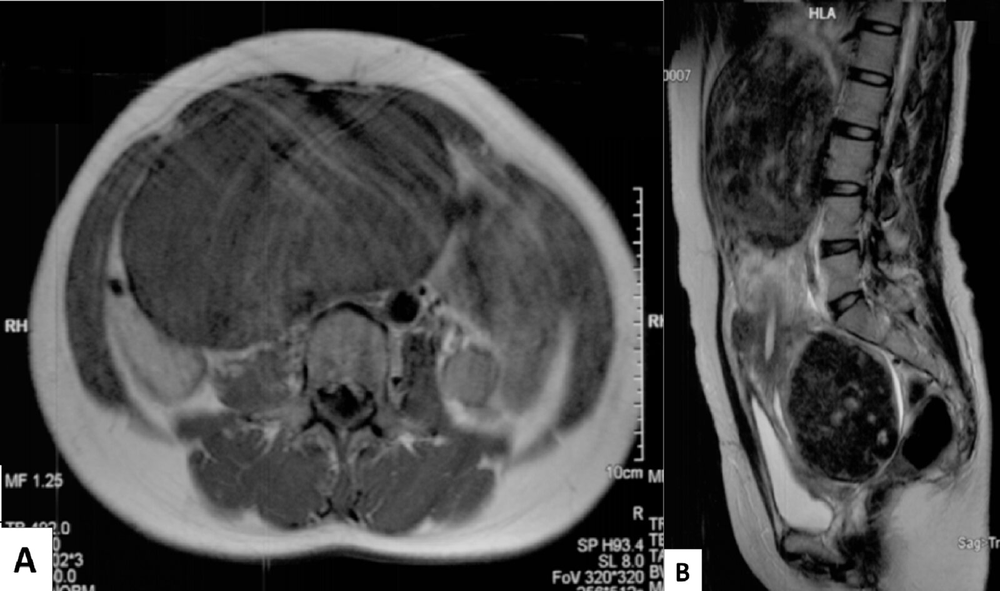
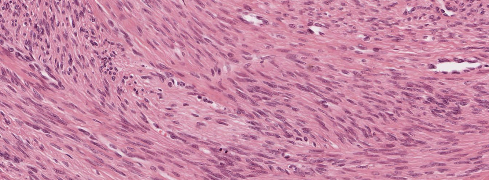
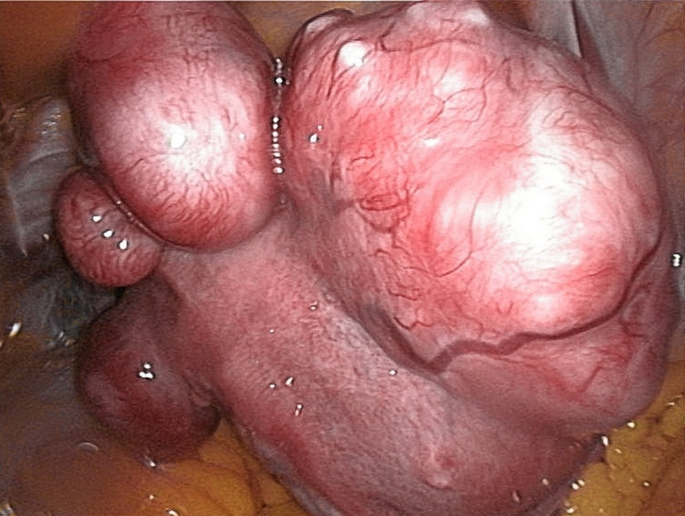
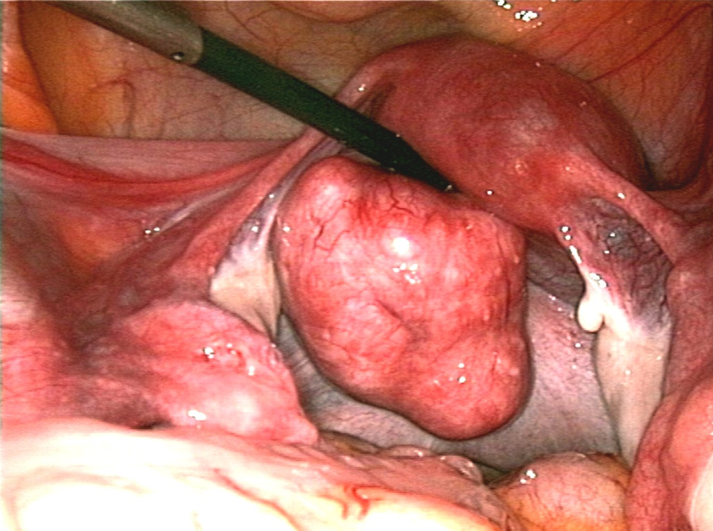

# Uterine leiomyoma

*Categories: Clinical knowledge > Surgery > Gynecologic surgery > Uterine leiomyoma*

[Original Article Link](https://coursology-qbank.com/amboss/article/zk0rqT)

---

## Summary

Uterine <u>leiomyomas</u> (also known as fibroids) are benign, <u>hormone</u>-sensitive uterine <u>neoplasms</u>. They are classified as either <u>submucosal</u> (beneath the <u>endometrium</u>), intramural (within the muscular uterine wall of the <u>uterus</u>), or subserosal (beneath the <u>peritoneum</u>) and can occur within the uterine corpus or the <u>cervix</u>. Symptoms depend on the location, size, and number of <u>leiomyomas</u>, and include menstrual abnormalities (e.g., <u>menorrhagia</u>), <u>mass effect</u> (e.g., back, abdominal, and/or <u>pelvic pain</u>; <u>bladder</u> and/or bowel dysfunction), and <u>infertility</u>. <u>Ultrasound</u> is typically used to establish the diagnosis. Treatment is selected using <u>shared decision-making</u>, taking into consideration the patient's desire for <u>fertility</u> and/or uterine preservation, <u>menopausal</u> status, and symptom severity. Asymptomatic patients can often be managed expectantly. Treatment for symptomatic patients may include <u>surgery</u> (<u>myomectomy</u> or <u>hysterectomy</u>), nonsurgical interventional treatments (e.g., <u>uterine artery embolization</u>), and/or pharmacotherapy, including <u>gonadotropin-releasing hormone (GnRH) agonists</u>, <u>GnRH antagonists</u>, <u>intrauterine devices</u> (<u>IUDs</u>), and/or <u>oral contraceptives</u>.

---

## Overview

* A benign, <u>hormone</u>-sensitive <u>smooth muscle</u> <u>tumor</u> of the <u>uterus</u>

* Can be <u>submucosal</u>, intramural, or subserosal

* Arises from a single myometrial cell (monoclonal growth) and causes:

* Upregulation of <u>hormone</u> <u>receptors</u>, particularly <u>estrogen</u> and <u>progesterone</u>

* Excessive production of <u>extracellular matrix</u> (hence "fibroids")

* Results in an overgrowth of <u>smooth muscle cells</u> and <u>connective tissue</u> (often multiple tumors)

* The <u>myometrium</u> also develops vascular changes (e.g., increased <u>arterioles</u> and <u>venules</u>, dilated <u>veins</u>).

* The most common <u>tumor</u> of the female genital tract.

---

## Etiology

### Predisposing factors [[1]](https://coursology-qbank.com/amboss/article/mcaV1j)[[2]](https://coursology-qbank.com/amboss/article/pcYLWL)

* <u>Nulliparity</u>

* Early <u>menarche</u> (< 10 years of age)

* Age: 25–45 years

* Fibroids are largely found in women of reproductive age.

* Influenced by <u>hormones</u> (i.e., <u>estrogen</u>, <u>growth hormone</u>, and <u>progesterone</u>)

* During <u>menopause</u>, <u>hormone</u> levels begin to decrease and <u>leiomyomas</u> begin to shrink.

* Increased <u>incidence</u> in African American individuals

* <u>Obesity</u>

* <u>Family history</u>

---

## Classification

<u>Leiomyomas</u> are classified according to their location. [[3]](https://coursology-qbank.com/amboss/article/OXcIya0)

* Subserosal leiomyoma: located in the outer uterine wall beneath the <u>peritoneal</u> surface

* Intramural leiomyoma (most common): growing from within the <u>myometrium</u> wall

* Submucosal leiomyoma: located directly below the <u>endometrial</u> layer (uterine <u>mucosa</u>)

* Cervical leiomyoma: located in the <u>cervix</u>

* Diffuse uterine leiomyomatosis: The <u>uterus</u> is grossly enlarged due to the presence of numerous fibroids.

-

---

## Clinical features

Symptoms depend on the number, size, and location of <u>leiomyomas</u>. Most women have small, asymptomatic fibroids.

* Abnormal <u>menstruation</u>:  (possibly associated with <u>anemia</u>): <u>hypermenorrhea</u>, <u>heavy menstrual bleeding</u>, ; <u>metrorrhagia</u>, <u>dysmenorrhea</u>

* Features of <u>mass effect</u>

* Enlarged, firm and irregular <u>uterus</u> during <u>bimanual pelvic examination</u>

* Back or <u>pelvic pain</u>/discomfort

* <u>Urinary tract</u> or bowel symptoms (e.g., <u>urinary frequency</u>/retention/incontinence, <u>constipation</u>, features of <u>hydronephrosis</u>)

* Reproductive abnormalities

* <u>Infertility</u> (; difficulty conceiving and increased risk of <u>pregnancy loss</u>)

* <u>Dyspareunia</u>

---

## Diagnosis

### General principles [[4]](https://coursology-qbank.com/amboss/article/XAc9RU0)[[5]](https://coursology-qbank.com/amboss/article/uEWpxM0)

* Obtain a detailed history and perform a thorough abdominal and <u>pelvic examination</u>.

* Perform a <u>pelvic</u> <u>ultrasound</u> to confirm the diagnosis.

* Order <u>laboratory studies</u> to screen for complications (e.g., <u>anemia</u>) and rule out other <u>causes of abnormal uterine bleeding</u>.

* Additional studies may be required:

* To further characterize <u>leiomyomas</u> prior to interventional procedures or <u>surgery</u>

* If there is diagnostic uncertainty

> [!WARNING]
> Uterine <u>leiomyomas</u> are extremely common (affecting 70% of women) and are often found incidentally on <u>ultrasound</u>; do not attribute <u>abnormal uterine bleeding</u> to <u>leiomyomas</u> until other etiologies have been ruled out! [[4]](https://coursology-qbank.com/amboss/article/XAc9RU0)[[6]](https://coursology-qbank.com/amboss/article/NBc-aU0)

### Imaging [[5]](https://coursology-qbank.com/amboss/article/uEWpxM0)[[7]](https://coursology-qbank.com/amboss/article/Xq19C30)

#### <u>Ultrasound</u> <u>pelvis</u> (transvaginal, transabdominal)

* Most appropriate initial test for all patients with a suspected uterine <u>leiomyoma</u> [[7]](https://coursology-qbank.com/amboss/article/Xq19C30)

* Supportive findings [[8]](https://coursology-qbank.com/amboss/article/KM1Uph0)

* Well-circumscribed <u>hypoechoic</u> solid mass

* Calcifications and/or cystic areas due to degeneration

* <u>Mass effect</u> (e.g., <u>hydronephrosis</u>) may be seen in patients with large <u>leiomyomas</u>.

> [!TIP]
> Neither <u>plain radiography</u> nor CT is recommended in the workup of <u>leiomyomas</u> because of poor visualization (unless calcified). [[7]](https://coursology-qbank.com/amboss/article/Xq19C30)[[9]](https://coursology-qbank.com/amboss/article/bAcHRU0)

#### Further imaging [[7]](https://coursology-qbank.com/amboss/article/Xq19C30)[[10]](https://coursology-qbank.com/amboss/article/aAcQRU0)

* <u>Sonohysterography</u>: to further evaluate <u>endometrial</u> abnormalities detected on <u>ultrasound</u>

* Can distinguish between <u>endometrial polyps</u> and <u>submucosal leiomyomas</u>

* Used to characterize <u>submucosal leiomyomas</u> (e.g., before interventional procedures or <u>surgery</u>)

* <u>MRI</u> <u>pelvis</u> without and with IV contrast 

* Helps further characterize <u>leiomyomas</u>  (e.g., before interventional procedures or <u>surgery</u>)

* Can rule out comorbid conditions or <u>differential diagnoses of uterine leiomyomas</u>

> [!WARNING]
> Although imaging cannot definitively distinguish between a <u>leiomyoma</u> and a <u>leiomyosarcoma</u>, hypervascularity within a solitary heterogeneous uterine mass should raise suspicion for a <u>leiomyosarcoma</u>. [[8]](https://coursology-qbank.com/amboss/article/KM1Uph0)

Uterine leiomyoma

Uterine leiomyoma

Focal uterine adenomyosis

Uterine leiomyoma (fibroid)

### <u>Laboratory studies</u> [[4]](https://coursology-qbank.com/amboss/article/XAc9RU0)[[5]](https://coursology-qbank.com/amboss/article/uEWpxM0)[[11]](https://coursology-qbank.com/amboss/article/MuaM7m)

* Routine initial studies

* <u>CBC</u>: to assess for <u>anemia</u>

* <u>BMP</u>: to assess renal function

* Urine <u>pregnancy test</u>: if patient is of childbearing age

* <u>Diagnostics of abnormal uterine bleeding</u> [[11]](https://coursology-qbank.com/amboss/article/MuaM7m)

* <u>PT</u>, <u>PTT</u>, <u>fibrinogen</u>

* <u>Diagnostic studies for von Willebrand disease</u>

* Consider <u>TSH</u> and <u>liver</u> enzymes if clinically indicated.  [[11]](https://coursology-qbank.com/amboss/article/MuaM7m)

### Advanced studies

Not routinely performed; consider in case of diagnostic uncertainty

* <u>Hysteroscopy</u>: to evaluate <u>endometrial</u> abnormalities  [[4]](https://coursology-qbank.com/amboss/article/XAc9RU0)[[5]](https://coursology-qbank.com/amboss/article/uEWpxM0)

* <u>Endometrial sampling</u>: to assess for alternative <u>etiologies of abnormal uterine bleeding</u> (e.g., polyps, <u>hyperplasia</u>, <u>endometrial carcinoma</u>)  [[12]](https://coursology-qbank.com/amboss/article/ICcYte0)

> [!WARNING]
> Consult a gynecologic oncologist early to help guide further diagnostic studies if <u>leiomyosarcoma</u> is suspected (e.g., in patients with continued <u>leiomyoma</u> growth after <u>menopause</u>).

---

## Pathology

* Macroscopic

* Grayish-white surface

* Homogeneous; tissue bundles on cross-section partly in a whorled pattern

* Some <u>leiomyomas</u> may involve regressive changes: <u>scar</u> formation, calcification, and cysts

* Microscopic: <u>Smooth muscle tissue</u> in a whorled pattern with well-demarcated borders, consisting of monoclonal cells interspersed with <u>connective tissue</u>

Leiomyoma

References:[[13]](https://coursology-qbank.com/amboss/article/5cai1j)

---

## Treatment

### Overview [[4]](https://coursology-qbank.com/amboss/article/XAc9RU0)[[14]](https://coursology-qbank.com/amboss/article/TAc6QU0)

Management should be based on <u>shared decision-making</u> and tailored to the patient's symptoms and desire for <u>fertility</u> and/or uterine preservation.

* Asymptomatic or mild symptoms: <u>expectant management</u>

* Symptomatic <u>leiomyoma</u>

* <u>Fertility</u> desired: pharmacotherapy or <u>myomectomy</u>

* <u>Fertility</u> not desired

* Uterine preservation desired: nonsurgical interventional therapy

* Uterine preservation not desired (definitive treatment): <u>hysterectomy</u>

> [!TIP]
> <u>Leiomyomas</u> tend to regress after <u>menopause</u>; <u>expectant management</u> or pharmacotherapy as a bridge to <u>menopause</u> is recommended for most <u>perimenopausal</u> patients. [[4]](https://coursology-qbank.com/amboss/article/XAc9RU0)

> [!TIP]
> Racial disparity exists in the treatment of <u>leiomyomas</u>: Typically, Black patients are less likely to be offered nonsurgical or minimally invasive therapies than White patients, even after adjusting for clinical features such as <u>leiomyoma</u> size. [[4]](https://coursology-qbank.com/amboss/article/XAc9RU0)

### <u>Expectant management</u> [[4]](https://coursology-qbank.com/amboss/article/XAc9RU0)

#### Indications

* Asymptomatic or minimally symptomatic patients

* <u>Perimenopausal</u> patients

#### Management

* Monitor reported symptoms for any worsening at annual <u>well-woman exams</u>.

* Typically, no active treatment is required.

* Surveillance imaging is not routinely required. [[14]](https://coursology-qbank.com/amboss/article/TAc6QU0)

* Recommend follow-up if symptoms change or <u>pregnancy</u> is planned.

### Pharmacotherapy [[4]](https://coursology-qbank.com/amboss/article/XAc9RU0)

* Medications can either be used long-term for symptom control or temporarily as a bridge  until a more definitive modality can be performed.

* Pharmacotherapy should be selected based on the patient's symptoms.

* There is currently insufficient evidence to recommend one agent over other for first-line therapy.

|  Pharmacotherapy for uterine leiomyoma [[4]](https://coursology-qbank.com/amboss/article/XAc9RU0)  |  |  |
| --- | --- | --- |
| Predominant symptoms | Agents | Important considerations |
|  <u>Heavy menstrual bleeding</u> without features of <u>mass effect</u>  |  * <u>GnRH antagonists</u> in combination with <u>hormone</u> therapy  [[15]](https://coursology-qbank.com/amboss/article/jxc_we0)[[16]](https://coursology-qbank.com/amboss/article/vg1ACT0)  * Elagolix/<u>estradiol</u>/<u>norethindrone</u> combination in the morning DOSAGE PLUS <u>elagolix</u> in the evening DOSAGE [[4]](https://coursology-qbank.com/amboss/article/XAc9RU0)  * Or relugolix/<u>estradiol</u>/<u>norethindrone</u> DOSAGE   |   * Use is limited to 2 years  * May cause <u>menopausal</u> symptoms, increased <u>LDL</u>, and loss of <u>bone density</u>    |
|  * <u>Levonorgestrel intrauterine device</u> (<u>IUD</u>) DOSAGE [[4]](https://coursology-qbank.com/amboss/article/XAc9RU0)   |   * Difficult insertion if <u>uterine cavity</u> is distorted  * High rate of <u>IUD</u> expulsion in patients with <u>leiomyomas</u>  * May be more effective than <u>oral contraceptives</u> at reducing menstrual blood loss [[4]](https://coursology-qbank.com/amboss/article/XAc9RU0)    |  |
|  * <u>Oral contraceptives</u> (<u>combined oral contraceptive pill</u> or <u>progesterone-only pill</u>)   |  * Often used as initial treatment for <u>heavy menstrual bleeding</u>   |  |
|  * <u>Tranexamic acid</u> DOSAGE [[11]](https://coursology-qbank.com/amboss/article/MuaM7m)   |  * Contraindicated in patients with <u>risk factors for VTE</u> [[4]](https://coursology-qbank.com/amboss/article/XAc9RU0)   |  |
|  <u>Mass effect</u> with or without <u>heavy menstrual bleeding</u>   |  * <u>GnRH agonists</u> (e.g., <u>leuprolide</u> DOSAGE) with or without <u>hormone</u> therapy (e.g., conjugated <u>estrogen</u> DOSAGE ± <u>norethindrone</u> acetate DOSAGE) [[4]](https://coursology-qbank.com/amboss/article/XAc9RU0)   |   * Used primarily as a short-term <u>bridge therapy</u>:   * Before planned <u>surgery</u> (decreases <u>leiomyoma</u> size and vascularization and overall uterine size)  * Before interventional therapy or additional pharmacotherapy  * Until <u>menopause</u>  * Not suitable as long-term therapy because of the risk of hypoestrogenic effects (e.g., <u>osteoporosis</u>, <u>hot flashes</u>, altered <u>lipid profile</u>)  * Limit treatment with <u>GnRH agonists</u> to 6 months without <u>hormone</u> therapy or 12 months with <u>hormone</u> therapy.  * Assess <u>BMD</u> before repeating <u>leuprolide</u>.    |

> [!TIP]
> Selective <u>progesterone</u> <u>receptor</u> modulators (e.g., <u>ulipristal acetate</u>) and androgenic <u>agonists</u> (e.g., <u>danazol</u>) are used in some countries for the management of <u>leiomyomas</u>; these medication classes are not <u>FDA</u>-approved for managing <u>leiomyomas</u> in the US, as the potential adverse effects are thought to outweigh the benefits.

> [!TIP]
> <u>GnRH antagonists</u> have a faster clinical effect than <u>GnRH agonists</u>, as there is no initial increase in <u>FSH</u>/<u>LH</u> and <u>estrogen</u> with <u>GnRH antagonists</u>.

### Nonsurgical interventional treatments [[4]](https://coursology-qbank.com/amboss/article/XAc9RU0)[[17]](https://coursology-qbank.com/amboss/article/pq1Lz30)

Recommended in patients with symptomatic <u>leiomyoma</u> who desire uterine preservation and/or want to avoid <u>surgery</u>.

#### Uterine artery embolization (<u>UAE</u>)

* A minimally invasive percutaneous radiologic procedure in which an embolic agent (e.g., polyvinyl <u>alcohol</u>) is injected into the uterine <u>arteries</u> that supply the <u>leiomyoma</u>, causing it to shrink

* Significantly reduces <u>leiomyoma</u> size and bleeding

* Complications [[4]](https://coursology-qbank.com/amboss/article/XAc9RU0)[[18]](https://coursology-qbank.com/amboss/article/_o15e30)

* <u>Postembolization syndrome</u>

* Common complication of <u>transarterial embolization</u>

* Clinical features: <u>fever</u>, <u>pelvic pain</u>, <u>nausea</u>, and <u>vomiting</u> < 72 hours of <u>UAE</u> in the absence of infection

* Typically <u>self-limited</u>

* <u>Thromboembolic events</u> (e.g., <u>pulmonary embolism</u>, uterine <u>ischemia</u> and <u>necrosis</u>)

* Bleeding/blood-tinged <u>vaginal discharge</u>;  : typically <u>self-limited</u>

* <u>Endometritis</u>

* Treatment failure

* Unknown effects on <u>fertility</u> : Counsel patients who wish to conceive about the possible effects of <u>UAE</u> on <u>fertility</u>.

#### <u>Radiofrequency ablation</u> (<u>RFA</u>) [[4]](https://coursology-qbank.com/amboss/article/XAc9RU0)[[17]](https://coursology-qbank.com/amboss/article/pq1Lz30)

* <u>Ultrasound</u>-guided targeted <u>coagulative necrosis</u> of <u>leiomyoma</u>

* A significant decrease in <u>leiomyoma</u> size and symptoms have been noted in studies.

* Low risk of further surgical intervention

* Unknown effects on <u>fertility</u>

#### Additional modalities (not currently recommended)

* <u>MRI</u>-guided focused <u>ultrasound</u>: a noninvasive procedure that uses high-intensity <u>ultrasound waves</u>; results in <u>coagulative necrosis</u> of the <u>leiomyoma</u>  [[4]](https://coursology-qbank.com/amboss/article/XAc9RU0)

* <u>Endometrial ablation</u>: may be beneficial in patients with <u>abnormal uterine bleeding</u> due to <u>leiomyomas</u>

> [!WARNING]
> Nonsurgical interventional therapies preserve the <u>uterus</u>; however, there is insufficient data regarding their effect on <u>fertility</u> to support their use in women who may wish to conceive in the future.

### <u>Surgery</u> [[4]](https://coursology-qbank.com/amboss/article/XAc9RU0)

#### Myomectomy

A <u>uterus</u>-preserving surgical option for the removal of <u>leiomyomas</u>

* Indications

* Patients with symptomatic <u>leiomyomas</u> who wish to preserve <u>fertility</u>

* Consider in patients with <u>leiomyomas</u> and a history of <u>infertility</u> or <u>pregnancy loss</u> who are hoping to conceive.  [[19]](https://coursology-qbank.com/amboss/article/DAc1NU0)

* Approach 

* Hysteroscopic <u>myomectomy</u>;  is preferred for <u>submucosal leiomyomas</u>.

* <u>Laparoscopic</u> <u>myomectomy</u> may be preferred for subserosal and most <u>intramural leiomyomas</u>.

* Recurrence rate: ∼ 25% within 40 months [[4]](https://coursology-qbank.com/amboss/article/XAc9RU0)

#### <u>Hysterectomy</u>

* Indications

* Patients seeking definitive treatment who do not desire <u>fertility</u> and/or have had an insufficient response to alternative treatments

* Suspected <u>leiomyosarcoma</u> [[20]](https://coursology-qbank.com/amboss/article/EAc8lU0)

* Approach : vaginal, abdominal, or <u>laparoscopic</u>

> [!TIP]
> Patients often receive <u>GnRH agonists</u> or <u>antagonists</u> prior to <u>surgery</u> to reduce <u>leiomyoma</u> size, which may allow less invasive procedures to be performed. [[4]](https://coursology-qbank.com/amboss/article/XAc9RU0)

Uterine leiomyomas

Pedunculated uterine fibroid

---

## Differential diagnoses

Benign conditions of the uterus

* Uterine fibroids, <u>adenomyosis</u>, and <u>endometriosis</u> may be present simultaneously in the same patient.

* See also <u>endometrial cancer</u>, <u>benign tumors of the endometrium</u>, <u>dysmenorrhea</u>, and <u>menorrhagia</u>.

| Differential diagnosis of uterine leiomyoma |  |  |  |  |  |
| --- | --- | --- | --- | --- | --- |
| Factors | Uterine <u>leiomyoma</u> (fibroids) | <u>Adenomyosis</u> | <u>Endometriosis</u> | Endometrial polyps |  Uterine leiomyosarcoma [[21]](https://coursology-qbank.com/amboss/article/6PbjfF)[[22]](https://coursology-qbank.com/amboss/article/34bSQF)  |
| Definition |  * Benign <u>smooth muscle</u> tumors within the uterine wall (submucous, subserous, or in <u>myometrium</u>)   |  * Benign <u>endometrial</u> tissue within the uterine wall   |  * Benign <u>endometrial</u> tissue outside the <u>uterus</u>   |  * Overgrowth of localized <u>endometrial</u> tissue attached to the inner wall of the <u>uterus</u>, usually benign  [[23]](https://coursology-qbank.com/amboss/article/nKd7SI0)   |  * Rare <u>malignant tumor</u> arising from the <u>smooth muscle cells</u> of the <u>myometrium</u>   |
| <u>Risk factors</u> |   * Early <u>menarche</u>  * <u>Nulliparity</u>    |   * Early <u>menarche</u>  * Increased <u>parity</u>  * Previous uterine <u>surgery</u>    |  * Retrograde <u>menstruation</u>   |   * <u>Menopause</u>  * <u>Obesity</u>  * <u>Hypertension</u>  * <u>Tamoxifen</u> therapy  * <u>Lynch syndrome</u>  * See “<u>Risk factors for endometrial polyps</u>.”    |   * <u>Menopause</u>  * <u>Tamoxifen</u> use    |
| Clinical features |   * <u>Dysmenorrhea</u>  * Abnormal bleeding  * <u>Infertility</u> (difficulty conceiving and increased risk of <u>pregnancy loss</u>)    |   * <u>Dysmenorrhea</u>  * Abnormal bleeding  * <u>Menorrhagia</u>  * Chronic <u>pelvic pain</u>    |   * <u>Dysmenorrhea</u>  * <u>Pelvic pain</u>  * Abnormal bleeding  * <u>Dyspareunia</u>  * <u>Dyschezia</u>  * <u>Infertility</u>    |   * Abnormal bleeding  * <u>Menorrhagia</u>  * <u>Postmenopausal bleeding</u>  * <u>Infertility</u>/difficulty conceiving    |   * Symptoms similar to uterine fibroids  * Menstrual irregularities  * <u>Postmenopausal bleeding</u>  * <u>Pelvic pain</u>    |
| Uterine findings |  * Irregularly enlarged, firm   |  * Uniformly enlarged   |  * Typically not enlarged   |  * Typically not enlarged   |  * Rapidly enlarging   |
| Pathology |  * <u>Smooth muscle tissue</u> in a whorled pattern with well-demarcated borders   |  * Irregular distribution of smooth cells and <u>endometrial</u> <u>glandular tissue</u> in the <u>myometrium</u> [[24]](https://coursology-qbank.com/amboss/article/OF0IR3)   |   * <u>Gunshot lesions</u>: black or yellow-brown <u>nodules</u>  * <u>Chocolate cysts</u>    |   * <u>Pedunculated</u> or <u>sessile</u>  * Single or multiple  * Length varies (up to many centimeters in size)    |   * Single lesions with areas of <u>coagulative necrosis</u> and/or hemorrhage  * Cords of polygonal cells with eosinophilic <u>cytoplasm</u>, abundant <u>mitoses</u>, and <u>cellular atypia</u> are common. [[25]](https://coursology-qbank.com/amboss/article/ahcQcX0)    |

The differential diagnoses listed here are not exhaustive.

---

## Complications

* <u>Infertility</u>

* <u>Iron deficiency anemia</u> (due to <u>heavy menstrual bleeding</u>)

* Fibroid torsion

* <u>Thromboembolism</u>

* Very rare: malignant transformation to <u>uterine leiomyosarcoma</u>

We list the most important complications. The selection is not exhaustive.

---

## Special patient groups

### Uterine leiomyomas during pregnancy [[26]](https://coursology-qbank.com/amboss/article/qxcCxe0)

* Estimates of <u>leiomyoma</u> occurrence during <u>pregnancy</u> range from 2.7% to > 25%.  [[27]](https://coursology-qbank.com/amboss/article/-AcDmU0)

* The majority of patients with <u>leiomyomas</u> have good outcomes, but increased surveillance by a <u>maternal-fetal medicine</u> specialist is recommended because of the elevated risk of <u>pregnancy complications</u>.

* Select appropriate agents to manage <u>pain</u> caused by uterine <u>leiomyomas</u>; see “<u>Analgesics in pregnancy</u>.”

|  Effects of <u>leiomyomas</u> in <u>pregnancy</u> [[26]](https://coursology-qbank.com/amboss/article/qxcCxe0)[[27]](https://coursology-qbank.com/amboss/article/-AcDmU0)  |  |
| --- | --- |
|  | Common complications |
| Antenatal period |   * <u>First trimester</u>: Elevated levels of <u>progestin</u> and <u>estrogen</u> foster the growth of <u>leiomyomas</u>.  * Increased risk of <u>pregnancy loss</u>, especially in patients with:  [[26]](https://coursology-qbank.com/amboss/article/qxcCxe0)  * Multiple <u>leiomyomas</u>  * <u>Leiomyomas</u> within the uterine corpus  * <u>Submucosal</u> or <u>intramural leiomyomas</u>  * <u>Acute pain</u> due to <u>leiomyoma</u> degeneration and <u>necrosis</u> (red degeneration) or torsion of <u>pedunculated</u> <u>leiomyomas</u> [[26]](https://coursology-qbank.com/amboss/article/qxcCxe0)    |
| Peripartum period |   * Premature contractions and <u>preterm delivery</u>  * <u>Fetal malpresentation</u>  * <u>Placental abruption</u>  * Increased rate of <u>cesarean delivery</u> secondary to:  * <u>Labor dystocia</u>  * History of <u>myomectomy</u>  [[26]](https://coursology-qbank.com/amboss/article/qxcCxe0)    |
| <u>Postpartum period</u> |   * <u>Postpartum hemorrhage</u>  * <u>Retained placenta</u>    |

> [!TIP]
> After <u>pregnancy</u>, <u>leiomyomas</u> typically return to their prepartum size; however, some <u>leiomyomas</u> may spontaneously resolve. [[28]](https://coursology-qbank.com/amboss/article/Z_cZ5U0)

---