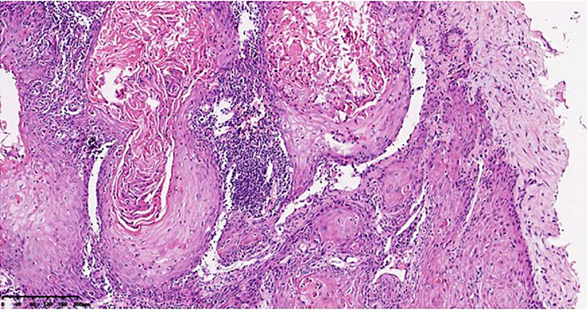
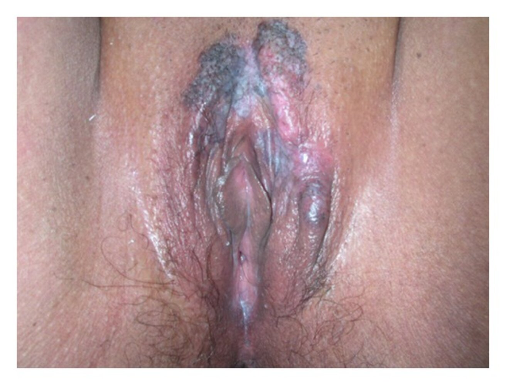
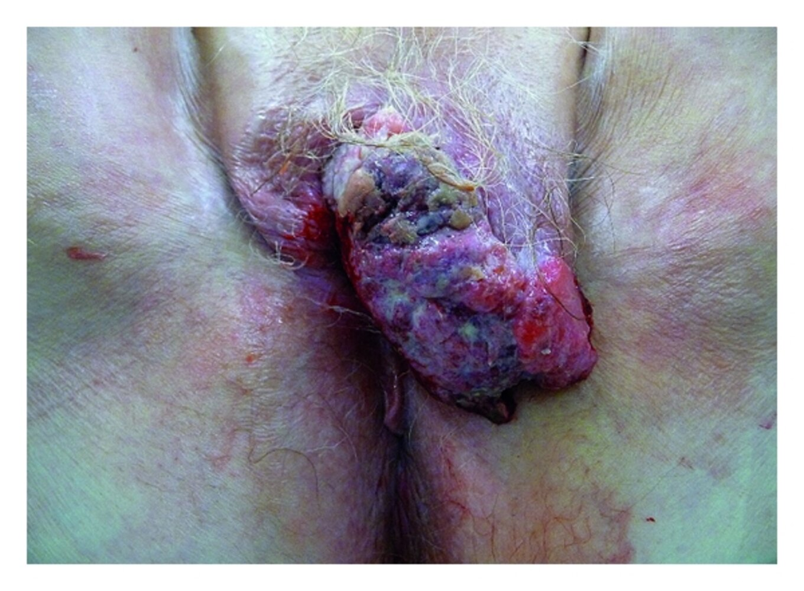
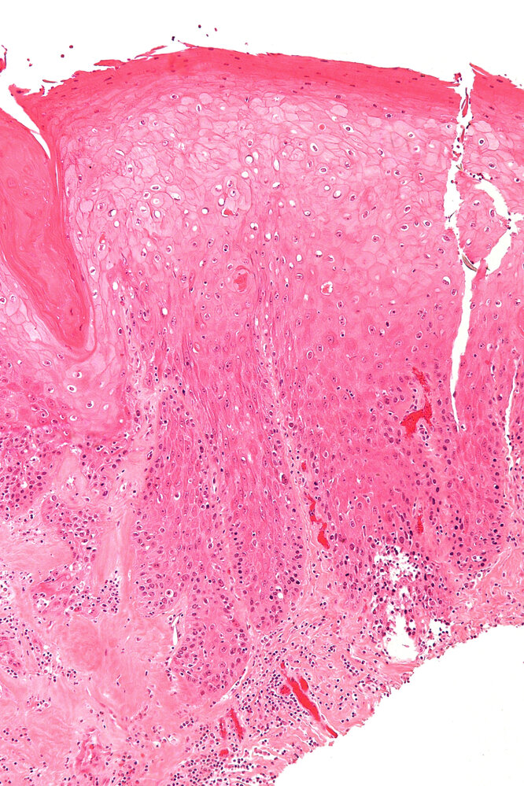
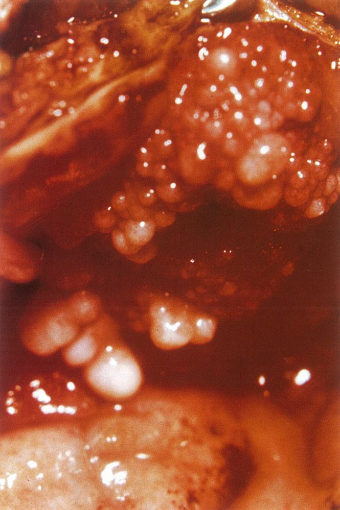
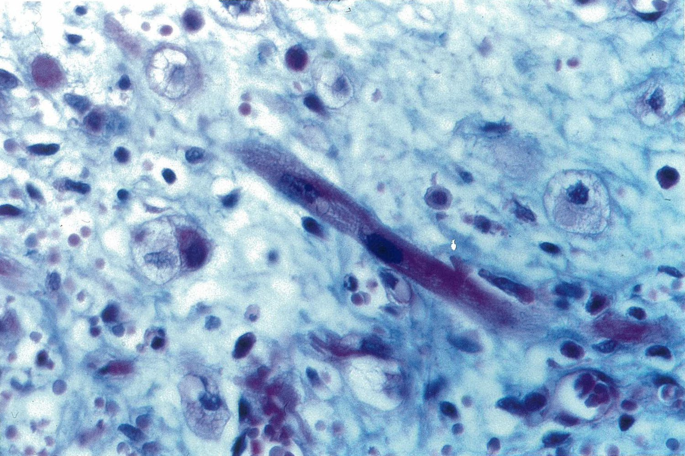

# Vulvar and vaginal cancer

*Categories: Clinical knowledge > Surgery > Gynecologic surgery > Vulvar and vaginal cancer*

[Original Article Link](https://coursology-qbank.com/amboss/article/bO0HIT)

---

## Summary

<u>Vulvar cancer</u> is a rare <u>carcinoma</u> that predominantly occurs after <u>menopause</u>. Major <u>risk factors</u> include <u>HPV infection</u>, smoking, <u>vulvar intraepithelial neoplasia</u>, and <u>cervical intraepithelial neoplasia</u>. Clinical features include local <u>pruritus</u>, <u>plaques</u> or masses, and, less frequently, vulvar bleeding. Suspicious lesions must be biopsied for histological analysis and to rule out differential diagnoses. Imaging studies and clinical evaluation, including a complete <u>pelvic examination</u>, are required for <u>tumor staging</u>. Surgical resection (<u>radical vulvectomy</u>) is the first-line treatment for locoregional disease; advanced stages may require <u>radiotherapy</u> and/or <u>palliative chemotherapy</u>.

<u>Vaginal cancer</u> is closely related to <u>vulvar cancer</u> in terms of etiology and <u>histology</u>, but it occurs inside the <u>vagina</u> (typically the <u>posterior</u> third of the vaginal wall) rather than in the <u>vulva</u>.

---

## Vulvar cancer

### <u>Epidemiology</u> [[1]](https://coursology-qbank.com/amboss/article/aUdQb60)

* <u>Incidence</u>: rare (∼ 0.7% of female cancers) [[1]](https://coursology-qbank.com/amboss/article/aUdQb60)

* Age [[2]](https://coursology-qbank.com/amboss/article/McYM1L)

* <u>HPV</u>-related <u>vulvar cancer</u>: 35–65 years

* Non-<u>HPV</u> related types (e.g., associated with <u>lichen sclerosus</u>): 55–85 years

### <u>Risk factors</u> [[1]](https://coursology-qbank.com/amboss/article/aUdQb60)

* Infection with <u>HPV 16</u>, 18, 31, and 33 [[1]](https://coursology-qbank.com/amboss/article/aUdQb60)

* Precursor lesions, e.g., <u>lichen sclerosus</u>, vulvar or <u>cervical intraepithelial neoplasia</u> (<u>VIN</u>/<u>CIN</u>)

* <u>Tobacco smoking</u>

* <u>Immunosuppression</u>

### Classification [[3]](https://coursology-qbank.com/amboss/article/RUdl160)[[4]](https://coursology-qbank.com/amboss/article/YUdnb60)

* Malignant lesions

* <u>Squamous cell carcinoma</u> (<u>SCC</u>) and subtypes: > 80% of cases [[1]](https://coursology-qbank.com/amboss/article/aUdQb60)

* <u>Verrucous</u> (warty) <u>carcinoma</u>

* Basaloid <u>carcinoma</u>

* Keratinizing <u>carcinoma</u>

* Paget disease of the vulva: an <u>adenocarcinoma</u> characterized by localized <u>pruritus</u> and <u>eczematous</u> lesions (e.g., <u>erythematous</u> patches with white <u>scaling</u>, crusting, <u>ulcerations</u>)

* Other

* <u>Basal cell carcinoma</u>

* <u>Melanoma</u>

* <u>Sarcoma</u>

* <u>Langerhans cell histiocytosis</u>

* Precursor lesions

* Nonneoplastic <u>epithelial</u> disorders (<u>vulvar dermatoses</u>), e.g.:

* <u>Lichen sclerosus</u>

* Squamous cell <u>hyperplasia</u>

* <u>Vulvar intraepithelial neoplasia</u> (<u>VIN</u>)

> [!NOTE]
> Unlike <u>Paget disease of the breast</u>, which is always associated with underlying <u>carcinoma</u>, <u>Paget disease of the vulva</u> has a low likelihood (< 15%) of underlying <u>carcinoma</u>.

Verrucous carcinoma of the vulva

Paget disease of the vulva

### Clinical features [[1]](https://coursology-qbank.com/amboss/article/aUdQb60)[[4]](https://coursology-qbank.com/amboss/article/YUdnb60)

* May initially be asymptomatic

* Local <u>pruritus</u>, possibly with burning sensation and <u>pain</u>

* <u>Plaques</u>, growths of various shapes, often <u>wart</u>-like lesions or <u>ulcers</u>

* Patches of discoloration (reddish, blackish, or whitish)

* Vulvar bleeding or discharge (less common)

* <u>Dysuria</u>, <u>dyspareunia</u>

* Inguinal <u>lymphadenopathy</u>

Vulvar squamous cell carcinoma

### Diagnostics [[1]](https://coursology-qbank.com/amboss/article/aUdQb60)[[4]](https://coursology-qbank.com/amboss/article/YUdnb60)[[5]](https://coursology-qbank.com/amboss/article/0Udeb60)

#### General principles [[1]](https://coursology-qbank.com/amboss/article/aUdQb60)[[4]](https://coursology-qbank.com/amboss/article/YUdnb60)

All suspected <u>vulvar cancer</u> requires specialist consultation (e.g., gynecologic or surgical oncologist).

* <u>Pelvic examination</u> and <u>colposcopy</u>

* <u>Biopsy</u> of all suspicious lesions with histological analysis and <u>tumor grading</u> is necessary for diagnostic confirmation. [[6]](https://coursology-qbank.com/amboss/article/8bdOvo0)

* Additional studies are required for:

* <u>Tumor staging</u> (e.g., <u>FIGO</u> or <u>TNM staging</u>)

* Identification of comorbidities (e.g., <u>HPV</u>, <u>HIV infection</u>)

#### Staging [[1]](https://coursology-qbank.com/amboss/article/aUdQb60)[[4]](https://coursology-qbank.com/amboss/article/YUdnb60)[[5]](https://coursology-qbank.com/amboss/article/0Udeb60)

* <u>Biopsy</u> with histological analysis: all suspicious lesions

* Imaging studies: considered in consultation with a multidisciplinary team 

* <u>MRI</u> <u>pelvis</u>, CT abdomen and chest with IV contrast: to evaluate primary <u>tumor</u> size and local extension

* Chest imaging, <u>FDG-PET/CT scan</u>: to identify distant <u>metastasis</u> if there is local extension (e.g., to the <u>urethra</u>, <u>vagina</u>, <u>bladder</u> <u>mucosa</u>) or <u>lymph node</u> involvement

* <u>Ultrasound</u>, <u>FNA</u>, or <u>core biopsy</u> of inguinofemoral <u>lymph nodes</u>: to identify <u>lymph node</u> involvement

* <u>FIGO</u> or <u>TNM classification</u>: helps establish prognosis and appropriate management

> [!TIP]
> <u>Biopsy</u> is necessary if <u>bladder</u> or rectal involvement is suspected. [[4]](https://coursology-qbank.com/amboss/article/YUdnb60)

#### Identification of comorbidities [[1]](https://coursology-qbank.com/amboss/article/aUdQb60)

* Screening for <u>HPV-related cancers</u> (e.g., cervicovaginal or oropharyngeal) [[1]](https://coursology-qbank.com/amboss/article/aUdQb60)

* <u>Pap smear</u>

* <u>HPV testing</u>

* <u>HIV screening</u> (if <u>HIV</u> status is unknown)

> [!TIP]
> <u>HPV</u>-related vulvar tumors have a higher <u>prevalence</u> of multifocal lesions and concurrent cervical <u>neoplasia</u> compared to <u>HPV</u>-negative tumors. [[5]](https://coursology-qbank.com/amboss/article/0Udeb60)

### Management of vulvar <u>SCC</u> [[1]](https://coursology-qbank.com/amboss/article/aUdQb60)[[4]](https://coursology-qbank.com/amboss/article/YUdnb60)

Therapy is guided by <u>tumor grading</u>, <u>tumor staging</u>, and <u>patient performance status</u> and preferences. [[1]](https://coursology-qbank.com/amboss/article/aUdQb60)

#### Locoregional disease  [[1]](https://coursology-qbank.com/amboss/article/aUdQb60)[[5]](https://coursology-qbank.com/amboss/article/0Udeb60)

* Surgical therapy [[5]](https://coursology-qbank.com/amboss/article/0Udeb60)

* Radical;  or simple partial <u>vulvectomy</u>: first line   [[1]](https://coursology-qbank.com/amboss/article/aUdQb60)

* Surgical <u>sentinel lymph node biopsy</u> (<u>SLNB</u>): to determine the need for <u>lymphadenectomy</u> in selected patients  [[1]](https://coursology-qbank.com/amboss/article/aUdQb60)[[5]](https://coursology-qbank.com/amboss/article/0Udeb60)

* Inguinofemoral <u>lymphadenectomy</u> is recommended in: [[1]](https://coursology-qbank.com/amboss/article/aUdQb60)[[5]](https://coursology-qbank.com/amboss/article/0Udeb60)

* Positive <u>SLNB</u>

* Tumors ≥ 4 cm [[5]](https://coursology-qbank.com/amboss/article/0Udeb60)

* Multifocal invasive disease

* Post-treatment reconstructive <u>surgery</u> should be offered. [[5]](https://coursology-qbank.com/amboss/article/0Udeb60)

* <u>Radiotherapy</u> (RT): alone, post-surgical, or with <u>chemotherapy</u>   [[4]](https://coursology-qbank.com/amboss/article/YUdnb60)

* Vulvar RT: if surgical therapy is not feasible or if there are positive <u>surgical margins</u> after excision [[4]](https://coursology-qbank.com/amboss/article/YUdnb60)

* Inguinofemoral RT: may be considered for inguinofemoral <u>metastases</u>

> [!TIP]
> Vulvar RT is a third-line option due to associated significant <u>morbidity</u> (e.g., vaginal stenosis, <u>pain</u>, vulvar <u>atrophy</u>). [[1]](https://coursology-qbank.com/amboss/article/aUdQb60)

#### <u>Metastatic</u> disease  [[1]](https://coursology-qbank.com/amboss/article/aUdQb60)[[4]](https://coursology-qbank.com/amboss/article/YUdnb60)

Treatment is primarily palliative. Options include:

* <u>Chemoradiotherapy</u>: <u>platinum</u>-based regimens (e.g., <u>cisplatin</u>) ± anti-<u>PD-1</u> <u>antibodies</u> ± <u>bevacizumab</u> [[1]](https://coursology-qbank.com/amboss/article/aUdQb60)

* <u>Radiation therapy</u> alone

* Surgical resection of large lesions

> [!TIP]
> High-quality evidence for <u>chemotherapy</u> regimens to treat <u>vulvar cancer</u> is lacking. [[4]](https://coursology-qbank.com/amboss/article/YUdnb60)

#### <u>Supportive care</u>

* <u>HPV vaccination</u> reduces recurrence rates after surgical therapy.  [[1]](https://coursology-qbank.com/amboss/article/aUdQb60)

* Pretreatment counseling should be offered to patients receiving <u>chemoradiotherapy</u>.

* A <u>multidisciplinary care</u> team is required for the management of complications. [[1]](https://coursology-qbank.com/amboss/article/aUdQb60)

### Complications [[1]](https://coursology-qbank.com/amboss/article/aUdQb60)

Complications may include:

* <u>Urinary incontinence</u>

* <u>Lymphedema</u>

* <u>Sexual dysfunction</u>

* Reduced quality of life

* <u>Anxiety disorders</u> and <u>mood disorders</u>

### Prognosis [[4]](https://coursology-qbank.com/amboss/article/YUdnb60)

* Operable tumors without <u>lymph node</u> involvement: 90% overall survival [[4]](https://coursology-qbank.com/amboss/article/YUdnb60)

* <u>Lymph node</u> involvement: ∼ 50% overall survival [[4]](https://coursology-qbank.com/amboss/article/YUdnb60)

* Distant <u>metastatic</u> disease: ∼ 20% overall 5-year survival [[1]](https://coursology-qbank.com/amboss/article/aUdQb60)

> [!TIP]
> <u>Lymph node</u> involvement is the most important factor in determining prognosis. [[4]](https://coursology-qbank.com/amboss/article/YUdnb60)

---

## Precursor lesions

### Vulvar dermatoses

<u>Vulvar dermatoses</u> are not inherently precancerous, but some (e.g., <u>lichen sclerosus</u>) do increase the risk of <u>squamous cell carcinoma</u>.

* Subtypes

* <u>Lichen sclerosus</u>: <u>epidermal</u> <u>atrophy</u> and loss of vulvar architecture

* <u>Lichen simplex chronicus</u>: squamous cell <u>hyperplasia</u>

* Other dermatoses, e.g., <u>genital lichen planus</u> (<u>hypertrophied</u> <u>skin</u> with purple lesions)

* Etiology: unclear

* <u>Epidemiology</u>: <u>postmenopausal</u> women and, less commonly, prepubescent girls

* Clinical features

* Parchment-like, thin, shiny vulvar <u>skin</u>

* Narrow, <u>atrophic</u> vaginal introitus resulting in <u>dyspareunia</u>

* Burning <u>pain</u>, <u>pruritus</u>, bleeding vulvar <u>ulcers</u>

* <u>Lichen simplex chronicus</u> is characterized by chronic <u>pruritus</u>, which provokes persistent scratching of the <u>vulva</u> and so causes <u>lichenification</u> of the <u>skin</u>.

* Diagnosis: <u>Colposcopy</u> and <u>biopsy</u> of suspicious lesions are required to rule out <u>malignancy</u>.

* <u>Histology</u>

* <u>Epidermal</u> <u>atrophy</u>, localized <u>hyperkeratosis</u>, degeneration of the <u>basement membrane</u>

* Loss of collagenous and elastic <u>connective tissue</u>

* Presence of an inflammatory infiltrate

* Therapy

* Without atypical cellular morphology: local therapy with <u>glucocorticoid</u>-containing creams

* In the event of <u>malignancy</u>: surgical resection of the lesion

### Vulvar intraepithelial neoplasia (<u>VIN</u>)

* Definition: precancerous lesion caused by <u>dysplasia</u> of squamous cells

* Classification [[7]](https://coursology-qbank.com/amboss/article/GiXBGB)

* <u>VIN</u>, usual type (most common)

* Associated with <u>HPV</u>

* Commonly multifocal

* <u>VIN</u>, differentiated type 

* Associated with <u>lichen sclerosus</u> and other dermatoses

* Commonly unifocal

* <u>VIN</u>, unclassified type

* Diagnosis: tissue <u>biopsy</u>

* Treatment: : depending on severity, excision or <u>ablation</u> may become necessary

* Prognosis: may progress to <u>vulvar carcinoma</u> despite treatment (in < 10% of cases)

Differentiated vulvar intraepithelial neoplasia

---

## Vaginal cancer

### Overview

* Localization: The upper third of the <u>posterior</u> vaginal wall is the most common site of <u>vaginal carcinoma</u>.

* Etiology: same as vulvar <u>neoplasia</u> (e.g., <u>HPV 16</u> and 18)

### Classification

* <u>Squamous cell carcinoma</u> 

* Most common type

* Usually occurs secondary to cervical <u>squamous cell carcinoma</u>, primary <u>carcinoma</u> is rare

* <u>Clear cell</u> <u>adenocarcinoma</u>

* Usually occurs secondary to vaginal adenosis (the presence of glandular <u>columnar epithelium</u> within the upper two-thirds of the vaginal wall)

* Seen in daughters of women who received <u>diethylstilbestrol</u> during <u>pregnancy</u>

* Sarcoma botryoides [[8]](https://coursology-qbank.com/amboss/article/CXbqZs)

* Rare, highly malignant <u>embryonal rhabdomyosarcoma</u> that arises most commonly, but not exclusively in the genitourinary system

* <u>Epidemiology</u>: peak <u>incidence</u> in childhood (< 4 years) [[9]](https://coursology-qbank.com/amboss/article/xXbEZs)

* Pathology

* Gross: clear, polypoid masses that resemble a bunch of grapes protruding through the <u>vagina</u>

* Microscopy: <u>pleomorphic</u> spindle-shaped cells

* <u>Immunohistochemical</u> staining: <u>desmin</u> positive

Verrucous carcinoma of the vulva

Sarcoma botryoides

Sarcoma botryoides

### Clinical features

* <u>Vaginal bleeding</u>

* <u>Leukoplakia</u>, vaginal <u>ulceration</u> with contact bleeding

* Malodorous discharge

* Possibly <u>urinary frequency</u>

### Diagnosis

* <u>Pelvic examination</u>

* <u>Colposcopy</u>: if abnormal <u>cytology</u> results without a clearly visible lesion during <u>pelvic examination</u>

* <u>Biopsy</u> of mass to determine <u>histopathology</u>

### Treatment

* <u>Radiotherapy</u>

* Indicated in <u>squamous cell carcinomas</u>

* Preserves external genitalia

* Surgical therapy

> [!NOTE]
> Senile <u>vaginitis</u> should also be considered in patients presenting with vaginal <u>pruritus</u>, burning, and <u>pain</u>.

---