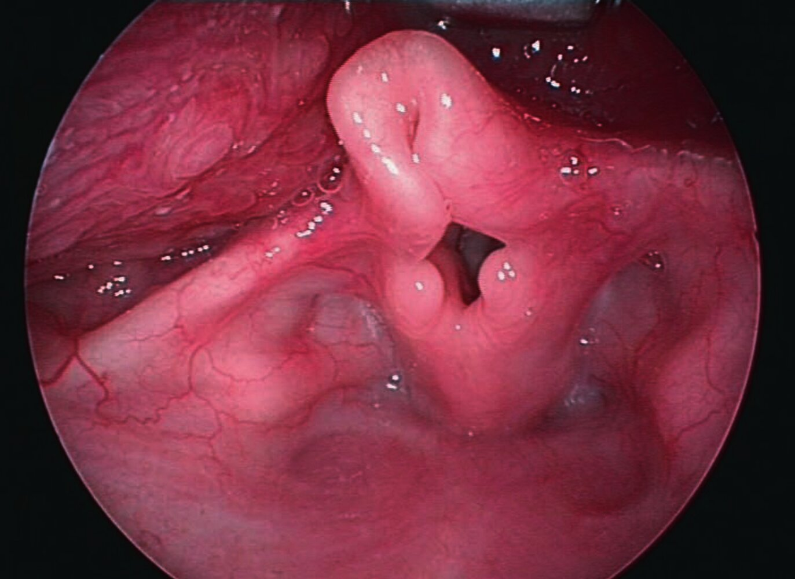
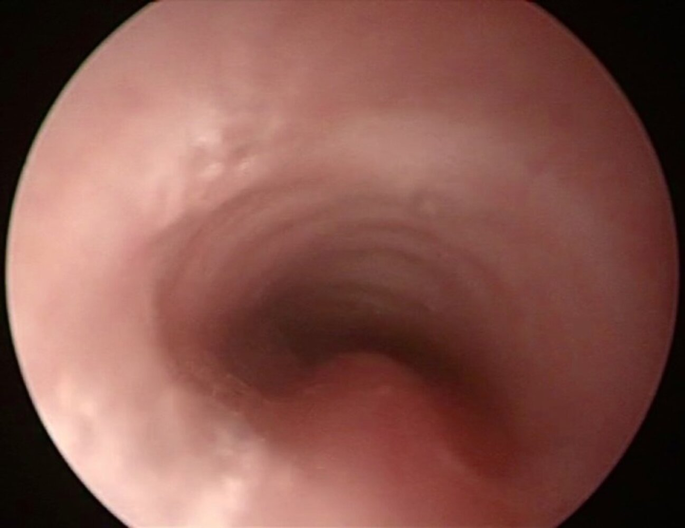

# Airway malacias

*Categories: Clinical knowledge > Surgery > Head and neck surgery > Airway malacias*

[Original Article Link](https://coursology-qbank.com/amboss/article/lF0vR3)

---

## Summary

<u>Airway</u> malacias are a group of conditions characterized by softening or weakening of the <u>airway</u> <u>cartilage</u> resulting in increased collapsibility of the <u>larynx</u>, <u>trachea</u>, and/or <u>bronchi</u>, which can cause respiratory symptoms. <u>Laryngomalacia</u> refers to the congenital weakening of the laryngeal <u>cartilage</u> and is the most common type of <u>airway</u> malacia. <u>Tracheomalacia</u> refers to the weakening of the <u>tracheal</u> <u>cartilage</u> or <u>posterior</u> membrane and can be congenital (often in association with other congenital syndromes) or acquired. Visualization of the <u>airway</u> (e.g., <u>laryngoscopy</u>, <u>bronchoscopy</u>) is the test of choice to diagnose <u>airway</u> malacias. Management of asymptomatic patients or patients with mild symptoms is conservative. Patients with severe symptoms generally require <u>surgery</u>.

---

## Laryngomalacia

### Definition

* Collapse of <u>supraglottic</u> structures during inspiration due to anatomical and/or functional abnormalities

### <u>Epidemiology</u> [[2]](https://coursology-qbank.com/amboss/article/as1QtR0)

* Most common cause of congenital <u>stridor</u> (cause of <u>stridor</u> in 45–75% <u>infants</u>)

* Most common congenital anomaly of the <u>larynx</u>

### Etiology

* Almost always congenital

* Most likely due to an underdeveloped nervous system

### Pathophysiology

* Congenital abnormality of laryngeal <u>cartilage</u> → ↑ laxity and collapse of <u>supraglottic</u> structures during inspiration → <u>airway obstruction</u>

### Clinical features

* Symptoms typically begin within the first 2 months of life and peak at 6–8 months.

* <u>Inspiratory stridor</u>: worsens in the <u>supine position</u>, during crying, <u>upper respiratory tract infections</u>, <u>agitation</u>, and feeding

* Feeding difficulties (e.g., <u>regurgitation</u>, emesis)

* Approx. 60% of affected children have concomitant <u>GERD</u>  [[3]](https://coursology-qbank.com/amboss/article/e1Wxf40)

* Severe course: <u>failure to thrive</u>, <u>obstructive sleep apnea</u>, <u>cyanosis</u>

### Diagnostics

* <u>Flexible laryngoscopy</u> (<u>gold standard</u>)

* Direct visualization of the <u>airway</u>

* Collapse of <u>supraglottic</u> structures during inspiration and an omega-shaped <u>epiglottis</u>.   [[4]](https://coursology-qbank.com/amboss/article/Oa1Ik20)

* Clinical <u>correlation</u> is required to establish a diagnosis of <u>laryngomalacia</u>.

### Treatment

* Reassurance and monitoring in mild cases (approx. 90% of cases resolve by two years of age)

* <u>Acid suppression therapy</u> (e.,g, <u>PPI</u>, <u>histamine receptor blockers</u>) for patients with <u>symptoms of GERD</u>

* Speech and swallow therapy

* Ensure appropriate weight gain

* Supraglottoplasty in severe cases

Omega-shaped epiglottis

---

## Tracheomalacia

### Definition

* A structural abnormality involving softening or weakening of the <u>tracheal</u> <u>cartilage</u> and/or <u>posterior</u> membrane that results in excessive <u>tracheal</u> collapsibility.

* When the <u>bronchi</u> are also affected, the condition is called “<u>tracheobronchomalacia</u>” (isolated <u>bronchomalacia</u> is extremely rare).

### <u>Epidemiology</u> [[5]](https://coursology-qbank.com/amboss/article/hXWcBP0)

* Most common congenital <u>tracheal</u> abnormality (<u>incidence</u>: approx. 1 in 2100 <u>live births</u>)

* Acquired form is more common than congenital one

### Etiology

* Congenital (primary)

* <u>Idiopathic</u>

* <u>Cartilage</u> abnormalities (e.g., polychondritis, <u>Ehlers-Danlos syndrome</u>)

* Underdeveloped respiratory tract (e.g., <u>prematurity</u>, <u>bronchopulmonary dysplasia</u>)

* Associated with congenital syndromes (e.g., <u>trisomy 21</u>) and/or <u>birth</u> defects (e.g., <u>tracheoesophageal fistula</u>)

* Acquired (secondary)

* <u>Tracheal</u> trauma (e.g., prolonged <u>intubation</u>, tracheotomy, chest trauma)

* <u>Airway</u> inflammation (e.g., chronic infections, tracheobronchitis)

* External compression (e.g., vascular abnormalities, tumors)

### Pathophysiology

* Structural <u>weakness</u> of the <u>tracheal</u> <u>cartilage</u> and/or <u>posterior</u> membrane → excessive collapsibility of the <u>trachea</u> during expiration (due to ↑ intrathoracic pressure) → <u>airway obstruction</u>

### Clinical features

* Clinical findings differ between <u>infants</u> and adults regardless of the etiology (i.e., congenital or acquired).

* Symptoms may be exacerbated by increased intrathoracic pressure or respiratory effort (e.g., <u>Valsalva maneuvers</u>, forced expiration, crying, <u>coughing</u>) and respiratory infections.

* The intrathoracic <u>trachea</u> is most frequently affected (extrathoracic and cervical <u>tracheomalacia</u> are rare).

* In pediatric patients, symptoms usually appear during the first 2–3 months of age.

#### Children

* <u>Expiratory stridor</u>

* Barking <u>cough</u>

* Noisy breathing

* <u>Wheezing</u>

* <u>Cyanosis</u>

* <u>Respiratory distress</u>

* Spontaneous hyperextension of the neck

#### Adults

* <u>Dyspnea</u>

* <u>Cough</u>

* Increased <u>sputum</u> production

* <u>Hemoptysis</u>

### Diagnostics

* Diagnostic tests

* <u>Bronchoscopy</u> (<u>gold standard</u>)

* <u>Flexible bronchoscopy</u> is preferred

* Direct visualization of the <u>airway</u>

* Decrease in <u>airway</u> lumen size and loss of semicircular shape

* Dynamic <u>airway</u> <u>CT scan</u>: <u>tracheal</u> narrowing

* Additional tests

* Chest <u>x-ray</u>: may show underlying abnormalities (e.g., structural compression)

* <u>Pulmonary function tests</u>: obstructive pattern

Tracheomalacia

### Treatment

* Asymptomatic or mild <u>tracheomalacia</u>: observation and reassurance

* Symptomatic <u>tracheomalacia</u>

* Treat underlying causes (e.g., <u>airway</u> inflammation) and coexisting conditions (e.g., <u>COPD</u>)

* <u>Supportive care</u> (e.g., <u>ipratropium bromide</u>, respiratory <u>physiotherapy</u>)

* Continuous <u>positive pressure ventilation</u> (if <u>conservative measures</u> fail)

* <u>Tracheal stenting</u>

* Surgical repair (e.g., tracheobronchoplasty)

---