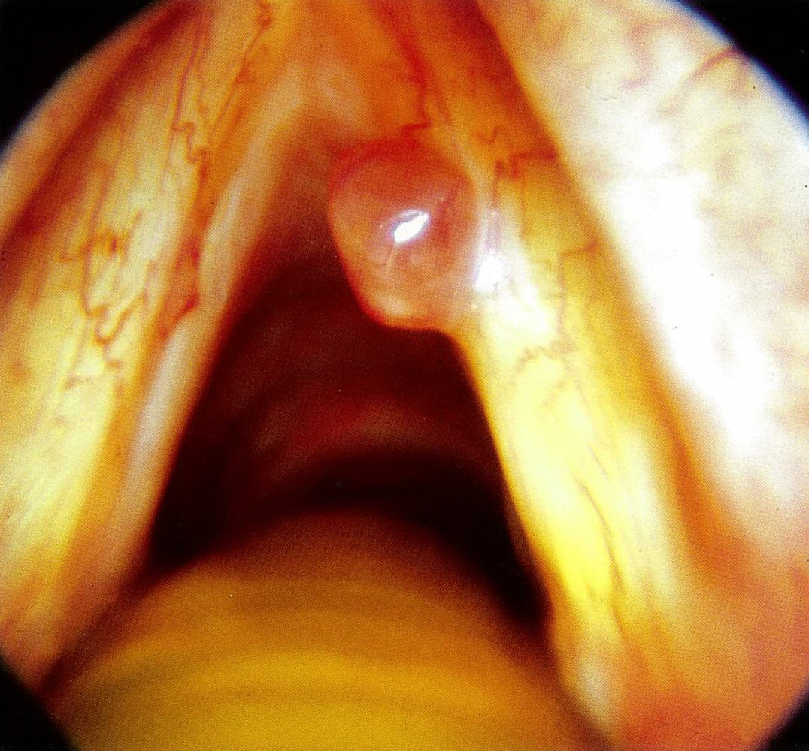
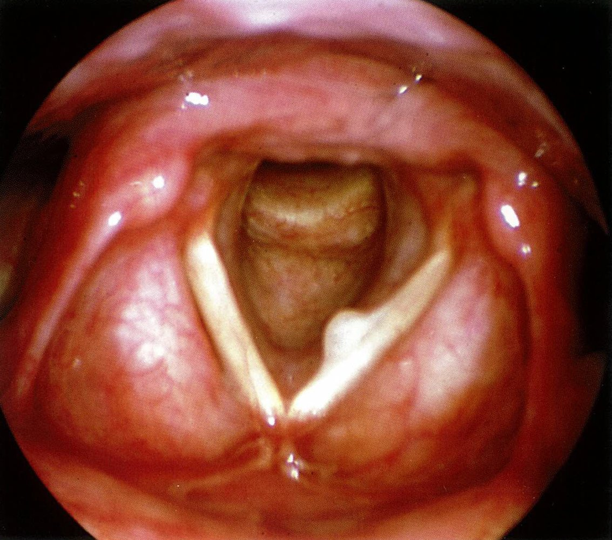
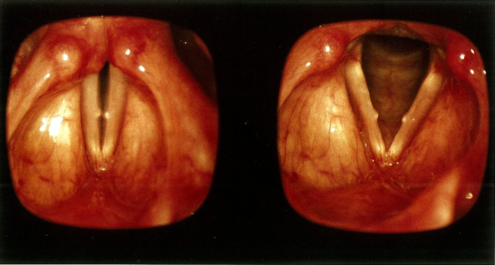
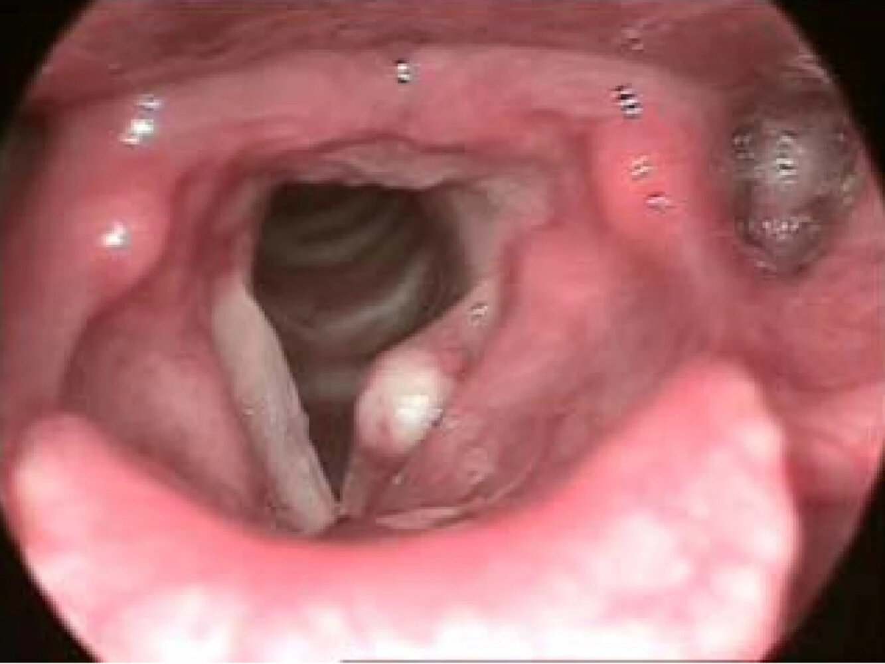
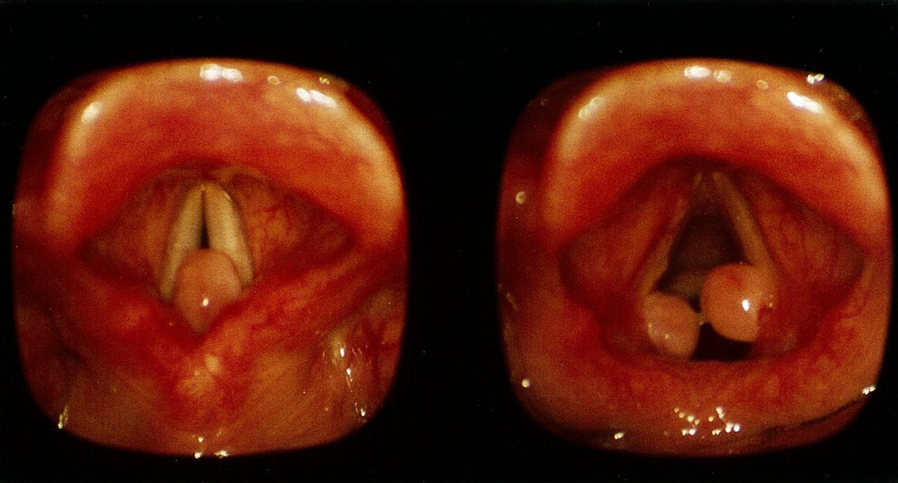
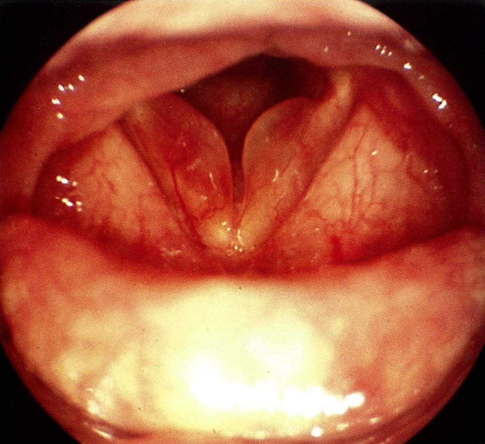
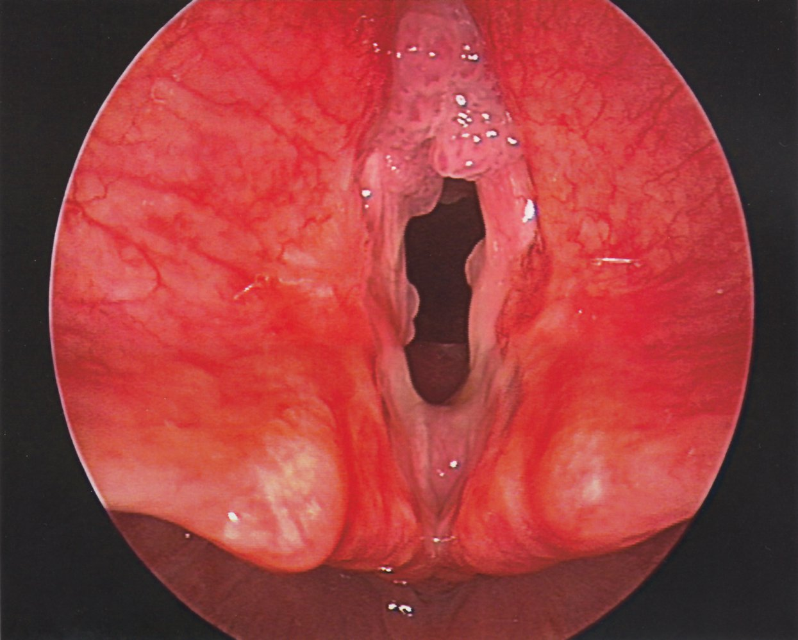
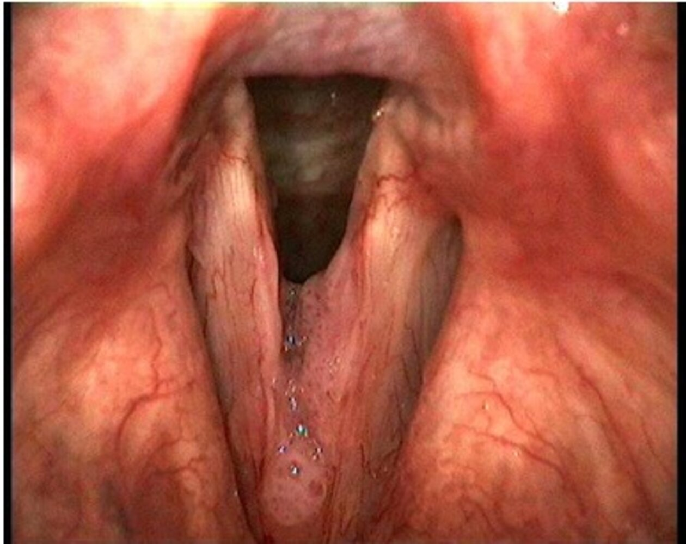

# Benign laryngeal lesions

*Categories: Clinical knowledge > Surgery > Head and neck surgery > Benign laryngeal lesions*

[Original Article Link](https://coursology-qbank.com/amboss/article/zj0r1T)

---

## Summary

Common benign lesions of the <u>larynx</u> include <u>vocal fold polyps</u>, <u>vocal fold nodules</u>, <u>vocal fold cysts</u>, <u>vocal fold granulomas</u>, <u>Reinke edema</u>, and <u>laryngeal papillomatosis</u>. Most of these lesions develop as a consequence of chronic irritation of the <u>vocal cords</u> (e.g., smoking, voice overuse, <u>GERD</u>), while <u>laryngeal papillomatosis</u> is caused by <u>HPV</u>. The cardinal symptom of these conditions is <u>hoarseness</u>. <u>Laryngoscopy</u> with or without <u>biopsy</u> is usually indicated for diagnosis. Management depends on the clinical findings and includes <u>conservative management</u> of underlying causes (e.g., <u>smoking cessation</u>, vocal rest) and surgical approaches. <u>Laryngeal papillomatosis</u>, <u>leukoplakia</u>, and <u>pachyderma</u> are all lesions of the <u>larynx</u> that are considered precancerous.

---

## Vocal fold polyp

* Definition: benign lesion that develops in response to <u>vocal fold</u> irritation in the <u>anterior</u> one-third of the <u>vocal fold</u>

* <u>Epidemiology</u>

* Most common benign lesion of the <u>vocal cords</u>

* Peak <u>incidence</u> between 30 and 50 years

* <u>♂</u> > <u>♀</u>

* Etiology

* Voice overuse (e.g., teachers, professional singers)

* Smoking, <u>GERD</u>

* <u>Anticoagulant</u> use

* Clinical features: low-pitched, whispery voice; <u>hoarseness</u> [[1]](https://coursology-qbank.com/amboss/article/jAX_j00)

* Diagnostics: <u>laryngoscopy</u> 

* Unilateral spherical lesion

* Located at the junction of the <u>anterior</u> one-third and <u>posterior</u> two-thirds of the <u>vocal folds</u>

* Pathology: fluid and <u>fibrin</u> filled lesion in the <u>superficial</u> <u>lamina propria</u> of the <u>vocal fold</u>

* Management: microsurgical removal

Vocal fold polyp

Vocal cord polyp

---

## Vocal fold nodule

* Definition: benign lesion that are caused by frequent microtrauma (e.g., voice overuse) to the <u>vocal cords</u>, which leads to <u>edematous</u> swelling and development of <u>fibrotic</u> scars

* <u>Epidemiology</u>

* Peak <u>incidence</u> between 20 and 50 years

* Most common cause of persistent <u>hoarseness</u> in school-aged children

* <u>♀</u> > <u>♂</u>

* Etiology: voice overuse (e.g., teachers, professional singers) or abuse (e.g., children who scream/cry a lot)

* Pathophysiology: microtrauma to the <u>vocal cords</u> → <u>edematous</u> swelling → <u>fibrotic</u> <u>scar</u> (<u>vocal fold nodule</u>) of the <u>superficial</u> <u>lamina propria</u>

* Clinical features: low-pitched, whispery voice; <u>hoarseness</u>, altered vocal range  [[1]](https://coursology-qbank.com/amboss/article/jAX_j00)

* Diagnostics: <u>laryngoscopy</u> 

* Bilateral lesions at the junction of the <u>anterior</u> one-third and <u>posterior</u> two-thirds of the <u>vocal folds</u>

* Symmetric, pinhead-sized, pale <u>nodules</u>

* Variable color, contour, and/or shape

* Management 

* <u>Conservative management</u>: treat underlying cause

* Vocal rest and voice therapy

* <u>Treatment of GERD</u>

* <u>Smoking cessation</u>

* <u>Vocal fold</u> <u>steroid</u> or <u>botulinum toxin</u> injection

* Microsurgical removal in persistent or severe cases

* Prognosis: good prognosis (especially in children and <u>adolescents</u>) with appropriate treatment

Vocal cord nodules

---

## Vocal fold cyst

* Definition: benign, sac-like structure in the <u>lamina propria</u> of the <u>vocal cords</u> due to obstruction of mucus-secreting glands

* <u>Epidemiology</u>: Occurs in all ages; often in children

* Etiology: obstruction of laryngeal mucus-secreting glands

* Retention cysts: obstruction caused by inflammation due to high vocal <u>stress</u> (e.g., occupational)

* <u>Epidermoid cysts</u>: obstruction caused by congenital anomaly or secondary to a vocal trauma
* In children: typically a congenital anomaly

* Classification:

* Retention or <u>epidermoid cyst</u>

* Intracordal or saccular cyst

* Clinical features

* Intracordal cyst: <u>hoarseness</u>

* Saccular cyst: <u>airway obstruction</u>, voice change

* Diagnostics: <u>laryngoscopy</u> typically shows unilateral yellow-white lesion with distinct border 

* Saccular cyst: <u>supraglottic</u> mass

* Intracordal cyst: middle third of the <u>vocal cord</u> associated with an area of <u>hyperkeratosis</u> on the opposite cord

* Treatment: microsurgical removal

Vocal cord cyst

---

## Vocal fold granuloma

* Definition: lesion on both <u>vocal folds</u> caused by trauma (e.g., <u>endotracheal intubation</u>) and subsequent inflammation and <u>ulceration</u>

* <u>Epidemiology</u>: <u>♂</u> > <u>♀</u>

* Etiology: trauma to the <u>vocal cords</u>

* <u>Endotracheal intubation</u>

* Voice overuse (e.g., teachers, professional singers)

* <u>Chronic cough</u>

* <u>GERD</u>

* Clinical features: <u>hoarseness</u>, <u>cough</u>

* Diagnostics: <u>laryngoscopy</u> with <u>biopsy</u> to exclude cancerous cells or <u>tuberculosis</u> 

* Mostly bilateral lesion

* Mushroom-shaped appearance of the <u>granulomas</u>, whitish shimmering <u>fibrin</u> coating

* Located in the <u>dorsal</u> third of <u>vocal folds</u>, adjacent to the arytenoids

* Pathology: usually <u>ulceration</u> → <u>granuloma</u>

* Management

* <u>Conservative management</u>: treat underlying cause

* Vocal rest and voice therapy

* <u>Treatment of GERD</u>

* <u>Smoking cessation</u>

* Microsurgical removal: if symptoms persist or <u>malignancy</u> is suspected

Intubation granuloma

---

## Reinke edema

* Definition: a benign buildup of fluid in the <u>superficial</u> <u>lamina propria</u> of the <u>true vocal cords</u> caused by <u>chronic inflammation</u> and irritation secondary to smoking

* <u>Epidemiology</u>: <u>♀</u> > <u>♂</u>

* Etiology [[2]](https://coursology-qbank.com/amboss/article/PAXWP00)

* Major <u>risk factor</u>: smoking

* Minor <u>risk factors</u>

* Voice overuse (e.g., teachers, professional singers)

* <u>Allergy</u>

* Chronic <u>URIs</u>

* <u>GERD</u>

* Clinical features: <u>hoarseness</u>; low-pitched, rough voice ; vocal fatigue

* Diagnostics: <u>laryngoscopy</u> shows bilateral swelling of the <u>true vocal cords</u>

* Pathology: <u>edema</u> within the <u>superficial</u> <u>lamina propria</u> between the <u>epithelium</u> and <u>vocal ligament</u> (Reinke's space) [[2]](https://coursology-qbank.com/amboss/article/PAXWP00)

* Management [[3]](https://coursology-qbank.com/amboss/article/4AX3P00)

* Controlling <u>risk factors</u>

* <u>Smoking cessation</u>

* Reflux management

* Avoidance of voice overuse

* Restoring normal voice function

* Voice therapy

* Microsurgical removal in cases in which voice function is dissatisfactory despite <u>conservative treatment</u>

Reinke's edema

> [!TIP]
> Significant smoking history is also a <u>risk factor</u> for <u>vocal fold</u> <u>leukoplakia</u> and <u>laryngeal cancer</u>, so it is important to clearly visualize the <u>vocal cords</u> during diagnosis of <u>Reinke edema</u> and evaluate for other lesions in the area as well.

---

## Laryngeal papillomatosis

* Definition: <u>benign tumor</u> of the laryngeal <u>stratified</u> <u>squamous epithelium</u> caused by <u>human papillomavirus</u> (<u>HPV</u>) infection of the throat

* Classification

* Juvenile onset recurrent respiratory papillomatosis (JORRP): < 20 years of age
* Peak onset < 5 years of age

* Adult onset recurrent respiratory papillomatosis (AORRP)

* Etiology: <u>HPV infection</u> (especially HPV6 and HPV11; followed by <u>HPV</u> subtypes 16, 18, 31, and 33) [[4]](https://coursology-qbank.com/amboss/article/qZcCca0)

* In children: usually due to <u>vertical transmission</u> during <u>birth</u>

* In adults: potentially via <u>sexual activity</u> or reactivation of the dormant <u>virus</u>

* Clinical features: disease extent is highly variable

* <u>Hoarseness</u>, <u>dysphonia</u>/aphonia

* <u>Stridor</u>, <u>chronic cough</u>, <u>dyspnea</u> due to <u>airway obstruction</u>

* <u>Dysphagia</u> in advanced disease

* Diagnostics: <u>laryngoscopy</u> 

* Multiple raspberry-like swellings

* Usually located on <u>vocal cords</u>

* Can be unilateral or bilateral

* Management: no definitive cure, goal is to limit disease spread

* Surgical removal (e.g., microdebridement, carbon dioxide lasers) of symptomatic lesions

* Potentially <u>adjuvant treatment</u> with antivirals (e.g., <u>acyclovir</u>, <u>ribavirin</u>, <u>cidofovir</u>)

* Complications

* Malignant transformation into <u>squamous cell carcinoma</u> in up to 4% of cases [[5]](https://coursology-qbank.com/amboss/article/rZcf1a0)

* <u>Airway obstruction</u> and life-threatening <u>respiratory distress</u>

* Prognosis

* Frequently recurring

* Often regresses spontaneously in <u>puberty</u>

> [!TIP]
> Papillomas that remain till adulthood are potential precancerous lesions. Although it rarely occurs, papillomas can undergo malignant transformation and become <u>squamous cell carcinoma</u>.

Laryngeal papillomatosis

Laryngeal papillomatosis

---

## Precancerous lesions of the larynx

* <u>Laryngeal papillomatosis</u>: <u>squamous cell carcinoma</u> in up to 4% of cases [[5]](https://coursology-qbank.com/amboss/article/rZcf1a0)

* <u>Leukoplakia</u>: <u>hyperkeratosis</u> of the <u>epithelium</u> and <u>mucous membranes</u> that most commonly affects the <u>oral cavity</u>

* High risk of malignant transformation into <u>laryngeal cancer</u> (up to 20% within 5 years of diagnosis) [[6]](https://coursology-qbank.com/amboss/article/pZcLca0)

* See “<u>Leukoplakia</u>” for details.

* Pachyderma: rough and/or thickened <u>mucosa</u> that may be accompanied by swelling

* Associated with <u>GERD</u> or chronic bacterial infection, as well as some cancers and pachydermoperiostosis

* Malignant transformation into <u>laryngeal cancer</u> is possible

---

## Differential diagnoses

| Differential diagnoses of benign laryngeal lesions |  |  |  |  |  |  |
| --- | --- | --- | --- | --- | --- | --- |
|  | <u>Epidemiology</u> | Etiology | Clinical features | <u>Laryngoscopy</u> |  |  |
| Localization |  | Morphology |  |  |  |  |
|  <u>Vocal fold polyp</u>   |   * Peak <u>incidence</u> 30–50 years  * Sex: <u>♂</u> > <u>♀</u>  * Most common benign lesion in <u>vocal folds</u>    |   * Voice overuse (e.g., teachers, professional singers)  * Smoking, <u>GERD</u>    |   * <u>Hoarseness</u>  * Low-pitched, whispery voice    |  * Unilateral   |  * Junction of the <u>anterior</u> one-third and <u>posterior</u> two-thirds of the <u>vocal folds</u>   |  * Spherical lesion   |
|  <u>Vocal fold cyst</u>   |  * Peak <u>incidence</u>: primarily children (2–4 years)   |  * Obstruction of mucus-secreting glands caused by congenital anomaly   |   * <u>Hoarseness</u>, voice change  * <u>Airway obstruction</u>    |   * Saccular cyst: <u>supraglottic</u> mass  * Intracordal cyst: middle third of the <u>vocal cord</u> associated with an area of <u>hyperkeratosis</u> on the opposite cord    |  * Yellow-white lesion with distinct border   |  |
|  <u>Reinke edema</u>   |  * Sex: <u>♀</u> > <u>♂</u>   |  * Smoking   |   * <u>Hoarseness</u>  * Low-pitched, rough voice    |  * Bilateral   |  * <u>True vocal cords</u>   |  * <u>Edema</u>   |
|  <u>Vocal fold nodules</u>   |   * Peak <u>incidence</u> 15–45 years  * Sex: <u>♀</u> > <u>♂</u>  * Most common cause of persistent <u>hoarseness</u> in children    |  * Voice overuse (e.g., teachers, professional singers) or abuse (screaming children)   |   * <u>Hoarseness</u> that increases with overuse of the voice  * Low-pitched, whispery voice    |  * Junction of the <u>anterior</u> one-third and <u>posterior</u> two-thirds of the <u>vocal folds</u>   |   * Symmetric, pinhead-sized, pale <u>nodules</u>  * Variable color, contour, and/or shape    |  |
|  <u>Vocal fold granulomas</u>   |  * Sex: <u>♂</u> > <u>♀</u>   |   * <u>Endotracheal intubation</u>  * <u>GERD</u>  * Voice overuse    |   * <u>Hoarseness</u>  * <u>Cough</u>    |  * <u>Dorsal</u> third of <u>vocal folds</u>, adjacent to the arytenoids   |   * Mushroom-shaped  * Whitish shimmering <u>fibrin</u> coating    |  |
|  <u>Laryngeal papillomatosis</u>   |   * Juvenile onset: peak onset < 5 years of age  * Adult onset: peaks at 20–40 years    |   * <u>HPV infection</u> (especially HPV6 and HPV11; followed by <u>HPV</u> subtypes 16, 18, 31, and 33)  * In children: due to <u>vertical transmission</u> during <u>birth</u>    |   * <u>Hoarseness</u>, <u>dysphonia</u>/aphonia  * <u>Stridor</u>, <u>chronic cough</u>, <u>dyspnea</u> due to <u>airway obstruction</u>    |  * Unilateral or bilateral   |   * Variable  * Usually involves <u>vocal cords</u>    |  * Papillomas: usually multiple raspberry-like swellings   |

The differential diagnoses listed here are not exhaustive.

---