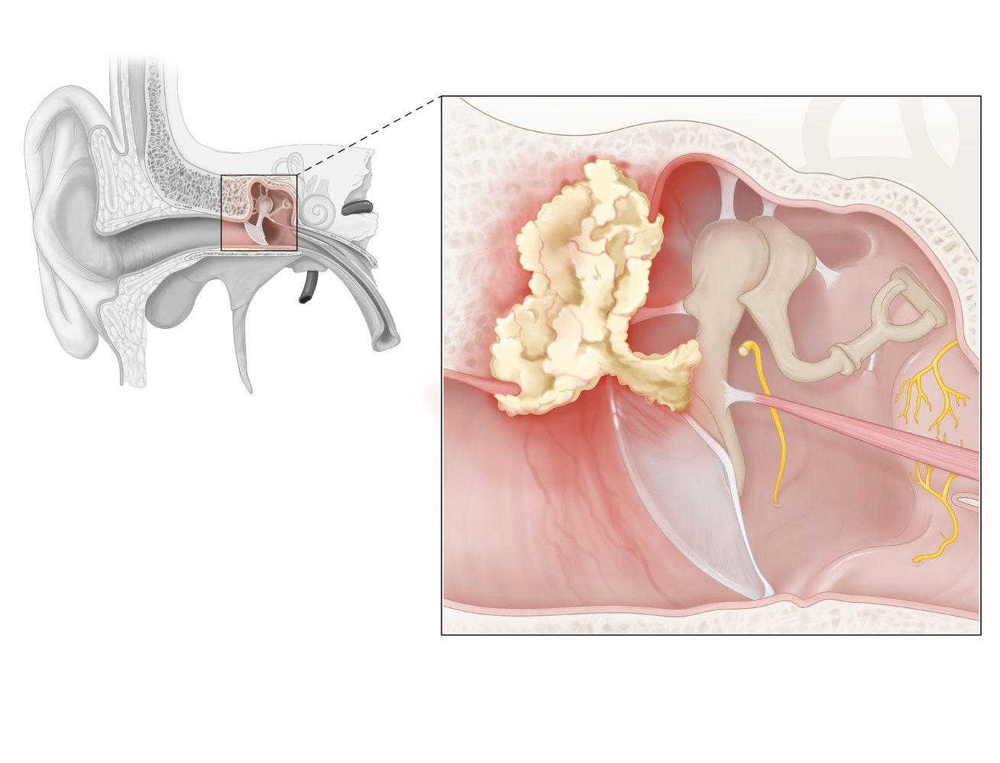
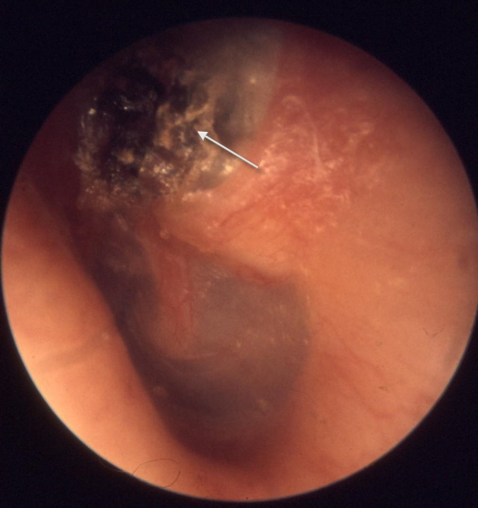

# Cholesteatoma

*Categories: Clinical knowledge > Surgery > Head and neck surgery > Cholesteatoma*

[Original Article Link](https://coursology-qbank.com/amboss/article/Lj0waT)

---

## Summary

Cholesteatoma is a special form of <u>chronic otitis media</u> in which keratinizing <u>squamous epithelium</u> grows from the <u>tympanic membrane</u> or the auditory canal into the <u>middle ear</u> <u>mucosa</u> or mastoid. The presence of abnormal <u>epithelium</u> in an abnormal location triggers an inflammatory response that can destroy surrounding structures such as the <u>ossicles</u>. Cholesteatomas may be congenital or acquired later in life. Acquired cholesteatomas are usually associated with chronic <u>middle ear</u> infection. Cardinal symptoms are painless <u>otorrhea</u> and progressive <u>hearing loss</u>. Important diagnostic procedures include <u>mastoid process</u> <u>x-rays</u>, <u>temporal bone</u> <u>CT scans</u>, and audiometric tests. Left untreated, <u>erosion</u> of the surrounding bone by a cholesteatoma can lead to <u>facial nerve palsy</u>, extradural <u>abscess</u>, and/or sigmoid sinus <u>thrombosis</u>. Therefore, even if a cholesteatoma is asymptomatic, <u>surgery</u> is always indicated. Surgical treatment involves tympanomastoidectomy to excise the cholesteatoma, followed by repair of the damaged <u>middle ear</u> structures.

---

## Pathophysiology

Keratinizing <u>squamous epithelium</u> grows from the <u>tympanic membrane</u> or the auditory canal into the <u>middle ear</u> <u>mucosa</u> or <u>mastoid air cells</u>.

* Congenital cholesteatoma

* Present at <u>birth</u>

* Embryonic nests of <u>epidermal</u> cells that remain in the <u>middle ear</u>

* Acquired cholesteatoma (more common)

* Primary: <u>eustachian tube</u> dysfunction → <u>tympanic membrane</u> <u>epithelium</u> <u>retracts</u> inwards → <u>retraction</u> pocket

* Secondary: <u>Epithelium</u> migrates inwards through a perforation in the <u>tympanic membrane</u>, which is commonly caused by recurrent/<u>chronic otitis media</u>.

Cholesteatoma

References:[[1]](https://coursology-qbank.com/amboss/article/-H0DGh)

---

## Clinical features

* May be asymptomatic

* Painless <u>otorrhea</u>;  (scant but foul-smelling discharge from the affected <u>ear</u>)

* <u>Conductive hearing loss</u>

* Occurs late in primary cholesteatoma

* Occurs early in secondary cholesteatoma

References:[[1]](https://coursology-qbank.com/amboss/article/-H0DGh)[[2]](https://coursology-qbank.com/amboss/article/bs0Hth)[[3]](https://coursology-qbank.com/amboss/article/KraURN)

---

## Diagnosis

* Otoscopic findings:

* Primary acquired: <u>retraction</u> pocket with <u>squamous epithelium</u> and debris;  that often appears as a brown, irregular mass

* Congenital and secondary acquired: white or pearly mass behind the <u>tympanic membrane</u>

* Imaging: to assess the degree of bone destruction

* <u>X-ray</u> of the <u>mastoid process</u>

* <u>CT scan</u> of the <u>temporal bone</u>

* <u>MRI</u> is only indicated if intracranial extension is suspected.

* <u>Audiometry</u>: to assess the degree of <u>hearing loss</u>

Cholesteatoma

References:[[1]](https://coursology-qbank.com/amboss/article/-H0DGh)[[2]](https://coursology-qbank.com/amboss/article/bs0Hth)[[3]](https://coursology-qbank.com/amboss/article/KraURN)

---

## Treatment

* <u>Surgery</u> is always indicated because of the risk of complications. [[2]](https://coursology-qbank.com/amboss/article/bs0Hth)

* Excision of the cholesteatoma (by canal wall-up or canal wall-down <u>mastoidectomy</u>) to control the discharge and create a dry <u>ear</u>

* Reconstruction of the <u>middle ear</u> structures and sound-conducting apparatus

---

## Complications

* Destruction of <u>ear ossicles</u> [[1]](https://coursology-qbank.com/amboss/article/-H0DGh)

* <u>Perilymph fistula</u>

* <u>Facial nerve paralysis</u>

* <u>Erosion</u> of <u>temporal bone</u> → extradural <u>abscess</u>, <u>meningitis</u>, sigmoid sinus <u>thrombosis</u>

* <u>Aural polyp</u>

We list the most important complications. The selection is not exhaustive.

---