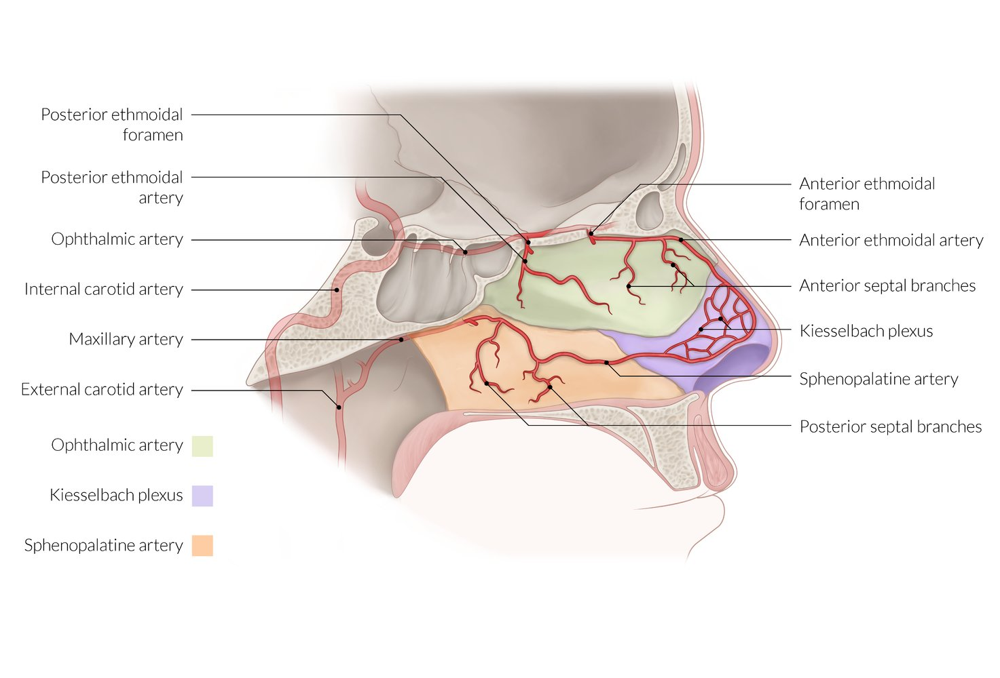

# Epistaxis

*Categories: Clinical knowledge > Surgery > Head and neck surgery > Epistaxis*

[Original Article Link](https://coursology-qbank.com/amboss/article/Hj0KbT)

---

## Summary

Epistaxis is the medical term for a nosebleed, which is a common presenting concern in the emergency room. The most common site of bleeding is the <u>Kiesselbach plexus</u>, where the vessels supplying the nasal <u>mucosa</u> <u>anastomose</u>, resulting in bleeding from the nostrils (<u>anterior epistaxis</u>). <u>Posterior epistaxis</u> is less common and may not be clinically apparent because blood may flow down the throat. The most common causes of epistaxis include nose picking, a foreign body in the nasal cavity, and a dry nose. Usually, bleeding is <u>self-limited</u>, but severe epistaxis may occur in patients with <u>posterior</u> bleeding sites, systemic conditions such as <u>hypertension</u> or <u>bleeding disorders</u>, and/or following traumatic injury. <u>Hereditary hemorrhagic telangiectasia</u>, which is an <u>autosomal dominant</u> vasculopathy characterized by <u>telangiectasia</u> on the <u>skin</u> and <u>mucosa</u>, may cause recurrent epistaxis. Immediate measures to <u>control epistaxis</u> include elevating the patient's head and tilting it forward and pinching the nose. For continued bleeding from an <u>anterior</u> site, local <u>hemostatic measures</u> (i.e., vasoconstrictors and nasal cautery) are used. If <u>hemostasis</u> cannot be achieved with these measures, the nasal cavity must be packed and the patient referred to an ENT <u>surgeon</u>.

---

## Etiology

In most cases, the exact cause of epistaxis remains unknown (<u>idiopathic</u> epistaxis). While a single episode of epistaxis usually does not require any investigation, recurrent epistaxis must be investigated for an underlying cause (e.g., a <u>bleeding disorder</u>).

### Local causes [[1]](https://coursology-qbank.com/amboss/article/UBbbZw)[[2]](https://coursology-qbank.com/amboss/article/K60UNS)

* Nasal irritation

* Nose picking (most common cause)

* Foreign intranasal body

* Dry nose (<u>rhinitis</u> sicca)

* <u>CPAP</u> therapy

* Excessive nose blowing

* Intranasal drug use (e.g., <u>cocaine</u>, <u>topical corticosteroids</u>)

* Vascular <u>malformations</u>

* <u>Hereditary hemorrhagic telangiectasia</u> (<u>HHT</u>)

* Nasal <u>hemangioma</u>

* Inflammatory/granulomatous disorders

* <u>Allergic rhinitis</u>

* <u>Bacterial sinusitis</u>

* <u>Rhinosporidiosis</u>

* Craniofacial trauma

* <u>Blunt trauma</u> (e.g., a fist punch to the nose)

* Nasal and septal <u>fractures</u>

* Zygomatic, maxillary, or <u>frontal bone</u> <u>fracture</u>

* Basal <u>skull fractures</u>

* Nasal septal defects

* <u>Deviated nasal septum</u>

* Septal spurs

* Septal perforation

* Tumors of the <u>nasopharynx</u> and/or <u>paranasal sinuses</u>

* <u>Juvenile nasopharyngeal angiofibroma</u>

* <u>Squamous cell carcinoma</u>

### Systemic causes [[1]](https://coursology-qbank.com/amboss/article/UBbbZw)[[3]](https://coursology-qbank.com/amboss/article/WjaPz4)

* <u>Bleeding disorders</u>

* <u>Von Willebrand disease</u>

* Severe <u>thrombocytopenia</u>;  (e.g., <u>ITP</u>, <u>leukemia</u>, <u>dengue</u>)

* <u>Hemophilia</u>

* <u>Anticoagulant</u> and/or <u>aspirin</u> therapy

* Vascular causes

* <u>Hypertension</u>

* <u>Granulomatosis with polyangiitis</u>

* Carotid <u>artery</u> <u>aneurysm</u>

---

## Classification

|  Classification of epistaxis [[4]](https://coursology-qbank.com/amboss/article/OBbIaw) |  |  |
| --- | --- | --- |
| Criteria | Anterior epistaxis | Posterior epistaxis |
| Clinical features |  * Bleeding from the nostrils   |  * Bleeding through the <u>posterior</u> nasal aperture  * Bleeding down the throat (no external signs of bleeding)  * <u>Hemoptysis</u>, <u>hematemesis</u>, and/or <u>melena</u> may occur due to <u>swallowing</u> of large amounts of blood.   |
| Relative frequency |  * ∼ 90% of cases   |  * ∼ 10% of cases   |
|  Peak <u>incidence</u> [[5]](https://coursology-qbank.com/amboss/article/VNbGZ8) |  * Children < 10 years of age   |  * Older individuals (> 50 years of age)   |
| Most common site of bleeding |  * Kiesselbach plexus: an <u>anastomosis</u> of four <u>arteries</u> (<u>anterior ethmoidal artery</u>, sphenopalatine <u>artery</u>, greater palatine <u>artery</u>, and superior labial <u>artery</u>) located in the anteroinferior portion of the <u>nasal septum</u> (Little area)   |  * Woodruff plexus: a collection of <u>arteries</u> located in the posteroinferior region of the <u>lateral</u> nasal cavity, formed by <u>anastomoses</u> of the sphenopalatine <u>artery</u> (branch of the maxillary <u>artery</u>) and pharyngeal <u>artery</u>  [[6]](https://coursology-qbank.com/amboss/article/kBbmaw)   |

> [!WARNING]
> <u>Posterior epistaxis</u> may be a sign of life-threatening hemorrhages.

> [!NOTE]
> To remember the vessels that form the <u>Kiesselbach plexus</u>, think of LEGS: Labial (superior), Ethmoidal (<u>anterior</u>), Greater palatine, and Sphenopalatine <u>arteries</u>.

Arterial supply of the nasal septum

---

## Management

### Immediate management [[7]](https://coursology-qbank.com/amboss/article/AN1Rdh0)[[8]](https://coursology-qbank.com/amboss/article/4O13sS0)[[9]](https://coursology-qbank.com/amboss/article/kO1msS0)

* Use <u>standard precautions</u> to avoid exposure to body fluids.

* Stabilize patients using the <u>ABCDE approach</u>, including:

* <u>Difficult airway management</u> in patients with <u>signs of airway compromise</u>

* <u>Immediate hemodynamic support</u> for <u>hemorrhagic shock</u>

* Keep the patient's head elevated and tilted forward.

* Control bleeding by applying uninterrupted, bilateral pressure.

* Clear the nose of blood clots.

* Pinch the nasal ala against the <u>nasal septum</u> for 15–20 minutes.

* Consider concurrent use of a topical vasoconstrictor, e.g., <u>oxymetazoline</u> (<u>off-label</u>) DOSAGE. [[7]](https://coursology-qbank.com/amboss/article/AN1Rdh0)

* Perform <u>anterior rhinoscopy</u> to identify the source of bleeding.

### Management of ongoing bleeding [[7]](https://coursology-qbank.com/amboss/article/AN1Rdh0)[[8]](https://coursology-qbank.com/amboss/article/4O13sS0)[[9]](https://coursology-qbank.com/amboss/article/kO1msS0)

* For <u>anterior epistaxis</u> with the bleeding site identified, consider:

* Topical vasoconstrictors (e.g., <u>oxymetazoline</u>, <u>phenylephrine</u>)

* Nasal cautery: <u>chemical cautery</u> (e.g., using a <u>silver nitrate stick</u>) or electrocautery

* If bleeding persists or the bleeding site cannot be identified, place nasal packing.

* Perform <u>anterior</u> <u>nasal packing</u>, e.g., with a <u>nasal tampon</u>, ribbon gauze, or absorbable packing.

* If unsuccessful, consult ENT and perform <u>posterior</u> packing, e.g., with a <u>nasal balloon</u> or <u>Foley catheter</u>.

* For refractory or recurrent bleeding, consider <u>arterial embolization</u> or endoscopic ligation of the bleeding vessel, i.e.:

* <u>Anterior ethmoidal artery</u> for <u>anterior epistaxis</u>

* Sphenopalatine <u>artery</u> for <u>posterior epistaxis</u>

> [!WARNING]
> <u>Anterior</u> <u>nasal packing</u> is not sufficient to control <u>posterior epistaxis</u>.

> [!TIP]
> Consult otolaryngology for refractory or recurrent bleeding despite nasal cautery and packing. [[8]](https://coursology-qbank.com/amboss/article/4O13sS0)

### Supportive treatment

* <u>Topical anesthesia</u> (e.g., 2% <u>lidocaine</u>) and <u>analgesia</u> as needed [[7]](https://coursology-qbank.com/amboss/article/AN1Rdh0)

* Consider prophylactic <u>antibiotics</u> for patients who require packing.  [[8]](https://coursology-qbank.com/amboss/article/4O13sS0)

* Consider <u>anticoagulant reversal</u> after specialist consultation for patients with <u>posterior</u> and/or severe epistaxis.  [[10]](https://coursology-qbank.com/amboss/article/eT1xpT0)

> [!TIP]
> For patients on <u>anticoagulants</u> or <u>antiplatelets</u>, initiate local treatments prior to withholding or <u>reversing anticoagulants</u> unless there is life-threatening epistaxis. [[8]](https://coursology-qbank.com/amboss/article/4O13sS0)[[9]](https://coursology-qbank.com/amboss/article/kO1msS0)

> [!WARNING]
> In rare cases, retained <u>nasal packing</u> can cause <u>toxic shock syndrome</u>. [[11]](https://coursology-qbank.com/amboss/article/vt1A2i0)

### Disposition [[7]](https://coursology-qbank.com/amboss/article/AN1Rdh0)[[8]](https://coursology-qbank.com/amboss/article/4O13sS0)[[9]](https://coursology-qbank.com/amboss/article/kO1msS0)

* <u>Anterior epistaxis</u>

* Consider discharge after observation if <u>hemostasis</u> is successful.

* Counsel patients on preventative measures  and <u>return precautions</u>.

* Arrange follow-up and ensure packing removal within 48–72 hours if discharging with nonresorbable packing.

* <u>Posterior epistaxis</u>

* Admit patients with <u>posterior</u> packing for monitoring.

* Consider <u>ICU</u> admission for patients with <u>hemodynamic instability</u>.

---

## Hereditary hemorrhagic telangiectasia

* Definition: a hereditary, systemic vasculopathy characterized by <u>telangiectasia</u> on the <u>skin</u> and <u>mucosa</u>, particularly in the area of the face (nose, <u>lips</u>, <u>tongue</u>)

* Pattern of inheritance: : <u>autosomal dominant</u>

* Pathophysiology: mutations in <u>genes</u> which code for <u>TGF-β</u> <u>receptors</u> (e.g., <u>endoglin</u> or <u>ALK</u>-1) → structural defects in the vessel wall → postcapillary venous pooling → formation of small and large arteriovenous shunts

* Clinical features [[12]](https://coursology-qbank.com/amboss/article/QcYuXL)

* Recurrent epistaxis

* <u>Telangiectasia</u>

* <u>Cyanosis</u>

* Diagnosis [[13]](https://coursology-qbank.com/amboss/article/2BbTZw)

* Diagnostic criteria for HHT (<u>Curaçao criteria</u>)

* Epistaxis

* <u>Telangiectasias</u> involving the <u>skin</u> and <u>mucous membranes</u>

* <u>Family history</u> of <u>HHT</u>

* Signs of <u>visceral</u> involvement (e.g., pulmonary, gastrointestinal, cerebral <u>arteriovenous malformations</u> or telangiectases)

* <u>Genetic testing</u>

* Management

* For epistaxis management, see “Treatment” section above.

* <u>Skin</u> <u>telangiectasia</u> can be treated by laser therapy or by injection of <u>sclerosing</u> agents.

* Embolization is used to treat large pulmonary and hepatic <u>AV fistulas</u>.

* Complications

* High-output cardiac failure

* <u>Paradoxical emboli</u> → <u>brain abscess</u> and/or <u>stroke</u>

* Chronic <u>GI bleeding</u> and/or <u>hematuria</u> → <u>anemia</u>

Telangiectasia

---