# Head and neck examination

*Categories: Clinical knowledge > Surgery > Head and neck surgery > Head and neck examination*

[Original Article Link](https://coursology-qbank.com/amboss/article/OK0IgS)

---

## Summary

Examination of the head and neck is a fundamental part of the standard <u>physical examination</u>. It is typically one of the first parts of the <u>physical examination</u> and is performed with the patient in a seated position. Because the complete head and <u>neck examination</u> is lengthy, it is usually tailored to the patient's history and presenting complaint. In adult patients, the parts of the examination dealing with the <u>ears</u> and nose are generally not required unless there is a pertinent complaint.

---

## Examination of the head

* Inspect the <u>skull</u> and face.

* Inspect the <u>skin</u> and scalp.

* Palpate <u>skull</u> (especially if patient complains of tenderness or recent trauma).

* Assess facial sensation and <u>motor function</u>.

* <u>Trigeminal nerve</u> function: Lightly touch the forehead of the patient on both sides and the upper and lower areas of the cheek with the index finger. Ask the patient whether this feels the same on both sides of the face.

* <u>Facial nerve</u> function: Ask the patient to furrow their forehead, close their eyes, show their <u>teeth</u>, and inflate their cheeks.

* See <u>examination of cranial nerves</u> and <u>cranial nerve palsies</u>.

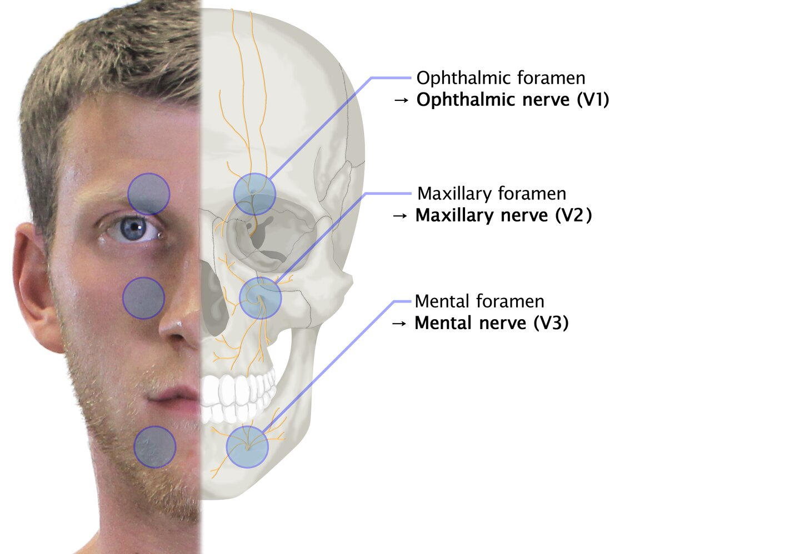

Cutaneous innervation of the trigeminal nerve

[[1]](https://coursology-qbank.com/amboss/article/W_0PMi)[[2]](https://coursology-qbank.com/amboss/article/AaYRMn)

---

## Examination of the ears

* Inspect the external <u>ear</u> and note any <u>skin</u> abnormalities or discharge.

* For patients complaining of <u>ear</u> <u>pain</u> or discharge, gently move the <u>auricle</u> up and down, and apply pressure to the tragus and the <u>mastoid process</u>.

### Otoscopy

* Procedure

* Place the largest speculum that comfortably fits in the patient's <u>ear</u> on the head of the otoscope and turn on the light source.

* Angle the otoscope handle either directly downward or towards the patient's forehead.

* Stabilize your otoscope hand by placing the fourth and fifth digits on the patient's head.

* With your free hand, pull <u>the ear</u> up and in a <u>posterior</u> direction to straighten the canal as you insert the otoscope at a slightly downward angle.

* Interpretation

* Inspect for the presence of discharge, redness, <u>cerumen</u>, swelling, and foreign bodies.

* The <u>tympanic membrane</u> normally reflects the otoscope's light, which is known as the light reflex (or “<u>cone of light</u>”).

* See <u>otitis externa</u>, <u>otitis media</u>, and <u>tympanosclerosis</u> for additional findings.

* A pneumatic bulb allows for assessment of <u>tympanic membrane</u> mobility.

> [!NOTE]
> <u>Otoscopy</u> is an integral part of all pediatric examinations. It is usually only performed in adults if they have mentioned <u>ear</u> discomfort.

### Auditory acuity

#### Screening assessments

* Whispered voice test: While standing behind the patient, whisper a phrase or numbers in each <u>ear</u> → Ask the patient to repeat what you whispered.

* Finger rub test: Place your fingers several centimeters from either <u>ear</u> → Rub your fingertips together and ask the patient if they heard it.

* Interpretation: :  If any asymmetry is detected, or the patient complains of impaired <u>hearing</u>, further evaluation is indicated → See <u>hearing loss</u>.

#### Tuning fork tests

* Performed in order to distinguish between <u>conductive hearing loss</u> and <u>sensorineural hearing loss</u>. See also <u>hearing loss</u>.

* Weber test: tests for lateralization (sound is heard louder in one <u>ear</u> than the other)

* Place the base of a vibrating tuning fork on the middle of the forehead and ask the patient from which <u>ear</u> the sound is louder.

* The sound is normally heard equally in both <u>ears</u>.

* Interpretation

* Lateralization → asymmetric <u>hearing loss</u>

* No lateralization → normal <u>hearing</u> or bilateral <u>hearing loss</u>

* Rinne test: tests for air conduction vs bone conduction in the examined <u>ear</u>

* Place the base of a vibrating tuning fork on the <u>mastoid process</u> of <u>the ear</u>. Once the patient no longer hears a tone, immediately hold the “U” part of the fork over the <u>outer ear</u> and ask the patient if they can still hear it.

* Air conduction is normally greater than bone conduction, so the patient should still be able to hear the tuning fork next to the <u>outer ear</u> after they can no longer hear it when placed on the <u>mastoid process</u>.

* Interpretation

* Unable to hear the tuning fork;  → there is <u>conductive hearing loss</u> (bone conduction > air conduction) in the examined <u>ear</u> (<u>Rinne test</u> is negative)

* Still able to hear tuning fork over the <u>outer ear</u>;  → there is no <u>conductive hearing loss</u> (<u>Rinne test</u> is positive); possible <u>sensorineural hearing loss</u> (air conduction > bone conduction) if there is diminished <u>hearing</u> in the examined <u>ear</u>

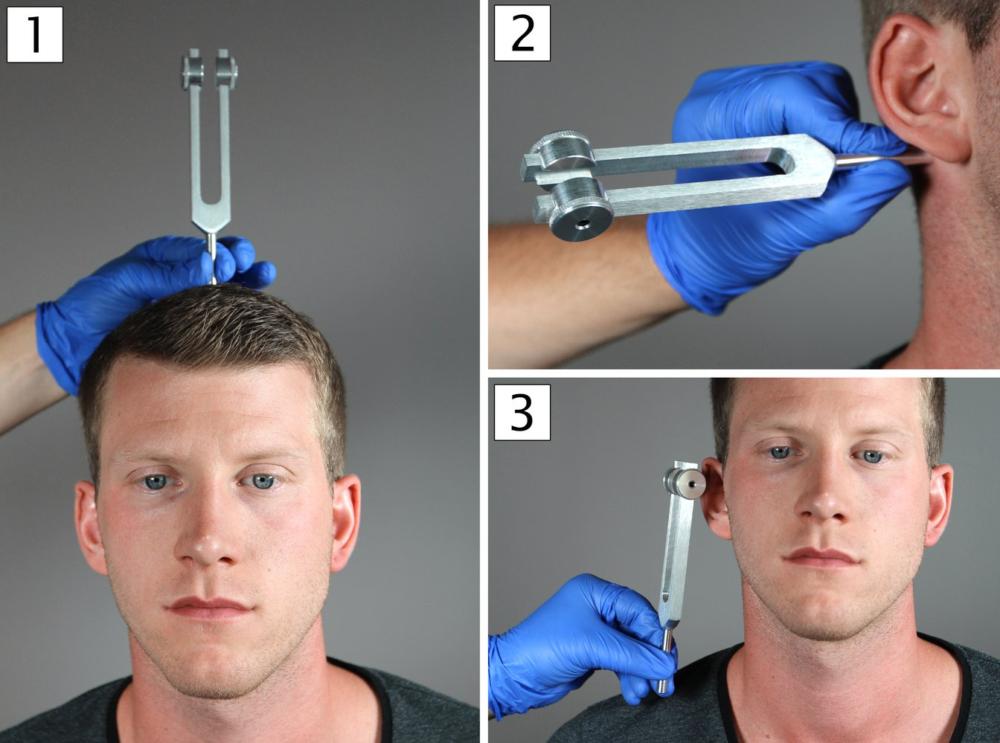

Rinne and Weber tuning fork tests

##### Overview of possible findings

| Rinne left | Rinne right | Weber | Possible finding |
| --- | --- | --- | --- |
| Positive | Positive | Normal | Normal <u>hearing</u> or bilateral <u>sensorineural hearing loss</u>  |
| Positive | Positive | Lateralization to the left |  <u>Sensorineural hearing loss</u> in the right <u>ear</u>  |
| Positive | Positive | Lateralization to the right |  <u>Sensorineural hearing loss</u> in the left <u>ear</u>  |
| Negative | Positive | Lateralization to the left |  <u>Conductive hearing loss</u> in the left <u>ear</u>  |
| Positive | Negative | Lateralization to the right |  <u>Conductive hearing loss</u> in the right <u>ear</u>  |
| Negative | Positive | Lateralization to the right | Combination <u>hearing loss</u> in the left <u>ear</u>   |
|  <u>Deafness</u> in the left <u>ear</u>   |  |  |  |
| Negative | Negative | Normal | Bilateral, symmetrical <u>conductive hearing loss</u>   |

#### Gelle test

* Description: to evaluate the mobility of the <u>ossicles</u>, e.g., in the diagnosis of <u>otosclerosis</u>

* Procedure: The vibrating tuning fork is placed against the forehead and the auditory canal is sealed using a pneumatic speculum, which creates positive pressure in the <u>external auditory canal</u>.

* Gelle positive: Positive pressure disturbs both bone and air conduction. The sound of the tuning fork is perceived by the patient to be considerably weaker with the pneumatic speculum applied than without the pneumatic speculum. → <u>Hearing</u> is normal in the <u>middle ear</u> or there might be a problem in the <u>middle ear</u> that restricts the mobility of the <u>ossicles</u>.

* Gelle negative: Despite positive pressure, there is no change in <u>hearing</u> in the patient. → evidence of <u>otosclerosis</u>

#### Additional tests

* <u>Audiogram</u>, <u>speech audiometry</u>, <u>impedance audiometry</u>

* See <u>hearing loss</u>.

> [!NOTE]
> When screening for <u>hearing loss</u>, examine each <u>ear</u> individually in a quiet room.

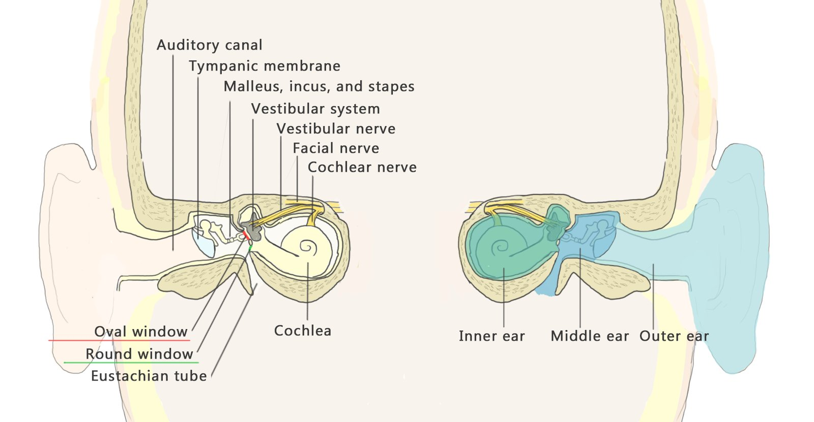

Inner ear: organs of hearing and balance

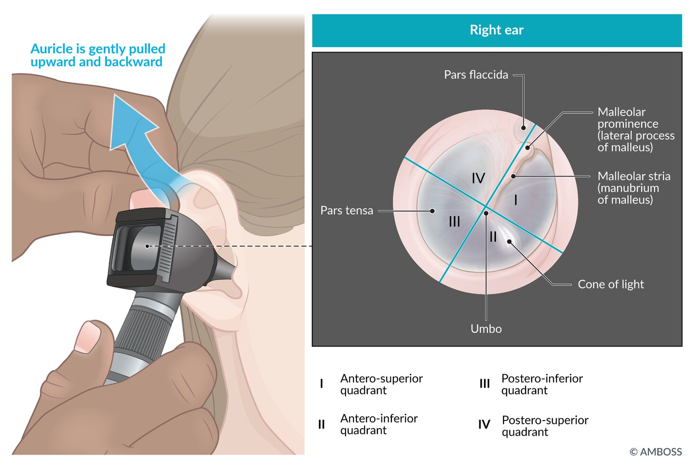

Examination and surface anatomy of the tympanic membrane

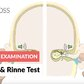

Weber and Rinne Test - Clinical Examination

References:[[1]](https://coursology-qbank.com/amboss/article/W_0PMi)[[2]](https://coursology-qbank.com/amboss/article/AaYRMn)

---

## Focused examination of the eyes

### Inspection and palpation

* Inspect for symmetry of the eyes and eyelids.

* Note any swelling or redness around the eyelids, and assess whether the eyelids can fully close.

* Inspection of the sclera (normal sclerae are white) and inspection of the conjunctivae

* Ask the patient to look up while you hold lower lids with your thumb.

* Inspect for color, vascular pattern, and whether there is any swelling.

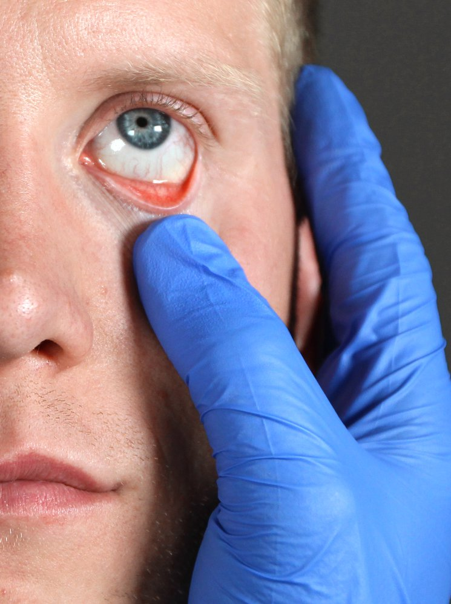

Examination of the conjunctiva

### <u>Pupils</u>

* Assess the <u>pupillary</u> size, location, shape, and reactivity to light (indirect and <u>direct pupillary light reflex</u>)

* For further information, see “<u>Pupillary examination</u>” in “<u>Examination of the eye</u>.”

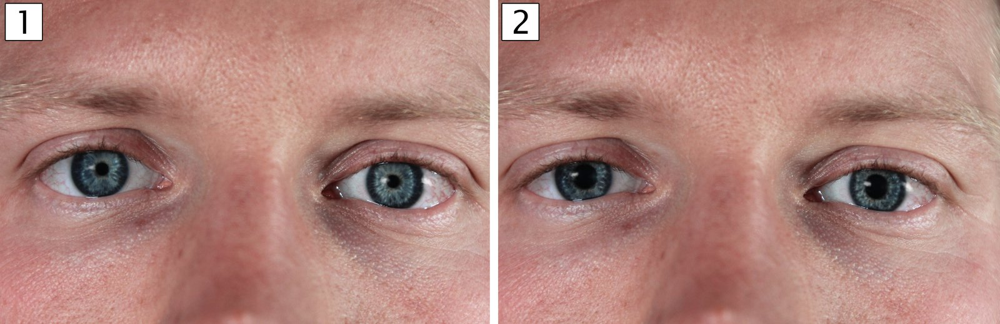

Miosis and mydriasis

### <u>Visual acuity</u>

* Determine the clarity or sharpness of central <u>vision</u> at various distances by using an ophthalmological chart (e.g., <u>Snellen chart</u>).

* For further information, see “<u>Visual acuity</u>” in “<u>Examination of the eye</u>.”

### <u>Visual field testing</u>

* Assess light <u>sensitivity</u> and identify patterns of <u>vision loss</u> using a finger or pen.

* For further information, see “<u>Visual field examination</u>” “<u>Examination of the eye</u>.”

### <u>Examination of extraocular muscles</u>

* Assess the movement and alignment of the eyes using a finger or a pen.

* For further information, see “<u>Extraocular movements</u>” and “<u>Examination of extraocular muscles</u>.”

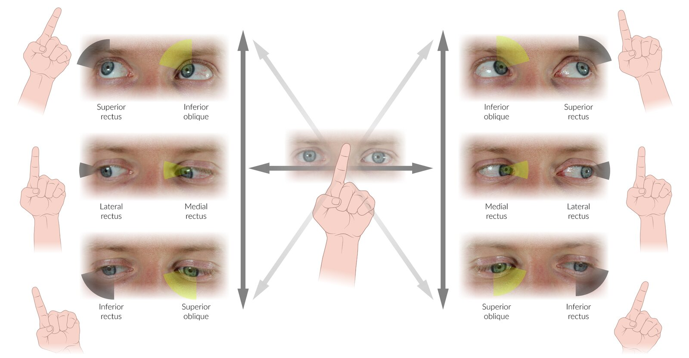

Clinical testing of the extraocular muscles

### <u>Fundoscopic examination</u> and other special tests

* The <u>fundoscopic examination</u> is typically only performed in certain situations (e.g., suspected <u>intracranial hypertension</u> or <u>stroke</u>).

* For further information, “<u>Examination of the eye</u>.”

References:[[1]](https://coursology-qbank.com/amboss/article/W_0PMi)[[2]](https://coursology-qbank.com/amboss/article/AaYRMn)

---

## Examination of the neck

### Inspection and palpation

* Inspect for any obvious deformities, asymmetry, masses, <u>tracheal deviation</u>.

* <u>Palpation of the lymph nodes of the head and neck</u>

* Palpation of the <u>parotid gland</u>

* Assessment of <u>range of motion</u> of the <u>cervical spine</u>

* Ask the patient to tilt their chin so that it is resting against their chest or to flex their neck.

* See <u>meningism</u>.

* Assessment of <u>spinal accessory nerve</u> function

* Ask the patient to move their head to the left and right, and to lift their shoulders against resistance.

* See <u>cranial nerve palsies</u>.

* Evaluate for <u>jugular venous distention</u>.

### Examination of the thyroid

* Inspection

* The <u>thyroid gland</u> is located below the <u>thyroid</u> <u>cartilage</u> and is normally not visible.

* Enlargement should prompt further evaluation.

* Palpation

* Stand behind the patient.

* Place your finger pads below the <u>thyroid</u> <u>cartilage</u> and assesses the size and consistency of the <u>thyroid</u>.

* Ask the patient to swallow.

* The <u>thyroid</u> should slide beneath the fingers.

* The normal <u>thyroid</u> is usually not palpable.

* Note any asymmetry or enlargement.

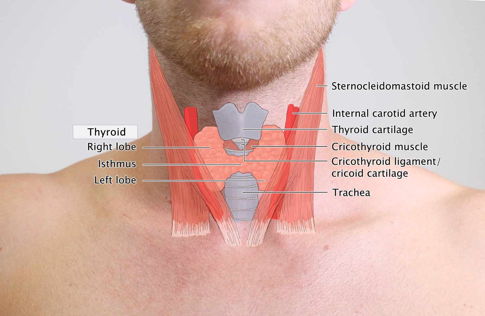

Surface anatomy of the thyroid gland

References:[[1]](https://coursology-qbank.com/amboss/article/W_0PMi)[[2]](https://coursology-qbank.com/amboss/article/AaYRMn)

---

## Examination of the nose and throat

### Nose

* Examine the external nose and test the patient's ability to breathe through either nostril by covering one at a time.

* Examine the nasal <u>mucosa</u>, septum, and turbinates using an otoscope. 

* Use the largest available speculum that will comfortably fit inside the nostril.

* Direct the speculum posteriorly and superiorly as you inspect the nasal cavity.

* Palpate for tenderness over the maxillary and <u>frontal sinuses</u>.

* Inspect the <u>lips</u>.

* Inspect the oral <u>mucosa</u>.

* Inspect the <u>gums</u> for redness or <u>ulceration</u>

### Throat

* Inspect the <u>tonsils</u>

* Inspect the <u>soft palate</u>

* Inspect the <u>posterior</u> <u>pharynx</u> by having the patient stick out their <u>tongue</u>.

* Inspect the <u>tongue</u>.

* Assess <u>tongue</u> motility: See <u>cranial nerve palsies</u>.

References:[[1]](https://coursology-qbank.com/amboss/article/W_0PMi)[[2]](https://coursology-qbank.com/amboss/article/AaYRMn)

---

## Signs and differential diagnosis

### Red flag symptoms of the head and neck

| Location | Clinical features | Possible diagnoses |
| --- | --- | --- |
| Head |  * <u>Nuchal rigidity</u>/reduced <u>range of motion</u>   |  * <u>Meningism</u>   |
| Face |  * Loss of <u>cranial nerve function</u>   |   * <u>Cranial nerve palsies</u>  * <u>Ischemic stroke</u>    |
| Eyes |   * <u>Ptosis</u>  * Incomplete lid closure    |   * <u>Cranial nerve palsies</u>  * <u>Ischemic stroke</u>    |
|  * <u>Xanthelasma</u>   |  * <u>Hyperlipidemia</u>   |  |
|  * <u>Exophthalmos</u>   |  * <u>Graves disease</u>   |  |
|  * Yellow <u>sclera</u>   |  * <u>Jaundice</u>   |  |
|  * <u>Conjunctival injection</u>   |  * <u>Conjunctivitis</u>   |  |
|  * <u>Conjunctival</u> <u>pallor</u>   |  * <u>Anemia</u>   |  |
|  * <u>Horner syndrome</u>   |   * <u>Arterial dissection</u>  * <u>Tumor</u>    |  |
| Mouth |  * <u>Angular cheilitis</u>   |  * <u>Iron deficiency</u>   |
|  * Tonsillar <u>erythema</u>   |  * <u>Acute tonsillitis</u>   |  |
|  * <u>Strawberry tongue</u> (also called <u>raspberry tongue</u>)   |  * <u>Scarlet fever</u>   |  |
|  * <u>Vesicles</u>, <u>blisters</u>   |  * <u>Herpes virus infection</u>   |  |
|  * <u>Tongue</u> coating   |   * <u>Leukoplakia</u>  * <u>Oral candidiasis</u>    |  |
| <u>Ear</u> |  * <u>Hearing</u> impairment   |  * <u>Hearing loss</u>   |
|  * <u>Pain</u>, <u>exudate</u>   |  * <u>Ear</u> infection   |  |
| <u>Lymph nodes</u> |  * <u>Enlarged lymph nodes</u>   |  * Various. (See <u>enlarged lymph nodes</u>)   |
| Neck |  * <u>Jugular venous distention</u>   |   * <u>Volume overload</u>  * <u>Heart failure</u>    |
|  * <u>Thyroid gland</u> enlargement   |   * <u>Goiter</u>  * <u>Thyroid cancer</u>    |  |

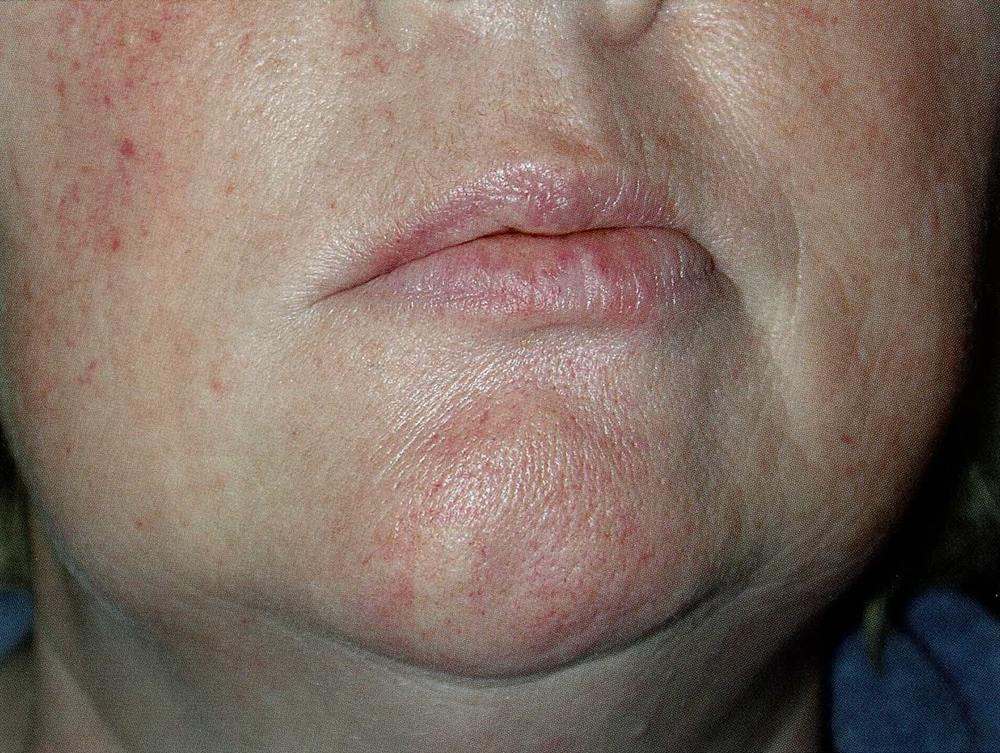

Peripheral right facial nerve palsy

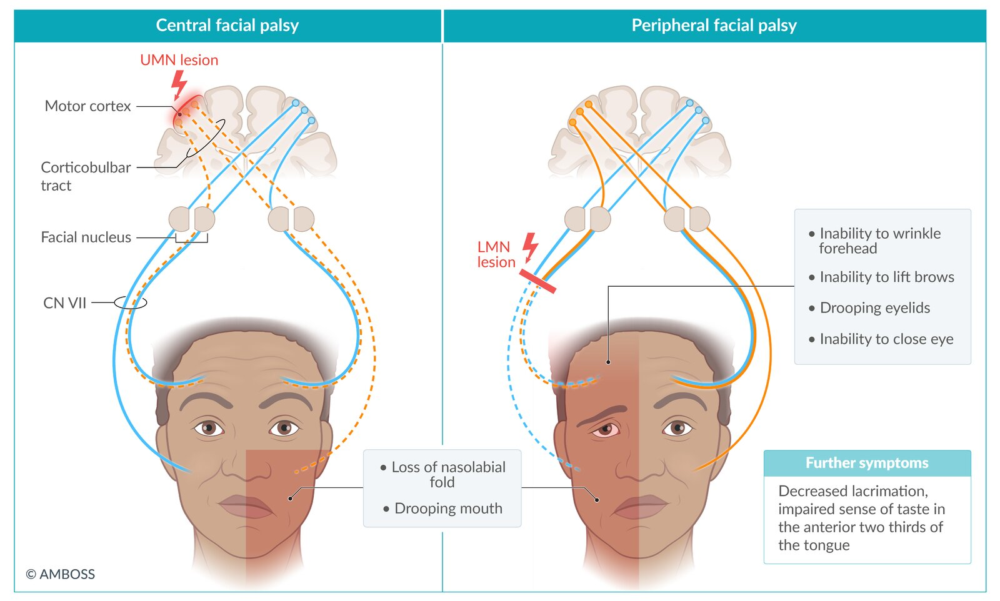

Examination findings in facial nerve palsy

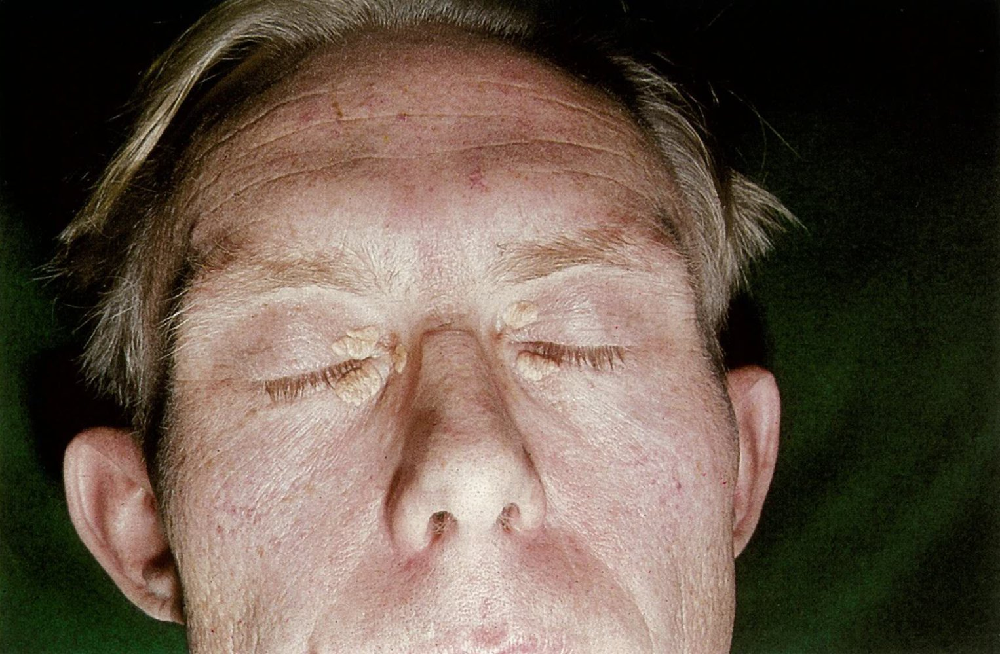

Xanthelasma

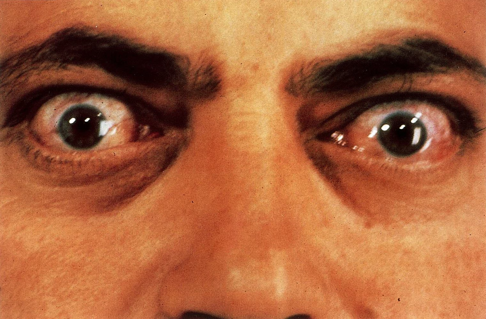

Graves ophthalmopathy

Jaundice (icterus)

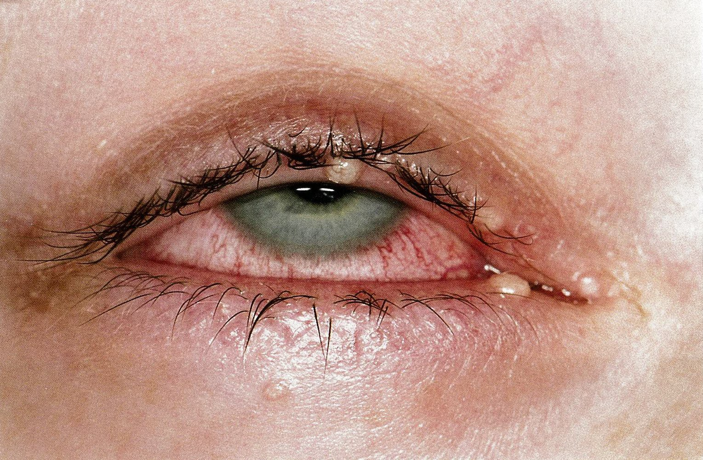

Molluscum contagiosum with concomitant conjunctivitis

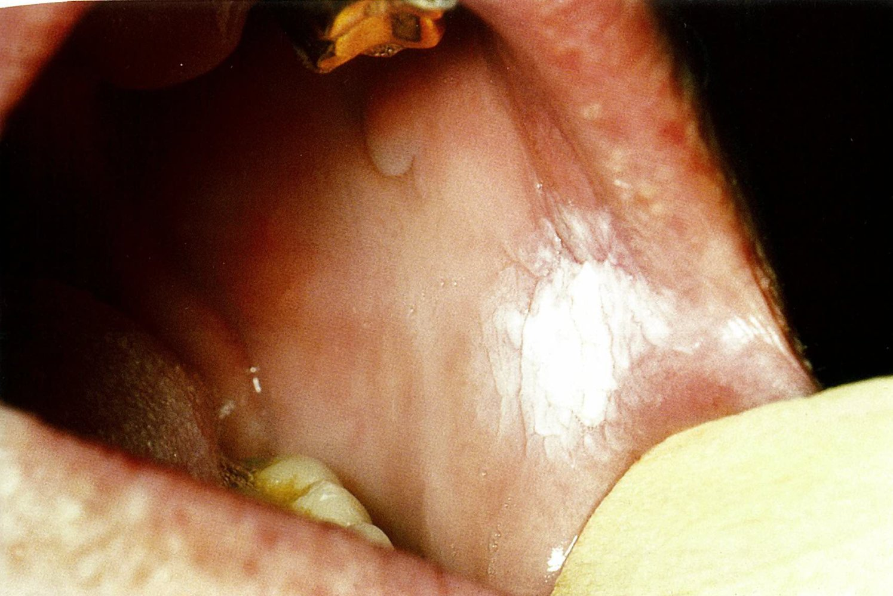

Oral leukoplakia

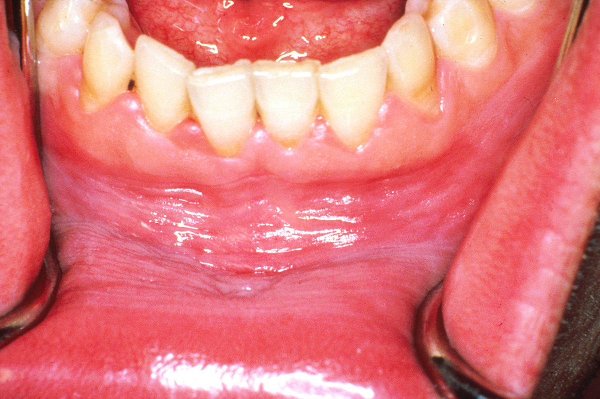

Gingival leukoplakia

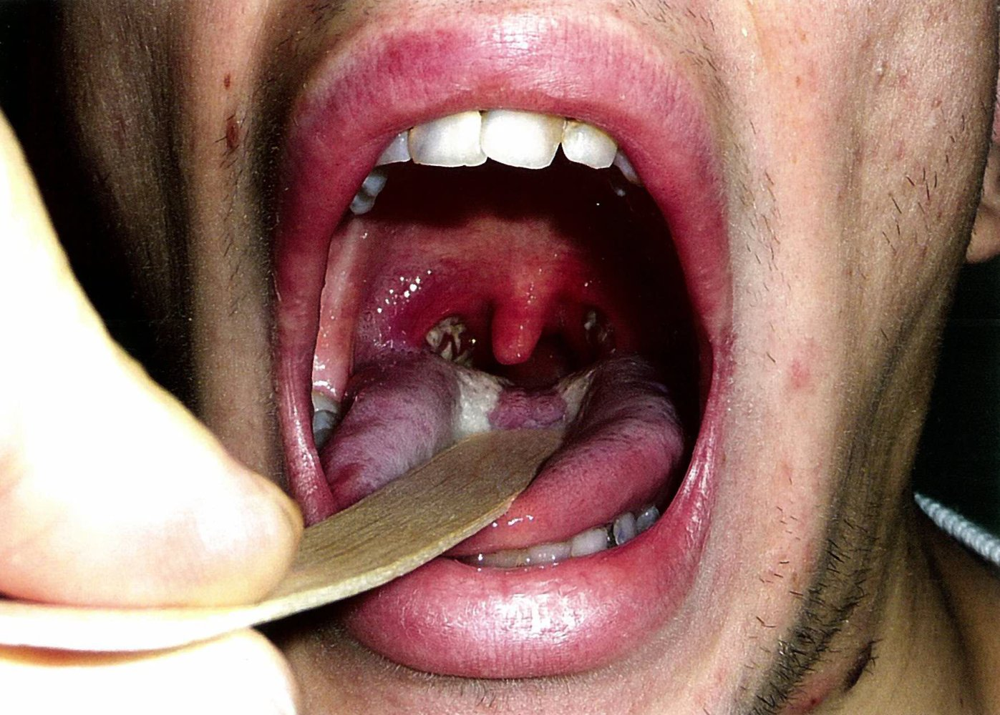

Acute tonsillitis

Membranous tonsillitis

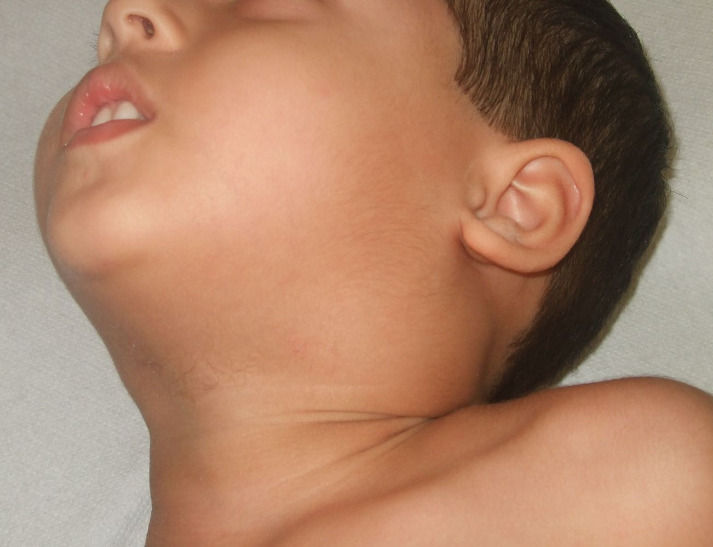

Cervical lymphadenopathy

Surface anatomy of the thyroid gland

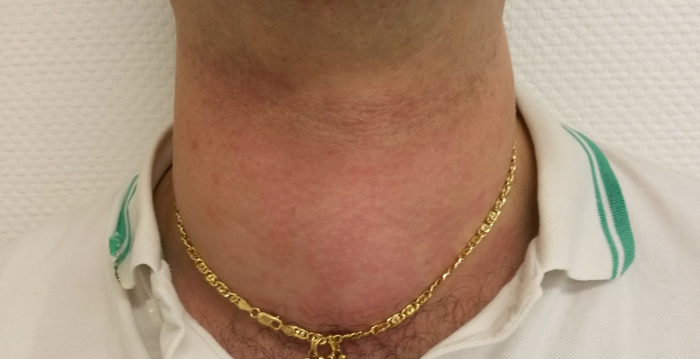

Patient with goiter

References:[[1]](https://coursology-qbank.com/amboss/article/W_0PMi)[[2]](https://coursology-qbank.com/amboss/article/AaYRMn)

---