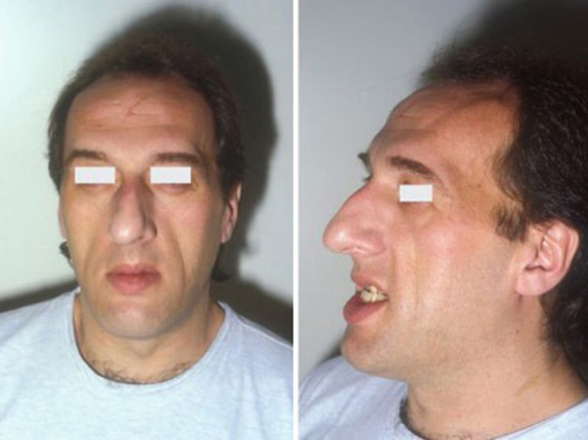
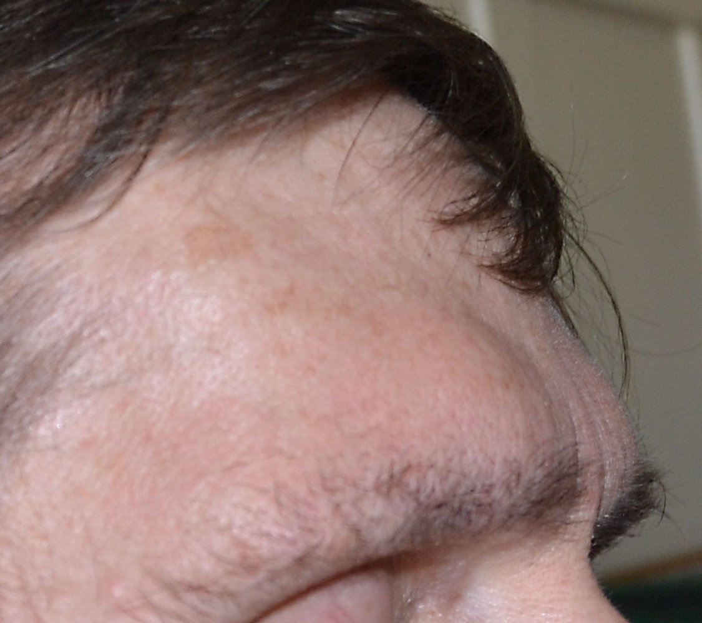
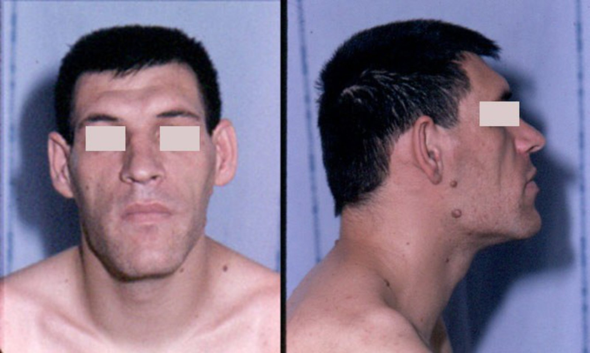
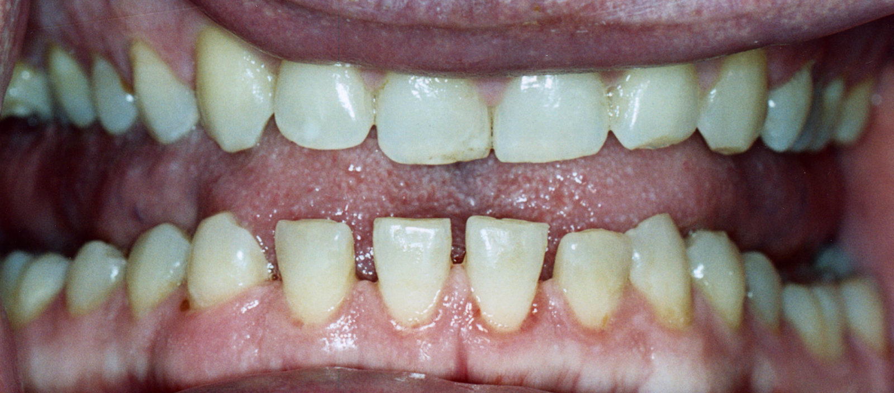
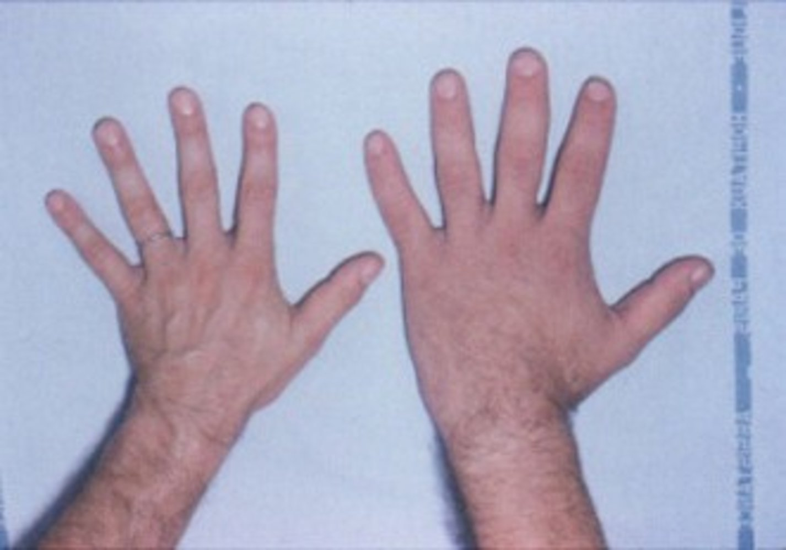
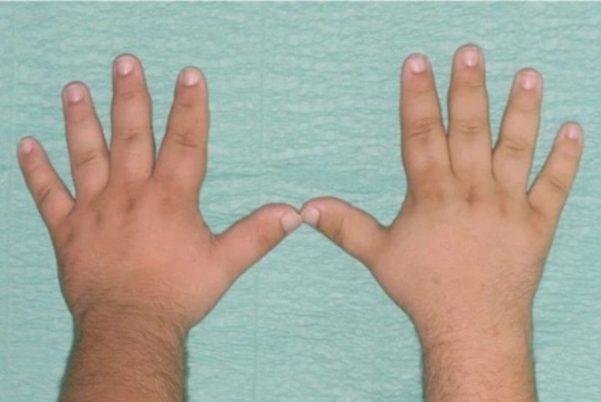
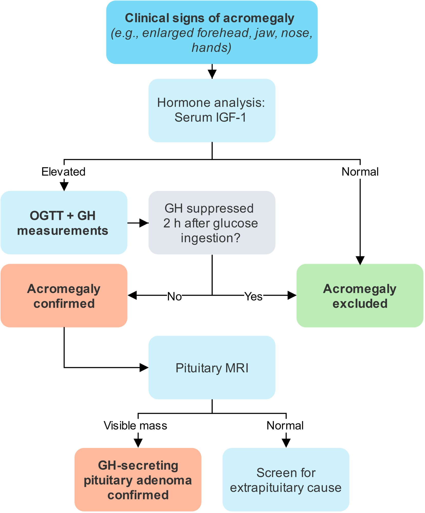

# Acromegaly

*Categories: Clinical knowledge > Surgery > Neurosurgery > Acromegaly*

[Original Article Link](https://coursology-qbank.com/amboss/article/ag0QF2)

---

## Summary

Acromegaly is a rare condition characterized by an excess secretion of <u>growth hormone</u> (<u>GH</u>) and <u>insulin-like growth factor 1</u> (<u>IGF-1</u>), most commonly due to a benign <u>pituitary adenoma</u>. In adults, whose <u>epiphyseal plates</u> are closed, acromegaly causes enlarged hands and feet, coarsened facial features, and pathological growth of internal organs. When excess <u>GH</u> and <u>IGF-1</u> occurs in children, before <u>epiphyseal plate</u> closure, causes <u>gigantism</u>. The first step in diagnosis is to measure <u>IGF-1</u> levels; if these are elevated, further testing includes an <u>oral glucose tolerance test</u> (<u>OGTT</u>) with measurement of <u>GH</u> levels. If <u>glucose</u> does not appropriately suppress <u>GH</u>, a biochemical <u>diagnosis of acromegaly</u> is confirmed. Subsequent diagnostics include imaging to determine the source of excess <u>GH</u>, starting with a <u>pituitary</u> <u>MRI</u>, and evaluation for <u>complications of acromegaly</u> (e.g., <u>hypopituitarism</u>, <u>diabetes</u>, and cardiovascular disease). Management should take place in a specialized multidisciplinary treatment center. First-line treatment is usually <u>surgery</u>. In patients with contraindications to <u>surgery</u> or with persistent disease after <u>surgery</u>, <u>GH</u>-inhibiting medication (<u>somatostatin receptor ligands</u>, <u>dopamine agonists</u>, and/or <u>GH receptor antagonists</u>) and <u>radiotherapy</u> may be used. Adequate treatment is vital to reduce the risk of complications, which may considerably increase mortality. Lifelong monitoring is required for recurrence and complications.

Acromegaly fact sheet

---

## Epidemiology

* <u>Prevalence</u>: 1–9/100,000 in the US  [[1]](https://coursology-qbank.com/amboss/article/fBbkZw)

* Age of onset: 3rd decade of life (mean age at diagnosis usually 40–45 years)  [[1]](https://coursology-qbank.com/amboss/article/fBbkZw)

* Sex: <u>♀</u> = <u>♂</u> [[1]](https://coursology-qbank.com/amboss/article/fBbkZw)

Epidemiological data refers to the US, unless otherwise specified.

---

## Etiology

* Benign <u>GH-secreting pituitary adenoma</u> (> 95% of cases) [[2]](https://coursology-qbank.com/amboss/article/TBb6Zw)

* Rare causes

* <u>Ectopic</u> secretion of <u>GH</u> by <u>neuroendocrine tumors</u> (e.g., <u>small cell lung carcinoma</u>, <u>pancreatic</u> islet-cell <u>tumor</u> (as found in <u>MEN1</u>)

* ↑ Secretion of <u>GH</u>-<u>releasing hormone</u> (<u>GHRH</u>) from a <u>hypothalamic</u> <u>tumor</u> or in <u>paraneoplastic syndromes</u> (e.g., <u>small cell lung carcinoma</u>, <u>medullary thyroid cancer</u>) [[3]](https://coursology-qbank.com/amboss/article/gBbFZw)

---

## Pathophysiology

* Physiology of <u>GH</u> and <u>IGF-1</u> 

* <u>GH</u> secretion induced by <u>stress</u>, sport, and <u>hypoglycemia</u>; inhibited especially by <u>hyperglycemia</u> or food intake

* <u>Hypothalamus</u> secretes <u>GHRH</u> → ↑ secretion of <u>GH</u> ;  → <u>GH</u> induces <u>IGF-1</u> synthesis → ↑ serum <u>IGF-1</u> via <u>liver</u> synthesis which leads to the following effects: 

* Binding to <u>IGF-1</u> and <u>insulin</u> <u>receptors</u> → stimulation of cell growth and <u>proliferation</u>, inhibiting programmed <u>cell death</u>

* Proliferative effects especially on bone, <u>cartilage</u>, <u>skeletal muscle</u>, <u>skin</u>, <u>soft tissue</u>, and organs

* <u>Impaired glucose tolerance</u> caused by binding to <u>insulin</u> <u>receptors</u>

* ↑ Secretion of <u>somatostatin</u> from the <u>hypothalamus</u> → ↓ serum <u>GH</u> and <u>IGF-1</u> (negative feedback)

* Effects of a <u>pituitary adenoma</u>

* Overproduction of <u>GH</u> → abnormally high serum <u>IGF-1</u> levels → overstimulation of cell growth and <u>proliferation</u> → <u>symptoms of acromegaly</u>

* <u>Tumor</u> mass compresses neighboring structures (e.g., <u>optic chiasm</u>) → symptoms of <u>mass effect</u>

* Impaired secretion of other <u>pituitary</u> <u>hormones</u>; , especially <u>gonadotropins</u> → ↓ <u>LH</u> and <u>FSH</u> → ↓ <u>estrogen</u> and <u>testosterone</u>

> [!NOTE]
> Excess <u>GH</u> secretion before the conclusion of longitudinal growth (i.e., prior to <u>epiphyseal plate</u> closure) leads to <u>pituitary gigantism</u> with a possible height of ≥ 2 m. After <u>epiphyseal plate</u> closure, <u>GH</u> excess causes acromegaly, but no change in height!

---

## Clinical features

* <u>Tumor</u> <u>mass effects</u> 

* <u>Headache</u>, <u>vision loss</u> (<u>bitemporal hemianopsia</u>), <u>cranial nerve palsies</u>

* Decreased libido

* <u>♀</u>: <u>Oligomenorrhea</u>, <u>secondary amenorrhea</u>, <u>galactorrhea</u>, vaginal <u>atrophy</u>

* <u>♂</u>: <u>Erectile dysfunction</u>, ↓ testicular volume

* Skeletal effects

* Slowly progressive coarsening of facial features 

* Enlargement of the nose

* <u>Frontal bossing</u>

* Protrusion (<u>prognathism</u>) and enlargement (macrognathia) of the <u>jaw</u> with widening of gaps between the <u>teeth</u> (diastema)

* Widened hands, fingers, and feet

* Painful <u>arthropathy</u> (ankles, knees, hips, <u>spine</u>)

* <u>Soft tissue</u> effects

* Doughy <u>skin</u> texture, <u>hyperhidrosis</u>  [[4]](https://coursology-qbank.com/amboss/article/go0FYS)

* Deepening of the voice, <u>macroglossia</u> with fissures, <u>obstructive sleep apnea</u> (<u>OSA</u>)

* Features of <u>complications of acromegaly</u>: e.g., <u>symptoms of heart failure</u>, <u>symptoms of diabetes mellitus</u>

> [!TIP]
> Consider acromegaly in patients who report having had to increase hat, shoe, glove, and ring sizes in the past!

Acromegaly

Enlarged forehead in acromegaly

Acromegalic facies

Spacing of teeth in acromegaly

Hand in acromegaly

Acromegaly

---

## Diagnostics

### Approach [[2]](https://coursology-qbank.com/amboss/article/TBb6Zw)[[5]](https://coursology-qbank.com/amboss/article/4Bb3aw)[[6]](https://coursology-qbank.com/amboss/article/IxdYBH0)

* Refer patients with suspected acromegaly to <u>endocrinology</u> for assessment.

* Initial screen: serum <u>IGF-1</u> level; a normal result excludes acromegaly.   [[2]](https://coursology-qbank.com/amboss/article/TBb6Zw)

* Elevated <u>IGF-1</u> level: Perform an <u>OGTT</u> (baseline <u>GH</u>, then <u>OGTT</u> and measure <u>GH</u> within 2 hours). ;  [[2]](https://coursology-qbank.com/amboss/article/TBb6Zw)[[5]](https://coursology-qbank.com/amboss/article/4Bb3aw)[[7]](https://coursology-qbank.com/amboss/article/rxdfBH0)

* <u>GH</u> suppressed: acromegaly ruled out

* <u>GH</u> not suppressed: confirmed acromegaly

* Patients with confirmed acromegaly

* Evaluate for underlying etiology.

* First-line: <u>MRI</u> of <u>pituitary</u> with and without contrast to assess for <u>adenomas</u>

* If <u>pituitary</u> imaging is normal, evaluate for an extrapituitary cause.

* Assess for <u>complications of acromegaly</u>.

> [!TIP]
> To ensure consistency, use the same laboratory and assay for <u>GH</u> and <u>IGF-1</u> measurements throughout a patient's care. [[2]](https://coursology-qbank.com/amboss/article/TBb6Zw)

> [!WARNING]
> Random <u>GH</u> measurements are not recommended for the diagnostic evaluation of acromegaly. [[2]](https://coursology-qbank.com/amboss/article/TBb6Zw)

Pituitary gland tumor

Diagnosis of acromegaly

### Evaluation for <u>complications of acromegaly</u> [[2]](https://coursology-qbank.com/amboss/article/TBb6Zw)[[5]](https://coursology-qbank.com/amboss/article/4Bb3aw)[[8]](https://coursology-qbank.com/amboss/article/qxdCxH0)

* <u>Blood pressure measurement</u>

* <u>Diagnostics for hypopituitarism</u>

* <u>Prolactin</u> level

* <u>Hyperglycemia testing</u>

* <u>Lipid panel</u>

* <u>ECG</u>

* <u>Echocardiogram</u>

* <u>Colonoscopy</u>

* <u>DEXA</u> with <u>vertebral morphometry</u>

* Clinical evaluation for <u>complications of acromegaly</u>, with further studies as needed, e.g.:

* Impaired peripheral <u>vision</u> or mass adjacent to <u>optic chiasm</u>: <u>visual field testing</u>

* Palpable <u>thyroid nodules</u>: <u>thyroid ultrasound</u>

* Clinical suspicion for <u>OSA</u>: <u>diagnostics for OSA</u>

---

## Differential diagnoses

* <u>Marfan syndrome</u>

* Pseudoacromegaly (e.g., medication-induced): <u>insulin resistance</u>, acromegaloid features, normal <u>GH</u> and <u>IGF-1</u>

* <u>Prolactinoma</u>: <u>pituitary tumor</u>; excess of <u>prolactin</u>, not <u>GH</u>

* Familial <u>tall stature</u>

* <u>Sotos syndrome</u>

The differential diagnoses listed here are not exhaustive.

---

## Management

### General principles [[6]](https://coursology-qbank.com/amboss/article/IxdYBH0)[[7]](https://coursology-qbank.com/amboss/article/rxdfBH0)

* Refer all patients to a specialized multidisciplinary treatment center for management.

* First-line treatment is usually <u>surgery</u>, as it may be curative.  [[2]](https://coursology-qbank.com/amboss/article/TBb6Zw)[[5]](https://coursology-qbank.com/amboss/article/4Bb3aw)

* In patients with inoperable tumors or persistent disease after <u>surgery</u>, medication and possibly <u>radiotherapy</u> are used to:  [[5]](https://coursology-qbank.com/amboss/article/4Bb3aw)[[9]](https://coursology-qbank.com/amboss/article/lBbvaw)

* Reduce <u>tumor</u> size

* Limit the effects of <u>GH</u> and <u>IGF-1</u>

* Patients require lifelong follow-up to assess for recurrence and <u>complications of acromegaly</u>.

### <u>Surgery</u> [[6]](https://coursology-qbank.com/amboss/article/IxdYBH0)[[7]](https://coursology-qbank.com/amboss/article/rxdfBH0)

* First-line: <u>transsphenoidal adenomectomy</u> [[2]](https://coursology-qbank.com/amboss/article/TBb6Zw)[[5]](https://coursology-qbank.com/amboss/article/4Bb3aw)

* Parasellar disease and inoperable tumors: surgical <u>debulking</u>

> [!TIP]
> Repeat <u>surgery</u> may be necessary if there is residual intrasellar disease after initial <u>surgery</u>. [[2]](https://coursology-qbank.com/amboss/article/TBb6Zw)[[7]](https://coursology-qbank.com/amboss/article/rxdfBH0)

### Pharmacotherapy [[2]](https://coursology-qbank.com/amboss/article/TBb6Zw)[[6]](https://coursology-qbank.com/amboss/article/IxdYBH0)[[7]](https://coursology-qbank.com/amboss/article/rxdfBH0)

* Preoperative medical therapy or nonsurgical candidate: <u>somatostatin receptor ligands</u> (<u>SRLs</u>), e.g., <u>octreotide</u>, <u>lanreotide</u> [[2]](https://coursology-qbank.com/amboss/article/TBb6Zw)

* Postoperative medical therapy [[2]](https://coursology-qbank.com/amboss/article/TBb6Zw)[[10]](https://coursology-qbank.com/amboss/article/7xd4BH0)

* Significant persistent disease: <u>SRLs</u> or <u>GH receptor antagonists</u> (e.g., <u>pegvisomant</u>)

* Mild persistent disease: <u>dopamine agonists</u> (e.g., <u>cabergoline</u>)

* <u>Pituitary</u> <u>hormone</u> replacement: for confirmed <u>hormone</u> deficiency (e.g., <u>adrenal</u>, gonadal, <u>thyroid</u>)

> [!TIP]
> <u>SRLs</u> and <u>dopamine agonists</u> can reduce both <u>GH</u> secretion and <u>tumor</u> size, while <u>GH receptor antagonists</u> block <u>IGF-1</u> production and do not affect <u>tumor</u> size. [[2]](https://coursology-qbank.com/amboss/article/TBb6Zw)

### <u>Radiotherapy</u> [[2]](https://coursology-qbank.com/amboss/article/TBb6Zw)[[5]](https://coursology-qbank.com/amboss/article/4Bb3aw)[[7]](https://coursology-qbank.com/amboss/article/rxdfBH0)

* Indications: third-line option if <u>surgery</u> and medical therapy are unsuccessful, poorly tolerated, or unavailable

* <u>Stereotactic radiosurgery</u> is preferred over conventional fractionated <u>radiotherapy</u>  [[5]](https://coursology-qbank.com/amboss/article/4Bb3aw)[[6]](https://coursology-qbank.com/amboss/article/IxdYBH0)

### Follow-up [[2]](https://coursology-qbank.com/amboss/article/TBb6Zw)[[5]](https://coursology-qbank.com/amboss/article/4Bb3aw)[[8]](https://coursology-qbank.com/amboss/article/qxdCxH0)

* Obtain <u>IGF-1</u> and random <u>GH</u> level 12 weeks after <u>surgery</u>, then annually, with goals of: [[2]](https://coursology-qbank.com/amboss/article/TBb6Zw)

* Normal age-adjusted serum <u>IGF-1</u> level

* Suppressed <u>GH</u> level  [[2]](https://coursology-qbank.com/amboss/article/TBb6Zw)[[7]](https://coursology-qbank.com/amboss/article/rxdfBH0)

* Obtain <u>diagnostics for hypopituitarism</u>; : 6–12 weeks after <u>surgery</u> and then annually. [[5]](https://coursology-qbank.com/amboss/article/4Bb3aw)[[8]](https://coursology-qbank.com/amboss/article/qxdCxH0)

* Perform an <u>MRI</u> <u>pituitary</u>:

* At least 12 weeks after <u>surgery</u> [[2]](https://coursology-qbank.com/amboss/article/TBb6Zw)

* Periodically in patients receiving <u>pegvisomant</u>  [[2]](https://coursology-qbank.com/amboss/article/TBb6Zw)

* Perform ongoing monitoring for <u>complications of acromegaly</u> according to specialist guidance.  [[8]](https://coursology-qbank.com/amboss/article/qxdCxH0)

> [!WARNING]
> <u>Hypopituitarism</u> may develop as a complication of acromegaly or as a result of its treatment (e.g., <u>surgery</u>, <u>radiotherapy</u>).

---

## Complications

Complications may lead to increased mortality.  [[11]](https://coursology-qbank.com/amboss/article/So0yYS)

* Cardiovascular complications

* <u>Hypertension</u> (∼ 30% of cases)  [[11]](https://coursology-qbank.com/amboss/article/So0yYS)[[12]](https://coursology-qbank.com/amboss/article/M60MlS)

* <u>Left ventricular hypertrophy</u> and <u>cardiomyopathy</u>

* <u>Arrhythmia</u>

* Valvular disease

* <u>Impaired glucose tolerance</u> and <u>diabetes mellitus</u> (up to 50% of cases)

* Colorectal polyps and cancer [[13]](https://coursology-qbank.com/amboss/article/PBbWaw)

* <u>Thyroid</u> enlargement and cancer

* <u>Carpal tunnel syndrome</u>

* <u>Cerebral aneurysm</u>

* <u>Hypopituitarism</u>

* <u>Obstructive sleep apnea</u>

* <u>Arthropathy</u>

* Psychological impairment (↓ quality of life, <u>anxiety</u>, ↓ self-esteem)

> [!TIP]
> Increased mortality in acromegaly is primarily due to cardiovascular and cerebrovascular events. [[2]](https://coursology-qbank.com/amboss/article/TBb6Zw)[[5]](https://coursology-qbank.com/amboss/article/4Bb3aw)

We list the most important complications. The selection is not exhaustive.

---

## Special patient groups

### <u>Growth hormone</u> excess in children [[14]](https://coursology-qbank.com/amboss/article/jxd_wH0)[[15]](https://coursology-qbank.com/amboss/article/HxdKBH0)

Gigantism is a rare disorder characterized by abnormal linear growth during childhood due to <u>GH</u> excess while the <u>epiphyseal growth plates</u> are still open.

#### Etiology [[14]](https://coursology-qbank.com/amboss/article/jxd_wH0)

* Most common: <u>GH</u> secretion from a <u>pituitary adenoma</u>

* Syndromes associated with ↑ <u>incidence</u> of <u>pituitary tumors</u>

* <u>Multiple endocrine neoplasia type 1</u>

* <u>McCune-Albright syndrome</u>

* <u>Carney complex</u>

* <u>Neurofibromatosis type 1</u>

* Nonsyndromic genetic etiologies

* Less common: ↑ <u>GHRH</u> secretion (e.g., from <u>hypothalamus</u> or neural <u>tumor</u>)

#### Pathophysiology

* ↑ <u>GH</u> secretion from the <u>anterior pituitary</u>;  (i.e., <u>adenoma</u>) → ↑ <u>IGF-1</u> synthesis → ↑ cell growth and <u>proliferation</u>

* For more details, see “<u>Pathophysiology of acromegaly</u>.”

#### Clinical features

* Hallmark finding: <u>tall stature</u> with accelerated linear growth [[15]](https://coursology-qbank.com/amboss/article/HxdKBH0)[[16]](https://coursology-qbank.com/amboss/article/4xd39H0)

* Mild to moderate <u>obesity</u> [[16]](https://coursology-qbank.com/amboss/article/4xd39H0)[[17]](https://coursology-qbank.com/amboss/article/b-dHDs0)

* Possible progressive <u>macrocephaly</u> [[16]](https://coursology-qbank.com/amboss/article/4xd39H0)

* Manifestations similar to <u>clinical features of acromegaly</u>

* <u>Tumor</u> <u>mass effects</u>

* Skeletal effects in <u>adolescents</u> (e.g., <u>prognathism</u>, <u>frontal bossing</u>) [[15]](https://coursology-qbank.com/amboss/article/HxdKBH0)

> [!TIP]
> <u>Soft tissue</u> effects are less common in <u>gigantism</u> than in acromegaly. [[16]](https://coursology-qbank.com/amboss/article/4xd39H0)

#### Diagnosis [[5]](https://coursology-qbank.com/amboss/article/4Bb3aw)

* Same as <u>diagnostics for acromegaly</u>

* Additional testing is obtained according to specialist guidance and may include: [[5]](https://coursology-qbank.com/amboss/article/4Bb3aw)

* <u>Prolactin</u> level  [[2]](https://coursology-qbank.com/amboss/article/TBb6Zw)[[5]](https://coursology-qbank.com/amboss/article/4Bb3aw)

* <u>Bone age</u> assessment

* <u>Visual field testing</u>

* <u>Genetic testing</u>

* Diagnostic evaluation for associated conditions based on characteristic <u>physical examination</u> findings  [[15]](https://coursology-qbank.com/amboss/article/HxdKBH0)[[16]](https://coursology-qbank.com/amboss/article/4xd39H0)

#### Management

* Management is similar to <u>management of acromegaly</u>;  and involves a multidisciplinary team (e.g., neurosurgery, pediatric <u>endocrinology</u>).

* Additional considerations in children [[14]](https://coursology-qbank.com/amboss/article/jxd_wH0)

* Repeat <u>surgery</u> and <u>adjuvant therapy</u> are frequently required.  [[2]](https://coursology-qbank.com/amboss/article/TBb6Zw)

* A primary goal of treatment is to avoid excessive height growth prior to <u>puberty</u>.

* Risk of <u>hypopituitarism</u> may be higher than in adults.

> [!TIP]
> Early normalization of <u>hormones</u> is recommended to reduce final height. [[14]](https://coursology-qbank.com/amboss/article/jxd_wH0)

#### Complications

See “<u>Complications of acromegaly</u>.”

---