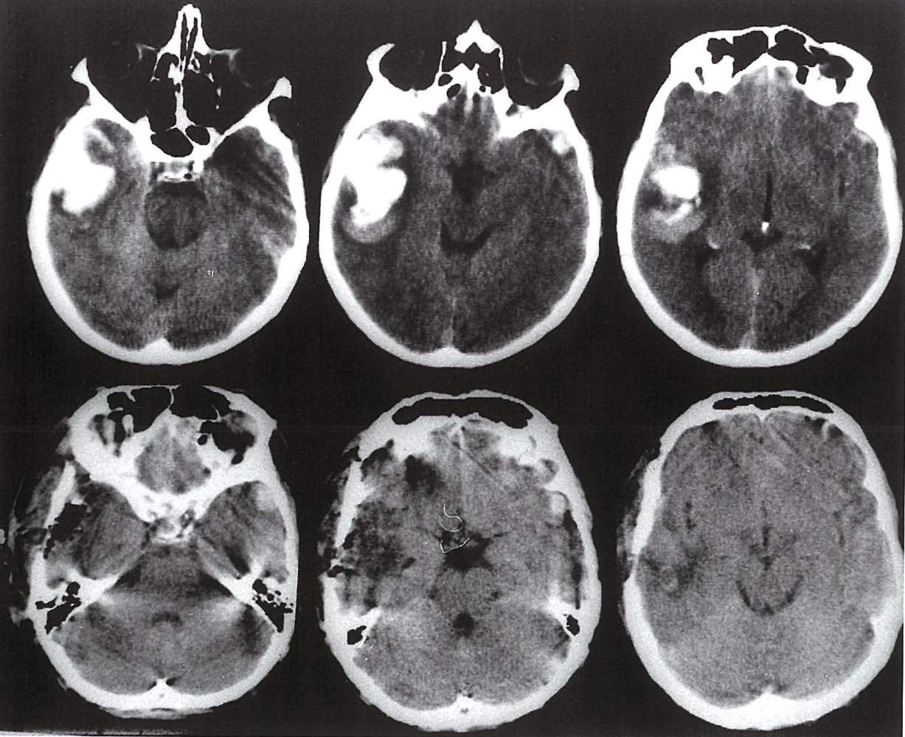
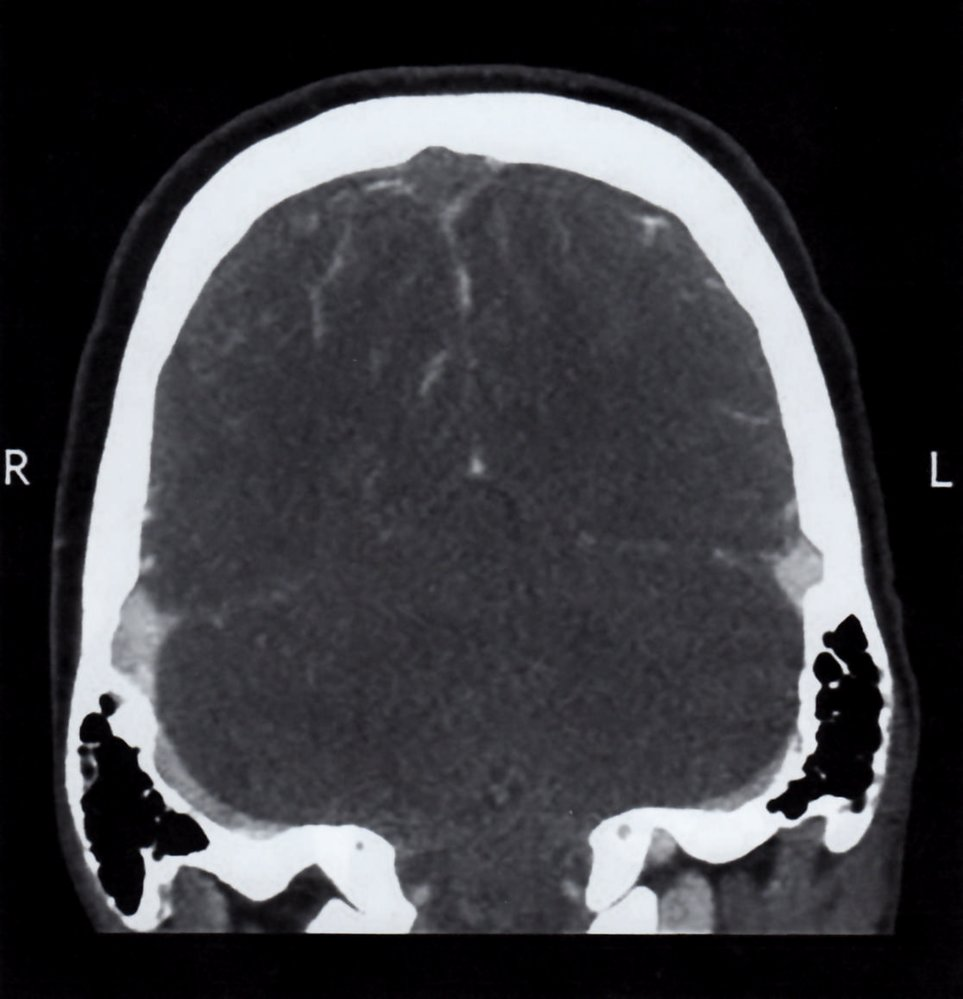
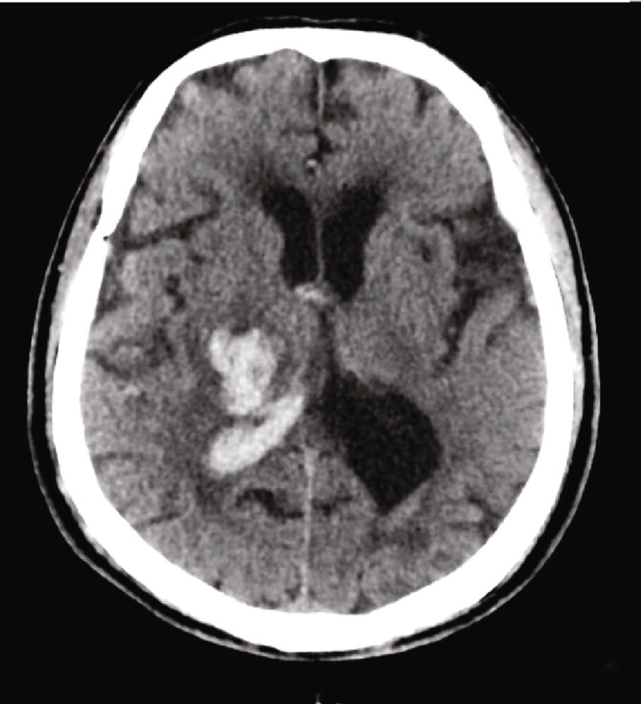
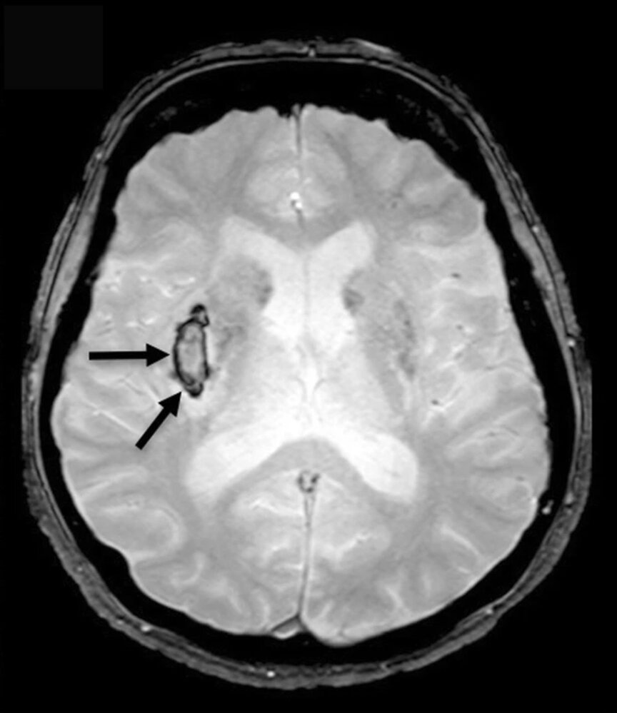
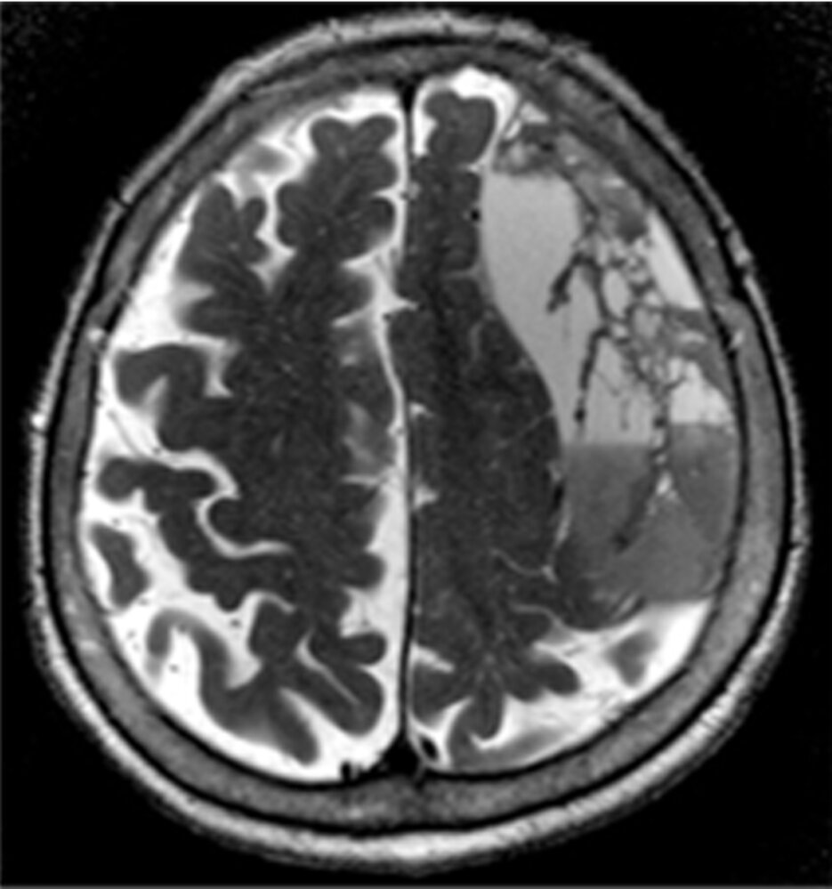
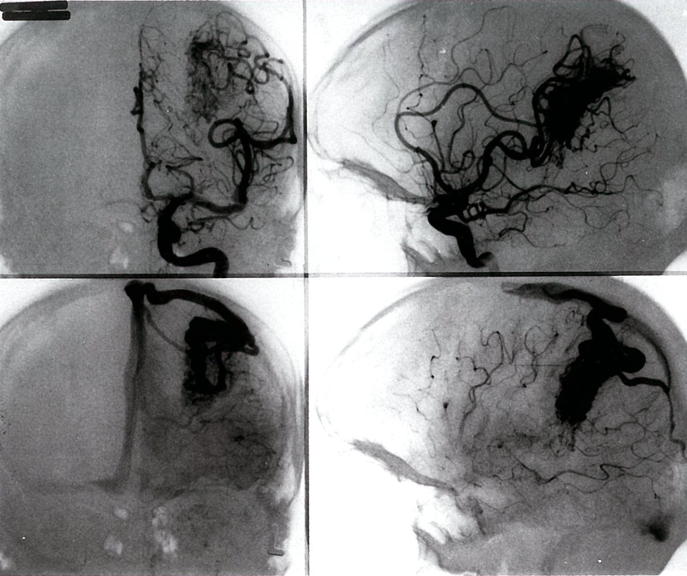
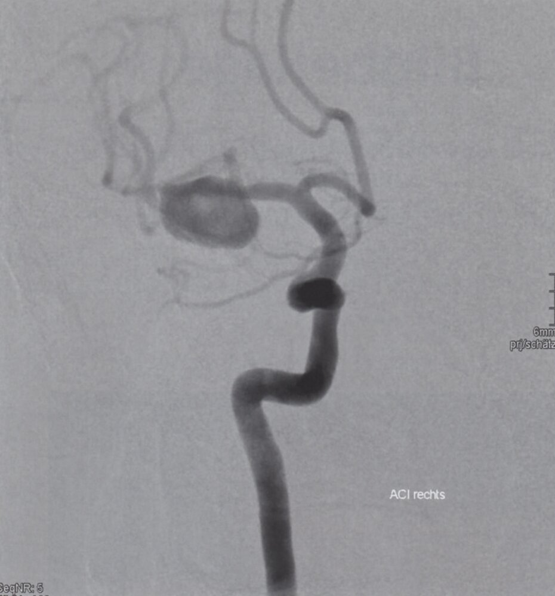
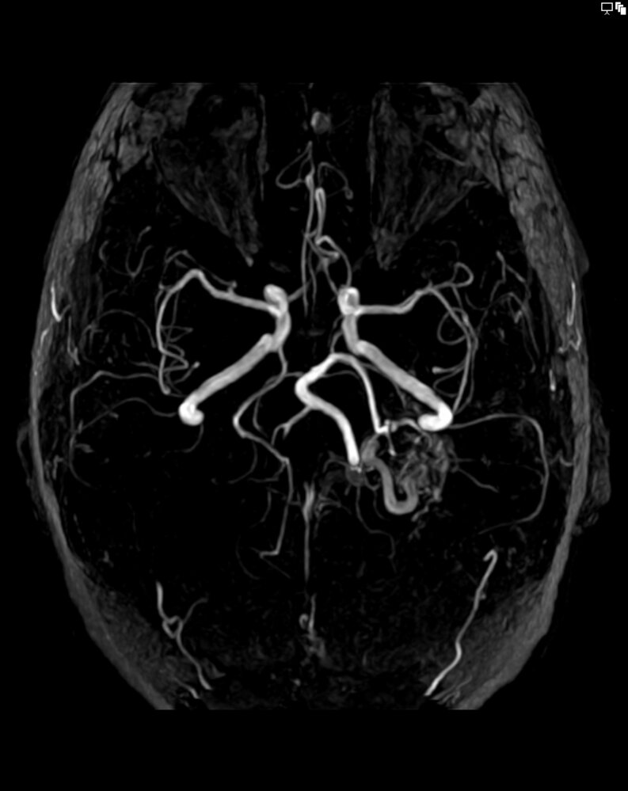

# Intracerebral hemorrhage

*Categories: Clinical knowledge > Surgery > Neurosurgery > Intracerebral hemorrhage*

[Original Article Link](https://coursology-qbank.com/amboss/article/fR0kmf)

---

## Summary

Intracerebral hemorrhage (ICH) refers to bleeding within the <u>brain</u> <u>parenchyma</u>. The term should not be confused with <u>intracranial hemorrhage</u>, which is a broader term that encompasses bleeding within any part of the <u>skull</u>, i.e., extradural, subdural, subarachnoid, or intracerebral bleeding. The most significant <u>risk factor</u> for spontaneous ICH is <u>arterial hypertension</u>. Symptoms are often nonspecific (e.g., <u>headache</u>); however, depending on the affected vessel and cerebral region, <u>focal neurological deficits</u> (e.g., <u>hemiparesis</u>) may occur. Compared with <u>ischemic stroke</u>, patients with ICH are more likely to present with severe <u>headache</u> and have rapidly progressing symptoms. The initial imaging investigation of choice is CT head without contrast, which typically shows a <u>hyperdense</u> mass lesion. Treatment involves management of the underlying and associated conditions (e.g., controlling <u>hypertension</u>, reversing <u>coagulopathy</u>) in order to limit <u>hematoma</u> expansion and prevent <u>secondary brain injury</u>. In severe cases, neurosurgical intervention may be required. Approximately half of patients with spontaneous ICH die within 30 days of symptom onset. <u>Traumatic ICH</u> may result from <u>traumatic brain injury</u> (<u>TBI</u>) and is managed similarly to spontaneous ICH.

See also “<u>Overview of intracranial hemorrhage</u>” and “<u>Overview of stroke</u>” for more information.

---

## Definitions

* Intracerebral hemorrhage (ICH): bleeding within the <u>brain</u> <u>parenchyma</u>

* Intracranial hemorrhage: a broad term used to describe any bleeding within the <u>skull</u> (including intracerebral hemorrhage, <u>subarachnoid hemorrhage</u>, <u>subdural hemorrhage</u>, and <u>epidural hemorrhage</u>) due to <u>traumatic brain injury</u> or nontraumatic causes (e.g., <u>hemorrhagic stroke</u>, ruptured <u>aneurysm</u>, hypertensive vasculopathy)

* <u>Hemorrhagic stroke</u>

* Rupture of a blood vessel within the <u>brain</u> or the <u>cerebrospinal fluid</u>

* Subtypes

* Intracerebral hemorrhage (intraparenchymal hemorrhage): bleeding within the <u>brain</u> <u>parenchyma</u>

* <u>Subarachnoid hemorrhage</u>: bleeding into the <u>subarachnoid space</u>

* <u>Intraventricular hemorrhage</u>: bleeding within the ventricles

---

## Epidemiology

* ICH is responsible for approx. 10% of all <u>strokes</u>. [[1]](https://coursology-qbank.com/amboss/article/U30b3f)

* Most commonly affects the deep structures of the <u>brain</u> [[2]](https://coursology-qbank.com/amboss/article/bnYH7p)

* Intraventricular extension occurs in approx. 30% of patients with ICH.

Epidemiological data refers to the US, unless otherwise specified.

---

## Etiology

* Nontraumatic (spontaneous)

* <u>Hypertension</u>: most common cause of spontaneous ICH

* Cerebral amyloid angiopathy: most common cause of spontaneous ICH in individuals > 60 years of age

* <u>Arteriovenous malformations</u>: most common cause of spontaneous intracerebral hemorrhage in children

* <u>Vasculitis</u> (e.g., <u>giant cell arteritis</u>)

* <u>Neoplasms</u> (e.g., <u>meningioma</u>)

* <u>Ischemic stroke</u> (due to <u>reperfusion injury</u>)

* <u>CNS</u> infections (e.g., <u>HSV encephalitis</u>)

* <u>Septic emboli</u>

* <u>Coagulopathy</u> (e.g., <u>hemophilia</u>, <u>anticoagulant</u> use)

* Stimulant use (e.g., <u>cocaine</u> and <u>amphetamines</u>; possibly also <u>caffeine</u>)

* Traumatic: : see <u>traumatic brain injury</u>

Basal ganglia hemorrhage

References:[[3]](https://coursology-qbank.com/amboss/article/TYa6oQ)[[4]](https://coursology-qbank.com/amboss/article/URabm4)[[5]](https://coursology-qbank.com/amboss/article/TRa6m4)

---

## Pathophysiology

* Nontraumatic mechanisms of hemorrhage

* Chronic <u>arterial hypertension</u> →  <u>lipohyalinosis</u> of lenticulostriate vessels (which supply the <u>basal ganglia</u>) and/or formation and rupture of <u>Charcot-Bouchard microaneurysms</u> → <u>lacunar strokes</u> (<u>ischemia</u>) of the <u>basal ganglia</u>

* <u>Putamen</u> most commonly affected

* Other locations: <u>thalamus</u> (second most common) and <u>infratentorial</u> parts of the <u>brain</u> (e.g., <u>pons</u>, <u>cerebellum</u>)

* <u>Cerebral amyloid angiopathy</u>: deposition of <u>β-amyloid</u> <u>peptides</u> in vessel walls → focal damage with formation of microaneurysms → rupture → recurrent lobar intracerebral hemorrhage

* Structural abnormalities (e.g., vascular <u>malformations</u>) → exposure of parts of the abnormal vascular segment to excessive strain → rupture

* Venous outflow obstruction and stimulant use (e.g., <u>cocaine</u>) → acute <u>arterial hypertension</u>

* Coagulopathies: impaired <u>hemostasis</u> → vascular microtrauma

* Inflammatory tissue <u>necrosis</u>  → damage to vessels

* Traumatic: blunt or penetrating injury → damage to vessels

---

## Clinical features

* <u>Headache</u> 

* Absent in small hemorrhages

* Most common in <u>cerebellar</u> and lobar hemorrhages  [[2]](https://coursology-qbank.com/amboss/article/bnYH7p)[[6]](https://coursology-qbank.com/amboss/article/l5Yv4p)

* <u>Focal neurologic signs</u> and symptoms may occur, depending on the location and size of the hemorrhage (see “<u>Stroke symptoms by affected vessel</u>” and “<u>Stroke symptoms by affected region</u>”) [[2]](https://coursology-qbank.com/amboss/article/bnYH7p)

* Putaminal hemorrhage: <u>contralateral</u> <u>hemiparesis</u> or <u>hemiplegia</u> with less severe <u>contralateral</u> hemisensory loss; eyes deviate toward the side of the <u>hematoma</u>

* Thalamic hemorrhage: <u>contralateral</u> <u>hemiparesis</u>, <u>contralateral</u> hemisensory loss, decreased consciousness, <u>wrong way eyes</u>

* Course

* Symptoms typically progress gradually over minutes to a few hours

* Focal deficits worsen with expansion of the <u>hematoma</u>

* Late: <u>symptoms of increased ICP</u>

* <u>Nausea</u> and <u>vomiting</u>

* Confusion and <u>loss of consciousness</u>

* <u>Bradycardia</u>

* <u>Fixed pupils</u>

---

## Management

For the approach to patients with suspected <u>traumatic ICH</u>, see “<u>Management of traumatic ICH</u>.”

### Initial evaluation  [[7]](https://coursology-qbank.com/amboss/article/qRaCL4)[[8]](https://coursology-qbank.com/amboss/article/CZbqdH)[[9]](https://coursology-qbank.com/amboss/article/eDYxWr)

Consider the sudden onset of <u>focal neurological deficits</u> a vascular event until proven otherwise and evaluate patients as promptly as possible (preferably within the so-called “golden hour”).  [[10]](https://coursology-qbank.com/amboss/article/ZyYZd7)[[11]](https://coursology-qbank.com/amboss/article/4bc3Fa0)[[12]](https://coursology-qbank.com/amboss/article/kbcmFa0)

* Perform an <u>ABCDE survey</u>.

* Initiate <u>neuroprotective measures</u>: These take precedence over diagnostics if they cannot be performed in parallel.

* Take a focused history, perform a <u>neurological examination</u>, and measure the <u>GCS</u> score.

* Order immediate diagnostic studies.

* <u>Neuroimaging</u>: CT head without contrast or <u>MRI</u> head

* <u>Laboratory studies</u>: <u>coagulation panel</u>, <u>platelets</u>, and <u>POC glucose</u>

* Admit or urgently transfer the patient to a <u>neurocritical care unit</u>.

* Urgent consultations

* Neurosurgery: to evaluate if urgent operative intervention is indicated

* <u>Neurology</u>

* <u>Hematology</u>: if the patient is taking <u>antiplatelet agents</u> or <u>anticoagulants</u>

Glasgow Coma Scale (GCS)

> [!WARNING]
> Patients with signs of <u>brain herniation</u> should be evaluated immediately for neurosurgical intervention!

### Monitoring

* All patients should receive:

* <u>Continuous cardiac telemetry</u>

* Blood pressure (BP) monitoring

* Continuous <u>pulse oximetry</u>

* Hourly <u>POC glucose</u> monitoring

* Consider:

* An <u>arterial line</u>

* <u>ICP</u> monitoring (see “Acute stabilization” for indications)

* Continuous <u>EEG</u> monitoring

---

## Acute stabilization

Acute stabilization should begin immediately after symptom onset, in parallel with diagnostic measures, with the goal of reducing <u>hematoma</u> expansion and limiting <u>secondary brain injury</u>. [[7]](https://coursology-qbank.com/amboss/article/qRaCL4)

* <u>Airway management</u>

* Immediately initiate <u>basic airway maneuvers</u> for <u>airway</u> compromise, e.g., <u>signs of partial airway obstruction</u>.

* Intubate if <u>airway protective reflexes</u> are lost.

* <u>Intubation of patients with high ICP</u> can be very risky and requires a specialized approach.

* Standard <u>neuroprotective measures</u>

* Provide <u>supplemental O2</u> as needed to maintain <u>target SpO2</u> > 94%.

* If <u>mechanical ventilation</u> is required: maintain long-term <u>normocapnia</u> (<u>PaCO2</u> 35–45 mm Hg).  [[13]](https://coursology-qbank.com/amboss/article/OwXIQZ0)

* Maintain <u>normoglycemia</u> (see also “<u>Treatment of hypoglycemia</u>” and “<u>Management of hyperglycemia in critically ill patients</u>”).  [[7]](https://coursology-qbank.com/amboss/article/qRaCL4)[[13]](https://coursology-qbank.com/amboss/article/OwXIQZ0)

* Maintain <u>normothermia</u>: e.g., prevent <u>neurogenic fever</u>.

* Blood pressure management in ICH: The optimal approach is unclear.  [[7]](https://coursology-qbank.com/amboss/article/qRaCL4)[[14]](https://coursology-qbank.com/amboss/article/45b348)[[15]](https://coursology-qbank.com/amboss/article/mbcV8a0)[[16]](https://coursology-qbank.com/amboss/article/5bci8a0)[[17]](https://coursology-qbank.com/amboss/article/lO1vsS0); 

* If systolic BP is > 220 mm Hg, promptly lower to 140–180 mm Hg; , e.g., using <u>nicardipine</u>  DOSAGE AND/OR <u>labetalol</u> DOSAGE

* If systolic BP is 150–220 mm Hg and no contraindications to <u>antihypertensive agents</u>: Consider BP lowering on an individual basis in consultation with a specialist.

* Alternative <u>antihypertensive agents</u> include:  [[9]](https://coursology-qbank.com/amboss/article/eDYxWr)[[18]](https://coursology-qbank.com/amboss/article/IwXY4Z0)

* <u>ACE inhibitors</u>, e.g., <u>enalapril</u> or <u>ARBs</u>

* <u>Furosemide</u>

* <u>Hydralazine</u>

* Avoid systemic <u>hypotension</u> (e.g., <u>MAP</u> < 65 mm Hg).

* <u>Anticoagulation reversal</u>

* Stop all <u>anticoagulants</u> and <u>antiplatelet agents</u>.

* Administer reversal agents as soon as possible to patients with an <u>INR</u> > 1.4 to reduce the risk of <u>hematoma</u> expansion.

* <u>Platelet transfusion in intracranial bleeding</u>: only for severe <u>thrombocytopenia</u> [[7]](https://coursology-qbank.com/amboss/article/qRaCL4)

* <u>ICP management</u>

* Considering <u>invasive ICP monitoring</u> if:

* The patient's <u>GCS</u> score is ≤ 8

* Significant <u>intraventricular hemorrhage</u> or <u>hydrocephalus</u> is present

* There is evidence of <u>transtentorial herniation</u>

* Consider measures to maintain <u>ICP</u> < 20 mm Hg and a <u>cerebral perfusion pressure</u> of 60–70 mm Hg: e.g., head elevation to 30°, <u>hyperosmolar therapies for ICP management</u> (<u>mannitol</u>, <u>hypertonic saline</u>), placement of an <u>external ventricular drain</u> or <u>VP shunt</u> for <u>hydrocephalus</u> [[8]](https://coursology-qbank.com/amboss/article/CZbqdH)

* Avoid <u>corticosteroids</u>.  [[19]](https://coursology-qbank.com/amboss/article/5CXisZ0)

> [!WARNING]
> Remember to stop all <u>anticoagulants</u> and <u>antiplatelet medication</u>, including <u>aspirin</u>, in patients with ICH.

> [!TIP]
> <u>Platelet transfusion</u> is not routinely indicated in patients with normal <u>platelet counts</u> taking <u>antiplatelet agents</u> (e.g., <u>aspirin</u>, <u>clopidogrel</u>). [[7]](https://coursology-qbank.com/amboss/article/qRaCL4)[[20]](https://coursology-qbank.com/amboss/article/Qvbu-v)[[21]](https://coursology-qbank.com/amboss/article/Y31nSg0)

---

## Diagnostics

|  Approach to ICH diagnostics [[7]](https://coursology-qbank.com/amboss/article/qRaCL4)[[9]](https://coursology-qbank.com/amboss/article/eDYxWr)[[13]](https://coursology-qbank.com/amboss/article/OwXIQZ0)  |  |  |
| --- | --- | --- |
| Time interval from initial presentation | <u>Laboratory studies</u> | Imaging |
|  Within the first hour  |   * <u>Coagulation screen</u> including <u>INR</u>  * <u>CBC</u> to rule out <u>thrombocytopenia</u>  * <u>POC glucose</u>    |   * CT head without contrast  * <u>MRI</u> head (alternative)    |
|  Hours to days  |   * <u>Electrolyte</u>  * <u>BUN</u> and <u>creatinine</u>  * Serum <u>glucose</u>  * Cardiac <u>troponins</u>   [[7]](https://coursology-qbank.com/amboss/article/qRaCL4)[[22]](https://coursology-qbank.com/amboss/article/YbXnH9)  * Serum or urine toxicology  * Serum or urine <u>pregnancy test</u>  * <u>Urinalysis</u> and <u>urine culture</u>   [[23]](https://coursology-qbank.com/amboss/article/-YcD7a0)    |   * <u>CT angiography</u>  * <u>Magnetic resonance angiography</u> (alternative)  * Consider:  * CT or <u>MRI</u> <u>venogram</u> in suspected <u>cerebral venous thrombosis</u>  * <u>Cerebral angiography</u> if there is strong suspicion for an underlying structural lesion    |

### Characteristic <u>neuroimaging</u> findings [[24]](https://coursology-qbank.com/amboss/article/Eqb8ZE)

* <u>Hematoma</u> within the cerebral <u>parenchyma</u> (i.e., <u>intraaxial lesion</u>)

* Typical locations

* <u>Supratentorial</u>: lobar, or within the <u>thalamus</u> or <u>basal ganglia</u>

* <u>Infratentorial</u>: in the <u>cerebellum</u> or <u>brainstem</u>

* The density of the <u>hematoma</u> varies depending on the imaging modality used and age of the <u>hematoma</u>.

|  Variation in ICH density on imaging over time [[25]](https://coursology-qbank.com/amboss/article/Fobgdu)[[26]](https://coursology-qbank.com/amboss/article/y0Xdi9)  |  |  |
| --- | --- | --- |
| Time since ICH | <u>Hematoma</u> density |  |
| <u>CT without contrast</u> | <u>MRI</u> (<u>T2 weighted</u>) |  |
|  Hyperacute (< 24 hours) |  <u>Hyperdense</u>   |  <u>Hyperintense</u>   |
|  Acute (1–3 days) |  <u>Hyperdense</u> with fluid level and <u>hypodense</u> perifocal <u>edema</u>  |  <u>Hypointense</u> with a <u>hyperintense</u> border |
|  Early subacute (> 3 days to 1 week) |  <u>Hyperdense</u> becoming <u>isodense</u>  | <u>Hypointense</u> |
|  Late subacute (weeks to months) |  <u>Isodense</u> or <u>hypodense</u>  | <u>Hyperintense</u> |
|  Chronic (> months) | <u>Hypodense</u> | <u>Hypointense</u> |

* Additional possible features

* Midline shift and/or <u>mass effect</u>;  (if significant, this should raise suspicion for impending <u>herniation</u>)

* Intraventricular extension   [[9]](https://coursology-qbank.com/amboss/article/eDYxWr)

Intracerebral hemorrhage

Intracerebral hematoma

Ruptured middle cerebral artery aneurysm

Sinus vein thrombosis

Basal ganglia hemorrhage

Thalamic hemorrhage

Hyperacute intracerebral hemorrhage

Subacute on chronic subdural hematoma

Post traumatic intracerebral hemorrhage

### <u>Angiography</u> findings

<u>Angiography</u> may be performed to assess for signs of further bleeding and structural abnormalities in patients with suspected underlying pathology (e.g., patients aged < 55 years and those without <u>risk factors</u> for ICH).  [[7]](https://coursology-qbank.com/amboss/article/qRaCL4)

* CTA spot sign [[27]](https://coursology-qbank.com/amboss/article/UYbboH)  

* Definition: localized area of <u>enhancement</u> visible within an intracerebral hemorrhage only after administration of IV contrast

* Implication: indicates active hemorrhage; is a predictor of <u>hematoma</u> expansion  [[7]](https://coursology-qbank.com/amboss/article/qRaCL4)[[27]](https://coursology-qbank.com/amboss/article/UYbboH)[[28]](https://coursology-qbank.com/amboss/article/hmbc28)

* <u>Aneurysms</u> or other vascular lesions

Spot sign in active intracerebral hemorrhage

Arteriovenous angioma (arteriovenous malformation)

Middle cerebral artery aneurysm

Cerebral arteriovenous malformation

---

## Treatment

### Approach

* Most patients are <u>managed conservatively</u>, with treatment focused on <u>prevention of secondary brain injury</u>.

* Patients should be screened for common complications.

* Select patients may benefit from neurosurgical intervention.

### Detection and management of complications

|  Common complications following spontaneous ICH [[7]](https://coursology-qbank.com/amboss/article/qRaCL4)  |  |
| --- | --- |
| Complication | Screening and management |
|  <u>Dysphagia</u> [[29]](https://coursology-qbank.com/amboss/article/_Yc57a0)  |   * Keep all patients <u>NPO</u> until they have been assessed for <u>dysphagia</u>.  * Perform a <u>clinical swallow assessment</u>.  * If the patient fails a <u>clinical swallow assessment</u>, see “<u>Dysphagia</u>” for further management.    |
|  <u>Seizures</u>   |   * Consider continuous <u>EEG</u> monitoring in patients with unexplained depressed mental status.  * If <u>seizures</u> occur (or are detected on <u>EEG</u>), start <u>anticonvulsants</u> (see “<u>Anticonvulsants in secondary brain injury</u>” for dosages)  * Avoid prophylactic <u>anticonvulsants</u> in patients without <u>seizure</u> history.    |
| Cardiac abnormalities |   * Concurrent <u>MI</u>, <u>arrhythmias</u>, and <u>heart failure</u> can occur.  [[7]](https://coursology-qbank.com/amboss/article/qRaCL4)  * Recommended monitoring  * Serial <u>ECGs</u>   [[30]](https://coursology-qbank.com/amboss/article/ZbXZH9)[[31]](https://coursology-qbank.com/amboss/article/XbX9H9)  * Serial <u>troponin</u> measurements   [[32]](https://coursology-qbank.com/amboss/article/RcXlXC)    |
| <u>Electrolyte</u> abnormalities |   * Consider serial <u>BMP</u> monitoring  * <u>Sodium</u> and <u>potassium</u> abnormalities are common after ICH. [[33]](https://coursology-qbank.com/amboss/article/hCXc7Z0)  * <u>Acute kidney injury</u> is common regardless of whether contrast is used during imaging.  * See also “<u>Electrolyte management in secondary brain injury</u>” and “<u>Electrolyte repletion</u>.”    |
| <u>Venous thromboembolism</u> (<u>VTE</u>) |   * Patients are at increased risk for <u>VTE</u>.  * Oral and <u>parenteral anticoagulants</u> for <u>VTE prophylaxis</u> are contraindicated.  * Start intermittent pneumatic compression of the legs on the day of admission.  * If <u>surgery</u> is performed, consult the operating neurosurgeon regarding indications for postoperative <u>pharmacological VTE prophylaxis</u>.  [[34]](https://coursology-qbank.com/amboss/article/zYcr7a0)    |
| <u>Hematoma</u> expansion |   * Perform regular <u>neurological examinations</u>.  * Consider: [[35]](https://coursology-qbank.com/amboss/article/VCXGIZ0)  * Early <u>CTA</u> (within 3 hours of assessment) to assess for <u>hematoma</u> expansion  [[26]](https://coursology-qbank.com/amboss/article/y0Xdi9)  * <u>CT without contrast</u> 24 hours after presentation to determine the final size of the <u>hematoma</u>  * Transcranial <u>duplex ultrasonography</u>    |

> [!WARNING]
> Prophylactic <u>anticonvulsants</u> are not recommended in patients with ICH. [[7]](https://coursology-qbank.com/amboss/article/qRaCL4)

### Surgical management [[7]](https://coursology-qbank.com/amboss/article/qRaCL4)

Neurosurgical consultation is advised for acute <u>ICP management</u> (see “Acute stabilization”) and definitive management. Evacuation of the <u>hematoma</u> may be appropriate depending on the size, location, and associated clinical features of the ICH.

#### <u>Hematoma</u> evacuation

* Can be performed using standard <u>craniotomy</u> or minimally invasive surgical techniques  [[7]](https://coursology-qbank.com/amboss/article/qRaCL4)[[36]](https://coursology-qbank.com/amboss/article/cCXaIZ0)

* <u>Hematoma</u> evacuation is recommended in patients with <u>infratentorial</u> hemorrhage who have any of the following: [[7]](https://coursology-qbank.com/amboss/article/qRaCL4)

* Large <u>hematoma</u> (> 3 cm)

* Declining neurological status

* <u>Hydrocephalus</u>

* Signs of <u>brain herniation</u> (e.g., <u>Cushing triad</u>)

* Consider in patients with <u>supratentorial</u> hemorrhage and a declining <u>GCS</u> score or an initial <u>GCS</u> score of 10–13.  [[37]](https://coursology-qbank.com/amboss/article/gcXFbC)

#### Decompressive <u>craniotomy</u>

* Decompressive <u>craniotomy</u> may be performed alone or in combination with <u>hematoma</u> evacuation.

* Consider in patients with <u>supratentorial</u> hemorrhage and any of the following: [[7]](https://coursology-qbank.com/amboss/article/qRaCL4)

* Refractory <u>elevated ICP</u>

* Large <u>hematoma</u> with a significant midline shift

* <u>GCS</u> score ≤ 8

### <u>Reducing subsequent stroke risk</u>

* <u>Manage hypertension</u> and address lifestyle <u>risk factors</u>.

* Provide <u>lipid-lowering therapy for ASCVD</u>.

* <u>Statin</u> therapy increases the risk of recurrent <u>hemorrhagic stroke</u> but is nonetheless typically indicated.  [[38]](https://coursology-qbank.com/amboss/article/np17J30)

* <u>PCSK9 inhibitors</u> can be considered as an alternative. [[39]](https://coursology-qbank.com/amboss/article/rdWfr40)

* Avoid long-term use of <u>NSAIDs</u> and use <u>SSRIs</u> with caution. [[40]](https://coursology-qbank.com/amboss/article/FdWg740)

> [!TIP]
> Individuals often have overlapping <u>risk factors</u> for both <u>ischemic stroke</u> and <u>hemorrhagic stroke</u>; assess recurrence risk with a thorough history and examination, <u>laboratory studies</u>, and possibly imaging. [[40]](https://coursology-qbank.com/amboss/article/FdWg740)

---

## Complications

* <u>Elevated ICP</u> and <u>brain herniation</u>

* <u>Intraventricular hemorrhage</u> → <u>hydrocephalus</u>

* Recurrent hemorrhage

* Vasospasm and cerebral <u>ischemia</u>

* <u>Dysphagia</u>; : can lead to <u>aspiration</u> of food and <u>pneumonia</u>

* <u>Seizures</u>

* <u>Hydrocephalus</u>

* <u>SIADH</u>

* <u>Deep vein thrombosis</u>

* See “<u>Complications of stroke</u>.”

We list the most important complications. The selection is not exhaustive.

---