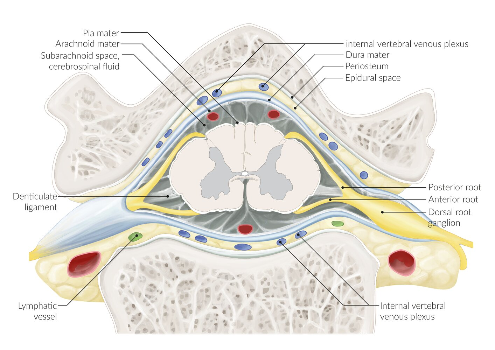
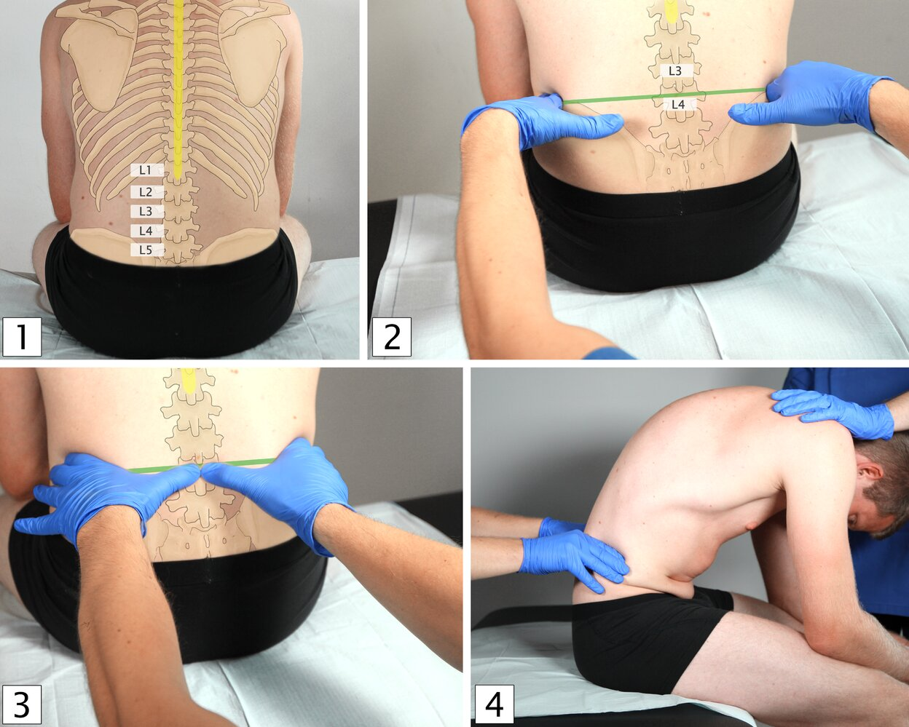
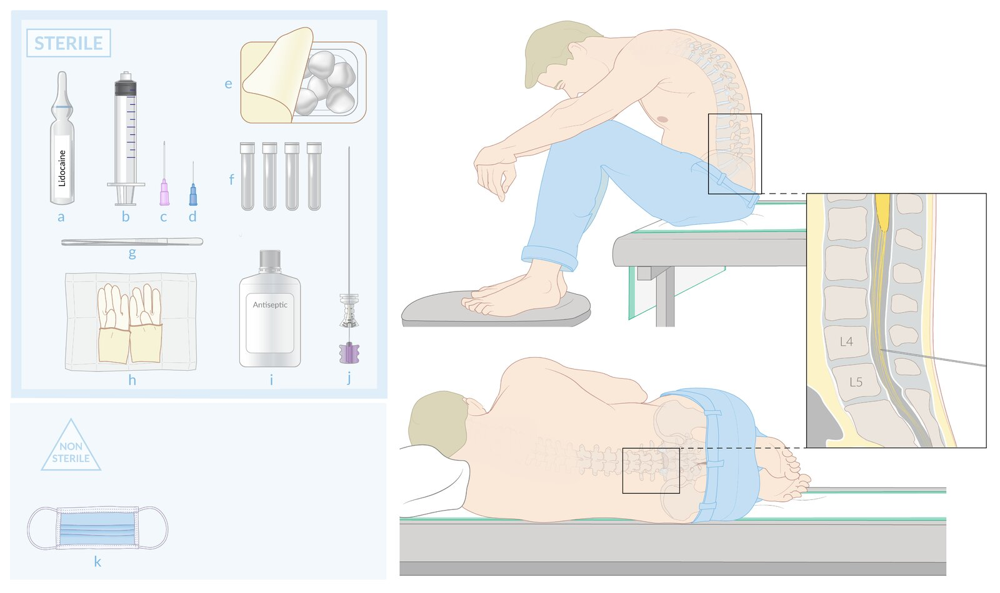

# Lumbar puncture

*Categories: Clinical knowledge > Surgery > Neurosurgery > Lumbar puncture*

[Original Article Link](https://coursology-qbank.com/amboss/article/-l0DzT)

---

## Summary

Lumbar puncture (<u>LP</u>) is a diagnostic and/or therapeutic procedure in which a <u>spinal needle</u> is passed into the <u>subarachnoid space</u> and <u>cerebrospinal fluid</u> (<u>CSF</u>) is removed, <u>CSF</u> <u>opening pressure</u> is measured, and/or medications are injected. <u>CSF analysis</u> may aid in the <u>diagnosis of meningitis</u>, <u>intracranial hemorrhage</u>, <u>multiple sclerosis</u>, and <u>meningeal carcinomatosis</u>. Drainage of <u>CSF</u> is used in the <u>treatment of idiopathic intracranial hypertension</u> and <u>normal pressure hydrocephalus</u>. Untreated <u>elevated intracranial pressure</u>, <u>bleeding disorders</u>, and spinal <u>abscesses</u> are <u>contraindications to lumbar puncture</u>. <u>CNS</u> imaging and/or correction of coagulopathies should be considered prior to performing a lumbar puncture if the risk caused by procedural delay is acceptable. <u>Post-lumbar puncture headache</u> is a common complication, especially in young women, and is often accompanied by <u>nausea</u> and visual changes. The severity of <u>post-lumbar puncture headache</u> ranges from mild to incapacitating. Pharmacologic or interventional management may be necessary.

---

## Indications

### <u>CSF</u> testing for <u>CNS</u> diseases [[1]](https://coursology-qbank.com/amboss/article/3wYSir)

* <u>CNS</u> infections (bacterial, viral, <u>mycobacterial</u>)

* <u>Subarachnoid hemorrhage</u> (<u>SAH</u>)

* <u>CNS</u> malignancies and <u>paraneoplastic syndromes</u>

* <u>Guillain-Barré syndrome</u>

* <u>Multiple sclerosis</u>

* <u>Neuroborreliosis</u>

> [!TIP]
> Urgent indications for lumbar puncture include suspected <u>meningitis</u> and <u>SAH</u> with negative <u>CT scan</u>.

### <u>CSF</u> pressure measurement and/or drainage

* <u>Idiopathic intracranial hypertension</u> (<u>pseudotumor cerebri</u>)

* <u>Normal pressure hydrocephalus</u>

### Intrathecal administration of pharmaceuticals

* <u>Antibiotics</u>

* <u>Chemotherapy</u>

* Anesthesia

* Contrast

---

## Contraindications

Prior to <u>LP</u>, an effort should be made to identify potential contraindications and reduce patient risk. [[1]](https://coursology-qbank.com/amboss/article/3wYSir)[[2]](https://coursology-qbank.com/amboss/article/_GY5bI)

* Increased risk of <u>cerebral herniation</u>

* E.g., due to space-occupying lesion with <u>mass effect</u> or <u>posterior fossa</u> mass

* Obtain head CT if <u>criteria for imaging prior to LP</u> are present.

* <u>↑ ICP</u>: Consider specialist consultation for the <u>management of elevated ICP</u> prior to <u>LP</u>.

* <u>Coagulopathy</u> or <u>thrombocytopenia</u>

* Increased risk of <u>epidural hematoma</u> and <u>spinal cord compression</u>

* Consider correction if <u>platelet count</u> < 40,000/mm³ or <u>INR</u> > 1.5. [[2]](https://coursology-qbank.com/amboss/article/_GY5bI)[[3]](https://coursology-qbank.com/amboss/article/SXWyxP0)

* Current <u>anticoagulant</u> use

* Delay procedure, if feasible.  [[2]](https://coursology-qbank.com/amboss/article/_GY5bI)[[4]](https://coursology-qbank.com/amboss/article/qbWCuP0)

* <u>NSAIDs</u> (including <u>aspirin</u>): no delay required

* Unfractionated IV <u>heparin</u>: 4–6 hours after last dose

* <u>Low-molecular-weight heparin</u>: 12–24 hours after last dose

* <u>Coumadin</u>: until <u>INR</u> ≤ 1.4

* <u>Direct oral anticoagulants</u> (<u>DOACs</u>)

* Length of delay depends on the agent and patient renal function.

* See “<u>Periprocedural management of DOAC therapy</u>” for details.

* Consider <u>anticoagulant reversal</u> if <u>LP</u> is needed urgently.

* Infection at the procedure site: e.g., <u>cellulitis</u>, <u>abscess</u>

We list the most important contraindications. The selection is not exhaustive.

---

## Technical background

### Spinal needles [[2]](https://coursology-qbank.com/amboss/article/_GY5bI)

* Design

* Atraumatic (e.g., Whitacre, Sprotte needles): lower rates of post-lumbar puncture <u>headache</u>, fewer traumatic taps

* Cutting bevel (e.g., Quincke): fewer failed procedures, faster fluid collection

* Size

* Small (≥ 24 gauge): fewer complications, more procedure failures

* Large (≤ 22 gauge): faster procedure time, faster fluid collection

> [!TIP]
> A 20-gauge or 22-gauge atraumatic needle is recommended for most diagnostic lumbar punctures. [[5]](https://coursology-qbank.com/amboss/article/wbWhDP0)[[6]](https://coursology-qbank.com/amboss/article/9bWNDP0)

### Anatomical structures

* The needle passes through <u>skin</u>, <u>fascia</u>, fat, <u>supraspinous ligament</u>, <u>interspinous ligament</u>, <u>ligamentum flavum</u>, <u>epidural space</u>, <u>dura mater</u>, <u>arachnoid mater</u>, and <u>subarachnoid space</u>.

* Loss of resistance occurs when piercing the <u>supraspinous ligament</u> and the <u>ligamenta flava</u> and <u>dura</u>.

Anatomical structures in lumbar puncture, spinal anesthesia, and epidural anesthesia

Transverse section of the lumbar spine

---

## Landmarks and positioning

### Landmarks

In adults, lumbar puncture is most commonly performed in the midline of the L3-L4 or L4-L5 interspace.

* Midline: identified by palpation of the <u>spinous processes</u>

* L4 <u>spinous process</u>

* Typically at the intersection of a line connecting the <u>posterior</u> iliac crests and a line connecting the <u>spinous processes</u>

* Easiest to identify when the patient is upright

> [!NOTE]
> To keep the spinal cord alive, insert the needle between L3 and L5.

Identification of the puncture site in lumbar puncture

### Positioning

* Upright 

* Advantage: easier to identify midline and maintain the correct needle trajectory

* Appropriate for <u>infants</u>, children, and adults

* Patient sits with <u>lumbar spine</u> and hips in <u>flexion</u>.

* <u>Lateral</u> <u>recumbent</u>

* Advantage: comfortable for the patient, required for accurate <u>CSF</u> pressure measurement [[1]](https://coursology-qbank.com/amboss/article/3wYSir)

* Appropriate for older children and adults  [[7]](https://coursology-qbank.com/amboss/article/cx1avQ0)

* Patient lies in the <u>lateral</u> <u>recumbent</u> <u>fetal position</u> with <u>lumbar spine</u> in <u>flexion</u> and head on a pillow.

> [!TIP]
> To accurately measure <u>opening pressure</u>, the patient must be in the <u>lateral</u> <u>recumbent position</u>. [[1]](https://coursology-qbank.com/amboss/article/3wYSir)

Lumbar puncture (1/2): materials, patient positioning, and puncture site

---

## Interpretation/findings

|  Cerebrospinal fluid analysis [[13]](https://coursology-qbank.com/amboss/article/KYYUJn)[[14]](https://coursology-qbank.com/amboss/article/oYY0Jn)  |  |  |  |  |  |  |  |
| --- | --- | --- | --- | --- | --- | --- | --- |
|  |  Opening pressures (see also <u>elevated intracranial pressure and brain herniation</u>)  | Appearance | Cell type (number/μL) |  | <u>Lactate</u> | Protein | <u>Glucose</u> |
| Normal |  * ≤ 15 mm Hg   |  * Colorless and transparent   |  * Acellular (< 5 <u>WBCs</u> and < 5 <u>RBCs</u>)   |  |  * 1.2–2.1 mEq/L   |  * 15–45 mg/100 mL   |  * 40–75 mg/100 mL (60% of serum levels)   |
| <u>Multiple sclerosis</u> |  * Normal   |  * Colorless and transparent   |  * ↑ <u>WBCs</u> (< 50)   |  |  * Normal   |  * Normal to ↑   |  * Normal   |
| <u>Guillain-Barré syndrome</u> |  * Normal   |  * Colorless and transparent   |  * <u>WBCs</u> normal or slightly ↑ (typically < 10)  [[15]](https://coursology-qbank.com/amboss/article/lkVvLu0)   |  |  * Normal   |  * ↑↑   |  * Normal   |
| <u>Subarachnoid hemorrhage</u>, <u>stroke</u> |  * Normal or ↑  [[16]](https://coursology-qbank.com/amboss/article/AN1Rdh0)   |  * Bloody or <u>xanthochromic</u> (i.e., pink or yellow if hemorrhage > 6 h prior to sampling)   |   * ↑ <u>RBCs</u>  * ↑ <u>WBCs</u>    |  |  * Normal   |  * ↑ (<u>gamma globulin</u>)   |  * Normal   |
| <u>Brain tumors</u> |  * Normal or ↑   |  * Colorless and transparent   |  * <u>Drop metastases</u>  [[17]](https://coursology-qbank.com/amboss/article/Qv0u-3)   |  |  * Normal   |  * ↑   |  * ↓   |
| <u>Pseudotumor cerebri</u> (<u>idiopathic intracranial hypertension</u>) |  * ↑↑   |  * Colorless and transparent   |  * Acellular   |  |  * Normal   |  * Normal   |  * Normal   |
| <u>Meningitis</u> |  * ↑–↑↑   |  * Colorless and transparent or cloudy   |   * Pleocytosis, <u>lymphocytosis</u>, or <u>granulocytosis</u>  * See “<u>Cerebrospinal fluid analysis in meningitis</u>.”    |  |  * Variable   |  * Normal or ↑   |  * Normal or ↓   |

* <u>Gram stain</u> and culture to differentiate pathogens (see “Diagnosis” in <u>meningitis</u>)

* Detection of special markers: e.g., <u>tumor markers</u>, <u>tau protein</u>, <u>PCR</u>, or <u>serology</u>

> [!TIP]
> Disruption of the <u>blood-brain barrier</u> (i.e., infections, autoimmune diseases, <u>CNS</u> malignancies) or intrathecal production of <u>IgG</u> (i.e, <u>multiple sclerosis</u>, <u>CNS</u> infections such as <u>Lyme disease</u>) → increased <u>immunoglobulins</u> (<u>oligoclonal bands</u>) → increased <u>CSF</u> protein!

---

## Complications

### Post-lumbar puncture headache [[1]](https://coursology-qbank.com/amboss/article/3wYSir)[[2]](https://coursology-qbank.com/amboss/article/_GY5bI)[[18]](https://coursology-qbank.com/amboss/article/0XWe9P0)

#### Etiology

<u>Post-lumbar puncture headache</u> is caused by <u>CSF</u> leakage after intentional or accidental lumbar puncture.

#### <u>Risk factors</u>

* Female sex

* < 40 years of age

* Low <u>BMI</u> [[19]](https://coursology-qbank.com/amboss/article/YXWn9P0)

#### Clinical features

* Frontal or occipital <u>headache</u>

* Typically worsens when patient is upright and improves when patient is <u>supine</u>

* Presents up to 48 hours after the procedure

* Generally lasts 1–2 days but may persist for months

* <u>Nausea</u>, <u>vomiting</u>, <u>dizziness</u>, <u>tinnitus</u>, and visual disturbances

* Symptoms may be mild to incapacitating.

#### Diagnosis

* <u>Clinical diagnosis</u> in the absence of <u>headache red flags</u>

* If <u>intracranial hemorrhage</u> or <u>brain tumor</u> are suspected, obtain <u>imaging for headache</u>.

* If <u>meningitis</u> is suspected, collect blood and <u>CSF</u> cultures (see “<u>Diagnostics for meningitis</u>”).

#### Treatment

* <u>Supportive care</u>

* <u>Oral analgesics</u>

* Generous fluid intake

* Bed rest

* <u>Caffeine</u> (<u>off-label</u>, PO preferred) DOSAGE [[18]](https://coursology-qbank.com/amboss/article/0XWe9P0)

* Epidural blood patch

* Indicated in severe refractory post-lumbar puncture <u>headache</u>

* Technique: epidural injection of <u>autologous</u> blood at the site of lumbar puncture

* Typically performed by an anesthesiologist or interventional radiologist

#### Prevention

Use a small-gauge (e.g., ≥ 24 gauge), atraumatic needle for lumbar puncture.

### Other

* Infection

* <u>Spinal epidural abscess</u>

* <u>Meningitis</u>

* Hemorrhage

* <u>CSF</u> may appear bloody if there is cutaneous vessel injury during lumbar puncture.

* May result from a lesion of the venous plexus in the central <u>subarachnoid space</u>

* Rarely results in <u>epidural hematoma</u>

* Neuropathy

* Shooting <u>pain</u> radiating to a leg (due to contact with a <u>nerve root</u>)

* Resolves when needle is withdrawn and redirected medially

* Transient <u>abducens nerve palsy</u>

* <u>Brain herniation</u>: See “<u>Elevated ICP and brain herniation</u>.”

* Epidermoid <u>tumor</u>

> [!WARNING]
> Severe <u>back pain</u> and/or neurological deficits that begin after a lumbar puncture should raise concern for <u>epidural hematoma</u>.

We list the most important complications. The selection is not exhaustive.

---