# Neurological examination

*Categories: Clinical knowledge > Surgery > Neurosurgery > Neurological examination*

[Original Article Link](https://coursology-qbank.com/amboss/article/o500Og)

---

## Summary

Neurological examination is the assessment of mental status, <u>cranial nerves</u>, motor and <u>sensory function</u>, coordination, and gait for the diagnosis of neurological conditions. Findings should always be compared with the <u>contralateral</u> side and upper limb function should be compared with lower limb function to determine the location of a lesion. Subtle <u>central nervous system</u> defects can be detected with careful observation of patients performing tasks that require the simultaneous activation of multiple cerebral areas. This article provides information about several examination methods and explains key terms relevant to the evaluation of neurological conditions.

---

## Mental status examination

* The <u>mental status examination</u> is a key component of any neurological examination and involves assessing the following points, based on <u>patient history</u> and clinical observation:

* <u>Appearance and behavior</u>

* Sensorium and <u>cognition</u>

* <u>Mood and affect</u>

* Speech

* <u>Thought process</u>

* <u>Thought content</u>

* <u>Perceptual disturbances</u>

* Insight and judgment

* A more <u>focused mental status examination</u> is performed in the workup of specific neurological disorders and symptoms.

* In emergency settings, the <u>mental status examination</u> focuses on the assessment of orientation and <u>level of consciousness</u> using standardized scales (e.g., <u>Glasgow coma scale</u>).

* See “<u>Mental status examination</u>” for a comprehensive discussion of examination elements and possible findings.

---

## Types of aphasia

* <u>Aphasia</u> is the inability to either form or understand language not attributed to the motor ability to produce speech. It is caused by damage to different areas of the dominant hemisphere (usually left).

| Types of aphasia |  |  |  |  |
| --- | --- | --- | --- | --- |
|  |  | Location of lesion | Type | Clinical features |
| Broca aphasia (<u>motor aphasia</u>, <u>expressive aphasia</u>) |  |  * <u>Broca area</u> (inferior frontal <u>gyrus</u>)   |  * Nonfluent   |   * Telegraphic and grammatically incorrect speech  * Comprehension is largely spared (difficulty understanding complex language may occur).  * The patient is typically aware of the deficit and feels frustrated about it.  * Impaired repetition    |
| Wernicke aphasia (<u>sensory aphasia</u>, <u>receptive aphasia</u>) |  |  * <u>Wernicke area</u> (<u>superior temporal gyrus</u>)   |  * Fluent   |   * Fluent speech that lacks sense (paraphasic errors, <u>neologisms</u>, <u>word salad</u>)  * Comprehension is impaired.  * The patient is typically unaware of the deficits.  * Impaired repetition  * Reading and writing are often severely impaired.    |
| Global aphasia |  |  * <u>Broca area</u>, <u>Wernicke area</u>, and <u>arcuate fasciculus</u>   |  * Nonfluent   |  * Severe impairment of speech production and comprehension  * Patient may be mute or only utter sounds  * Inability to comprehend speech   |
|  Conduction aphasia (<u>associative aphasia</u>) |  |  * <u>Arcuate fasciculus</u> of the <u>parietal lobe</u>   |  * Fluent   |   * Mostly intact comprehension and fluent speech production  * Impaired repetition with paraphasia (patients substitute or transpose sounds and try to correct mistakes on their own)    |
| Anomic aphasia |  |  * Usually, pinpointing the localization of the lesion is not possible.   |  * Fluent   |   * Isolated difficulty finding words  * Paraphrasing occurs when patients cannot find the word they seek.    |
|  Transcortical aphasia  | Transcortical motor aphasia |  * Supplementary motor area in the <u>frontal lobe</u>, with <u>Broca area</u> intact (exception: may occur during the recovery phase of <u>Broca aphasia</u>)   |  * Nonfluent   |   * Difficulty initiating speech  * Difficulty in expressing a <u>thought process</u>  * Difficulty producing own phrases  * Intact repetition and comprehension    |
| Transcortical sensory aphasia |  * Various areas of the <u>temporal lobe</u>, with the <u>Wernicke area</u> intact   |  * Fluent   |   * Impaired speech expression and comprehension  * Errors in paraphrasing  * Poor comprehension  * Intact repetition    |  |
| Transcortical mixed aphasia |  * <u>Broca area</u>, <u>Wernicke area</u>, and <u>arcuate fasciculus</u> intact, with the surrounding <u>watershed areas</u> affected   |  * Nonfluent   |  * Poor comprehension of spoken and written language   |  |

> [!NOTE]
> The Broca's area is broken in Broca <u>aphasia</u>.
> Speech of patients with Wernicke <u>aphasia</u> is like a Word salad
> In Conduction <u>aphasia</u>, the arCuate fasciculus is affected.

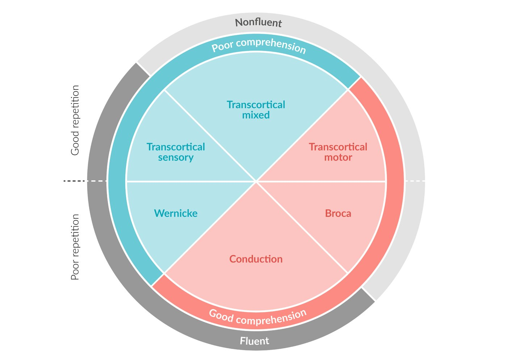

Types of Aphasia

---

## Cranial nerve examination

### Overview of <u>cranial nerve examination</u>

The <u>cranial nerve examination</u> is used to identify problems with the <u>cranial nerves</u> by <u>physical examination</u>. For information on disorders of the <u>cranial nerves</u>, see “<u>Cranial nerve palsies</u>.” The assessment includes the following components:

|  Overview of <u>cranial nerve examination</u> [[1]](https://coursology-qbank.com/amboss/article/alaQvk) |  |  |  |
| --- | --- | --- | --- |
| <u>Cranial nerve</u> |  | What is examined? | How is the test performed? |
| <u>Olfactory nerve</u> | I |  * <u>Olfaction</u>   |  * Test the patient's ability to detect and identify an aroma in each nostril.   * Ask the patient to block one nostril with the finger, close the eyes, and sniff repetitively.  * Place a vial of a nonirritating substance (e.g., vanilla, lemon, coffee, tobacco) and ask to tell you when an odor is detected and to identify it if recognized.   |
| <u>Optic nerve</u> | II |  * <u>Visual acuity</u>   |  * Ask the patient to read from a <u>Snellen chart</u> using one <u>eye</u> at a time, and correct for <u>refractive errors</u> with glasses or a pinhole.   |
|  * <u>Color vision</u> (<u>color blindness</u>)   |  * Ask the patient to identify (with both eyes) a number or shape within the <u>Ishihara plates</u>, which contain dots of different color and size.   |  |  |
|  * <u>Visual field</u>   |   * Assess each <u>eye</u> by confrontation (i.e., by comparing the patient’s <u>visual fields</u> to your own) using a finger or red pin. 1. * Facing the patient at 2–3 ft (0.6–1.0 m), place your hands at the periphery of your <u>visual fields</u> (the hands should be equidistant between you and the patient) and inform the patient that you are going to move your index fingers. 2. * Ask the patient to look directly at the center of your face and to tell you when and which index fingers (left, right, or both) are moving. 3. * Test the inferior and the superior quadrants on both sides. The index fingers can be moved both alternatively and simultaneously.  * More accurate testing uses <u>perimetry</u>.    |  |  |
|  * <u>Papilla</u>   |  * <u>Fundoscopic examination</u>: uses the ophthalmoscope to examine elements of the fundus of the <u>eye</u>  * <u>Optic disc</u> (<u>papilla</u>): examine color , size, degree of swelling, and elevation  * <u>Retina</u>: examine color, texture, and retinal vessels (size, presence of hemorrhages or <u>exudates</u>)   |  |  |
|  * <u>Pupillary light reflex</u>   |   * The examiner shines a light into the patient's <u>eye</u>.  * A prompt, consensual (i.e., equally in both eyes) response (i.e., constriction of the <u>pupil</u>) should normally be observable.  * <u>Pupillary</u> shape and width: Healthy <u>pupils</u> are isocoric and 2–8 mm in size; <u>anisocoric</u> and/or narrow/wide <u>pupils</u> suggest a disorder (see “<u>Physiology and abnormalities of the pupil</u>”).    |  |  |
| <u>Oculomotor nerve</u>, <u>trochlear nerve</u>, <u>abducens nerve</u> | III, IV, VI |  |  |
|  * <u>Eye</u> movement   |   * Patients are asked to look back and forth between two widely spaced targets (e.g., one finger on the two hands) held by the examiner in front of the patient to evaluate saccades (i.e., the ability to rapidly fixate the eyes from one object to another).  * Patients are asked to follow a finger moving up, down, laterally, and diagonally with their eyes.   Observe for the following:  * <u>Paresis</u>: absence of movement of one or both eyes  * Alterations in smooth pursuit (e.g., <u>saccades</u>)  * <u>Nystagmus</u>: involuntary, repetitive movement of one or both eyes   * Direction: vertical (upbeat or downbeat in vestibular <u>nystagmus</u>, depending on whether the fast phase is upwards or downwards, respectively), horizontal, torsional, or any combination of the above  * Monocular or binocular    |  |  |
|  * Visual <u>accommodation</u>   |  * The physician moves a finger towards the patient. A normal response is constriction of the <u>pupil</u>.   |  |  |
|  * <u>Eyelid ptosis</u> (<u>Levator palpebrae superioris muscle</u> dysfunction)   |  * The patient is asked to open and close their eyes.   |  |  |
| <u>Trigeminal nerve</u> | V |  * Facial sensation   |   * The examiner lightly touches three distinct facial areas, typically the forehead, cheek, and <u>jaw</u>. ).  * Normally, <u>light touch</u> should be felt by the patient in all three areas.  * If this is not the case, additional tests for abnormalities of other <u>sensory modalities</u> (e.g., <u>pain</u>, temperature) should be performed in the same areas.    |
|  * Muscle function (<u>muscles of mastication</u>)   |   * The patient is asked to open and close their mouth.  * At the same time, the examiner  * Inspects the <u>masseter muscles</u> for asymmetry  * Palpates them to investigate if there is <u>pain</u> elicited by palpation    |  |  |
| <u>Facial nerve</u> | VII |  * <u>Motor function</u> (muscles of expression)   |  * If <u>motor function</u> is intact, the patient should be able to perform the following:   * Forehead wrinkling  * Closing the eyes tightly  * Nose wrinkling  * Inflate the cheeks  * Smiling (showing <u>teeth</u>)   |
|  * Sense of <u>taste</u>   |  * If the sense is intact, the patient should be able to <u>taste</u> sweet, salty, and sour food/drinks.   |  |  |
| <u>Vestibulocochlear nerve</u> | VIII |  * <u>Hearing</u>   |   * Basic <u>hearing</u> test: Normally, the patient should be able to hear two fingers rubbing together before the external acoustic meatus (<u>ear</u> canal).  * The <u>Weber test</u> and <u>Rinne test</u> allow <u>sensorineural hearing loss</u> to be differentiated from <u>conductive hearing loss</u> (see “<u>Tuning fork tests</u>”).    |
|  * <u>Vestibuloocular reflex</u> (<u>VOR</u>): a <u>brainstem</u> reflex elicited by activating the <u>vestibular system</u>, e.g., via head movement; can also be activated by caloric stimulation (see “<u>Caloric testing</u>” in “<u>Nystagmus</u>” below)   |  * <u>Head impulse test</u>   |  |  |
|  * Sense of balance (ability)   |   * <u>Romberg test</u>  * Heel to <u>toe walking</u> (see “<u>Gait assessment</u>” below)  * <u>Unterberger test</u> (see details in “<u>Gait assessment</u>” below)  * <u>Timed Up and Go test</u>  * Tinetti-Test  * A test to assess an individual's balance and gait; typically used in older adults  * The balance test assesses the individual's ability to sit, stand upright, and turn 360°.  * The gait test assesses the individual's ability to walk at normal speed, turn around, and walk back.    |  |  |
| <u>Glossopharyngeal nerve</u> and <u>vagus nerve</u> | IX, X |  * Palatal movement   |   * The physician asks the patient to open the mouth and performs a visual inspection of the uvula and <u>soft palate</u>: <u>Palate</u> and uvula should be symmetrical and not deviate.  * The uvula and throat are better visible when the <u>tongue</u> is pressed down with a stick and the patient says "ah".    |
|  * <u>CN IX</u> only: sense of <u>taste</u>   |  * If the sense is intact, the patient should be able to <u>taste</u> bitter substances.   |  |  |
|  * <u>CN X</u> only (<u>recurrent laryngeal nerve</u>): vocalization   |  * If the nerve is intact, the patient would not have <u>hoarseness</u> or a bovine <u>cough</u>.   |  |  |
| <u>Accessory nerve</u> | XI |  * <u>Trapezius muscle</u> and <u>sternocleidomastoid muscle</u> (<u>motor function</u>)   |   * <u>Trapezius muscle</u>: The patient's shoulder is elevated against resistance.  * <u>Sternocleidomastoid muscle</u>: The patient's head is rotated against resistance.    |
| <u>Hypoglossal nerve</u> | XII |  * <u>Tongue</u> muscles (<u>motor function</u>)   |   * The <u>tongue</u> should be pressed against the cheek from the inside, while the examiner tests the strength by pushing from the outside.  * The <u>tongue</u> should be symmetrical and not deviate when the patient sticks out the <u>tongue</u>.    |

Pupillary light reflex

Characterization of nystagmus by direction

Cutaneous innervation of the trigeminal nerve

Examination findings in facial nerve palsy

Clinical testing of the extraocular muscles

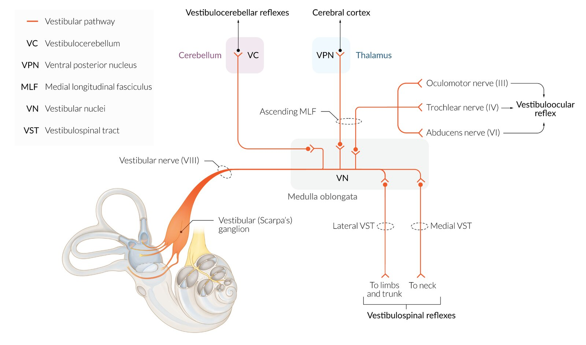

Vestibular pathways and reflexes

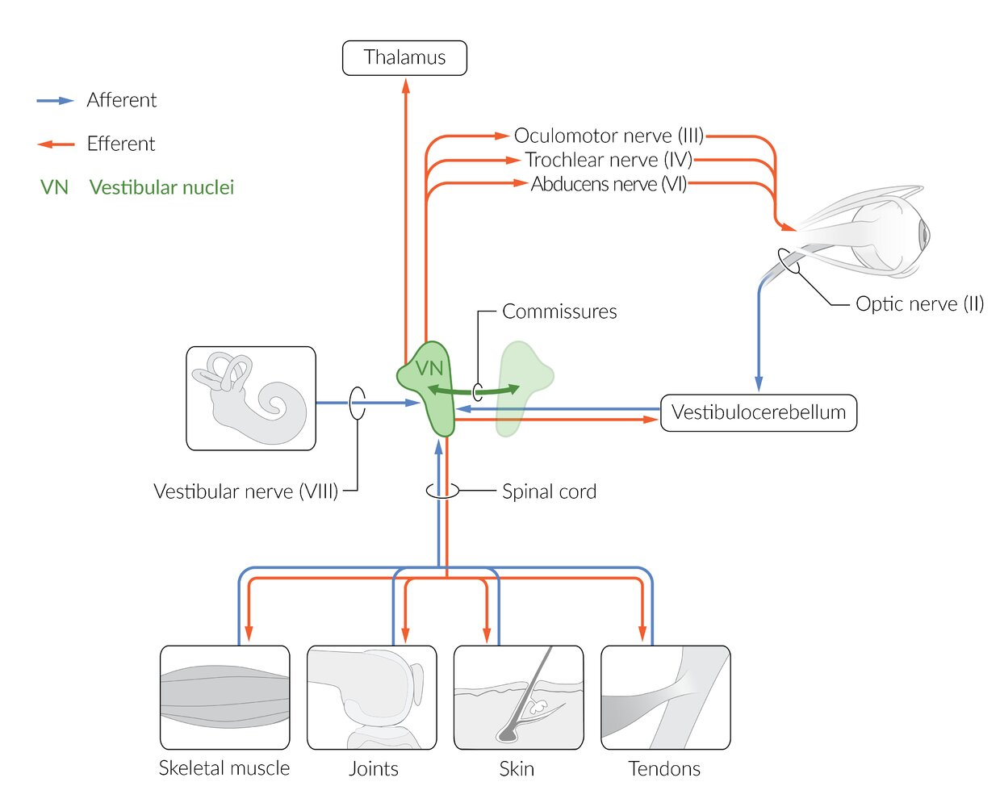

Afferent and efferent vestibular pathways

### Overview of <u>cranial nerve reflexes</u>

| Cranial nerve reflexes |  |  |  |  |
| --- | --- | --- | --- | --- |
| Reflex | Afferent limb | Efferent limb | Examination technique | Normal response |
| Pupillary reflex |  * <u>Optic nerve</u>   |  * <u>Oculomotor nerve</u>   |   * Note the <u>pupil</u> size and shape at rest.  * Consecutively illuminate the <u>pupils</u> with a flashlight, observing for direct and indirect reaction to light.    |  * <u>Pupillary</u> constriction   |
| Corneal reflex |  * <u>V1 of trigeminal nerve</u>   |  * <u>Facial nerve</u>   |  * Touch the <u>cornea</u> with a clean soft material (e.g., tissue, cotton ball)   |  * <u>Eye</u> closure (contraction of <u>orbicularis oculi muscle</u>)   |
| Conjunctival reflex |  * Touch the <u>conjunctiva</u> with a clean soft material (e.g., tissue, cotton ball)   |  |  |  |
| Lacrimation reflex |  * Touch the <u>conjunctiva</u> with a clean soft material (e.g., tissue, cotton ball)   |  * <u>Lacrimation</u>   |  |  |
| Jaw jerk reflex |  * V3 of <u>trigeminal nerve</u> (<u>muscle spindles</u> in <u>masseter muscle</u>)   |  * V3 of <u>trigeminal nerve</u> (motor efferents)   |   * Ask the patient to open their mouth slightly.  * Place a finger on their chin.  * Strike the finger with a reflex hammer.    |  * Slight movement of the <u>jaw</u> upwards (contraction of the <u>masseter muscle</u>)   |
| Gag reflex |  * <u>Glossopharyngeal nerve</u>   |  * <u>Vagus nerve</u>   |  * Touch the <u>posterior</u> wall of the <u>pharynx</u> with a <u>tongue</u> depressor.   |  * Elevation of the <u>palate</u>   |
| Cough reflex |  * <u>Vagus nerve</u> (<u>cough</u> <u>receptors</u> in <u>trachea</u> and large and medium diameter <u>bronchi</u>)   |   * <u>Vagus nerve</u>  * <u>Phrenic nerve</u>  * <u>Spinal nerves</u>    |  * Not routinely examined   |  * <u>Cough</u>   |

---

## Motor function

The motor system examination allows to quantify the degree of <u>motor function</u> impairment and often to differentiate between central and peripheral lesions. The fundamental elements of the examination include <u>muscle appearance</u>, muscle strength (power), tone, and reflexes.

| Upper motor neuron (UMN) injury vs. lower motor neuron (LMN) injury |  |  |
| --- | --- | --- |
|  | UMN lesion | LMN lesion |
| Definition |   * Lesion along the descending <u>motor pathways</u> (<u>pyramidal tracts</u>, i.e., <u>corticospinal tract</u> and/or <u>corticobulbar tract</u>)  * Typically above the <u>anterior horn cell</u> of the spinal cord or motor <u>nuclei</u> of the <u>cranial nerves</u> (e.g., motor cortex, <u>brain stem</u>)    |  * Lesion anywhere along the nerve fibers between the <u>anterior horn</u> of the spinal cord and relevant <u>muscle tissue</u>   |
| <u>Muscle appearance</u> |   * <u>Atrophy</u> is absent.  * <u>Fasciculations</u> are absent.    |   * <u>Atrophy</u>  * <u>Fasciculations</u>  [[2]](https://coursology-qbank.com/amboss/article/enbxH8)    |
| Characteristics |  * Central paresis (<u>spastic paresis</u>) is a condition characterized by the inability of voluntary movement in combination with:  * ↑ Tone (<u>clasp knife</u> phenomenon), <u>spasticity</u>, and <u>clonus</u>  * ↓ Power in muscle groups  * Hyperreflexia   |  * Peripheral paresis (<u>flaccid paresis</u>) is a condition characterized by the inability of voluntary movement in combination with:  * ↓ Tone (no <u>clasp knife</u> phenomenon)  * ↓ Power in single muscle fibers  * Hyporeflexia/areflexia   |
| <u>Bladder</u> function |  * <u>Detrusor</u> <u>hyperreflexia</u> and <u>detrusor</u>/<u>external urethral sphincter</u> <u>dyssynergia</u>   |  * <u>Overflow incontinence</u>   |
| <u>Babinski sign</u> |  * Upgoing (also referred to as present or positive)  * Big toe points upward while toes 2–5 fan out and downward  * Pathological response   |  * Downgoing (also referred to as absent or negative)  * Toes are neutral or point downward (including big toe)  * Physiological response   |
| Common etiologies |  * <u>Multiple sclerosis</u>, <u>tumor</u>, <u>stroke</u>, <u>vitamin B12 deficiency</u>, <u>ALS</u> (both <u>UMN</u> and <u>LMN</u> signs)   |  * Peripheral neuropathies, <u>poliomyelitis</u> (<u>poliovirus</u>), <u>ALS</u> (both <u>UMN</u> and <u>LMN</u> signs)   |

> [!NOTE]
> In LOWer motor <u>neuron</u> lesions, muscle mass, tone, power, and reflexes are LOW. In UPper motor <u>neuron</u> lesions, muscle tone, reflexes, and toes (<u>Babinski sign</u>) are UP.

---

## Appearance

### Findings [[1]](https://coursology-qbank.com/amboss/article/alaQvk)

* <u>Abnormal muscle movements</u> (see table below)

* Fasciculation

* Involuntary, asynchronous contraction of muscle fascicles within a single <u>motor unit</u>

* Usually benign but can signify a <u>lower motor neuron lesion</u>, which results in spontaneous <u>action potentials</u> and/or compensatory increase in the concentration of <u>nicotinic acetylcholine receptors</u> on <u>the cell</u> membrane located at the <u>neuromuscular junction</u>

* Catatonia: abnormal behavior and movement, often including <u>catalepsy</u>, purposeless motor activity, strange postures, <u>negativism</u>, and <u>mutism</u>

* Catalepsy: a state of muscular rigidity and immobility characterized by unresponsiveness to external stimuli

* Grossly disorganized behavior: inadequate goal-directed activity (e.g., purposeless movements) and emotional responses that seem bizarre to others (e.g., smiling or laughing in inappropriate situations)

* Motor stereotypies: rhythmic, repetitive movements; commonly seen in <u>stereotypic movement disorder</u>

* Abnormal posture

* <u>Atrophy</u> or <u>hypertrophy</u> (examined bilaterally)

* Muscle groups are measured to compare specific differences in size.

* In neurologic disorders with <u>lower motor neuron lesions</u>, such as <u>ALS</u>, the intrinsic hand muscles are often affected by <u>atrophy</u>.

### Overview of <u>abnormal muscle movements</u>

| Abnormal muscle movements |  |  |  |
| --- | --- | --- | --- |
| Disorder |  | Description | Causes |
| Myoclonus |  |  * A sudden involuntary twitch of a muscle or groups of muscles caused by muscular contraction or inhibition   |   * Metabolic abnormalities (e.g., <u>uremia</u>)  * <u>Creutzfeldt-Jakob disease</u>  * <u>Hypoxia</u> (e.g., <u>acute posthypoxic myoclonus</u>, <u>chronic posthypoxic myoclonus</u>)  * <u>Epilepsy syndromes</u> (e.g., <u>juvenile myoclonic epilepsy</u>, <u>Lennox-Gastaut syndrome</u>)  * Physiological (e.g., <u>hiccups</u>, <u>hypnic jerks</u>)    |
| Asterixis |  |   * An abrupt loss of muscle tone during sustained contraction (<u>negative myoclonus</u>)  * Can be assessed by asking the patient to extend their arms with eyes closed, <u>dorsiflex</u> their wrists, and spread their fingers: Affected patients will be unable to maintain the posture, resulting in a flapping motion of the hands.    |   * <u>Hepatic encephalopathy</u>  * <u>Uremic encephalopathy</u>  * <u>Hypercapnia</u>    |
| Akathisia |  |  * Subjective feeling of restlessness manifesting in the inability to stay still   |  * Use of medications (<u>dopamine antagonists</u> such as <u>neuroleptics</u> and <u>metoclopramide</u>, <u>SSRIs</u>)   |
| Athetosis |  |  * Involuntary writhing movements of the fingers, hands, feet, and, less commonly, arms, legs, and neck   |   * Lesions affecting <u>striatum</u>  * <u>Huntington disease</u>  * <u>Sydenham chorea</u>    |
| Chorea |  |  * Continuous, irregular movements of the extremities and trunk   |  |
| Dystonia |  |  * Sustained contraction of a muscle group leading to <u>abnormal posturing</u>, <u>tremor</u>, or both   |   * <u>Idiopathic</u> (e.g., <u>blepharospasm</u>)  * Task-specific <u>dystonia</u> (e.g., <u>writer's cramp</u>)  * Genetic (e.g., <u>torsion dystonia</u> resulting from DYT1 <u>gene</u> mutation)  * Degenerative disorders (e.g., <u>Huntington disease</u>)  * Metabolic disorders (e.g., <u>Wilson disease</u>)  * <u>Hypoxic</u> or structural cerebral injury    |
| <u>Tremor</u> | Rest |   * <u>Tremor</u> that occurs when muscles are relaxed  * <u>Pill-rolling</u> in <u>Parkinson disease</u>  * Improves with movement    |   * <u>Parkinson disease</u>  * Use of <u>dopamine antagonists</u> (<u>neuroleptics</u>, <u>metoclopramide</u>)    |
| Intention |  * A low-frequency <u>tremor</u> that occurs as the patient reaches the target of a voluntary and purposeful movement (e.g., reaching for a cup)   |  * Lesions and structural abnormalities that affect <u>cerebellar hemispheres</u>   |  |
| Postural |  * <u>Tremor</u> that occurs in limbs, trunk, or neck while maintaining a posture against gravity (e.g., while maintaining the hands outstretched)   |  * <u>Essential tremor</u>   |  |
| Ballismus |  |   * A high-amplitude movement of the extremities, potentially of a flailing or kicking quality  * Typically unilateral (<u>hemiballismus</u>)    |  * Lesions of the <u>subthalamic nucleus</u>   |
| Tic |  |   * Recurrent sudden, nonrhythmic movements (motor <u>tics</u>) or vocalizations (vocal <u>tics</u>)  * Generally preceded by a strong urge to move  * Usually involuntary but may be temporarily suppressible     |   * <u>Tic disorders</u> (e.g., <u>Tourette syndrome</u>)  * <u>Sydenham chorea</u>  * <u>Huntington disease</u>    |

---

## Power

* Definition: maximal effort a patient is able to exert from an individual muscle or group of muscles

* Assessment

* The patient is asked to flex and extend the extremities against resistance.

* Muscle power tests should be performed bilaterally for comparison.

* Muscle power grading

* 0: no contraction (complete <u>paralysis</u>)

* 1: flicker or trace of contraction

* 2: active movement, with gravity eliminated

* 3: active movement against gravity

* 4: active movement against gravity and moderate resistance

* 5: normal power (i.e., full <u>range of motion</u> against gravity and full resistance)

* Patterns of <u>paresis</u> distribution 

* Quadriparesis: <u>weakness</u> in all four limbs

* Hemiparesis: <u>weakness</u> in half of the body

* Paraparesis: <u>weakness</u> affecting both lower extremities

* Monoparesis: <u>paresis</u> affecting a single limb

* For further detail, see “<u>Weakness patterns and associated lesions</u>.”

* Special tests

* Pronator drift test

* The patient is asked to raise both arms horizontally up to shoulder level, palms facing upwards, with the eyes closed (for 30 seconds).

* The test is positive when there is asymmetric <u>pronation</u> and drifting movement of the arms:

* <u>Pronation</u> and downwards drift indicate <u>upper motor neuron lesion</u>.

* <u>Pronation</u> and upwards drift indicate <u>cerebellar</u> lesion.

* Mingazzini test

* The patient is asked to lie in the <u>supine position</u>, with eyes closed, and is asked to raise and hold both legs for 30 seconds (90° angle at knee and hip).

* Lowering of one leg is indicative of subtle <u>paresis</u>.

|  Segmental motor testing  |  |  |
| --- | --- | --- |
| Muscle |  Innervation  |  Movement  |
| Upper extremity |  |  |
| Deltoid |  C5–C6 (<u>axillary nerve</u>) |  <u>Abduction</u> of upper arm to horizontal level |
| <u>Biceps brachii</u> |  C5–C7 (<u>musculocutaneous nerve</u>) |  <u>Flexion</u> of the forearm at <u>elbow</u>  |
| <u>Triceps brachii</u> |  C6–C8 (<u>radial nerve</u>) | Extension of the forearm at <u>elbow</u>  |
| <u>Flexor carpi ulnaris</u> |  C8–T1 (muscular branches of the <u>ulnar nerve</u>) |  <u>Palmar flexion</u> of the hand at wrist |
| Extensor carpi radialis |  C5–C8 (<u>radial nerve</u>) |  <u>Dorsiflexion</u> of the hand at wrist |
| Abductor pollicus brevis |  C8–T1 (<u>median nerve</u>) | Thumb <u>abduction</u>  |
| <u>Interossei</u> |  C8–T1 (deep branch of the <u>ulnar nerve</u>) | Finger <u>abduction</u>  |
| Lower extremity |  |  |
| <u>Iliopsoas</u> |  L1–L3 (<u>femoral nerve</u>) |  <u>Flexion</u> of the leg at hip |
| <u>Quadriceps femoris</u> |  L2–L4 (<u>femoral nerve</u>) | Extension of the leg at knee |
| <u>Hamstrings</u> |  L5–<u>S2</u> (<u>sciatic nerve</u>) |  <u>Flexion</u> of the leg at knee |
| <u>Tibialis anterior</u> |  L4–L5 (<u>deep peroneal nerve</u>) | Foot <u>dorsiflexion</u>  |
| <u>Gastrocnemius</u> |  <u>S1</u>–<u>S2</u> (<u>tibial nerve</u>) | Foot <u>plantar flexion</u>  |

References:[[3]](https://coursology-qbank.com/amboss/article/blaHvk)

---

## Reflexes

A <u>tendon reflex</u> is a single monosynaptic reflex (stretch). The reflex arc consists of only one synapsis connecting two <u>neurons</u>: an afferent sensory <u>neuron</u> and an efferent motor <u>neuron</u>.

### Deep tendon reflexes (<u>DTR</u>)

* Definition: a reflex to test the integrity of a sensory and motor <u>neuron</u> circuit

* Assessment  

* During reflex testing, the patient should be relaxed.

* Upon tapping of the reflex hammer, activation of the <u>dorsal root ganglion</u> causes firing of the <u>lower motor neuron</u> for the <u>agonist</u> muscle and relaxation of the <u>antagonist</u> muscle, resulting in automatic movement.

* Interpretation

* An increased <u>DTR</u> indicates an <u>upper motor neuron</u> issue, whereas decreased <u>DTR</u> indicates an <u>LMN</u>, <u>neuromuscular junction</u>, or muscle issue.

* Older patients may have reduced or absent lower <u>DTR</u> due to normal <u>aging</u>-related changes in muscles and <u>tendons</u>

* Reinforcing maneuvers (e.g., Jendrassik maneuver) can be used to elicit a reflex that initially seems to be absent.

|  <u>Deep tendon reflex</u> testing   |  |  |  |
| --- | --- | --- | --- |
| <u>Nerve root</u> |  | <u>Tendon reflex</u> | Test |
| Upper limbs | C5–C6 | Biceps reflex | First, the examiner places his/her thumb on the patient's <u>biceps</u> <u>tendon</u>, then the examiner strikes his/her thumb with a reflex hammer and observes the patient's forearm movement. |
| Brachioradialis reflex | Striking the lower end of the radius with a reflex hammer elicits movement of the forearm. |  |  |
| C7–C8 |  |  |  |
| Triceps reflex | The examiner holds the patient's arm (forearm hanging loosely at 90° position) and taps the <u>triceps</u> <u>tendon</u> with a reflex hammer to induce an extension in the <u>elbow joint</u>. |  |  |
| Lower limbs | L2–L4 | Adductor reflex | Tapping the <u>tendon</u> on the <u>medial epicondyle</u> of <u>femur</u> elicits the <u>adductor reflex</u>. |
| Knee reflex | Striking the <u>tendon</u> just below the patella (leg is slightly bent) induces knee extension. |  |  |
| L5 | Posterior tibial reflex | The <u>tibialis posterior</u> muscle is tapped with a reflex hammer, either just above or below the <u>medial malleolus</u>. The reflex is positive when an <u>inversion of the foot</u> occurs. |  |
| <u>S1</u>–<u>S2</u> | Ankle reflex | Striking the <u>Achilles tendon</u> with a reflex hammer elicits a jerking of the foot towards its <u>plantar</u> surface. Alternatively, the reflex is triggered by tapping the ball of a foot from the <u>plantar</u> side. |  |

|  <u>Deep tendon reflex</u> scale [[4]](https://coursology-qbank.com/amboss/article/tMbXq8) |  |  |
| --- | --- | --- |
|  Grade  | Description | Interpretation |
| 0 |  * No response even with reinforcement (areflexia)   |   * Abnormal  * If combined with <u>weakness</u> of muscles and decreased muscle tone, suggests <u>LMN</u> and/or <u>peripheral nerve lesions</u>  * Isolated <u>hyporeflexia</u> can be seen in <u>Miller-Fisher syndrome</u>. [[5]](https://coursology-qbank.com/amboss/article/WnbPH8)    |
| 1+ |   * Response is present and detectable but is weak (<u>hyporeflexia</u>).  * Alternatively, the response is only elicited with <u>reinforcement maneuvers</u>.    |  * Considered normal if none of the following features is present:  * A substantial asymmetry between sides  * Difference between the upper and lower extremities  * Other signs of <u>LMN lesion</u> affecting the same zone   |
| 2+ |  * Brisk response   |  * Normal   |
| 3+ |  * Very brisk response (<u>hyperreflexia</u>)   |  * Considered normal if none of the following features is present:  * A substantial asymmetry between sides  * Difference between the upper and lower extremities  * Other signs of <u>UMN lesion</u> affecting the same zone   |
| 4+ |  * A repeating reflex (<u>clonus</u>)   |   * Abnormal  * Suggests <u>UMN lesion</u> when combined with the following: <u>muscle weakness</u>, increased muscle tone, and pathological reflexes    |

> [!NOTE]
> Use the following poem to remember which <u>nerve roots</u> correspond to which reflexes:
> <u>S1</u>–<u>S2</u>
> Buckle my shoe (<u>ankle reflex</u>)
> L2–L4
> Kick the door (<u>knee reflex</u>)
> C5–C6
> Pick up sticks (<u>biceps reflex</u> and <u>brachioradialis reflex</u>)
> C7–C8
> Lay them straight (<u>triceps reflex</u>)

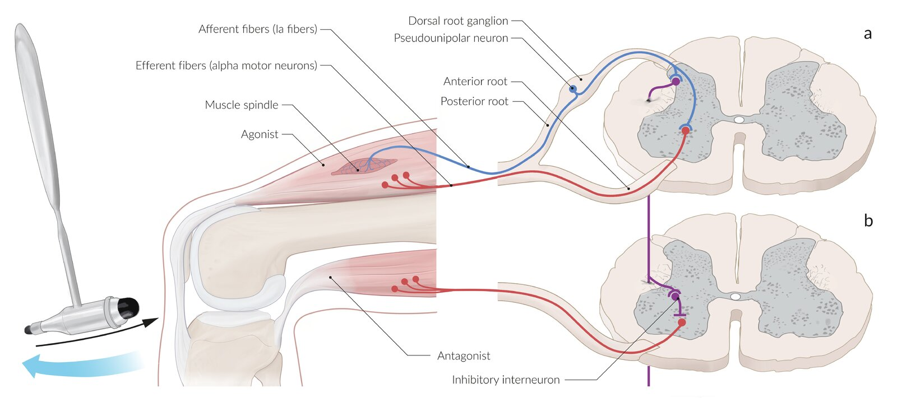

Stretch reflex

Deep tendon reflexes

### Superficial reflexes

* Definition: polysynaptic reflexes elicited by stimulation of the <u>skin</u>

* Interpretation: <u>superficial reflexes</u> are considered

* Physiological, when there is a contraction of a group of muscles after the stimulation

* Pathological, when there is reduced or no contraction as a consequence of <u>lower motor neuron</u> injury and/or the reflex arc

| <u>Superficial</u> reflex testing |  |  |
| --- | --- | --- |
| <u>Nerve root</u> | Reflex | Test |
| T6–T12 |  * Abdominal reflex   |   * Abdominal reflexes are tested with the patient lying down. The <u>anterior abdominal wall</u> is lightly stroked with a spatula from <u>lateral</u> to <u>medial</u> (bilaterally) in the following areas:  * Below the <u>costal arch</u>  * Around the <u>umbilicus</u>  * Above the <u>inguinal ligament</u>  * A normal response is the contraction of the abdominal muscles, while the absence of contractions is indicative of <u>nerve root</u> damage.    |
| L1–L2 |  * Cremasteric reflex   |   * The reflex is elicited by stroking the <u>medial</u>, inner part of the thigh.  * A normal response is contraction of the cremaster muscle that pulls up the <u>testis</u> on the same side of the body.    |
| <u>S3</u>–S5 |  * Anal reflex (<u>anal wink</u>)   |  * Stroking the <u>skin</u> around the <u>anus</u> with a spatula elicits the <u>anal reflex</u>, which results in contraction of the anal sphincter muscles.   |
|  * Bulbocavernosus reflex   |  * The reflex is elicited by squeezing the <u>glans penis</u> or <u>clitoris</u>, resulting in contractions of the <u>pelvic floor</u> muscles.   |  |

> [!NOTE]
> Use the following poem to remember some of the <u>superficial reflexes</u>:
> L1–L2
> <u>Testicle</u> move (<u>cremasteric reflex</u>)
> <u>S3</u>–S5
> Winking by (<u>anal wink</u> reflex)

### <u>Primitive reflexes</u>

* Definition: a type of reflex that is normal in <u>newborns</u> and <u>infants</u>, but not in adults

* When present in adults, they may indicate diffuse <u>brain injury</u> due to a lack of common inhibiting factors.

* See “<u>Child development and milestones</u>.”

* Corticospinal tract signs

* Indicate damage to the <u>pyramidal tract</u>

* <u>Babinski sign</u> is the most common and thus most reliable <u>pyramidal tract sign</u>.

* Although these reflexes are a normal physiological response in healthy <u>infants</u>, they are pathological in adults.

| Overview of most important <u>corticospinal tract signs</u> |  |  |  |
| --- | --- | --- | --- |
| Sign |  | Test | Result |
| Upper limb signs |  |  |  |
| Finger flexor reflex | Tromner sign |  * The examiner taps the terminal <u>phalanx</u> of a relaxed finger (usually the middle finger) on the <u>palmar</u> side while holding the patient's hand in level with the <u>proximal</u> <u>phalanges</u>.   |  * The sign is positive when either of the following is present  * There is significant <u>flexion</u> in the terminal <u>phalanx</u> of the tapped finger and the thumb  * When the <u>flexion</u> is very asymmetrical comparing both hands.   |
| Hoffmann sign |  * The examiner flicks the <u>nail</u> of the middle finger downward while loosely holding the patient's hand, allowing it to flick upward reflexively.   |  * The sign is positive when there is quick <u>flexion</u> and <u>adduction</u> of the thumb and/or index finger on the same hand.   |  |
| Lower limb signs |  |  |  |
| Babinski sign |  |  * The examiner <u>strokes</u> the sole of the patient's foot on the <u>lateral</u> edge using, e.g., the handle of a reflex hammer.   |   * The sign is positive (i.e. upgoing/present/pathological) when the big toe extends (<u>dorsiflexes</u>), while the other toes fan out.  * An exception are children up to the age of 2 years, in which case an upgoing <u>Babinski sign</u> is considered physiological.  * The test is inconclusive when only the big toe responds.    |
| Gordon sign |  |  * The examiner compresses the calf muscles.   |  |
| Oppenheim sign |  |  * The examiner <u>strokes</u> the patient's <u>anterior</u> <u>tibia</u> downward.   |  |
| Schaeffer sign |  |  * The examiner squeezes the <u>Achilles tendon</u>.   |  |

> [!TIP]
> <u>Babinski sign</u>, although normal in <u>newborns</u> and <u>infants</u>, is always pathological in adults.

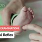

Babinski Reflex in Infants - Clinical Examination

---

## Tone

* Definition: resistance of an individual muscle (or a group of muscles) to passive stretching

* Assessment: passive movement of the extremities

* Upper limb

* <u>Elbow</u>: The examiner flexes and fully extends the patient's <u>elbow</u>.

* Forearm: With the <u>elbow</u> in the 90° position, the examiner <u>supinates</u> and <u>pronates</u> the patient's hand.

* Wrist: The examiner flexes and extends and then twist the patient's wrist from side to side.

* Lower limb: The patient is asked to relax the limbs while lying in the <u>supine position</u>. The examiner then rolls the legs from side to side.

* Findings [[4]](https://coursology-qbank.com/amboss/article/tMbXq8)[[6]](https://coursology-qbank.com/amboss/article/l5Yv4p)

* <u>Spasticity</u>: characteristic of <u>pyramidal tract</u> lesions

* <u>Velocity</u>-dependent phenomenon: <u>Spasticity</u> is more pronounced with increased speed of movement.

* <u>Clasp knife phenomenon</u>: initial resistance due to increased muscle tone is followed by a sudden decrease in resistance

* See “<u>Spasticity</u>”

* Rigidity: suggests abnormalities of the <u>extrapyramidal system</u>

* <u>Velocity</u>-independent phenomenon

* Lead pipe rigidity: an increase in tone that is constant throughout the passive movement

* <u>Cogwheel rigidity</u>

* Extreme stiffness of the <u>joint</u> of the limb that makes movement difficult

* When the examiner flexes or extends the limb, the movement is jerky, resembling the ratcheted rotation of a cogwheel

* Hypotonia

* A decrease in muscle tone

* Can occur in <u>peripheral nervous system</u> lesions (e.g., <u>polyneuropathy</u>), <u>lower motor neuron lesions</u> (e.g., <u>spinal muscular atrophy</u>), or <u>cerebellar</u> lesions

* Paratonia: a change in tone that is uneven throughout the passive movement due to involuntary opposition or facilitation by a patient

* Occurs in patients with <u>frontal lobe</u> dysfunction (e.g., due to trauma, <u>stroke</u>, <u>tumor</u>, <u>neurodegenerative disorders</u> such as <u>frontotemporal dementia</u>)

* The degree of <u>paratonia</u> increases with the speed of passive movement, the amount of applied force, and with attempts to relax the patient.

* Oppositional paratonia: an apparent increase in tone due to the patient's involuntary resistance to movement

* Facilitatory paratonia: an apparent decrease in tone due to the patient's involuntary assistance to movement

* Clonus: a series of involuntary, rhythmic muscular contractions 

* Patellar clonus: The examiner grasps the patient's patella between the index finger and the thumb, quickly pushes it down distally, and then holds it in this position.

* Foot clonus

* The examiner holds the patient's leg, with both knee and ankle resting in a 90° <u>flexion</u>.

* Then the examiner proceeds to <u>dorsiflex</u> and partially evert the foot forcefully multiple times while sustaining the pressure.

* Wrist <u>clonus</u>: The examiner hyperextends the patient's wrist.

* Modified Ashworth scale: a scale that is most commonly used for assessment of the muscle tone [[7]](https://coursology-qbank.com/amboss/article/F5bgN8)

* 0: no increase in muscle tone

* 1: slight increase in muscle tone, with minimal resistance at the end of the range of passive motion

* 1+: slight increase in muscle tone followed by abrupt resistance (catch) that continues through the remainder (less than half) of the movement

* 2: a marked increase in muscle tone throughout most of the <u>range of motion</u>, but passive movement is easy

* 3: considerable increase in muscle tone, with passive movement difficult

* 4: affected parts rigid in <u>flexion</u> or extension

> [!TIP]
> Do not confuse <u>clonus</u> with <u>myoclonus</u>. <u>Myoclonus</u> is arrhythmical and defined by sudden jerks of a muscle or group of muscles, while <u>clonus</u> is rather rhythmic and defined by repetitive contractions and relaxations of a muscle group. Moreover, <u>myoclonus</u> is usually associated with metabolic abnormalities (e.g., renal and <u>liver</u> failure).

---

## Sensory function

<u>Examination of the sensory system</u> is aimed at evaluating any abnormality affecting the patient's perception to provoked sensations like touch, <u>pain</u>, and temperature. In contrast to <u>motor function</u>, sensation is subjective to the patient and therefore the interpretation of the exam strongly depends on the patient accurately reporting what they experience.

For more information about the patterns of sensory loss in <u>spinal cord lesions</u>, see “Overview” in “<u>Incomplete spinal cord syndromes</u>.”

|  Focused examination of sensation [[1]](https://coursology-qbank.com/amboss/article/alaQvk)[[8]](https://coursology-qbank.com/amboss/article/claaDk)  |  |  |  |  |
| --- | --- | --- | --- | --- |
| Modality |  | Pathway | Assessment | Finding |
| Tactile sense |  Sharp/dull discrimination and <u>pain</u> [[9]](https://coursology-qbank.com/amboss/article/OMcIK10)[[10]](https://coursology-qbank.com/amboss/article/lMcvK10)  |   * Dull sensation: <u>dorsal columns</u>  * Sharp sensation/<u>pain</u>: <u>spinothalamic tract</u>    |   * To test for dull sensation, the examiner applies an object with a dull end (e.g., cotton bud, spatula) to areas of the body where nerve lesions are suspected (e.g., the hands and feet in individuals with <u>type 2 diabetes</u>).  * To test for sharp sensation and/or <u>pain</u> sensation, the examiner applies an object with a sharp end (e.g., sterile safety pin, broken spatula, toothpick) to the patient's extremities.    |   * Paresthesia: a spontaneous abnormal sensation (e.g., tingling, prickling, "pins and needles")  * Dysesthesia: an abnormal unpleasant sensation (e.g., itching, burning, <u>pain</u>, <u>electric shock</u>) evoked by a <u>neutral stimulus</u> (e.g., a <u>light touch</u> on the surface of the patient's ankle)  * Allodynia: a subtype of <u>dysesthesia</u> that manifests with a painful sensation triggered by a stimulus that is ordinarily painless  * Hyperesthesia: a subtype of <u>dysesthesia</u> that manifests with an exaggerated perception of sensory stimuli  * Hypesthesia: decreased perception of sensory stimuli (anesthesia is the most extreme case of <u>hypesthesia</u>)    |
| Light touch |   * <u>Dorsal columns</u>  * <u>Proprioception</u> only: <u>spinocerebellar tract</u> (see “<u>Unconscious proprioception</u>”)    |   * To test for symmetry of touch sensation, the examiner touches the patient's body at different locations bilaterally.  * In cases of suspected radicular lesions, the particular <u>dermatome</u> should be examined individually.  * In cases of suspected <u>peripheral nerve lesions</u>, diagnostics should involve checking the areas innervated by the corresponding sensory nerves.  * Monofilament test can be used to quantitatively assess <u>light touch sensation</u>.   [[11]](https://coursology-qbank.com/amboss/article/mMbV68)[[12]](https://coursology-qbank.com/amboss/article/5Mbi68)    |  |  |
|  Pallesthesia (<u>vibration sense</u>) |  |   * A tuning fork is hit and placed on a bony projection (e.g., <u>medial malleolus</u>).  [[13]](https://coursology-qbank.com/amboss/article/MMbM68)  * The vibration amplitude and thus the vibration intensity decrease over time.  * The patient reports when the vibration stops.    |  * Pallhypesthesia: diminished or lost sense of <u>vibration sense</u> (e.g., due to trauma, <u>peripheral neuropathy</u>, <u>myelopathy</u>)   |  |
|  Proprioception (<u>joint</u> position) |  |   * To test <u>proprioception</u>, the most <u>distal</u> <u>joint</u> of the big toe or the <u>distal interphalangeal joint</u> of the thumb is held at the sides and moved up and down.  * The patient should be able to identify the positional change with eyes closed.    |  * Abnormalities of <u>proprioception</u>: diminished or lost sense of <u>proprioception</u> (e.g., due to peripheral <u>polyneuropathy</u> or <u>myelopathy</u>)   |  |
| Temperature sensation |  |  * <u>Spinothalamic tract</u>   |  * To test for <u>temperature sensation</u>, the examiner applies two objects of different temperatures (e.g., a test tube filled with cold water and a test tube filled with warm water) to the patient's forearms and/or shanks.   |   * Hypoalgesia: decreased <u>sensitivity</u> to <u>nociceptive</u> stimuli  * Hyperalgesia: increased <u>sensitivity</u> to <u>nociceptive</u> stimuli    |

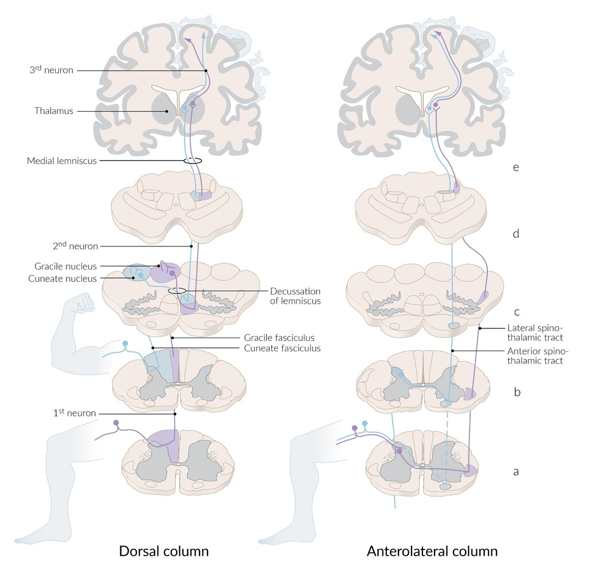

Ascending sensory tracts of the spinal cord

Dermatome map

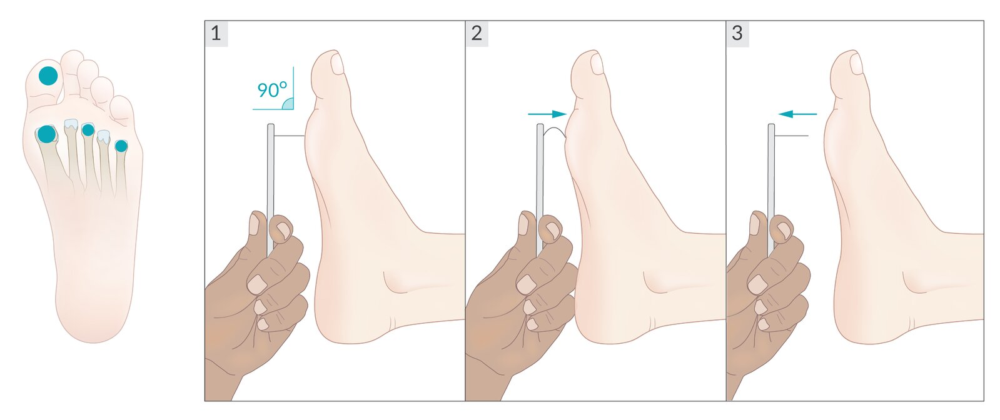

Monofilament test

---

## Coordination

### General considerations

* The following tests are used to test for the ability to coordinate movements, which depend on <u>cerebellar</u> and <u>basal ganglia</u> function, proprioceptive input, and muscle power.

* Limb ataxia: a lack of coordination of voluntary movements of the upper and lower extremities, is the main finding; most commonly results from lesions in the <u>cerebellar hemispheres</u>. [[1]](https://coursology-qbank.com/amboss/article/alaQvk)

### Finger-to-nose test and finger-to-finger test

* Procedure

* <u>Finger-to-nose test</u>: The patient is asked to touch the tip of their nose with the index finger

* <u>Finger-to-finger test</u>: The patient is asked to alternate between touching the tip of their nose and the examiner's finger as quickly as possible with the index finger

* The tests should be performed once with the patient's eyes open and again with the eyes closed

* Findings

* Normally, the patient would be able to reach the target (either their nose or examiner's finger) without <u>tremor</u> or overshoot.

* Patients with <u>dysmetria</u>  are unable to touch the tip of their nose with their index finger.

* Improvement of test results with eyes open indicates visual compensation of <u>dysmetria</u>, which is characteristic of sensory impairment.

* In patients with <u>intention tremor</u>, the fingers will begin to shake just as they reach their nose.

* Patients with kinetic <u>tremor</u> will have a <u>tremor</u> throughout the movement.

### Heel-knee-shin test

* Procedure: The patient is asked to touch the opposite knee with a heel and slide down the shin.

* Findings

* Normally, the patient will be able to slide the heel of one foot down the shin of the opposite leg.

* In patients with <u>dysmetria</u>, the heel will deviate to alternate sides , which indicates that the patient has <u>limb ataxia</u>.

### Rapid alternating movement test

* Procedure: The patient is asked to rapidly screw in a large imaginary light bulb using both hands.

* Findings

* Normally, a patient is able to perform the movement.

* Patients with dysdiadochokinesia are unable to perform rapidly alternating agonistic-antagonistic movements and thus perform the test slowly, in an uncoordinated manner.

---

## Gait assessment

Multiple systems are required for proper walking, such as those responsible for sensory and motor functions (including reflexes), as well as the <u>cerebellum</u> and the <u>vestibular system</u>. During the examination of the patient's gait, particular attention should be paid to body and limb posture (e.g., base of support and arm swing), steps (length, speed, and rhythm), steadiness, and turning.

### Gait examination

See also "<u>Pediatric gait</u>."

|  Overview [[14]](https://coursology-qbank.com/amboss/article/_nb5D8) |  |  |  |
| --- | --- | --- | --- |
| Test | Purpose | Examination | Interpretation |
| <u>Observation of casual gait</u> |  * Detection of gait abnormalities   |  * The patient is asked to walk a few steps forward and backward.   |  * Normal gait is steady with natural arm swing.   |
|  Heel to <u>toe walking</u>   |  * Assessment of <u>gait ataxia</u> (vestibular, sensory, or <u>cerebellar</u>)   |  * The patient is asked to place one foot directly in front of the other as if walking on a tightrope.   |  * The test is positive when the patient is unable or has difficulty in placing one foot directly in front of the other.   |
| <u>Foot drop</u> test |  * Test for assessing <u>neuropathic gait</u>   |  * The patient is asked to walk on his/her heels.   |  * The test is positive when the patient is unable to walk on his/her heels, which may be indicative of <u>deep fibular nerve</u> lesions or peripheral neuropathies.   |
| Walking on tiptoes |  * The patient is asked to walk on his/her toes.   |  * The test is positive when the patient is unable to walk on his/her toes, which may indicate <u>tibial nerve</u> lesions or peripheral neuropathies.   |  |
| Romberg test |   * Test to differentiate between the causes of truncal ataxia  * Used to distinguish between sensory and <u>cerebellar ataxia</u>    |  * The patient is asked to stand with both feet together, raise the arms, and close the eyes.   |   * Positive Romberg  * The patient's coordination is impaired when the eyes are closed and the patient starts swaying or swaying increases  * Indicates <u>sensory ataxia</u>  * An increased tendency to fall sideways after closing the eyes can also indicate a vestibular disorder. In the case of a unilateral vestibular disorder, the patient usually falls towards the side of the lesion.  * Negative Romberg  * Closing the eyes does not affect the patient's balance (i.e., swaying does not increase).  * Uncontrollable swaying, even with the eyes open, is indicative of <u>cerebellar ataxia</u>.    |
| Unterberger test |  * Test for detecting vestibular impairment which may indicate the presence of vestibular lesions   |  * The patient is asked to close their eyes with arms outstretched and march in place for 50 steps.   |   * The test is positive when the patient rotates more than 30° around their central axis.  * A positive test indicates a unilateral vestibular impairment.    |
| Trendelenburg sign |  * Test for neurological insufficiency of the <u>gluteus medius</u> and <u>gluteus minimus muscles</u>, which are innervated by the <u>superior gluteal nerve</u>   |  * The patient is asked to stand on one leg.   |   * Negative <u>Trendelenburg sign</u> (physiological): The <u>pelvis</u> remains level as it is stabilized by the <u>gluteus medius</u> and minimus.  * Positive <u>Trendelenburg sign</u> (pathological): Because of insufficiency of the <u>gluteus medius</u> and minimus on the side of the standing leg, the <u>pelvis</u> drops towards the <u>contralateral</u>, unimpaired side.  * Duchenne sign: The torso tilts toward the <u>contralateral</u> side, compensating the <u>pelvic</u> drop on the unimpaired side.  * Duchenne limp: The <u>Duchenne sign</u>, which frequently occurs bilaterally, results in a compensatory to‑and‑from movement of the torso during walking.    |

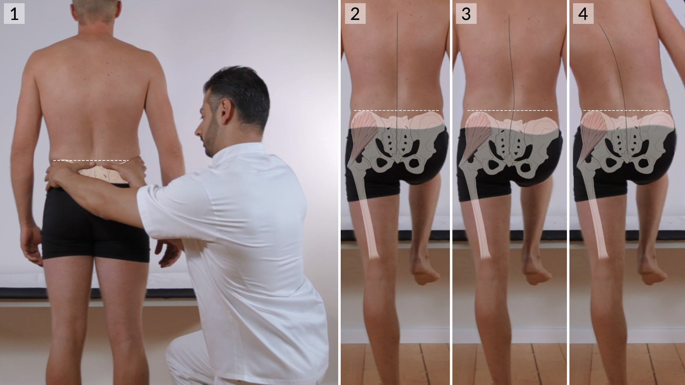

Trendelenburg and Duchenne signs

### <u>Abnormal gait patterns</u>

|  Overview of <u>abnormal gait patterns</u> [[14]](https://coursology-qbank.com/amboss/article/_nb5D8) |  |  |  |  |
| --- | --- | --- | --- | --- |
| Type |  | Description |  | Associated disease |
| Hemiplegic gait |  |   * Loss of natural arm swing and dragging of the affected leg in a semicircle (<u>circumduction</u>)  * On the affected side, the arm may be flexed, <u>adducted</u>, and <u>internally rotated</u>, while the leg is extended and the foot is plantarflexed.    |  |  * <u>Stroke</u>   |
| Myopathic gait |  |   * Drop of the <u>pelvis</u> on the unaffected side (<u>Trendelenburg sign</u>) or on both sides (waddling) when walking.  * Respectively caused by unilateral or bilateral <u>weakness</u> of one or multiple <u>pelvic girdle</u> muscles (especially gluteus muscles)    |  |  * <u>Myopathies</u> (e.g., <u>muscular dystrophies</u>, <u>inflammatory myopathies</u>)   |
| Neuropathic gait |  |  * Seen in patients with unilateral or bilateral <u>foot drop</u> (i.e., <u>weakness</u> of foot <u>dorsiflexion</u>) who lift one or both legs when walking, respectively, in order to prevent the foot dragging on the floor.   |  |   * Unilateral: <u>peroneal nerve</u> palsy, <u>L5 radiculopathy</u>  * Bilateral: <u>amyotrophic lateral sclerosis</u>, peripheral neuropathies (e.g., <u>Charcot-Marie-Tooth disease</u>, <u>diabetic neuropathy</u>)    |
| Ataxic gait | <u>Cerebellar</u> <u>ataxic gait</u> |  * Unsteady and wide-based gait with irregular, uncoordinated movements   |   * Staggering gait  * Inability to walk from heel to toe or in a straight line    |   * <u>Cerebellar</u> diseases  * <u>Acute alcohol intoxication</u>    |
| Sensory ataxic gait |   * Stooped, stomping gait  * Gait is exacerbated when patients cannot see their feet (e.g., in the dark)  * <u>Romberg test</u> is positive.    |   * Disorders of the <u>dorsal columns</u> (e.g., <u>vitamin B12 deficiency</u>, <u>tabes dorsalis</u>)  * Peripheral neuropathies    |  |  |
| Parkinsonian gait |  |   * Small, slow steps (<u>bradykinesia</u>), shuffling, and sometimes accelerating, with the head, neck, and trunk leaning forward and <u>flexion</u> at the knees  * Difficulty initiating steps (rigidity)    |  |   * <u>Parkinson disease</u>  * <u>Parkinsonism</u> (e.g., due to medications, repeated <u>head trauma</u>)    |
| Gait apraxia |  |   * Inability to raise the foot off of the floor (<u>magnetic gait</u>), resulting in shuffling  * Poor balance and truncal mobility  * Difficulty initiating steps    |  |   * Bilateral <u>frontal lobe</u> disorders  * <u>Cerebrovascular disease</u>    |
| <u>Choreiform</u> gait |  |  * Walking associated with irregular, jerky, involuntary movements in the limbs   |  |   * <u>Huntington disease</u>  * <u>Sydenham chorea</u>    |

---

## Meningism

* Definition: the triad of

* Nuchal rigidity (stiff neck): inability to flex the neck forward

* <u>Headache</u>

* <u>Photophobia</u>

* Examination

* Kernig sign: In a <u>supine</u> patient, extension of the knee when the thigh is flexed at the hip causes <u>pain</u> (knee at a 90° angle).

* Brudzinski sign: In a <u>supine</u> patient, passive <u>flexion</u> of the neck provokes involuntary lifting of both legs.

* Etiology: : due to inflammatory (bacterial/viral <u>meningitis</u>; ) or noninflammatory (e.g., <u>subarachnoid hemorrhage</u>) causes

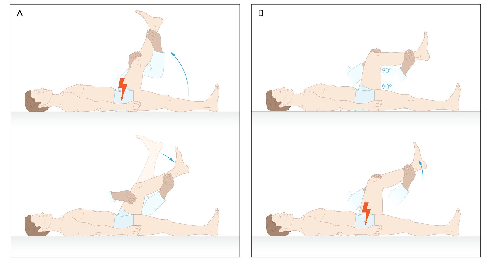

Kernig sign

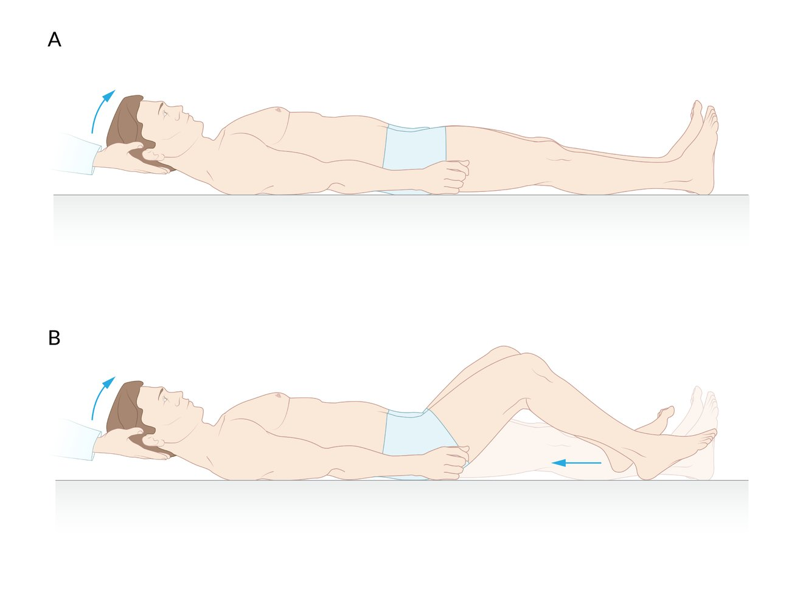

Brudzinski sign

---

## Signs of nerve root irritation

<u>Signs of nerve root irritation</u> indicate an inflammatory and/or irritative process occurring at the point where the <u>spinal nerves</u> exit the <u>vertebral column</u>. Testing for <u>signs of nerve root irritation</u> can help determine suspected spinal root compression (e.g., by a <u>tumor</u> or <u>herniated disk</u>).

* Examination

* <u>Straight leg raise test</u> (root L5–<u>S1</u>): In a <u>supine</u> patient, lifting the extended leg (< 45°) induces <u>pain</u> along the distribution of the lumbar roots (i.e., <u>back pain</u> radiating down the <u>ipsilateral</u> leg).

* <u>Crossed straight leg raise test</u>: In a <u>supine</u> patient, lifting the extended leg that is <u>contralateral</u> to the suspected lesion induces <u>pain</u> radiating to the motor and sensory area of the affected <u>nerve root</u> in the leg <u>ipsilateral</u> to the lesion.

* See “Diagnostics” in “<u>Degenerative disk disease</u>.”

* Etiology: conditions that can lead to compression of the <u>nerve roots</u> (e.g., <u>degenerative disk disease</u>, spinal <u>tumor</u>, <u>spinal epidural hematoma</u>)

Straight leg raise tests

---

## Nystagmus

### Definition

<u>Nystagmus</u> is an involuntary, repetitive, and twitching movement of one or both eyes.

### Classification

There are several types of <u>nystagmus</u>. The most commonly seen ones are listed below. [[15]](https://coursology-qbank.com/amboss/article/d5XoQA)[[16]](https://coursology-qbank.com/amboss/article/LoXwc_)

* Jerk nystagmus: a slow movement of the eyes towards a defined direction followed by a fast, corrective movement backward (the name of the <u>nystagmus</u> is determined by the direction of movement in the fast phase, i.e., left-beating, right-beating, downbeat, upbeat) 
* End-gaze nystagmus

* A physiological horizontal <u>jerk nystagmus</u> caused by maintenance of extreme <u>eye</u> position

* In contrast, <u>gaze-evoked nystagmus</u> is caused by maintenance of eccentric <u>eye</u> positions

* Horizontal nystagmus: a type of <u>jerk nystagmus</u> in which the eyes move horizontally 

* Apogeotropic nystagmus

* A variant of <u>horizontal nystagmus</u> in which the eyes beat toward the ceiling (or the nondependent <u>ear</u>) when the head is turned from side to side with the patient in <u>supine position</u>

* Can be elicited using the <u>supine roll maneuver</u> in patients with <u>lateral semicircular canal BPPV</u>; and, in association with a downbeat component, in patients with <u>cerebellar</u> or <u>brainstem</u> lesions

* Geotropic nystagmus

* A variant of <u>horizontal nystagmus</u> in which the eyes beat toward the ground (or the dependent <u>ear</u>) when the head is turned from side to side with the patient in <u>supine position</u>

* In patients with <u>lateral semicircular canal BPPV</u>, this type of <u>nystagmus</u> can be elicited using the <u>supine</u>-roll maneuver.

* Vertical nystagmus

* A type of <u>jerk nystagmus</u> in which the eyes move vertically

* Movement in the fast phase is either upwards or downwards (upbeat nystagmus , downbeat nystagmus )

* Torsional nystagmus: a type of <u>jerk nystagmus</u> with rotary <u>oscillations</u> of the <u>eye</u> along its anteroposterior axis (clockwise, counterclockwise )
* Ipsiversive torsional nystagmus

* A type of <u>torsional nystagmus</u> where the upper pole of the <u>eye</u> beats toward the affected side

* Can be seen in <u>anterior</u> and <u>posterior canal BPPV</u>, as well as <u>medial longitudinal fasciculus</u> lesions

* Mixed nystagmus 

* A mixed pattern of different types of <u>jerk nystagmus</u>

* Typically has a peripheral cause

* Examples: <u>vestibular neuritis</u> (mixed horizontal-torsional), <u>benign paroxysmal positional vertigo</u> (mixed vertical-torsional)

* Pendular nystagmus 

* A type of <u>nystagmus</u> defined by sinusoidal oscillating movements of one or both eyes

* Often related to <u>multiple sclerosis</u>

* Always considered pathological

Characterization of nystagmus by direction

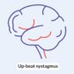

Up-beat Nystagmus

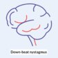

Down-beat Nystagmus

Right Posterior Canal BPPV

Left Posterior Canal BPPV

Right Anterior Canal BPPV

Left Anterior Canal BPPV

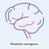

Pendular Nystagmus

### Etiology

<u>Nystagmus</u> can be physiological or pathological.

* Physiological <u>nystagmus</u>

* Provoked by external stimuli

* Example: caloric nystagmus, a type of horizontal <u>jerk nystagmus</u> caused by infusing cold or warm water into the external <u>ear</u> canal (See “<u>Caloric testing</u>” below) [[17]](https://coursology-qbank.com/amboss/article/V5XGQA)

* Pathological <u>nystagmus</u>: can either be congenital (e.g., sensory deficiency, oculomotor abnormality) or acquired (i.e., lesions of the <u>cerebellum</u>, <u>brainstem</u>, and/or <u>peripheral vestibular system</u>).

|  Overview of pathological <u>nystagmus</u> [[18]](https://coursology-qbank.com/amboss/article/QmXu2A)[[19]](https://coursology-qbank.com/amboss/article/nLX7yA)  |  |  |  |
| --- | --- | --- | --- |
|  |  | Characteristics | Etiology |
|  Spontaneous nystagmus (without external provocation)   | Peripheral nystagmus |   * <u>Jerk nystagmus</u>  * Has its origin in the <u>peripheral vestibular system</u>  * Can be physiological or pathological  * Typically occurs as a mixed torsional <u>horizontal nystagmus</u>  * Often accompanied by <u>vertigo</u> or <u>vomiting</u>  * Can be partially suppressed with visual fixation    |   * <u>Vestibular neuritis</u>  * <u>Labyrinthitis</u>  * <u>Meniere disease</u>  * <u>Migraine</u>  * <u>Benign paroxysmal positional vertigo</u>    |
| Central nystagmus |   * Jerk or <u>pendular nystagmus</u>  * Originates within the central system  * Can be physiological or pathological  * Rarely accompanied by <u>vertigo</u>  * Can not be suppressed with visual fixation    |   * <u>Stroke</u>  * <u>Brainstem</u> lesions (<u>Wallenberg syndrome</u>)  * <u>Cerebellar</u> lesions  * <u>Parinaud syndrome</u>  * <u>Internuclear ophthalmoplegia</u>  * <u>Korsakoff dementia</u>  * <u>Wernicke encephalopathy</u>  * <u>Multiple sclerosis</u> (<u>Charcot triad 1</u>)  * Intoxication  * <u>Phenytoin</u>  * <u>Phencyclidine</u>  * <u>Friedreich ataxia</u>    |  |
|  Gaze-evoked nystagmus  [[20]](https://coursology-qbank.com/amboss/article/koXmX_)  |  |   * <u>Jerk nystagmus</u>  * Caused by maintenance of eccentric <u>eye</u> position  * Most common type of <u>nystagmus</u>  * Can be provoked by testing oculomotor <u>eye movements</u> to the extreme horizontal point of gaze  * Fast corrective phase towards the eccentric <u>eye</u> position  * Movements last > 20 seconds    |   * <u>Stroke</u>  * <u>Midbrain</u> lesion (purely vertical)  * Pontomedullary lesion (purely horizontal)  * Intoxication  * Sedatives  * <u>Anticonvulsants</u>  * <u>Alcohol</u>  * <u>Myasthenia gravis</u> (fatigue <u>nystagmus</u>)    |

> [!TIP]
> Pure upbeat, pure downbeat, and pure <u>horizontal nystagmus</u> almost always originate from central lesions. Mixed horizontal and <u>torsional nystagmus</u> patterns are typical of peripheral lesions.

> [!TIP]
> The <u>nystagmus</u> always directs towards the more activated vestibular sensory organ.

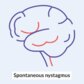

Spontaneous Nystagmus

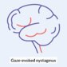

Gaze-evoked Nystagmus

### Clinical features [[15]](https://coursology-qbank.com/amboss/article/d5XoQA)

* Often asymptomatic

* General symptoms

* Blurred <u>vision</u>

* <u>Oscillopsia</u>

* Sensation of disequilibrium

* <u>Peripheral nystagmus</u>

* <u>Vertigo</u>

* <u>Vomiting</u>

### Diagnostics

* Caloric testing [[17]](https://coursology-qbank.com/amboss/article/V5XGQA)

* A test to evaluate vestibular function by infusing warm (∼ 44°C) or cold (∼ 30°C) water into the external <u>ear</u> canal

* Water infusion physiologically triggers <u>horizontal nystagmus</u> (see <u>vestibuloocular reflex</u> above). 

* Warm water: towards the stimulated side (<u>ipsilateral</u>)

* Cold water: away from the stimulated side (<u>contralateral</u>)

* Ice-cold water: Absence of <u>nystagmus</u> can indicate <u>brainstem</u> <u>death</u> in <u>comatose</u> patients.

> [!NOTE]
> <u>COWS</u>: Cold: Opposite side; Warm: Same side (rule for the direction of <u>nystagmus</u>).

---