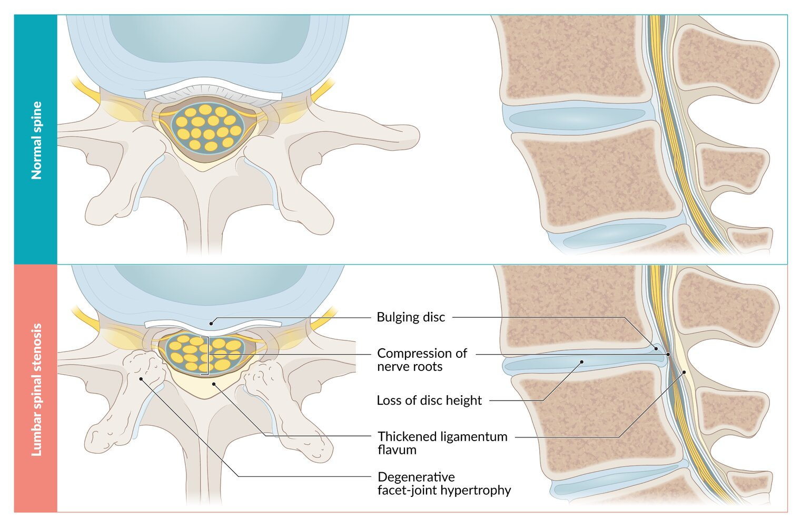
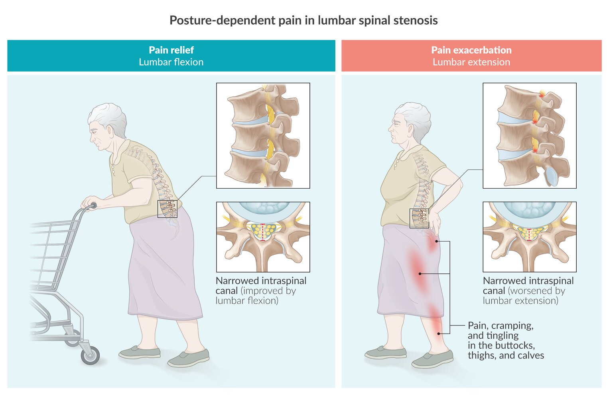
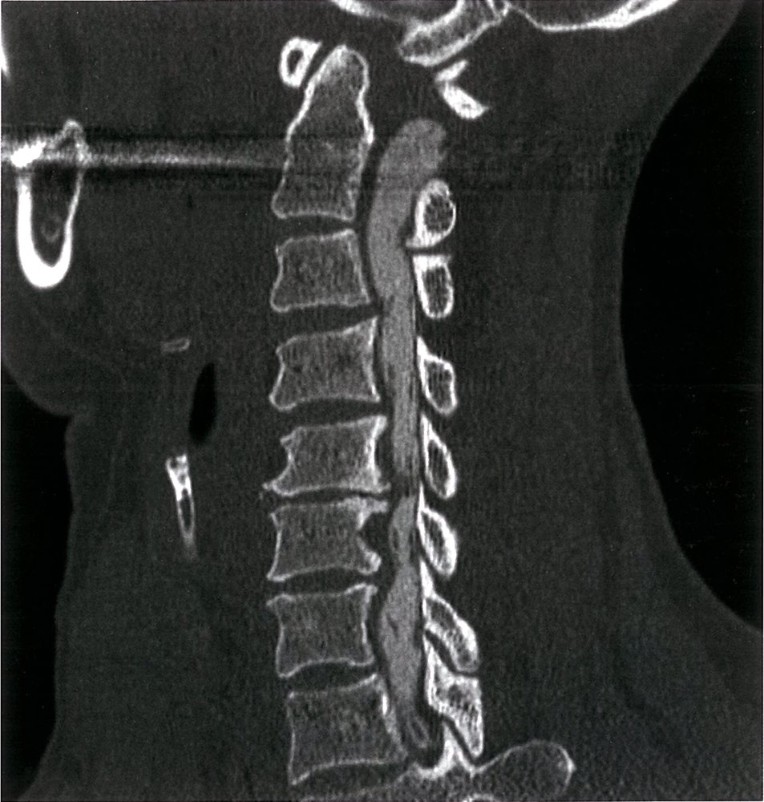
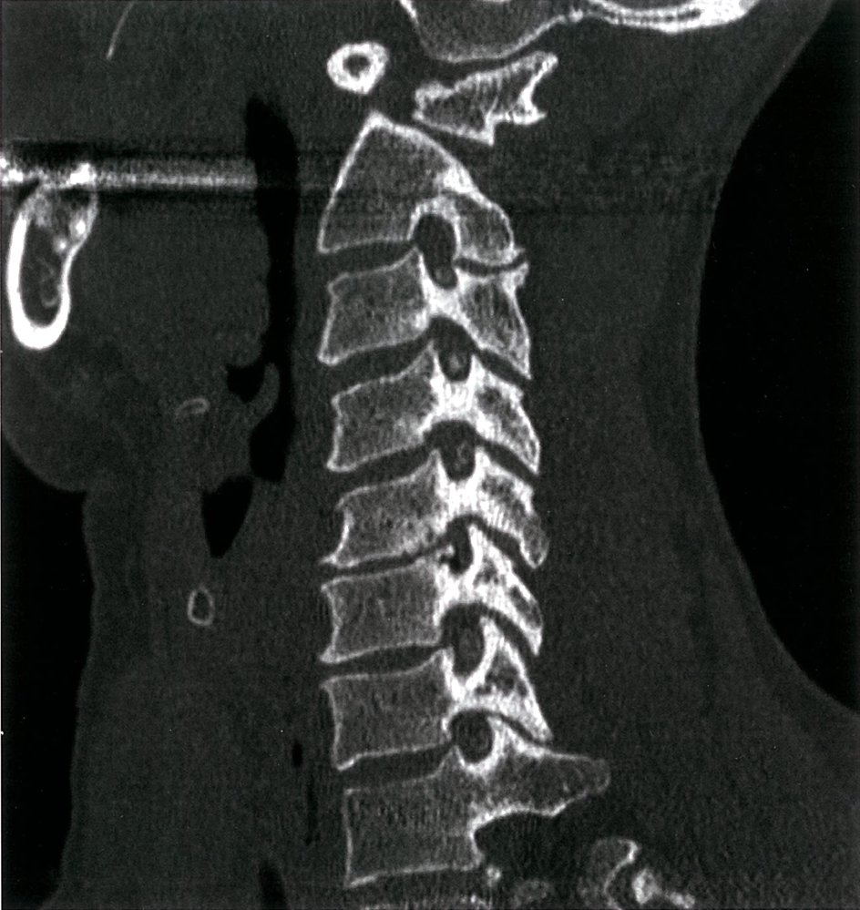

# Spinal stenosis

*Categories: Clinical knowledge > Surgery > Neurosurgery > Spinal stenosis*

[Original Article Link](https://coursology-qbank.com/amboss/article/JR0sLf)

---

## Summary

Spinal stenosis is characterized by the narrowing of the central <u>spinal canal</u>, <u>intervertebral foramen</u>, and/or <u>lateral</u> recess within the <u>cervical spine</u>, <u>thoracic spine</u>, or <u>lumbar spine</u>, resulting in progressive <u>nerve root</u> compression. It is commonly caused by degenerative <u>joint</u> disease and most often occurs in middle-aged and elderly individuals. <u>Lumbar spinal stenosis</u> is the most common form and causes load-dependent <u>lower back pain</u> that radiates to the buttocks and legs. Lumbar extension (standing or walking downhill) exacerbates the <u>pain</u> (<u>pseudoclaudication</u> or <u>neurogenic claudication</u>), while lumbar <u>flexion</u> (sitting or walking uphill) improves symptoms. Imaging, preferably <u>MRI</u> without IV contrast, and the presence of clinical features are required to confirm the diagnosis. Treatment of <u>lumbar spinal stenosis</u> initially involves <u>conservative therapy</u> (<u>analgesia</u> and <u>physiotherapy</u>); patients with refractory or severe spinal stenosis often require surgical decompression of the spinal cord (<u>laminectomy</u>). Cervical and thoracic spinal stenosis are less common and patients typically present with symptoms of <u>myelopathy</u>; management involves surgical decompression in most cases, with <u>conservative therapy</u> reserved only for mild cases.

---

## Epidemiology

* <u>Incidence</u> [[1]](https://coursology-qbank.com/amboss/article/MpbMJu)[[2]](https://coursology-qbank.com/amboss/article/B6bzMu)

* Lumbar stenosis is the most common form of spinal stenosis (affects ∼ 5 individuals per 100,000 population).

* Cervical stenosis affects 1–2 individuals per 100,000 population.

* Thoracic stenosis is rare.

* Age range: middle-aged and elderly population

Epidemiological data refers to the US, unless otherwise specified.

---

## Etiology

Progressive narrowing of the central <u>spinal canal</u>, intervertebral <u>neural foramen</u>, and/or <u>lateral</u> recess (cervical C2 or <u>lumbar spine</u> L1) caused by any of the following: [[1]](https://coursology-qbank.com/amboss/article/MpbMJu)[[3]](https://coursology-qbank.com/amboss/article/N9Y-nr)[[4]](https://coursology-qbank.com/amboss/article/4pb3pu)

* Degenerative <u>joint</u> disease (most common)

* <u>Spondylolisthesis</u> (<u>anterior</u> or <u>posterior</u>)

* Disk space narrowing (e.g., due to <u>osteoarthritis</u> and/or <u>degenerative disk disease</u>)

* <u>Facet joint</u> <u>hypertrophy</u>

* May affect both the lumbar and <u>cervical spine</u> simultaneously (tandem spinal stenosis)

* <u>Iatrogenic</u>: following spinal <u>surgery</u> such as <u>laminectomy</u>

* Systemic disease: Paget disease, <u>ankylosing spondylitis</u>, tumors

* Others: e.g., trauma, calcification of the <u>ligamentum flavum</u>, uncommon congenital <u>malformations</u> (e.g., <u>open spinal dysraphism</u>)

Etiology of lumbar spinal stenosis (LSS)

---

## Clinical features

### All levels

* <u>Pain</u> is most often gradual onset, chronic, or subacute, depending on the etiology.

* <u>Acute pain</u> can occur due to an exacerbation of a chronic underlying process or complication (see “<u>Acute back pain</u>” for details).

* <u>Radiculopathy</u> (at various affected <u>vertebral</u> levels) often occurs alongside spinal stenosis features, typically due to comorbid etiology, e.g., <u>degenerative disk disease</u>.

### Lumbar spinal stenosis [[3]](https://coursology-qbank.com/amboss/article/N9Y-nr)[[5]](https://coursology-qbank.com/amboss/article/I9YYKr)

* Load-dependent <u>lower back pain</u> that worsens with walking

* Neuropathic claudication: a group of neuropathic symptoms affected by postural changes    [[6]](https://coursology-qbank.com/amboss/article/z6brnu)

* Unilateral or bilateral gluteal, thigh, and calf <u>pain</u>

* Worsens with lumbar extension (e.g., walking, prolonged standing)

* Relieved by lumbar <u>flexion</u> (e.g., sitting, laying down, cycling)

* See also “<u>Neuropathic claudication vs. vascular claudication</u>.”

* Unsteady wide-based gait

* Reduced lower extremity reflexes

* Mild motor <u>weakness</u> and sensory changes may be present.

* Abnormal <u>Romberg test</u>

> [!TIP]
> Leaning on a shopping cart to alleviate <u>pain</u> (so-called “shopping cart sign”) is a common clinical feature in patients with lumbar stenosis. [[7]](https://coursology-qbank.com/amboss/article/_Tc5tb0)

Posture-dependent pain in lumbar spinal stenosis (neuropathic claudication)

### Cervical spinal stenosis [[8]](https://coursology-qbank.com/amboss/article/-6bDnu)

Clinical features are those of <u>myelopathy</u> and vary depending on the level of cord compression. <u>Pain</u> is less common compared with <u>lumbar spinal stenosis</u>.

* <u>Neck pain</u>

* Gait and balance disturbances

* Increased <u>urinary frequency</u> or incontinence

* <u>Upper motor neuron signs</u> below the level of stenosis

* <u>Lower motor neuron signs</u> at the level of stenosis

* Sensory abnormalities: <u>pain</u>, <u>paresthesia</u>, and/or anesthesia at or below the level of stenosis; <u>Lhermitte sign</u>

> [!TIP]
> <u>Lhermitte sign</u> should prompt evaluation for cervical stenosis, especially in elderly patients. [[8]](https://coursology-qbank.com/amboss/article/-6bDnu)

### Thoracic spinal stenosis [[9]](https://coursology-qbank.com/amboss/article/0pbeLu)

As with cervical spinal stenosis, clinical features are those of <u>myelopathy</u> and vary depending on the severity and level of cord compression. They include:

* Unilateral or bilateral lower limb <u>paresthesia</u> and <u>pain</u>

* <u>Bladder</u>, bowel, and/or <u>sexual dysfunction</u>

* <u>Radicular pain</u> around the chest or abdomen

* <u>Upper motor neuron signs</u> in the lower limbs

---

## Diagnosis

### Approach [[3]](https://coursology-qbank.com/amboss/article/N9Y-nr)

* Characteristic clinical features present: Confirm diagnosis with imaging.

* Mild to moderate symptoms PLUS signs of stenosis on imaging: Consider adding <u>EMG</u>.

* Acute exacerbation and/or new associated symptom of concern: Follow approach for “<u>Acute back pain</u>”.

> [!TIP]
> A diagnosis of spinal stenosis requires the presence of both findings on imaging and <u>clinical features of spinal stenosis</u>.

### <u>Neuroimaging</u> [[3]](https://coursology-qbank.com/amboss/article/N9Y-nr)[[10]](https://coursology-qbank.com/amboss/article/oic0sX0)

* Modalities and indications

* <u>MRI</u> <u>spine</u> without IV contrast: preferred modality in symptomatic patients  [[3]](https://coursology-qbank.com/amboss/article/N9Y-nr)

* <u>CT myelogram</u>: preferred modality in patients with <u>contraindications to MRI</u> or if <u>MRI</u> is inconclusive [[11]](https://coursology-qbank.com/amboss/article/T9Y65r)

* CT <u>spine</u> without IV contrast: Consider in patients with <u>contraindications to MRI</u> and <u>CT myelogram</u>.

* CT or <u>MRI</u> with axial loading : Consider in symptomatic patients with equivocal findings on imaging or to identify <u>spinal instability</u>. [[3]](https://coursology-qbank.com/amboss/article/N9Y-nr)[[12]](https://coursology-qbank.com/amboss/article/Y4cn3c0)

* Findings [[9]](https://coursology-qbank.com/amboss/article/0pbeLu)[[10]](https://coursology-qbank.com/amboss/article/oic0sX0)[[13]](https://coursology-qbank.com/amboss/article/WpbPou)

* Evidence of spinal stenosis

* Narrowing of the <u>spinal canal</u>

* <u>Compression of the spinal cord</u> and/or <u>nerve root</u> impingement

* Evidence of the underlying etiology (e.g., <u>degenerative disk disease</u>, <u>facet joint</u> <u>hypertrophy</u>, ligamentous <u>hypertrophy</u>)

Lumbar spinal stenosis

Degenerative cervical myelopathy

Degenerative cervical myelopathy

> [!WARNING]
> Obtain an urgent <u>MRI</u> <u>spine</u> (with and without IV contrast) and neurosurgery consult for patients with rapidly progressive neurological deficits suspicious for <u>spinal cord compression</u>, <u>cauda equina</u> and/or <u>conus medullaris syndrome</u>

### <u>X-ray</u> <u>spine</u>

* Indications

* Routine first-line modality for <u>acute back pain</u> in individuals with no neurological abnormalities

* Suspected <u>vertebral fracture</u>

* Patients due to undergo surgical treatment with suspected <u>spinal instability</u>: Consider dynamic studies (e.g., imaging in <u>flexion</u> and extension) to identify <u>spinal instability</u>.  [[10]](https://coursology-qbank.com/amboss/article/oic0sX0)[[14]](https://coursology-qbank.com/amboss/article/Xpb9Lu)

* Findings: evidence of the underlying etiology

* Degenerative <u>joint</u> changes (e.g., loss of disk height, <u>osteophytes</u>, loss of <u>vertebral</u> alignment)

* Congenital abnormalities (e.g., <u>scoliosis</u>, <u>lumbosacral transitional vertebrae</u>)

* <u>Disk herniation</u>

* <u>Hypertrophy</u> of <u>facet joint</u>

---

## Differential diagnoses

* The <u>differential diagnoses of low back pain</u> and <u>acute back pain</u> are broad and are detailed separately.

* In patients with <u>claudication</u>, <u>neuropathic claudication</u> should be differentiated from vascular <u>claudication</u>.

|  Neuropathic claudication vs. vascular claudication  |  |  |
| --- | --- | --- |
|  | <u>Neuropathic claudication</u> | Vascular <u>claudication</u> |
| Clinical features |   * Bilateral radiation of <u>pain</u> to buttocks and/or legs  * Associated cramping, numbness, <u>weakness</u>, or tingling in the legs    |  * Typically unilateral <u>pain</u> below the knee   |
| Exacerbating factors |  * Spinal extension : standing, walking downhill, or even at rest   |  * Walking, running, or cycling; reproducible after a certain distance   |
| Relieving factors |  * Spinal <u>flexion</u> : sitting, cycling, walking uphill, bending forward   |  * Completely resolved with rest/standing (unless advanced, then <u>pain</u> at rest may occur)   |
| <u>Ankle-brachial index</u> |  * Normal   |  * Abnormal   |

The differential diagnoses listed here are not exhaustive.

---

## Treatment

### <u>Lumbar spinal stenosis</u> [[3]](https://coursology-qbank.com/amboss/article/N9Y-nr)

* Mild or moderate symptoms: <u>conservative management</u> with <u>analgesia</u> and <u>physiotherapy</u>

* Significant symptoms or inadequate response to <u>conservative management</u>: Consult neurosurgery for consideration of operative management.

#### <u>Conservative management</u> [[15]](https://coursology-qbank.com/amboss/article/licv7X0)[[16]](https://coursology-qbank.com/amboss/article/wMchI10)

* First-line

* NSAIDS (see “<u>Oral analgesics</u>” for agents and dosages)

* <u>Physiotherapy</u>

* Second-line:  (persistent <u>neuropathic claudication</u> or <u>radiculopathy</u>): neurosurgery and/or <u>pain</u> specialist (anesthesia, physiatry) consult for consideration of image-guided epidural <u>steroid</u> injection  [[3]](https://coursology-qbank.com/amboss/article/N9Y-nr)[[17]](https://coursology-qbank.com/amboss/article/9McNI10)

#### <u>Surgery</u>

* Indications ;  [[3]](https://coursology-qbank.com/amboss/article/N9Y-nr)

* Severe lumbar stenosis

* Moderate lumbar stenosis with insufficient response to <u>conservative therapy</u>

* Patients who elect to undergo <u>surgery</u>

* Surgical options to relieve <u>spinal cord compression</u>  [[3]](https://coursology-qbank.com/amboss/article/N9Y-nr)[[18]](https://coursology-qbank.com/amboss/article/fpbkKu)[[19]](https://coursology-qbank.com/amboss/article/Tpb6Ku)

* Laminectomy (decompression <u>surgery</u>)

* Removal of the <u>dorsal</u> part of the involved <u>vertebra</u> (lamina), thereby relieving the spinal compression

* Can be combined with <u>vertebral</u> fusion (e.g., in patients with dynamic instability)

* Laminotomy: minimally invasive removal of part of the lamina

* Interspinous process <u>spacer</u> devices: Small implants are placed between the <u>spinous processes</u> in a minimally invasive procedure.

* Outcome: high recurrence rate with all forms of surgical management  [[20]](https://coursology-qbank.com/amboss/article/mpbVJu)

### Cervical and thoracic spinal stenosis [[9]](https://coursology-qbank.com/amboss/article/0pbeLu)[[21]](https://coursology-qbank.com/amboss/article/5pbiJu)[[22]](https://coursology-qbank.com/amboss/article/3icSrX0)

There is a paucity of evidence on the optimal management of cervical and thoracic stenosis.

* <u>Surgery</u> (decompression with or without <u>vertebral</u> fusion) is preferred in most cases because of the risk of severe neurological symptoms without surgical treatment.

* <u>Conservative management</u> (<u>NSAIDs</u> and/or <u>physiotherapy</u>) may be considered in patients with mild stenosis.

---