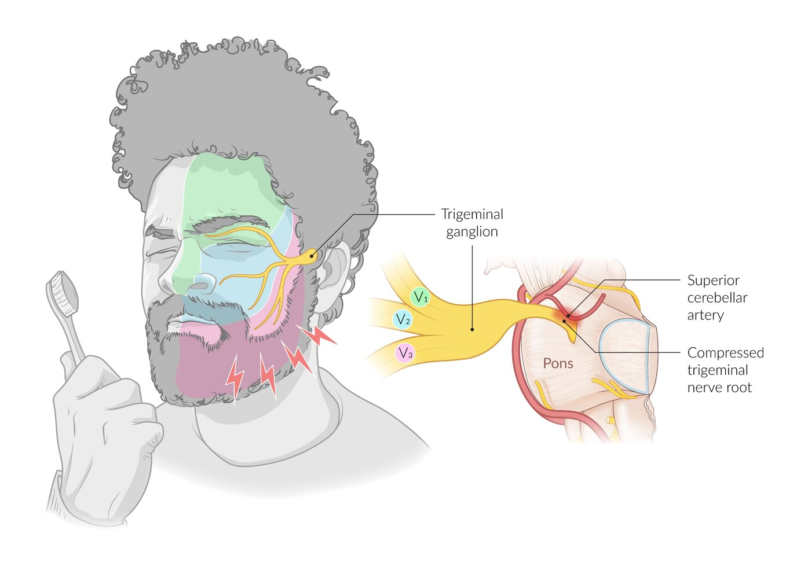

# Trigeminal neuralgia

*Categories: Clinical knowledge > Surgery > Neurosurgery > Trigeminal neuralgia*

[Original Article Link](https://coursology-qbank.com/amboss/article/ii0Jrf)

---

## Summary

<u>Trigeminal</u> <u>neuralgia</u>, or <u>tic</u> douloureux, is a condition characterized by attacks of facial <u>pain</u> in the area of one or more branches of the <u>trigeminal nerve</u>. The <u>pain</u> is typically very severe in intensity, has a sharp, stabbing quality, and lasts for several seconds. Attacks can occur without provocation but are sometimes triggered by innocuous stimuli like chewing. It is a rare condition that typically manifests in patients above the age of 60 years and affects women more often than men. <u>Trigeminal</u> <u>neuralgia</u> is a <u>clinical diagnosis</u>. <u>Neuroimaging</u> (preferably <u>MRI</u>) is used for further classification. <u>Classical trigeminal neuralgia</u> (<u>CTN</u>) is caused by neurovascular compression of the <u>trigeminal nerve</u> root, while <u>secondary trigeminal neuralgia</u> (STN) is caused by an underlying condition (e.g., <u>multiple sclerosis</u>). If there is no identifiable cause, it is referred to as <u>idiopathic trigeminal neuralgia</u> (ITN). <u>Anticonvulsants</u> (especially <u>carbamazepine</u>) are the mainstay of therapy. <u>Surgery</u> may be indicated if pharmacological treatment is insufficient. Options include <u>microvascular decompression</u> (MVD) and transcutaneous procedures that aim to ablate sensory fibers of the <u>trigeminal nerve</u> root or <u>ganglion</u>.

---

## Epidemiology

* Sex: <u>♀</u> > <u>♂</u> (2:1)

* Peak <u>incidence</u>: 60–70 years

References:[[1]](https://coursology-qbank.com/amboss/article/BwXzOZ0)[[2]](https://coursology-qbank.com/amboss/article/xwXEOZ0)

Epidemiological data refers to the US, unless otherwise specified.

---

## Classification

* Classical trigeminal neuralgia (<u>CTN</u>): caused by neurovascular compression, most often by an aberrant loop of a neighboring <u>artery</u> (usually the <u>superior cerebellar artery</u>) [[3]](https://coursology-qbank.com/amboss/article/lGYvzq)

* Secondary trigeminal neuralgia (STN): caused by a major underlying neurological disease, most frequently <u>multiple sclerosis</u>, a <u>tumor</u> at the <u>cerebellopontine angle</u>, or <u>arteriovenous malformation</u>. [[3]](https://coursology-qbank.com/amboss/article/lGYvzq)

* Idiopathic trigeminal neuralgia (ITN): no identifiable cause (unremarkable findings on <u>MRI</u> and <u>electrophysiological tests</u>) [[3]](https://coursology-qbank.com/amboss/article/lGYvzq)

---

## Clinical features

* Unilateral facial <u>pain</u>: <u>paroxysmal</u>, severe shooting or stabbing (like an <u>electric shock</u>), followed by a burning ache 

* Lasts several seconds;  (in rare cases, several minutes) and may occur up to 100 times per day

* Typically shoots from mouth to the angle of the <u>jaw</u> on the affected side [[4]](https://coursology-qbank.com/amboss/article/kT1mIT0)

* Occurs either at rest or is triggered by movements such as chewing, talking, or touch (e.g., brushing <u>teeth</u>, washing face); becomes worse with stimulation

* Facial spasms may occur.

* Psychological <u>distress</u>: ranging from <u>dysphoria</u> to severe <u>depression</u> with suicidal tendencies

* Usually progressive course

Trigeminal neuralgia

Cutaneous innervation of the trigeminal nerve

References:[[5]](https://coursology-qbank.com/amboss/article/tPaXgk)[[6]](https://coursology-qbank.com/amboss/article/uPapgk)

---

## Diagnosis

<u>Trigeminal</u> <u>neuralgia</u> is a <u>clinical diagnosis</u>. <u>MRI</u> should be performed at least once in the patient's lifetime to evaluate for structural etiology.

### Diagnostic criteria

* All of the following criteria must be fulfilled: [[3]](https://coursology-qbank.com/amboss/article/lGYvzq)

* Recurring unilateral face <u>pain</u> in the area innervated by one or more divisions of the <u>trigeminal nerve</u>

* <u>Pain</u> characteristics

* Severe

* Lasting no more than two minutes

* Quality: sharp, shooting, stabbing, or <u>electric shock</u>-like

* Triggered by innocuous stimuli in the area innervated by the affected <u>trigeminal nerve</u> divisions

* Another <u>ICHD-3</u> diagnosis does not better explain the symptoms.

### Imaging

* <u>MRI</u> head without and with IV contrast and <u>MRA</u> 

* Indications

* All patients with associated neurological deficits

* In patients with a clinically established diagnosis, <u>MRI</u> should be performed at least once in a patient's lifetime (to identify the underlying etiology).  [[7]](https://coursology-qbank.com/amboss/article/yGYdbI)[[8]](https://coursology-qbank.com/amboss/article/UXbbxH)[[9]](https://coursology-qbank.com/amboss/article/TCY6rr)

* Supportive findings [[8]](https://coursology-qbank.com/amboss/article/UXbbxH)[[10]](https://coursology-qbank.com/amboss/article/cvYa_I)

* <u>Classical trigeminal neuralgia</u>: vascular compression with deformation or <u>atrophy</u> of the <u>trigeminal nerve</u> root  [[3]](https://coursology-qbank.com/amboss/article/lGYvzq)[[10]](https://coursology-qbank.com/amboss/article/cvYa_I)

* <u>Secondary trigeminal neuralgia</u>: signs of an underlying condition (e.g., <u>demyelination</u> <u>plaques</u> in <u>multiple sclerosis</u>, <u>tumor</u> at the <u>cerebellopontine angle</u>)  [[10]](https://coursology-qbank.com/amboss/article/cvYa_I)

* <u>Idiopathic trigeminal neuralgia</u>: typically normal

* CT head and maxillofacial with IV contrast and <u>CTA</u>

* Indication: <u>contraindications to MRI</u>

* Findings: similar to those in <u>MRI</u> [[8]](https://coursology-qbank.com/amboss/article/UXbbxH)

> [!WARNING]
> Patients with <u>trigeminal</u> <u>neuralgia</u> and an accompanying neurological deficit require urgent imaging studies (ideally <u>MRI</u>) to rule out a mass or vascular abnormalities. [[11]](https://coursology-qbank.com/amboss/article/35YSPp)

### Additional investigations

* Electrophysiologic <u>trigeminal</u> reflex measurement [[10]](https://coursology-qbank.com/amboss/article/cvYa_I)[[12]](https://coursology-qbank.com/amboss/article/AGYRbI)[[13]](https://coursology-qbank.com/amboss/article/rTbfHG) 

* Indication: differentiation of <u>CTN</u> from STN (if <u>MRI</u> is not possible)

* Procedure: The supraorbital, infraorbital, or mental nerve is stimulated electrically and the response recorded with surface electrodes.

* Findings

* <u>Classical trigeminal neuralgia</u>: normal findings

* <u>Secondary trigeminal neuralgia</u>: reflex abnormalities on the affected side (e.g., increased latency)

---

## Treatment

### Approach

* <u>Manage acute pain</u> crises, e.g., with intravenous <u>lidocaine</u>.

* Start regular <u>anticonvulsant</u> therapy.

* Consult <u>neurology</u>.

* Consider neurosurgical intervention for poorly-controlled persistent symptoms or intolerable treatment side effects.

> [!TIP]
> Inpatient treatment may be necessary for intractable <u>pain</u> in an acute exacerbation. <u>Neurology</u> specialists can adjust <u>antiepileptic</u> medications, provide IV medications, and consider referral for neurosurgical intervention. [[12]](https://coursology-qbank.com/amboss/article/AGYRbI)

### Medical therapy [[6]](https://coursology-qbank.com/amboss/article/uPapgk)[[12]](https://coursology-qbank.com/amboss/article/AGYRbI)[[14]](https://coursology-qbank.com/amboss/article/4eb3_s)[[15]](https://coursology-qbank.com/amboss/article/vPaAgk)

#### Acute exacerbation

* Consider <u>lidocaine</u> infusion DOSAGE (only under the direction of an experienced physician) with <u>continuous cardiac monitoring</u>. [[12]](https://coursology-qbank.com/amboss/article/AGYRbI)[[16]](https://coursology-qbank.com/amboss/article/yvYdcr)

* Further treatment options include : [[16]](https://coursology-qbank.com/amboss/article/yvYdcr)

* <u>Phenytoin</u> or <u>fosphenytoin</u> infusion

* Oral or nasal application of <u>lidocaine</u>

* <u>Local anesthetic</u> trigger point injection

* <u>Sumatriptan</u> (SQ, nasal, or oral)

> [!WARNING]
> Avoid <u>opioids</u> as they are ineffective for managing <u>pain</u> from <u>trigeminal</u> <u>neuralgia</u>. [[12]](https://coursology-qbank.com/amboss/article/AGYRbI)

#### Chronic therapy

* First-line treatment: choose from one of the following [[12]](https://coursology-qbank.com/amboss/article/AGYRbI)[[14]](https://coursology-qbank.com/amboss/article/4eb3_s)

* <u>Carbamazepine</u> DOSAGE

* <u>Oxcarbazepine</u> DOSAGE

* Alternatives and additional considerations

* Other <u>anticonvulsants</u> (e.g., <u>lamotrigine</u>, <u>oxcarbazepine</u>, <u>baclofen</u>, <u>phenytoin</u>, <u>gabapentin</u>) may be used on an individual basis.

* Treatment should be initiated and supervised by neurological specialists.

### Surgical therapy [[12]](https://coursology-qbank.com/amboss/article/AGYRbI)[[14]](https://coursology-qbank.com/amboss/article/4eb3_s)[[15]](https://coursology-qbank.com/amboss/article/vPaAgk)

#### Indications

* Insufficient response to medical therapy or intolerable side effects  [[15]](https://coursology-qbank.com/amboss/article/vPaAgk)

* Risks and benefits in the individual patient must be carefully weighed.

* Most procedures have only been investigated in small studies in patients with <u>CTN</u>, and the evidence for their <u>efficacy</u> in patients with STN is even more limited.  [[12]](https://coursology-qbank.com/amboss/article/AGYRbI)[[14]](https://coursology-qbank.com/amboss/article/4eb3_s)

#### Microvascular decompression (MVD) [[12]](https://coursology-qbank.com/amboss/article/AGYRbI)[[14]](https://coursology-qbank.com/amboss/article/4eb3_s)

* Indications: Initially established in patients with <u>CTN</u> and signs of neural compression, but may be considered in ITN and STN as well

* Description

* Major neurosurgical procedure that requires a high level of expertise

* Following a suboccipital <u>craniotomy</u>, the blood vessel compressing the <u>trigeminal nerve</u> root is identified and separated from the nerve. A piece of <u>sponge</u>-like material may be placed between the blood vessel and nerve. [[17]](https://coursology-qbank.com/amboss/article/ddboKs)

* Achieves the most sustained <u>pain</u> relief in comparison to other invasive treatments  [[15]](https://coursology-qbank.com/amboss/article/vPaAgk)

* Complications include  [[15]](https://coursology-qbank.com/amboss/article/vPaAgk)

* <u>Aseptic meningitis</u>

* <u>Ipsilateral</u> <u>hearing loss</u>

* Sensory loss

* <u>Cerebrospinal fluid</u> leakage

* <u>Stroke</u>

* <u>Hematomas</u>

#### Percutaneous neuroablative procedures [[6]](https://coursology-qbank.com/amboss/article/uPapgk)[[12]](https://coursology-qbank.com/amboss/article/AGYRbI)[[15]](https://coursology-qbank.com/amboss/article/vPaAgk)

* Description

* Insertion of a <u>trocar</u> or needle through the foramen ovale to ablate sensory fibers in the <u>trigeminal nerve</u> root

* <u>Ablation</u> via heat (thermocoagulation), pressure (balloon compression), or chemicals (glycerol injection)

* Complications include

* Sensory loss (in up to 50% of patients) [[15]](https://coursology-qbank.com/amboss/article/vPaAgk)

* <u>Dysesthesia</u>

* Anesthesia dolorosa

* Corneal numbness [[18]](https://coursology-qbank.com/amboss/article/Tdb66s)

* Comparison to MVD

* <u>Craniotomy</u> is not necessary, resulting in lower periprocedural risk.

* Lower risk of serious complications

* Similar rates of initial <u>pain</u> relief (∼ 90%)

* Lower long-term <u>efficacy</u> (recurrence of <u>pain</u> in around 50% after 5 years) [[14]](https://coursology-qbank.com/amboss/article/4eb3_s)

#### <u>Gamma knife</u> radiosurgery [[12]](https://coursology-qbank.com/amboss/article/AGYRbI)[[15]](https://coursology-qbank.com/amboss/article/vPaAgk)

* Indications: Consider in patients who cannot undergo open <u>surgery</u>, e.g., due to <u>frailty</u> or those who are anticoagulated.

* Description: Stereotactic application of high-intensity gamma rays to damage the <u>trigeminal</u> <u>ganglion</u>
* <u>Pain</u> relief may be delayed (∼ 1 month).

* Complications include:

* Sensory loss

* <u>Paresthesia</u>

* Recurrence of <u>pain</u> in around 50% of patients 3 years after treatment [[15]](https://coursology-qbank.com/amboss/article/vPaAgk)

---