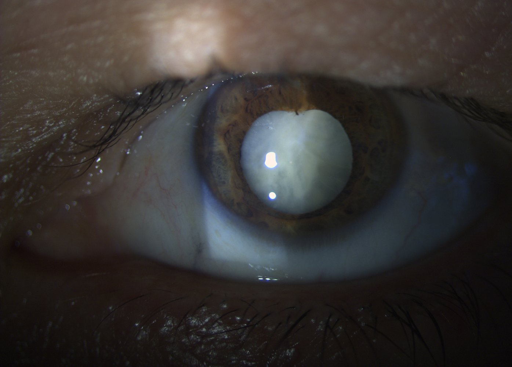
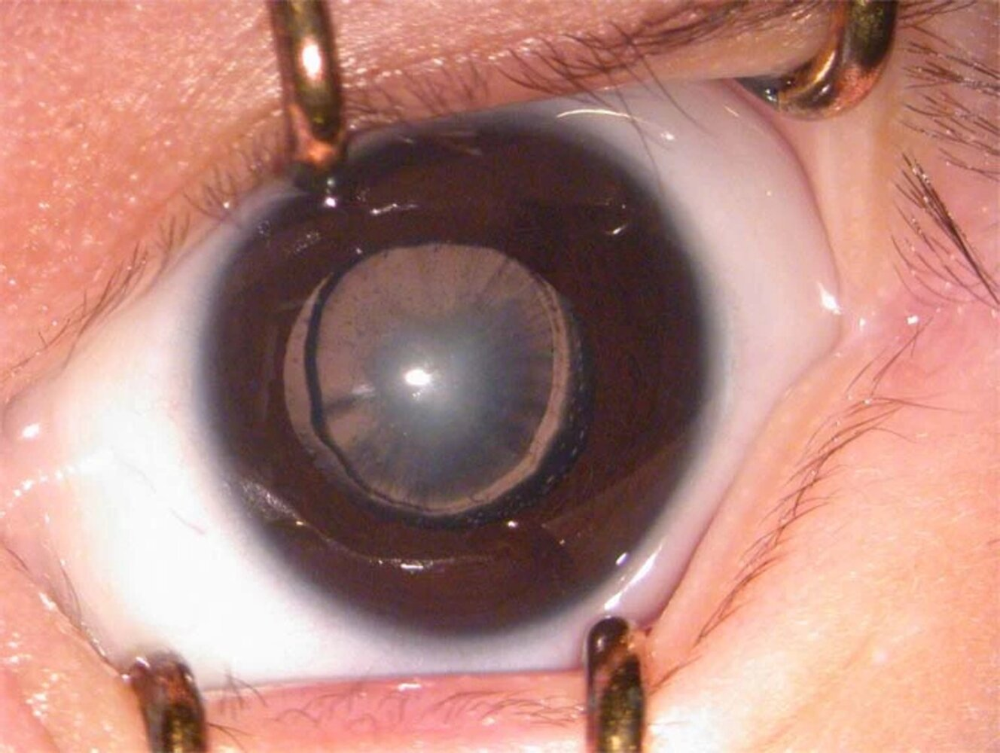
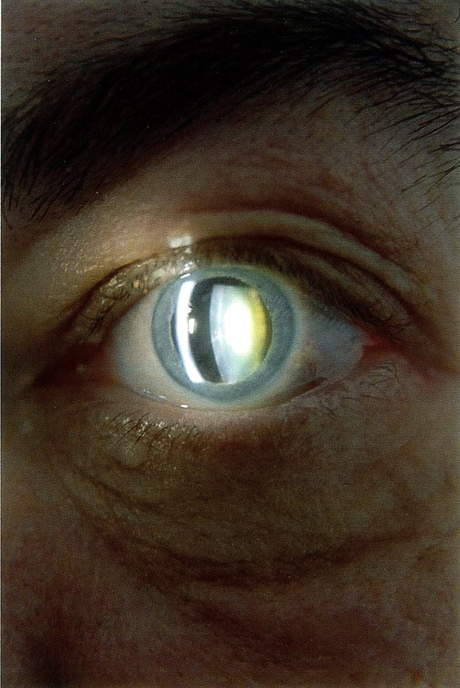
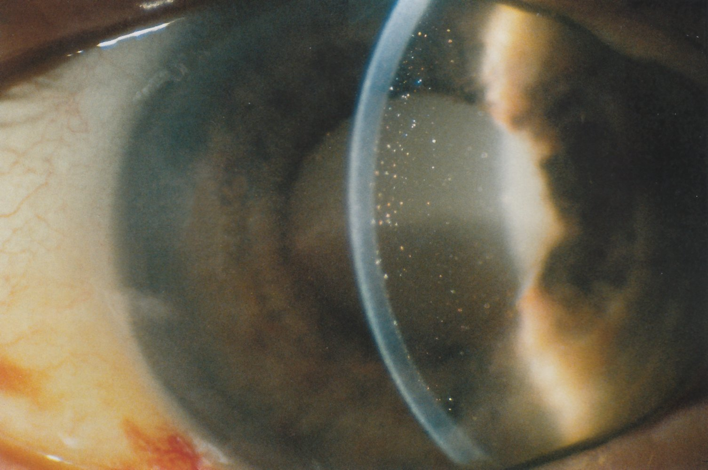
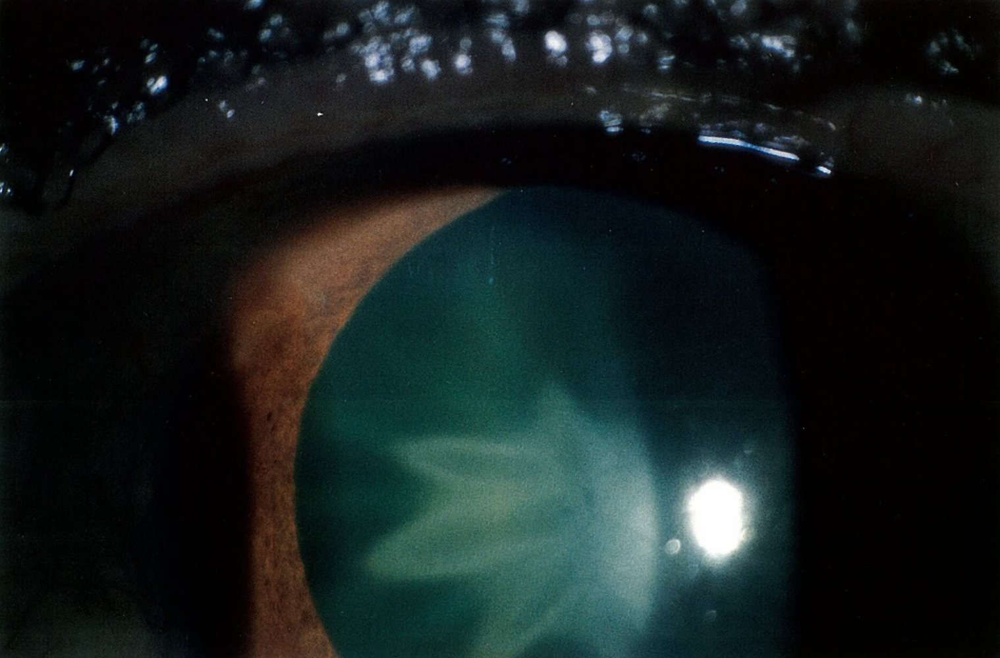
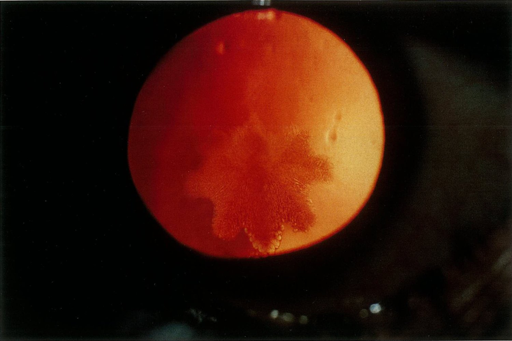

# Cataract

*Categories: Clinical knowledge > Surgery > Ophthalmic surgery > Cataract*

[Original Article Link](https://coursology-qbank.com/amboss/article/pO0LtT)

---

## Summary

Cataract is a condition characterized by clouding of the ocular <u>lens</u>. Acquired cataracts are more common and most frequently occur due to age-related degenerative processes in the <u>lens</u>; they can also occur as a side effect to drugs or be caused by <u>ocular trauma</u> or metabolic disorders. <u>Congenital cataracts</u> may occur due to <u>TORCH infections</u>, disorders of metabolism, or hereditary syndromes. <u>Congenital cataracts</u> can be found on routine <u>newborn</u> <u>red reflex evaluation</u>; detection should be followed by a prompt referral to a pediatric ophthalmologist for further workup and management to prevent <u>deprivation amblyopia</u>. In adults, cataract often manifests discretely and may go unnoticed until visual impairment worsens. Diagnosis is typically established on the basis of a thorough history and direct visualization of the cataract (e.g., via slit-lamp microscopy). <u>Surgery</u> is indicated for patients with significant visual impairment and involves <u>lens</u> extraction and implantation of an artificial <u>lens</u>. Untreated cataracts may lead to complete blindness.

---

## Epidemiology

* Leading cause of visual impairment and blindness in the world

* <u>Prevalence</u> of acquired cataracts: increases with age

* > 80 years: ∼70 %

* 40–80 years: ∼17.5 %

* Sex: <u>♀</u> > <u>♂</u>

References:[[1]](https://coursology-qbank.com/amboss/article/d-0owi)[[2]](https://coursology-qbank.com/amboss/article/V-0Gwi)[[3]](https://coursology-qbank.com/amboss/article/GdYBrL)

Epidemiological data refers to the US, unless otherwise specified.

---

## Etiology

Clouding of the <u>lens</u> may be congenital or acquired.

### Acquired cataracts (> 99%) [[4]](https://coursology-qbank.com/amboss/article/FdYg7L)

* Age-related cataract (> 90%)

* As a result of ocular diseases (complicated cataract)

* <u>Diabetes mellitus</u>

* <u>Renal insufficiency</u> (dialysis)

* <u>Wilson disease</u>

* Vitreoretinal diseases

* <u>Retinitis pigmentosa</u>

* Acute <u>glaucoma</u>

* Previous <u>retinal detachment</u>

* Chronic <u>uveitis</u>

* Heterochromia

* After intraocular surgeries

* After <u>vitrectomy</u> (especially after silicone oil is inserted)

* After filtration <u>surgery</u> in <u>glaucoma</u>

* Drug-induced 

* <u>Glucocorticoids</u> (local and systemic)

* Miotics (<u>cholinesterase inhibitors</u>)

* Chronic <u>alcohol</u> and tobacco use

* Traumatic (<u>traumatic cataract</u>) 

* <u>Bruise</u> injuries (<u>contusion cataract</u>)

* Perforation injuries

* <u>Eye</u> infections

* Physically related conditions

* Radiation (<u>x-ray</u>, <u>radioactive radiation</u>)

* Excessive sunlight or <u>UVB</u> exposure

* High-<u>voltage</u> current, lightning

* <u>Infrared radiation</u> (glassblower's and glass worker's cataract)

* <u>Posterior capsule opacification</u> (<u>PCO</u>; or <u>secondary cataract</u>): clouding of capsule sections after <u>extracapsular cataract extraction</u>

### Congenital cataracts (< 1%) [[4]](https://coursology-qbank.com/amboss/article/FdYg7L)

* Hereditary <u>congenital cataracts</u>

* Caused by <u>TORCH infections</u> (esp., <u>rubella</u>)

* Associated with the following comorbidities/syndromes:

* <u>Galactosemia</u>

* <u>Tetany</u> (<u>hypocalcemia</u>)

* <u>Myotonic dystrophy</u>

* <u>Skin</u> diseases

* <u>Trisomy 21</u> (in early childhood)

* <u>Trisomy 13</u>

* <u>Trisomy 18</u>

* <u>Alport syndrome</u>

* <u>Neurofibromatosis</u> type 2

* <u>Galactokinase deficiency</u>

* <u>Marfan syndrome</u>

---

## Clinical features

### Acquired cataracts [[4]](https://coursology-qbank.com/amboss/article/FdYg7L)

Clinical features usually develop gradually (especially in the case of age-related cataracts) and depend on the localization and cause(s) of <u>lens</u> clouding.

* Reduced <u>visual acuity</u>: blurred, clouded, or dim <u>vision</u>, especially at night

* Impaired <u>vision</u>: painless, often bilateral

* Glare: in daylight, in low sunlight, and from car headlights; associated with halos around lights

* Second sight: a temporary improvement in near <u>vision</u>; especially in patients with <u>nuclear cataracts</u>

* Monocular diplopia: <u>double vision</u> that disappears when the affected <u>eye</u> is covered or shut

* Change in color perception

> [!TIP]
> Age-related cataracts are the most common cause of <u>vision loss</u> in older adults and can significantly affect quality of life. [[6]](https://coursology-qbank.com/amboss/article/PwcWQe0)

Mature cataract

### <u>Congenital cataracts</u> [[4]](https://coursology-qbank.com/amboss/article/FdYg7L)

<u>Congenital cataracts</u> manifest differently than acquired cataracts.

* <u>Leukocoria</u>

* <u>Strabismus</u>

* <u>Nystagmus</u>

* Delay in motor skill development

* <u>Deprivation amblyopia</u>

Congenital cataract

---

## Diagnosis

### General principles [[7]](https://coursology-qbank.com/amboss/article/Qwcuie0)

* Acquired cataracts

* Initial assessment

* Perform a <u>comprehensive ocular examination</u> on all patients with features suggestive of cataracts.

* Evaluate for systemic disease (e.g., <u>diabetes</u>, <u>hypertension</u>) if history or examination findings are concerning.

* Consider additional ophthalmologic tests (e.g., <u>IOP measurement</u>) to assess for concurrent ocular conditions.

* Advanced studies: Refer to an ophthalmologist for specialized tests (e.g., <u>glare testing</u>).

* <u>Congenital cataracts</u> [[8]](https://coursology-qbank.com/amboss/article/_115jf0)[[9]](https://coursology-qbank.com/amboss/article/A11Rjf0)

* May be identified on routine <u>newborn</u> <u>red reflex evaluation</u>

* If <u>congenital cataract</u> is suspected, promptly refer to an ophthalmologist for further work-up.

> [!TIP]
> Cataract is primarily a <u>clinical diagnosis</u>.

### <u>Ocular examination</u> [[5]](https://coursology-qbank.com/amboss/article/KHaUrN)[[6]](https://coursology-qbank.com/amboss/article/PwcWQe0)[[7]](https://coursology-qbank.com/amboss/article/Qwcuie0)

* <u>Visual acuity</u>

* May be normal in patients with early cataracts

* Typically decreases with cataract progression

* <u>Cortical cataracts</u> may manifest as <u>hyperopia</u>. [[10]](https://coursology-qbank.com/amboss/article/8xcOye0)

* Consider questionnaires (e.g., <u>Visual Function-14</u>) to assess the impact of decreased <u>visual acuity</u> on the individual's quality of life. [[7]](https://coursology-qbank.com/amboss/article/Qwcuie0)

* <u>Fundoscopy</u>

* Changes to the <u>red reflex</u>, including: [[5]](https://coursology-qbank.com/amboss/article/KHaUrN)

* Opacities (including <u>leukocoria</u>)

* Darkening

* Absent or decreased <u>red reflex</u>

* Obscuration of ocular fundus detail  [[11]](https://coursology-qbank.com/amboss/article/GxcBBe0)

* <u>Slit-lamp examination</u> [[5]](https://coursology-qbank.com/amboss/article/KHaUrN)

* Common: grey, white, yellow, or brownish clouding of the <u>lens</u> (see also “<u>Types of cataracts</u>”)

* Traumatic cataract: rosette/stellate-shaped clouding of the <u>lens</u>   [[12]](https://coursology-qbank.com/amboss/article/aBcQze0)

* Further <u>ocular examination</u> (e.g., <u>visual field examination</u>, <u>IOP measurement</u>)

* Perform to rule out coexisting conditions.

* See “<u>Examination of the eye</u>” for details.

> [!WARNING]
> Perform a thorough <u>eye examination</u> in all patients with suspected cataracts. This can help identify coexistent <u>eye</u> conditions, which can be present in up to ⅓ of patients and may affect treatment outcomes. [[7]](https://coursology-qbank.com/amboss/article/Qwcuie0)[[13]](https://coursology-qbank.com/amboss/article/iW1JOf0)

> [!TIP]
> Patients with minimal changes in <u>visual acuity</u> may still experience significant disability from glare with bright lights; advanced studies should be performed for these individuals.

Cataract

Mature cataract

Morgagnian (hypermature) cataract

Traumatic cataract (contusion cataract)

Traumatic cataract (contusion cataract)

### Advanced studies [[7]](https://coursology-qbank.com/amboss/article/Qwcuie0)

* <u>Glare testing</u> and visual contrast <u>sensitivity</u> testing

* Used to assess the degree of visual disability when the <u>eye</u> is exposed to bright light

* Perform in individuals who report experiencing significant glare  [[14]](https://coursology-qbank.com/amboss/article/txcXye0)

* B-scan <u>ultrasound</u>: to detect retinal pathology if the fundus is obscured by a dense cataract  [[11]](https://coursology-qbank.com/amboss/article/GxcBBe0)

* <u>Optical coherence tomography</u>: used to assess for coexisting macular disease and assist in planning <u>surgery</u> [[15]](https://coursology-qbank.com/amboss/article/Fxcgye0)

---

## Treatment

### General principles

This section focuses primarily on the management of acquired cataracts.

* Acquired cataracts [[7]](https://coursology-qbank.com/amboss/article/Qwcuie0)

* Educate patients on ways to prevent cataract progression (see “<u>Prevention of cataracts</u>”).

* If applicable, prescribe corrective lenses to minimize symptoms caused by <u>refractive errors</u>.

* Consider <u>surgery</u> in patients for whom <u>vision</u> and quality of life are impacted significantly or who have other indications for <u>surgery</u>.

* <u>Congenital cataracts</u>

* Early <u>surgery</u> (i.e., within the first 8 weeks of life) is recommended for most patients with <u>congenital cataracts</u>. [[16]](https://coursology-qbank.com/amboss/article/z11rjf0)

* Cataract in <u>galactosemia</u> is reversible with a galactose-free diet. [[17]](https://coursology-qbank.com/amboss/article/Dc11ef0)

> [!TIP]
> In most cases, definitive management of cataracts is not possible without <u>surgery</u>. No pharmacologic agents are available to treat cataracts.

> [!TIP]
> <u>Congenital cataracts</u> should be surgically treated as soon as possible to prevent <u>deprivation amblyopia</u>. [[18]](https://coursology-qbank.com/amboss/article/S9cy5e0)

### <u>Surgery</u> [[7]](https://coursology-qbank.com/amboss/article/Qwcuie0)

#### Indications

* To improve <u>vision</u> in individuals with significant cataract-related visual disturbances (most common indication)

* Cataract causing significant difference in refractive power between the two eyes

* Preventing proper evaluation or treatment of the areas of the <u>eye</u> that are <u>posterior</u> to it (e.g., the fundus)

* Cataract causing <u>glaucoma</u> (e.g., <u>angle closure glaucoma</u>)

#### Contraindications

* Visual disturbances manageable with corrective lenses

* <u>Vision</u> is not expected to improve after <u>surgery</u> (e.g., concurrent ocular conditions also causing <u>vision</u> impairment)

* High surgical risk

#### Preoperative considerations

* For bilateral cataracts requiring <u>surgery</u>, <u>surgery</u> is typically delayed in the second <u>eye</u> until full recovery of the first <u>eye</u>.

* Bilateral <u>cataract surgery</u> may be performed on the same day but is associated with risks such as:

* Bilateral <u>postoperative complications</u> (e.g., <u>endophthalmitis</u>)

* Worse <u>visual acuity</u>

* <u>Preoperative evaluation</u>

* Perform a comprehensive clinical evaluation in all patients.

* Routine preoperative medical testing is not recommended; consider in patients with significant comorbidities, e.g.:

* <u>COPD</u>

* Recent <u>MI</u>

* Poorly controlled <u>hypertension</u>, <u>diabetes</u>, or <u>CHF</u>

* <u>Antiplatelet medications</u> and <u>anticoagulants</u> can usually be continued without interruption in patients undergoing <u>cataract surgery</u>. [[7]](https://coursology-qbank.com/amboss/article/Qwcuie0)

> [!TIP]
> Most patients do not require modifications to <u>antithrombotic therapy</u> (<u>antiplatelet medications</u> and <u>anticoagulants</u>) before <u>cataract surgery</u>. [[7]](https://coursology-qbank.com/amboss/article/Qwcuie0)

#### Surgical options

Different techniques are available and usually performed using <u>local anesthesia</u>.

|  Overview of surgical techniques for cataracts [[7]](https://coursology-qbank.com/amboss/article/Qwcuie0)[[19]](https://coursology-qbank.com/amboss/article/V9cGme0)[[20]](https://coursology-qbank.com/amboss/article/T9c65e0)  |  |  |
| --- | --- | --- |
|  | Description | Characteristics |
| Phacoemulsification |   * <u>Liquefaction</u> and <u>aspiration</u> of the <u>lens</u> <u>nucleus</u>  * The <u>intraocular lens</u> implant (<u>IOL</u>) is placed in the <u>posterior</u> chamber.    |   * Small <u>incision</u>, sutureless <u>surgery</u>  * Compared to <u>extracapsular cataract extraction</u>:  * Improved <u>visual acuity</u>  * Lower complication rate  * Higher cost  * May not be feasible for advanced cataracts    |
| Extracapsular cataract extraction (<u>ECCE</u>) |   * Removal of the <u>lens</u> <u>nucleus</u> by <u>anterior</u> capsulotomy  * The <u>posterior</u> capsule is retained.  * The <u>IOL</u> is placed in the <u>posterior</u> chamber.    |   * More cost-efficient than <u>phacoemulsification</u>  * Often requires suture removal    |
| Intracapsular cataract extraction (<u>ICCE</u>) |   * Removal of the entire <u>lens</u> (including the <u>posterior</u> capsule)  * The <u>IOL</u> is placed in the <u>anterior</u> chamber or sutured to the <u>iris</u>    |   * No longer a preferred approach  * Compared to <u>ECCE</u>:  * Larger <u>incision</u>  * Slower <u>wound healing</u>  * Higher rates of complications (e.g., postsurgical <u>astigmatism</u>) [[21]](https://coursology-qbank.com/amboss/article/g9cF5e0)    |
|  Manual small incision cataract surgery (MSICS) [[22]](https://coursology-qbank.com/amboss/article/_xc5_e0)  |   * Removal of the <u>lens</u> through a small <u>incision</u>  * The <u>IOL</u> is placed through the same <u>incision</u>.    |   * Can be sutureless  * Compared to <u>phacoemulsification</u>:  * Similar improvements in <u>visual acuity</u>  * Lower cost    |

#### Postoperative care and considerations [[23]](https://coursology-qbank.com/amboss/article/HxcKBe0)

* Topical antiinflammatory agents, topical <u>antibiotics</u>, <u>NSAIDs</u>, or <u>glucocorticoids</u> may be prescribed postoperatively.

* Depending on the operation performed and <u>surgeon</u> preference, the following may be recommended:

* <u>Eye</u> protection during the first week after <u>surgery</u>

* Activity restrictions for a few days following <u>surgery</u>

* Patients should follow the advice of the operating <u>surgeon</u> on when to resume driving.

* Assess prescription for corrective lenses as needed 4–12 weeks postoperatively depending on the type of <u>surgery</u> performed.

---

## Complications

* Blindness

* <u>Glaucoma</u>: phacolytic <u>glaucoma</u>, <u>angle-closure glaucoma</u>

* <u>Deprivation amblyopia</u> in <u>congenital cataract</u>

* Complications after <u>cataract surgery</u> are rare

* <u>Astigmatism</u> caused by wound <u>incision</u>

* <u>Dislocation</u> of the <u>intraocular lens</u>

* Postoperative <u>uveitis</u>, <u>endophthalmitis</u>

* Cystoid macular edema: an accumulation of fluid at the <u>macula</u> in tiny cyst-like cavities within the outer plexiform layer (Henle's layer) and inner nuclear <u>layers of the retina</u>

* Posterior capsule opacification (<u>PCO</u>; <u>secondary cataract</u>) after <u>ECCE</u>

* Rare complications: <u>retinal detachment</u>, progressive <u>Fuchs dystrophy</u> , loss of the <u>eye</u>

We list the most important complications. The selection is not exhaustive.

---