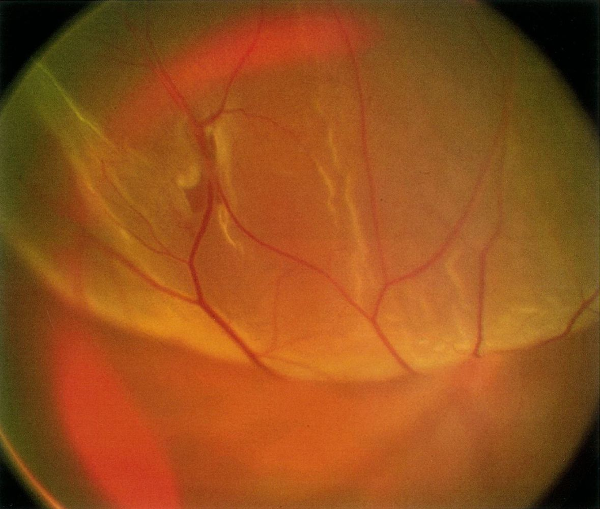
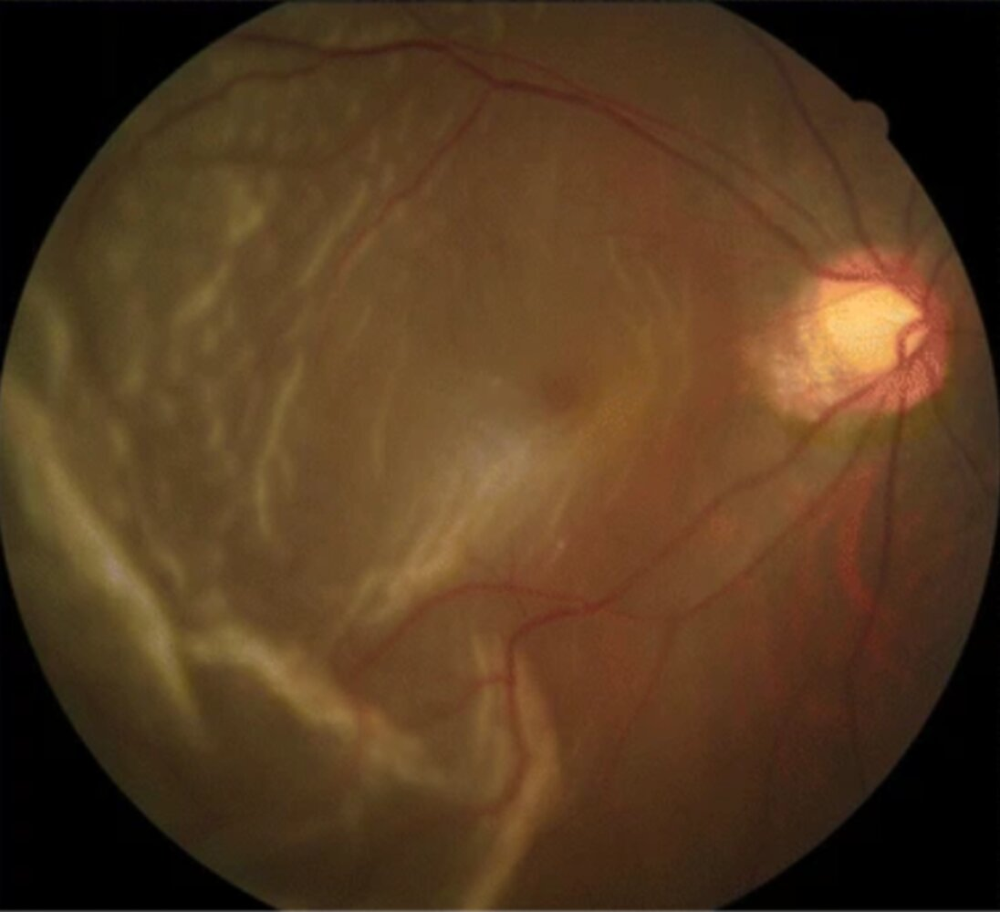
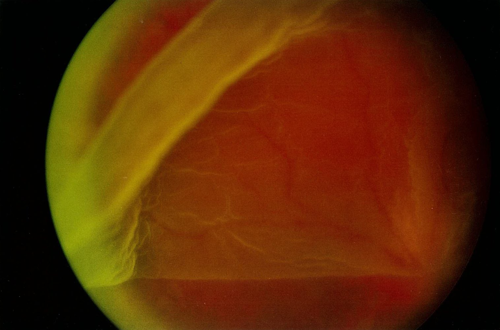
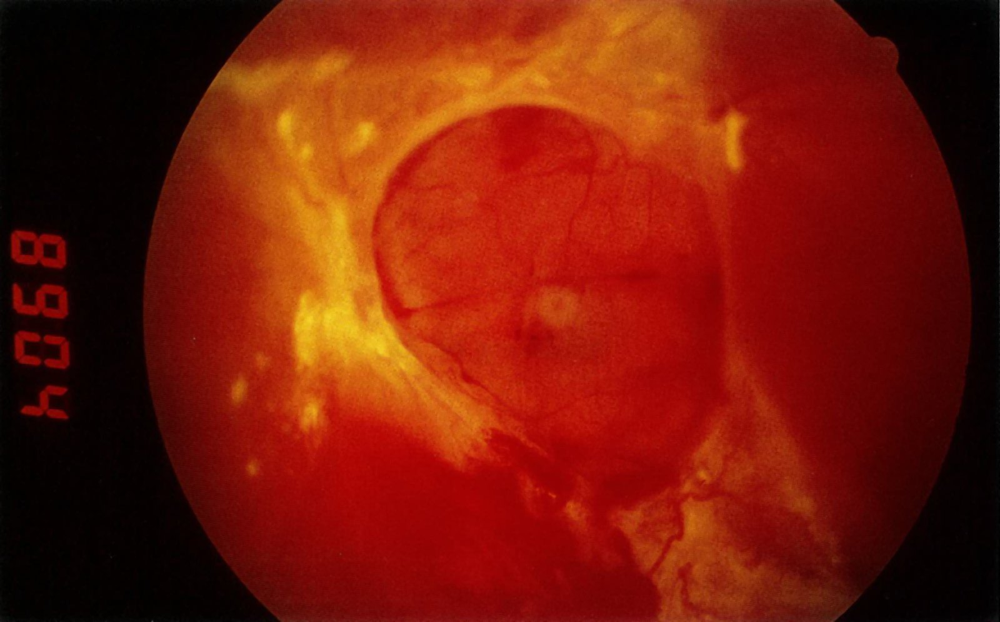
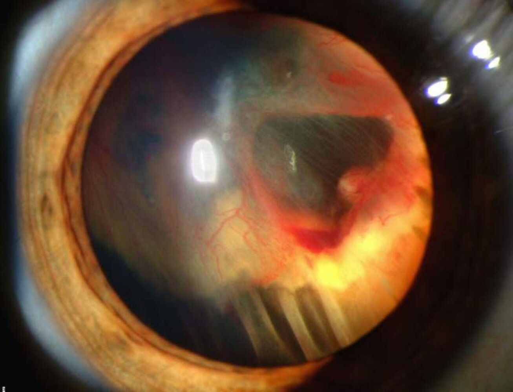
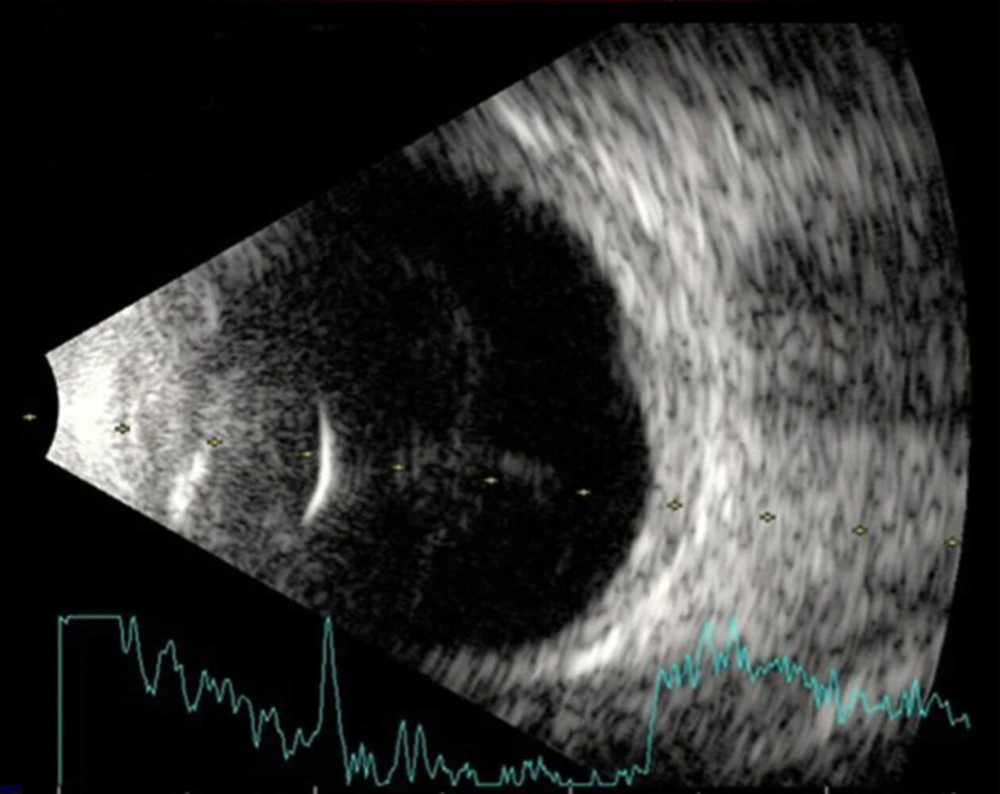
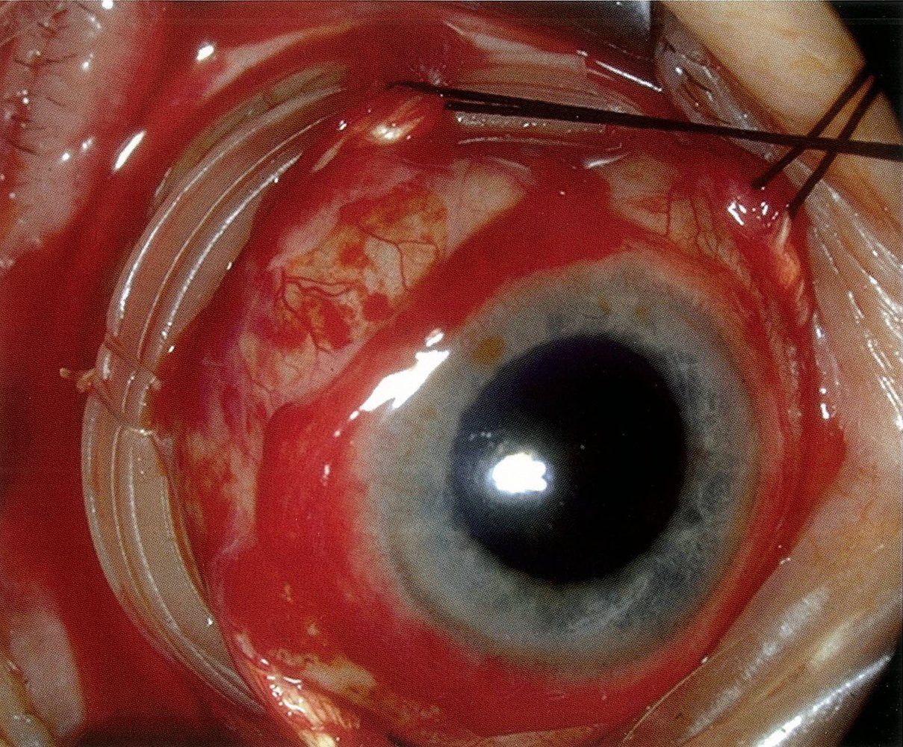

# Retinal detachment

*Categories: Clinical knowledge > Surgery > Ophthalmic surgery > Retinal detachment*

[Original Article Link](https://coursology-qbank.com/amboss/article/tO0X8T)

---

## Summary

Retinal detachment refers to the detachment of the inner layer of the <u>retina</u> (neurosensory <u>retina</u>) from the <u>retinal pigment epithelium</u>. The most frequent causes of retinal detachment are tears or holes in the <u>retina</u> (<u>rhegmatogenous retinal detachment</u>), <u>risk factors</u> for which include <u>myopia</u>, previous intraocular <u>surgery</u>, trauma, and/or <u>posterior vitreous detachment</u>. Less commonly, retinal detachment occurs without any retinal tears (nonrhegmatogenous retinal detachment). Nonrhegmatogenous retinal detachment is most often the result of vitreoretinal bands (e.g., <u>proliferative diabetic retinopathy</u>), subretinal/intraretinal tumors (e.g., <u>choroidal melanoma</u>), or a number of systemic and ocular causes that result in subretinal fluid accumulation. Small detachments typically present with <u>photopsia</u>, <u>floaters</u>, and/or <u>visual field</u> defects. Loss of <u>vision</u> may be severe if the retinal detachment is extensive and/or the <u>macula</u> is affected. The diagnosis is confirmed by <u>fundoscopy</u>. To prevent retinal detachment, <u>laser photocoagulation</u> in the direct vicinity of the retinal defect should be performed after diagnosis of retinal tears or holes. Extensive retinal detachment is a <u>vision</u>-threatening emergency and usually requires prompt <u>surgery</u> to prevent further detachment and restore <u>sensory function</u>. Visual prognosis depends particularly on the extent of retinal detachment (poor with macular involvement) and how much time passes before the <u>retina</u> is reattached.

---

## Etiology

|  Overview [[1]](https://coursology-qbank.com/amboss/article/1xX2vZ0)[[2]](https://coursology-qbank.com/amboss/article/KHaUrN)[[3]](https://coursology-qbank.com/amboss/article/AN1Rdh0)  |  |  |  |  |
| --- | --- | --- | --- | --- |
| Type of retinal detachment |  Rhegmatogenous retinal detachment  | Non-<u>rhegmatogenous retinal detachment</u> |  |  |
| Tractional retinal detachment | <u>Exudative</u> retinal detachment |  |  |  |
| Mechanism |   * Most common type  * Retinal tears → retinal fluid, which is formed by <u>vitreous</u> degeneration, seeps into the subretinal space → retinal detachment    |  * Formation of vitreoretinal bands  → <u>traction</u> on the vitreoretinal band during <u>eye movements</u> or as a result of sudden decrease in intraocular pressure → retinal detachment   |  * Subretinal fluid <u>exudate</u> accumulation without retinal tears   |  * <u>Tumor</u> growth   |
| <u>Risk factors</u> |   * Previous intraocular <u>surgery</u> (e.g., <u>cataract surgery</u>)  * <u>Posterior vitreous detachment</u>  * Retinal detachment of the other <u>eye</u>  * Peripheral retinal breaks, commonly due to:  * <u>Pathological myopia</u>  * Trauma  * <u>Family history</u> of retinal detachment  * Increased age  * <u>CMV retinitis</u>  * Lattice degeneration  * <u>Retinoschisis</u>    |   * <u>Proliferative diabetic retinopathy</u>  * <u>Retinopathy of prematurity</u>  * <u>Sickle cell</u> <u>retinopathy</u>  * Inflammatory effusions  * Plastic <u>cyclitis</u>  * Post-hemorrhagic retinitis proliferans  * <u>Eales disease</u>  * <u>Scar</u> tissue following penetrating injury    |   * Systemic diseases  * <u>Pre-eclampsia</u>  * <u>Hypertension</u>  * <u>Bleeding disorders</u>  * <u>Polyarteritis nodosa</u>  * Ocular diseases  * <u>Central serous retinopathy</u>  * <u>Central retinal vein occlusion</u>  * Coat's <u>exudative</u> <u>retinopathy</u>  * <u>Posterior</u> <u>scleritis</u>  * <u>Harada's disease</u>  * <u>Sympathetic</u> ophthalmopathy  * Sudden decrease in intra-ocular pressure due to perforating injuries or intraocular <u>surgery</u>    |   * <u>Retinoblastoma</u>  * <u>Malignant melanoma</u> of the <u>choroid</u>    |

---

## Pathophysiology

* Detachment of the neurosensory <u>retina</u>, which contains the <u>photoreceptor</u> layer, from the <u>retinal pigment epithelium</u>.

* Disturbed metabolism of the <u>photoreceptor</u> layer leads to loss of retinal function (i.e., <u>vision</u> impairment)

* Separation of the <u>retina</u> from the <u>choroid</u> for more than 12 hours leads to retinal <u>ischemia</u> and retinal degeneration.

---

## Clinical features

### Symptoms [[2]](https://coursology-qbank.com/amboss/article/KHaUrN)[[3]](https://coursology-qbank.com/amboss/article/AN1Rdh0)

Symptoms may be unilateral or bilateral depending on the underlying etiology.

* <u>Prodromal</u> symptoms: caused by <u>posterior vitreous detachment</u>

* Sudden increase in <u>floaters</u> (shower of <u>floaters</u>)

* <u>Flashes of light</u> (<u>photopsia</u>)

* Sudden, painless loss of <u>vision</u>: caused by retinal detachment

* Typically described as a curtain or shadow either descending or ascending across the field of <u>vision</u>

* May be partial (<u>scotoma</u>) or complete depending on the extent of retinal detachment and macular involvement

> [!TIP]
> Most retinal detachments are preceded by a <u>posterior vitreous detachment</u> or a retinal tear, which manifest with <u>photopsia</u> and <u>floaters</u>. <u>Photopsia</u> is typically absent in individuals with <u>exudative</u> retinal detachment. [[2]](https://coursology-qbank.com/amboss/article/KHaUrN)[[4]](https://coursology-qbank.com/amboss/article/kIYm1q)

### Examination findings [[3]](https://coursology-qbank.com/amboss/article/AN1Rdh0)[[5]](https://coursology-qbank.com/amboss/article/HLWK_N0)

* <u>Visual acuity</u>: may be normal or significantly decreased depending on the extent and position of the retinal detachment

* <u>Visual field examination</u>: <u>visual field</u> defects corresponding to the site of detachment

* <u>Pupillary examination</u>: <u>relative afferent pupillary defect</u> in individuals with retinal detachments involving the fovea [[4]](https://coursology-qbank.com/amboss/article/kIYm1q)

> [!TIP]
> Individuals with retinal tears may have preserved <u>visual acuity</u> but, if left untreated, retinal tears can progress to retinal detachment and <u>vision loss</u>. [[5]](https://coursology-qbank.com/amboss/article/HLWK_N0)

---

## Diagnosis

### General principles [[3]](https://coursology-qbank.com/amboss/article/AN1Rdh0)[[5]](https://coursology-qbank.com/amboss/article/HLWK_N0)

Immediately refer all patients with <u>photopsia</u> or sudden painless <u>visual field</u> defects to ophthalmology for same-day evaluation.

* <u>Fundoscopy</u> is required to confirm the diagnosis.

* If the fundus is obscured by hemorrhage, ocular <u>ultrasound</u> can be considered.

* Additional studies may be required to assess for complications or surgical planning.

### <u>Fundoscopy</u>

* Perform a dilated <u>eye examination</u> of both eyes. [[6]](https://coursology-qbank.com/amboss/article/b0dHeo0)

* <u>Direct fundoscopy</u> can detect central hemorrhages.

* <u>Indirect fundoscopy</u> is used to evaluate the peripheral <u>retina</u>.

* Findings

* The detached <u>retina</u> appears pale and opaque and masks the underlying choroidal vasculature. [[6]](https://coursology-qbank.com/amboss/article/b0dHeo0)

* Additional findings are specific to the type of retinal detachment.

|  Fundoscopic findings in retinal detachment [[2]](https://coursology-qbank.com/amboss/article/KHaUrN)  |  |  |  |
| --- | --- | --- | --- |
|  | <u>Rhegmatogenous retinal detachment</u> | Tractional retinal detachment | <u>Exudative</u> retinal detachment |
| Characteristics of the detached <u>retina</u> |  * <u>Convex</u> with a wrinkled surface that billows with <u>eye movements</u>   |  * Tented or <u>concave</u>, immobile   |  * <u>Convex</u> with a smooth surface   |
| Subretinal fluid |  * Present   |  * Minimal or absent   |   * Present  * Moves when the patient changes position (gravity-dependent)    |
| Additional features |  * Retinal tears (e.g., horseshoe, linear, or round retinal tears)   |  * Usually no retinal tears   |   * No retinal tears  * Features of the underlying etiology (e.g., <u>choroid</u> <u>tumor</u>) may be present.    |

> [!TIP]
> Examine both eyes in patients with suspected retinal detachment. [[2]](https://coursology-qbank.com/amboss/article/KHaUrN)

> [!WARNING]
> Retinal detachment cannot be excluded based on <u>direct fundoscopy</u> alone because of its poor visualization of the peripheral <u>retina</u>. [[3]](https://coursology-qbank.com/amboss/article/AN1Rdh0)

Rhegmatogenous retinal detachment

Rhegmatogenous retinal detachment

Traumatic retinal detachment

Tractional retinal detachment in proliferative diabetic retinopathy

Retinal detachment

### <u>Point-of-care ocular ultrasound</u>

* Indications: dense <u>vitreous hemorrhage</u> or <u>cataract</u> occluding the view of the fundus [[5]](https://coursology-qbank.com/amboss/article/HLWK_N0)[[6]](https://coursology-qbank.com/amboss/article/b0dHeo0)

* Findings

* A retinal detachment appears as a distinct <u>hyperechoic</u> membrane within the <u>vitreous</u> cavity.  [[3]](https://coursology-qbank.com/amboss/article/AN1Rdh0)[[7]](https://coursology-qbank.com/amboss/article/Y0dneo0)

* <u>Vitreous hemorrhage</u> may be seen as <u>hyperechoic</u> points within the <u>vitreous</u> cavity.  [[7]](https://coursology-qbank.com/amboss/article/Y0dneo0)

> [!TIP]
> Ocular <u>ultrasound</u> is operator-dependent and cannot detect retinal tears. [[3]](https://coursology-qbank.com/amboss/article/AN1Rdh0)[[7]](https://coursology-qbank.com/amboss/article/Y0dneo0)

Vitreous hemorrhage

### Further testing

Additional studies performed by a specialist may include:

* <u>Intraocular pressures</u>  [[2]](https://coursology-qbank.com/amboss/article/KHaUrN)

* <u>Electroretinography</u> [[8]](https://coursology-qbank.com/amboss/article/10d2Uo0)

* <u>Optical coherence tomography</u> [[9]](https://coursology-qbank.com/amboss/article/c0daUo0)

---

## Treatment

### Approach [[3]](https://coursology-qbank.com/amboss/article/AN1Rdh0)[[5]](https://coursology-qbank.com/amboss/article/HLWK_N0)

* Urgently refer to ophthalmology; retinal detachment is a <u>vision</u>-threatening emergency.

* Advise patients to reduce head and <u>eye movements</u> as much as possible until seen.  [[12]](https://coursology-qbank.com/amboss/article/W0dPUo0)

* Further management depends on the type and severity of retinal detachment.

### <u>Rhegmatogenous retinal detachment</u> [[13]](https://coursology-qbank.com/amboss/article/Z0dZeo0)

* Retinal holes with little or no retinal detachment: <u>laser photocoagulation</u> or <u>cryoretinopexy</u> in the direct vicinity of the retinal defect  [[1]](https://coursology-qbank.com/amboss/article/1xX2vZ0)

* Extensive retinal detachment

* Prompt surgical treatment is required.

* Options include: [[2]](https://coursology-qbank.com/amboss/article/KHaUrN)[[13]](https://coursology-qbank.com/amboss/article/Z0dZeo0)[[14]](https://coursology-qbank.com/amboss/article/00deeo0)

* <u>Pneumatic retinopexy</u>

* <u>Scleral buckling</u>

* Pars plana <u>vitrectomy</u>

> [!WARNING]
> <u>Rhegmatogenous retinal detachment</u> warrants prompt surgical intervention.

Scleral buckling surgery in rhegmatogenous retinal detachment

### Nonrhegmatogenous retinal detachment [[2]](https://coursology-qbank.com/amboss/article/KHaUrN)

* Tractional retinal detachment: <u>vitrectomy</u> with or without <u>scleral buckling</u>  [[2]](https://coursology-qbank.com/amboss/article/KHaUrN)[[15]](https://coursology-qbank.com/amboss/article/a0dQeo0)

* <u>Exudative</u> (serous) retinal detachment [[2]](https://coursology-qbank.com/amboss/article/KHaUrN)

* Treatment of the underlying cause

* <u>Surgery</u> is not usually required.

---

## Complications

* Without treatment, progressive retinal detachment causes blindness, especially if the <u>macula</u> is involved.

* Proliferative vitreoretinopathy

* Toxic <u>uveitis</u> (due to endocular toxins) in long-standing retinal detachment

* Retinal detachment in the other <u>eye</u>

We list the most important complications. The selection is not exhaustive.

---