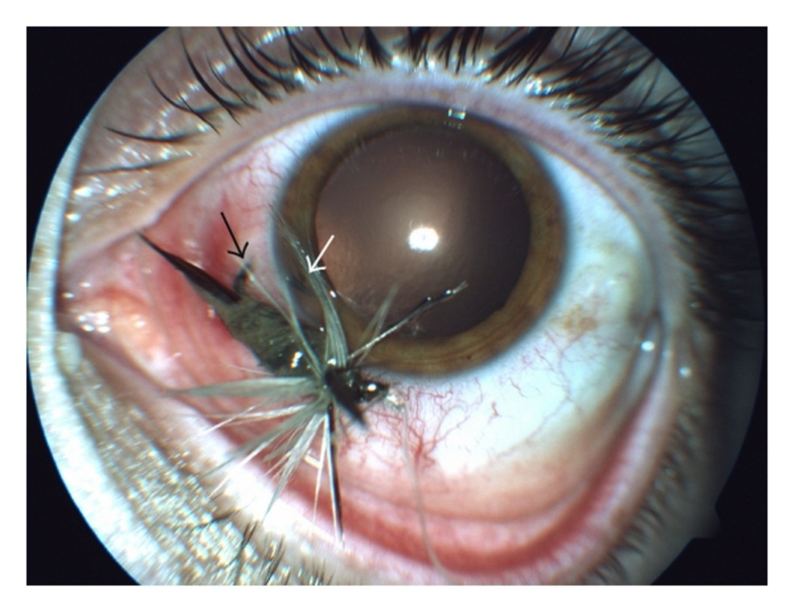
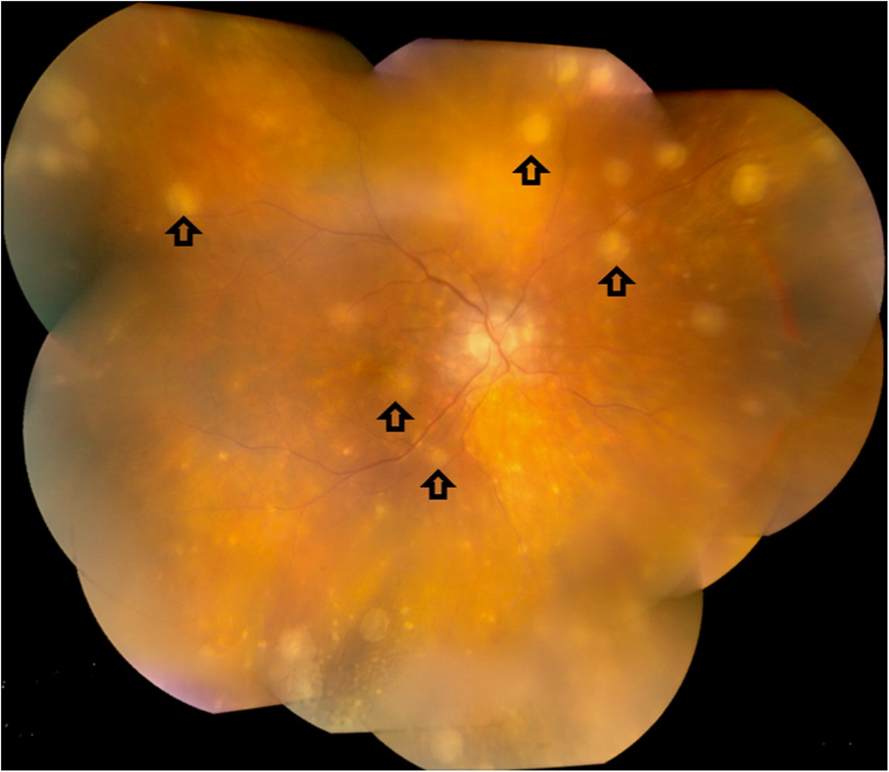
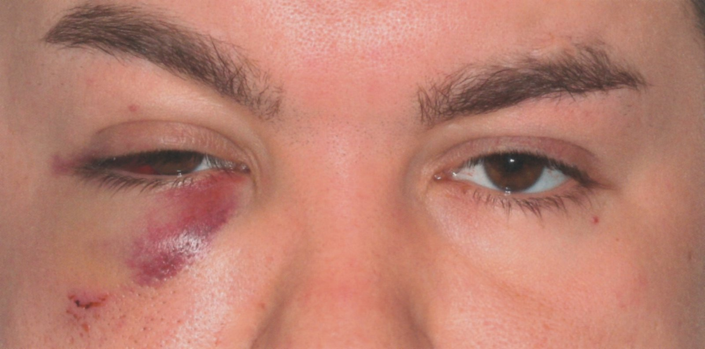
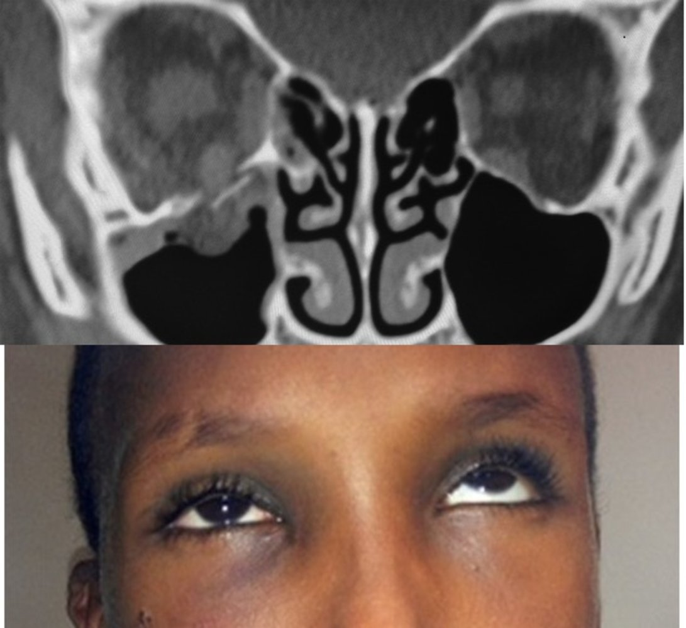
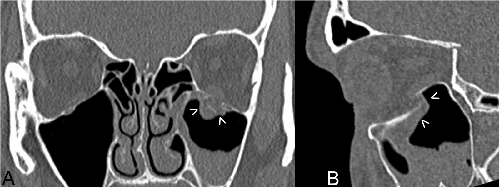
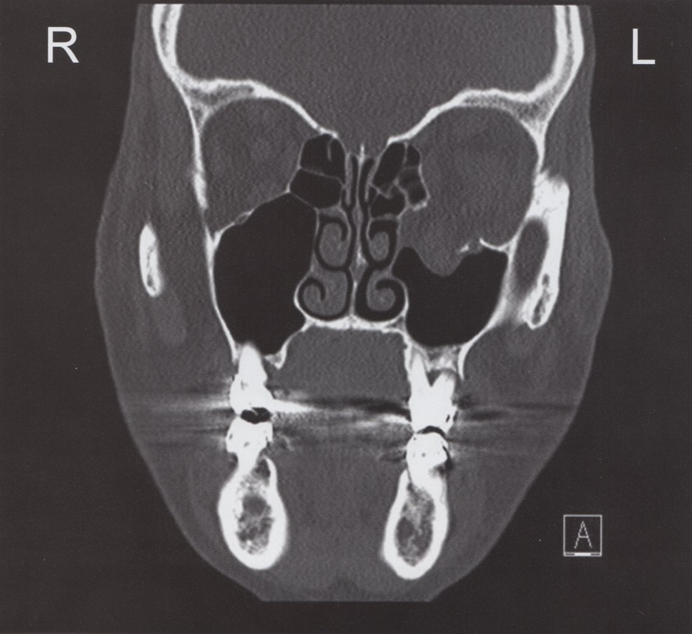
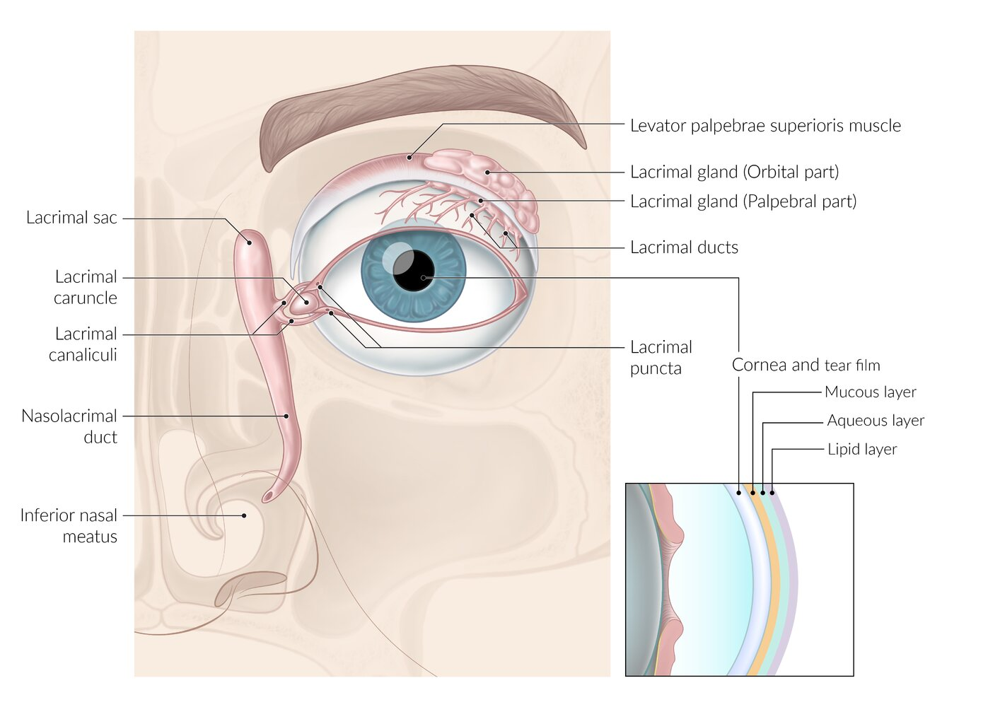

# Traumatic eye injuries

*Categories: Clinical knowledge > Surgery > Ophthalmic surgery > Traumatic eye injuries*

[Original Article Link](https://coursology-qbank.com/amboss/article/EO088T)

---

## Summary

Trauma to the <u>eye</u> may be caused by blunt or penetrating impact or a chemical, thermal, or <u>radiation burn</u>. Clinical presentation varies by injury; common symptoms include <u>pain</u> and reduced <u>visual acuity</u>. The initial diagnostic approach aims to identify <u>red flags of serious eye injury</u> and involves an <u>external eye examination</u>, <u>slit lamp examination</u> with <u>fluorescein stain</u>, and testing of <u>visual fields</u> and <u>visual acuity</u>. Emergency measures include immediate large-volume <u>irrigation</u> for <u>chemical ocular burns</u> and <u>lateral canthotomy and cantholysis</u> for <u>orbital compartment syndrome</u>. If an <u>open globe injury</u> is suspected, the examination should be stopped, an <u>eye</u> shield should be placed, and systemic <u>antibiotics</u> administered. Most injuries require urgent ophthalmology consultation for definitive treatment. Complications of ocular trauma include <u>traumatic cataracts</u>, <u>endophthalmitis</u>, and loss of <u>vision</u>.

See also “<u>Corneal disorders</u>,” “<u>Diseases of the vitreous body</u>,” “<u>Orbital disorders</u>,” and “<u>Blast-induced ocular trauma</u>.”

---

## Open globe injuries

### Definition

An <u>open globe injury</u> is a full thickness perforation or <u>laceration</u> of the ocular globe.  [[10]](https://coursology-qbank.com/amboss/article/eOWxrl0)[[18]](https://coursology-qbank.com/amboss/article/7MW4JN0)

### Etiology [[18]](https://coursology-qbank.com/amboss/article/7MW4JN0)

* <u>Penetrating trauma</u> (globe <u>laceration</u>)

* High-<u>velocity</u> <u>blunt trauma</u> (globe rupture)

### Red flags for open globe injury [[4]](https://coursology-qbank.com/amboss/article/RmWl2N0)[[11]](https://coursology-qbank.com/amboss/article/HKWK3m0)[[20]](https://coursology-qbank.com/amboss/article/STbyJG)

* Gross deformity of the <u>eye</u> with volume loss

* Visible full-thickness <u>laceration</u>

* Prolapse of globe contents

* <u>Afferent pupillary defect</u> and impaired <u>visual acuity</u>

* Eccentric or <u>teardrop pupil</u>

* Protruding foreign body

* Large <u>bullous subconjunctival hemorrhage</u> (e.g., hemorrhage completely surrounds the <u>cornea</u>)

* Depth of <u>anterior</u> chamber differs from unaffected <u>eye</u>

* Limitation of extraocular motility

* Severe decrease in <u>visual acuity</u>

> [!WARNING]
> Always consider the possibility of <u>open globe injury</u> in patients with <u>eye</u> trauma; occult rupture may be difficult to diagnose. [[4]](https://coursology-qbank.com/amboss/article/RmWl2N0)[[20]](https://coursology-qbank.com/amboss/article/STbyJG)

Penetrating ocular injury (fish hook)

### Diagnostics [[6]](https://coursology-qbank.com/amboss/article/CkWqJl0)[[11]](https://coursology-qbank.com/amboss/article/HKWK3m0)

* Follow the <u>approach to traumatic eye injuries</u>.

* Evaluate the <u>anterior</u> and <u>posterior</u> segment of the <u>eye</u> (using <u>slit lamp</u> and <u>fundoscopy</u>, respectively).

* Application of <u>fluorescein stain</u>

* <u>Corneal abrasions</u> and foreign bodies may be seen.

* Positive <u>Seidel test</u>: Fluorescein washed away by fluid emanating from the globe suggests an <u>open globe injury</u>.

* CT <u>orbits</u> without contrast can be used if the <u>eye</u> cannot be directly visualized or to exclude the possibility of an intraocular foreign body.  [[2]](https://coursology-qbank.com/amboss/article/AN1Rdh0)

* Culture of the <u>vitreous</u> fluid if a foreign body or infection is suspected

### Treatment [[2]](https://coursology-qbank.com/amboss/article/AN1Rdh0)[[4]](https://coursology-qbank.com/amboss/article/RmWl2N0)[[11]](https://coursology-qbank.com/amboss/article/HKWK3m0)[[21]](https://coursology-qbank.com/amboss/article/5mWiTN0)

* Stop further <u>ocular examination</u> immediately if an <u>open globe injury</u> is suspected.

* Place a protective <u>eye</u> shield.

* Consult ophthalmology: Surgical repair within 12–24 hours is optimal. [[21]](https://coursology-qbank.com/amboss/article/5mWiTN0)

* Rapidly control <u>pain</u> and <u>vomiting</u>.  [[21]](https://coursology-qbank.com/amboss/article/5mWiTN0)

* Consider <u>parenteral analgesics</u>.

* Consider early and/or prophylactic <u>antiemetics</u>.

* Administer <u>tetanus postexposure prophylaxis</u> if indicated.

* Begin systemic <u>antibiotics</u> in consultation with ophthalmology, e.g.:

* <u>Vancomycin</u> (<u>off-label</u>) DOSAGE [[22]](https://coursology-qbank.com/amboss/article/LMbw68)

* AND <u>ceftazidime</u> (<u>off-label</u>) DOSAGE [[22]](https://coursology-qbank.com/amboss/article/LMbw68) OR <u>ciprofloxacin</u> (<u>off-label</u>) DOSAGE [[22]](https://coursology-qbank.com/amboss/article/LMbw68)

> [!WARNING]
> Administer <u>antibiotics</u>, as <u>endophthalmitis</u> from the injury can be more severe than the injury itself, resulting in loss of <u>vision</u> and necessitating enucleation. [[11]](https://coursology-qbank.com/amboss/article/HKWK3m0)[[21]](https://coursology-qbank.com/amboss/article/5mWiTN0)

> [!NOTE]
> Avoid topical ointments in <u>open globe injuries</u>.

### Complications [[11]](https://coursology-qbank.com/amboss/article/HKWK3m0)[[23]](https://coursology-qbank.com/amboss/article/IhYY2K)[[24]](https://coursology-qbank.com/amboss/article/Z5WZiN0)

* Permanent <u>vision loss</u>

* Loss of <u>eye</u>

* <u>Endophthalmitis</u>

* Sympathetic ophthalmia: bilateral granulomatous panuveitis after unilateral penetrating injury or intraocular <u>surgery</u> that may result in bilateral blindness ;  [[11]](https://coursology-qbank.com/amboss/article/HKWK3m0)[[24]](https://coursology-qbank.com/amboss/article/Z5WZiN0)

* Etiology: delayed autoimmune reaction beginning weeks to months after inciting injury

* Clinical features

* <u>Eye</u> sustaining original trauma: irritation, redness

* Originally uninjured <u>eye</u>: irritation, blurred <u>vision</u>, <u>photophobia</u>

* Treatment options: <u>glucocorticoids</u>, immunomodulators, early removal of the injured <u>eye</u>

Sympathetic ophthalmia

---

## Orbital fractures

<u>Orbital fractures</u> are commonly seen in facial trauma and up to 29% have an associated ocular injury. [[25]](https://coursology-qbank.com/amboss/article/a5WQiN0)

### Definitions [[4]](https://coursology-qbank.com/amboss/article/RmWl2N0)

* Blowout fracture: a <u>fracture</u> of the orbital floor (most common) or orbital wall without a <u>fracture</u> of the orbital rim

* Combined orbital fracture: a <u>fracture</u> involving both the orbital wall and the orbital rim [[26]](https://coursology-qbank.com/amboss/article/w5WhmN0)

> [!TIP]
> A well-demarcated, palpable unevenness along the orbital rim (“step-off”) may be present with a <u>combined orbital fracture</u>.

### Etiology [[25]](https://coursology-qbank.com/amboss/article/a5WQiN0)[[27]](https://coursology-qbank.com/amboss/article/05WeiN0)

Force from <u>blunt trauma</u> to the <u>eye</u> (e.g., from a punch or <u>motor vehicle collision</u>) is conducted through the globe to weak portions of the <u>orbit</u>, e.g., the <u>infraorbital groove</u>.  [[25]](https://coursology-qbank.com/amboss/article/a5WQiN0)[[28]](https://coursology-qbank.com/amboss/article/Y5WniN0)

### Clinical features [[2]](https://coursology-qbank.com/amboss/article/AN1Rdh0)[[25]](https://coursology-qbank.com/amboss/article/a5WQiN0)

* Periorbital <u>pain</u>, <u>edema</u>, and/or <u>ecchymosis</u>

* <u>Enophthalmos</u>  or <u>proptosis</u>

* <u>Chemosis</u>, <u>subconjunctival hemorrhage</u> [[25]](https://coursology-qbank.com/amboss/article/a5WQiN0)

* <u>Hypesthesia</u> of the <u>infraorbital nerve</u> (a branch of V2)

* Restricted ocular movement 

* Patients typically report <u>diplopia</u>. [[4]](https://coursology-qbank.com/amboss/article/RmWl2N0)

* Restricted upward gaze is most common (caused by entrapment of the inferior rectus muscle). [[4]](https://coursology-qbank.com/amboss/article/RmWl2N0)

* Orbital rim step-off may be palpable in <u>combined orbital fractures</u>.

* Oculocardiac reflex

* <u>Bradycardia</u>, <u>vomiting</u>, and/or <u>syncope</u> triggered by pressure on the globe and/or <u>traction</u> of the <u>extraocular muscles</u>

* May be triggered by <u>eye</u> movement if orbital tissue is trapped within the <u>fracture</u> [[25]](https://coursology-qbank.com/amboss/article/a5WQiN0)[[26]](https://coursology-qbank.com/amboss/article/w5WhmN0)

* <u>Epistaxis</u>, orbital <u>emphysema</u>, and/or <u>crepitus</u> (if the sinuses are involved) [[27]](https://coursology-qbank.com/amboss/article/05WeiN0)

Lid hematoma and subconjunctival bleeding

Orbital floor fracture

### Diagnostics [[2]](https://coursology-qbank.com/amboss/article/AN1Rdh0)[[4]](https://coursology-qbank.com/amboss/article/RmWl2N0)[[11]](https://coursology-qbank.com/amboss/article/HKWK3m0)[[25]](https://coursology-qbank.com/amboss/article/a5WQiN0)

* Follow the <u>approach to traumatic eye injuries</u>.

* Palpate for orbital rim step-off and <u>subcutaneous emphysema</u>.

* <u>Examine extraocular movements</u> to evaluate for <u>extraocular muscle</u> entrapment.

* <u>Measure IOP</u> to evaluate for <u>orbital compartment syndrome</u>.

* Obtain imaging: CT (<u>gold standard</u>) or <u>x-ray</u>  

* Muscle entrapment and/or <u>edema</u>

* Teardrop sign: prolapsed orbital tissue in the inferior sinuses, e.g., fat, <u>connective tissue</u>, <u>inferior rectus muscle</u>

* <u>Air-fluid level</u> in the sinus suggests bleeding.

Clinical testing of the extraocular muscles

Blowout fracture of the orbital floor

Orbital floor fracture

Blowout fracture of the orbital floor

### Treatment [[3]](https://coursology-qbank.com/amboss/article/Y6Wnjm0)[[4]](https://coursology-qbank.com/amboss/article/RmWl2N0)[[25]](https://coursology-qbank.com/amboss/article/a5WQiN0)[[27]](https://coursology-qbank.com/amboss/article/05WeiN0)

* Provide <u>supportive care</u>.

* Elevate the head of the bed.

* Apply ice packs to the <u>orbit</u> for the first 48 hours. [[2]](https://coursology-qbank.com/amboss/article/AN1Rdh0)

* Consider <u>nasal decongestants</u> and <u>corticosteroids</u> to reduce swelling.

* If CT shows <u>sinusitis</u>, provide <u>antibiotic prophylaxis</u>.  [[2]](https://coursology-qbank.com/amboss/article/AN1Rdh0)

* If patients have <u>lagophthalmos</u>, provide ophthalmic lubricating ointment.

* Obtain specialist consult for further management, e.g., ophthalmology, ENT.

* Urgent surgical <u>fracture</u> repair may be required for, e.g.: [[2]](https://coursology-qbank.com/amboss/article/AN1Rdh0)[[3]](https://coursology-qbank.com/amboss/article/Y6Wnjm0)

* <u>Pediatric fractures</u>

* Persistent <u>oculocardiac reflex</u>

* <u>Extraocular muscle</u> entrapment

* Some patients may be suitable for discharge and follow-up with the consulting <u>surgeon</u>.  [[3]](https://coursology-qbank.com/amboss/article/Y6Wnjm0)[[25]](https://coursology-qbank.com/amboss/article/a5WQiN0)

* See “<u>Facial fractures</u>” for management of concomitant <u>facial fractures</u>.

> [!WARNING]
> Caution the patient to avoid blowing their nose, sneezing with the mouth closed, or <u>Valsalva maneuvers</u>, as these may cause orbital <u>emphysema</u> and result in <u>orbital compartment syndrome</u>. [[2]](https://coursology-qbank.com/amboss/article/AN1Rdh0)

---

## Ocular burns

### Ocular chemical burns

An <u>ocular chemical burn</u> is an injury of the <u>eye</u> with acidic or alkaline substances, which can lead to irreversible ocular damage in as little as 5–15 minutes.

#### Etiology [[4]](https://coursology-qbank.com/amboss/article/RmWl2N0)[[29]](https://coursology-qbank.com/amboss/article/V5WGQN0)

Both acids and alkalis can cause chemical <u>burns</u>, but alkaline substances are especially damaging.  [[29]](https://coursology-qbank.com/amboss/article/V5WGQN0)[[30]](https://coursology-qbank.com/amboss/article/sLWt_N0)[[31]](https://coursology-qbank.com/amboss/article/d5WoQN0)

* Alkaline substances (most common etiology): oven and drain cleaner, lime plaster, sparklers, fertilizer, bleach, dust from airbag deployment

* Acidic substances: battery acid, industrial etching material

#### Clinical features [[30]](https://coursology-qbank.com/amboss/article/sLWt_N0)[[32]](https://coursology-qbank.com/amboss/article/imWJ2N0)

* Signs

* <u>Erythematous</u> <u>conjunctiva</u> and/or whitening of the <u>conjunctiva</u>

* Cloudy <u>cornea</u>

* Swelling and <u>burns</u> to the <u>eyelid</u>

* Symptoms

* Intense <u>pain</u>

* <u>Blepharospasm</u> and involuntary <u>eyelid</u> closure

* <u>Photophobia</u> and <u>epiphora</u>

* Visual impairment

#### Management [[2]](https://coursology-qbank.com/amboss/article/AN1Rdh0)[[11]](https://coursology-qbank.com/amboss/article/HKWK3m0)[[29]](https://coursology-qbank.com/amboss/article/V5WGQN0)[[30]](https://coursology-qbank.com/amboss/article/sLWt_N0)[[31]](https://coursology-qbank.com/amboss/article/d5WoQN0)[[32]](https://coursology-qbank.com/amboss/article/imWJ2N0)

* Perform immediate large-volume irrigation of the eye and fornices. [[4]](https://coursology-qbank.com/amboss/article/RmWl2N0)[[11]](https://coursology-qbank.com/amboss/article/HKWK3m0)[[30]](https://coursology-qbank.com/amboss/article/sLWt_N0)

* Apply topical <u>anesthetic</u>, e.g., <u>tetracaine</u> DOSAGE, if readily available.

* Irrigate with at least 2 L of fluid.

* Measure the <u>pH</u> in the fornices ∼ 5 minutes after stopping <u>irrigation</u>.

* Resume <u>irrigation</u> if <u>pH</u> is not 7–7.5.

* Use assistive devices to facilitate <u>irrigation</u>, e.g., irrigating scleral <u>lens</u> and <u>eyelid</u> retractors.

* Evert the eyelids and inspect the fornices for retained chemical gel or solid material.

* After <u>pH</u> normalizes, follow the <u>approach to traumatic eye injuries</u>.

* Consult ophthalmology for further evaluation and management (e.g., <u>topical steroids</u>, topical <u>antibiotics</u>).

> [!TIP]
> Patients outside the hospital should be advised to irrigate the affected <u>eye</u> with a copious amount of water for ≥15 minutes before traveling to the emergency department; immediate <u>irrigation</u> is the most important factor in preventing <u>vision loss</u>.

#### Complications [[2]](https://coursology-qbank.com/amboss/article/AN1Rdh0)

* Blindness

* Scarring, clouding, and/or <u>ulceration</u> of the <u>cornea</u>

* <u>Neovascularization</u> of the <u>cornea</u>

* <u>Glaucoma</u>

* Symblepharon: adhesions between the <u>eyelid</u> (palpebral <u>conjunctiva</u>) and the globe (bulbar <u>conjunctiva</u>)

### Radiation <u>ocular burns</u> [[33]](https://coursology-qbank.com/amboss/article/fqWkBm0)[[34]](https://coursology-qbank.com/amboss/article/TqW6Bm0)[[35]](https://coursology-qbank.com/amboss/article/gqWFBm0)

* <u>Ultraviolet light</u>-induced <u>burns</u>: caused by welding or exposure to intense sunlight without protective eyewear

* Infrared-induced <u>burns</u>: caused by exposure to near-infrared lasers or sources that emit large amounts of infrared light (e.g., molten glass) without protective eyewear [[36]](https://coursology-qbank.com/amboss/article/iwWJin0)

* See “<u>Photokeratitis</u>” for management.

### Thermal <u>ocular burns</u> [[33]](https://coursology-qbank.com/amboss/article/fqWkBm0)

* Rare, as the <u>eye</u> is protected by the <u>blink reflex</u> and <u>Bell phenomenon</u>

* <u>Eyelid</u> <u>burns</u> may result in <u>lagophthalmos</u> and subsequent early or delayed corneal injury.

* Management

* Irrigate the <u>eye</u> with at least 1 L <u>Ringer's lactate</u> or other buffered solution. [[33]](https://coursology-qbank.com/amboss/article/fqWkBm0)

* Follow the <u>approach to traumatic eye injuries</u> after <u>irrigation</u>.

* Consult ophthalmology for further management (e.g., topical <u>antibiotics</u>, <u>steroids</u>, and lubricants). [[11]](https://coursology-qbank.com/amboss/article/HKWK3m0)

---

## Eyelid lacerations

### Etiology [[2]](https://coursology-qbank.com/amboss/article/AN1Rdh0)[[4]](https://coursology-qbank.com/amboss/article/RmWl2N0)

* Blunt or <u>penetrating trauma</u>

* <u>Animal bites</u>

### Management [[2]](https://coursology-qbank.com/amboss/article/AN1Rdh0)[[4]](https://coursology-qbank.com/amboss/article/RmWl2N0)[[11]](https://coursology-qbank.com/amboss/article/HKWK3m0)[[37]](https://coursology-qbank.com/amboss/article/j5W_PN0)

* Follow the <u>approach to traumatic eye injuries</u>.

* Visual inspection to exclude an <u>open globe injury</u> before examination and treatment of <u>eyelid trauma</u>

* Consider imaging, e.g., CT <u>orbits</u> without contrast, to rule out suspected foreign bodies.

* Evaluate for <u>lacrimal duct lacerations</u>.

* Perform <u>laceration</u> repair.

* Simple <u>lacerations</u> : Perform <u>primary wound closure</u> with <u>wound closure techniques</u>.

* Complex <u>lacerations</u> : Consult ophthalmology and/or plastic <u>surgery</u> for <u>laceration</u> repair. [[2]](https://coursology-qbank.com/amboss/article/AN1Rdh0)

* Administer <u>tetanus postexposure prophylaxis</u> if indicated.

* <u>Manage bite wounds</u> with <u>antibiotic</u> and <u>rabies postexposure prophylaxis</u> if indicated.

> [!WARNING]
> Use <u>tissue adhesives</u> on periocular <u>lacerations</u> with caution, as they can cause chemical injury to the <u>eye</u> and/or glue the <u>eyelid</u> open or shut. [[38]](https://coursology-qbank.com/amboss/article/UqWbBm0)

Lacrimal apparatus and tear film layers

---