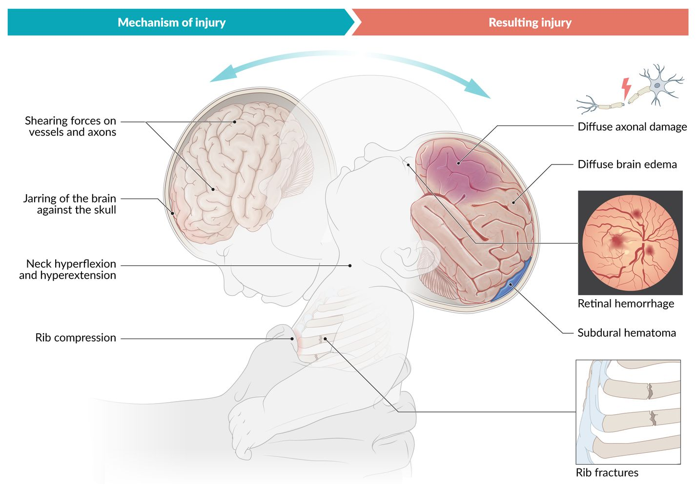
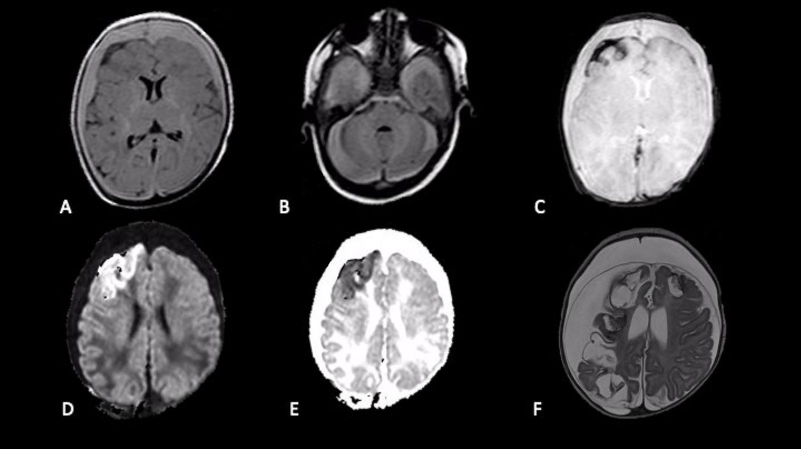
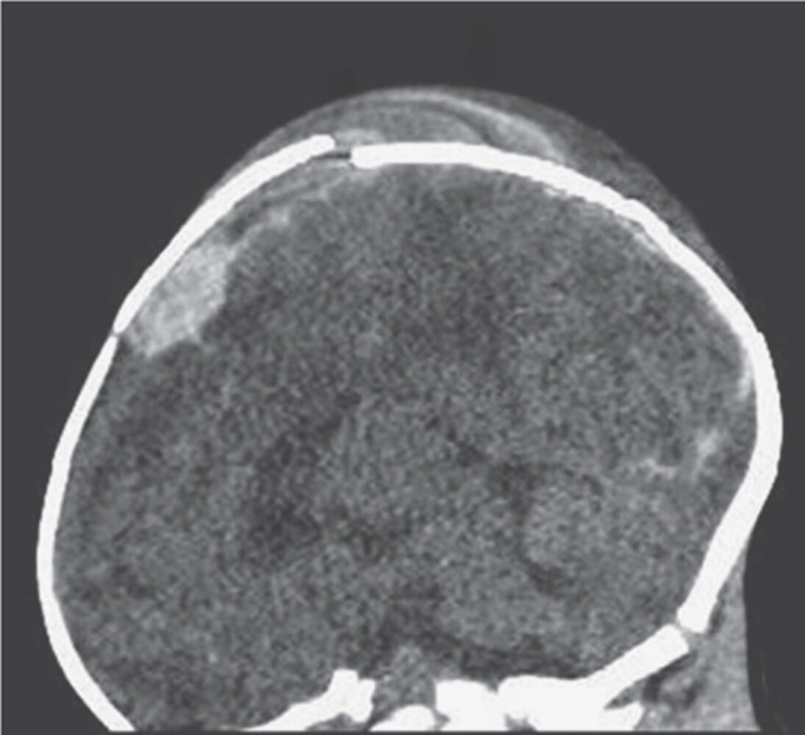
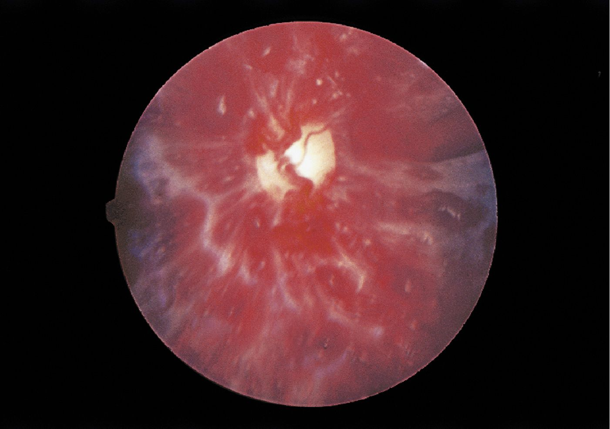

# Child maltreatment

*Categories: Clinical knowledge > Surgery > Pediatric surgery > Child maltreatment*

[Original Article Link](https://coursology-qbank.com/amboss/article/mP0V2T)

---

## Summary

Child maltreatment is any act or failure to act that results in potential or actual harm to a child, usually involving a caregiver. <u>Types of child maltreatment</u> include neglect, physical abuse, <u>sexual abuse</u>, psychological maltreatment, and <u>medical child abuse</u>. Children under the age of 1 year are most commonly affected. <u>Risk factors for child maltreatment</u> include physical or developmental disabilities and caregiver factors (e.g., <u>substance use disorders</u>, <u>intimate partner violence</u>). When child maltreatment is suspected, use a <u>trauma-informed approach</u> to perform a detailed clinical evaluation, including evaluation of acute injuries, medical and developmental history, growth assessment, and a <u>physical examination</u>, ensuring detailed documentation. Management includes medical stabilization if necessary and immediately reporting any suspected child maltreatment to Child Protective Services (<u>CPS</u>). Additional diagnostic testing and management should be performed based on the type of abuse suspected (e.g., imaging for patients with suspected <u>fractures</u>, <u>STI testing</u> for suspected <u>sexual abuse</u>). Prevention includes the identification and management of <u>risk factors for child maltreatment</u>.

---

## Overview

### Definition [[1]](https://coursology-qbank.com/amboss/article/3tdSW70)[[2]](https://coursology-qbank.com/amboss/article/Qsduur0)

* Any act or failure to act that results in potential or actual harm to a child, usually involving a caregiver

* Types of child maltreatment include: [[2]](https://coursology-qbank.com/amboss/article/Qsduur0)

* <u>Child neglect</u>

* <u>Physical child abuse</u>

* <u>Child sexual abuse</u>

* <u>Psychological maltreatment of a child</u>

* <u>Medical child abuse</u>

* Exact legal definitions of child maltreatment vary by state; check local laws.

### <u>Epidemiology</u> [[1]](https://coursology-qbank.com/amboss/article/3tdSW70)

* Approx. 7 per 1000 children in the US experience child maltreatment annually.

* The highest rate of child maltreatment and <u>death</u> is in children < 1 year of age. [[1]](https://coursology-qbank.com/amboss/article/3tdSW70)

* The perpetrator is usually a caregiver (a parent is involved > 80% of the time).

* Affects children of all races and socioeconomic groups, but appears to be: [[3]](https://coursology-qbank.com/amboss/article/AN1Rdh0)[[4]](https://coursology-qbank.com/amboss/article/LwdwjH0)

* Overreported in Black, Latino, and multiracial families and households with low <u>socioeconomic status</u>

* Underreported in White and affluent families

### Risk factors for child maltreatment [[2]](https://coursology-qbank.com/amboss/article/Qsduur0)[[5]](https://coursology-qbank.com/amboss/article/OsdIEr0)

#### Child factors

* Physical or developmental disabilities

* Behavioral issues

* Chronic medical conditions

* <u>Preterm birth</u>

* Unintentional or <u>unwanted pregnancy</u>

#### Caregiver and family factors

* <u>Intimate partner violence</u>

* Personal history of abuse during childhood

* Unemployment, financial hardship

* Low level of education

* <u>Substance use disorders</u> and/or mental health issues (e.g., <u>depression</u>)

* Limited understanding of parenting (e.g., of normal childhood behavior and development)

* Young and/or single parents

* Social isolation

* Other individuals residing in the home (e.g., partner of the parent or caregiver, foster siblings, extended family members) [[1]](https://coursology-qbank.com/amboss/article/3tdSW70)

### Approach to suspected child maltreatment

* Always use a <u>trauma-informed approach</u> in suspected cases of child maltreatment.

* Interview the child and parent/caregiver separately, if possible. [[5]](https://coursology-qbank.com/amboss/article/OsdIEr0)

* Elements of the assessment may be used as legal evidence. [[2]](https://coursology-qbank.com/amboss/article/Qsduur0)

* Ensure detailed documentation.

* Swabs, clothing, and other items may contain biological evidence (e.g., blood, semen).

* Tailor assessment to the type of suspected abuse, but be aware that more than one type may have occurred.

> [!WARNING]
> Involve a multidisciplinary child abuse team and/or medical forensic specialists when available. [[2]](https://coursology-qbank.com/amboss/article/Qsduur0)[[5]](https://coursology-qbank.com/amboss/article/OsdIEr0)

#### Clinical evaluation [[2]](https://coursology-qbank.com/amboss/article/Qsduur0)[[6]](https://coursology-qbank.com/amboss/article/qtdCe70)

* History from the caregiver

* Medical and surgical history, including:

* <u>Prenatal and birth history</u> [[5]](https://coursology-qbank.com/amboss/article/OsdIEr0)

* <u>Pediatric developmental history</u>

* <u>Developmental milestones</u>

* <u>Family history</u> of genetic, metabolic, and bone diseases

* <u>Social history</u> for <u>risk factors for child maltreatment</u>

* Acute injuries: Ask about the nature, mechanism, and timing of injury.

* History from the child

* Conduct the interview without the caregiver present, if possible.

* Ask the child about their concerns and what occurred using age-appropriate, <u>open-ended questions</u>.

* Focus on information necessary for the diagnosis and treatment of medical conditions.

* Assess for potential mental health complications of abuse, including:

* <u>Acute and posttraumatic stress disorders</u>

* <u>Signs of depression</u> (see “<u>Depression in children</u>”)

* <u>Physical examination</u> [[2]](https://coursology-qbank.com/amboss/article/Qsduur0)

* Ensure a chaperone is present.

* Examine all systems, including complete <u>skin examination</u> for injuries (e.g., <u>bruising</u>).

* Assess growth (see also “<u>Clinical features of growth faltering</u>”).

* For acute injuries, see also:

* “<u>Pediatric fractures</u>”

* “<u>Approach to burns</u>”

* If <u>child sexual abuse</u> is suspected, see “<u>Physical examination for child sexual abuse</u>.”

> [!TIP]
> Validated tools, e.g., modified versions of the <u>HITS screen</u> for children (PedHITSS) and teenagers (TeenHITSS), can help detect child maltreatment. [[2]](https://coursology-qbank.com/amboss/article/Qsduur0)[[7]](https://coursology-qbank.com/amboss/article/owd0PH0)

#### Red flags for child maltreatment [[5]](https://coursology-qbank.com/amboss/article/OsdIEr0)

* History does not fit clinical findings or patterns of behavior for the child's age

* Changing history of an injury or illness

* Delay in seeking medical treatment

* <u>Features of child neglect</u>

* <u>Injuries concerning for nonaccidental trauma</u>

* <u>Red flags for child sexual abuse</u>

* <u>Red flags for human trafficking</u>

* <u>Red flags for medical child abuse</u>

#### Management [[2]](https://coursology-qbank.com/amboss/article/Qsduur0)[[8]](https://coursology-qbank.com/amboss/article/lsdvEr0)

* Notify Child Protective Services for all suspected cases of child maltreatment; , and if there is an immediate concern for safety, law enforcement.

* Admit to hospital if medical stabilization is required.

* Assess the safety of other individuals in the household.

* Determine if there are other children in the home; assess as needed.  [[3]](https://coursology-qbank.com/amboss/article/AN1Rdh0)

* Consider caregiver <u>screening for intimate partner violence</u>.  [[9]](https://coursology-qbank.com/amboss/article/Nwd-QH0)

* Tailor assessment to the suspected type of abuse (see the relevant sections for further information).

* <u>Physical child abuse</u>

* Perform dedicated imaging of any suspected injury site and, if appropriate, a <u>skeletal survey</u>.

* Consider a <u>coagulation panel</u> and <u>CBC</u> to assess for <u>coagulopathy</u>. [[10]](https://coursology-qbank.com/amboss/article/mwdVjH0)

* <u>Child sexual abuse</u>: Offer <u>STI screening</u> and <u>emergency contraception</u> as needed.

* Suspected <u>poisoning</u> (accidental or intentional)  : Consider <u>toxicology screening</u>. [[3]](https://coursology-qbank.com/amboss/article/AN1Rdh0)

* Consult with specialists as needed, e.g.:

* Child abuse <u>pediatricians</u>

* Ophthalmology

* Radiology

* Orthopedics

* Mental health providers

> [!WARNING]
> Physicians are required by law to report concerns if there are <u>red flags for child maltreatment</u>. [[8]](https://coursology-qbank.com/amboss/article/lsdvEr0)

---

## Child neglect

Child neglect is the failure to meet a child's basic physical, emotional, medical, or educational needs. [[2]](https://coursology-qbank.com/amboss/article/Qsduur0)

### Types of child neglect [[2]](https://coursology-qbank.com/amboss/article/Qsduur0)

* Failure to provide appropriate food, clothing, or shelter

* Poor supervision and protection from potential harm

* Denying emotional support and social interaction

* Avoiding medical care when required

* Failure to meet educational needs

> [!TIP]
> <u>Child neglect</u> is the most common form of child maltreatment. [[2]](https://coursology-qbank.com/amboss/article/Qsduur0)

### Clinical features of child neglect [[2]](https://coursology-qbank.com/amboss/article/Qsduur0)[[11]](https://coursology-qbank.com/amboss/article/jsd_ur0)[[12]](https://coursology-qbank.com/amboss/article/4sd3Er0)

* <u>Growth faltering</u>

* Abnormal language, social, and/or emotional development

* Abnormal attachment (e.g., <u>reactive attachment disorder</u>)

* Frequent hunger

* Inadequate, inappropriate, or soiled clothing

* Poor personal hygiene

* Dental problems

* Social issues with peers or adults (e.g., <u>disinhibited social engagement disorder</u>)

* Behavioral concerns (e.g., <u>impulse and conduct disorders</u>)

* <u>Clinical features of ADHD</u>

* Substance use

### Management [[2]](https://coursology-qbank.com/amboss/article/Qsduur0)

* Inquire about contributing factors, e.g.:

* Poverty

* Insecure housing

* <u>Food insecurity</u>

* <u>Barriers to accessing health care</u>

* Provide education on safe care (see “<u>Anticipatory guidance for children</u>”) and refer to community resources.

* Refer to <u>CPS</u> for persistent neglect despite referrals for assistance.

* See also “<u>Approach to suspected child maltreatment</u>.”

### Prognosis

<u>Child neglect</u> can have long-term intellectual, social, and mental health consequences and can result in <u>death</u>. [[2]](https://coursology-qbank.com/amboss/article/Qsduur0)

---

## Psychological maltreatment

Psychological maltreatment of a child is defined as recurrent actions and behaviors from parents or caregivers that have a negative impact on the cognitive, social, emotional, and physical development of a child. [[13]](https://coursology-qbank.com/amboss/article/7sd4wr0)

### Types of psychological maltreatment [[13]](https://coursology-qbank.com/amboss/article/7sd4wr0)

* Spurning (e.g., name-calling, insulting)

* Terrorizing (e.g., intimidation, threats of violence)

* Isolating from peers and adults

* Exploiting and/or corrupting (e.g., allowing the child to witness abuse being inflicted on another)

* Emotional detachment

* Neglect for reasons other than inadequate resources

### Clinical features [[13]](https://coursology-qbank.com/amboss/article/7sd4wr0)

* Attachment issues (e.g., <u>reactive attachment disorder</u>)

* <u>Disruptive behaviors in childhood</u> (e.g., aggression toward other children or animals, atypical tantrums)

* <u>Developmental delay</u>

* Issues with academic performance

* Impaired social skills

* Depressed or anxious mood

* Psychosocial <u>short stature</u> or <u>growth faltering</u>

### Management

* See “<u>Approach to suspected child maltreatment</u>.”

* Additional management for psychological maltreatment includes:

* Close monitoring of behavioral and physical development over time

* Providing or referring to services based on the nature and consequences of abuse.

### Prognosis

Psychological maltreatment is associated with mental health and <u>substance use disorders</u> in adulthood [[14]](https://coursology-qbank.com/amboss/article/bFdHg70)

---

## Abusive head trauma (shaken baby syndrome)

### General principles

* Abusive head trauma (<u>shaken baby syndrome</u>) is a characteristic pattern of intracranial trauma seen in severe <u>physical child abuse</u>. [[21]](https://coursology-qbank.com/amboss/article/KsdUDr0)

* Most common <u>cause of death</u> from <u>head injury</u> in children < 2 years of age [[21]](https://coursology-qbank.com/amboss/article/KsdUDr0)

* Pathophysiology includes:    [[22]](https://coursology-qbank.com/amboss/article/HiXKGB)

* Rotational and shearing forces → shearing off of <u>bridging veins</u> → <u>subdural hematoma</u>

* Shaking of a child with weak neck support → respiratory problems and <u>apnea</u> → <u>hypoxia</u> → <u>brain edema</u> and <u>ischemia</u> → <u>diffuse axonal damage</u>

### Clinical features [[21]](https://coursology-qbank.com/amboss/article/KsdUDr0)[[23]](https://coursology-qbank.com/amboss/article/psdLDr0)[[24]](https://coursology-qbank.com/amboss/article/qEdC970)

* Irritability or <u>lethargy</u>

* <u>Seizures</u>

* <u>Vomiting</u>

* Inconsistent or implausible history from caregiver

* On examination: external injuries may not be visible

* <u>Retinal hemorrhages</u>

* Tense <u>fontanelle</u> [[25]](https://coursology-qbank.com/amboss/article/IsdYwr0)

* <u>Macrocephaly</u> [[24]](https://coursology-qbank.com/amboss/article/qEdC970)

* Other <u>injuries suggestive of physical child abuse</u>

> [!WARNING]
> External injuries may be hardly evident or absent in <u>abusive head trauma</u>. [[21]](https://coursology-qbank.com/amboss/article/KsdUDr0)

### Diagnostics [[19]](https://coursology-qbank.com/amboss/article/25VTjE0)[[24]](https://coursology-qbank.com/amboss/article/qEdC970)

* Initial imaging: usually CT head without contrast  

* Performed in the emergency setting for suspected acute bleeding and bony evaluation

* Findings include: 

* <u>Subdural hematomas</u> and/or <u>subarachnoid hemorrhage</u> of varying ages

* Reversal sign: diffuse blurring of the gray-<u>white matter</u> interface coupled with increased density of the <u>thalamus</u> and <u>cerebellum</u>  [[25]](https://coursology-qbank.com/amboss/article/IsdYwr0)[[26]](https://coursology-qbank.com/amboss/article/FEdgx70)

* Diffuse punctate hemorrhages [[27]](https://coursology-qbank.com/amboss/article/rsdfwr0)

* <u>Skull fracture</u>

* Additional imaging

* <u>MRI</u> <u>brain</u> is performed if CT head is abnormal or concern for trauma persists, to evaluate for:  [[19]](https://coursology-qbank.com/amboss/article/25VTjE0)

* Small volume extra-axial hemorrhage

* Developing <u>parenchymal</u> injuries

* <u>MRI</u> <u>spine</u>: for assessing spinal injuries  [[19]](https://coursology-qbank.com/amboss/article/25VTjE0)

* <u>Skeletal survey</u>: indicated for all children < 2 years of age with <u>abusive head trauma</u> [[28]](https://coursology-qbank.com/amboss/article/JsdsDr0)

* <u>Fundoscopy</u>: performed by an ophthalmologist

* Assess within 24–36 hours of injury.  [[24]](https://coursology-qbank.com/amboss/article/qEdC970)

* For signs, see “<u>Findings in retinal hemorrhage</u>.”

### Differential diagnoses

See “<u>Mimics of physical child abuse</u>.”

### Management

* <u>Initial management of TBI</u> to stabilize the patient

* See “<u>Management of physical child abuse</u>.”

### Complications

* <u>Death</u>

* Neurological deficits (e.g., sight, <u>hearing</u>, and speech impairment)

* <u>Posttraumatic epilepsy</u>

* <u>Developmental delay</u>

> [!WARNING]
> <u>Abusive head trauma</u> is fatal in up to 20% of children. [[24]](https://coursology-qbank.com/amboss/article/qEdC970)

Abusive head trauma

Abusive head trauma

Head trauma

Retinal findings in abusive head trauma

---

## Child sexual abuse

### Definitions

* Child sexual abuse: involvement of a child in <u>sexual activity</u> with an adult or other child that involves any of the following [[29]](https://coursology-qbank.com/amboss/article/Jtdse70)

* Lack of proper understanding and inability to provide <u>informed consent</u>

* Lack of developmental readiness and/or inability to provide consent

* Is illegal or socially unacceptable

* Child sex trafficking: a form of <u>human trafficking</u> involving any role in a child's participation in <u>sexual activity</u> for commercial purposes (e.g., recruitment, harboring, transporting) [[1]](https://coursology-qbank.com/amboss/article/3tdSW70)

### <u>Epidemiology</u>

* The perpetrator is usually an adult who is known to the child. [[30]](https://coursology-qbank.com/amboss/article/ssdtwr0)

* Estimated lifetime <u>incidence</u>: 5–25%  [[6]](https://coursology-qbank.com/amboss/article/qtdCe70)

### Types of <u>child sexual abuse</u>

* Sexual intercourse (oral, anal, or vaginal penetration)

* Molestation (genital contact without penetration)

* Exposure to a perpetrator's genitalia

* Forced sexual interaction with another child or object

* Exposure to explicit material

### Clinical features of child sexual abuse [[6]](https://coursology-qbank.com/amboss/article/qtdCe70)

* Behavior or sexual insights that are age-inappropriate [[31]](https://coursology-qbank.com/amboss/article/ItdYU70)

* Injuries in the genital, anal, and oral areas [[32]](https://coursology-qbank.com/amboss/article/2NcT010)

* <u>Recurrent urinary tract infections</u>

* Signs and symptoms of <u>STIs</u>

* <u>Pregnancy</u>

* Often no visible signs on <u>physical examination</u>

* See also “<u>Red flags for human trafficking</u>” and “<u>Red flags for sexual assault</u>.”

### Differential diagnoses

See also “<u>Vulvovaginitis in children</u>.” [[33]](https://coursology-qbank.com/amboss/article/rtdfU70)

> [!TIP]
> Even in the absence of physical signs, <u>sexual abuse</u> should always be considered in young children presenting with behavioral changes or signs of <u>sexually transmitted infections</u>.

### Management of suspected <u>child sexual abuse</u> [[6]](https://coursology-qbank.com/amboss/article/qtdCe70)[[29]](https://coursology-qbank.com/amboss/article/Jtdse70)

#### Approach [[6]](https://coursology-qbank.com/amboss/article/qtdCe70)[[32]](https://coursology-qbank.com/amboss/article/2NcT010)

* See “<u>Approach to suspected child maltreatment</u>” for the basic principles of initiating an assessment.

* Refer directly to a specialized child sexual abuse service, if available. [[6]](https://coursology-qbank.com/amboss/article/qtdCe70)

* If not available, as indicated:

* Perform <u>STI testing</u>.

* Initiate <u>HIV postexposure prophylaxis</u>.

* Give <u>HPV</u> and <u>hepatitis B</u> <u>vaccinations</u>.

* For postpubertal individuals, offer:

* <u>Emergency contraception</u>

* <u>Pregnancy testing</u>

* Prophylaxis for bacterial <u>STIs</u> (see “<u>Postassault STI prophylaxis</u>”).  [[32]](https://coursology-qbank.com/amboss/article/2NcT010)

* Refer for a <u>sexual assault forensic examination</u>. [[34]](https://coursology-qbank.com/amboss/article/vtdA270)

* See <u>gonorrhea in children</u> and <u>chlamydia in children</u>

* Arrange appropriate follow-up.

* Consider repeat <u>physical examination</u> and <u>STI testing</u> in 2–6 weeks for patients with recent sexual contact.

* Repeat <u>serological testing</u> in 6–12 weeks if <u>HIV</u>, <u>HBV</u>, or <u>syphilis</u> is suspected and initial testing is negative.

* Refer to specialists (e.g., child abuse <u>pediatrician</u>, mental health providers) as indicated.

> [!TIP]
> Collection of forensic evidence is recommended within 72 hours of abuse involving bodily fluids. [[6]](https://coursology-qbank.com/amboss/article/qtdCe70)

#### Physical examination for child sexual abuse [[6]](https://coursology-qbank.com/amboss/article/qtdCe70)

* Ensure a chaperone is present (e.g., caregiver or other medical professional).

* Outline the examination steps before starting.

* Examine the child fully for other signs of child maltreatment.

* Include an anogenital examination; instrumentation is not necessary in most cases.

> [!TIP]
> Refer children with abnormalities on anogenital examination for specialist evaluation (e.g., child abuse <u>pediatrician</u>). [[6]](https://coursology-qbank.com/amboss/article/qtdCe70)

> [!WARNING]
> Do not perform a <u>speculum examination</u> in a prepubertal child. Refer patients with suspected internal <u>genital trauma</u> for examination under anesthesia. [[6]](https://coursology-qbank.com/amboss/article/qtdCe70)

#### <u>STI testing</u> [[32]](https://coursology-qbank.com/amboss/article/2NcT010)

* Indications

* All <u>adolescents</u> evaluated for <u>sexual abuse</u>

* Younger children evaluated for abuse with certain factors, e.g.:

* Anogenital or oropharyngeal penetration

* Perpetrator is unknown

* Perpetrator is known to have an <u>STI</u> or is at high risk for <u>STIs</u>

* Household member with an <u>STI</u>

* High community <u>STI</u> rates

* Clinical features of <u>STI</u> or diagnosis of one <u>STI</u>

* Patient or family request

* Inability to communicate details of the abuse

* Methods: Perform <u>STI testing</u> before initiating treatment to improve the <u>accuracy</u> of results. [[32]](https://coursology-qbank.com/amboss/article/2NcT010)

* All patients: testing for <u>gonorrhea in children</u> and <u>chlamydia in children</u>

* <u>Vesicles</u> or <u>ulcers</u> in the anogenital area: <u>diagnostics for HSV</u>

* <u>Serologic testing</u> for the following, if suspected:

* <u>Syphilis</u>

* <u>HIV</u>

* <u>Hepatitis B</u>

* Girls only:

* <u>Wet mount</u> and culture for <u>trichomoniasis</u>

* <u>Wet mount</u> for <u>bacterial vaginosis</u>, if there is <u>vaginal discharge</u>

> [!TIP]
> Presumptive treatment for bacterial <u>STIs</u> is not usually recommended for prepubertal children as the <u>incidence</u> of <u>STIs</u> after abuse is low, ascending infection is rare, and follow-up is more likely to take place than with <u>adolescents</u> or adults. [[32]](https://coursology-qbank.com/amboss/article/2NcT010)

> [!WARNING]
> Beyond the <u>newborn</u> period, diagnosis of an <u>STI</u> in children is highly suspicious for <u>sexual abuse</u>. [[32]](https://coursology-qbank.com/amboss/article/2NcT010)

---

## Medical child abuse

Individuals who perpetrate <u>medical child abuse</u> usually have <u>factitious disorder by proxy</u>; this is covered separately in “<u>Somatic symptom and related disorders</u>.”

### Definition

* <u>Medical child abuse</u> is a form of child maltreatment in which a caregiver fabricates and/or induces symptoms in a child, resulting in unwarranted and potentially harmful medical care. [[35]](https://coursology-qbank.com/amboss/article/Ctdqf70)[[36]](https://coursology-qbank.com/amboss/article/muWV7M0)

* Symptoms may be:

* Induced by administering inappropriate drug therapy or other agents [[35]](https://coursology-qbank.com/amboss/article/Ctdqf70)

* Fabricated or exaggerated by contaminating samples (e.g., urine specimens) [[35]](https://coursology-qbank.com/amboss/article/Ctdqf70)

### Clinical features [[35]](https://coursology-qbank.com/amboss/article/Ctdqf70)

* Signs and symptoms of induced illness, e.g.:

* Bleeding

* Neurological symptoms (e.g., <u>seizures</u>, <u>CNS depression</u>)

* Rashes

* Gastrointestinal symptoms (e.g., <u>diarrhea</u>, <u>vomiting</u>)

* <u>Apnea</u>

* <u>Symptoms of urinary tract infection</u>, <u>hematuria</u>

* Signs of infection (e.g., <u>fever</u>)

* Consequences of induced or fabricated illness, e.g.:

* Complications from procedures

* Mental health conditions

### Red flags for medical child abuse [[35]](https://coursology-qbank.com/amboss/article/Ctdqf70)

* <u>Medical history</u> is inconsistent and/or history is incongruent with examination findings.

* Clinical findings that are unusual and occur in the presence of a single caregiver

* Reported history of unusual illnesses or deaths in other family members

* The caregiver is not relieved in response to reassurance that the child is healthy.

* Persistent requests for invasive diagnostics or treatments

* Conspicuously inadequate response to treatment for a particular condition

* Reported <u>sensitivity</u> to several substances or medications

> [!TIP]
> Children with induced or fabricated illness often have a history of multisystem involvement and receive care from several specialists. [[35]](https://coursology-qbank.com/amboss/article/Ctdqf70)

### Management [[35]](https://coursology-qbank.com/amboss/article/Ctdqf70)

* See “<u>Approach to suspected child maltreatment</u>.”

* Additional management in suspected medical abuse includes:

* Exclusion of medical causes of the symptoms  [[35]](https://coursology-qbank.com/amboss/article/Ctdqf70)

* <u>Referral of patients</u> for a multidisciplinary evaluation, including <u>CPS</u>, mental health professionals, and child abuse specialists.

* See “<u>Factitious disorder imposed on another</u>” for details on <u>DSM-5</u> diagnostic criteria and management of the perpetrator.

> [!WARNING]
> Victims of child medical abuse may be convinced by their perpetrator that they have a nonexistent illness. [[35]](https://coursology-qbank.com/amboss/article/Ctdqf70)

---