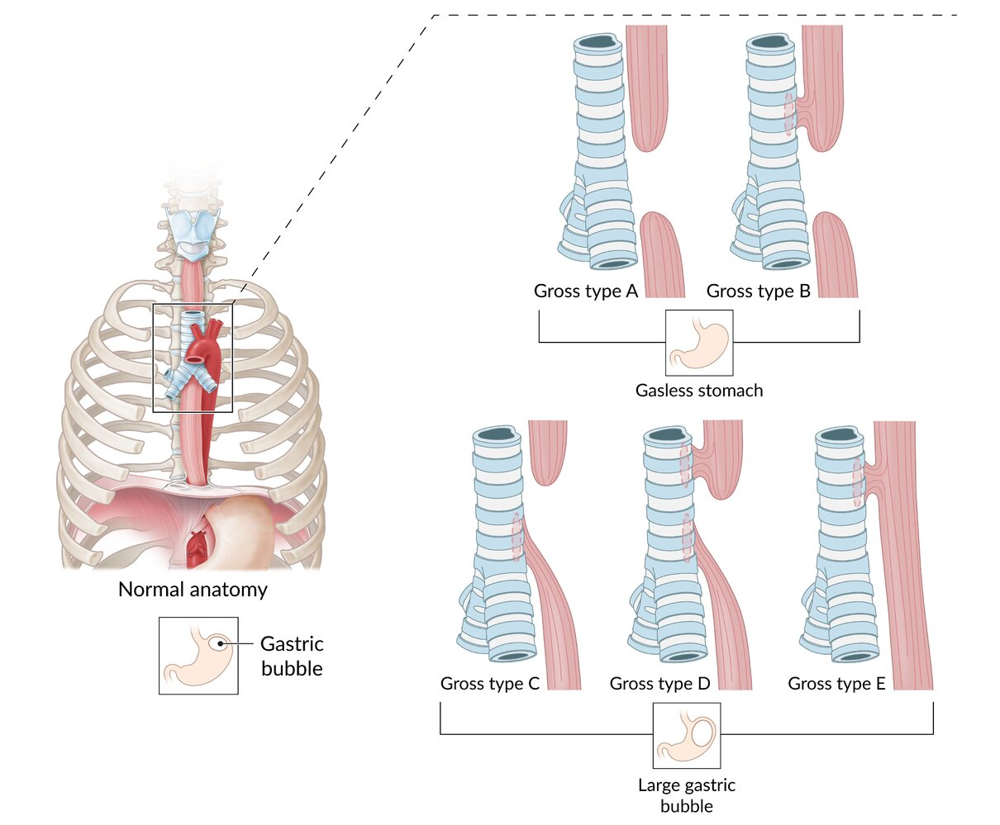
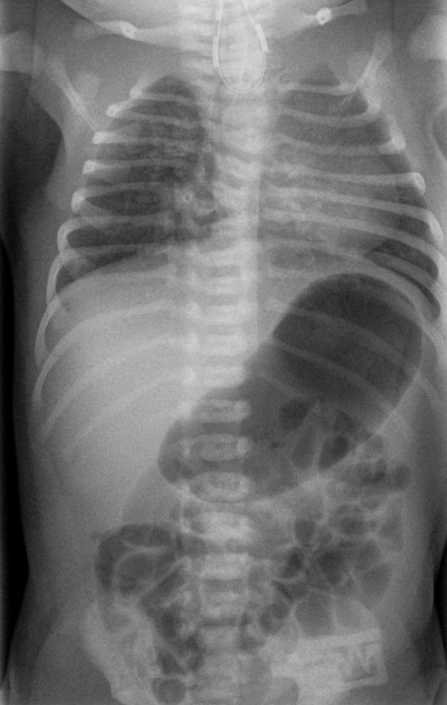
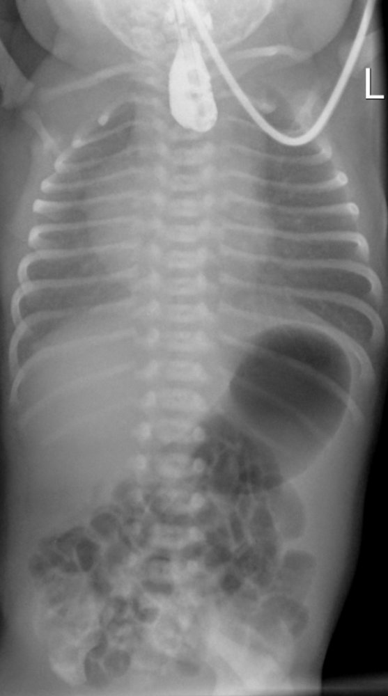
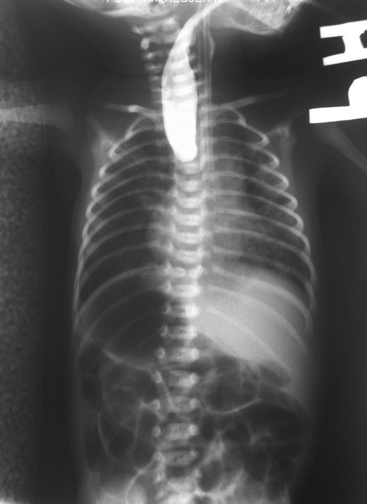
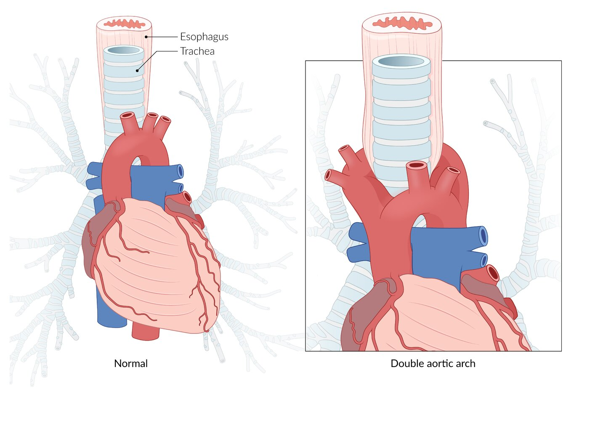
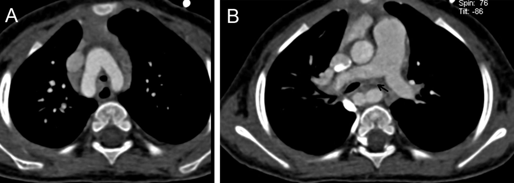

# Esophageal atresia

*Categories: Clinical knowledge > Surgery > Pediatric surgery > Esophageal atresia*

[Original Article Link](https://coursology-qbank.com/amboss/article/K40U4T)

---

## Summary

Esophageal <u>atresia</u> is a congenital defect in which the upper <u>esophagus</u> is not connected to the lower <u>esophagus</u>, ending blindly instead. It is caused by the abnormal development of the tracheoesophageal septum. Esophageal <u>atresia</u> with a <u>fistula</u> connected distally to the <u>trachea</u> is the most common kind of esophageal <u>malformation</u> (classified as Gross type C). It manifests immediately after <u>birth</u> with <u>cyanotic</u> attacks, foaming at the mouth, and <u>coughing</u>, and prevents any attempts to pass a <u>feeding tube</u> into the <u>stomach</u>. X‑ray is mandatory for classifying the <u>atresia</u> and should show an air‑filled pouch situated at the level of the third <u>thoracic vertebra</u>. <u>Infants</u> with suspected esophageal <u>atresia</u> cannot be fed orally because of the risk of <u>aspiration pneumonia</u>. Curative <u>surgery</u> must, therefore, be performed within the first 24 hours after <u>birth</u>.

---

## Overview

|  Overview of types of esophageal atresia   |  |  |  |  |  |  |
| --- | --- | --- | --- | --- | --- | --- |
|  | Type A | Type B | Type C | Type D | Type E |  |
| Description |  * Esophageal <u>atresia</u> without <u>tracheoesophageal fistula</u>   |  * Esophageal <u>atresia</u> with <u>tracheoesophageal fistula</u> connected to the <u>proximal</u> esophageal segment   |  * Esophageal <u>atresia</u> with <u>tracheoesophageal fistula</u> connected to the <u>distal</u> esophageal segment   |  * Esophageal <u>atresia</u> with <u>tracheoesophageal fistula</u> connected to the <u>proximal</u> and <u>distal</u> esophageal segments   |  * H‑type <u>tracheoesophageal fistula</u> without <u>atresia</u>   |  |
|  <u>Epidemiology</u> [[1]](https://coursology-qbank.com/amboss/article/O1cISY0)  |  * ∼ 8% of cases   |  * ∼ 1% of cases   |  * ∼ 87% of cases   |  * ∼ 1% of cases   |  * ∼ 4% of cases   |  |
| Clinical features |   * <u>Polyhydramnios</u>  * Excessive secretions/foaming at the mouth  * Choking, drooling  * Inability to feed    |   * <u>Polyhydramnios</u>  * Excessive secretions/foaming at the mouth  * Choking, drooling  * Inability to feed  * <u>Aspiration pneumonia</u>  * <u>Coughing</u> spells  * <u>Rales</u>  * <u>Cyanotic</u> attacks    |  |  |   * <u>Aspiration pneumonia</u>  * <u>Coughing</u> spells  * <u>Rales</u>  * <u>Cyanotic</u> attacks  * <u>Respiratory distress</u>    |  |
| <u>X-ray</u> findings |   * Gasless abdomen  * Esophageal pouch    |  |   * Large gastric bubble  * Esophageal pouch    |  |  * Large gastric bubble   |  |

Gross classification of esophageal atresia

References:[[2]](https://coursology-qbank.com/amboss/article/GN0Bcg)[[3]](https://coursology-qbank.com/amboss/article/tN0X1g)

---

## Pathophysiology

* A wedge of <u>mesoderm</u> called the tracheoesophageal septum separates the developing <u>foregut</u> (<u>esophagus</u>) from the <u>trachea</u>.

* Esophageal <u>atresia</u> and <u>tracheoesophageal fistula</u> are caused by a defect in mesodermal differentiation

* About 50% of cases are associated with other mesodermal defects (<u>VACTERL</u> association) [[2]](https://coursology-qbank.com/amboss/article/GN0Bcg)

* Vertebral anomaly

* Anal <u>atresia</u>

* Cardiac anomaly

* Tracheoesophageal <u>fistula</u>

* Esophageal <u>atresia</u>

* Renal anomaly

* Limb <u>malformation</u>

References:[[5]](https://coursology-qbank.com/amboss/article/JQYsCK)

---

## Clinical features

| Overview of clinical features of <u>types of esophageal atresia</u> |  |  |  |  |  |
| --- | --- | --- | --- | --- | --- |
|  | Type A | Type B | Type C | Type D | Type E |
| <u>Polyhydramnios</u> | ✓ | ✓ | ✓ | ✓ | - |
| Excessive secretions | ✓ | ✓ | ✓ | ✓ | - |
| <u>Aspiration pneumonia</u> | - | ✓ | ✓ | ✓ | ✓ |
| Gastric distention | - | - | ✓ | ✓ | ✓ |

### Esophageal <u>atresia</u>

* Definition: a congenital defect in which the upper <u>esophagus</u> is not connected to the lower <u>esophagus</u> and ends blindly instead

* Prenatal features

* <u>Polyhydramnios</u>

* The fetus is unable to swallow <u>amniotic fluid</u>.

* Occurs in approx. 57% of <u>pregnancies</u> [[6]](https://coursology-qbank.com/amboss/article/7dc4rY0)

* Associated with an increased risk of <u>premature birth</u> [[2]](https://coursology-qbank.com/amboss/article/GN0Bcg)[[7]](https://coursology-qbank.com/amboss/article/FN0g1g)[[8]](https://coursology-qbank.com/amboss/article/vN0A1g)

* Postnatal features
* Pooling of secretions → excessive secretions/foaming at the mouth [[2]](https://coursology-qbank.com/amboss/article/GN0Bcg)

* Choking, drooling

* Inability to feed

* <u>Vomiting</u>

### Congenital tracheoesophageal fistula

* Definition: an abnormal connection between the <u>trachea</u> and <u>esophagus</u> that may be connected to the <u>proximal</u> and/or <u>distal</u> esophageal segment

* Postnatal features

* <u>Aspiration</u> and subsequent <u>aspiration pneumonia</u> (especially if the <u>fistula</u> is connected to the <u>proximal</u> esophageal segment) 

* <u>Coughing</u> spells

* <u>Rales</u>

* <u>Cyanotic</u> attacks due to reflex <u>laryngospasms</u> that prevent reflux <u>aspiration</u>

* If the <u>fistula</u> is connected to the <u>distal</u> esophageal segment: gastric distention [[3]](https://coursology-qbank.com/amboss/article/tN0X1g)[[7]](https://coursology-qbank.com/amboss/article/FN0g1g)

> [!TIP]
> <u>Newborns</u> usually present with symptoms directly after <u>birth</u>. The exception is Gross type E <u>fistula</u>, in which the diagnosis of a small H-type <u>tracheoesophageal fistula</u> may occur as late as adulthood.

---

## Diagnosis

* Placement of a <u>feeding tube</u>: the <u>feeding tube</u> cannot pass through the <u>esophagus</u> in the case of esophageal <u>atresia</u> [[2]](https://coursology-qbank.com/amboss/article/GN0Bcg)

* <u>X-ray</u> of the thorax/abdomen ;  [[2]](https://coursology-qbank.com/amboss/article/GN0Bcg)

* Esophageal pouch (except with an H‑type <u>fistula</u>)

* Large gastric bubble: air in the <u>stomach</u> (gross types A and B present with a gasless abdomen)

* Further diagnostics concerning <u>VACTERL</u> anomalies

* <u>Ultrasound</u> of the abdomen

* <u>Echocardiography</u>

Esophageal atresia Gross type C (Vogt 3b)

Newborn with type C esophageal atresia

Esophageal atresia type C

---

## Differential diagnoses

### Double aortic arch

* Definition: : an embryonic <u>malformation</u> resulting in a <u>double aortic arch</u> (<u>vascular ring anomaly</u>; ) with subsequent constriction of the <u>trachea</u> and <u>esophagus</u>

* Etiology: associated with <u>CHARGE syndrome</u>, <u>DiGeorge syndrome</u>, <u>trisomy 21</u>

* Pathophysiology

* The right and left <u>pharyngeal arch arteries</u> persist postnatally → formation of a <u>vascular ring</u> (<u>double aortic arch</u>) → constriction of the <u>trachea</u> and <u>esophagus</u>.

* Feeding → ↑ constriction of the <u>trachea</u> → exacerbation of respiratory symptoms

* Clinical features [[9]](https://coursology-qbank.com/amboss/article/PlYWC6)

* Typically manifests within the first weeks of life, especially in cases of <u>tracheal</u> compression

* <u>Tracheal</u> constriction: inspiratory and <u>expiratory stridor</u>, <u>dyspnea</u>, <u>respiratory arrest</u>

* Acute episodes of severe constriction and/or <u>apnea</u> with <u>cyanosis</u> may occur (can be life-threatening)

* Hyperextension of the head to improve airflow

* Esophageal constriction: <u>dysphagia</u>, choking, retching, <u>vomiting</u>, <u>failure to thrive</u>

* Diagnostics

* <u>Chest x-ray</u> (anteroposterior and <u>lateral</u>): shows <u>anterior</u> <u>tracheal</u> bowing and narrowing

* <u>Echocardiography</u>: to identify anomaly and associated <u>congenital heart defects</u> (e.g., <u>VSD</u>, <u>tetralogy of Fallot</u>, <u>PDA</u>)

* Chest <u>CTA</u> or <u>MRA</u>: to visualize the extent of compression and the relationship of the <u>trachea</u>, <u>esophagus</u>, and vessels preoperatively

* Treatment: surgical division of the minor arch [[9]](https://coursology-qbank.com/amboss/article/PlYWC6)

Double aortic arch

Anatomy of the heart, aorta, trachea, and esophagus

Double aortic arch

### Other

|  Differential diagnoses of newborn swallowing disorders [[2]](https://coursology-qbank.com/amboss/article/GN0Bcg)[[10]](https://coursology-qbank.com/amboss/article/8N0O1g)  |  |
| --- | --- |
| Differential diagnosis | Findings |
| Esophageal <u>atresia</u> |   * Excessive secretions/foaming at the mouth  * <u>Coughing</u> spells  * <u>Cyanotic</u> attacks    |
| Status post C‑section |   * Excessive secretions  * Reversible condition, as opposed to esophageal <u>atresia</u>    |
| <u>Choanal atresia</u> |   * <u>Cyanotic</u> attacks  * Attacks normalize after crying or opening the mouth    |
| <u>Esophageal stenosis</u> |   * Delayed diagnosis (after introduction of solid food)  * <u>Dysphagia</u>  * <u>Regurgitation</u>    |
| <u>Achalasia</u> |   * Very rare during childhood  * Delayed diagnosis (after introduction of solid food)  * <u>Dysphagia</u>  * <u>Regurgitation</u>    |
| Defective <u>swallowing</u> reflex |   * <u>Central nervous system</u> disorders  * Peripheral neuromuscular disorders    |

The differential diagnoses listed here are not exhaustive.

---

## Treatment

### Preoperative

* Placement of an oroesophageal or nasoesophageal tube for continuous suction of secretions to prevent <u>aspiration</u> and facilitate breathing [[2]](https://coursology-qbank.com/amboss/article/GN0Bcg)[[3]](https://coursology-qbank.com/amboss/article/tN0X1g)

* Upper body elevated, left <u>lateral decubitus position</u> [[3]](https://coursology-qbank.com/amboss/article/tN0X1g)

* <u>Antibiotics</u> in case of <u>aspiration pneumonia</u> [[7]](https://coursology-qbank.com/amboss/article/FN0g1g)

> [!WARNING]
> <u>Infants</u> who potentially have esophageal <u>atresia</u> should not be fed orally under any circumstances!

### <u>Surgery</u>

Surgical treatment should be performed within the first 24 hours of <u>birth</u>.

* The goal is to reconnect the upper esophageal pouch and the lower <u>esophagus</u>. [[3]](https://coursology-qbank.com/amboss/article/tN0X1g)

* A long gap between both ends of the <u>esophagus</u> may not allow primary repair. [[2]](https://coursology-qbank.com/amboss/article/GN0Bcg)

* In this case, a <u>gastrostomy tube</u> is necessary to allow <u>enteral feeding</u>.

* Treatment options include promoting elongation of the <u>esophagus</u> (via the Foker technique) and <u>colon</u> interposition

### Postoperative

* Uncomplicated <u>surgery</u>: transition to a normal diet after 2–3 days [[3]](https://coursology-qbank.com/amboss/article/tN0X1g)

* <u>Anastomosis</u> under tension: postoperative ventilation (for approx. 5 days)

* Radiological examination with a contrast agent (<u>esophagram</u>) one week after <u>surgery</u> to identify complications: e.g., <u>esophageal stricture</u> or <u>anastomotic leak</u> [[2]](https://coursology-qbank.com/amboss/article/GN0Bcg)

* Approx. 4 weeks after the procedure: <u>Gastroscopy</u> (<u>EGD</u>) and dilation of the <u>anastomosis</u> may be necessary.

---