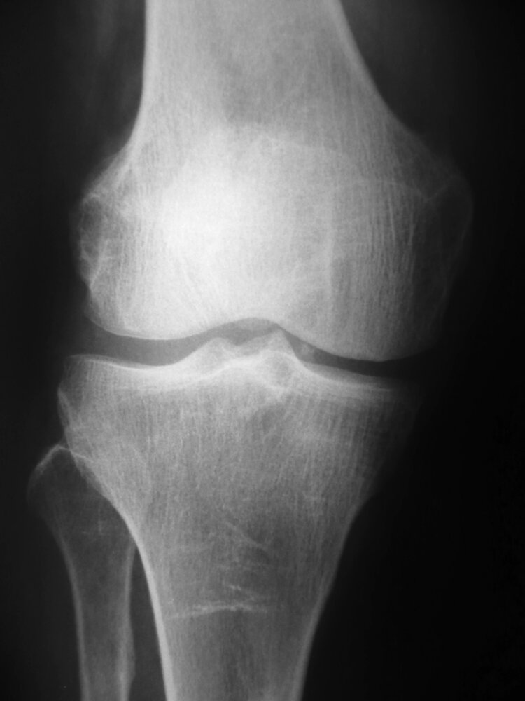
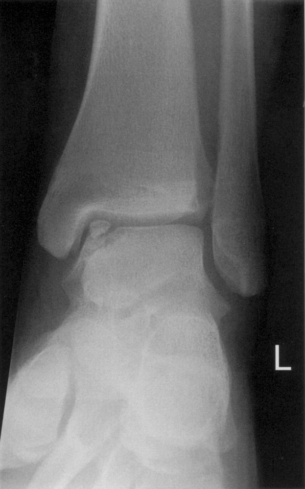
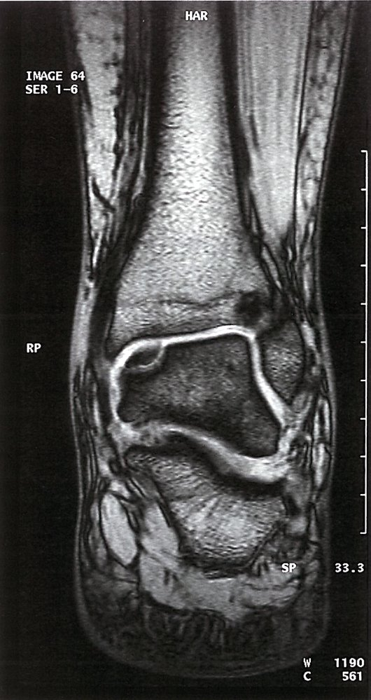

# Osteochondritis dissecans

*Categories: Clinical knowledge > Surgery > Pediatric surgery > Osteochondritis dissecans*

[Original Article Link](https://coursology-qbank.com/amboss/article/JQ0sCf)

---

## Summary

<u>Osteochondritis</u> dissecans (OD) is a focal aseptic <u>necrosis</u> of subchondral bone in which a bone-<u>cartilage</u> fragment detaches and becomes displaced in the <u>joint</u> space. School-aged children and <u>adolescents</u> are most commonly affected. OD occurs as a result of overuse or trauma, and 75% of cases affect the knee. Symptoms include <u>pain</u> and <u>joint</u> locking or catching. <u>X-ray</u> is the best initial test for suspected OD, but <u>MRI</u> is better able to detect early disease. First-line treatment includes reducing physical activity. <u>Surgery</u> is indicated if the bone-<u>cartilage</u> fragment is completely displaced and includes <u>arthroscopic</u> extraction, open fixation, and <u>transplantation</u> procedures.

---

## Definitions

* Osteochondritis: painful inflammation of the <u>cartilage</u> and/or bone

* <u>Osteochondritis</u> dissecans: focal, aseptic <u>necrosis</u> of subchondral bone caused by mechanical <u>stress</u> and/or repetitive trauma

---

## Epidemiology

* Sex: <u>♂</u> > <u>♀</u>

* Peak <u>incidence</u>: 10–20 years old

References:[[1]](https://coursology-qbank.com/amboss/article/19X2mZ0)

Epidemiological data refers to the US, unless otherwise specified.

---

## Clinical features

* Most frequently affected <u>joint</u>: knee

* In early lesions, nonlocalized <u>pain</u> during physical activity in school-aged children or <u>adolescents</u>

* Gradual stiffness with <u>joint</u> locking or catching

* <u>Antalgic gait</u> with <u>lateral</u> rotation of the <u>ipsilateral</u> foot

* <u>Pain</u> on palpation of the femoral condyles when the knee is in <u>flexion</u>

* Full <u>range of motion</u> is retained

> [!NOTE]
> Patients typically retain the full <u>range of motion</u> in the affected <u>joint</u>.

> [!NOTE]
> OD may be difficult to differentiate from <u>osteonecrosis</u>, but young patients are much more likely to have OD.

---

## Diagnosis

* <u>X-ray</u>

* Initial test

* May be normal in early stages

* More advanced lesions appear as a subchondral bony fragment surrounded by <u>radiolucency</u>.

* <u>MRI</u> 

* Used for early diagnosis in patients with persistent symptoms and normal <u>x-rays</u> and for precise staging

* May show <u>articular cartilage</u> thickening or partial detachment in early stages

> [!NOTE]
> <u>Osteochondritis</u> dissecans is a radiographic diagnosis.

Intraarticular body in the knee joint

Osteochondritis dissecans

Osteochondrosis dissecans of the talus

---

## Treatment

* <u>Conservative therapy</u>: first-line treatment

* Indications

* <u>Conservative therapy</u> may be attempted first in patients who do not have detached or displaced intra-articular fragments.

* Children are more likely to improve with <u>conservative management</u> than adults.

* Methods

* Initially, rest and limited physical activity

* <u>Physical therapy</u>

* Surgical therapy

* Indications

* Children with completely detached and displaced intra-articular fragments

* Children who have not responded to 4–6 months of <u>conservative therapy</u>

* Most adult patients with OD, although <u>conservative therapy</u> can be attempted for small or stable lesions

* Methods

* <u>Arthroscopic</u> extraction of the intra-articular loose fragment

* Other options depend on the stage and size of lesion, as well as skeletal maturity.

* Drilling into the bone

* Fixation with pins or screws with bioabsorbable fixation for loose and non-displaced fragments

* Bone <u>cartilage</u> or <u>chondrocyte</u> <u>transplantation</u>

---

## Complications

* Most patients, especially children without a loose body, heal completely without complications.

* <u>Arthritis</u>

* <u>Chronic pain</u>

* Mechanical symptoms

We list the most important complications. The selection is not exhaustive.

---