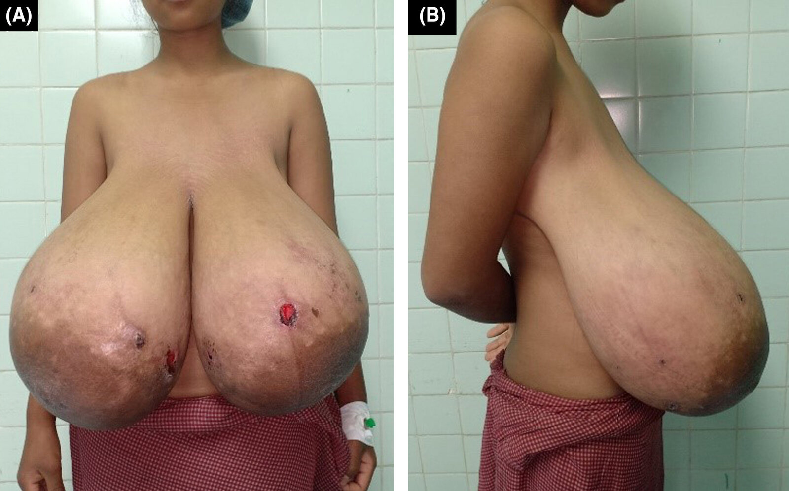

# Breast hypertrophy

*Categories: Clinical knowledge > Surgery > Plastic and hand surgery > Breast hypertrophy*

[Original Article Link](https://coursology-qbank.com/amboss/article/rG0f03)

---

## Summary

<u>Breast</u> <u>hypertrophy</u> is a rare condition that is characterized by abnormal <u>breast</u> enlargement due to excessive tissue growth. Although usually <u>idiopathic</u>, hormonal etiologies include <u>aromatase</u> excess syndrome, <u>hyperprolactinemia</u>, and increased <u>sensitivity</u> to <u>estrogen</u> and <u>progesterone</u>. Clinical features include disproportionately large <u>breasts</u>, <u>mastalgia</u>, inframammary <u>intertrigo</u>, <u>trapezius</u> <u>hypertrophy</u>, and neck, shoulder, and upper <u>back pain</u>. <u>Breast</u> <u>hypertrophy</u> is a <u>clinical diagnosis</u>; <u>laboratory studies</u> and imaging may be indicated to evaluate for an underlying etiology or to rule out other diagnoses. Surgical <u>breast</u> reduction (<u>reduction mammoplasty</u>) is the mainstay of treatment for symptomatic <u>breast</u> <u>hypertrophy</u>. <u>Conservative measures</u> (e.g., proper <u>breast</u> support, upper body <u>physiotherapy</u>) and pharmacotherapy are alternatives when <u>surgery</u> is not feasible.

---

## Definitions

* <u>Breast</u> <u>hypertrophy</u> (also termed macromastia): excessive <u>proliferation</u> of <u>breast</u> <u>connective tissue</u>, glandular <u>hypertrophy</u>, and/or <u>fatty tissue</u>, resulting in abnormal <u>breast</u> enlargement [[2]](https://coursology-qbank.com/amboss/article/hI1ccR0)

* Juvenile breast hypertrophy: the rapid enlargement of one or both <u>breasts</u> that usually begins around <u>menarche</u> [[3]](https://coursology-qbank.com/amboss/article/gl1FwS0)

* Gigantomastia: extreme <u>breast</u> <u>hypertrophy</u>  [[2]](https://coursology-qbank.com/amboss/article/hI1ccR0)[[3]](https://coursology-qbank.com/amboss/article/gl1FwS0)

---

## Clinical features

* Enlarged <u>breasts</u> (symmetrical or asymmetrical)

* <u>Mastalgia</u>

* <u>Pain</u> affecting the neck, shoulders, and upper back

* <u>Skin infections</u> and <u>erythema</u> in <u>intertriginous areas</u>

* Deep, painful bra strap grooving

* Upper extremity neuropathy

* <u>Trapezius muscle</u> <u>hypertrophy</u>

* Thoracic <u>kyphosis</u>

* Psychosocial effects

Breast hypertrophy

---

## Diagnosis

<u>Breast</u> <u>hypertrophy</u> is a <u>clinical diagnosis</u> based on features consistent with disproportionately large <u>breasts</u> for the individual's body. [[5]](https://coursology-qbank.com/amboss/article/yN1ddh0)[[6]](https://coursology-qbank.com/amboss/article/fl1kwS0)

### Clinical assessment

* Obtain a thorough history. [[3]](https://coursology-qbank.com/amboss/article/gl1FwS0)[[5]](https://coursology-qbank.com/amboss/article/yN1ddh0)

* Relevant <u>medical history</u> (e.g., <u>breast</u> masses, and rapid <u>breast</u> growth)

* Pubertal and physical development (e.g., age of <u>thelarche</u>, <u>BMI</u>)

* <u>Medication review</u> (see “Etiology” section for details)

* <u>Family history</u> of <u>breast cancer</u> or other <u>breast</u> conditions

* Perform a <u>clinical breast examination</u> (<u>CBE</u>).  [[3]](https://coursology-qbank.com/amboss/article/gl1FwS0)

* Assess for masses and asymmetry.

* Evaluate the inframammary folds for <u>intertrigo</u> or other abnormalities.

### <u>Laboratory studies</u> [[3]](https://coursology-qbank.com/amboss/article/gl1FwS0)[[7]](https://coursology-qbank.com/amboss/article/vN1A1h0)

* Not routinely indicated

* <u>Estradiol</u>, <u>progesterone</u>, <u>prolactin</u>, <u>FSH</u>, <u>LH</u>, and/or urine <u>HCG</u> may be considered to identify potential causes (e.g., hormonal imbalance, <u>pregnancy</u>) or rule out alternative diagnoses.

### Imaging [[3]](https://coursology-qbank.com/amboss/article/gl1FwS0)[[7]](https://coursology-qbank.com/amboss/article/vN1A1h0)[[8]](https://coursology-qbank.com/amboss/article/mqcV_W0)

* Indications: to rule out alternative diagnoses or evaluate a <u>palpable breast mass</u> [[3]](https://coursology-qbank.com/amboss/article/gl1FwS0)[[8]](https://coursology-qbank.com/amboss/article/mqcV_W0)

* Modalities: <u>Ultrasound</u> and <u>MRI</u> are preferred over <u>mammography</u>.  [[7]](https://coursology-qbank.com/amboss/article/vN1A1h0)

---

## Management

### <u>Surgery</u> [[3]](https://coursology-qbank.com/amboss/article/gl1FwS0)[[5]](https://coursology-qbank.com/amboss/article/yN1ddh0)

* Indications: symptomatic <u>breast</u> <u>hypertrophy</u>

* Procedures

* Reduction mammoplasty: preferred option [[3]](https://coursology-qbank.com/amboss/article/gl1FwS0)

* Removal of excessive <u>breast</u> <u>parenchyma</u>, fat, and <u>skin</u>

* May affect the patient's ability to breastfeed

* Bilateral <u>total mastectomy</u> with <u>breast reconstruction</u>: alternative option [[3]](https://coursology-qbank.com/amboss/article/gl1FwS0)[[7]](https://coursology-qbank.com/amboss/article/vN1A1h0)

### <u>Conservative management</u> [[5]](https://coursology-qbank.com/amboss/article/yN1ddh0)[[7]](https://coursology-qbank.com/amboss/article/vN1A1h0)

* Indications [[5]](https://coursology-qbank.com/amboss/article/yN1ddh0)

* <u>Risk factors</u> for surgical complications

* Patient preference for <u>conservative therapy</u>

* Measures

* Use of a proper-fitting, supportive bra

* Upper body <u>physical therapy</u>

* Pharmacotherapy (under specialist guidance)  [[7]](https://coursology-qbank.com/amboss/article/vN1A1h0)

* <u>Antiestrogen therapy</u> (e.g., <u>tamoxifen</u>)

* <u>Progesterone</u> or <u>progestin</u> therapy (e.g., dydrogesterone, <u>medroxyprogesterone</u>)

* <u>Bromocriptine</u>

* <u>Danazol</u>

> [!TIP]
> Consider alternatives to <u>progestin</u>-containing <u>contraception in adolescents</u>. <u>Exogenous</u> <u>progestin-only contraception</u> may initially exacerbate <u>breast</u> <u>hypertrophy</u>, but it is not associated with continued <u>breast</u> tissue growth. [[9]](https://coursology-qbank.com/amboss/article/Zm1ZVh0)

---