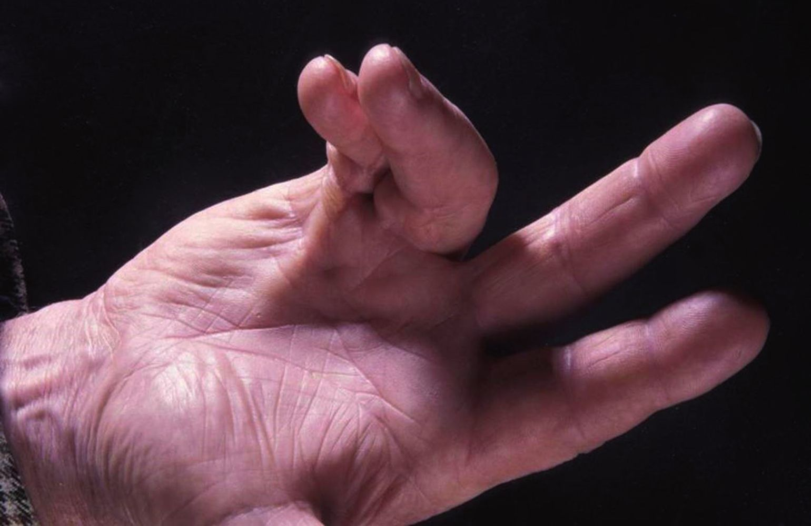
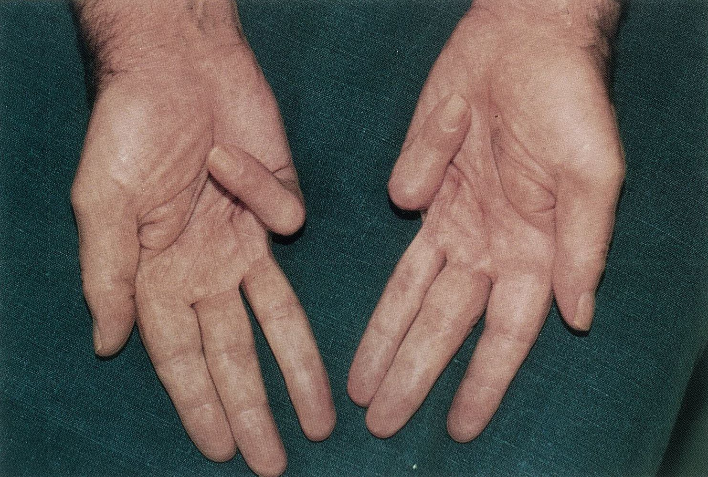
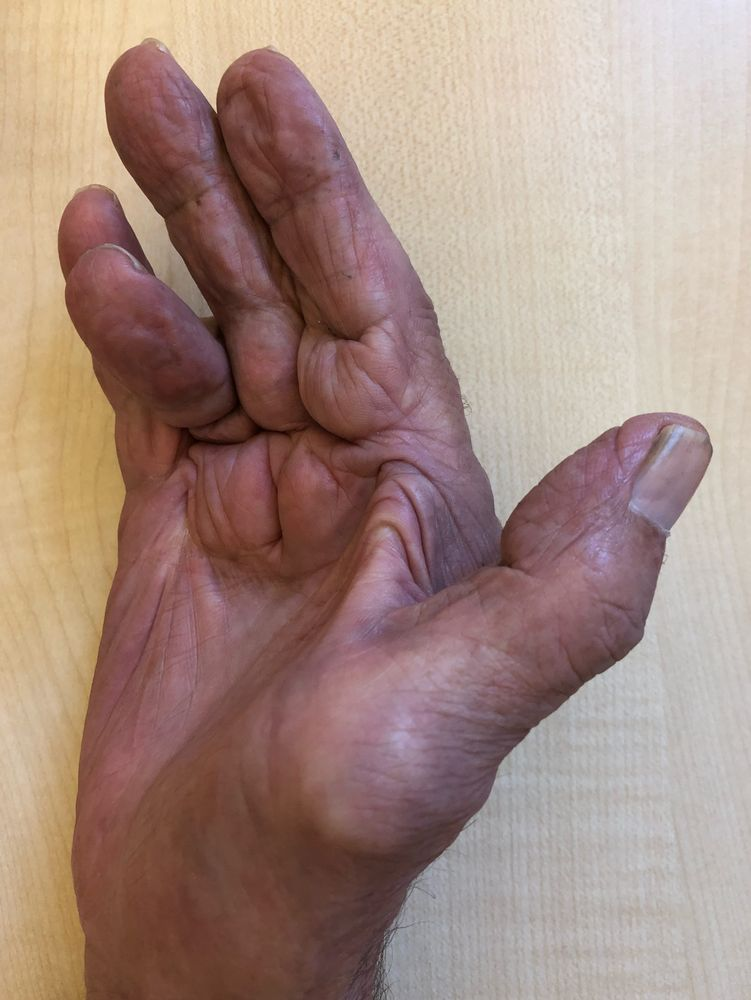
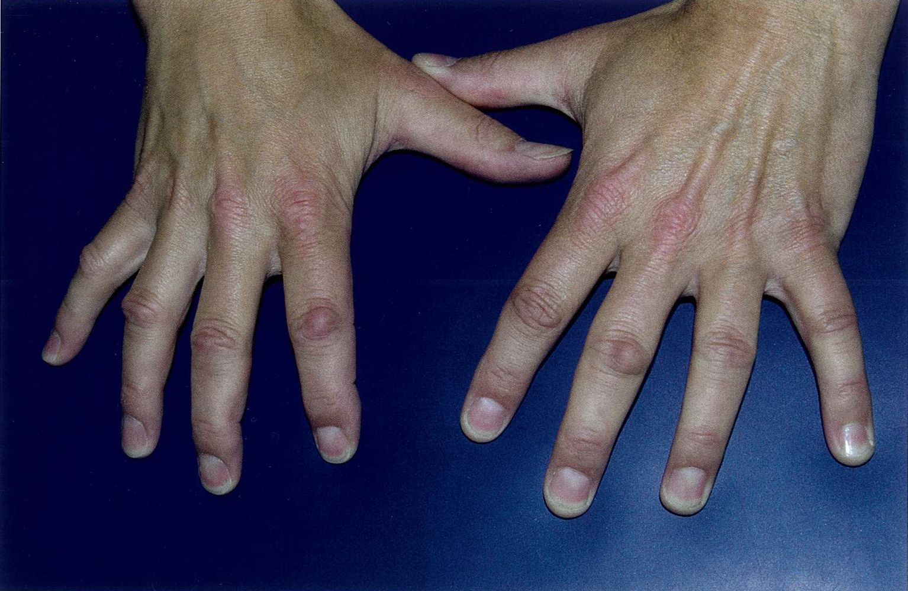
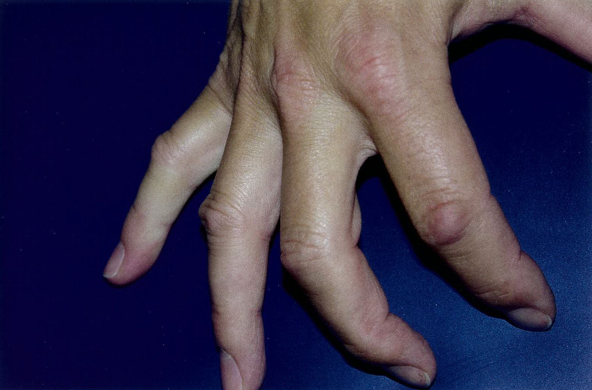

# Dupuytren contracture

*Categories: Clinical knowledge > Surgery > Plastic and hand surgery > Dupuytren contracture*

[Original Article Link](https://coursology-qbank.com/amboss/article/hQ0cDf)

---

## Summary

Dupuytren <u>contracture</u> is a common fibroproliferative disorder that affects the <u>palmar fascia</u>, mainly of the 4th and 5th fingers, and more commonly affects men than women. The exact cause is unknown. Trauma (e.g., from manual <u>labor</u>, pneumatic tools) or <u>ischemic</u> injury (e.g., from <u>cigarette smoking</u>, <u>diabetes</u>) are thought to stimulate <u>fibroblast</u> <u>proliferation</u> and <u>collagen</u> deposition in the <u>palmar fascia</u> of genetically susceptible individuals. Early signs include palpable <u>palmar</u> <u>nodules</u> or <u>skin</u> thickening, puckering, or pitting adjacent to the <u>distal</u> <u>palmar</u> crease. As the disease progresses, thick <u>palmar</u> cords develop, limiting extension of the affected digits, eventually leading to <u>flexion</u> <u>contractures</u>. Diagnosis is usually clinical. Management depends on disease severity; options for patients with mild disease include observation, as disease progression is often slow and may even regress, and intralesional <u>steroid</u> injections. For patients with functional impairment or significant <u>flexion</u> <u>contractures</u>, intervention such as intralesional <u>collagenase</u> injections, needle aponeurotomy, or <u>surgery</u> is recommended. Recurrence is common.

---

## Epidemiology

* <u>Prevalence</u>: 4–6%  [[1]](https://coursology-qbank.com/amboss/article/fYXko9)[[2]](https://coursology-qbank.com/amboss/article/SYXyo9)

* Peak <u>incidence</u>: 40–60 years  [[3]](https://coursology-qbank.com/amboss/article/2YXTo9)

* Sex: <u>♂</u> > <u>♀</u> [[4]](https://coursology-qbank.com/amboss/article/-ZVDVG0)

Epidemiological data refers to the US, unless otherwise specified.

---

## Etiology

The exact etiology is unknown, but several factors appear to play a role in the development of the disease.

* Genetic predisposition: ∼ 70% of patients have a positive <u>family history</u>. [[5]](https://coursology-qbank.com/amboss/article/dbXos9)

* <u>Autoimmunity</u>: There is evidence of <u>T-cell</u> accumulation in the <u>fibrotic</u> tissue from the <u>contracture</u> sites, which suggests a possible autoimmune origin of the disease. [[6]](https://coursology-qbank.com/amboss/article/VbXGs9)[[7]](https://coursology-qbank.com/amboss/article/UbXbG9)

* <u>Risk factors</u>: these factors may cause <u>ischemic</u> injury of the <u>palmar fascia</u> with subsequent development of Dupuytren <u>contracture</u> in genetically predisposed individuals [[4]](https://coursology-qbank.com/amboss/article/-ZVDVG0)[[8]](https://coursology-qbank.com/amboss/article/c0VaUG0)[[9]](https://coursology-qbank.com/amboss/article/oyd0Ts0)

* <u>Cigarette smoking</u>

* Recurrent trauma;  (e.g., use of pneumatic tools used in construction, manual <u>labor</u>)

* <u>Diabetes</u>

* <u>Heavy alcohol use</u>  [[8]](https://coursology-qbank.com/amboss/article/c0VaUG0)

---

## Pathophysiology

* Dupuytren <u>contracture</u> (<u>palmar</u> fibromatosis) is a fibroproliferative disorder of the <u>palmar fascia</u>  [[10]](https://coursology-qbank.com/amboss/article/Ei08tf)

* Injury (trauma/<u>ischemia</u>) to the <u>palmar fascia</u> triggers <u>myofibroblasts</u> → <u>fibroblast</u> <u>proliferation</u> and <u>collagen</u> (<u>collagen type</u> III) deposition ;   → thickening of the <u>palmar</u> <u>fascia</u> → formation of <u>nodules</u> in the <u>palmar fascia</u>

* The <u>nodules</u> are adherent to the overlying <u>dermis</u> → characteristic puckering of <u>palmar</u> <u>skin</u> [[11]](https://coursology-qbank.com/amboss/article/kydm2s0)

* <u>Nodules</u> progress to form cords in the <u>palmar</u> <u>fascia</u> → <u>flexion</u> contractures ;   of the <u>palmar fascia</u>

---

## Clinical features

Dupuytren <u>contracture</u> typically manifests as painless <u>palmar</u> <u>contractures</u>, most commonly affecting the 4th and 5th fingers. Bilateral involvement is common.  [[9]](https://coursology-qbank.com/amboss/article/oyd0Ts0)[[11]](https://coursology-qbank.com/amboss/article/kydm2s0)

* Early disease [[9]](https://coursology-qbank.com/amboss/article/oyd0Ts0)[[12]](https://coursology-qbank.com/amboss/article/OydI2s0)

* Palpable <u>palmar</u> <u>nodule</u> or <u>skin</u> thickening, puckering, or pitting adjacent to the <u>distal</u> <u>palmar</u> crease

* Function is not usually impaired.

* Advanced disease [[9]](https://coursology-qbank.com/amboss/article/oyd0Ts0)[[12]](https://coursology-qbank.com/amboss/article/OydI2s0)

* Palpable <u>palmar</u> cord

* Limited finger extension

* <u>Flexion</u> <u>contractures</u> of the <u>metacarpophalangeal joint</u> (<u>MCP</u>) and the <u>proximal interphalangeal joint</u> (<u>PIP</u>) of the affected digits

* Restricted <u>activities of daily living</u> (e.g., difficulty dressing, combing <u>hair</u>, washing, or putting hands in pockets)

* Signs of concurrent fibromatoses may be present, e.g.: [[12]](https://coursology-qbank.com/amboss/article/OydI2s0)

* Knuckle pads (Garrod nodules) 

* Fibrofatty pads over the <u>dorsal</u> aspect of the <u>PIPs</u>

* May be tender

* Associated with aggressive disease [[12]](https://coursology-qbank.com/amboss/article/OydI2s0)

* Plantar fibromatosis (Ledderhose disease)

* <u>Plantar</u> equivalent of Dupuytren <u>contracture</u>

* Characterized by <u>fibrosis</u> of the <u>plantar fascia</u>

* <u>Peyronie disease</u>

Dupuytren contracture 

Dupuytren contracture

Dupuytren contracture

Knuckle pads (Garrod nodes)

Knuckle pads (Garrod nodes)

---

## Differential diagnoses

| Differential diagnosis of Dupuytren contracture |  |  |
| --- | --- | --- |
| Condition | Etiology | Clinical features |
|  Palmar fasciitis [[16]](https://coursology-qbank.com/amboss/article/pydLTs0) |   * As part of a <u>paraneoplastic syndrome</u> (e.g., ovarian/gastric/<u>colon</u> <u>malignancy</u>) [[17]](https://coursology-qbank.com/amboss/article/SbXyG9)  * In association with <u>polyarthritis</u>, e.g., <u>rheumatoid arthritis</u> (palmar fasciitis with polyarthritis syndrome)    |   * All fingers bilaterally affected (more extensive than in Dupuytren <u>contracture</u>)  * Progressive <u>flexion</u> <u>contractures</u>    |
| <u>Claw hand deformity</u> |  * <u>Proximal</u> <u>ulnar nerve lesion</u>   |   * Extension of the <u>MCP</u> with <u>PIP</u> and <u>DIP</u> <u>flexion</u>  * 4th and 5th fingers affected  * Numbness of the ulnar aspect of the palm    |
|  <u>Stenosing tenosynovitis</u> (<u>trigger finger</u>) [[13]](https://coursology-qbank.com/amboss/article/6ydjTs0) |   * Over-use <u>tendinitis</u>  * Systemic diseases (<u>rheumatoid arthritis</u>, <u>diabetes mellitus</u>)  * <u>Infectious tenosynovitis</u>    |   * Painful locking of a finger in flexed position; releases suddenly with a snap/pop on extension  * A tender <u>nodule</u> is often palpable at the base of the <u>metacarpophalangeal joint</u>  * Mostly affects thumbs and ring fingers    |

The differential diagnoses listed here are not exhaustive.

---

## Treatment

### General principles [[12]](https://coursology-qbank.com/amboss/article/OydI2s0)[[18]](https://coursology-qbank.com/amboss/article/GydBgs0)

* Treatment depends on disease stage. 

* <u>Conservative measures</u> may be considered in early disease before there is functional impairment.

* Refer patients with advanced disease or functional impairment to a specialist (e.g., hand <u>surgeon</u>) for intervention.

* Manage <u>modifiable risk factors</u>, e.g.:

* <u>Counsel on smoking cessation</u>.

* <u>Counsel on alcohol use disorder</u>.

* <u>Manage diabetes</u>.

### Early disease [[12]](https://coursology-qbank.com/amboss/article/OydI2s0)[[18]](https://coursology-qbank.com/amboss/article/GydBgs0)

* Observation

* <u>Physiotherapy</u> and splinting

* Intralesional <u>steroid</u> injections

* Can flatten and soften <u>nodules</u> [[18]](https://coursology-qbank.com/amboss/article/GydBgs0)

* Does not limit disease progression [[12]](https://coursology-qbank.com/amboss/article/OydI2s0)

* <u>Radiotherapy</u>: emerging therapy to prevent disease progression [[12]](https://coursology-qbank.com/amboss/article/OydI2s0)[[18]](https://coursology-qbank.com/amboss/article/GydBgs0)[[19]](https://coursology-qbank.com/amboss/article/tydXSs0)

### Advanced disease

* Refer to a specialist for intervention if any of the following are present: [[9]](https://coursology-qbank.com/amboss/article/oyd0Ts0)[[12]](https://coursology-qbank.com/amboss/article/OydI2s0)

* Functional impairment

* Positive <u>table top test</u>

* Progressive <u>contractures</u>

* <u>MCP</u> <u>flexion</u> deformity ≥ 30°

* <u>PIP</u> <u>flexion</u> deformity ≥ 15°

* Choice of intervention depends on <u>contracture</u> severity and patient tolerance for symptom recurrence.  [[11]](https://coursology-qbank.com/amboss/article/kydm2s0)[[12]](https://coursology-qbank.com/amboss/article/OydI2s0)

* Intralesional collagenase <u>Clostridium</u> histolyticum injections

* Needle aponeurotomy

* <u>Surgery</u>;  (limited or radical fasciectomy): <u>gold standard</u> for severe <u>contractures</u> [[12]](https://coursology-qbank.com/amboss/article/OydI2s0)

---